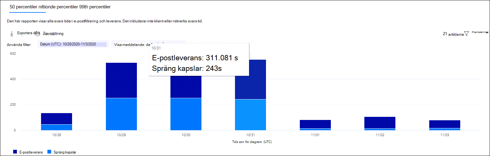
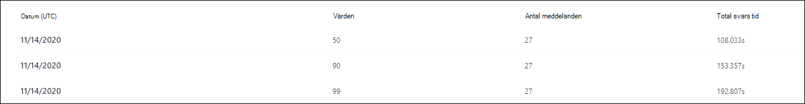

# Visa Defender för Office 365 rapporter i instrumentpanelen Rapporter i Säkerhets- & Efterlevnadscenter

[!INCLUDE [Microsoft 365 Defender rebranding](../includes/microsoft-defender-for-office.md)]

**Gäller för**
- [Microsoft Defender för Office 365 Abonnemang 1 och Abonnemang 2](defender-for-office-365.md)
- [Microsoft 365 Defender](../defender/microsoft-365-defender.md)

Microsoft Defender för Office 365-organisationer (till exempel Microsoft 365 E5-prenumerationer eller Microsoft Defender för Office 365 abonnemang 1 eller Microsoft Defender för tillägg för Office 365 Abonnemang 2) innehåller en mängd olika säkerhetsrelaterade rapporter. Om du har nödvändiga [behörigheter kan](#what-permissions-are-needed-to-view-the-defender-for-office-365-reports)du visa de här rapporterna i Säkerhets- & genom att gå till **Instrumentpanelen** \> **rapporter.** Gå direkt till instrumentpanelen Rapporter genom att öppna <https://protection.office.com/insightdashboard> .

## Typrapport för Defender for Office 365

I **rapporten Defender Office 365 filtyper visas** vilken typ av filer som identifierats som skadliga av Valv bifogade [filer.](safe-attachments.md)

 Den samlade vyn för rapporten tillåter 90 dagars filtrering, medan detaljvyn bara tillåter 10 dagars filtrering.

Om du vill visa rapporten öppnar du [Säkerhets- & Kompatibilitetscenter](https://protection.office.com), går till **Reports** Dashboard och väljer \>  Defender **Office 365 filtyper.** Gå direkt till rapporten genom att öppna <https://protection.office.com/reportv2?id=ATPFileReport> .

> [!NOTE]
> Informationen i den här rapporten är också tillgänglig i [Defender för Office 365 dispositionsrapport.](#defender-for-office-365-message-disposition-report)

### Rapportvyn för Defender för Office 365 av filtyper

Följande vyer är tillgängliga:

- **Visa data efter: Arkiv:** Diagrammet innehåller följande information:

  - **Skadliga Excel bifogade filer**
  - **Skadliga Flash-bifogade filer**
  - **Skadliga bifogade PDF-filer**
  - **Skadliga PowerPoint bifogade filer**
  - **Skadliga URL:er**
  - **Skadliga bifogade Word-filer**
  - **Skadliga körbara bifogade filer**
  - **Andra**

  När du hovrar över en viss dag (datapunkt) kan du se en uppdelning av typer av skadliga filer som upptäckts av [Valv Bifogade](safe-attachments.md) filer och skydd mot skadlig programvara [i EOP.](anti-malware-protection.md)

  

  Om du **klickar på** Filter kan du ändra rapporten med följande filter:

  - **Startdatum och** **slutdatum**
  - Samma filtypsvärden som visas i diagrammet.

- **Visa data efter: Meddelande:** Diagrammet innehåller följande information:

  - **Blockera åtkomst**
  - **Meddelanden har ersatts**
  - **Meddelanden övervakade**
  - **Ersatts av Dynamisk e-postleverans:** Mer information finns [i Principer för dynamisk Valv och bifogade filer.](safe-attachments.md#dynamic-delivery-in-safe-attachments-policies)

  

  Om du **klickar på** Filter kan du ändra rapporten med följande filter:

  - **Startdatum och** **slutdatum**
  - Samma dispositionsvärden för meddelanden som är tillgängliga i diagrammet och ytterligare **Meddelanden som överförs..**

### Detaljtabellvyn för Defender för Office 365 filtyper

Om du **klickar på Visa** informationstabell ger rapporten en nästan realtidsvy över alla klick som har hänt inom organisationen de senaste 10 dagarna. Vilken information som visas beror på diagrammet du visade:

- **Visa data efter: Arkiv**:

  - **Datum**
  - **Mottagaradress**
  - **Avsändarens adress**
  - **Meddelande-ID:** Tillgängligt i **sidhuvudet för meddelande-ID** i meddelandehuvudet och ska vara unikt. Ett exempelvärde är `<08f1e0f6806a47b4ac103961109ae6ef@server.domain>` (observera vinkelparenteserna).
  - **Fil**

  Om du **klickar på** Filter kan du ändra rapporten med följande filter:

  - **Startdatum och** **slutdatum**
  - Samma filtypsvärden som visas i diagrammet.

- **Visa data efter: Meddelande:**

  - **Datum**
  - **Mottagaradress**
  - **Avsändarens adress**
  - **Meddelande-ID**
  - **Fil**
  - **Ämne**

  Om du **klickar på** Filter kan du ändra resultatet med följande filter:

  - **Startdatum och** **slutdatum**
  - Samma dispositionsvärden för meddelanden som är tillgängliga i diagrammet och ytterligare **Meddelanden som överförs..**

Gå tillbaka till rapportvyn genom att klicka på **Visa rapport.**

## Rapport om meddelandeborttagning i Office 365

Rapporten **ATP Message Disposition** visar de åtgärder som har vidtagits för e-postmeddelanden som identifierats med skadligt innehåll.

Om du vill visa rapporten öppnar du [Säkerhets- & Efterlevnadscenter](https://protection.office.com), går till instrumentpanelen rapporter och väljer Defender för  \>  Office 365 disposition **av meddelanden.** Gå direkt till rapporten genom att öppna <https://protection.office.com/reportv2?id=ATPMessageReport> .

> [!NOTE]
> Informationen i den här rapporten är också tillgänglig i [defender för Office 365 filtyper.](#defender-for-office-365-file-types-report)

### Rapportvyn för Defender för Office 365 meddelandets dispositionsrapport

Följande vyer är tillgängliga:

- **Visa data efter: Meddelande:** Diagrammet innehåller följande information:

  - **Blockera åtkomst**
  - **Meddelanden har ersatts**
  - **Meddelanden övervakade**
  - **Ersatts av Dynamisk e-postleverans:** Mer information finns [i Principer för dynamisk Valv och bifogade filer.](safe-attachments.md#dynamic-delivery-in-safe-attachments-policies)

  

  Om du **klickar på** Filter kan du ändra rapporten med följande filter:

  - **Startdatum och** **slutdatum**
  - Samma dispositionsvärden för meddelanden som är tillgängliga i diagrammet och ytterligare **Meddelanden som överförs..**

- **Visa data efter: Arkiv:** Diagrammet innehåller följande information:

  - **Skadliga Excel bifogade filer**
  - **Skadliga Flash-bifogade filer**
  - **Skadliga bifogade PDF-filer**
  - **Skadliga PowerPoint bifogade filer**
  - **Skadliga URL:er**
  - **Skadliga bifogade Word-filer**
  - **Skadliga körbara bifogade filer**
  - **Andra**

  När du hovrar över en viss dag (datapunkt) kan du se en uppdelning av typer av skadliga filer som upptäckts av [Valv Bifogade](safe-attachments.md) filer och skydd mot skadlig programvara [i EOP.](anti-malware-protection.md)

  

  Om du **klickar på** Filter kan du ändra rapporten med följande filter:

  - **Startdatum och** **slutdatum**
  - Samma filtypsvärden som visas i diagrammet.

### Detaljtabellvyn för Defender för Office 365 meddelande dispositionsrapport

Om du **klickar på Visa** informationstabell ger rapporten en nästan realtidsvy över alla klick som har hänt inom organisationen de senaste 10 dagarna. Vilken information som visas beror på diagrammet du visade:

- **Visa data efter: Meddelande:**

  - **Datum**
  - **Mottagaradress**
  - **Avsändarens adress**
  - **Meddelande-ID**
  - **Fil**
  - **Ämne**

  Om du **klickar på** Filter kan du ändra resultatet med följande filter:

  - **Startdatum och** **slutdatum**
  - Samma dispositionsvärden för meddelanden som är tillgängliga i diagrammet och ytterligare **Meddelanden som överförs..**

- **Visa data efter: Arkiv**:

  - **Datum**
  - **Mottagaradress**
  - **Avsändarens adress**
  - **Meddelande-ID**
  - **Fil**

  Om du **klickar på** Filter kan du ändra rapporten med följande filter:

  - **Startdatum och** **slutdatum**
  - Samma filtypsvärden som visas i diagrammet.

Gå tillbaka till rapportvyn genom att klicka på **Visa rapport.**

## E-postsvarstid – rapport

I **rapporten E-postsvarstid** visas en samlad vy av den e-postleverans och detonationstid som har varit lång inom organisationen. Leveranstiderna för e-post i tjänsten påverkas av ett antal faktorer och den absoluta leveranstiden i sekunder är ofta inte en bra indikator på ett lyckat resultat eller ett problem. En långsam leveranstid på en dag kan ses som en genomsnittlig leveranstid på en annan dag eller tvärtom. Svarstiden **för E-post** försöker kvalificera meddelandeleveransen baserat på statistiska data om observerade leveranstider för andra meddelanden:

- **50:e percentilen**: Det här är mitten för leveranstid för meddelanden. Du kan betrakta det här värdet som en genomsnittlig leveranstid.
- **90:e percentilen**: Det här anger en lång svarstid för meddelandeleveransen. Det tog bara 10 % längre tid än det här värdet att leverera.
- **99:e percentilen**: Det här anger den högsta svarstiden för meddelandeleveransen.

Klientsidan och nätverksfördröjning ingår inte.

Om du vill visa rapporten öppnar du [Säkerhets- & Kompatibilitetscenter](https://protection.office.com), går till  \> **instrumentpanelen rapporter** och väljer **E-postfördröjningsrapport.** Gå direkt till rapporten genom att öppna <https://protection.office.com/mailLatencyReport?viewid=P50> .

### Rapportvy för e-postsvarstidsrapporten

När du öppnar rapporten är den **50:e percentilfliken** markerad som standard.

Som standard innehåller den här vyn ett diagram som är konfigurerat med följande filter:

- **Datum:** De senaste sju dagarna
- **Meddelandevy:**
  - Detonerade meddelanden

Det här diagrammet visar meddelanden ordnade i följande kategorier:

- **Svarstid för e-postleverans**
- **Detonationsfördröjning**

När du hovrar över en kategori i diagrammet kan du se en uppdelning av svarstiden i varje kategori.

Om du **klickar på** Filter i rapportvyn kan du ändra resultatet med följande filter:

- Alla meddelanden
- Meddelanden som innehåller bifogade filer eller URL-adresser

Om du klickar på den **90:e** percentilfliken eller på den **99:e** percentilfliken används samma standardfilter från vyn för de **50:e percentilerna.**

### Detaljtabellvyn för e-postsvarstidsrapporten

Följande information visas i detaljtabellvyn:

- **Datum**
- **Percentiler**
- **Antal meddelanden**
- **Total svarstid**

Ovanstående visar att den genomsnittliga svarstiden för alla meddelanden som levererats och detonerats den **108,033** sekunder den 14 november.

Informationstabellen innehåller samma information på varje flik.

## Statusrapport för hotskydd

Statusrapporten **För skydd** mot hot är en vy som samlar information om skadligt innehåll och skadlig e-post som identifieras och blockeras av [Exchange Online Protection](exchange-online-protection-overview.md) (EOP) och Microsoft Defender för Office 365. Mer information finns i [Statusrapport för skydd mot hot.](view-email-security-reports.md#threat-protection-status-report)

## Rapport om skydd mot URL-hot

Rapporten **om skydd mot URL-hot** ger sammanfattnings- och trendvyer för identifierade hot och åtgärder som vidtas på URL-klick som en del av Valv [Länkar.](safe-links.md) Du kan inte klicka på data från användare i Valv länkprincipen som har markerats med alternativet Spåra inte **användarklick.**

Om du vill visa rapporten öppnar du [Säkerhets- & Kompatibilitetscenter](https://protection.office.com), går till **Rapporter** \> **instrumentpanel** och väljer **URL-skyddsrapport**. Gå direkt till rapporten genom att öppna <https://protection.office.com/reportv2?id=URLProtectionActionReport> .

> [!NOTE]
> Det här är en *rapport om skyddtrender,* vilket innebär att data representerar trender i en större datauppsättning. Därför är data i mängdvyn inte tillgängliga i realtid här, men data i detaljtabellvyn är det, så du kan se en liten avvikelse mellan de två vyerna.

### Rapportvy för rapporten om URL-skydd mot hot

Rapporten **om skydd mot URL-hot** har två aggregerade vyer som uppdateras en gång var fjärde timme och som visar data för de senaste 90 dagarna:

- **Åtgärden URL-klickskydd:** Visar antalet URL-klick som användare i organisationen har klickat på och resultatet av klicket:

  - **Blockerad** (användaren blockerades från att navigera till URL:en)
  - **Blockeras och klickas igenom** (användaren har valt att fortsätta navigera till URL-adressen)
  - **Klickade igenom under genomsökningen** (användaren har klickat på länken innan genomsökningen slutfördes)

  Ett klick anger att användaren har klickat igenom blockeringssidan till den skadliga webbplatsen (administratörer kan inaktivera klicka i Valv-länkar).

  Om du **klickar på** Filter kan du ändra rapporten med följande filter:

  - **Startdatum och** **slutdatum**
  - De tillgängliga åtgärderna för klickskydd plus värdet **Tillåts** (användaren tillåts navigera till URL-adressen).

  

- **URL-klick på** program: Visar antalet URL-klickningar efter program som stöder Valv länkar:

  - **E-postklient**
  - **PowerPoint**
  - **Word**
  - **Excel**
  - **OneNote**
  - **Visio**
  - **Teams**
  - **Annat**

  Om du **klickar på** Filter kan du ändra rapporten med följande filter:

  - **Startdatum och** **slutdatum**
  - Tillgängliga program.

### Detaljtabellvy för rapporten om url-hotskydd

Om du **klickar på Visa** informationstabell ger rapporten en nästan realtidsvy över alla klick som har hänt inom organisationen de senaste 7 dagarna med följande information:

- **Klicktid**
- **Användare**
- **URL**
- **Åtgärd**
- **Program**

Om du klickar **på** Filter i detaljtabellvyn kan du filtrera efter samma  villkor  som i rapportvyn och även efter Domäner eller Mottagare avgränsade med kommatecken.

> [!NOTE]
> Filtret **Domäner** refererar till den URL-domän som visas i rapportresultatet. 

Gå tillbaka till rapportvyn genom att klicka på **Visa rapport.**

## Ytterligare rapporter att visa

Utöver rapporterna som beskrivs i den här artikeln finns det flera andra rapporter tillgängliga, enligt beskrivningen i följande tabell:

****

|Rapport|Ämne|
|---|---|
|**Utforskaren** (Microsoft Defender Office 365 abonnemang 2) eller identifieringar i realtid **(Microsoft** Defender för Office 365 abonnemang 1)|[Hotutforskaren (och realtidsidentifieringar)](threat-explorer.md)|
|**Säkerhetsrapporter för** e-post, till exempel rapporten De största avsändarna och mottagarna, förfalskningsrapporten och rapporten Om identifiering av skräppost.|[Visa e-postsäkerhetsrapporter i Säkerhets- & Säkerhets- och efterlevnadscenter](view-email-security-reports.md)|
|**E-postflödesrapporter,** till exempel vidarebefordransrapporten, statusrapporten E-postflöde och rapporten Betrodda avsändare och mottagare.|[Visa e-postflödesrapporter i Säkerhets- & Säkerhets- och efterlevnadscenter](view-mail-flow-reports.md)|
|**URL-spårning för Valv länkar** (endast PowerShell). I utdata för den här cmdleten visas resultatet Valv åtgärder under de senaste sju dagarna.|[Get-UrlTrace](/powershell/module/exchange/get-urltrace)|
|**E-posttrafikresultat för EOP och Microsoft Defender för Office 365** (endast PowerShell). Utdata för denna cmdlet innehåller information om Domän, Datum, Händelsetyp, Riktning, Åtgärd och Antal meddelanden.|[Get-MailTrafficATPReport](/powershell/module/exchange/get-mailtrafficatpreport)|
|**E-postdetaljrapporter för EOP och Defender Office 365 identifieringar** (endast PowerShell). Utdata från denna cmdlet innehåller information om skadliga filer eller URL:er, nätfiskeförsök, personifiering och andra potentiella hot i e-postmeddelanden och filer.|[Get-MailDetailATPReport](/powershell/module/exchange/get-maildetailatpreport)|
|

## Vilka behörigheter krävs för att visa Defender för Office 365 rapporter?

För att kunna visa och använda rapporterna som beskrivs i den här artikeln måste du vara medlem i någon av följande rollgrupper i Säkerhets- och & Efterlevnadscenter:

- **Organisationshantering**
- **Säkerhetsadministratör**
- **Säkerhetsläsare**
- **Global läsare**

Mer information finns i [Behörigheter i Säkerhets- och efterlevnadscentret](permissions-in-the-security-and-compliance-center.md).

**Obs!** Om du lägger till användare till motsvarande Azure Active Directory-roll i administrationscentret för Microsoft 365 får  användarna de behörigheter som krävs i säkerhets- och efterlevnadscentret för & och behörigheter för andra Microsoft 365. Mer information finns i [Om administratörsroller](../../admin/add-users/about-admin-roles.md).

## Vad händer om rapporterna inte visar data?

Om du inte ser data i Defender för Office 365 kontrollerar du att dina principer är korrekt konfigurerade. Organisationen måste ha [principer Valv länkar](set-up-safe-links-policies.md) och principer [Valv](set-up-safe-attachments-policies.md) för att Defender Office 365 ska finnas på plats. Se även [Skydd mot skräppost och skadlig programvara.](anti-spam-and-anti-malware-protection.md)

## Relaterade ämnen

[Smarta rapporter och insikter i Säkerhets- & Efterlevnadscenter](reports-and-insights-in-security-and-compliance.md)

[Rollbehörigheter (Azure Active Directory](/azure/active-directory/users-groups-roles/directory-assign-admin-roles#role-permissions)
