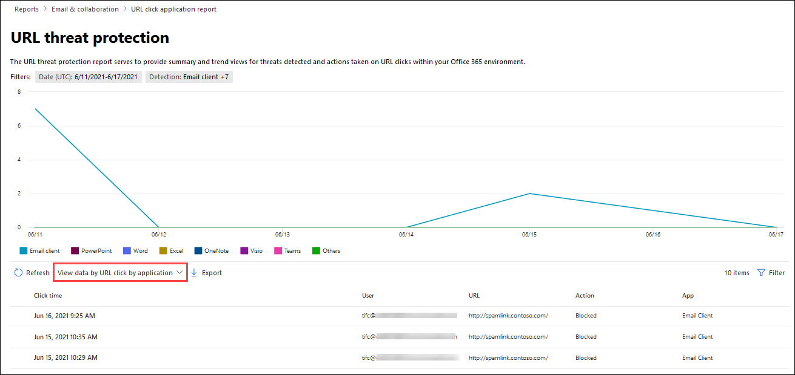

# Visa Defender för Office 365 i Microsoft 365 Defender portalenView Defender for Office 365 reports in the Microsoft 365 Defender portal

[!INCLUDE [Microsoft 365 Defender rebranding](../includes/microsoft-defender-for-office.md)]

**Gäller för****Applies to**
- [Microsoft Defender för Office 365 Abonnemang 1 och Abonnemang 2Microsoft Defender for Office 365 plan 1 and plan 2](defender-for-office-365.md)
- [Microsoft 365 DefenderMicrosoft 365 Defender](../defender/microsoft-365-defender.md)

Microsoft Defender för Office 365-organisationer (till exempel Microsoft 365 E5-prenumerationer eller Microsoft Defender för Office 365 abonnemang 1 eller Microsoft Defender för tillägg för Office 365 Abonnemang 2) innehåller en mängd olika säkerhetsrelaterade rapporter.Microsoft Defender for Office 365 organizations (for example, Microsoft 365 E5 subscriptions or Microsoft Defender for Office 365 Plan 1 or Microsoft Defender for Office 365 Plan 2 add-ons) contain a variety of security-related reports. Om du har [nödvändiga](#what-permissions-are-needed-to-view-the-defender-for-office-365-reports)behörigheter kan du visa de här rapporterna  i Microsoft 365 Defender-portalen genom att gå till Rapporterar e-& för samarbete \>  \> **E& och samarbetsrapporter.**If you have the [necessary permissions](#what-permissions-are-needed-to-view-the-defender-for-office-365-reports), you can view these reports in the Microsoft 365 Defender portal by going to **Reports** \> **Email & collaboration** \> **Email & collaboration reports**. Om du vill gå direkt **till sidan & e-post och** samarbetsrapporter öppnar du <https://security.microsoft.com/emailandcollabreport> .To go directly to the **Email & collaboration reports** page, open <https://security.microsoft.com/emailandcollabreport>.

> [!NOTE]
>
> Säkerhetsrapporter för e-post som inte kräver Defender för Office 365 beskrivs i Visa [e-postsäkerhetsrapporter i Microsoft 365 Defender portalen.](view-email-security-reports.md)Email security reports that don't require Defender for Office 365 are described in [View email security reports in the Microsoft 365 Defender portal](view-email-security-reports.md).
>
> Rapporter som är relaterade till e-postflödet finns nu Exchange administrationscenter (EAC).Reports that are related to mail flow are now in the Exchange admin center (EAC). Mer information om rapporterna finns i [E-postflödesrapporter i det nya Exchange administrationscentret.](/exchange/monitoring/mail-flow-reports/mail-flow-reports)For more information about these reports, see [Mail flow reports in the new Exchange admin center](/exchange/monitoring/mail-flow-reports/mail-flow-reports).

## Valv Rapport över bifogade filerSafe Attachments file types report

> [!NOTE]
> Rapporten **Valv bifogade filer försvinner** så småningom.The **Safe Attachments file types report** will eventually go away. Samma information är tillgänglig i rapporten [om skydd mot hot.](#threat-protection-status-report)The same information is available in the [Threat protection status report](#threat-protection-status-report).

## Valv Dispositionsrapport för bifogade filerSafe Attachments message disposition report

> [!NOTE]
> Dispositionen **Valv bifogade filer försvinner** så småningom.The **Safe Attachments message disposition report** will eventually go away. Samma information är tillgänglig i rapporten [om skydd mot hot.](#threat-protection-status-report)The same information is available in the [Threat protection status report](#threat-protection-status-report).

## E-postsvarstid – rapportMail latency report

I **rapporten E-postsvarstid** visas en samlad vy av den e-postleverans och detonationstid som har varit lång inom organisationen.The **Mail latency report** shows you an aggregate view of the mail delivery and detonation latency experienced within your organization. Leveranstiderna för e-post i tjänsten påverkas av ett antal faktorer och den absoluta leveranstiden i sekunder är ofta inte en bra indikator på ett lyckat resultat eller ett problem.Mail delivery times in the service are affected by a number of factors, and the absolute delivery time in seconds is often not a good indicator of success or a problem. En långsam leveranstid på en dag kan ses som en genomsnittlig leveranstid på en annan dag eller tvärtom.A slow delivery time on one day might be considered an average delivery time on another day, or vice-versa. Meddelandet levereras som kvalificerar sig baserat på statistiska data om observerade leveranstider för andra meddelanden.This tries to qualify message delivery based on statistical data about the observed delivery times of other messages.

Klientsidan och nätverksfördröjning ingår inte.Client side and network latency are not included.

Om du vill visa rapporten öppnar du [Microsoft 365 Defender portalen](https://security.microsoft.com)och går till **Rapporterar** \> **e-& samarbete** \> **E& samarbetsrapporter**.To view the report, open the [Microsoft 365 Defender portal](https://security.microsoft.com), go to **Reports** \> **Email & collaboration** \> **Email & collaboration reports**. På sidan **E& över samarbetsrapporter hittar** du Svarstidsrapport för **e-post** och klickar sedan **på Visa information.**On the **Email & collaboration reports** page, find **Mail latency report** and then click **View details**. Gå direkt till rapporten genom att öppna <https://security.microsoft.com/mailLatencyReport> .To go directly to the report, open <https://security.microsoft.com/mailLatencyReport>.

På sidan **E-postfördröjningsrapport** är följande flikar tillgängliga på **sidan Med svarstid för e-post:**On the **Mail latency report** page, the following tabs are available on the **Mail latency report** page:

- **50:e percentilen**: Det här är mitten för leveranstid för meddelanden.**50th percentile**: This is the middle for message delivery times. Du kan betrakta det här värdet som en genomsnittlig leveranstid.You can consider this value as an average delivery time. Den här fliken är markerad som standard.This tab is selected by default.
- **90:e percentilen**: Det här anger en lång svarstid för meddelandeleveransen.**90th percentile**: This indicates a high latency for message delivery. Det tog bara 10 % längre tid än det här värdet att leverera.Only 10% of messages took longer than this value to deliver.
- **99:e percentilen**: Det här anger den högsta svarstiden för meddelandeleveransen.**99th percentile**: This indicates the highest latency for message delivery.

Oavsett vilken flik du väljer visas meddelanden ordnade i följande kategorier i diagrammet:Regardless of the tab you select, the chart shows messages organized into the following categories:

- **Svarstid för e-postleverans****Mail delivery latency**
- **Detonationer****Detonations**

När du hovrar över en kategori i diagrammet kan du se en uppdelning av svarstiden i varje kategori.When you hover over a category in the chart, you can see a breakdown of the latency in each category.

Om du klickar **på Filter** kan du filtrera både diagrammet och informationstabellen med hjälp av följande värden:If you click **Filter**, you can filter both the chart and the details table by the following values:

- **Datum (UTC)**: **Startdatum** **och slutdatum****Date (UTC)**: **Start date** and **End date**
- **Meddelandevy:** Något av följande värden:**Message view**: One of the following values:
  - **Alla meddelanden****All messages**
  - **Meddelanden som innehåller bifogade filer eller URL-adresser****Messages that contain attachments or URLs**
  - **Detonerade meddelanden****Detonated messages**

När du är klar med att konfigurera filtren klickar du **på Använd**, **Avbryt** eller **Rensa filter.**When you're finished configuring the filters, click **Apply**, **Cancel**, or **Clear filters**.

I informationstabellen under diagrammet finns följande information tillgänglig:In the details table below the chart, the following information is available:

- **Datum (UTC)****Date (UTC)**
- **Percentiler:** **50,** **90** eller **99****Percentiles**: **50**, **90**, or **99**
- **Antal meddelanden****Message count**
- **Total svarstid****Overall latency**

## Statusrapport för hotskyddThreat protection status report

Statusrapporten **För skydd** mot hot är en vy som samlar information om skadligt innehåll och skadlig e-post som identifieras och blockeras av [Exchange Online Protection](exchange-online-protection-overview.md) (EOP) och Microsoft Defender för Office 365.The **Threat protection status** report is a single view that brings together information about malicious content and malicious email detected and blocked by [Exchange Online Protection](exchange-online-protection-overview.md) (EOP) and Microsoft Defender for Office 365. Mer information finns i [Statusrapport för skydd mot hot.](view-email-security-reports.md#threat-protection-status-report)For more information, see [Threat protection status report](view-email-security-reports.md#threat-protection-status-report).

## Rapport om skydd mot URL-hotURL threat protection report

Rapporten **om skydd mot URL-hot** ger sammanfattnings- och trendvyer för identifierade hot och åtgärder som vidtas på URL-klick som en del av Valv [Länkar.](safe-links.md)The **URL threat protection report** provides summary and trend views for threats detected and actions taken on URL clicks as part of [Safe Links](safe-links.md). Du kan inte klicka på data från användare i Valv länkprincipen som har markerats med alternativet Spåra inte **användarklick.**This report will not have click data from users where the Safe Links policy applied has the **Do not track user clicks** option selected.

Om du vill visa rapporten öppnar du [Microsoft 365 Defender portalen](https://security.microsoft.com)och går till **Rapporterar** \> **e-& samarbete** \> **E& samarbetsrapporter**.To view the report, open the [Microsoft 365 Defender portal](https://security.microsoft.com), go to **Reports** \> **Email & collaboration** \> **Email & collaboration reports**. På sidan **E& och samarbetsrapporter** hittar du **sidan URL-skydd** och klickar sedan **på Visa information.**On the **Email & collaboration reports** page, find **URL protection page** and then click **View details**. Gå direkt till rapporten genom att öppna <https://security.microsoft.com/reports/URLProtectionActionReport> .To go directly to the report, open <https://security.microsoft.com/reports/URLProtectionActionReport>.

De tillgängliga vyerna på **sidan för skydd mot URL-hot** beskrivs i följande avsnitt.The available views on the **URL threat protection** report page are described in the following sections.

> [!NOTE]
> Det här är en *rapport om skyddtrender,* vilket innebär att data representerar trender i en större datauppsättning.This is a *protection trend report*, meaning data represents trends in a larger dataset. Därför är data i diagrammen inte tillgängliga i realtid här, men data i detaljtabellen är det, så du kan se en liten avvikelse mellan dem.As a result, the data in the charts is not available in real time here, but the data in the details table is, so you may see a slight discrepancy between the two. Diagrammen uppdateras en gång var fjärde timme och innehåller data för de senaste 90 dagarna.The charts are refreshed once every four hours and contain data for the last 90 days.

### Visa data via URL,klickskyddsåtgärdView data by URL click protection action

I **åtgärdsvyn Visa data via URL** klickar du på Skydd visas antalet URL-klick som användare i organisationen har klickat på och resultatet av klicket:The **View data by URL click protection action** view shows the number of URL clicks by users in the organization and the results of the click:

- **Tillåtet:** Användaren har tillåtits att navigera till URL-adressen.**Allowed**: The user was allowed to navigate to the URL.
- **Blockerad:** Användaren blockerades från att navigera till URL-adressen.**Blocked**: The user was blocked from navigating to the URL.
- **Blockeras och klickas igenom:** Användaren har valt att fortsätta navigera till URL-adressen.**Blocked and clicked through**: The user has chosen to continue navigating to the URL.
- **Klickade igenom under genomsökningen:** Användaren har klickat på länken innan genomsökningen var klar.**Clicked through during scan**: The user has clicked on the link before the scan was complete.

Ett klick anger att användaren har klickat igenom blockeringssidan till den skadliga webbplatsen (administratörer kan inaktivera klicka i Valv-länkar).A click indicates that the user has clicked through the block page to the malicious website (admins can disable click through in Safe Links policies).

Om du klickar **på** Filter kan du ändra rapporten och detaljtabellen genom att välja ett eller flera av följande värden i den utfällade menyn som visas:If you click **Filters**, you can modify the report and the details table by selecting one or more of the following values in the flyout that appears:

- **Datum (UTC)**: **Startdatum** **och slutdatum****Date (UTC)**: **Start date** and **End date**
- **Identifiering:****Detection**:
  - **Tillåts****Allowed**
  - **Blockeras****Blocked**
  - **Blockeras och klickas igenom****Blocked and clicked through**
  - **Klickade igenom under genomsökning****Clicked through during scan**
- **Domäner**: URL-domänerna som visas i rapportresultaten.**Domains**: The URL domains listed in the report results.
- **Mottagare****Recipients**

När du är klar med att konfigurera filtren klickar du **på Använd**, **Avbryt** eller **Rensa filter.**When you're finished configuring the filters, click **Apply**, **Cancel**, or **Clear filters**.

I detaljtabellen under diagrammet visas följande närtidsvy över alla klick som har hänt inom organisationen de senaste 7 dagarna:The details table below the chart provides the following near-real-time view of all clicks that happened within the organization for the last 7 days:

- **Klicktid****Click time**
- **Användare****User**
- **URL****URL**
- **Åtgärd****Action**
- **Program****App**

### Visa data per URL, klicka på efter programView data by URL click by application

I **vyn Visa data per URL som klickas** på efter programvy visas antalet URL-klickningar från appar som stöder Valv Länkar:The **View data by URL click by application** view shows the number of URL clicks by apps that support Safe Links:

- **E-postklient****Email client**
- **PowerPoint****PowerPoint**
- **Word****Word**
- **Excel****Excel**
- **OneNote****OneNote**
- **Visio****Visio**
- **Teams****Teams**
- **Andra****Others**

Om du klickar **på** Filter kan du ändra rapporten och detaljtabellen genom att välja ett eller flera av följande värden i den utfällade menyn som visas:If you click **Filters**, you can modify the report and the details table by selecting one or more of the following values in the flyout that appears:

- **Datum (UTC)**: **Startdatum** **och slutdatum****Date (UTC)**: **Start date** and **End date**
- **Identifiering:** Tillgängliga appar från diagrammet.**Detection**: Available apps from the chart.
- **Domäner**: URL-domänerna som visas i rapportresultaten.**Domains**: The URL domains listed in the report results.
- **Mottagare****Recipients**

När du är klar med att konfigurera filtren klickar du **på Använd**, **Avbryt** eller **Rensa filter.**When you're finished configuring the filters, click **Apply**, **Cancel**, or **Clear filters**.

I detaljtabellen under diagrammet visas följande närtidsvy över alla klick som har hänt inom organisationen de senaste 7 dagarna:The details table below the chart provides the following near-real-time view of all clicks that happened within the organization for the last 7 days:

- **Klicktid****Click time**
- **Användare****User**
- **URL****URL**
- **Åtgärd****Action**
- **Program****App**

## Ytterligare rapporter att visaAdditional reports to view

Utöver rapporterna som beskrivs i den här artikeln finns det flera andra rapporter tillgängliga, enligt beskrivningen i följande tabell:In addition to the reports described in this article, several other reports are available, as described in the following table:

 

****

|RapportReport|ÄmneTopic|
|---|---|
|**Utforskaren** (Microsoft Defender Office 365 abonnemang 2) eller identifieringar i realtid **(Microsoft** Defender för Office 365 abonnemang 1)**Explorer** (Microsoft Defender for Office 365 Plan 2) or **real-time detections** (Microsoft Defender for Office 365 Plan 1)|[Hotutforskaren (och realtidsidentifieringar)Threat Explorer (and real-time detections)](threat-explorer.md)|
|**Säkerhetsrapporter för** e-post, till exempel rapporten De största avsändarna och mottagarna, förfalskningsrapporten och rapporten Om identifiering av skräppost.**Email security reports**, such as the Top senders and recipients report, the Spoof mail report, and the Spam detections report.|[Visa e-postsäkerhetsrapporter på Microsoft 365 Defender portalenView email security reports in the Microsoft 365 Defender portal](view-email-security-reports.md)|
|**E-postflödesrapporter,** till exempel vidarebefordransrapporten, statusrapporten E-postflöde och rapporten Betrodda avsändare och mottagare.**Mail flow reports**, such as the Forwarding report, the Mailflow status report, and the Top senders and recipients report.|[E-postflödesrapporter i det Exchange administrationscentretMail flow reports in the new Exchange admin center](/exchange/monitoring/mail-flow-reports/mail-flow-reports)|
|**URL-spårning för Valv länkar** (endast PowerShell).**URL trace for Safe Links** (PowerShell only). I utdata för den här cmdleten visas resultatet Valv åtgärder under de senaste sju dagarna.The output of this cmdlet shows you the results of Safe Links actions over the past seven days.|[Get-UrlTraceGet-UrlTrace](/powershell/module/exchange/get-urltrace)|
|**E-posttrafikresultat för EOP och Microsoft Defender för Office 365** (endast PowerShell).**Mail traffic results for EOP and Microsoft Defender for Office 365** (PowerShell only). Utdata för denna cmdlet innehåller information om Domän, Datum, Händelsetyp, Riktning, Åtgärd och Antal meddelanden.The output of this cmdlet contains information about Domain, Date, Event Type, Direction, Action, and Message Count.|[Get-MailTrafficATPReportGet-MailTrafficATPReport](/powershell/module/exchange/get-mailtrafficatpreport)|
|**E-postdetaljrapporter för EOP och Defender Office 365 identifieringar** (endast PowerShell).**Mail detail reports for EOP and Defender for Office 365 detections** (PowerShell only). Utdata från denna cmdlet innehåller information om skadliga filer eller URL:er, nätfiskeförsök, personifiering och andra potentiella hot i e-postmeddelanden och filer.The output of this cmdlet contains details about malicious files or URLs, phishing attempts, impersonation, and other potential threats in email or files.|[Get-MailDetailATPReportGet-MailDetailATPReport](/powershell/module/exchange/get-maildetailatpreport)|
|

## Vilka behörigheter krävs för att visa Defender för Office 365 rapporter?What permissions are needed to view the Defender for Office 365 reports?

För att kunna visa och använda rapporterna som beskrivs i den här artikeln måste du vara medlem i någon av följande rollgrupper i Microsoft 365 Defender portalen:In order to view and use the reports described in this article, you need to be a member of one of the following role groups in the Microsoft 365 Defender portal:

- **Organisationshantering****Organization Management**
- **Säkerhetsadministratör****Security Administrator**
- **Säkerhetsläsare****Security Reader**
- **Global Reader****Global Reader**

Mer information finns i [Behörigheter i Microsoft 365 Defender portal](permissions-in-the-security-and-compliance-center.md).For more information, see [Permissions in the Microsoft 365 Defender portal](permissions-in-the-security-and-compliance-center.md).

**Obs!** Om du lägger till användare i motsvarande Azure Active Directory-roll i Administrationscenter för Microsoft 365 får användarna  de behörigheter som krävs i Microsoft 365 Defender-portalen och behörigheter för andra funktioner Microsoft 365.**Note**: Adding users to the corresponding Azure Active Directory role in the Microsoft 365 admin center gives users the required permissions in the Microsoft 365 Defender portal _and_ permissions for other features in Microsoft 365. Mer information finns i [Om administratörsroller](../../admin/add-users/about-admin-roles.md).For more information, see [About admin roles](../../admin/add-users/about-admin-roles.md).

## Vad händer om rapporterna inte visar data?What if the reports aren't showing data?

Om du inte ser data i Defender för Office 365 kontrollerar du att dina principer är korrekt konfigurerade.If you are not seeing data in your Defender for Office 365 reports, double-check that your policies are set up correctly. Organisationen måste ha [principer Valv länkar](set-up-safe-links-policies.md) och principer [Valv](set-up-safe-attachments-policies.md) för att Defender Office 365 ska finnas på plats.Your organization must have [Safe Links policies](set-up-safe-links-policies.md) and [Safe Attachments policies](set-up-safe-attachments-policies.md) defined in order for Defender for Office 365 protection to be in place. Se även [Skydd mot skräppost och skadlig programvara.](anti-spam-and-anti-malware-protection.md)Also see [Anti-spam and anti-malware protection](anti-spam-and-anti-malware-protection.md).

## Relaterade ämnenRelated topics

[Smarta rapporter och insikter i Microsoft 365 Defender portalenSmart reports and insights in the Microsoft 365 Defender portal](reports-and-insights-in-security-and-compliance.md)

[Rollbehörigheter (Azure Active DirectoryRole permissions (Azure Active Directory](/azure/active-directory/users-groups-roles/directory-assign-admin-roles#role-permissions)
