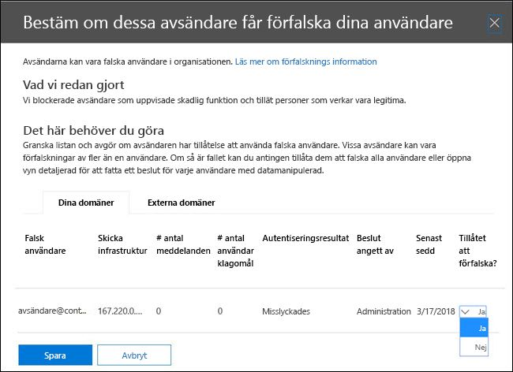
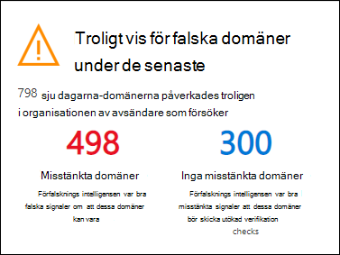
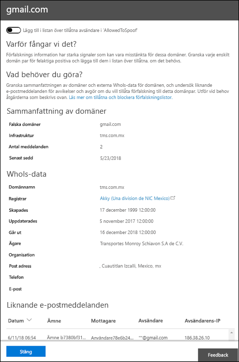

# <a name="manage-spoofed-senders-using-the-spoof-intelligence-policy-and-spoof-intelligence-insight-in-eop"></a><span data-ttu-id="5966d-103">Hantera förfalskningsavsändare med förfalsknings- och förfalskningsinformation i EOP</span><span class="sxs-lookup"><span data-stu-id="5966d-103">Manage spoofed senders using the spoof intelligence policy and spoof intelligence insight in EOP</span></span>

[!INCLUDE [Microsoft 365 Defender rebranding](../includes/microsoft-defender-for-office.md)]

<span data-ttu-id="5966d-104">**Gäller för**</span><span class="sxs-lookup"><span data-stu-id="5966d-104">**Applies to**</span></span>
- [<span data-ttu-id="5966d-105">Microsoft Defender för Office 365 Abonnemang 1 och Abonnemang 2</span><span class="sxs-lookup"><span data-stu-id="5966d-105">Microsoft Defender for Office 365 plan 1 and plan 2</span></span>](defender-for-office-365.md)
- [<span data-ttu-id="5966d-106">Microsoft 365 Defender</span><span class="sxs-lookup"><span data-stu-id="5966d-106">Microsoft 365 Defender</span></span>](../defender/microsoft-365-defender.md)

> [!NOTE]
> <span data-ttu-id="5966d-107">I den här artikeln beskrivs den äldre version av hantering av avsändare som ersätts.</span><span class="sxs-lookup"><span data-stu-id="5966d-107">This article describes the older spoofed sender management experience that's being replaced.</span></span> <span data-ttu-id="5966d-108">Mer information om den nya upplevelsen finns i [Förfalskningsinformation i EOP](learn-about-spoof-intelligence.md)</span><span class="sxs-lookup"><span data-stu-id="5966d-108">For more information about the new experience, see [Spoof intelligence insight in EOP](learn-about-spoof-intelligence.md)</span></span>

<span data-ttu-id="5966d-109">I Microsoft 365 organisationer som har postlådor i Exchange Online eller fristående EOP-organisationer (Exchange Online Protection) utan Exchange Online-postlådor skyddas inkommande e-postmeddelanden automatiskt mot förfalskning via EOP från och med oktober 2018.</span><span class="sxs-lookup"><span data-stu-id="5966d-109">In Microsoft 365 organizations with mailboxes in Exchange Online or standalone Exchange Online Protection (EOP) organizations without Exchange Online mailboxes, inbound email messages are automatically protected against spoofing by EOP as of October 2018.</span></span> <span data-ttu-id="5966d-110">EOP använder **förfalskningsinformation som** en del av organisationens totala skydd mot nätfiske.</span><span class="sxs-lookup"><span data-stu-id="5966d-110">EOP uses **spoof intelligence** as part of your organization's overall defense against phishing.</span></span> <span data-ttu-id="5966d-111">Mer information finns i [Skydd mot förfalskning i EOP.](anti-spoofing-protection.md)</span><span class="sxs-lookup"><span data-stu-id="5966d-111">For more information, see [Anti-spoofing protection in EOP](anti-spoofing-protection.md).</span></span>

<span data-ttu-id="5966d-112">Standardprincipen (och endast) **förfalskningsinformation** bidrar till att förfalskningsmeddelanden som skickas av legitima avsändare inte fångas i EOP-skräppostfilter och samtidigt skyddar användarna från skräppost- och nätfiskeattacker.</span><span class="sxs-lookup"><span data-stu-id="5966d-112">The default (and only) **spoof intelligence policy** helps ensure that the spoofed email sent by legitimate senders doesn't get caught up in EOP spam filters while protecting your users from spam or phishing attacks.</span></span> <span data-ttu-id="5966d-113">Du kan också använda **Spoof Intelligence-insikt** för att snabbt avgöra vilka externa avsändare som på ett legitimt sätt skickar oauthenticerad e-post (meddelanden från domäner som inte klarar SPF-, DKIM- eller DMARC-kontroller).</span><span class="sxs-lookup"><span data-stu-id="5966d-113">You can also use the **Spoof intelligence insight** to quickly determine which external senders are legitimately sending you unauthenticated email (messages from domains that don't pass SPF, DKIM, or DMARC checks).</span></span>

<span data-ttu-id="5966d-114">Du kan hantera & förfalskningsinformation i Säkerhets- och efterlevnadscenter eller i PowerShell (Exchange Online PowerShell för Microsoft 365-organisationer med postlådor i Exchange Online, fristående EOP PowerShell för organisationer utan Exchange Online-postlådor).</span><span class="sxs-lookup"><span data-stu-id="5966d-114">You can manage spoof intelligence in the Security & Compliance Center, or in PowerShell (Exchange Online PowerShell for Microsoft 365 organizations with mailboxes in Exchange Online; standalone EOP PowerShell for organizations without Exchange Online mailboxes).</span></span>

## <a name="what-do-you-need-to-know-before-you-begin"></a><span data-ttu-id="5966d-115">Vad behöver jag veta innan jag börjar?</span><span class="sxs-lookup"><span data-stu-id="5966d-115">What do you need to know before you begin?</span></span>

- <span data-ttu-id="5966d-116">Öppna Säkerhets- och efterlevnadscentret på <https://protection.office.com/>.</span><span class="sxs-lookup"><span data-stu-id="5966d-116">You open the Security & Compliance Center at <https://protection.office.com/>.</span></span>
  - <span data-ttu-id="5966d-117">Om du vill gå **direkt till sidan inställningar för skydd** mot skräppost för förfalskningsprincipen använder du <https://protection.office.com/antispam> .</span><span class="sxs-lookup"><span data-stu-id="5966d-117">To go directly to the **Anti-spam settings** page for the spoof intelligence policy, use <https://protection.office.com/antispam>.</span></span>
  - <span data-ttu-id="5966d-118">Om du vill gå direkt **till sidan Säkerhetsinstrumentpanel** för förfalskningsinformation använder du <https://protection.office.com/searchandinvestigation/dashboard> .</span><span class="sxs-lookup"><span data-stu-id="5966d-118">To go directly to the **Security dashboard** page for the spoof intelligence insight, use <https://protection.office.com/searchandinvestigation/dashboard>.</span></span>

- <span data-ttu-id="5966d-119">Information om hur du använder Windows PowerShell för att ansluta till Exchange Online finns i artikeln om att [ansluta till Exchange Online PowerShell](/powershell/exchange/connect-to-exchange-online-powershell).</span><span class="sxs-lookup"><span data-stu-id="5966d-119">To connect to Exchange Online PowerShell, see [Connect to Exchange Online PowerShell](/powershell/exchange/connect-to-exchange-online-powershell).</span></span> <span data-ttu-id="5966d-120">Information om hur du ansluter till fristående EOP PowerShell finns i [Anslut till Exchange Online Protection PowerShell](/powershell/exchange/connect-to-exchange-online-protection-powershell).</span><span class="sxs-lookup"><span data-stu-id="5966d-120">To connect to standalone EOP PowerShell, see [Connect to Exchange Online Protection PowerShell](/powershell/exchange/connect-to-exchange-online-protection-powershell).</span></span>

- <span data-ttu-id="5966d-121">Du måste ha tilldelats behörigheter i **Exchange Online** innan du kan genomföra procedurerna i den här artikeln:</span><span class="sxs-lookup"><span data-stu-id="5966d-121">You need to be assigned permissions in **Exchange Online** before you can do the procedures in this article:</span></span>
  - <span data-ttu-id="5966d-122">Om du vill ändra förfalskningsprincipen eller aktivera eller inaktivera förfalskningsinformation måste  du vara medlem i rollgrupperna Organisationshantering eller **Säkerhetsadministratör.**</span><span class="sxs-lookup"><span data-stu-id="5966d-122">To modify the spoof intelligence policy or enable or disable spoof intelligence, you need to be a member of the **Organization Management** or **Security Administrator** role groups.</span></span>
  - <span data-ttu-id="5966d-123">För skrivskyddade åtkomst till förfalskningsinformationsprincipen måste du vara medlem i **rollgrupperna Global Reader** **eller Säkerhetsläsare.**</span><span class="sxs-lookup"><span data-stu-id="5966d-123">For read-only access to the spoof intelligence policy, you need to be a member of the **Global Reader** or **Security Reader** role groups.</span></span>

  <span data-ttu-id="5966d-124">Mer information finns under [Behörigheter i Exchange Online](/exchange/permissions-exo/permissions-exo).</span><span class="sxs-lookup"><span data-stu-id="5966d-124">For more information, see [Permissions in Exchange Online](/exchange/permissions-exo/permissions-exo).</span></span>

  <span data-ttu-id="5966d-125">**Anteckningar**:</span><span class="sxs-lookup"><span data-stu-id="5966d-125">**Notes**:</span></span>

  - <span data-ttu-id="5966d-126">Genom att lägga till användare i motsvarande Azure Active Directory-roll i administrationscentret för Microsoft 365 får användarna den nödvändiga behörigheten _och_ behörigheter för andra funktioner i Microsoft 365.</span><span class="sxs-lookup"><span data-stu-id="5966d-126">Adding users to the corresponding Azure Active Directory role in the Microsoft 365 admin center gives users the required permissions _and_ permissions for other features in Microsoft 365.</span></span> <span data-ttu-id="5966d-127">Mer information finns i [Om administratörsroller](../../admin/add-users/about-admin-roles.md).</span><span class="sxs-lookup"><span data-stu-id="5966d-127">For more information, see [About admin roles](../../admin/add-users/about-admin-roles.md).</span></span>
  - <span data-ttu-id="5966d-128">Rollgruppen **Skrivskyddad organisationshantering** i [Exchange Online](/Exchange/permissions-exo/permissions-exo#role-groups) ger också skrivskyddad åtkomst till funktionen.</span><span class="sxs-lookup"><span data-stu-id="5966d-128">The **View-Only Organization Management** role group in [Exchange Online](/Exchange/permissions-exo/permissions-exo#role-groups) also gives read-only access to the feature.</span></span>

- <span data-ttu-id="5966d-129">Alternativen för förfalskningsinformation beskrivs i inställningarna [för förfalskning i principer mot nätfiske.](set-up-anti-phishing-policies.md#spoof-settings)</span><span class="sxs-lookup"><span data-stu-id="5966d-129">The options for spoof intelligence are described in [Spoof settings in anti-phishing policies](set-up-anti-phishing-policies.md#spoof-settings).</span></span>

- <span data-ttu-id="5966d-130">Du kan aktivera, inaktivera och konfigurera inställningarna för förfalskningsinformation i principer mot nätfiske.</span><span class="sxs-lookup"><span data-stu-id="5966d-130">You can enable, disable, and configure the spoof intelligence settings in anti-phishing policies.</span></span> <span data-ttu-id="5966d-131">Anvisningar som baseras på din prenumeration finns i följande avsnitt:</span><span class="sxs-lookup"><span data-stu-id="5966d-131">For instructions based on your subscription, see one of the following topics:</span></span>

  - <span data-ttu-id="5966d-132">[Konfigurera principer för skydd mot nätfiske i EOP.](configure-anti-phishing-policies-eop.md)</span><span class="sxs-lookup"><span data-stu-id="5966d-132">[Configure anti-phishing policies in EOP](configure-anti-phishing-policies-eop.md).</span></span>
  - <span data-ttu-id="5966d-133">[Konfigurera principer för skydd mot nätfiske i Microsoft Defender för Office 365](configure-mdo-anti-phishing-policies.md).</span><span class="sxs-lookup"><span data-stu-id="5966d-133">[Configure anti-phishing policies in Microsoft Defender for Office 365](configure-mdo-anti-phishing-policies.md).</span></span>

- <span data-ttu-id="5966d-134">Vi rekommenderar inställningar för förfalskningsinformation i inställningarna för [EOP-policy mot nätfiske.](recommended-settings-for-eop-and-office365.md#eop-anti-phishing-policy-settings)</span><span class="sxs-lookup"><span data-stu-id="5966d-134">For our recommended settings for spoof intelligence, see [EOP anti-phishing policy settings](recommended-settings-for-eop-and-office365.md#eop-anti-phishing-policy-settings).</span></span>

## <a name="manage-spoofed-senders"></a><span data-ttu-id="5966d-135">Hantera falska avsändare</span><span class="sxs-lookup"><span data-stu-id="5966d-135">Manage spoofed senders</span></span>

<span data-ttu-id="5966d-136">Det finns två sätt att tillåta och blockera falska avsändare:</span><span class="sxs-lookup"><span data-stu-id="5966d-136">There are two ways to allow and block spoofed senders:</span></span>

- [<span data-ttu-id="5966d-137">Använda förfalskningsinformationsprincipen</span><span class="sxs-lookup"><span data-stu-id="5966d-137">Use the spoof intelligence policy</span></span>](#manage-spoofed-senders-in-the-spoof-intelligence-policy)
- [<span data-ttu-id="5966d-138">Använda förfalskningsinformation</span><span class="sxs-lookup"><span data-stu-id="5966d-138">Use the spoof intelligence insight</span></span>](#manage-spoofed-senders-in-the-spoof-intelligence-insight)

### <a name="manage-spoofed-senders-in-the-spoof-intelligence-policy"></a><span data-ttu-id="5966d-139">Hantera förfalskningsavsändare i förfalskningsprincipen</span><span class="sxs-lookup"><span data-stu-id="5966d-139">Manage spoofed senders in the spoof intelligence policy</span></span>

1. <span data-ttu-id="5966d-140">I Säkerhets- och efterlevnadscenter går du till **Hothantering** \> **Princip** \> **Skräppostskydd**.</span><span class="sxs-lookup"><span data-stu-id="5966d-140">In the Security & Compliance Center, go to **Threat management** \> **Policy** \> **Anti-spam**.</span></span>

2. <span data-ttu-id="5966d-141">På sidan **Anti-spam settings klickar** du på  för att expandera **Spoof intelligence-principen**.</span><span class="sxs-lookup"><span data-stu-id="5966d-141">On the **Anti-spam settings** page, click  to expand **Spoof intelligence policy**.</span></span>

   

3. <span data-ttu-id="5966d-143">Gör något av följande:</span><span class="sxs-lookup"><span data-stu-id="5966d-143">Make one of the following selections:</span></span>

   - <span data-ttu-id="5966d-144">**Granska nya avsändare**</span><span class="sxs-lookup"><span data-stu-id="5966d-144">**Review new senders**</span></span>
   - <span data-ttu-id="5966d-145">**Visa avsändare som jag redan har granskat**</span><span class="sxs-lookup"><span data-stu-id="5966d-145">**Show me senders I already reviewed**</span></span>

4. <span data-ttu-id="5966d-146">Välj **någon av följande** flikar i Bestäm om dessa avsändare får kapa användarnas utfällbar lista som visas:</span><span class="sxs-lookup"><span data-stu-id="5966d-146">In the **Decide if these senders are allowed to spoof your users** flyout that appears, select one of the following tabs:</span></span>

   - <span data-ttu-id="5966d-147">**Dina domäner:** Avsändare förfalskning av användare i dina interna domäner.</span><span class="sxs-lookup"><span data-stu-id="5966d-147">**Your Domains**: Senders spoofing users in your internal domains.</span></span>
   - <span data-ttu-id="5966d-148">**Externa domäner:** Avsändare förfalskning av användare i externa domäner.</span><span class="sxs-lookup"><span data-stu-id="5966d-148">**External Domains**: Senders spoofing users in external domains.</span></span>

5. <span data-ttu-id="5966d-149">Klicka  Expandera-ikonen **i kolumnen Tillåts att förfalskning?.**</span><span class="sxs-lookup"><span data-stu-id="5966d-149">Click  in the **Allowed to spoof?** column.</span></span> <span data-ttu-id="5966d-150">Välj **Ja** om du vill tillåta en förfalskning eller välj **Nej** för att markera meddelandet som förfalskning.</span><span class="sxs-lookup"><span data-stu-id="5966d-150">Choose **Yes** to allow the spoofed sender, or choose **No** to mark the message as spoofed.</span></span> <span data-ttu-id="5966d-151">Åtgärden styrs av standardprincipen för skydd mot nätfiske eller anpassade principer för skydd mot nätfiske (standardvärdet är Flytta **meddelandet till mappen Skräppost).**</span><span class="sxs-lookup"><span data-stu-id="5966d-151">The action is controlled by the default anti-phishing policy or custom anti-phishing policies (the default value is **Move message to Junk Email folder**).</span></span> <span data-ttu-id="5966d-152">Mer information finns i [Principer för skydd mot nätfiske](set-up-anti-phishing-policies.md#spoof-settings).</span><span class="sxs-lookup"><span data-stu-id="5966d-152">For more information, see [Spoof settings in anti-phishing policies](set-up-anti-phishing-policies.md#spoof-settings).</span></span>

   

   <span data-ttu-id="5966d-154">Kolumnerna och värdena som visas förklaras i följande lista:</span><span class="sxs-lookup"><span data-stu-id="5966d-154">The columns and values that you see are explained in the following list:</span></span>

   - <span data-ttu-id="5966d-155">**Spoofed användare**: Användarkontot som falskas.</span><span class="sxs-lookup"><span data-stu-id="5966d-155">**Spoofed user**: The user account that's being spoofed.</span></span> <span data-ttu-id="5966d-156">Det här är meddelandets avsändare i från-adressen (kallas även adressen) som visas `5322.From` i e-postklienter.</span><span class="sxs-lookup"><span data-stu-id="5966d-156">This is the message sender in the From address (also known as the `5322.From` address) that's shown in email clients.</span></span> <span data-ttu-id="5966d-157">Adressens giltighet kontrolleras inte av SPF.</span><span class="sxs-lookup"><span data-stu-id="5966d-157">The validity of this address is not checked by SPF.</span></span>
     - <span data-ttu-id="5966d-158">På fliken **Dina domäner** innehåller värdet en enda e-postadress, eller om käll-e-postservern förfalskning innehåller flera användarkonton innehåller den Fler **än en**.</span><span class="sxs-lookup"><span data-stu-id="5966d-158">On the **Your Domains** tab, the value contains a single email address, or if the source email server is spoofing multiple user accounts, it contains **More than one**.</span></span>
     - <span data-ttu-id="5966d-159">På fliken **Externa domäner** innehåller värdet domänen för den kapade användaren, inte den fullständiga e-postadressen.</span><span class="sxs-lookup"><span data-stu-id="5966d-159">On the **External Domains** tab, the value contains the domain of the spoofed user, not the full email address.</span></span>

   - <span data-ttu-id="5966d-160">**Skicka infrastruktur:** Den domän som finns i en omvänd DNS-sökning (PTR-post) för käll-e-postserverns IP-adress.</span><span class="sxs-lookup"><span data-stu-id="5966d-160">**Sending Infrastructure**: The domain found in a reverse DNS lookup (PTR record) of the source email server's IP address.</span></span> <span data-ttu-id="5966d-161">Om käll-IP-adressen inte har någon PTR-post identifieras den avsändande infrastrukturen som \<source IP\> /24 (till exempel 192.168.100.100/24).</span><span class="sxs-lookup"><span data-stu-id="5966d-161">If the source IP address has no PTR record, then the sending infrastructure is identified as \<source IP\>/24 (for example, 192.168.100.100/24).</span></span>

     <span data-ttu-id="5966d-162">Mer information om meddelandekällor och avsändare finns i En [översikt över e-poststandarder.](how-office-365-validates-the-from-address.md#an-overview-of-email-message-standards)</span><span class="sxs-lookup"><span data-stu-id="5966d-162">For more information about message sources and message senders, see [An overview of email message standards](how-office-365-validates-the-from-address.md#an-overview-of-email-message-standards).</span></span>

   - <span data-ttu-id="5966d-163">**Antal meddelanden:** Antalet meddelanden från den avsändande infrastrukturen till organisationen som innehåller den angivna förfalskningsavsändaren eller avsändarna under de senaste 30 dagarna.</span><span class="sxs-lookup"><span data-stu-id="5966d-163">**# of messages**: The number of messages from the sending infrastructure to your organization that contain the specified spoofed sender or senders within the last 30 days.</span></span>

   - <span data-ttu-id="5966d-164">**# av användarklagomål:** Klagomål från användare mot denna avsändare inom de senaste 30 dagarna.</span><span class="sxs-lookup"><span data-stu-id="5966d-164">**# of user complaints**: Complaints filed by your users against this sender within the last 30 days.</span></span> <span data-ttu-id="5966d-165">Klagomål är vanligtvis i form av skräppostinskick till Microsoft.</span><span class="sxs-lookup"><span data-stu-id="5966d-165">Complaints are usually in the form of junk submissions to Microsoft.</span></span>

   - <span data-ttu-id="5966d-166">**Autentiseringsresultat:** Något av följande värden:</span><span class="sxs-lookup"><span data-stu-id="5966d-166">**Authentication result**: One of the following values:</span></span>
      - <span data-ttu-id="5966d-167">**Godkänd**: Avsändaren har skickat e-postautentiseringskontroller (SPF eller DKIM).</span><span class="sxs-lookup"><span data-stu-id="5966d-167">**Passed**: The sender passed sender email authentication checks (SPF or DKIM).</span></span>
      - <span data-ttu-id="5966d-168">**Misslyckades:** Avsändaren misslyckades autentiseringskontroller för EOP-avsändare.</span><span class="sxs-lookup"><span data-stu-id="5966d-168">**Failed**: The sender failed EOP sender authentication checks.</span></span>
      - <span data-ttu-id="5966d-169">**Okänt:** Resultatet av de här kontrollerna är inte känt.</span><span class="sxs-lookup"><span data-stu-id="5966d-169">**Unknown**: The result of these checks isn't known.</span></span>

   - <span data-ttu-id="5966d-170">**Beslut som angetts** av : Visar vem som avgör om den avsändande infrastrukturen är tillåten att kapa användaren:</span><span class="sxs-lookup"><span data-stu-id="5966d-170">**Decision set by**: Shows who determined if the sending infrastructure is allowed to spoof the user:</span></span>
       - <span data-ttu-id="5966d-171">**Spoof intelligence-princip** (automatisk)</span><span class="sxs-lookup"><span data-stu-id="5966d-171">**Spoof intelligence policy** (automatic)</span></span>
       - <span data-ttu-id="5966d-172">**Administratör** (manuellt)</span><span class="sxs-lookup"><span data-stu-id="5966d-172">**Admin** (manual)</span></span>

   - <span data-ttu-id="5966d-173">**Senast** sedd: Det sista datumet när ett meddelande togs emot från den avsändande infrastrukturen som innehåller den beskickade användaren.</span><span class="sxs-lookup"><span data-stu-id="5966d-173">**Last seen**: The last date when a message was received from the sending infrastructure that contains the spoofed user.</span></span>

   - <span data-ttu-id="5966d-174">**Tillåts kapa?**: Värdena som visas här är:</span><span class="sxs-lookup"><span data-stu-id="5966d-174">**Allowed to spoof?**: The values that you see here are:</span></span>
     - <span data-ttu-id="5966d-175">**Ja:** Meddelanden från kombination av förfalskningsanvändare och avsändarinfrastruktur är tillåtna och hanteras inte som falska e-postmeddelanden.</span><span class="sxs-lookup"><span data-stu-id="5966d-175">**Yes**: Messages from the combination of spoofed user and sending infrastructure are allowed and not treated as spoofed email.</span></span>
     - <span data-ttu-id="5966d-176">**Nej:** Meddelanden från kombination av förfalskningsanvändare och avsändarinfrastruktur markeras som falska.</span><span class="sxs-lookup"><span data-stu-id="5966d-176">**No**: Messages from the combination of spoofed user and sending infrastructure are marked as spoofed.</span></span> <span data-ttu-id="5966d-177">Åtgärden styrs av standardprincipen för skydd mot nätfiske eller anpassade principer för skydd mot nätfiske (standardvärdet är Flytta **meddelandet till mappen Skräppost).**</span><span class="sxs-lookup"><span data-stu-id="5966d-177">The action is controlled by the default anti-phishing policy or custom anti-phishing policies (the default value is **Move message to Junk Email folder**).</span></span> <span data-ttu-id="5966d-178">Mer information finns i nästa avsnitt.</span><span class="sxs-lookup"><span data-stu-id="5966d-178">See the next section for more information.</span></span>

     - <span data-ttu-id="5966d-179">**Vissa användare** (**endast fliken** Dina domäner): En avsändande infrastruktur förfalskning av flera användare, där vissa förfalskningsanvändare tillåts och andra inte.</span><span class="sxs-lookup"><span data-stu-id="5966d-179">**Some users** (**Your Domains** tab only): A sending infrastructure is spoofing multiple users, where some spoofed users are allowed and others are not.</span></span> <span data-ttu-id="5966d-180">Använd fliken **Detaljerad** om du vill se de specifika adresserna.</span><span class="sxs-lookup"><span data-stu-id="5966d-180">Use the **Detailed** tab to see the specific addresses.</span></span>

6. <span data-ttu-id="5966d-181">Klicka på Spara längst ned på **sidan.**</span><span class="sxs-lookup"><span data-stu-id="5966d-181">At the bottom of the page, click **Save**.</span></span>

#### <a name="use-powershell-to-manage-spoofed-senders"></a><span data-ttu-id="5966d-182">Använda PowerShell för att hantera förfalskningsavsändare</span><span class="sxs-lookup"><span data-stu-id="5966d-182">Use PowerShell to manage spoofed senders</span></span>

<span data-ttu-id="5966d-183">Om du vill visa tillåtna och blockerade avsändare i förfalskningsinformation använder du följande syntax:</span><span class="sxs-lookup"><span data-stu-id="5966d-183">To view allowed and blocked senders in spoof intelligence, use the following syntax:</span></span>

```powershell
Get-PhishFilterPolicy [-AllowedToSpoof <Yes | No | Partial>] [-ConfidenceLevel <Low | High>] [-DecisionBy <Admin | SpoofProtection>] [-Detailed] [-SpoofType <Internal | External>]
```

<span data-ttu-id="5966d-184">Det här exemplet returnerar detaljerad information om alla avsändare som tillåts kapa användare i domänerna.</span><span class="sxs-lookup"><span data-stu-id="5966d-184">This example returns detailed information about all senders that are allowed to spoof users in your domains.</span></span>

```powershell
Get-PhishFilterPolicy -AllowedToSpoof Yes -Detailed -SpoofType Internal
```

<span data-ttu-id="5966d-185">Detaljerad information om syntax och parametrar finns i [Get-PhishFilterPolicy.](/powershell/module/exchange/get-phishfilterpolicy)</span><span class="sxs-lookup"><span data-stu-id="5966d-185">For detailed syntax and parameter information, see [Get-PhishFilterPolicy](/powershell/module/exchange/get-phishfilterpolicy).</span></span>

<span data-ttu-id="5966d-186">Om du vill konfigurera tillåtna och blockerade avsändare i förfalskningsinformation gör du så här:</span><span class="sxs-lookup"><span data-stu-id="5966d-186">To configure allowed and blocked senders in spoof intelligence, follow these steps:</span></span>

1. <span data-ttu-id="5966d-187">Spara den aktuella listan över identifierade förfalskningsavsändare genom att skriva utdata från cmdlet:en **Get-PhishFilterPolicy** till en CSV-fil genom att köra följande kommando:</span><span class="sxs-lookup"><span data-stu-id="5966d-187">Capture the current list of detected spoofed senders by writing the output of the **Get-PhishFilterPolicy** cmdlet to a CSV file by running the following command:</span></span>

   ```powershell
   Get-PhishFilterPolicy -Detailed | Export-CSV "C:\My Documents\Spoofed Senders.csv"
   ```

2. <span data-ttu-id="5966d-188">Redigera CSV-filen för att lägga till eller ändra följande värden:</span><span class="sxs-lookup"><span data-stu-id="5966d-188">Edit the CSV file to add or modify the following values:</span></span>
   - <span data-ttu-id="5966d-189">**Avsändare** (domän i källserverns PTR-post eller IP/24-adress)</span><span class="sxs-lookup"><span data-stu-id="5966d-189">**Sender** (domain in source server's PTR record or IP/24 address)</span></span>
   - <span data-ttu-id="5966d-190">**SpoofedUser**: Något av följande värden:</span><span class="sxs-lookup"><span data-stu-id="5966d-190">**SpoofedUser**: One of the following values:</span></span>
     - <span data-ttu-id="5966d-191">Den interna användarens e-postadress.</span><span class="sxs-lookup"><span data-stu-id="5966d-191">The internal user's email address.</span></span>
     - <span data-ttu-id="5966d-192">Den externa användarens e-postdomän.</span><span class="sxs-lookup"><span data-stu-id="5966d-192">The external user's email domain.</span></span>
     - <span data-ttu-id="5966d-193">Ett tomt värde som anger att du vill spärra eller tillåta alla falska meddelanden från den angivna **avsändaren,** oavsett förfalskningsadress.</span><span class="sxs-lookup"><span data-stu-id="5966d-193">A blank value that indicates you want to block or allow any and all spoofed messages from the specified **Sender**, regardless of the spoofed email address.</span></span>
   - <span data-ttu-id="5966d-194">**AllowedToSpoof** (Ja eller Nej)</span><span class="sxs-lookup"><span data-stu-id="5966d-194">**AllowedToSpoof** (Yes or No)</span></span>
   - <span data-ttu-id="5966d-195">**SpoofType** (intern eller extern)</span><span class="sxs-lookup"><span data-stu-id="5966d-195">**SpoofType** (Internal or External)</span></span>

   <span data-ttu-id="5966d-196">Spara filen, läs filen och lagra innehållet som en variabel med `$UpdateSpoofedSenders` namnet genom att köra följande kommando:</span><span class="sxs-lookup"><span data-stu-id="5966d-196">Save the file, read the file, and store the contents as a variable named `$UpdateSpoofedSenders` by running the following command:</span></span>

   ```powershell
   $UpdateSpoofedSenders = Get-Content -Raw "C:\My Documents\Spoofed Senders.csv"
   ```

3. <span data-ttu-id="5966d-197">Använd `$UpdateSpoofedSenders` variabeln för att konfigurera förfalskningsinformationsprincipen genom att köra följande kommando:</span><span class="sxs-lookup"><span data-stu-id="5966d-197">Use the `$UpdateSpoofedSenders` variable to configure the spoof intelligence policy by running the following command:</span></span>

   ```powershell
   Set-PhishFilterPolicy -Identity Default -SpoofAllowBlockList $UpdateSpoofedSenders
   ```

<span data-ttu-id="5966d-198">Detaljerad information om syntax och parametrar finns [i Set-PhishFilterPolicy.](/powershell/module/exchange/set-phishfilterpolicy)</span><span class="sxs-lookup"><span data-stu-id="5966d-198">For detailed syntax and parameter information, see [Set-PhishFilterPolicy](/powershell/module/exchange/set-phishfilterpolicy).</span></span>

### <a name="manage-spoofed-senders-in-the-spoof-intelligence-insight"></a><span data-ttu-id="5966d-199">Hantera falska avsändare med förfalskningsinformation</span><span class="sxs-lookup"><span data-stu-id="5966d-199">Manage spoofed senders in the spoof intelligence insight</span></span>

1. <span data-ttu-id="5966d-200">I Säkerhets- & efterlevnadscenter går du till **Instrumentpanelen för hantering av** \> **hot.**</span><span class="sxs-lookup"><span data-stu-id="5966d-200">In the Security & Compliance Center, go to **Threat Management** \> **Dashboard**.</span></span>

2. <span data-ttu-id="5966d-201">På **Insights** kan du leta efter något av följande:</span><span class="sxs-lookup"><span data-stu-id="5966d-201">In the **Insights** row, look for one of the following items:</span></span>

   - <span data-ttu-id="5966d-202">**Troliga förfalskningsdomäner de** senaste sju dagarna: Den här insikten anger att förfalskningsinformation är aktiverad (den är aktiverad som standard).</span><span class="sxs-lookup"><span data-stu-id="5966d-202">**Likely spoofed domains over the past seven days**: This insight indicates that spoof intelligence is enabled (it's enabled by default).</span></span>
   - <span data-ttu-id="5966d-203">**Aktivera förfalskningsskydd:** Den här insikten anger att förfalskningsinformation är inaktiverad och om du klickar på insikten kan du aktivera förfalskningsinformation.</span><span class="sxs-lookup"><span data-stu-id="5966d-203">**Enable Spoof Protection**: This insight indicates that spoof intelligence is disabled, and clicking on the insight allows you to enable spoof intelligence.</span></span>

3. <span data-ttu-id="5966d-204">Insikten på instrumentpanelen visar dig information så här:</span><span class="sxs-lookup"><span data-stu-id="5966d-204">The insight on the dashboard shows you information like this:</span></span>

   

   <span data-ttu-id="5966d-206">Den här insikten har två lägen:</span><span class="sxs-lookup"><span data-stu-id="5966d-206">This insight has two modes:</span></span>

   - <span data-ttu-id="5966d-207">**Insiktsläge:** Om förfalskningsinformation har aktiverats visar insikten hur många meddelanden som påverkats av vår förfalskningsinformation under de senaste sju dagarna.</span><span class="sxs-lookup"><span data-stu-id="5966d-207">**Insight mode**: If spoof intelligence is enabled, the insight shows you how many messages were impacted by our spoof intelligence capabilities over the past seven days.</span></span>
   - <span data-ttu-id="5966d-208">**Vad händer** om-läge: Om förfalskningsinformation är inaktiverad  visar insikten hur många meddelanden som skulle ha påverkats av våra förfalskningsfunktioner under de senaste sju dagarna.</span><span class="sxs-lookup"><span data-stu-id="5966d-208">**What if mode**: If spoof intelligence is disabled, then the insight shows you how many messages *would* have been impacted by our spoof intelligence capabilities over the past seven days.</span></span>

   <span data-ttu-id="5966d-209">Oavsett vilket så är de förfalskningsdomäner som visas i insikten uppdelade i två kategorier: **Misstänkta domäner** och **Icke-misstänkta domäner.**</span><span class="sxs-lookup"><span data-stu-id="5966d-209">Either way, the spoofed domains displayed in the insight are separated into two categories: **Suspicious domains** and **Non-suspicious domains**.</span></span>

   - <span data-ttu-id="5966d-210">**Misstänkta domäner:**</span><span class="sxs-lookup"><span data-stu-id="5966d-210">**Suspicious domains**:</span></span>
     - <span data-ttu-id="5966d-211">**Betrodd** förfalskning : Baserat på de historiska avsändarmönster och rykteshistoriken för domänerna är vi mycket säkra på att domänerna är förfalskning och att meddelanden från dessa domäner är mer troliga att de är skadliga.</span><span class="sxs-lookup"><span data-stu-id="5966d-211">**High-confidence spoof**: Based on the historical sending patterns and the reputation score of the domains, we're highly confident that the domains are spoofing, and messages from these domains are more likely to be malicious.</span></span>
     - <span data-ttu-id="5966d-212">**Måttlig konfidens** förfalskning: Baserat på historiska sändningsmönster och rykteshistoriken för domänerna är vi ganska säkra på att domänerna är förfalskning och att meddelanden som skickas från dessa domäner är legitima.</span><span class="sxs-lookup"><span data-stu-id="5966d-212">**Moderate confidence spoof**: Based on historical sending patterns and the reputation score of the domains, we're moderately confident that the domains are spoofing, and that messages sent from these domains are legitimate.</span></span> <span data-ttu-id="5966d-213">Falska positiva resultat är mer troliga i den här kategorin än förfalskning med hög konfidens.</span><span class="sxs-lookup"><span data-stu-id="5966d-213">False positives are more likely in this category than high-confidence spoof.</span></span>
   - <span data-ttu-id="5966d-214">**Icke-misstänkta domäner:** Domänen misslyckades med explicit e-postautentisering kontrollerar [SPF,](how-office-365-uses-spf-to-prevent-spoofing.md) [DKIM](use-dkim-to-validate-outbound-email.md)och [DMARC](use-dmarc-to-validate-email.md)).</span><span class="sxs-lookup"><span data-stu-id="5966d-214">**Non-suspicious domains**: The domain failed explicit email authentication checks [SPF](how-office-365-uses-spf-to-prevent-spoofing.md), [DKIM](use-dkim-to-validate-outbound-email.md), and [DMARC](use-dmarc-to-validate-email.md)).</span></span> <span data-ttu-id="5966d-215">Domänen klarade emellertid vår implicita e-postautentisering[(sammansatt autentisering).](email-validation-and-authentication.md#composite-authentication)</span><span class="sxs-lookup"><span data-stu-id="5966d-215">However, the domain passed our implicit email authentication checks ([composite authentication](email-validation-and-authentication.md#composite-authentication)).</span></span> <span data-ttu-id="5966d-216">Därför vidtogs ingen förfalskning i meddelandet.</span><span class="sxs-lookup"><span data-stu-id="5966d-216">As a result, no anti-spoofing action was taken on the message.</span></span>

#### <a name="view-detailed-information-about-suspicious-and-nonsuspicious-domains"></a><span data-ttu-id="5966d-217">Visa detaljerad information om misstänkta och icke-återanvända domäner</span><span class="sxs-lookup"><span data-stu-id="5966d-217">View detailed information about suspicious and nonsuspicious domains</span></span>

1. <span data-ttu-id="5966d-218">Gå till sidan Förfalskningsinformation  genom att klicka på Misstänkta domäner eller **Icke-misstänkta** domäner på sidan **Förfalskningsinformation.**</span><span class="sxs-lookup"><span data-stu-id="5966d-218">On the Spoof intelligence insight, click **Suspicious domains** or **Non-suspicious domains** to go to the **Spoof intelligence insight** page.</span></span> <span data-ttu-id="5966d-219">På **sidan Spoof Intelligence-insikter** finns följande information:</span><span class="sxs-lookup"><span data-stu-id="5966d-219">The **Spoof Intelligence insight** page contains the following information:</span></span>

   - <span data-ttu-id="5966d-220">**Spoofed domain**: Domänen för den kapade användaren som  visas i rutan Från i e-postklienter.</span><span class="sxs-lookup"><span data-stu-id="5966d-220">**Spoofed domain**: The domain of the spoofed user that's displayed in the **From** box in email clients.</span></span> <span data-ttu-id="5966d-221">Den här adressen kallas även `5322.From` för adressen.</span><span class="sxs-lookup"><span data-stu-id="5966d-221">This address is also known as the `5322.From` address.</span></span>
   - <span data-ttu-id="5966d-222">**Infrastruktur:** Kallas även _avsändarinfrastrukturen._</span><span class="sxs-lookup"><span data-stu-id="5966d-222">**Infrastructure**: Also known as the _sending infrastructure_.</span></span> <span data-ttu-id="5966d-223">Domänen finns i en omvänd DNS-sökning (PTR-post) för käll-e-postserverns IP-adress.</span><span class="sxs-lookup"><span data-stu-id="5966d-223">The domain found in a reverse DNS lookup (PTR record) of the source email server's IP address.</span></span> <span data-ttu-id="5966d-224">Om käll-IP-adressen inte har någon PTR-post identifieras den avsändande infrastrukturen som \<source IP\> /24 (till exempel 192.168.100.100/24).</span><span class="sxs-lookup"><span data-stu-id="5966d-224">If the source IP address has no PTR record, then the sending infrastructure is identified as \<source IP\>/24 (for example, 192.168.100.100/24).</span></span>
   - <span data-ttu-id="5966d-225">**Antal meddelanden:** Antalet meddelanden från den avsändande infrastrukturen till organisationen som innehåller den angivna förfalskningsdomänen under de senaste 7 dagarna.</span><span class="sxs-lookup"><span data-stu-id="5966d-225">**Message count**: The number of messages from the sending infrastructure to your organization that contain the specified spoofed domain within the last 7 days.</span></span>
   - <span data-ttu-id="5966d-226">**Senast** sedd: Det sista datumet när ett meddelande togs emot från den avsändande infrastrukturen som innehåller den falska domänen.</span><span class="sxs-lookup"><span data-stu-id="5966d-226">**Last seen**: The last date when a message was received from the sending infrastructure that contains the spoofed domain.</span></span>
   - <span data-ttu-id="5966d-227">**Förfalskningstyp:** Det här värdet är **Externt.**</span><span class="sxs-lookup"><span data-stu-id="5966d-227">**Spoof type**: This value is **External**.</span></span>
   - <span data-ttu-id="5966d-228">**Tillåts kapa?**: Värdena som visas här är:</span><span class="sxs-lookup"><span data-stu-id="5966d-228">**Allowed to spoof?**: The values that you see here are:</span></span>
     - <span data-ttu-id="5966d-229">**Ja:** Meddelanden från kombination av förfalskningsanvändares domän och infrastrukturen för att skicka meddelanden är tillåtna och hanteras inte som falska e-postmeddelanden.</span><span class="sxs-lookup"><span data-stu-id="5966d-229">**Yes**: Messages from the combination of spoofed user's domain and sending infrastructure are allowed and not treated as spoofed email.</span></span>
     - <span data-ttu-id="5966d-230">**Nej:** Meddelanden från kombination av förfalskningsanvändares domän och avsändande infrastruktur markeras som förfalskning.</span><span class="sxs-lookup"><span data-stu-id="5966d-230">**No**: Messages from the combination of spoofed user's domain and sending infrastructure are marked as spoofed.</span></span> <span data-ttu-id="5966d-231">Åtgärden styrs av standardprincipen för skydd mot nätfiske eller anpassade principer för skydd mot nätfiske (standardvärdet är Flytta **meddelandet till mappen Skräppost).**</span><span class="sxs-lookup"><span data-stu-id="5966d-231">The action is controlled by the default anti-phishing policy or custom anti-phishing policies (the default value is **Move message to Junk Email folder**).</span></span>

2. <span data-ttu-id="5966d-232">Markera ett objekt i listan om du vill visa information om domän/skicka infrastrukturpar i en utfällad meny.</span><span class="sxs-lookup"><span data-stu-id="5966d-232">Select an item in the list to view details about the domain/sending infrastructure pair in a flyout.</span></span> <span data-ttu-id="5966d-233">Informationen omfattar:</span><span class="sxs-lookup"><span data-stu-id="5966d-233">The information includes:</span></span>
   - <span data-ttu-id="5966d-234">Därför att vi inte kunde göra detta.</span><span class="sxs-lookup"><span data-stu-id="5966d-234">Why we caught this.</span></span>
   - <span data-ttu-id="5966d-235">Det här behöver du göra.</span><span class="sxs-lookup"><span data-stu-id="5966d-235">What you need to do.</span></span>
   - <span data-ttu-id="5966d-236">En domänsammanfattning.</span><span class="sxs-lookup"><span data-stu-id="5966d-236">A domain summary.</span></span>
   - <span data-ttu-id="5966d-237">WhoIs data about the sender.</span><span class="sxs-lookup"><span data-stu-id="5966d-237">WhoIs data about the sender.</span></span>
   - <span data-ttu-id="5966d-238">Liknande meddelanden som vi har sett i klientorganisationen från samma avsändare.</span><span class="sxs-lookup"><span data-stu-id="5966d-238">Similar messages we have seen in your tenant from the same sender.</span></span>

   <span data-ttu-id="5966d-239">Härifrån kan du även välja att lägga till eller ta bort infrastrukturparet för domänen/skicka i listan Tillåtna **till förfalskning av** avsändare.</span><span class="sxs-lookup"><span data-stu-id="5966d-239">From here, you can also choose to add or remove the domain/sending infrastructure pair from the **Allowed to spoof** sender allow list.</span></span> <span data-ttu-id="5966d-240">Ställ bara in växlingsknappen efter det.</span><span class="sxs-lookup"><span data-stu-id="5966d-240">Simply set the toggle accordingly.</span></span>

   

## <a name="how-do-you-know-these-procedures-worked"></a><span data-ttu-id="5966d-242">Hur vet jag att de här procedurerna fungerade?</span><span class="sxs-lookup"><span data-stu-id="5966d-242">How do you know these procedures worked?</span></span>

<span data-ttu-id="5966d-243">Använd något av följande steg för att verifiera att du har konfigurerat förfalskningsinformation med avsändare som tillåts och inte har tillåtelse att kapa:</span><span class="sxs-lookup"><span data-stu-id="5966d-243">To verify that you've configured spoof intelligence with senders who are allowed and not allowed to spoof, use any of the following steps:</span></span>

- <span data-ttu-id="5966d-244">I Säkerhets- &  och efterlevnadscenter går du till Policy Anti-spam expand Spoof Intelligence-princip för skydd mot skräppost och väljer Visa avsändare som jag redan har granskat genom att välja fliken Your Domains eller External Domains och verifiera värdet Allowed to \>  \>  \>  \>  \> **spoof?för** avsändaren.  </span><span class="sxs-lookup"><span data-stu-id="5966d-244">In the Security & Compliance Center, go to **Threat management** \> **Policy** \> **Anti-spam** \> expand **Spoof intelligence policy** \> select **Show me senders I already reviewed** \> select the **Your Domains** or **External Domains** tab, and verify the **Allowed to spoof?** value for the sender.</span></span>

- <span data-ttu-id="5966d-245">Kör följande kommandon i PowerShell för att visa avsändare som tillåts och inte får kapa:</span><span class="sxs-lookup"><span data-stu-id="5966d-245">In PowerShell, run the following commands to view the senders who are allowed and not allowed to spoof:</span></span>

  ```powershell
  Get-PhishFilterPolicy -AllowedToSpoof Yes -SpoofType Internal
  Get-PhishFilterPolicy -AllowedToSpoof No -SpoofType Internal
  Get-PhishFilterPolicy -AllowedToSpoof Yes -SpoofType External
  Get-PhishFilterPolicy -AllowedToSpoof No -SpoofType External
  ```

- <span data-ttu-id="5966d-246">Kör följande kommando i PowerShell för att exportera listan över alla falska avsändare till en CSV-fil:</span><span class="sxs-lookup"><span data-stu-id="5966d-246">In PowerShell, run the following command to export the list of all spoofed senders to a CSV file:</span></span>

   ```powershell
   Get-PhishFilterPolicy -Detailed | Export-CSV "C:\My Documents\Spoofed Senders.csv"
   ```
