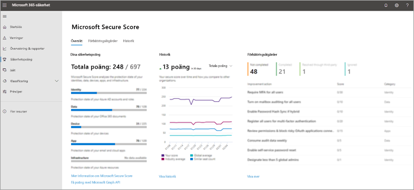
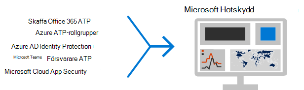

# De 12 viktigaste uppgifterna för säkerhetsteam att stödja arbetet hemifrånTop 12 tasks for security teams to support working from home

Om du är som [Microsoft](https://www.microsoft.com/microsoft-365/blog/2020/03/10/staying-productive-while-working-remotely-with-microsoft-teams/) och plötsligt upptäcker att du stöder en främst hembaserad arbetsstyrka, vill vi hjälpa dig att säkerställa att din organisation arbetar så säkert som möjligt.If you are like [Microsoft](https://www.microsoft.com/microsoft-365/blog/2020/03/10/staying-productive-while-working-remotely-with-microsoft-teams/) and suddenly find yourself supporting a primarily home-based workforce, we want to help you ensure your organization is working as securely as possible. Den här artikeln prioriterar uppgifter som ska hjälpa säkerhetsgrupper att implementera de viktigaste säkerhetsfunktionerna så snabbt som möjligt.This article prioritizes tasks to help security teams implement the most important security capabilities as quickly as possible.

Om du är en liten eller medelstor organisation som använder ett av Microsofts företags planer, se följande resurser i stället:If you are a small or medium-size organization using one of Microsoft's business plans, see these resources instead:

- [De 10 bästa sätten att skydda Office 365- och Microsoft 365 för företag-abonnemangTop 10 ways to secure Office 365 and Microsoft 365 for business plans](../admin/security-and-compliance/secure-your-business-data.md)
- [Microsoft 365 för kampanjer](../campaigns/index.md) (innehåller en rekommenderad säkerhetskonfiguration för Microsoft 365 Business)[Microsoft 365 for Campaigns](../campaigns/index.md) (includes a recommended security configuration for Microsoft 365 Business)

För kunder som använder våra enterprise-abonnemang rekommenderar Microsoft att du slutför de uppgifter som listas i följande tabell som gäller för ditt abonnemang.For customers using our enterprise plans, Microsoft recommends you complete the tasks listed in the following table that apply to your service plan. Om du kombinerar prenumerationer istället för att köpa ett Microsoft 365 Enterprise-abonnemang bör du observera följande:If, instead of purchasing a Microsoft 365 enterprise plan, you are combining subscriptions, note the following:

- Microsoft 365 E3 inkluderar Enterprise Mobility + Security (EMS) E3 och Azure AD P1Microsoft 365 E3 includes Enterprise Mobility + Security (EMS) E3 and Azure AD P1
- Microsoft 365 E5 innehåller EMS E5 och Azure AD P2Microsoft 365 E5 includes EMS E5 and Azure AD P2

****

|StegStep|UppgiftTask|Alla Office 365 Enterprise-abonnemangAll Office 365 Enterprise plans|Microsoft 365 E3Microsoft 365 E3|Microsoft 365 E5Microsoft 365 E5|
|---|---|---|---|---|
|11|[Aktivera Azure AD Multi-Factor Authentication (MFA)Enable Azure AD Multi-Factor Authentication (MFA)](#1-enable-azure-ad-multi-factor-authentication-mfa)||||
|22|[Skydda mot hotProtect against threats](#2-protect-against-threats)||||
|33|[Konfigurera Microsoft Defender för Office 365Configure Microsoft Defender for Office 365](#3-configure-microsoft-defender-for-office-365)||||
|44|[Konfigurera Microsoft Defender för identitetConfigure Microsoft Defender for Identity](#4-configure-microsoft-defender-for-identity)||||
|55|[Aktivera Microsoft 365 DefenderTurn on Microsoft 365 Defender](#5-turn-on-microsoft-365-defender)||||
|66|[Konfigurera skydd för Intune-mobilappen för telefoner och surfplattorConfigure Intune mobile app protection for phones and tablets](#6-configure-intune-mobile-app-protection-for-phones-and-tablets)||||
|77|[Konfigurera MFA och villkorsstyrd åtkomst för gäster, inklusive intune-appskyddConfigure MFA and conditional access for guests, including Intune app protection](#7-configure-mfa-and-conditional-access-for-guests-including-intune-mobile-app-protection)||||
|88|[Registrera datorer i enhetshantering och kräv kompatibla datorerEnroll PCs into device management and require compliant PCs](#8-enroll-pcs-into-device-management-and-require-compliant-pcs)||||
|99|[Optimera nätverket för molnanslutningOptimize your network for cloud connectivity](#9-optimize-your-network-for-cloud-connectivity)||||
|1010|[Utbilda användareTrain users](#10-train-users)||||
|1111|[Komma igång med Microsoft Cloud App SecurityGet started with Microsoft Cloud App Security](#11-get-started-with-microsoft-cloud-app-security)||||
|1212|[Övervaka hot och vidta åtgärderMonitor for threats and take action](#12-monitor-for-threats-and-take-action)||||
|

Innan du börjar kontrollerar du microsoft [365 Secure Score](./defender/microsoft-secure-score.md) på Microsoft 365 säkerhetscenter.Before you begin, check your [Microsoft 365 Secure Score](./defender/microsoft-secure-score.md) in the Microsoft 365 security center. Från en centraliserad instrumentpanel kan du övervaka och förbättra säkerheten för dina Microsoft 365-identiteter, data, appar, enheter och infrastruktur.From a centralized dashboard, you can monitor and improve the security for your Microsoft 365 identities, data, apps, devices, and infrastructure. Du får poäng för att konfigurera rekommenderade säkerhetsfunktioner, utföra säkerhetsrelaterade uppgifter (till exempel visa rapporter) eller åtgärda rekommendationer med ett program eller en programvara från tredje part.You are given points for configuring recommended security features, performing security-related tasks (such as viewing reports), or addressing recommendations with a third-party application or software. De rekommenderade uppgifterna i den här artikeln kommer att höja din poäng.The recommended tasks in this article will raise your score.

## 1: Aktivera Azure AD Multi-Factor Authentication (MFA)1: Enable Azure AD Multi-Factor Authentication (MFA)

Det enda bästa du kan göra för att förbättra säkerheten för anställda som arbetar hemifrån är att aktivera MFA.The single best thing you can do to improve security for employees working from home is to turn on MFA. Om du inte redan har processer på plats kan du behandla det som ett nödpilottest och se till att du har support så att du kan hjälpa anställda som fastnar.If you don't already have processes in place, treat this as an emergency pilot and make sure you have support folks ready to help employees who get stuck. Eftersom du förmodligen inte kan distribuera maskinvarusäkerhetsenheter kan du använda Windows Hello-biometrisker och smartphone-autentiseringsappar som Microsoft Authenticator.As you probably can't distribute hardware security devices, use Windows Hello biometrics and smartphone authentication apps like Microsoft Authenticator.

Normalt rekommenderar Microsoft att du ger användarna 14 dagar på sig att registrera sin enhet för multifaktorautentisering innan de kräver MFA.Normally, Microsoft recommends you give users 14 days to register their device for Multi-Factor Authentication before requiring MFA. Men om din arbetsstyrka plötsligt arbetar hemifrån kan du fortsätta och kräva MFA som säkerhetsprioritet och vara beredd på att hjälpa användare som behöver det.However, if your workforce is suddenly working from home, go ahead and require MFA as a security priority and be prepared to help users who need it.

Att tillämpa de här principerna tar bara några minuter, men är beredd på att ge support till användarna under de kommande dagarna.Applying these policies will take only a few minutes, but be prepared to support your users over the next several days.

****

|PlaneraPlan|RekommendationRecommendation|
|---|---|
|Microsoft 365-abonnemang (utan Azure AD P1 eller P2)Microsoft 365 plans (without Azure AD P1 or P2)|[Aktivera standardinställningar för säkerhet i Azure AD](/azure/active-directory/fundamentals/concept-fundamentals-security-defaults).[Enable Security defaults in Azure AD](/azure/active-directory/fundamentals/concept-fundamentals-security-defaults). Standardinställningar för säkerhet i Azure AD inkluderar MFA för användare och administratörer.Security defaults in Azure AD include MFA for users and administrators.|
|Microsoft 365 E3 (med Azure AD P1)Microsoft 365 E3 (with Azure AD P1)|Använd [vanliga principer för villkorsstyrd åtkomst](/azure/active-directory/conditional-access/concept-conditional-access-policy-common) för att konfigurera följande principer:Use [Common Conditional Access policies](/azure/active-directory/conditional-access/concept-conditional-access-policy-common) to configure the following policies:  - [Kräv MFA för administratörer](/azure/active-directory/conditional-access/howto-conditional-access-policy-admin-mfa)- [Require MFA for administrators](/azure/active-directory/conditional-access/howto-conditional-access-policy-admin-mfa)  - [Kräv MFA för alla användare](/azure/active-directory/conditional-access/howto-conditional-access-policy-all-users-mfa)- [Require MFA for all users](/azure/active-directory/conditional-access/howto-conditional-access-policy-all-users-mfa)   - [Blockera äldre autentisering](/azure/active-directory/conditional-access/howto-conditional-access-policy-block-legacy)- [Block legacy authentication](/azure/active-directory/conditional-access/howto-conditional-access-policy-block-legacy)|
|Microsoft 365 E5 (med Azure AD P2)Microsoft 365 E5 (with Azure AD P2)|Dra nytta av Azure AD Identity Protection och börja implementera Microsofts [rekommenderade uppsättning av villkorsstyrd åtkomst och relaterade principer](./defender-365-security/identity-access-policies.md) genom att skapa de två principerna:Taking advantage of Azure AD Identity Protection, begin to implement Microsoft's [recommended set of conditional access and related policies](./defender-365-security/identity-access-policies.md) by creating these two policies:  - [Kräv MFA när inloggningsrisker är medel eller hög](./defender-365-security/identity-access-policies.md#require-mfa-based-on-sign-in-risk)- [Require MFA when sign-in risk is medium or high](./defender-365-security/identity-access-policies.md#require-mfa-based-on-sign-in-risk)  - [Blockera klienter som inte har stöd för modern autentisering](./defender-365-security/identity-access-policies.md#block-clients-that-dont-support-multi-factor)- [Block clients that don't support modern authentication](./defender-365-security/identity-access-policies.md#block-clients-that-dont-support-multi-factor) - [Användare med hög risk måste byta lösenord](./defender-365-security/identity-access-policies.md#high-risk-users-must-change-password)- [High risk users must change password](./defender-365-security/identity-access-policies.md#high-risk-users-must-change-password)|
|

## 2: Skydda mot hot2: Protect against threats

Alla Microsoft 365-abonnemang innehåller en mängd olika skyddsfunktioner för hot.All Microsoft 365 plans include a variety of threat protection features. Det tar bara några minuter att få ett skydd för dessa funktioner.Bumping up protection for these features takes just a few minutes.

- Skydd mot skadlig kodAnti-malware protection
- Skydd mot skadliga URL:er och filerProtection from malicious URLs and files
- Skydd mot nätfiskeAnti-phishing protection
- Skydd mot skräppostAnti-spam protection

Information om hur du kan använda som utgångspunkt finns i Skydda mot hot i [Office 365.](defender-365-security/protect-against-threats.md)See [Protect against threats in Office 365](defender-365-security/protect-against-threats.md) for guidance you can use as a starting point.

## 3: Konfigurera Microsoft Defender för Office 3653: Configure Microsoft Defender for Office 365

Microsoft Defender för Office 365, inklusive Microsoft 365 E5 och Office 365 E5, skyddar organisationen mot skadliga hot som e-postmeddelanden, länkar och samarbetsverktyg medför.Microsoft Defender for Office 365, included with Microsoft 365 E5 and Office 365 E5, safeguards your organization against malicious threats posed by email messages, links (URLs) and collaboration tools. Det kan ta flera timmar att konfigurera.This can take several hours to configure.

Microsoft Defender för Office 365:Microsoft Defender for Office 365:

- Skyddar organisationen mot okända e-posthot i realtid genom att använda intelligenta system för att kontrollera bifogade filer och länkar för skadligt innehåll.Protects your organization from unknown email threats in real-time by using intelligent systems that inspect attachments and links for malicious content. Dessa automatiserade system har en robust detonationplattform, heuristics och maskininlärningsmodeller.These automated systems include a robust detonation platform, heuristics, and machine learning models.
- Skyddar organisationen när användare samarbetar och delar filer genom att identifiera och blockera skadliga filer på gruppwebbplatser och dokumentbibliotek.Protects your organization when users collaborate and share files, by identifying and blocking malicious files in team sites and document libraries.
- Tillämpar maskininlärningsmodeller och avancerade algoritmer för personifiering för att av invertera nätfiskeattacker.Applies machine learning models and advanced impersonation-detection algorithms to avert phishing attacks.

En översikt, inklusive en sammanfattning av abonnemangen, finns [i Defender för Office 365.](./defender-365-security/defender-for-office-365.md)For an overview, including a summary of plans, see [Defender for Office 365](./defender-365-security/defender-for-office-365.md).

Din globala administratör kan konfigurera dessa skydd:Your Global Administrator can configure these protections:

- [Konfigurera principer för säkra länkarSet up Safe Links policies](defender-365-security/set-up-safe-links-policies.md)
- [Konfigurera globala inställningar för Säkra länkarConfigure global settings for Safe Links](defender-365-security/configure-global-settings-for-safe-links.md)
- [Konfigurera principer för säkra bifogade filerSet up Safe Attachments policies](defender-365-security/set-up-safe-attachments-policies.md)

Du måste arbeta med Exchange Online-administratören och SharePoint Online-administratören för att konfigurera Defender för Office 365 för dessa arbetsbelastningar:You'll need to work with your Exchange Online administrator and SharePoint Online administrator to configure Defender for Office 365 for these workloads:

- [ATP för SharePoint, OneDrive och Microsoft TeamsATP for SharePoint, OneDrive, and Microsoft Teams](defender-365-security/mdo-for-spo-odb-and-teams.md)

## 4: Konfigurera Microsoft Defender för identitet4: Configure Microsoft Defender for Identity

[Microsoft Defender for Identity](/azure-advanced-threat-protection/what-is-atp) är en molnbaserad säkerhetslösning som utnyttjar dina lokala Active Directory-signaler för att identifiera, upptäcka och undersöka avancerade hot, komprometterade identiteter och illasinnade insider-åtgärder som riktas mor organisationen.[Microsoft Defender for Identity](/azure-advanced-threat-protection/what-is-atp) is a cloud-based security solution that leverages your on-premises Active Directory signals to identify, detect, and investigate advanced threats, compromised identities, and malicious insider actions directed at your organization. Fokusera på detta härnäst eftersom det skyddar din lokala och molnbaserad infrastruktur, har inga beroenden eller krav och kan ge omedelbar nytta.Focus on this next because it protects your on-prem and your cloud infrastructure, has no dependencies or prerequisites, and can provide immediate benefit.

- Se [Snabbstartsguider för Microsoft Defender för identitet](/azure-advanced-threat-protection/install-atp-step1) för att snabbt komma igång med konfigurationenSee [Microsoft Defender for Identity Quickstarts](/azure-advanced-threat-protection/install-atp-step1) to get setup quickly
- Titta [på videoklippet: Introduktion till Microsoft Defender för identitet](https://www.youtube.com/watch?reload=9&v=EGY2m8yU_KE)Watch [Video: Introduction to Microsoft Defender for Identity](https://www.youtube.com/watch?reload=9&v=EGY2m8yU_KE)
- Granska de [tre faserna i Microsoft Defender för identitetsdistribution](/azure-advanced-threat-protection/what-is-atp#whats-next)Review the [three phases of Microsoft Defender for Identity deployment](/azure-advanced-threat-protection/what-is-atp#whats-next)

## 5: Aktivera Microsoft 365 Defender5: Turn on Microsoft 365 Defender

Nu när du har konfigurerat Microsoft Defender för Office 365 och Microsoft Defender för identitet kan du visa de kombinerade signalerna från dessa funktioner på en instrumentpanel.Now that you have Microsoft Defender for Office 365 and Microsoft Defender for Identity configured, you can view the combined signals from these capabilities in one dashboard. [I Microsoft 365 Defender](./defender/microsoft-365-defender.md) samlas aviseringar, incidenter, automatisk undersökning och svar samt avancerad sökning i olika arbetsbelastningar (Microsoft Defender för identitet, Defender för Office 365, Microsoft Defender för slutpunkt och Microsoft Cloud App Security) i en enda ruta i [security.microsoft.com.](https://security.microsoft.com)[Microsoft 365 Defender](./defender/microsoft-365-defender.md) brings together alerts, incidents, automated investigation and response, and advanced hunting across workloads (Microsoft Defender for Identity, Defender for Office 365, Microsoft  Defender for Endpoint, and Microsoft Cloud App Security) into a single pane at [security.microsoft.com](https://security.microsoft.com).

När du har konfigurerat en eller flera av dina Defender för Office 365-tjänster aktiverar du MTP.After you have configured one or more of your Defender for Office 365 services, turn on MTP. Nya funktioner läggs till kontinuerligt i MTP. Överväg att registrera dig för att få förhandsgranskningsfunktioner.New features are added continually to MTP; consider opting in to receive preview features.

- [Läs mer om MTPLearn more about MTP](./defender/microsoft-365-defender.md)
- [Aktivera MTPTurn on MTP](./defender/m365d-enable.md)
- [Registrera dig för förhandsgranskningsfunktionerOpt in for preview features](./defender/preview.md)

## 6: Konfigurera skydd för Intune-mobilappen för telefoner och surfplattor6: Configure Intune mobile app protection for phones and tablets

Med Microsoft Intune Mobile Application Management (MAM) kan du hantera och skydda organisationens data på telefoner och surfplattor utan att hantera de här enheterna.Microsoft Intune Mobile Application Management (MAM) allows you to manage and protect your organization's data on phones and tablets without managing these devices. Så här fungerar det:Here's how it works:

- Du skapar en appskyddsprincip (APP) som avgör vilka appar på en enhet som hanteras och vilka beteenden som är tillåtna (till exempel att förhindra att data från ett hanterat program kopieras till ett ohanterat program).You create an App Protection Policy (APP) that determines which apps on a device are managed and what behaviors are allowed (such as preventing data from a managed app from being copied to an unmanaged app). Du skapar en princip för varje plattform (iOS, Android).You create one policy for each platform (iOS, Android).
- När du har skapat appskyddsprinciperna tillämpar du dessa genom att skapa en villkorsstyrd åtkomstregel i Azure AD för att kräva godkända appar och APP-dataskydd.After creating the app protection policies, you enforce these by creating a conditional access rule in Azure AD to require approved apps and APP data protection.

APPskyddsprinciper innehåller många inställningar.APP protection policies include many settings. Som tur är behöver du inte lära dig mer om alla inställningar och väga alternativen.Fortunately, you don't need to learn about every setting and weigh the options. Microsoft gör det enkelt att använda en inställningskonfiguration genom att rekommendera utgångspunkter.Microsoft makes it easy to apply a configuration of settings by recommending starting points. Ramverket [för dataskydd som använder principer för appskydd](/mem/intune/apps/app-protection-framework) omfattar tre nivåer som du kan välja bland.The [Data protection framework using app protection policies](/mem/intune/apps/app-protection-framework) includes three levels you can choose from.

Ännu bättre koordinerar Microsoft det här ramverket för appskydd med en uppsättning villkorsstyrda åtkomst och relaterade principer som vi rekommenderar att alla organisationer använder som utgångspunkt.Even better, Microsoft coordinates this app protection framework with a set of conditional access and related policies we recommend all organizations use as a starting point. Om du har implementerat MFA med hjälp av vägs i den här artikeln är du halvvägs dit!If you've implemented MFA using the guidance in this article, you're half way there!

Om du vill konfigurera skydd för mobilappar använder du vägledningen i [Vanliga principer för identitet och enhetsåtkomst:](./defender-365-security/identity-access-policies.md)To configure mobile app protection, use the guidance in [Common identity and device access policies](./defender-365-security/identity-access-policies.md):

 1. Använd [vägledning av appdataskyddsprinciper](./defender-365-security/identity-access-policies.md#apply-app-data-protection-policies) för att skapa principer för iOS och Android.Use the [Apply APP data protection policies](./defender-365-security/identity-access-policies.md#apply-app-data-protection-policies) guidance to create policies for iOS and Android. Nivå 2 (förbättrat dataskydd) rekommenderas för grundläggande skydd.Level 2 (enhanced data protection) is recommended for baseline protection.
 2. Skapa en regel för villkorsstyrd åtkomst [så att godkända appar och APPskydd krävs.](./defender-365-security/identity-access-policies.md#require-approved-apps-and-app-protection)Create a conditional access rule to [Require approved apps and APP protection](./defender-365-security/identity-access-policies.md#require-approved-apps-and-app-protection).

## 7: Konfigurera MFA och villkorsstyrd åtkomst för gäster, inklusive intune-mobilappsskydd7: Configure MFA and conditional access for guests, including Intune mobile app protection

Nu ska vi se till att du kan fortsätta att samarbeta och arbeta med gäster.Next, let's ensure you can continue to collaborate and work with guests. Om du använder Microsoft 365 E3-abonnemanget och har implementerat MFA för alla användare är du redo.If you're using the Microsoft 365 E3 plan and you implemented MFA for all users, you're set.

Om du använder Microsoft 365 E5-abonnemanget och du utnyttjar Azure Identity Protection för riskbaserad MFA måste du göra några justeringar (eftersom Azure AD-identitetsskydd inte omfattar gäster):If you're using the Microsoft 365 E5 plan and you're taking advantage of Azure Identity Protection for risk-based MFA, you need to make a couple of adjustments (because Azure AD Identity protection doesn't extend to guests):

- Skapa en ny regel för villkorsstyrd åtkomst så att MFA alltid krävs för gäster och externa användare.Create a new conditional access rule to require MFA always for guests and external users.
- Uppdatera den riskbaserade MFA-regeln för villkorsstyrd åtkomst för att utesluta gäster och externa användare.Update the risk-based MFA conditional access rule to exclude guests and external users.

Använd vägledning [i Uppdatera vanliga principer](./defender-365-security/identity-access-policies-guest-access.md) för att tillåta och skydda gäst- och extern åtkomst för att förstå hur gäståtkomst fungerar med Azure AD och för att uppdatera de aktuella principerna.Use the guidance in [Updating the common policies to allow and protect guest and external access](./defender-365-security/identity-access-policies-guest-access.md) to understand how guest access works with Azure AD and to update the affected policies.

De principer för skydd av Intune-mobilappar som du har skapat, tillsammans med regeln för villkorsstyrd åtkomst som kräver godkända appar och appskydd, gäller för gästkonton och hjälper till att skydda dina organisationsdata.The Intune mobile app protection policies you created, together with the conditional access rule to require approved apps and APP protection, apply to guests accounts and will help protect your organization data.

> [!NOTE]
> Om du redan har registrerat datorer i enhetshantering för att kräva kompatibla datorer måste du även utesluta gästkonton från regeln för villkorsstyrd åtkomst som framtvingar enhetsefterlevnad.If you've already enrolled PCs into device management to require compliant PCs, you'll also need to exclude guest accounts from the conditional access rule that enforces device compliance.

## 8: Registrera datorer i enhetshantering och kräv kompatibla datorer8: Enroll PCs into device management and require compliant PCs

Det finns flera metoder för att registrera arbetsstyrkans enheter.There are several methods to enroll your workforce's devices. Varje metod beror på enhetens ägarskap (privat eller företag), enhetstyp (iOS, Windows, Android) och hanteringskrav (återställningar, tillhörigheter, låsning).Each method depends on the device's ownership (personal or corporate), device type (iOS, Windows, Android), and management requirements (resets, affinity, locking). Det kan ta lite tid att reda ut det. Mer [information: Registrera enheter i Microsoft Intune](/mem/intune/enrollment/).This can take a bit of time to sort out. See: [Enroll devices in Microsoft Intune](/mem/intune/enrollment/).

Det snabbaste sättet att komma igång är att [Konfigurera automatisk registrering för Windows 10-enheter.](/mem/intune/enrollment/quickstart-setup-auto-enrollment)The quickest way to get going is to [Set up automatic enrollment for Windows 10 devices](/mem/intune/enrollment/quickstart-setup-auto-enrollment).

Du kan också dra nytta av de här självstudiekurserna:You can also take advantage of these tutorials:

- [Använda Autopilot för att registrera Windows-enheter i IntuneUse Autopilot to enroll Windows devices in Intune](/mem/intune/enrollment/tutorial-use-autopilot-enroll-devices)
- [Använd Apples funktioner för enhetsregistrering för företag i Apple Business Manager (ABM) för att registrera iOS-/iPadOS-enheter i IntuneUse Apple's Corporate Device Enrollment features in Apple Business Manager (ABM) to enroll iOS/iPadOS devices in Intune](/mem/intune/enrollment/tutorial-use-device-enrollment-program-enroll-ios)

När du har registrerat enheter kan du använda vägledningen i Principer för [gemensamma identiteter och enhetsåtkomst för](./defender-365-security/identity-access-policies.md) att skapa dessa principer:After enrolling devices, use the guidance in [Common identity and device access policies](./defender-365-security/identity-access-policies.md) to create these policies:

- [Definiera policyer för enhetsefterlevnad](./defender-365-security/identity-access-policies.md#define-device-compliance-policies) – De rekommenderade inställningarna för Windows 10 kräver antivirusskydd.[Define device-compliance policies](./defender-365-security/identity-access-policies.md#define-device-compliance-policies) — The recommended settings for Windows 10 include requiring antivirus protection. Om du har Microsoft 365 E5 kan du använda Microsoft Defender för Endpoint för att övervaka hälsotillståndet för enheter med anställda.If you have Microsoft 365 E5, use Microsoft Defender for Endpoint to monitor the health of employee devices. Se till att efterlevnadsprinciper för andra operativsystem innehåller antivirusprogram och skyddsprogram för ändpunkt.Be sure compliance policies for other operating systems include antivirus protection and end-point protection software.
- [Kräv kompatibla datorer –](./defender-365-security/identity-access-policies.md#require-compliant-pcs-but-not-compliant-phones-and-tablets) Det här är regeln för villkorsstyrd åtkomst i Azure AD som tillämpar efterlevnadsprinciper för enheter.[Require compliant PCs](./defender-365-security/identity-access-policies.md#require-compliant-pcs-but-not-compliant-phones-and-tablets) — This is the conditional access rule in Azure AD that enforces the device compliance policies.

Bara en organisation kan hantera en enhet, så se till att utesluta gästkonton från regeln för villkorsstyrd åtkomst i Azure AD.Only one organization can manage a device, so be sure to exclude guest accounts from the conditional access rule in Azure AD. Om du inte exkluderar gäst- och externa användare från principer som kräver enhetsefterlevnad blockeras dessa användare av dessa principer.If you don't exclude guest and external users from policies that require device compliance, these policies will block these users. Mer information finns i Uppdatera [vanliga principer för att tillåta och skydda gäst och extern åtkomst.](./defender-365-security/identity-access-policies-guest-access.md)For more information, see [Updating the common policies to allow and protect guest and external access](./defender-365-security/identity-access-policies-guest-access.md).

## 9: Optimera nätverket för molnanslutning9: Optimize your network for cloud connectivity

Om du snabbt gör det möjligt för många anställda att arbeta hemifrån kan detta plötsligt byte av anslutningsmönster ha stor inverkan på företagets nätverksinfrastruktur.If you are rapidly enabling the bulk of your employees to work from from home, this sudden switch of connectivity patterns can have a significant impact on the corporate network infrastructure. Många nätverk skalades och utformades innan molntjänster införskalades.Many networks were scaled and designed before cloud services were adopted. I många fall är nätverk nätverk av fjärranslutna medarbetare, men har inte utformats för att användas på distans av alla användare samtidigt.In many cases, networks are tolerant of remote workers, but were not designed to be used remotely by all users simultaneously.

Nätverkselement som VPN-koncentratorer, central egressutrustning för nätverk (t.ex. proxyenheter och skyddsenheter för dataförlust), central internetbandbredd, backhaul MPLS-kretsar, NAT-funktioner och så vidare kommer plötsligt att drabbas av enorm belastning på grund av belastningen på hela företaget som använder dem.Network elements such as VPN concentrators, central network egress equipment (such as proxies and data loss prevention devices), central internet bandwidth, backhaul MPLS circuits, NAT capability and so on are suddenly put under enormous strain due to the load of the entire business using them. Resultatet är dålig prestanda och produktivitet tillsammans med en dålig användarupplevelse för användare som anpassar sig till att arbeta hemifrån.The end result is poor performance and productivity coupled with a poor user experience for users who are adapting to working from home.

En del av de skydd som tidigare tillhandahållits genom att dirigera trafik tillbaka genom ett företagsnätverk tillhandahålls av de molnappar användarna använder.Some of the protections that have traditionally been provided by routing traffic back through a corporate network are provided by the cloud apps your users are accessing. Om du har kommit till det här steget i den här artikeln har du implementerat en uppsättning avancerade molnsäkerhetskontroller för Microsoft 365-tjänster och -data.If you've reached this step in this article, you've implemented a set of sophisticated cloud security controls for Microsoft 365 services and data. Med de här kontrollerna på plats kanske du är redo att dirigera fjärranvändares trafik direkt till Office 365.With these controls in place, you may be ready to route remote users' traffic directly to Office 365. Om du fortfarande kräver en VPN-länk för åtkomst till andra program kan du förbättra prestanda och användarupplevelse avsevärt genom att implementera delade tunnlar.If you still require a VPN link for access to other applications, you can greatly improve your performance and user experience by implementing split tunneling. När ni har uppnått ett avtal i organisationen kan det åstadkommas inom en dag av ett väl samordnat nätverksteam.Once you achieve agreement in your organization, this can be accomplished within a day by a well-coordinated network team.

Mer information finns i följande resurser i Dokument:See these resources on Docs for more information:

- [Översikt: Optimera anslutningen för fjärranvändare med VPN-delade tunnlarOverview: Optimize connectivity for remote users using VPN split tunneling](/Office365/Enterprise/office-365-vpn-split-tunnel)
- [Implementera VPN-delade tunnlar för Office 365Implementing VPN split tunneling for Office 365](/Office365/Enterprise/office-365-vpn-implement-split-tunnel)

Senaste bloggartiklar om det här avsnittet:Recent blog articles on this topic:

- [Hur du snabbt optimerar trafiken för fjärranslutna personal & minska belastningen på infrastrukturenHow to quickly optimize traffic for remote staff & reduce the load on your infrastructure](https://techcommunity.microsoft.com/t5/office-365-blog/how-to-quickly-optimize-office-365-traffic-for-remote-staff-amp/ba-p/1214571#)
- [Alternativa sätt för säkerhetsexperter och IT-personal för att uppnå moderna säkerhetskontroller i dagens unika fjärrarbetesscenarierAlternative ways for security professionals and IT to achieve modern security controls in today's unique remote work scenarios](https://www.microsoft.com/security/blog/2020/03/26/alternative-security-professionals-it-achieve-modern-security-controls-todays-unique-remote-work-scenarios/)

## 10: Utbilda användare10: Train users

Utbildningsanvändare kan spara dina användare och säkerhetsåtgärder genom att lägga mycket tid och bli frustrerad.Training users can save your users and security operations team a lot of time and frustration. Smarta användare har mindre chans att öppna bifogade filer eller klicka på länkar i tveksamma e-postmeddelanden, och risken är större att de undviker misstänkta webbplatser.Savvy users are less likely to open attachments or click links in questionable email messages, and they are more likely to avoid suspicious websites.

Nu finns en handbok om [cybersäkerhet från](https://go.microsoft.com/fwlink/?linkid=2015598&amp;clcid=0x409) Harvard School som ger utmärkt vägledning om att etablera en stark säkerhetskultur inom organisationen, bland annat utbildningsanvändare för att identifiera nätfiskeattacker.The Harvard Kennedy School [Cybersecurity Campaign Handbook](https://go.microsoft.com/fwlink/?linkid=2015598&amp;clcid=0x409) provides excellent guidance on establishing a strong culture of security awareness within your organization, including training users to identify phishing attacks.

Med Microsoft 365 får du följande resurser för att informera användarna i organisationen:Microsoft 365 provides the following resources to help inform users in your organization:

****

|BegreppConcept|ResurserResources|
|---|---|
|Microsoft 365Microsoft 365|[Anpassningsbara utbildningsvägarCustomizable learning pathways](/office365/customlearning/) 
De här resurserna kan hjälpa dig att sätta ihop utbildning för slutanvändarna i organisationenThese resources can help you put together training for end users in your organization|
|Microsoft 365-säkerhetMicrosoft 365 security|[Utbildningsmodul: Skydda organisationen med inbyggd och intelligent säkerhet från Microsoft 365Learning module: Secure your organization with built-in, intelligent security from Microsoft 365](/learn/modules/security-with-microsoft-365) 
I den här modulen kan du beskriva hur Microsoft 365-säkerhetsfunktioner fungerar tillsammans och att uttrycka fördelarna med dessa säkerhetsfunktioner.This module enables you to describe how Microsoft 365 security features work together and to articulate the benefits of these security features.|
|MultifaktorautentiseringMulti-factor authentication|[Tvåstegsverifiering: Vad är den ytterligare verifieringssidan?Two-step verification: What is the additional verification page?](/azure/active-directory/user-help/multi-factor-authentication-end-user-first-time) 
Den här artikeln hjälper slutanvändarna att förstå vad multifaktorautentisering är och varför det används i organisationen.This article helps end users understand what multi-factor authentication is and why it's being used at your organization.|
|

Förutom den här vägledningen rekommenderar Microsoft att dina användare gör som beskrivs i den här artikeln: Skydda ditt konto och dina enheter [från hackare och skadlig programvara.](https://support.office.com/article/066d6216-a56b-4f90-9af3-b3a1e9a327d6.aspx)In addition to this guidance, Microsoft recommends that your users take the actions described in this article: [Protect your account and devices from hackers and malware](https://support.office.com/article/066d6216-a56b-4f90-9af3-b3a1e9a327d6.aspx). Dessa åtgärder omfattar:These actions include:

- Använda starka lösenordUsing strong passwords
- Skydda enheterProtecting devices
- Aktivera säkerhetsfunktioner på PC-datorer med Windows 10 och Mac (för ohanterade enheter)Enabling security features on Windows 10 and Mac PCs (for unmanaged devices)

Microsoft rekommenderar även att användare skyddar sina personliga e-postkonton genom att vidta de åtgärder som rekommenderas i följande artiklar:Microsoft also recommends that users protect their personal email accounts by taking the actions recommended in the following articles:

- [Skydda ditt e Outlook.com kontoHelp protect your Outlook.com email account](https://support.microsoft.com/office/a4f20fc5-4307-4ece-8231-6d4d4bd8a9ba)

- [Skydda ditt Gmail-konto med tvåstegsverifieringProtect your Gmail account with 2-step verification](https://go.microsoft.com/fwlink/p/?linkid=2015688)

## 11: Komma igång med Microsoft Cloud App Security11: Get started with Microsoft Cloud App Security

[Microsoft Cloud App Security](/cloud-app-security) ger full insyn, kontroll över data färdas och avancerad analys för att identifiera och bekämpa cyberhot i alla dina molntjänster.[Microsoft Cloud App Security](/cloud-app-security) provides rich visibility, control over data travel, and sophisticated analytics to identify and combat cyberthreats across all your cloud services. När du har börjat med Cloud App Security aktiveras avvikande identifieringsprinciper automatiskt, men Cloud App Security har en inledande utbildningsperiod på sju dagar då inte alla varningar för avvikande identifiering upphöjs.Once you get started with Cloud App Security, anomaly detection policies are automatically enabled, but Cloud App Security has an initial learning period of seven days during which not all anomaly detection alerts are raised.

Kom igång med Cloud App Security nu.Get started with Cloud App Security now. Senare kan du konfigurera mer avancerad övervakning och kontroller.Later you can set up more sophisticated monitoring and controls.

- [Snabbstart: Komma igång med Cloud App SecurityQuickstart: Get started with Cloud App Security](/cloud-app-security/getting-started-with-cloud-app-security)
- [Få omedelbar funktionsanalys och avvikande identifieringGet instantaneous behavioral analytics and anomaly detection](/cloud-app-security/anomaly-detection-policy)
- [Läs mer om Microsoft Cloud App SecurityLearn more about Microsoft Cloud App Security](/cloud-app-security/what-is-cloud-app-security)
- [Granska nya funktionerReview new features and capabilities](/cloud-app-security/release-notes)
- [Visa grundläggande konfigurationsanvisningarSee basic setup instructions](/cloud-app-security/general-setup)

## 12: Övervaka hot och vidta åtgärder12: Monitor for threats and take action

Microsoft 365 innehåller flera olika sätt att övervaka status och vidta lämpliga åtgärder.Microsoft 365 includes several ways to monitor status and take appropriate actions. Den bästa utgångspunkten är Microsoft 365 säkerhetscenter ( ), där du kan se din organisations Microsoft Secure Score och eventuella aviseringar eller enheter som [https://security.microsoft.com](https://security.microsoft.com) kräver din uppmärksamhet. Your best starting point is the Microsoft 365 security center ([https://security.microsoft.com](https://security.microsoft.com)), where you can view your organization's [Microsoft Secure Score](./defender/microsoft-secure-score.md), and any alerts or entities that require your attention.

- [Komma igång med Säkerhetscenter för Microsoft 365Get started with the Microsoft 365 security center](./defender/overview-security-center.md)
- [Övervaka och visa rapporterMonitor and view reports](./defender/overview-security-center.md)
- [Se säkerhetsportalerna i Microsoft 365See the security portals in Microsoft 365](./defender/portals.md)

## Nästa stegNext steps

Grattis!Congratulations! Du har snabbt implementerat några av de viktigaste säkerhetsskyddet och din organisation är mycket säkrare.You have quickly implemented some of the most important security protections and your organization is much more secure. Nu kan du gå ännu längre med funktioner för skydd mot hot (inklusive Microsoft Defender för Endpoint), funktioner för dataklassificering och skydd och skydd av administrativa konton.Now you're ready to go even further with threat protection capabilities (including Microsoft Defender for Endpoint), data classification and protection capabilities, and securing administrative accounts. En djupare, metodisk uppsättning säkerhetsrekommendationer för Microsoft 365 finns i [Microsoft 365 Security for Business Decision Makers (BDMs).](Microsoft-365-security-for-bdm.md)For a deeper, methodical set of security recommendations for Microsoft 365, see [Microsoft 365 Security for Business Decision Makers (BDMs)](Microsoft-365-security-for-bdm.md).

Besök även Microsofts nya säkerhetscenter på [docs.microsoft.com/security](/security).Also visit Microsoft's new security center on [docs.microsoft.com/security](/security).