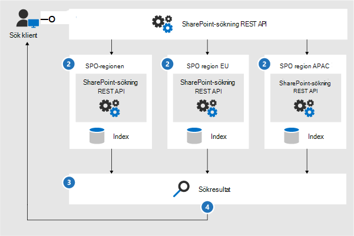

# Microsoft 365 arkitekturikoner och mallar

Att hjälpa våra partner och kunder att utforma och konstruera nya lösningar är viktigt. Arkitekturdiagram som de som ingår i våra riktlinjer kan hjälpa dig att kommunicera designbeslut och relationerna mellan komponenter i en miljö. Vi använder en uppsättning symboler och ikoner tillsammans med Visio-mallar för att skapa arkitekturdiagrammen vi använder och tillhandahåller dessa verktyg för att hjälpa dig att skapa ett anpassat arkitekturdiagram för nästa lösning.

Du kan se dessa ikoner, symboler och mallar i praktiken i nedladdningsbara filer som är tillgängliga på följande sidor:

- [Produktivitets illustrationer](productivity-illustrations.md)
- [Microsoft Cloud-arkitekturmodeller](cloud-architecture-models.md)

## Villkor och nedladdning

Microsoft tillåter att dessa ikoner används i arkitekturdiagram, utbildningsmaterial eller dokumentation. Du kan kopiera, distribuera och visa ikonerna endast för den tillåtna användningen om inte Microsoft uttryckligen beviljas behörighet. Microsoft reserves all other rights.

 > [!div class="button"]
 > [Ladda ned SVG- och PNG-ikoner](https://go.microsoft.com/fwlink/?linkid=869455)

 > [!div class="button"]
 > [Ladda Visio mallar och stenciler](https://go.microsoft.com/fwlink/?linkid=2056186)

## Exempel på arkitekturdiagram

Du kan använda dessa ikoner och mallar för att skapa diagram som följande exempel:

1. Exempel på sökarkitekturdiagram för SharePoint:

    

2. Teams för bevarandelivscykel:

    
