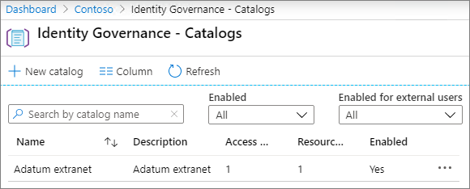

# Skapa ett B2B-extranät med hanterade gäster

Du kan använda [Azure Active Directory Entitlement Management](https://docs.microsoft.com/azure/active-directory/governance/entitlement-management-overview) för att skapa ett B2B-extranät för att samarbeta med en partnerorganisation som använder Azure Active Directory. Detta gör det möjligt för användare att själv registrera sig på extranätswebbplatsen eller teamet och få åtkomst via ett arbetsflöde för godkännande.

Med den här metoden för att dela resurser för samarbete kan partnerorganisationen hjälpa till att underhålla och godkänna gästanvändarna på slutet, vilket minskar belastningen på IT-avdelningen och gör det möjligt för de mest bekanta med samarbetsavtalet att hantera användaråtkomst.

Den här artikeln går igenom stegen för att skapa ett paket med resurser (i det här fallet en webbplats eller ett team) som du kan dela med en partnerorganisation via en självbetjäningsregistreringsmodell. 

Innan du börjar skapar du den webbplats eller det team som du vill dela med partnerorganisationen och aktiverar den för gästdelning. Mer information [finns i Samarbeta med gäster](collaborate-in-site.md) på en webbplats eller Samarbeta med gäster i ett [team.](collaborate-as-team.md) Vi rekommenderar också att du granskar [Skapa en säker gästdelningsmiljö](create-secure-guest-sharing-environment.md) för information om säkerhets- och efterlevnadsfunktioner som du kan använda för att underhålla dina styrningsprinciper när du samarbetar med gäster.

## Anslut partnerorganisationen

För att kunna bjuda in gäster från en partnerorganisation måste du lägga till partnerns domän som en ansluten organisation i Azure Active Directory.

Så här lägger du till en ansluten organisation
1. Klicka på **Identitetsstyrning**i [Azure Active Directory](https://aad.portal.azure.com).
2. Klicka på **Anslutna organisationer**.
4. Klicka på **Lägg till ansluten organisation**.
5. Skriv ett namn och en beskrivning för organisationen och klicka sedan på **Nästa: Katalog + domän**.
6. Klicka på **Lägg till katalog + domän**.
7. Skriv domänen för den organisation som du vill ansluta och klicka sedan på **Lägg till**.
8. Klicka på **Anslut**och sedan på **Nästa: Sponsorer.**
9. Lägg till personer från din organisation eller organisationen som du ansluter till och med den du vill godkänna åtkomst för gästanvändare.
10. Klicka på **Nästa: Granska + Skapa**.
11. Granska de inställningar som du har valt och klicka sedan på **Skapa**.

    

## Välj vilka resurser som ska delas

Det första steget i att välja resurser att dela med en partnerorganisation är att skapa en katalog som innehåller dem.

Så här skapar du en katalog
1. Klicka på **Identitetsstyrning**i [Azure Active Directory](https://aad.portal.azure.com).
2. Klicka på **Kataloger**.
3. Klicka på **Ny katalog**.
4. Skriv ett namn och en beskrivning för katalogen och se till att **Aktiverad** och **Aktiverad för externa användare** båda är inställda på **Ja**.
5. Klicka på **Skapa**.

   

När katalogen har skapats lägger du till den SharePoint-webbplats eller det SharePoint-team som du vill dela med partnerorganisationen.

Så här lägger du till resurser i en katalog
1. I Azure AD Identity Governance klickar du på **Kataloger**och sedan på den katalog där du vill lägga till resurser.
2. Klicka på **Resurser** och sedan på **Lägg till resurser**.
3. Markera de team eller SharePoint-webbplatser som du vill inkludera i extranätet och klicka sedan på **Lägg till**.

   

När du har definierat de resurser som du vill dela är nästa steg att skapa ett åtkomstpaket som definierar vilken typ av åtkomst som partneranvändare beviljas och godkännandeprocessen för nya partneranvändare som begär åtkomst.

Så här skapar du ett åtkomstpaket
1. I Azure AD Identity Governance klickar du på **Kataloger**och sedan på den katalog där du vill skapa ett åtkomstpaket.
2. Klicka på **Access-paket**och sedan på **Nytt åtkomstpaket**.
3. Skriv ett namn och en beskrivning för åtkomstpaketet och klicka sedan på **Nästa: Resursroller**.
4. Välj de resurser från katalogen som du vill använda för extranätet.
5. För varje resurs i kolumnen **Roll** väljer du den användarroll som du vill bevilja gästanvändarna som använder extranätet.
6. Klicka på **Nästa: Förfrågningar**.
7. Under **Användare som kan begära åtkomst**väljer du För användare som inte finns i **katalogen**.
8. Kontrollera att alternativet **Specifika anslutna organisationer** är markerat och klicka sedan på Lägg till **kataloger**.
9. Välj den anslutna organisation som du lägger till tidigare och klicka sedan på **Välj**
10. Under **Godkännande**väljer du **Ja** för **Kräv godkännande**.
11. Under **Första godkännaren**väljer du en av sponsorerna som du har lagt till tidigare eller väljer en viss användare.
12. Klicka på **Lägg till reservstöd** och välj en reservaserare.
13. Välj **Ja**under **Aktivera**.
14. Klicka på **Nästa: Livscykel**.
15. Välj de inställningar för förfallodatum och åtkomstgranskning som du vill använda och klicka sedan på **Nästa: Granska + Skapa**.
16. Granska inställningarna och klicka sedan på **Skapa**.

    

Om du samarbetar med en stor organisation kanske du vill dölja åtkomstpaketet. Om paketet är dolt ser användarna i partnerorganisationen inte paketet på portalen *Min Åtkomst.* I stället måste de skickas en direktlänk för att registrera sig för paketet. Om du döljer åtkomstpaketet kan du minska antalet olämpliga åtkomstbegäranden och kan också hjälpa till att hålla tillgängliga åtkomstpaket organiserade i partnerorganisationens portal.

Så här ställer du in ett åtkomstpaket på dolda
1. I Azure AD Identity Governance klickar du på **Åtkomstpaket**och sedan på ditt åtkomstpaket.
2. Klicka på **Redigera**på sidan **Översikt.**
3. Under **Egenskaper**väljer du **Ja** för **Dold**och klickar sedan på **Spara**.

   

## Bjud in partneranvändare

Om du anger åtkomstpaketet till dold måste du skicka en direktlänk till partnerorganisationen så att de kan begära åtkomst till din webbplats eller ditt team.

Så här hittar du länken till accessportalen
1. I Azure AD Identity Governance klickar du på **Åtkomstpaket**och sedan på ditt åtkomstpaket.
2. Klicka på Kopiera **till urklippslänk** för **länken Min Access på**sidan **Översikt** .

   

När du har kopierat länken kan du dela den med din kontakt i partnerorganisationen och de kan skicka den till användarna i deras samarbetsteam.

## Se även

[Skapa en säker miljö för gästdelning](create-secure-guest-sharing-environment.md)

