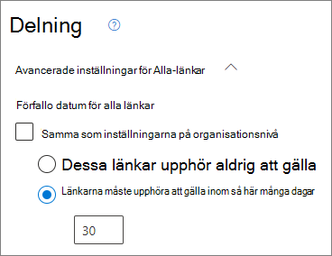
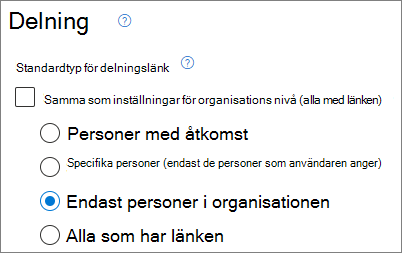
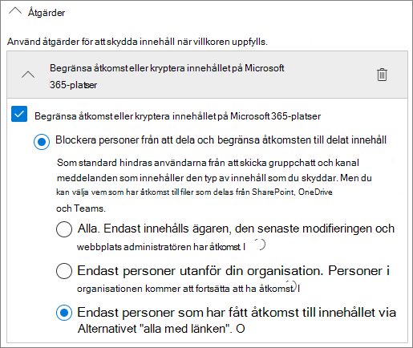

# Metodtips för att dela filer och mappar med oautentiserade användare

Oautentiserad delning (*Alla*-länkar) kan vara smidigt och användbart i olika scenarier. *Alla*-länkar är det enklaste sättet att dela: personer kan öppna länken utan autentisering och kan skicka den vidare till andra.

Vanligtvis är inte allt innehåll i en organisation lämpligt för oautentiserad delning. I den här artikeln beskrivs de alternativ som är tillgängliga för att hjälpa dig att skapa en miljö där dina användare kan använda oautentiserad delning av filer och mappar, men där det finns säkerhetsåtgärder för att skydda organisationens innehåll.

> [!NOTE]
> För att oautentiserad delning ska fungera måste du aktivera den för din organisation och för den enskilda webbplatsen eller det team som du ska använda. Se [Samarbeta med personer utanför organisationen](collaborate-with-people-outside-your-organization.md) för det scenario du vill aktivera.

## Ange ett utgångsdatum för Alla-länkar

Filer lagras ofta på webbplatser, i grupper och team under långa tidsperioder. Ibland finns det datakvarhållningsprinciper som kräver att filer bevaras i flera år. Om de här filerna delas med oautentiserade personer kan detta leda till oväntad åtkomst och framtida ändringar i filerna. Om du vill minska risken för detta kan du konfigurera en förfallotid för *Alla*-länkar.

När en *Alla*-länk går ut kan den inte längre användas för att få åtkomst till innehåll.

Ange ett utgångsdatum för Alla-länkar i organisationen

1. Öppna [SharePoint Online Administrationscenter](https://admin.microsoft.com/sharepoint).
2. Klicka på **Delning** i det vänstra navigeringsfönstret.
3. Markera kryssrutan **Länkarna måste upphöra att gälla inom så här många dagar** under **Välj behörigheter och giltighetsalternativ för Alla-länkar**. 
   
4. Skriv ett antal dagar i rutan och klicka sedan på **Spara**.

Ange ett utgångsdatum för Alla-länkar på en särskild webbplats

1. Öppna [SharePoint Online Administrationscenter](https://admin.microsoft.com/sharepoint).
2. I det vänstra navigeringsfältet expanderar du **Webbplatser** och klickar sedan på **Aktiva webbplatser**.
3. Välj webbplatsen som du vill ändra och klicka sedan på **Delning**.
4. Under **Avancerade inställningar för alla länkar** kan du under **Sista giltighetstiden för alla länkar** avmarkera kryssrutan **Samma som inställningen på organisationsnivå**. 
   
5. Välj **Dessa länkar måste upphöra inom detta antal dagar** alternativ och ange ett antal dagar i rutan.
6. Klicka på **Spara**.

Tänk på att när en *Alla*-länk går ut kan filen eller mappen delas igen med en ny *Alla*-länk.

Du kan ange *vem som helst* för länkens utgång för en specifik OneDrive med hjälp av [Set-SPOSite](/powershell/module/sharepoint-online/set-sposite).

## Ange behörigheter för länk

*Alla*-länkar för en fil tillåter som standard personer att redigera filen, och *Alla*-länkar för en mapp tillåter personer att redigera och visa filer samt att ladda upp nya filer till mappen. Du kan ändra de här behörigheterna till endast visning för filer och mappar oberoende av varandra.

Om du vill tillåta oautentiserad delning, men är orolig för att oautentiserade personer ska ändra organisationens innehåll, bör du överväga att ställa in behörigheterna för filer och mappar till **Visa**.

Ange behörigheter för Alla-länkar i organisationen

1. Öppna [SharePoint Online Administrationscenter](https://admin.microsoft.com/sharepoint).
2. Klicka på **Delning** i det vänstra navigeringsfönstret.
3. Under **Avancerade inställningar för "Alla"-länkar** väljer du de fil- och mappbehörigheter som du vill använda. 
   

Med *Alla*-länkar inställda på **Visa** kan användare fortfarande dela filer och mappar med gäster och ge dem redigeringsbehörighet genom att använda *Specifika personer*-länkar. Med dessa länkar måste personer utanför organisationen autentiseras som gäster, och du kan spåra och granska gästaktiviteten i filer och mappar som delas med dessa länkar.

## Ställa in standardlänktypen till att endast fungera för personer i organisationen

När *Alla*-delning aktiveras för organisationen anges normalt delningslänken till **Alla**. Det kan vara praktiskt för användarna, men kan öka risken för oavsiktlig oautentiserad delning. Om en användare glömmer att ändra länktypen vid delning av ett känsligt dokument, kan det hända att de oavsiktligt skapar en delningslänk som inte kräver autentisering.

Du kan minska den här risken genom att ändra standardlänkinställningen till en länk som bara fungerar för personer i organisationen. Användare som vill dela med oautentiserade personer måste då specifikt välja det alternativet.

Ange standarddelningslänken för filer och mappar för organisationen
1. Öppna [SharePoint Online Administrationscenter](https://admin.microsoft.com/sharepoint).
2. Klicka på **Delning** i det vänstra navigeringsfönstret.
3. Under **Fil- och mapplänkar** väljer du **Endast personer i organisationen**.

   

4. Klicka på **Spara**

Ange standarddelningslänken för filer och mappar för den särskilda webbplatsen.
1. Öppna [SharePoint Online Administrationscenter](https://admin.microsoft.com/sharepoint).
2. I det vänstra navigeringsfältet expanderar du **Webbplatser** och klickar sedan på **Aktiva webbplatser**.
3. Välj webbplatsen som du vill ändra och klicka sedan på **Delning**.
4. Avmarkera kryssrutan **Samma som organisationsnivå** under **Standardtyp av delningslänk**.

   

5. Välj alternativet **Bara personer i organisationen** och klicka på **Spara**.

## Förhindra oautentiserad delning av känsligt innehåll

Du kan använda [Dataförlustskydd (DLP](../compliance/data-loss-prevention-policies.md)) för att förhindra oautentiserad delning av känsligt innehåll. Dataförlustskydd kan utföra åtgärder baserat på en fils känslighetsetikett, kvarhållningsetikett eller känslig information i själva filen.

Skapa en DLP-regel
1. I Microsoft 365 Efterlevnadscenter, gå till sidan [Dataförlustskydd](https://compliance.microsoft.com/datalossprevention).
2. Klicka på **Skapa princip**.
3. Välj **Anpassad** och klicka på **Nästa**.
4. Skriv ett namn för principen och klicka på **Nästa**.
5. På **Platser för att tillämpa principen** Stäng av alla inställningar utom **SharePoint-webbplatser** och **OneDrive-konton** och klicka sedan på **Nästa**.
6. På sidan **Definiera principinställningar** klickar du på **Nästa**.
7. På sidan **Anpassa avancerade DLP-regler** klickar du på **Skapa regel** och anger ett namn på regeln.
8. Under **Villkor** klickar du på **Lägg till villkor** och väljer **Innehållet har**.
9. Klicka på **Lägg till** och välj vilken typ av information som du vill förhindra oautentiserad delning för.

   

10. Under **Åtgärder** klickar du på **Lägg till en åtgärd** och väljer **Begränsa åtkomst eller kryptera innehållet i Microsoft 365 platser**.
11. Välj kryssrutan **Begränsa åtkomst eller kryptera innehållet på Microsoft 365 platser** och välj sedan **Bara personer som har fått åtkomst till innehållet via alternativen för “Alla som har länken "**.

      

12. Klicka på **Spara** och sedan på **Nästa**.
13. Välj testalternativ och klicka på **Nästa**.
14. Klicka på **Skicka** och klicka sedan på **Klart**.

## Skydda mot skadliga filer

Om du tillåter anonyma användare att ladda upp filer ökar risken för att någon laddar upp en skadlig fil. I Microsoft 365 kan du använda funktionen för *säkra bifogade filer* i Defender för Office 365 för att automatiskt söka igenom uppladdade filer och sätta filer som kan vara osäkra i karantän.

Aktivera säkra bifogade filer
1. Öppna sidan [ATP-säkra bifogade filer](https://protection.office.com/safeattachmentv2) i Säkerhets- och Efterlevnadscenter.
2. Klicka på **Globala inställningar**.
3. Aktivera ATP för SharePoint, OneDrive och Microsoft Teams.

   

4. Om du vill kan du också aktivera säkert dokument och klicka på **Spara**

Mer information finns i [ATP för SharePoint, OneDrive och Microsoft Teams](../security/defender-365-security/mdo-for-spo-odb-and-teams.md) och [Aktivera ATP för SharePoint, OneDrive, och Microsoft Teams](../security/defender-365-security/turn-on-mdo-for-spo-odb-and-teams.md).

## Lägga till copyrightinformation i dina filer

Om du använder känslighetsetiketter i administrationscentret för Microsoft 365 Efterlevnad kan du konfigurera etiketterna för att automatiskt lägga till en vattenstämpel eller ett sidhuvud eller en sidfot i organisationens Office-dokument. På så sätt kan du se till att delade filer innehåller copyright- eller annan ägarskapsinformation.

Lägga till en sidfot i en fil med en etikett

1. Öppna [administrationscentret för Microsoft 365 Efterlevnad](https://compliance.microsoft.com).
2. Under **Lösningar** klickar du på **Informationsskydd**.
3. Klicka på den etikett som du vill använda för att lägga till en sidfot och klicka sedan på **Redigera etikett**.
4. Klicka på fliken **Nästa** för att nå **Märkning av innehåll** och sätt sedan **på** märkning av innehållet.
5. Markera kryssrutan för den typ av text som du vill lägga till och klicka sedan på **Anpassa text**.
6. Skriv den text du vill lägga till i dina dokument, markera de textalternativ som du vill använda och klicka sedan på **Spara**. 
   
7. Gå till slutet av guiden genom att klicka på **Nästa** och klicka sedan på **Spara etikett**.

När du har aktiverat innehållsmärkning för etiketten läggs den text som du angett till i Office-dokument när en användare använder etiketten.

## Se även

[Översikt över känslighetsetiketter](/Office365/SecurityCompliance/sensitivity-labels)

[Begränsa oavsiktlig exponering för filer när de delas med gäster](share-limit-accidental-exposure.md)

[Skapa en säker miljö för gästdelning](create-secure-guest-sharing-environment.md)