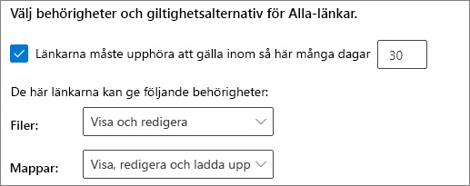
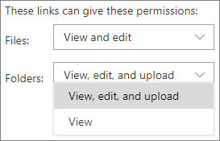
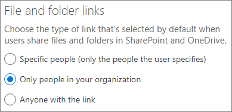
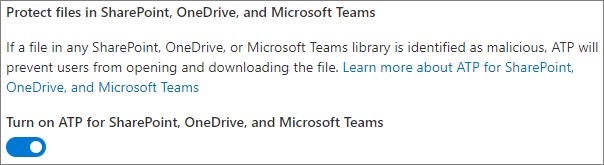

# Metodtips för att dela filer och mappar med oautentiserade användare

Oautentiserad delning (*Alla*-länkar) kan vara smidigt och användbart i olika scenarier. *Alla*-länkar är det enklaste sättet att dela: personer kan öppna länken utan autentisering och kan skicka den vidare till andra.

Vanligtvis är inte allt innehåll i en organisation lämpligt för oautentiserad delning. I den här artikeln beskrivs de alternativ som är tillgängliga för att hjälpa dig att skapa en miljö där dina användare kan använda oautentiserad delning av filer och mappar, men där det finns säkerhetsåtgärder för att skydda organisationens innehåll.

> [!NOTE]
> För att oautentiserad delning ska fungera måste du aktivera den för din organisation och för den enskilda webbplatsen eller det team som du ska använda. Se [Samarbeta med personer utanför organisationen](collaborate-with-people-outside-your-organization.md) för det scenario du vill aktivera.

## Ange ett utgångsdatum för Alla-länkar

Filer lagras ofta på webbplatser, i grupper och team under långa tidsperioder. Ibland finns det datakvarhållningsprinciper som kräver att filer bevaras i flera år. Om de här filerna delas med oautentiserade personer kan detta leda till oväntad åtkomst och framtida ändringar i filerna. Om du vill minska risken för detta kan du konfigurera en förfallotid för *Alla*-länkar.

När en *Alla*-länk går ut kan den inte längre användas för att få åtkomst till innehåll.

Ange ett utgångsdatum för Alla-länkar
1. Öppna administrationscentret för SharePoint Online.
2. Klicka på **Delning** i det vänstra navigeringsfönstret.
3. Under **Avancerade inställningar för "Alla"-länkar** markerar du kryssrutan **Länkarna måste upphöra att gälla inom så här många dagar**. 
   
4. Skriv ett antal dagar i rutan och klicka sedan på **Spara**.

Tänk på att när en *Alla*-länk går ut kan filen eller mappen delas igen med en ny *Alla*-länk.

## Ange behörigheter för länk

*Alla*-länkar för en fil tillåter som standard personer att redigera filen, och *Alla*-länkar för en mapp tillåter personer att redigera och visa filer samt att ladda upp nya filer till mappen. Du kan ändra de här behörigheterna till endast visning för filer och mappar oberoende av varandra.

Om du vill tillåta oautentiserad delning, men är orolig för att oautentiserade personer ska ändra organisationens innehåll, bör du överväga att ställa in behörigheterna för filer och mappar till **Visa**.

Ange behörigheter för Alla-länkar
1. Öppna administrationscentret för SharePoint Online.
2. Klicka på **Delning** i det vänstra navigeringsfönstret.
3. Under **Avancerade inställningar för "Alla"-länkar** väljer du de fil- och mappbehörigheter som du vill använda. 
   

Med *Alla*-länkar inställda på **Visa** kan användare fortfarande dela filer och mappar med gäster och ge dem redigeringsbehörighet genom att använda *Specifika personer*-länkar. Med dessa länkar måste personer utanför organisationen autentiseras som gäster, och du kan spåra och granska gästaktiviteten i filer och mappar som delas med dessa länkar.

## Ställa in standardlänktypen till att endast fungera för personer i organisationen

När *Alla*-delning aktiveras för organisationen anges normalt delningslänken till **Alla**. Det kan vara praktiskt för användarna, men kan öka risken för oavsiktlig oautentiserad delning. Om en användare glömmer att ändra länktypen vid delning av ett känsligt dokument, kan det hända att de oavsiktligt skapar en delningslänk som inte kräver autentisering.

Du kan minska den här risken genom att ändra standardlänkinställningen till en länk som bara fungerar för personer i organisationen. Användare som vill dela med oautentiserade personer måste då specifikt välja det alternativet.

Ange standarddelningslänken för filer och mappar
1. I navigeringsfönstret till vänster i administrationscentret för SharePoint klickar du på **Delning**.
2. Under **Fil- och mapplänkar** väljer du **Endast personer i organisationen**. 
   
3. Klicka på **Spara**

## Skydda mot skadliga filer

Om du tillåter anonyma användare att ladda upp filer ökar risken för att någon laddar upp en skadlig fil. I Microsoft 365 kan du använda funktionen för *säkra bifogade filer* i avancerat skydd för att automatiskt söka igenom uppladdade filer och sätta filer som kan vara osäkra i karantän.

Aktivera säkra bifogade filer
1. Öppna administrationscentret för [Microsoft 365 Säkerhet](https://security.microsoft.com).
2. Klicka på **Principer** i det vänstra navigeringsfönstret.
3. Under **Skydd mot hot** klickar du på **ATP – säkra bifogade filer (Office 365)**.
4. Markera kryssrutan **Aktivera ATP för SharePoint, OneDrive och Microsoft Teams** och klicka sedan på **Spara**. 
   

## Lägga till copyrightinformation i dina filer

Om du använder känslighetsetiketter i administrationscentret för Microsoft 365 Efterlevnad kan du konfigurera etiketterna för att automatiskt lägga till en vattenstämpel eller ett sidhuvud eller en sidfot i organisationens Office-dokument. På så sätt kan du se till att delade filer innehåller copyright- eller annan ägarskapsinformation.

Lägga till en sidfot i en fil med en etikett
1. Öppna [administrationscentret för Microsoft 365 Efterlevnad](https://compliance.microsoft.com).
2. I det vänstra navigeringsfönstret, under **Klassificering**, klickar du på **Känslighetsetiketter**.
3. Klicka på den etikett som du vill använda för att lägga till en sidfot och klicka sedan på **Redigera etikett**.
4. Klicka på fliken **Märkning av innehåll** och sätt sedan **på** innehållsmärkning.
5. Markera kryssrutan för den typ av text som du vill lägga till och klicka sedan på **Anpassa text**.
6. Skriv den text du vill lägga till i dina dokument, markera de textalternativ som du vill använda och klicka sedan på **Spara**. 
   
7. Klicka på **Spara** och sedan på **Stäng**.

När du har aktiverat innehållsmärkning för etiketten läggs den text som du angett till i Office-dokument när en användare använder etiketten.

## Se även

[Översikt över känslighetsetiketter](https://docs.microsoft.com/Office365/SecurityCompliance/sensitivity-labels)

[Begränsa oavsiktlig exponering för filer när de delas med gäster](share-limit-accidental-exposure.md)

[Skapa en säker miljö för gästdelning](create-secure-guest-sharing-environment.md)