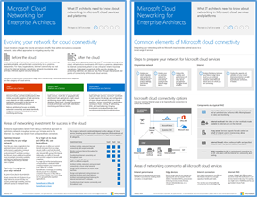
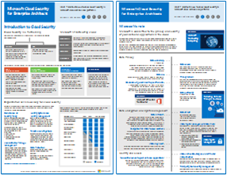
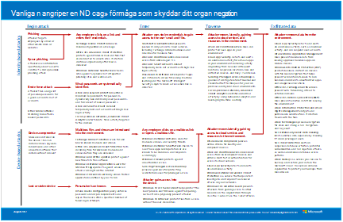

# Illustrationer för Microsoft moln för företagsarkitektur

De här moln arkitekturs förhands granskningarna ger dig information om Microsofts moln tjänster, inklusive Microsoft 365, Azure Active Directory (Azure AD), Microsoft Intune, Microsoft Dynamics 365 och hybrid lösningar. 

Besluts fattare och arkitekter kan använda de här resurserna för att fastställa de idealiska lösningarna för deras arbets belastning och för att fatta beslut om kärn infrastruktur komponenter som nätverk, identitet och säkerhet.

### Microsoft Cloud Identity för Enterprise Architects

Vad IT-arkitekten behöver veta om att utforma identitet för organisationer som använder Microsofts moln tjänster och plattformar.
  
|**Objekt**|**Beskrivning**|
|:-----|:-----|
|   [Visa som en PDF-fil](../downloads/MSFT_cloud_architecture_identity.pdf) \| [Ladda ned som PDF](https://github.com/MicrosoftDocs/microsoft-365-docs/raw/public/microsoft-365/downloads/MSFT_cloud_architecture_identity.pdf) \| [Ladda ned som Visio](https://github.com/MicrosoftDocs/microsoft-365-docs/raw/public/microsoft-365/downloads/MSFT_cloud_architecture_identity.vsdx)    Uppdaterat 2020 | Den här modellen innehåller:  <ul> <li> Introduktion till identitet med Microsofts moln </li><li> Azure AD IDaaS-funktioner </li><li> Integrera lokala AD DS-konton (Active Directory Domain Services) med Azure AD </li><li> Lägga till katalog komponenter i Azure IaaS </li><li> AD DS-alternativ för arbets belastning i Azure IaaS </li></ul>    |
   

### Microsoft Cloud Networking for Enterprise Architects

Det här behöver du veta mer om nätverk för Microsofts moln tjänster och plattformar.
  
|**Objekt**|**Beskrivning**|
|:-----|:-----|
|    [Visa som en PDF-fil](../downloads/MSFT_cloud_architecture_networking.pdf) \| [Ladda ned som PDF](https://github.com/MicrosoftDocs/microsoft-365-docs/raw/public/microsoft-365/downloads/MSFT_cloud_architecture_networking.pdf) \| [Ladda ned som Visio](https://github.com/MicrosoftDocs/microsoft-365-docs/raw/public/microsoft-365/downloads/MSFT_cloud_architecture_networking.vsdx)    Uppdaterat 2020 | Den här modellen innehåller: <ul><li> Skydda nätverket för moln anslutningar </li><li> Vanliga element i Microsoft Cloud Connectivity </li><li> ExpressRoute för Microsoft Cloud Connectivity </li><li> Designa nätverk för Microsoft SaaS, Azure PaaS och Azure IaaS </li></ul>    |

### Microsofts hybrid moln för Enterprise Architects

Vad IT-arkitekten behöver veta om hybrid moln för Microsoft-tjänster och plattformar.
  
|**Objekt**|**Beskrivning**|
|:-----|:-----|
|   [Visa som en PDF-fil](../downloads/MSFT_cloud_architecture_hybrid.pdf) \| [Ladda ned som PDF](https://github.com/MicrosoftDocs/microsoft-365-docs/raw/public/microsoft-365/downloads/MSFT_cloud_architecture_hybrid.pdf) \| [Ladda ned som Visio](https://github.com/MicrosoftDocs/microsoft-365-docs/raw/public/microsoft-365/downloads/MSFT_cloud_architecture_hybrid.vsdx)      Uppdaterat 2020 | Den här modellen innehåller: <ul><li> Microsofts moln tjänster (SaaS, Azure PaaS och Azure IaaS) och deras gemensamma element </li><li> Hybrid moln arkitektur för Microsofts moln tjänster </li><li> Hybrid moln scenarier för Microsoft SaaS (Office 365), Azure PaaS och Azure IaaS </li></ul> |
   

### Arkitektur som gäller för Microsofts moln innehavare-migreringar 
I denna serie avsnitt visas flera olika arkitektur funktioner för fusioner, förvärv, divestitures och andra scenarier som kan leda till att du migrerar till en ny moln klient organisation. De här avsnitten innehåller vägledning för start punkten för planering. 

|**Objekt**|**Beskrivning**|
|:-----|:-----|
|   [PDF](https://github.com/MicrosoftDocs/microsoft-365-docs/raw/public/microsoft-365/downloads/Microsoft-365-tenant-to-tenant-migration.pdf) \| [Visio](https://github.com/MicrosoftDocs/microsoft-365-docs/raw/public/microsoft-365/downloads/Microsoft-365-tenant-to-tenant-migration.vsdx)  Uppdaterat 2019    |Den här modellen innehåller: <ul><li>En mappning av affärs scenarier till arkitektur metoder</li><li>Utformning</li><li>Migreringsjobb för enskild händelse</li><li>Fasat migreringsarkiv</li><li>Innehavarens flytt-eller flödes schema</li></ul>|

### Microsoft Cloud Security för Enterprise Architects

Vad IT-arkitekten behöver veta om säkerhet i Microsofts moln tjänster och plattformar.
  
|**Objekt**|**Beskrivning**|
|:-----|:-----|
|[          ](https://www.microsoft.com/download/details.aspx?id=48121)   [PDF](https://go.microsoft.com/fwlink/p/?linkid=842070)  \| [Visio](https://go.microsoft.com/fwlink/p/?LinkId=842071)  \| [Fler språk](https://www.microsoft.com/download/details.aspx?id=48121)  Uppdaterat 2018 | Den här modellen innehåller: <ul><li>Microsoft-rollen för att erbjuda säkra tjänster och plattformar</li><li>Kund ansvar för att minska säkerhets riskerna</li><li>Högsta säkerhets certifiering </li><li>Säkerhets erbjudanden som tillhandahålls av Microsoft Consulting Services </ul> |

### Vanliga attacker och Microsoft-funktioner som skyddar din organisation
Lär dig mer om de vanligaste cyberterrorism-attackerna och hur Microsoft kan hjälpa din organisation i varje steg. 

|**Objekt**|**Beskrivning**|
|:-----|:-----|
|   [PDF](https://download.microsoft.com/download/F/A/C/FACFC1E9-FA35-4DF1-943C-8D4237B4275B/MSFT_Cloud_architecture_security_commonattacks.pdf) \| [Visio](https://download.microsoft.com/download/F/A/C/FACFC1E9-FA35-4DF1-943C-8D4237B4275B/MSFT_Cloud_architecture_security_commonattacks.vsdx)   Uppdaterat 2017 | Denna affisch illustrerar sökvägen till vanliga attacker och beskriver vilka funktioner som hjälper dig att stoppa attackerarna i varje steg av en attack.  |

