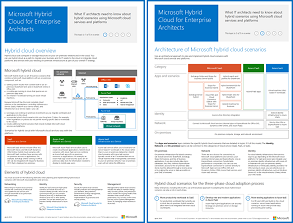

# Microsoft Cloud för Enterprise Architects-illustrationerMicrosoft cloud for enterprise architects illustrations

De här moln arkitekturs förhands granskningen ger dig information om Microsofts moln tjänster, inklusive Office 365, Azure Active Directory, Microsoft Intune, Microsoft Dynamics CRM Online och hybrid lokala och moln lösningar.These cloud architecture posters give you information about Microsoft cloud services, including Office 365, Azure Active Directory, Microsoft Intune, Microsoft Dynamics CRM Online, and hybrid on-premises and cloud solutions. Besluts fattare och arkitekter kan använda de här resurserna för att fastställa de idealiska lösningarna för deras arbets belastning och för att fatta beslut om kärn infrastruktur komponenter som identitet och säkerhet.IT decision makers and architects can use these resources to determine the ideal solutions for their workloads and to make decisions about core infrastructure components such as identity and security.

   

### Microsoft Cloud Networking for Enterprise ArchitectsMicrosoft cloud networking for enterprise architects

Det här behöver du veta mer om nätverk för Microsofts moln tjänster och plattformar.What IT architects need to know about networking for Microsoft cloud services and platforms.
  
|**Objekt****Item**|**Beskrivning****Description**|
|:-----|:-----|
|   [PDF](https://github.com/MicrosoftDocs/microsoft-365-docs/raw/public/microsoft-365/downloads/MSFT_cloud_architecture_networking.pdf)  \| [Visio](https://github.com/MicrosoftDocs/microsoft-365-docs/raw/public/microsoft-365/downloads/MSFT_cloud_architecture_networking.vsdx)[PDF](https://github.com/MicrosoftDocs/microsoft-365-docs/raw/public/microsoft-365/downloads/MSFT_cloud_architecture_networking.pdf)  \| [Visio](https://github.com/MicrosoftDocs/microsoft-365-docs/raw/public/microsoft-365/downloads/MSFT_cloud_architecture_networking.vsdx)  Uppdaterat 2020Updated August 2020 | Den här modellen innehåller:This model contains: <ul><li> Skydda nätverket för moln anslutningarEvolving your network for cloud connectivity </li><li> Vanliga element i Microsoft Cloud ConnectivityCommon elements of Microsoft cloud connectivity </li><li> ExpressRoute för Microsoft Cloud ConnectivityExpressRoute for Microsoft cloud connectivity </li><li> Designa nätverk för Microsoft SaaS, Azure PaaS och Azure IaaSDesigning networking for Microsoft SaaS, Azure PaaS, and  Azure IaaS </li></ul>    |

### Microsofts hybrid moln för Enterprise ArchitectsMicrosoft hybrid cloud for enterprise architects

Vad IT-arkitekten behöver veta om hybrid moln för Microsoft-tjänster och plattformar.What IT architects need to know about hybrid cloud for Microsoft services and platforms.
  
|**Objekt****Item**|**Beskrivning****Description**|
|:-----|:-----|
|   [PDF](https://github.com/MicrosoftDocs/microsoft-365-docs/raw/public/microsoft-365/downloads/MSFT_cloud_architecture_hybrid.pdf)  \| [Visio](https://github.com/MicrosoftDocs/microsoft-365-docs/raw/public/microsoft-365/downloads/MSFT_cloud_architecture_hybrid.vsdx)[PDF](https://github.com/MicrosoftDocs/microsoft-365-docs/raw/public/microsoft-365/downloads/MSFT_cloud_architecture_hybrid.pdf)  \| [Visio](https://github.com/MicrosoftDocs/microsoft-365-docs/raw/public/microsoft-365/downloads/MSFT_cloud_architecture_hybrid.vsdx)  Uppdaterat 2020Updated August 2020 | Den här modellen innehåller:This model contains: <ul><li> Microsofts moln tjänster (SaaS, Azure PaaS och Azure IaaS) och deras gemensamma elementMicrosoft's cloud offerings (SaaS, Azure PaaS, and Azure IaaS) and their common elements </li><li> Hybrid moln arkitektur för Microsofts moln tjänsterHybrid cloud architecture for Microsoft's cloud offerings </li><li> Hybrid moln scenarier för Microsoft SaaS (Office 365), Azure PaaS och Azure IaaSHybrid cloud scenarios for Microsoft SaaS (Office 365), Azure PaaS, and Azure IaaS </li></ul> |
   

### Arkitektur som gäller för Microsofts moln innehavare-migreringarArchitecture approaches for Microsoft cloud tenant-to-tenant migrations 
I denna serie avsnitt visas flera olika arkitektur funktioner för fusioner, förvärv, divestitures och andra scenarier som kan leda till att du migrerar till en ny moln klient organisation.This series of topics illustrates several architecture approaches for mergers, acquisitions, divestitures, and other scenarios that might lead you to migrate to a new cloud tenant. De här avsnitten innehåller vägledning för start punkten för planering.These topics provide starting-point guidance for planning. 

|**Objekt****Item**|**Beskrivning****Description**|
|:-----|:-----|
|   [PDF](https://github.com/MicrosoftDocs/microsoft-365-docs/raw/public/microsoft-365/downloads/Microsoft-365-tenant-to-tenant-migration.pdf) \| [Visio](https://github.com/MicrosoftDocs/microsoft-365-docs/raw/public/microsoft-365/downloads/Microsoft-365-tenant-to-tenant-migration.vsdx)[PDF](https://github.com/MicrosoftDocs/microsoft-365-docs/raw/public/microsoft-365/downloads/Microsoft-365-tenant-to-tenant-migration.pdf) \| [Visio](https://github.com/MicrosoftDocs/microsoft-365-docs/raw/public/microsoft-365/downloads/Microsoft-365-tenant-to-tenant-migration.vsdx)  Uppdaterat 2019Updated July 2019    |Den här modellen innehåller:This model contains: <ul><li>En mappning av affärs scenarier till arkitektur metoderA mapping of business scenarios to architecture approaches</li><li>UtformningDesign considerations</li><li>Migreringsjobb för enskild händelseSingle event migration flow</li><li>Fasat migreringsarkivPhased migration flow</li><li>Innehavarens flytt-eller flödes schemaTenant move or split flow</li></ul>|

### Microsoft Cloud Security för Enterprise ArchitectsMicrosoft cloud security for enterprise architects

Vad IT-arkitekten behöver veta om säkerhet i Microsofts moln tjänster och plattformar.What IT architects need to know about security in Microsoft cloud services and platforms.
  
|**Objekt****Item**|**Beskrivning****Description**|
|:-----|:-----|
|[          ](https://www.microsoft.com/download/details.aspx?id=48121)[          ](https://www.microsoft.com/download/details.aspx?id=48121)   [PDF](https://go.microsoft.com/fwlink/p/?linkid=842070)  \| [Visio](https://go.microsoft.com/fwlink/p/?LinkId=842071)  \| [Fler språk](https://www.microsoft.com/download/details.aspx?id=48121)[PDF](https://go.microsoft.com/fwlink/p/?linkid=842070)  \| [Visio](https://go.microsoft.com/fwlink/p/?LinkId=842071)  \| [More languages](https://www.microsoft.com/download/details.aspx?id=48121)  Uppdaterat 2018Updated December 2018 | Den här modellen innehåller:This model contains: <ul><li>Microsoft-rollen för att erbjuda säkra tjänster och plattformarMicrosoft's role in providing secure services and platforms</li><li>Kund ansvar för att minska säkerhets riskernaCustomer responsibilities to mitigate security risks</li><li>Högsta säkerhets certifieringTop security certifications </li><li>Säkerhets erbjudanden som tillhandahålls av Microsoft Consulting ServicesSecurity offerings provided by Microsoft consulting services </ul> |

### Vanliga attacker och Microsoft-funktioner som skyddar din organisationCommon attacks and Microsoft capabilities that protect your organization
Lär dig mer om de vanligaste cyberterrorism-attackerna och hur Microsoft kan hjälpa din organisation i varje steg.Learn about the most common cyber attacks and how Microsoft can help your organization at every stage of an attack. 

|**Objekt****Item**|**Beskrivning****Description**|
|:-----|:-----|
|   [PDF](https://download.microsoft.com/download/F/A/C/FACFC1E9-FA35-4DF1-943C-8D4237B4275B/MSFT_Cloud_architecture_security_commonattacks.pdf) \| [Visio](https://download.microsoft.com/download/F/A/C/FACFC1E9-FA35-4DF1-943C-8D4237B4275B/MSFT_Cloud_architecture_security_commonattacks.vsdx)[PDF](https://download.microsoft.com/download/F/A/C/FACFC1E9-FA35-4DF1-943C-8D4237B4275B/MSFT_Cloud_architecture_security_commonattacks.pdf) \| [Visio](https://download.microsoft.com/download/F/A/C/FACFC1E9-FA35-4DF1-943C-8D4237B4275B/MSFT_Cloud_architecture_security_commonattacks.vsdx)   Uppdaterat 2017Updated August 2017 | Denna affisch illustrerar sökvägen till vanliga attacker och beskriver vilka funktioner som hjälper dig att stoppa attackerarna i varje steg av en attack.This poster illustrates the path of common attacks and describes which capabilities help stop attackers at each stage of an attack.  |

### Microsoft Cloud Identity för Enterprise ArchitectsMicrosoft cloud identity for enterprise architects

Vad IT-arkitekten behöver veta om att utforma identitet för organisationer som använder Microsofts moln tjänster och plattformar.What IT architects need to know about designing identity for organizations using Microsoft cloud services and platforms.
  
|**Objekt****Item**|**Beskrivning****Description**|
|:-----|:-----|
|[          ](https://www.microsoft.com/download/details.aspx?id=54431)[          ](https://www.microsoft.com/download/details.aspx?id=54431)   [PDF](https://go.microsoft.com/fwlink/p/?LinkId=524586) \| [Visio](https://download.microsoft.com/download/2/3/8/238228E6-9017-4F6C-BD3C-5559E6708F82/MSFT_cloud_architecture_identity.vsd) \| [Fler språk](https://www.microsoft.com/download/details.aspx?id=54431)             [PDF](https://go.microsoft.com/fwlink/p/?LinkId=524586)  \| [Visio](https://download.microsoft.com/download/2/3/8/238228E6-9017-4F6C-BD3C-5559E6708F82/MSFT_cloud_architecture_identity.vsd)           \| [More languages](https://www.microsoft.com/download/details.aspx?id=54431)  Uppdaterat 2016Updated August 2016 | Den här modellen innehåller:This model contains: <ul><li>Introduktion till identitet med Microsofts molnIntroduction to identity with Microsoft's cloud </li><li>Azure AD IDaaS-funktionerAzure AD IDaaS capabilities </li><li>Integrera lokala Active Directory Domain Services-konton med Microsoft Azure Active DirectoryIntegrating on-premises Active Directory Domain Services accounts with Microsoft Azure Active Directory </li><li>Lägga till katalog komponenter i AzurePutting directory components in Azure </li><li>Alternativ för domän tjänster för arbets belastningar i Azure IaaSDomain services options for workloads in Azure IaaS </li></ul> |
   