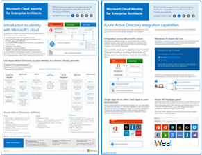

# Microsoft Cloud för illustrationer av IT-arkitekter

De här molnarkitekturaffischerna ger information om Microsoft-molntjänster, bland annat Microsoft 365, Azure Active Directory (Azure AD), Microsoft Intune, Microsoft Dynamics 365 och lokala och molnbaserade hybridlösningar. 

IT-beslutsfattare och IT-arkitekter kan använda de här resurserna till att hitta de perfekta lösningarna för sina arbetsbelastningar och till att fatta beslut om grundläggande infrastrukturkomponenter som nätverk, identitet och säkerhet.

### Microsoft Cloud-identitet för IT-arkitekter

Vilka IT-arkitekter behöver veta om att utforma identitet för organisationer som använder Microsoft-molntjänster och -plattformar.
  
| Objekt | Beskrivning |
|:-----|:-----|
|   [Visa som PDF](../downloads/MSFT_cloud_architecture_identity.pdf) \| [Ladda ned som PDF](https://github.com/MicrosoftDocs/microsoft-365-docs/raw/public/microsoft-365/downloads/MSFT_cloud_architecture_identity.pdf)   Uppdaterad september 2020 | Den här modellen innehåller:  <ul> <li> Introduktion till identitet med Microsofts moln </li><li> Azure AD IDaaS-funktioner </li><li> Integrera AD DS-konton (Active Directory Domain Services) lokalt med Azure AD </li><li> Placera katalogkomponenter i Azure IaaS </li><li> AD DS-alternativ för arbetsbelastningar i Azure IaaS </li></ul>    |

### Microsoft Cloud-säkerhet för IT-arkitekter

Vilka IT-arkitekter behöver veta om säkerhet i Microsoft-molntjänster och -plattformar.
  
| Objekt | Beskrivning |
|:-----|:-----|
|.pdf)   [PDF](https://download.microsoft.com/download/6/D/F/6DFD7614-BBCF-4572-A871-E446B8CF5D79/MSFT_cloud_architecture_security%20(1).pdf)  \|  Uppdaterades april 2021 | Den här modellen innehåller: <ul><li>Microsoft- och kundens säkerhetsansvar</li><li>Identitets- och enhetsåtkomst</li><li>Skydd mot hot</li><li>Informationsskydd </ul> |
   

### Microsoft-molnnätverk för IT-arkitekter

Vilka IT-arkitekter behöver veta om nätverk för Microsoft-molntjänster och Microsoft-plattformar.
  
| Objekt | Beskrivning |
|:-----|:-----|
|    [Visa som PDF](../downloads/MSFT_cloud_architecture_networking.pdf) \| [Ladda ned som PDF](https://github.com/MicrosoftDocs/microsoft-365-docs/raw/public/microsoft-365/downloads/MSFT_cloud_architecture_networking.pdf) \| [Ladda ned som Visio](https://github.com/MicrosoftDocs/microsoft-365-docs/raw/public/microsoft-365/downloads/MSFT_cloud_architecture_networking.vsdx)    Uppdaterades augusti 2020 | Den här modellen innehåller: <ul><li> Utveckla ditt nätverk för molnanslutning </li><li> Vanliga element i Microsofts molnanslutning </li><li> ExpressRoute för Microsoft molnanslutning </li><li> Utforma nätverk för Microsoft SaaS, Azure PaaS och Azure IaaS </li></ul>    |

### Microsoft-hybridmoln för IT-arkitekter

Vilka IT-arkitekter behöver veta om hybridmoln för Microsoft-tjänster och plattformar.
  
| Objekt | Beskrivning |
|:-----|:-----|
|   [Visa som PDF](../downloads/MSFT_cloud_architecture_hybrid.pdf) \| [Ladda ned som PDF](https://github.com/MicrosoftDocs/microsoft-365-docs/raw/public/microsoft-365/downloads/MSFT_cloud_architecture_hybrid.pdf) \| [Ladda ned som Visio](https://github.com/MicrosoftDocs/microsoft-365-docs/raw/public/microsoft-365/downloads/MSFT_cloud_architecture_hybrid.vsdx)      Uppdaterades augusti 2020 | Den här modellen innehåller: <ul><li> Microsofts molntjänster (SaaS, Azure PaaS och Azure IaaS) och deras gemensamma element </li><li> Hybridmolnarkitektur för Microsofts molntjänster </li><li> Hybridmolnscenarier för Microsoft SaaS (Office 365), Azure PaaS och Azure IaaS </li></ul> |

### Arkitektur metoder för migrering från Microsoft molnklientorganisationen till klientorganisation 
Den här serien med ämnen illustrerar flera arkitekturinslag för sammanslagningar, förvärv, företag och andra scenarier som kan få dig att migrera till en ny molnklientorganisation. I de här avsnitten får du utgångspunktsvägledning för resursplaneringen i företaget. 

| Objekt | Beskrivning |
|:-----|:-----|
|   [PDF](https://download.microsoft.com/download/b/a/1/ba19dfe7-96e2-4983-8783-4dcff9cebe7b/microsoft-365-tenant-to-tenant-migration.pdf) \| Uppdaterades februari 2021    |Den här modellen innehåller: <ul><li>En mappning av affärsscenarier till arkitektur närmar sig</li><li>Designöverväganden</li><li>Exempel på migreringsflöde för en enstaka händelse</li><li>Exempel på fasad migreringsflöde</li><li>Exempel på flyttning eller delat flöde för klientorganisation</li></ul>|

### Vanliga attacker och Microsoft-funktioner som skyddar din organisation
Lär dig mer om de vanligaste cyberattackeren och hur Microsoft kan hjälpa din organisation i alla steg av en attack. 

| Objekt | Beskrivning |
|:-----|:-----|
|   [PDF](https://download.microsoft.com/download/F/A/C/FACFC1E9-FA35-4DF1-943C-8D4237B4275B/MSFT_Cloud_architecture_security_commonattacks.pdf) \| [Visio](https://download.microsoft.com/download/F/A/C/FACFC1E9-FA35-4DF1-943C-8D4237B4275B/MSFT_Cloud_architecture_security_commonattacks.vsdx)   Uppdaterades augusti 2017 | Den här affischen illustrerar hur vanliga attacker går och vilka funktioner som hjälper dig att stoppa attacker i varje steg av en attack.  |

