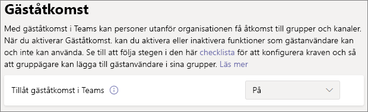

# Samarbeta med gäster i en grupp

Om du behöver samarbeta med gäster i dokument, uppgifter och konversationer rekommenderar vi att du använder Microsoft Teams. Teams tillhandahåller alla samarbetsfunktioner som är tillgängliga i Office och SharePoint med beständig chatt och en anpassningsbar och utökningsbar uppsättning samarbetsverktyg i en enhetlig användarupplevelse.

I den här artikeln går vi igenom de konfigurationssteg för Microsoft 365 som krävs för att konfigurera en grupp för samarbete med gäster. När du har konfigurerat gäståtkomst kan du bjuda in gäster till grupper genom att följa stegen i [Lägga till gäster i en grupp i Teams](https://support.microsoft.com/office/fccb4fa6-f864-4508-bdde-256e7384a14f).

## Videodemonstration

I den här videon visas konfigurationsstegen som beskrivs i det här dokumentet. 

> [!VIDEO https://www.microsoft.com/videoplayer/embed/RE44NTr?autoplay=false]

## Inställningar för externt samarbete i Azure

Delning i Microsoft 365 styrs på sin högsta nivå av inställningarna för [B2B-externt samarbete i Azure Active Directory](/azure/active-directory/external-identities/delegate-invitations). Om gästdelning är inaktiverad eller begränsad i Azure Active Directory åsidosätter den här inställningen alla delningsinställningar som du konfigurerar i Microsoft 365.

Kontrollera inställningarna för B2B-externt samarbete för att säkerställa att delning med gäster inte blockeras.

Inställningar för externt samarbete

1. Logga in till Azure Active Directory på [https://aad.portal.azure.com](https://aad.portal.azure.com).
2. I det vänstra navigeringsfönstret klickar du på **Azure Active Directory**.
3. Klicka på **Externa identiteter**.
4. På skärmen **Kom igång** i det vänstra navigeringsfönstret klickar du på **inställningar för externt samarbete**.
5. Se till **administratörer och användare i gästens inbjudna roll kan bjuda in** och **Medlemmar kan bjuda in** är båda inställda på **Ja**.
6. Om du har gjort ändringar klickar du på **Spara**.

Observera inställningarna i avsnittet **Begränsningar för samarbete**. Kontrollera att domänerna för de gäster som du vill samarbeta med inte är blockerade.

Om du arbetar med gäster från flera organisationer kanske du vill begränsa deras åtkomst till katalogdata. Det gör att de inte kan se vem mer som är gäst i katalogen. **Under begränsningar för gästanvändaråtkomst** kan du göra det genom att välja **Gästanvändare har begränsad åtkomst till egenskaper och medlemskap i inställningar för katalogobjekt** eller **Gästanvändaråtkomst begränsas till egenskaper och medlemskap i sina egna katalogobjekt**.

## Inställningar för gäståtkomst i Teams

Teams har en huvudknapp för gäståtkomst och en mängd olika inställningar som är tillgängliga för att styra vad gäster kan göra i en grupp. Huvudknappen, **Tillåt gäståtkomst i Teams** måste vara **På** för att gäståtkomst ska fungera i Teams.

Kontrollera att gäståtkomst är aktiverat i Teams och justera gästinställningarna utifrån företagets behov. Tänk på att de här inställningarna påverkar alla grupper.

Att ange inställningar för gäståtkomst i Teams

1. Logga in på Administrationscenter för Microsoft 365 på [https://admin.microsoft.com](https://admin.microsoft.com).
2. Klicka på **Visa alla** i det vänstra navigeringsfönstret.
3. Under **Administrationscenter** klickar du på **Teams**.
4. Expandera **Inställningar för hela organisationen** och klicka på **Gäståtkomst** i Teams Administrationscenter i vänstra navigeringsfönstret.
5. Kontrollera att **Tillåt gäståtkomst i Teams** är inställt på **På**.
6. Gör önskade ändringar i de ytterligare gästinställningarna och klicka sedan på **Spara**.

När Teams gäståtkomst har aktiverats kan du styra gäståtkomst till enskilda grupper och deras associerade SharePoint-webbplatser med hjälp av känslighetsetiketter. Mer information finns i [Använd känslighetsetiketter för att skydda innehåll i Microsoft Teams, Microsoft 365-grupper och SharePoint-webbplatser](../compliance/sensitivity-labels-teams-groups-sites.md).

> [!NOTE]
> Det kan ta upp till 24 timmar för gästinställningar i Teams att bli aktiva när du har aktiverat det.

## Gästinställningar för Microsoft 365-grupper

Teams använder Microsoft 365-grupper för gruppmedlemskap. Gästinställningarna för Microsoft 365-grupper måste vara aktiverat för att gäståtkomst i Teams ska fungera.

Ange gästinställningar för Microsoft 365-grupper

1. I det vänstra navigeringsfönstret i administrationscentret för Microsoft 365 expanderar du **Inställningar**.
2. Klicka **organisationens inställningar**.
3. I listan klickar du på **Microsoft 365-grupper**.
4. Kontrollera att kryssrutorna **Låt gruppägare lägga till personer utanför organisationen i Microsoft 365-grupper som gäster** och **Låt gästgruppsmedlemmar få åtkomst till gruppinnehåll** är markerade.
5. Om du har gjort ändringar klickar du på **Spara ändringar**.

## Delningsinställningar för SharePoint på organisationsnivå

Teams-innehåll som filer, mappar och listor lagras alla i SharePoint. För att gäster ska kunna få åtkomst till dessa objekt i Teams måste delningsinställningarna för SharePoint på organisationsnivå tillåta delning med gäster.

Inställningarna på organisationsnivå avgör vilka inställningar som är tillgängliga för enskilda webbplatser, inklusive webbplatser som är kopplade till grupper. Webbplatsinställningar får inte vara mer tillåtande än inställningarna på organisationsnivå.

Om du vill tillåta fil- och mappdelning med icke-dokumenterade personer väljer du **Alla**. Om du vill säkerställa att alla gäster måste autentiseras väljer du **Nya och befintliga gäster**. Välj den mest tillåtande inställning som behövs på alla webbplatser i din organisation.

För att ange delningsinställningar för SharePoint på organisationsnivå

1. I det vänstra navigeringsfönstret i administrationscentret för Microsoft 365 går du till **Administrationscenter** och klickar på **SharePoint**.
2. I det vänstra navigeringsfönstret i administrationscentret för SharePoint expanderar du **Principer** klickar sedan på **Delning**.
3. Se till att extern delning för SharePoint är inställd på **Alla** eller **Nya och befintliga gäster**.
4. Om du har gjort ändringar klickar du på **Spara**.

## Standardinställningar för länkar på organisationsnivå i SharePoint

Standardinställningarna för filer och mappar avgör vilket länkalternativ som visas för användarna när de delar en fil eller mapp. Användare kan ändra länktypen till något av de andra alternativen innan de delar om de vill.

Kom ihåg att den här inställningen påverkar alla grupper och SharePoint-webbplatser i organisationen.

Välj någon av följande länktyper som ska väljas som standard när användare delar filer och mappar:

- **Alla som har länken** – Välj det här alternativet om du förväntar dig att göra en mycket overifierade delning av filer och mappar. Om du vill tillåta att *Alla* -länkar men är bekymrad över oavsiktlig overifierad delning kan du överväga något av de andra alternativen som standard. Den här länktypen är bara tillgänglig om du har aktiverat **Alla** delning.
- **Endast personer i organisationen** – Välj det här alternativet om du förväntar dig att de flesta fil- och mappdelningar ska vara med personer inom organisationen.
- **Vissa personer** – Överväg det här alternativet om du förväntar dig att göra mycket fil- och mappdelning med gäster. Den här länktypen fungerar med gäster och kräver att de verifieras.
 

För att ange standardinställningar för länkar på organisationsnivå i SharePoint

1. Gå till sidan Delning i administrationscentret för SharePoint.
2. Välj den standard delningslänk du vill använda under **Fil- och mapplänkar**.
3. Om du har gjort ändringar klickar du på **Spara**.

## Skapa ett team

Nästa steg är att skapa det team du planerar att använda för att samarbeta med gäster.

För att skapa ett team
1. På fliken **Teams** du på fliken **Anslut till eller skapa ett team** längst ned i det vänstra fönstret.
2. Klicka sedan på **Skapa ett team**.
3. Välj **Bygg ett team från början**.
4. Välj **Privat** eller **Offentlig**.
5. Skriv ett namn och en beskrivning för gruppen och klicka på **Skapa**.
6. Klicka **Hoppa över**.

Vi bjuder in användare senare. Sedan är det viktigt att kontrollera inställningarna för delning på webbplatsnivå för SharePoint-webbplatsen som är kopplad till gruppen.

## Delningsinställningar på webbplatsnivå i SharePoint

Kontrollera inställningarna för delning på webbplatsnivå för att kontrollera att de tillåter den typ av åtkomst som du vill ha för det här teamet. Om du till exempel anger inställningar på organisationsnivå till **Alla**, men du vill att alla gäster ska autentisera för det här teamet, ska du kontrollera att delningsinställningarna på webbplatsnivån är inställda på **Nya och befintliga gäster**.

Så här anger du delningsinställningar på webbplatsnivå
1. I navigeringsfönstret till vänster i administrationscentret för SharePoint expanderar du **Webbplatser** och klickar på **Aktiva webbplatser**.
2. Välj webbplatsen för det team som du just har skapat.
3. Klicka... och välj **Delning**.
4. Kontrollera att delning är inställt på **Alla** eller **Nya och befintligt gäster**.
5. Om du har gjort ändringar klickar du på **Spara**.

## Bjuda in användare

Gästdelningsinställningarna är nu konfigurerade, så du kan börja lägga till interna användare och gäster i gruppen. 

Bjuda in interna användare till ett team
1. Klicka på **Fler alternativ** (**\*\*\***) i teamet och klicka sedan på **Lägg till medlem**.
2. Tryck på namnet på den person som du vill bjuda in.
3. Klicka på **Lägg till** och sedan på **Klart**.

Bjuda in gäster till ett team
1. Klicka på **Fler alternativ** (**\*\*\***) i teamet och klicka sedan på **Lägg till medlem**.
2. Skriv e-postadressen till gästen som du vill bjuda in.
3. Klicka på **Redigera gästinformation**.
4. Skriv gästens fullständiga namn och klicka på bockmarkeringen.
5. Klicka på **Lägg till** och sedan på **Klart**.

## Se även

[Metodtips för att dela filer och mappar med overifierade användare](best-practices-anonymous-sharing.md)

[Begränsa oavsiktlig exponering för filer när de delas med gäster](share-limit-accidental-exposure.md)

[Skapa en säker miljö för gästdelning](create-secure-guest-sharing-environment.md)

[Skapa ett B2B-extranät med hanterade gäster](b2b-extranet.md)

[SharePoint- och OneDrive-integrering med Azure AD B2B](/sharepoint/sharepoint-azureb2b-integration-preview)

[Delningsalternativ är gråtonade när du delar från SharePoint eller OneDrive](/sharepoint/troubleshoot/administration/sharing-options-grayed-out-when-sharing-from-sharepoint-online-or-onedrive)