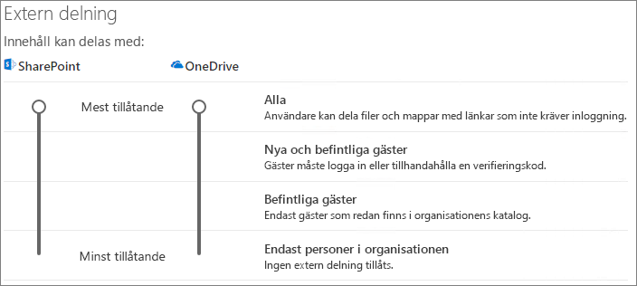

# Samarbeta med gäster på en webbplats

Om du behöver samarbeta med gäster i dokument, data och listor kan du använda en SharePoint-webbplats. Moderna SharePoint-webbplatser är anslutna till Microsoft 365-grupper och kan hantera webbplatsmedlemskapet och tillhandahålla ytterligare samarbetsverktyg, till exempel en delad postlåda och en kalender.

I den här artikeln går vi igenom konfigurationsstegen för Microsoft 365 som behövs för att konfigurera en SharePoint-webbplats för samarbete med gäster.

## Videodemonstration

I den här videon visas konfigurationsstegen som beskrivs i det här dokumentet. 

> [!VIDEO https://www.microsoft.com/videoplayer/embed/RE44Llg?autoplay=false]

## Inställningar för externt Samarbete i Azure

Delning i Microsoft 365 styrs på sin högsta nivå av inställningarna för [B2B-externt samarbete i Azure Active Directory](/azure/active-directory/external-identities/delegate-invitations). Om gästdelning är inaktiverad eller begränsad i Azure Active Directory åsidosätter den här inställningen alla delningsinställningar som du konfigurerar i Microsoft 365.

Kontrollera inställningarna för B2B externt samarbete för att säkerställa att delning med gäster inte blockeras.

Inställningar för externt samarbete

1. Logga in till Azure Active Directory på [https://aad.portal.azure.com](https://aad.portal.azure.com).
2. I det vänstra navigeringsfönstret klickar du på **Azure Active Directory**.
3. Klicka på **Externa identiteter**.
4. På skärmen **Kom igång** i det vänstra navigeringsfönstret klickar du på **inställningar för externt samarbete**.
5. Se till **administratörer och användare i gästens inbjudna roll kan bjuda in** och **Medlemmar kan bjuda in** är båda inställda på **Ja**.
6. Om du har gjort ändringar klickar du på **Spara**.

Observera inställningarna i avsnittet **Begränsningar för samarbete**. Kontrollera att domänerna för de gäster som du vill samarbeta med inte är blockerade.

Om du arbetar med gäster från flera organisationer kanske du vill begränsa deras åtkomst till katalogdata. Det gör att de inte kan se vem mer som är gäst i katalogen. **Under begränsningar för gästanvändaråtkomst** kan du göra det genom att välja **Gästanvändare har begränsad åtkomst till egenskaper och medlemskap i inställningar för katalogobjekt** eller **Gästanvändaråtkomst begränsas till egenskaper och medlemskap i sina egna katalogobjekt**.

## Gästinställningar för Microsoft 365-grupper

Moderna SharePoint-webbplatser använder Microsoft 365-grupper för att styra webbplatsåtkomsten. Gästinställningarna för Microsoft 365-grupper måste vara aktiverat för att gäståtkomst i SharePoint-webbplatser ska fungera.

Ange gästinställningar för Microsoft 365-grupper

1. I det vänstra navigeringsfönstret i administrationscentret för Microsoft 365 expanderar du **Inställningar**.
2. Klicka **organisationens inställningar**.
3. I listan klickar du på **Microsoft 365-grupper**.
4. Kontrollera att kryssrutorna **Låt gruppägare lägga till personer utanför organisationen i Microsoft 365-grupper som gäster** och **Låt gästgruppsmedlemmar få åtkomst till gruppinnehåll** är markerade.
5. Om du har gjort ändringar klickar du på **Spara ändringar**.

## Delningsinställningar på organisationsnivå i SharePoint

För att gäster ska ha åtkomst till SharePoint-webbplatser måste delningsinställningarna på SharePoint-organisationsnivå tillåta delning med gäster.

Inställningarna på organisationsnivå avgör vilka inställningar som ska vara tillgängliga för enskilda webbplatser. Webbplatsinställningar får inte vara mer tillåtande än inställningarna på organisationsnivå.

Om du vill tillåta icke-autisk fil- och mappdelning väljer du **Alla**. Om du vill säkerställa att alla personer utanför organisationen måste autentisera väljer du **Nya och befintliga gäster.** Välj den mest tillåtande inställning som behövs på alla webbplatser i din organisation.

För att ange delningsinställningar för SharePoint på organisationsnivå

1. I det vänstra navigeringsfönstret i administrationscentret för Microsoft 365 går du till **Administrationscenter** och klickar på **SharePoint**.
2. I det vänstra navigeringsfönstret i administrationscentret för SharePoint, under **Principer,** klickar du på **Delning.**
3. Se till att extern delning för SharePoint är inställd på **Alla** eller **Nya och befintliga gäster**.
4. Om du har gjort ändringar klickar du på **Spara**.

## Skapa en webbplats

Nästa steg är att skapa den webbplats som du planerar att använda för att samarbeta med gäster.

Så här skapar du en webbplats
1. I administrationscentret för SharePoint, under **Webbplatser**, klickar du på **Aktiva webbplatser**.
2. Klicka på **Skapa**.
3. Klicka **på Gruppwebbplats**.
4. Skriv ett webbplatsnamn och ange ett namn för gruppägaren (webbplatsägare).
5. Under **Avancerade inställningar** väljer du om du vill att den här webbplatsen ska vara offentlig eller privat.
6. Klicka på **Nästa**.
7. Klicka på **Slutför**.

Vi bjuder in användare senare. Sedan är det viktigt att kontrollera delningsinställningarna på webbplatsnivå för den här webbplatsen.

## Delningsinställningar på webbplatsnivå i SharePoint

Kontrollera inställningarna för delning på webbplatsnivå för att säkerställa att de tillåter den typ av åtkomst som du vill använda för webbplatsen. Om du till exempel har ställt in inställningarna på organisationsnivå till Alla **,** men du vill att alla gäster ska autentiseras för den här webbplatsen, kontrollerar du att delningsinställningarna på webbplatsnivå är inställda på Nya och **befintliga gäster.**

Observera att webbplatsen inte kan delas med oauthenticerade personer **(inställningen** Alla), men enskilda filer och mappar kan.

Du kan också använda [känslighetsetiketter för att styra inställningar för extern delning för SharePoint-webbplatser.](../compliance/sensitivity-labels-teams-groups-sites.md)

Så här anger du delningsinställningar på webbplatsnivå
1. I navigeringsfönstret till vänster i administrationscentret för SharePoint expanderar du **Webbplatser** och klickar på **Aktiva webbplatser**.
2. Välj den webbplats som du vill dela.
3. Klicka på ... och sedan på **Delning.**
4. Kontrollera att delning är inställt på **Alla** eller **Nya och befintligt gäster**.
5. Om du har gjort ändringar klickar du på **Spara**.

## Bjuda in användare

Inställningarna för gästdelning är nu konfigurerade så att du kan börja lägga till interna användare och gäster på webbplatsen. Webbplatsåtkomsten styrs via den associerade Microsoft 365-gruppen, så vi lägger till användare där.

Bjuda in interna användare till en grupp
1. Navigera till den webbplats där du vill lägga till användare.
2. Klicka **på** länken Medlemmar uppe till höger vilket anger antalet medlemmar.
3. Klicka på **Lägg till medlemmar.**
4. Skriv namnen eller e-postadresserna till de användare som du vill bjuda in till webbplatsen och klicka sedan på **Spara**.

Gäster kan inte läggas till från webbplatsen. Du måste lägga till dem med hjälp av Outlook på webben. Som en förutsättning för att lägga till och bjuda in gäster till en grupp klickar du därför på webbplatsens URL i **URL-kolumnen**  för att navigera till den webbplatsspecifika sidan. Klicka på ikonen för **appstartaren på den här** sidan och välj **Outlook**. Det här är skärmen där du kan bjuda in gäster till en grupp, som beskrivs nedan.

Bjuda in gäster till en grupp
1. Under **Grupper** klickar du på den grupp som du vill bjuda in gäster till.
2. Öppna gruppens kontaktkort, klicka **på medlemslänken** längst upp till höger (länken som anger antalet medlemmar).
3. klickar du **på Lägg till medlemmar.**
4. Skriv e-postadresserna till de gäster som du vill bjuda in och klicka sedan på Lägg **till**.
5. Klicka på **Stäng**.
Observera att du endast **behöver** klicka på Stäng om du inte är gruppens ägare och därför inte tillåts lägga till gästen i gruppen. I sådana fall överförs begäran att lägga till gästen i gruppen till gruppägaren för godkännande.

## Se även

[Metodtips för att dela filer och mappar med overifierade användare](best-practices-anonymous-sharing.md)

[Begränsa oavsiktlig exponering för filer när de delas med gäster](share-limit-accidental-exposure.md)

[Skapa en säker miljö för gästdelning](create-secure-guest-sharing-environment.md)

[Skapa ett B2B-extranät med hanterade gäster](b2b-extranet.md)

[SharePoint- och OneDrive-integrering med Azure AD B2B](/sharepoint/sharepoint-azureb2b-integration-preview)