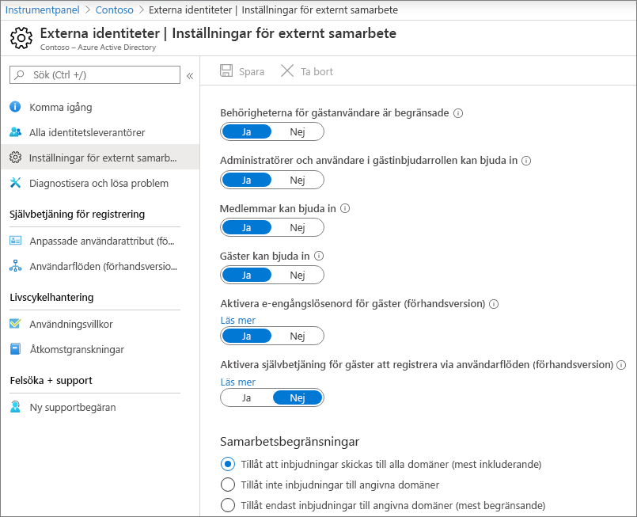
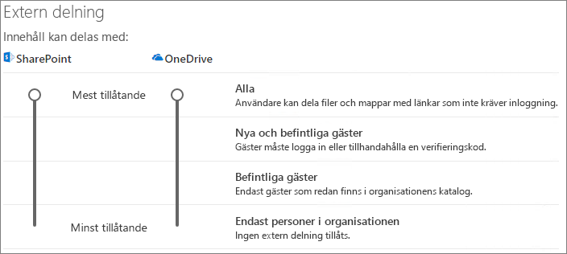
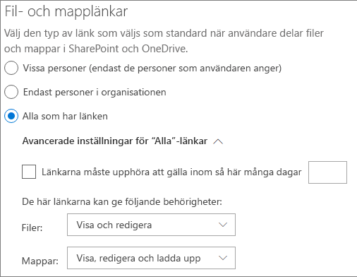
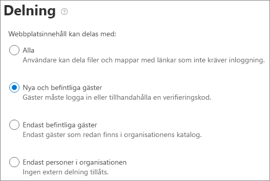

# Samarbeta med gäster i ett dokument

Om du behöver samarbeta med personer utanför organisationen i dokument i SharePoint eller OneDrive kan du skicka en delningslänk till dokumentet. I den här artikeln går vi igenom de konfigurationssteg för Microsoft 365 som krävs för att konfigurera delningslänkar för SharePoint och OneDrive för din organisations behov.

## Videodemonstration

Den här videon visar konfigurationsstegen som beskrivs i det här dokumentet. 

> [!VIDEO https://www.microsoft.com/videoplayer/embed/RE450Vt?autoplay=false]

## Inställningar för Azure-organisationsrelationer

Delning i Microsoft 365 styrs på högsta nivå av organisationsrelationerinställningarna i Azure Active Directory. Om gästdelning är inaktiverat eller begränsat i Azure AD åsidosätter detta alla delningsinställningar som du konfigurerar i Microsoft 365.

Kontrollera inställningarna för organisationsrelationer för att säkerställa att delning med gäster inte blockeras.

Så här anger du inställningar för organisationsrelationer

1. Logga in på Microsoft Azure på [https://portal.azure.com](https://portal.azure.com) .
2. Klicka på Azure **Active Directory**i den vänstra navigeringen .
3. Klicka på **Organisationsrelationer**i **fönstret Översikt.**
4. Klicka på **Inställningar**i fönstret **Organisationsrelationer** .
5. Se till att **administratörer och användare i gäst inbjudna roll kan bjuda in** och medlemmar kan bjuda **in** är båda inställda på **Ja**.
6. Om du har gjort ändringar klickar du på **Spara**.

Observera inställningarna i avsnittet **Samarbetsbegränsningar.** Kontrollera att domänerna för de gäster som du vill samarbeta med inte är blockerade.

## Delningsinställningar för SharePoint-organisationsnivå

För att personer utanför organisationen ska ha åtkomst till ett dokument i SharePoint eller OneDrive måste delningsinställningarna för SharePoint och OneDrive-organisation tillåta delning med personer utanför organisationen.

Inställningarna på organisationsnivå för SharePoint avgör vilka inställningar som är tillgängliga för enskilda SharePoint-webbplatser. Webbplatsinställningarna kan inte vara mer tillåtande än inställningarna på organisationsnivå. Inställningen på organisationsnivå för OneDrive avgör vilken delningsnivå som är tillgänglig i användarnas OneDrive-bibliotek.

Om du vill tillåta oautentiserade fil- och mappdelning för SharePoint och OneDrive väljer du **Alla**. Om du vill vara säkra på att personer utanför organisationen måste autentisera väljer du **Nya och befintliga gäster**. *Alla* länkar är det enklaste sättet att dela: personer utanför organisationen kan öppna länken utan autentisering och är fria att vidarebefordra den till andra.

För SharePoint väljer du den mest tillåtande inställningen som behövs av en webbplats i organisationen.

Så här anger du delningsinställningar för SharePoint-organisationsnivå

1. Klicka på **SharePoint**under Administrationscenter i administrationscentret för Microsoft 365 i det vänstra **navigeringscentret.**
2. I navigeringsfönstret till vänster i administrationscentret för SharePoint klickar du på **Delning**.
3. Kontrollera att extern delning för SharePoint eller OneDrive är inställt på **Alla** eller **Nya och befintliga gäster**. (Observera att OneDrive-inställningen inte kan vara mer tillåtande än SharePoint-inställningen.)
4. Om du har gjort ändringar klickar du på **Spara**.

## Standardlänkinställningar för sharepoint-organisationsnivå

Standardinställningarna för fil- och mapplänk avgör vilket länkalternativ som visas för användaren som standard när de delar en fil eller mapp. Användare kan ändra länktypen till ett av de andra alternativen innan de delar om så önskas.

Tänk på att den här inställningen påverkar SharePoint-webbplatser i organisationen och OneDrive.

Välj den typ av länk som är markerad som standard när användare delar filer och mappar:

- **Alla med länken** - Välj det här alternativet om du förväntar dig att göra en hel del oautentiserade fil- och mappdelning. Om du vill tillåta *någon* länkar men är oroliga för oavsiktlig oautentiserade delning, överväga ett av de andra alternativen som standard. Den här länktypen är bara tillgänglig om du har aktiverat **Någon delning.**
- **Endast personer i organisationen** – Välj det här alternativet om du förväntar dig att de flesta fil- och mappdelning ska vara med personer i organisationen.
- **Specifika personer** - Överväga det här alternativet om du förväntar dig att göra en hel del fil- och mappdelning med gäster. Denna typ av länk fungerar med gäster och kräver att de autentisera.
 

Så här anger du standardlänkinställningar för Standardlänkinställningar för SharePoint och OneDrive-organisation

1. Gå till sidan Delning i administrationscentret för SharePoint.
2. Under **Fil- och mapplänkar**väljer du den standarddelningslänk som du vill använda.
3. Om du har gjort ändringar klickar du på **Spara**.

## Delningsinställningar för SharePoint-webbplatsnivå

Om du delar filer och fodlers på en SharePoint-webbplats måste du också kontrollera delningsinställningarna på webbplatsnivå för den webbplatsen.

Så här anger du delningsinställningar på webbplatsnivå
1. I navigeringsfönstret till vänster i administrationscentret för SharePoint expanderar du **Webbplatser** och klickar på **Aktiva webbplatser**.
2. Välj den webbplats som du just skapade.
3. Klicka på **Delning** i menyfliksområdet.
4. Se till att delning är inställt **på Vem som helst** eller Nya och befintliga **gäster**.
5. Om du har gjort ändringar klickar du på **Spara**.

## Bjud in användare

Gästdelningsinställningarna är nu konfigurerade, så att användarna nu kan dela filer och mappar med personer utanför organisationen. Mer information finns i [Dela OneDrive-filer och -mappar](https://support.office.com/article/9fcc2f7d-de0c-4cec-93b0-a82024800c07) och [Dela SharePoint-filer eller sharepoint-mappar.](https://support.office.com/article/1fe37332-0f9a-4719-970e-d2578da4941c)

## Se även

[Metodtips för att dela filer och mappar med oautentiserade användare](best-practices-anonymous-sharing.md)

[Begränsa oavsiktlig exponering för filer när de delas med gäster](share-limit-accidental-exposure.md)