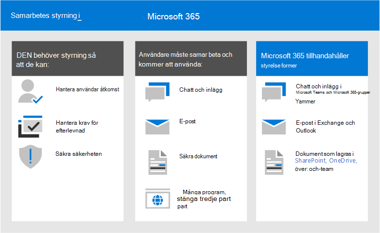
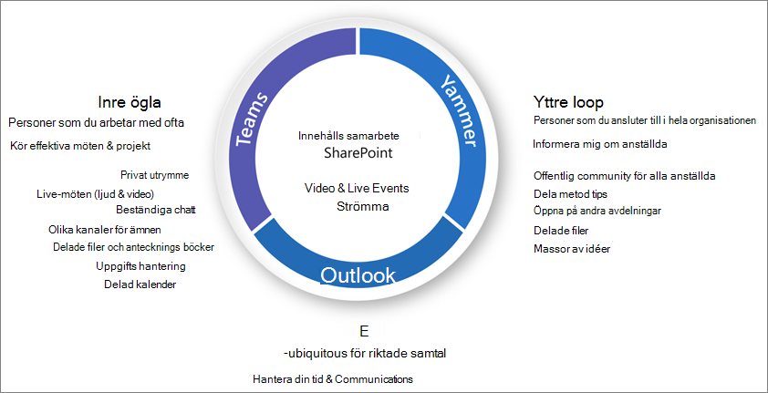
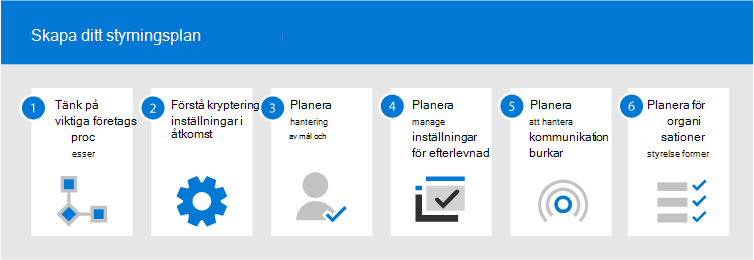
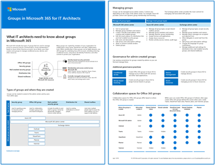
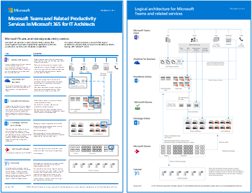

# Vad är styrning av samarbete?What is collaboration governance?

Med samarbetsstyrning hanterar du användarnas åtkomst till resurser, följer dina affärsstandarder och säkerställer säkerheten för dina data.Collaboration governance is how you manage users' access to resources, compliance with your business standards, and ensure the security of your data.

Organisationer använder i dag en rad olika verktyg.Organizations today are using a diverse tool set. Det finns en grupp utvecklare som använder gruppchatt, cheferna som skickar e-post och hela organisationen som ansluter via företagets sociala nätverk.There's the team of developers using team chat, the executives sending email, and the entire organization connecting over enterprise social. Flera samarbetsverktyg används eftersom varje grupp är unik och har sina egna funktionella behov och arbetsstil.Multiple collaboration tools are in use because every group is unique and has their own functional needs and work style. Vissa använder endast e-post medan andra främst finns i chatten.Some will use only email while others will live primarily in chat. 

Om användarna anser att de VERKTYG som tillhandahålls av IT inte passar deras behov kommer de antagligen att ladda ned sin favoritapp som stöder deras scenarier.If users feel the IT-provided tools do not fit their needs, they will likely download their favorite consumer app which supports their scenarios. Även om den här processen gör att användarna snabbt kan komma igång, ger det en frustrerande användarupplevelse i hela organisationen med flera inloggningar, problem med att dela och ingen enda plats för att visa innehåll.Although this process allows users to get started quickly, it leads to a frustrating user experience across the organization with multiple logins, difficulty sharing, and no single place to view content. Det här begreppet kallas "Skuggning IT" och utgör en betydande risk för organisationer.This concept is referred to as “Shadow IT” and poses a significant risk to organizations. Det minskar möjligheten att hantera användarnas åtkomst, säkerställa säkerhet och tjänstefterlevnad.It reduces the ability to uniformly manage user access, ensure security, and service compliance needs.

Tjänster som Microsoft 365-grupper, Teams och Yammer ger användarna möjlighet och minskar risken för skugg-IT genom att tillhandahålla de verktyg som krävs för att samarbeta.Services such as Microsoft 365 groups, Teams, and Yammer empower users and reduces the risk of shadow IT by providing the tools needed to collaborate. Microsoft 365 har en omfattande uppsättning verktyg för att implementera alla hanteringsfunktioner som din organisation kan behöva.Microsoft 365 has a rich set of tools to implement any governance capabilities your organization might require. 

Den här serien med artiklar hjälper dig att förstå hur grupper, team och SharePoint-inställningar interagerar, vilka hanteringsfunktioner som är tillgängliga och hur du skapar och implementerar en hanteringsplan för samarbetsfunktionerna i Microsoft 365.This series of articles will help you understand how groups, teams, and SharePoint settings interact, what governance capabilities are available, and how to create and implement a governance plan for the collaboration features in Microsoft 365.

### Konfigurera säkert samarbete med Microsoft 365Setting up secure collaboration with Microsoft 365

Det finns många alternativ för distribution av Microsoft 365-grupper och Teams för säkert samarbete i organisationen.There are many options for deploying Microsoft 365 Groups and Teams for secure collaboration in your organization. Vi rekommenderar att du använder det här styrningsinnehållet tillsammans med Konfigurera säkert samarbete med [Microsoft 365](setup-secure-collaboration-with-teams.md) och tillhörande artiklar för att skapa den bästa samarbetslösningen för din organisation.We recommend you use this governance content alongside [Set up secure collaboration with Microsoft 365](setup-secure-collaboration-with-teams.md) and its associated articles to create the best collaboration solution for your organization.

### DatahemData residency

Om din organisation är multinationell och du har krav för datalagring för olika platser, ska du ta med [Microsoft 365 Multi-Geo](/microsoft-365/enterprise/microsoft-365-multi-geo) som en del av samarbetsstyrningsplanen.If your organization is multi-national and you have data residency requirements for different geographies, include [Microsoft 365 Multi-Geo](/microsoft-365/enterprise/microsoft-365-multi-geo) as part of your collaboration governance plan.

## Varför microsoft 365-grupper är viktigaWhy Microsoft 365 groups are important

Med Microsoft 365-grupper kan du välja en grupp personer som du vill samarbeta med och enkelt skapa en samling med resurser som personerna kan dela.Microsoft 365 groups lets you choose a set of people with whom you wish to collaborate, and easily set up a collection of resources for those people to share. När medlemmar läggs till i gruppen tilldelas automatiskt nödvändiga behörigheter till alla tillgångar som tillhandahålls av gruppen.Adding members to the group automatically grants the needed permissions to all assets provided by the group. Både Teams och Yammer använder Microsoft 365-grupper för att hantera medlemskap.Both Teams and Yammer use Microsoft 365 groups to manage their membership.

Microsoft 365-grupper innehåller en uppsättning länkade resurser som användarna kan använda för kommunikation och samarbete.Microsoft 365 groups include a suite of linked resources that users can use for communication and collaboration. Grupper inkluderar alltid en SharePoint-webbplats, Planner, en Power BI-arbetsyta, en postlåda och kalender samt Stream.Groups always include a SharePoint site, Planner, a Power BI workspace, a mailbox and calendar, and Stream. Beroende på hur du skapar gruppen kan du lägga till andra tjänster som Teams, Yammer och Project.Depending on how you create the group, you can optionally add other services such as Teams, Yammer, and Project.

|ResursResource|BeskrivningDescription|
|:------|:----------|
|[KalenderCalendar](https://support.office.com/article/schedule-a-meeting-on-a-group-calendar-in-outlook-0cf1ad68-1034-4306-b367-d75e9818376a)|För schemaläggning av händelser relaterade till gruppenFor scheduling events related to the group|
|[InkorgenInbox](https://support.office.com/article/have-a-group-conversation-in-outlook-a0482e24-a769-4e39-a5ba-a7c56e828b22)|För e-postkonversationer mellan gruppmedlemmar.For email conversations between group members. Den här inkorgen har en e-postadress och kan ställas in för att ta emot meddelanden från personer utanför gruppen och även utanför organisationen, ungefär som en traditionell distributionslista.This inbox has an email address and can be set to accept messages from people outside the group and even outside your organization, much like a traditional distribution list.|
|[OneNote-anteckningsbokOneNote notebook](https://support.office.com/article/get-started-with-onenote-e768fafa-8f9b-4eac-8600-65aa10b2fe97)|Samla idéer, forskning och informationFor gathering ideas, research, and information|
|[PlannerPlanner](https://support.office.com/article/microsoft-planner-help-4a9a13c6-3adf-4a60-a6fc-15c0b15e16fc)|Tilldela och hantera projektuppgifter bland gruppmedlemmarnaFor assigning and managing project tasks among your group members|
|[Power BI-arbetsytaPower BI Workspace](https://docs.microsoft.com/power-bi/collaborate-share/service-new-workspaces)|Ett samarbetsutrymme för data med instrumentpaneler och rapporterA data collaboration space with dashboards and reports|
|[Projekt och översiktProject and Roadmap](https://support.microsoft.com/project)|Webbaserade projekthanteringsverktygWeb-based project management tools|
|[SharePoint-gruppwebbplatsSharePoint team site](https://support.office.com/article/what-is-a-sharepoint-team-site-75545757-36c3-46a7-beed-0aaa74f0401e)|En central lagringsplats för information, länkar och innehåll som rör gruppenA central repository for information, links and content relating to your group|
|[StrömmaStream](https://support.microsoft.com/microsoft-stream)|En tjänst för direktuppspelning av videoA video streaming service|
|[TeamsTeams](https://support.microsoft.com/teams)|En chattbaserad arbetsyta i Microsoft 365A chat-based workspace in Microsoft 365|
|[Yammer-gruppYammer group](https://support.office.com/article/Learn-about-Office-365-groups-b565caa1-5c40-40ef-9915-60fdb2d97fa2)|En gemensam plats för konversationer och för att dela informationA common place to have conversations and share information|

Microsoft 365 Groups innehåller en mängd olika hanteringskontroller, till exempel en förfalloprincip, namnkonventioner och en princip för blockerade ord som hjälper dig att hantera grupper i organisationen.Microsoft 365 Groups includes a variety of governance controls, including an expiration policy, naming conventions, and a blocked words policy, to help you manage groups in your organization. Eftersom grupper styr medlemskapet och åtkomsten till den här resurssviten är hanteringen av grupper en viktig del av samarbetet i Microsoft 365.Because groups control membership and access to this suite of resources, managing groups is a key part of governing collaboration in Microsoft 365.

## Definiera en samarbetsstrategi för organisationenDefine a collaboration strategy for your organization

Det finns flera platser där ni kan samarbeta och föra konversationer inom Microsoft 365.There are multiple places to collaborate and have conversations within Microsoft 365. Att förstå var användare kan starta konversationer kan hjälpa dig att definiera en strategi för kommunikation.Understanding where users can start conversations can help you define a strategy for communication.

Det finns tre huvudsakliga kommunikationsmetoder som stöds av Microsoft 365:There are three main communication methods supported by Microsoft 365:

- Outlook: samarbete via e-post med en delad gruppinkorg och kalenderOutlook: collaboration through email with a shared group inbox and calendar
- Microsoft Teams: En fortlöpande chattbaserad arbetsyta där du kan ha informella konversationer i realtid om olika ämnen, ordnade efter specifika undergrupperMicrosoft Teams: a persistent-chat-based workspace where you can have informal, real-time, conversations around a variety of topics, organized by specific sub-groups
- Yammer: företagets sociala nätverk för samarbeteYammer: enterprise social experience for collaboration

- Teams: chattbaserad arbetsyta (samarbete med hög hastighet) – inre slingaTeams: chat-based workspace (high velocity collaboration) – inner loop
  - Skapat för samarbete med de personer som dina användare arbetar med varje dagBuilt for collaboration with the people your users work with every day
  - Gör att information är lättillgänglig för alla användare på ett och samma sättPuts information at the fingertips of users in a single experience
  - Lägga till flikar, kopplingar och robotarAdd tabs, connectors and bots
  - Livechatt, ljud-/videokonferens, inspelade mötenLive chat, audio/video conferencing, recorded meetings

- Yammer: ansluta i hela organisationen (företagets sociala nätverk) – yttre slingaYammer: connect across the org (enterprise social) – outer loop
  - Användargrupper – Tvärfunktionella grupper med personer som delar ett gemensamt intresse eller expertis, men som inte nödvändigtvis arbetar tillsammans i det dagliga arbetetCommunities of practice - Cross-functional groups of people who share a common interest or expertise but are not necessarily working together on a day-to-day basis
  - Ledningsanslutning, utbildningsgemenskaper, rollbaserade communitiesLeadership connection, learning communities, role-based communities

- Postlåda och kalender (e-postbaserat samarbete)Mailbox and calendar (email-based collaboration)
  - Används för riktad kommunikation med en grupp personerUsed for targeted communication with a group of people
  - Delad kalender för möten med andra gruppmedlemmarShared calendar for meetings with other group members
 
När du bestämmer hur du vill använda samarbetsfunktionerna i Microsoft 365 bör du tänka på de här kommunikationsmetoderna och vilka användare som förmodligen kommer att använda dem i olika scenarier.As you determine how you want to use collaboration features in Microsoft 365, consider these methods of communication and which your users are likely to use in different scenarios.

> [!NOTE]
> När en ny Office 365-grupp skapas via Yammer eller Teams visas inte gruppen i Outlook eller adressboken eftersom den primära kommunikationen mellan dessa användare sker i respektive klienter.When a new Office 365 Group is created via Yammer or Teams, the group isn't visible in Outlook or the address book because the primary communication between those users happens in their respective clients. Yammer-grupper kan inte anslutas till Teams.Yammer groups cannot be connected to Teams.

## MetodtipsBest practices

När du börjar din planeringsprocess för styrning bör du tänka på följande metodtips:As you start your governance planning process, keep these best practices in mind:

- **Prata med dina användare** – identifiera dina största användare av samarbetsfunktioner och träffa dem för att förstå deras grundläggande affärskrav och använda fallscenarier.**Talk to your users** - identify your biggest users of collaboration features and meet with them to understand their core business requirements and use case scenarios.

- **Balansera risker och fördelar** – granska dina affärs-, regel-, juridiska och efterlevnadsbehov och planera en lösning som optimerar för alla resultat.**Balance risks and benefits** - review your business, regulatory, legal, and compliance needs and plan a solution that optimizes for all outcomes.

- **Anpassa till olika** organisationer och olika typer av innehåll och scenarier – ta hänsyn till olika behov för olika grupper eller avdelningar och olika typer av innehåll, t.ex. intranätinnehåll eller OneDrive-innehåll för en användare.**Adapt to different organizations and different types of content and scenarios** - consider the different needs for different groups or departments and different types of content such as intranet content versus a user's OneDrive content.

- **Justera affärsprioriteringar** – affärsmål hjälper dig att definiera hur mycket tid och energi du behöver för att investera i styrning.**Align to business priorities** - business goals will help you define how much time and energy you need to invest in governance.

- **Bädda in styrningsbeslut direkt i de lösningar du** skapar – många styrningsbeslut kan implementeras genom att funktioner i Microsoft 365 inaktiveras.**Embed governance decisions directly in the solutions you create** - many governance decisions can be implemented by turning on or off features in Microsoft 365.

- **Använd en fasad metod** – Först distribuerar du samarbetsfunktionerna till en liten grupp användare.**Use a phased approach** - Roll collaboration features out to a small group of users first. Få feedback från dem, titta efter supportärenden och uppdatera alla nödvändiga inställningar eller processer innan du går vidare till en större grupp.Get feedback from them, watch for help desk tickets, and update any needed settings or processes before proceeding to a larger group.

- **Förstärker med** utbildning – anpassa lösningar som [Microsoft 365](https://docs.microsoft.com/office365/customlearning) utbildningsvägar för att säkerställa att dina organisationsspecifika förväntningar förstärkers med utbildning från Microsoft.**Reinforce with training** - adapt solutions such as [Microsoft 365 learning pathways](https://docs.microsoft.com/office365/customlearning) to ensure that your organization-specific expectations are reinforced with Microsoft-provided training.

- **Ha en strategi för att förmedla** principer och riktlinjer för styrning i din organisation – skapa ett Införandecenter för Microsoft 365 i en SharePoint-kommunikationswebbplats för att kommunicera principer och procedurer.**Have a strategy for communicating governance policies and guidelines in your organization** - create a Microsoft 365 Adoption Center in a SharePoint communication site to communicate policies and procedures.

- **Definiera roller och ansvarsområden** – identifiera ditt huvudteam för styrning och arbeta med viktiga styrningsbeslut om etablering och namngivning och extern åtkomst först, och sedan gå igenom de återstående besluten.**Define roles and responsibilities** - identify your governance core team and work through key governance decisions about provisioning and naming and external access first, and then work through the remaining decisions.

- **Gå tillbaka till dina beslut när företaget och tekniken förändras** – möte regelbundet för att granska nya funktioner och nya affärsförväntningar.**Revisit your decisions as business and technology changes** - meet periodically to review new capabilities and new business expectations.

Om du vill titta närmare på de här metoderna kan du [läsa Skapa en plan för styrning av samarbete](collaboration-governance-first.md).For a closer look at these practices, read [Create your collaboration governance plan](collaboration-governance-first.md).

## Slutanvändareffekter och ändringshanteringEnd user impact and change management

Eftersom grupper och team kan skapas på flera sätt rekommenderar vi att du utbildar användarna för att använda den metod som passar bäst för din organisation:Because groups and teams can be created in several ways, we recommend training your users to use the method that fits your organization the best:

- Om din organisation kommunicerar mest via e-post, instruerar du användarna att skapa grupper i Outlook.If your organization does most of its communication using email, instruct your users to create groups in Outlook.
- Om din organisation använder SharePoint mer eller om ni migrerar från SharePoint lokalt, instruerar du användarna att skapa SharePoint-gruppwebbplatser för samarbete.If your organization heavily uses SharePoint or is migrating from SharePoint on-premises, instruct your users to create SharePoint team sites for collaboration.
- Om din organisation har distribuerat Teams, instruerar du användarna att skapa ett team när de behöver ett samarbetsutrymme.If your organization has deployed Teams, instruct your users to create a team when they need need a collaboration space.

På så sätt undviker du förvirring om användarna inte känner till hur grupper relaterar till sina relaterade tjänster.This helps avoid confusion if users are unfamiliar with how groups relate to their related services. Mer information om hur du talar om grupper för användarna finns i [Förklara Microsoft 365-grupper för användarna.](../admin/create-groups/explain-groups-knowledge-worker.md)For more information about how to talk to your users about groups, see [Explaining Microsoft 365 Groups to your users](../admin/create-groups/explain-groups-knowledge-worker.md).

## Viktiga hanteringsfunktioner och licenskravKey governance capabilities and licensing requirements

Hanteringsfunktioner för samarbete i Microsoft 365 omfattar funktioner i Microsoft 365, Teams, SharePoint och Azure Active Directory.Governance capabilities for collaboration in Microsoft 365 include features in Microsoft 365, Teams, SharePoint, and Azure Active Directory.

| Resurs eller funktionCapability or feature | BeskrivningDescription | LicensieringLicensing |
|:----------------------|:------------|:----------|
|Grupp- och webbplatsdelningTeam and site sharing|Kontrollera om grupper, grupper och webbplatser kan delas med personer utanför organisationen.Control if teams, groups, and sites can be shared with people outside your organization.|Microsoft 365 E5 eller E3Microsoft 365 E5 or E3|
|Tillåt/blockera domänDomain allow/block|Begränsa delning med personer utanför organisationen till personer från specifika domäner.Restrict sharing with people outside your organization to people from specific domains.|Microsoft 365 E5 eller E3Microsoft 365 E5 or E3|
|Skapa webbplatser med självbetjäningSelf-service site creation|Tillåta eller förhindra användare från att skapa egna SharePoint-webbplatser.Allow or prevent users from creating their own SharePoint sites.|Microsoft 365 E5 eller E3Microsoft 365 E5 or E3|
|Begränsad webbplats- och fildelningRestricted site and file sharing|Begränsa webbplats-, fil- och mappdelning till medlemmar i en viss säkerhetsgrupp.Restrict site, file, and folder sharing to members of a specific security group.|Microsoft 365 E5 eller E3Microsoft 365 E5 or E3|
|Skapa begränsade grupperRestricted group creation|Begränsa skapande av team och grupper till medlemmar i en viss säkerhetsgrupp.Restrict team and group creation to members of a specific security group.|Microsoft 365 E5 eller E3 med Azure AD Premium- eller Azure AD Basic EDU-licenserMicrosoft 365 E5 or E3 with Azure AD Premium or Azure AD Basic EDU licenses|
|GruppnamnprincipGroup naming policy|Framtvinga prefix och suffix för grupp- och gruppnamn.Enforce prefixes or suffixes on group and team names.|Microsoft 365 E5 eller E3 med Azure AD Premium- eller Azure AD Basic EDU-licenserMicrosoft 365 E5 or E3 with Azure AD Premium or Azure AD Basic EDU licenses|
|Förfalloprincip för gruppGroup expiration policy|Ställ in inaktiva grupper och team så att de upphör att gälla och tas bort efter en angiven tidsperiod.Set inactive groups and teams to expire and be deleted after a specified period of time.|Microsoft 365 E5 eller E3 med Azure AD Premium-licenserMicrosoft 365 E5 or E3 with Azure AD Premium licenses|
|Gäståtkomst per gruppPer-group guest access|Tillåta eller förhindra grupp- och gruppdelning med personer utanför organisationen per grupp.Allow or prevent team and group sharing with people outside your organization on a per-group basis.|Microsoft 365 E5 eller E3Microsoft 365 E5 or E3|

## Planering av samarbetsstyrning steg för stegCollaboration governance planning step-by-step

Följ de här grundläggande stegen för att skapa en styrningsplan:Follow these basic steps to create your governance plan:

1. Överväg viktiga affärsmål och -processer [– skapa en styrningsplan](collaboration-governance-first.md) för att uppfylla behoven i din verksamhet.Consider key business goals and processes - [create your governance plan](collaboration-governance-first.md) to meet the needs of your business.
2. Förstå inställningar i tjänster – inställningar i grupper och [SharePoint](groups-sharepoint-governance.md) interagerar med varandra, liksom i inställningar i [grupper, SharePoint och Teams](groups-sharepoint-teams-governance.md) och [andra tjänster.](groups-services-interactions.md)Understand settings in services - [settings in groups and SharePoint](groups-sharepoint-governance.md) interact with each other, as do [settings in groups, SharePoint and Teams](groups-sharepoint-teams-governance.md) and [other services](groups-services-interactions.md). Se till att förstå dessa interaktioner när du planerar din strategi för styrning.Be sure to understand these interactions as you plan your governance strategy.
3. Planera att hantera användaråtkomst – [planera åtkomstnivån som du vill bevilja användare i grupper, SharePoint och Teams.](groups-teams-access-governance.md)Plan to manage user access - plan [the level of access you want to grant users in groups, SharePoint, and Teams](groups-teams-access-governance.md).
4. Planera att hantera efterlevnadsinställningar – granska tillgängliga [efterlevnadsalternativ för Microsoft 365-grupper, Teams och SharePoint-samarbeten.](groups-teams-compliance-governance.md)Plan to manage compliance settings - review the available [compliance options for Microsoft 365 groups, Teams, and SharePoint collaboration](groups-teams-compliance-governance.md).
5. Planera för hantering av kommunikation – granska tillgängliga alternativ [för kommunikationsstyrning för samarbetsscenarier.](groups-teams-communication-governance.md)Plan to manage communications - review the available [communications governance options for collaboration scenarios](groups-teams-communication-governance.md).
6. Planera för styrning av organisation och livscykel – välj vilka principer du vill använda för att skapa grupper [och team, namn, förfallotid och arkivering.](plan-organization-lifecycle-governance.md)Plan for organization and lifecycle governance - choose [the policies you want to use for group and team creation, naming, expiration, and archiving](plan-organization-lifecycle-governance.md). Förstå även slutet [av livscykelalternativen för grupper, team och Yammer](end-life-cycle-groups-teams-sites-yammer.md)Also, understand the [end of lifecycle options for groups, teams, and Yammer](end-life-cycle-groups-teams-sites-yammer.md)

## Utbildning för administratörerTraining for administrators

Dessa utbildningsmoduler från Microsoft Learn kan hjälpa dig att lära dig mer om styrningsfunktioner i Microsoft 365.These training modules from Microsoft Learn can help you learn the governance features in Microsoft 365.

#### InformationsskyddInformation protection

|Utbildning:Training:|Hantera informationsskydd och styrningManage information protection and governance|
|:---|:---|
||Mängden data som skapas i dag ökar snabbare än någonsin, anställda vill få jobbet gjort överallt och liggande regelverken förändras hela tiden.The amount of data being generated today is growing faster than ever, employees want to get work done everywhere, and the regulatory landscape is constantly changing. Microsofts lösningar för informationsskydd och styrning hjälper organisationer att skapa rätt balans mellan att skydda sina data och deras personer produktivt.Microsoft's solutions for information protection and governance help organizations achieve the right balance between keeping their data protected and their people productive. Den här utbildningsvägen kan hjälpa dig att förbereda för Microsoft 365 Certified: Security Administrator Associate och Microsoft 365 Certified: Enterprise Administration Expert-certifieringar.This learning path can help you prepare for the Microsoft 365 Certified: Security Administrator Associate and Microsoft 365 Certified: Enterprise Administration Expert certifications.  5 t 13 min - Utbildningsväg - 7 moduler5 hr 13 min - Learning Path - 7 Modules|

> [!div class="nextstepaction"]
> [Starta >Start >](https://docs.microsoft.com/learn/modules/m365-compliance-information-governance/introduction/)

  

|Utbildning:Training:|Skydda företagsinformation med Microsoft 365Protect enterprise information with Microsoft 365|
|:---|:---|
||Det är svårare än någonsin att skydda och skydda organisationens information.Protecting and securing your organization's information is more challenging than ever. I utbildningsvägen Skydda företagsinformation med Microsoft 365 diskuteras hur du skyddar känslig information från att oavsiktligt skriva över eller felaktigt använda data, hur du identifierar och klassificerar data, hur du skyddar dem med känslighetsetiketter och hur du både övervakar och analyserar din känsliga information för att skydda mot förlust.The Protect enterprise information with Microsoft 365 learning path discusses how to protect your sensitive information from accidental oversharing or misuse, how to discover and classify data, how to protect it with sensitivity labels, and how to both monitor and analyze your sensitive information to protect against its loss. Den här utbildningsvägen kan hjälpa dig att förbereda för Microsoft 365 Certified: Security Administrator Associate och Microsoft 365 Certified: Enterprise Administration Expert-certifieringar.This learning path can help you prepare for the Microsoft 365 Certified: Security Administrator Associate and Microsoft 365 Certified: Enterprise Administration Expert certifications..  1 t - Utbildningsväg - 5 moduler1 hr - Learning Path - 5 Modules|

> [!div class="nextstepaction"]
> [Starta >Start >](https://docs.microsoft.com/learn/modules/m365-security-info-overview/introduction/)

#### Säkerhet och efterlevnadSecurity and compliance

|Utbildning:Training:|Visa grundläggande kunskap om säkerhets- och efterlevnadsfunktioner i Microsoft 365Demonstrate fundamental knowledge of Microsoft 365 security and compliance capabilities|
|:---|:---|
||Läs mer om områdena för säkerhets- och efterlevnadslösningar i Microsoft 365 och vilka funktioner som finns tillgängliga för att hjälpa företag att skydda sitt företag och uppfylla kraven i regelverken.Learn about the Microsoft 365 security and compliance solutions areas and the capabilities available to help enterprises secure their enterprise and meet regulatory requirements. Om du inte är bekant med grundläggande molnberäkningskoncept rekommenderar vi att du använder [molnbegreppen – principer för molnbaserad databehandling.](https://docs.microsoft.com/learn/modules/principles-cloud-computing/index)If you're unfamiliar with basic cloud computing concepts, we recommend you take [Cloud Concepts - Principles of cloud computing](https://docs.microsoft.com/learn/modules/principles-cloud-computing/index).  3 t 11 min - Utbildningsväg - 8 moduler3 hr 11 min - Learning Path - 8 Modules|

> [!div class="nextstepaction"]
> [Starta >Start >](https://docs.microsoft.com/learn/modules/what-is-m365/1-introduction/)

## IllustrationerIllustrations

De här illustrationerna hjälper dig att förstå hur grupper och team interagerar med andra tjänster i Microsoft 365 och vilka styrnings- och efterlevnadsfunktioner som är tillgängliga för att hjälpa dig att hantera de här tjänsterna i organisationen.These illustrations will help you understand how groups and teams interact with other services in Microsoft 365 and what governance and compliance features are available to help you manage these services in your organization.

### Grupper i Microsoft 365 för IT-arkitekterGroups in Microsoft 365 for IT Architects
Det IT-arkitekter behöver veta om grupper i Microsoft 365What IT architects need to know about groups in Microsoft 365

|**Objekt****Item**|**Beskrivning****Description**|
|:-----|:-----|
|   [PDF](https://github.com/MicrosoftDocs/microsoft-365-docs/raw/public/microsoft-365/downloads/msft-m365-groups.pdf) \| [Visio](https://github.com/MicrosoftDocs/OfficeDocs-Enterprise/raw/live/Enterprise/downloads/msft-m365-groups.vsdx)[PDF](https://github.com/MicrosoftDocs/microsoft-365-docs/raw/public/microsoft-365/downloads/msft-m365-groups.pdf) \| [Visio](https://github.com/MicrosoftDocs/OfficeDocs-Enterprise/raw/live/Enterprise/downloads/msft-m365-groups.vsdx)   Uppdaterad i juni 2019Updated June 2019|De här illustrationerna beskriver de olika typerna av grupper, hur de skapas och hanteras samt några rekommendationer för styrning.These illustrations detail the different types of groups, how these are created and managed, and a few governance recommendations.|

### Microsoft Teams och relaterade produktivitetstjänster i Microsoft 365 för IT-arkitekterMicrosoft Teams and related productivity services in Microsoft 365 for IT architects
Den logiska arkitekturen för produktivitetstjänster i Microsoft 365, med Microsoft Teams i spetsen.The logical architecture of productivity services in Microsoft 365, leading with Microsoft Teams.

|**Objekt****Item**|**Beskrivning****Description**|
|:-----|:-----|
|   [PDF](https://github.com/MicrosoftDocs/microsoft-365-docs/raw/public/microsoft-365/downloads/msft-m365-teams-logical-architecture.pdf) \| [Visio](https://github.com/MicrosoftDocs/OfficeDocs-Enterprise/raw/live/Enterprise/downloads/msft-m365-teams-logical-architecture.vsdx)[PDF](https://github.com/MicrosoftDocs/microsoft-365-docs/raw/public/microsoft-365/downloads/msft-m365-teams-logical-architecture.pdf) \| [Visio](https://github.com/MicrosoftDocs/OfficeDocs-Enterprise/raw/live/Enterprise/downloads/msft-m365-teams-logical-architecture.vsdx)   Uppdaterad i april 2019Updated April 2019   |Microsoft erbjuder ett utbud av produktivitetstjänster som samverkar för att tillhandahålla samarbetsupplevelser med funktioner för datastyrning, säkerhet och efterlevnad.Microsoft provides a suite of productivity services that work together to provide collaboration experiences with data governance, security, and compliance capabilities.    Den här serien med illustrationer ger en översikt över produktivitetstjänsternas logiska arkitektur för företagsarkitekter, med Microsoft Teams i spetsen.This series of illustrations provides a view into the logical architecture of productivity services for enterprise architects, leading with Microsoft Teams.|

### Funktioner för informationsskydd och efterlevnad för Microsoft 365Microsoft 365 information protection and compliance capabilities

Microsoft 365 innehåller en omfattande uppsättning funktioner för informationsskydd och efterlevnad.Microsoft 365 includes a broad set of information protection and compliance capabilities. Tillsammans med Microsofts produktivitetsverktyg är dessa funktioner utformade för att hjälpa organisationer att samarbeta i realtid samtidigt som de följer strikt reglerande ramverk för efterlevnad.Together with Microsoft’s productivity tools, these capabilities are designed to help organizations collaborate in real time while adhering to stringent regulatory compliance frameworks. 

I den här uppsättningen illustrationer används en av de mest reglerade branscherna och finansiella tjänsterna för att visa hur dessa funktioner kan tillämpas för att uppfylla vanliga regleringskrav.This set of illustrations uses one of the most regulated industries, financial services, to demonstrate how these capabilities can be applied to address common regulatory requirements. Du kan anpassa illustrationerna för eget bruk.Feel free to adapt these illustrations for your own use. 

| ObjektItem | BeskrivningDescription |
|:-----|:-----|
|   Engelska:[Ladda ned som PDF](https://download.microsoft.com/download/3/a/6/3a6ab1a3-feb0-4ee2-8e77-62415a772e53/m365-compliance-illustrations.pdf)\| [Hämta som Visio](https://download.microsoft.com/download/3/a/6/3a6ab1a3-feb0-4ee2-8e77-62415a772e53/m365-compliance-illustrations.vsdx)English: [Download as a PDF](https://download.microsoft.com/download/3/a/6/3a6ab1a3-feb0-4ee2-8e77-62415a772e53/m365-compliance-illustrations.pdf)  \| [Download as a Visio](https://download.microsoft.com/download/3/a/6/3a6ab1a3-feb0-4ee2-8e77-62415a772e53/m365-compliance-illustrations.vsdx)   Japanska[Ladda ned som PDF](https://download.microsoft.com/download/6/f/1/6f1a7d0e-dd8e-442e-b073-8e94327ae4f8/m365-compliance-illustrations.pdf)\| [Hämta som Visio](https://download.microsoft.com/download/6/f/1/6f1a7d0e-dd8e-442e-b073-8e94327ae4f8/m365-compliance-illustrations.vsdx)Japanese: [Download as a PDF](https://download.microsoft.com/download/6/f/1/6f1a7d0e-dd8e-442e-b073-8e94327ae4f8/m365-compliance-illustrations.pdf)  \| [Download as a Visio](https://download.microsoft.com/download/6/f/1/6f1a7d0e-dd8e-442e-b073-8e94327ae4f8/m365-compliance-illustrations.vsdx)   Uppdaterad i november 2020Updated November 2020|Innehåller:Includes: <ul><li>  Microsoft Informationsskydd och dataförlustskydd Microsoft information protection and data loss prevention</li><li>Kvarhållningsprinciper och -etiketterRetention policies and retention labels </li><li>InformationsbarriärerInformation barriers</li><li>KommunikationsefterlevnadCommunication compliance</li><li>Intern riskInsider risk</li><li>Datainmatning för tredje partThird-party data ingestion</li>|

## KonferenssessionerConference sessions

Titta på de här konferenssessionerna om du vill veta mer om styrning för Microsoft 365-grupper och Teams.Watch these conference sessions to learn more about governance for Microsoft 365 Groups and Teams.

**Grunderna****Fundamentals**

Lär dig grunderna och nya innovationer i Microsoft 365-grupper, inklusive hantering och styrning på skala, metodtips för att driva användningen och införandet och självbetjäning.Learn the fundamentals and new innovations in Microsoft 365 Groups, including management and governance at scale, best practices for driving usage and adoption, and self-service.

- [Microsoft 365-grupperEmbrace Microsoft 365 Groups](https://www.youtube.com/watch?v=dAamBF1gb7M)

**Styrning****Governance**

Lär dig hur du ställer in livscykeln för gruppers giltighetstid, namnprinciper, klassificeringsetiketter, samarbete med externa gäster och hur du hanterar behörigheter för att skapa grupper.Learn how to set up your groups expiry lifecycle, naming policies, classification labels, collaboration with external guests, and manage group creation permissions.

- [Transformera samarbete och skapa skugga för IT med Office 365-grupperTransform collaboration and fight shadow IT with Office 365 groups](https://www.youtube.com/watch?v=Bhf_bKx3lAg)

**Kundexempel****Customer example**

Se ett bakom kulisserna-exempel på hur Microsoft 365 Grupper, SharePoint, Teams och Yammer samarbetar för att tillhandahålla en global samarbetsplattform.See a behind-the-scenes example of how Microsoft 365 Groups, SharePoint, Teams, and Yammer work together to provide a global collaboration platform.

- [Hitta samarbete med Office 365-grupper, SharePoint, Teams och YammerFinding your collaboration sweet spot with Office 365 Groups, SharePoint, Teams, and Yammer](https://www.youtube.com/watch?v=Rx9eVwqXeQk)

## Se ävenSee also

[Dokumentation för Microsoft 365 SäkerhetscenterMicrosoft 365 security documentation](https://docs.microsoft.com/microsoft-365/security)

[Dokumentation för Microsoft 365 EfterlevnadscenterMicrosoft 365 compliance documentation](https://docs.microsoft.com/microsoft-365/compliance)
