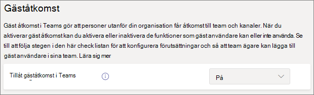

# Konfigurera teams med grundläggande skydd

I den här artikeln tittar vi på hur du distribuerar team med en grundläggande nivå av skydd. Den här nivån ger användare ett stort utbud av alternativ för samarbete medan det förbättrar av behörighetshantering och ger grundläggande skydd mot överdelning. Rekommenderade skydd för denna nivå inkluderar principer för identitets- och enhetsåtkomst och skydd mot skadlig programvara. Du kan också använda principer för villkorlig åtkomst och skydd mot dataförlust efter behov.

## Initiala skydd

Som ett första steg rekommenderar vi att du konfigurerar principer för grundläggande principer för identitets- och enhetsåtkomst. Mer information finns i [Principrekommendationer för att skydda Teams-chattar, grupper och filer](../security/office-365-security/teams-access-policies.md).

Vi rekommenderar även att du aktiverar grundläggande Defender för Office 365-funktioner för att skydda mot skadlig programvara i dokument, bilagor och länkar. Vi rekommenderar att du aktiverar vart och ett av alternativen i tabellen nedan.

|Alternativ|Information |
|:------|:-----------|
|Säkra bilagor för SPO, OneDrive och Teams|[Säkra bifogade filer](../security/office-365-security/safe-attachments.md) [Defender för Office 365 för SharePoint, OneDrive och Microsoft Teams](../security/office-365-security/mdo-for-spo-odb-and-teams.md)|
|Säkra dokument|[Säkra dokument i Microsoft Defender för Office 365](../security/office-365-security/safe-docs.md)|
|Säkra länkar för Teams|[Office 365 säkra länkar i Teams](../security/office-365-security/safe-links.md) [Säkra länkar](../security/office-365-security/safe-links.md)|

## Gästdelning i Teams

I respektive lager har vi alternativet att dela med personer utanför organisationen. I känsliga och mycket känsliga lager kan vi välja att inaktivera gästdelning på gruppnivå genom att använda känslighetsetiketter. Men inställning av gästdelning på organisationsnivå måste aktiveras för att gästdelning ska fungera över huvud taget i Teams.

Att ange inställningar för gäståtkomst i Teams

1. Logga in på Administrationscenter för Microsoft 365 på [https://admin.microsoft.com](https://admin.microsoft.com).
2. Klicka på **Visa alla** i det vänstra navigeringsfönstret.
3. Under **Administrationscenter** klickar du på **Teams**.
4. Expandera **Inställningar för hela organisationen** och klicka på **Gäståtkomst** i Teams Administrationscenter i vänstra navigeringsfönstret.
5. Kontrollera att **Tillåt gäståtkomst i Teams** är inställt på **På**.
6. Gör önskade ändringar i de ytterligare gästinställningarna och klicka sedan på **Spara**.

> [!NOTE]
> Det kan ta upp till 24 timmar för gästinställningar i Teams att bli aktiva när du har aktiverat det.

Gästdelning är aktiverad som standard för Office 365-grupper och SharePoint, men om du tidigare har ändrat gästdelningsinställningarna för din organisation rekommenderar vi att du går igenom [Samarbeta med gäster i ett team](./collaborate-as-team.md) för att säkerställa att gästdelning blir tillgängligt i Teams.

## Delning av webbplatser och filer

Om du vill minska risken för att oavsiktligt dela filer eller mappar med personer utanför organisationen rekommenderar vi att du ändrar den förvalda delningslänken för SharePoint till *Endast personer i organisationen*. (Om användare måste dela externt, och du har aktiverat gästdelning, kan de fortfarande ändra länktypen när de delar.)

Ändra standardlänken för delning
1. Öppna [SharePoint Online Administrationscenter](https://admin.microsoft.com/sharepoint).
2. Under **Principer** klickar du på **Delning**.
3. Under **Fil- och mapplänkar** väljer du **Endast personer i organisationen**.
4. Klicka på **Spara**.

Vi rekommenderar även att du aktiverar [SharePoint- och OneDrive-integrering med Azure Active Directory B2B](/sharepoint/sharepoint-azureb2b-integration-preview) om du vill ha bästa möjliga gästdelning.

## Skapa ett team

Ytterligare konfiguration av grundläggande nivå av skydd görs på den SharePoint-webbplats som är kopplad till ett team. [Skapa ett offentligt eller privat team](https://support.office.com/article/174adf5f-846b-4780-b765-de1a0a737e2b) innan du går vidare till nästa avsnitt.

## Inställningar för webbplatsdelning

Som standard kan medlemmar i en SharePoint-webbplats bjuda in andra till webbplatsen. När en webbplats är en del av ett team inkluderas gruppmedlemmarna som webbplatsmedlemmar. Personer som lagts till direkt i webbplatsen har dock inte tillgång till resten av gruppen. Därför rekommenderar vi att du hanterar behörigheter exklusivt via gruppen.

Om du vill ha hjälp med hantering av behörigheter rekommenderar vi att du konfigurerar den kopplade webbplatsen så att ägaren bara kan dela webbplatsen. Det förenklar hantering av behörigheter och hindrar åtkomst av personer utan att gruppägarens kunskap. Gör detta för varje team som kräver grundläggande skydd.

Uppdatera inställningarna för webbplatsdelning
1. I verktygsfältet för teamet klickar du på **Filer**.
2. Klicka sedan **Öppna i SharePoint**.
3. Klicka på inställningsikonen i verktygsfältet på SharePoint-gruppwebbplatsen och klicka sedan på **Webbplatsbehörigheter**.
4. I fönstret **Webbplatsbehörigheter**, under **webbplatsdelning**, klickar du på **Ändra hur medlemmar kan dela**.
5. Under **Delningsbehörigheter** väljer du **Webbplatsägare och medlemmar, och personer med redigeringsbehörighet kan dela filer och mappar, men endast webbplatsägare kan dela webbplatsen** och klicka sedan på **Spara**.

## Ytterligare skydd

Microsoft 365 tillhandahåller fler metoder för att skydda innehållet. Överväg att använda följande alternativ för att förbättra säkerheten för din organisation.

- Låt gästanvändaren godkänna [användningsvillkor](/azure/active-directory/conditional-access/terms-of-use).
- Konfigurera en [princip om tidsgräns för sessioner](/azure/active-directory/conditional-access/howto-conditional-access-session-lifetime) för gäster.
- Skapa [känslig informationstyper](../compliance/sensitive-information-type-learn-about.md) och Använd [skydd mot dataförlust](../compliance/dlp-learn-about-dlp.md) för att ange principer för åtkomst av känslig information.

## Se även

Få mer information om hur du [hanterar mötesprinciper i Teams](/microsoftteams/meeting-policies-in-teams).

[Komma igång med hantering av Insider-riskhantering](../compliance/insider-risk-management-configure.md)