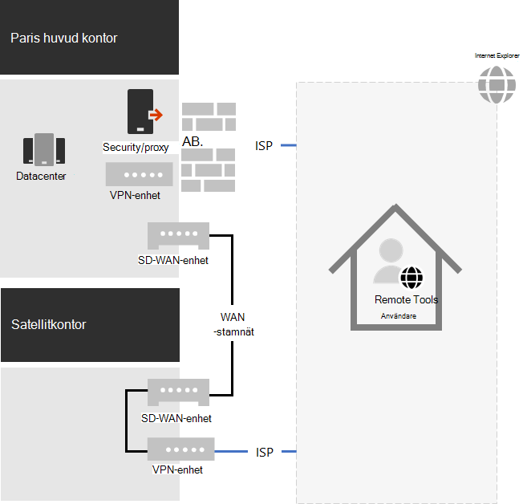
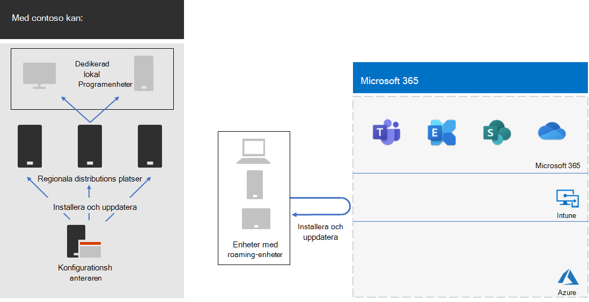

# Contosos COVID-19-svar och stöd för hybridarbeteContoso's COVID-19 response and support for hybrid work

Contoso hade alltid stöd för fjärranslutna medarbetare som hade åtkomst till lokala resurser via en central VPN-server i huvudkontoret i Paris.Contoso had always supported its remote workers, who accessed on-premises resources through a central VPN server in the Paris headquarters. Contoso hade utfärdat alla fjärranslutna medarbetare till en hanterad bärbar dator.Contoso had issued all remote workers a managed laptop. Lokala medarbetare hade en blandning av stationära och bärbara datorer.On-premises workers had a mixture of desktop computers and laptops.

## Contosos svar till COVID-19Contoso’s response to COVID-19

Med hjälp av COVID-19-personalen var plötsligt alla utom viktiga medarbetare fjärranslutna medarbetare.With the onset of the COVID-19 pandemic, suddenly all but essential workers were remote workers. Contoso har svarat genom att skifta arbetsstyrkan för att arbeta hemifrån och utföra sina primära aktiviteter via fjärråtkomst till lokala resurser och online med hjälp Microsoft 365 molntjänster.Contoso responded by shifting its workforce to work from home and conduct its primary activities through remote access to on-premises resources and online using Microsoft 365 cloud services.

Contoso hade fjärråtkomst till VPN-servrar i Paris huvudkontorskontor för att stödja 25 % av dess redan fjärranslutna arbetsstyrka, men flyttade snabbt för att öka dess fjärranslutna åtkomstkapacitet till 90 % av arbetsstyrkan.Contoso had remote access VPN servers in the Paris headquarters office to support the 25% of its already remote workforce, but quickly moved to scale up it's remote access capacity to support 90% of its workforce. Contoso distribuerade VPN-servrar för fjärråtkomst i varje satellitkontor så att fjärranslutna medarbetare skulle använda en regional stängningspunkt för åtkomst till Contoso-intranätet.Contoso deployed remote access VPN servers in each satellite office so that remote workers would use a regionally close entry point for access to the Contoso intranet.

Contoso uppdaterade även konfigurationen av VPN-klienter som är installerade på bärbara datorer, surfplattor och smartphones för delade tunnlar så att trafiken för Optimera-uppsättningen av Office 365-slutpunkter kringgår VPN-anslutningen och skickas direkt via Internet.Contoso also updated the configuration of VPN clients installed on laptops, tablets, and smart phones for split tunneling so that traffic for the Optimize set of Office 365 endpoints bypassed the VPN connection and was sent directly over the internet. Mer information finns i Optimera [Office 365 anslutningar för fjärranvändare med VPN-delade tunnlar.](../enterprise/microsoft-365-vpn-split-tunnel.md)For more information, see [Optimize Office 365 connectivity for remote users using VPN split tunneling](../enterprise/microsoft-365-vpn-split-tunnel.md).

Här är den resulterande konfigurationen med VPN-enheter som installeras i paris huvudkontor och var och en av satellitkontoren.Here is the resulting configuration with VPN devices installed in the Paris headquarters and each of the satellite offices. 

En fjärransluten anställd med den installerade VPN-klienten använder DNS för att hitta det regionala närmaste kontoret och ansluter till VPN-enheten som är installerad där.A remote worker with the installed VPN client uses DNS to find the regionally closest office and connects to the VPN device installed there. Med delade tunnlar skickas trafik till Microsoft 365 och optimerar slutpunkter direkt till den region Microsoft 365 nätverksplatsen.With split tunneling, traffic to Microsoft 365 Optimize endpoints gets sent directly to the regionally closest Microsoft 365 network location. All annan trafik skickas via VPN-anslutningen till VPN-enheten.All other traffic gets sent over the VPN connection to the VPN device.

## Contosos stöd för hybridarbeteContoso’s support for hybrid work

Efter att de initiala ändringarna gjorts för att stödja fjärranslutna medarbetare under regionala lockdowns gjorde Contoso infrastrukturändringar för att stödja hybridarbete där en anställd kan vara:After the initial changes were made to support mostly remote workers during regional lockdowns, Contoso made infrastructure changes to support hybrid work in which a worker could be:

- Alltid fjärrstyrd.Always remote.
- Alltid på plats.Always onsite.
- En kombination av olika platser och fjärranslutna platser.A combination of onsite and remote.

Microsoft 365 funktioner för identitet, säkerhet och efterlevnad är utformade för Zero Trust och att fungera oavsett var användaren och deras enhet finns.Microsoft 365 identity, security, and compliance features are designed for Zero Trust and to work regardless of the location of the user and their device. Mer information finns i [Noll förtroende](https://www.microsoft.com/security/business/zero-trust).For more information, see [Zero Trust](https://www.microsoft.com/security/business/zero-trust).

Hantering av nya installationer och uppdateringar av programvara beror emellertid på enhetens plats, eftersom programvaran som ska installeras kan komma från en lokal eller en Internetkälla.However, managing new installs and updates of software is dependent on the location of the device because the software to install could come from an on-premises or an internet source. Contoso IT-arkitekter utformade sin nya installation och uppdaterar infrastruktur baserat på enhetens plats, istället för medarbetaren.Contoso IT architects designed their new installs and updates infrastructure based on the location of the device, rather than the worker.

De har angett två typer av enheter: dedikerad lokal roaming och roaming.They designated two types of devices: dedicated on-premises and roaming.

### Dedikerad lokaltDedicated on-premises

En dedikerad lokal enhet är en stationär eller serverdator som aldrig lämnar Contoso-intranätet och inte har en VPN-klient installerad.A dedicated on-premises device is a desktop or server computer that never leaves the Contoso intranet and does not have a VPN client installed. De här lokala enheterna fortsätter att använda Microsoft Endpoint Configuration Manager och dess distributionspunkter för installationer och uppdateringar av Windows 10, Microsoft 365-appar för företag och Edge.These on-premises devices continue to use Microsoft Endpoint Configuration Manager and its distribution points for installs and updates of Windows 10, Microsoft 365 Apps for enterprise, and the Edge browser.

### RoamingRoaming

En roamingenhet kan lämna Contosos intranät och omfattar bärbara datorer som har utfärdats till många kontorsanställda och alla fjärranslutna medarbetare och andra organisationer ägda enheter, till exempel smartphones och surfplattor med Contoso VPN-klienten installerad.A roaming device can leave the Contoso intranet and includes laptops issued to many office workers and all remote workers and other organization-owned devices such as smart phones and tablets with the Contoso VPN client installed. 

Eftersom dessa enheter kan vara anslutna till Internet när som helst använder de Intune eller andra molnbaserade tjänster för installationer och uppdateringar av Windows 10, Microsoft 365-appar för företag och Edge.Because these devices can be connected to the Internet at any given time, they use Intune or other cloud-based services for installs and updates of Windows 10, Microsoft 365 Apps for enterprise, and Edge. De använder inte de befintliga distributionspunkterna i Konfigurationshanteraren lokalt.They do not use the existing on-premises Configuration Manager distribution points.

Det innebär att vissa installationer och uppdateringar för roaming-enheter görs via Internet medan de är lokala och anslutna till intranätet.This means some of the installs and updates for roaming device will be done over the internet while they are on-premises and connected to the intranet. Men Contoso IT-arkitekter valde att det är viktigare att göra konfigurationen enklare än optimering av bandbredden på internet på intranätet, särskilt när de flesta fjärranslutna medarbetare sällan är anslutna till intranätet.But Contoso IT architects decided that simplicity of configuration was more important than optimization of intranet bandwidth to the internet, especially when most remote workers are seldom connected to the intranet.

Här är den resulterande infrastrukturen.Here is the resulting infrastructure.

Installations- och uppdateringsbeteendet bestäms genom att datorkonton för enheter blir medlemmar i någon av följande grupper:Install and update behavior is determined by making the computer accounts of devices a member of one of these groups:

- OnPremDevicesOnPremDevices

  Konfigurationshanterarens klient på enheten använder distributionspunkter för installationer och uppdateringar.The Configuration Manager client on the device uses distribution points for installs and updates.

- RoamingDevicesRoamingDevices

  Intune och andra inställningar på enheten anger hur nätverket Microsoft 365 för installationer och uppdateringar.Intune and other settings on the device specify the use of the Microsoft 365 network for installs and updates.

## Ny registreringsprocessNew onboarding process

För en ny dedikerad lokal enhet som utfärdats till en ny anställd eller för en ny server i ett datacenter laddar Configuration Manager-klienten, baserat på enhetens medlemskap i gruppen Lokala enheter, ned och installerar de senaste uppdateringarna för Windows 10, Microsoft 365-appar för företag och Edge från lokala konfigurationshanterarens distributionspunkter.For a new dedicated on-premises device issued to a new worker or for a new server in a datacenter, when the worker signs in, the Configuration Manager client based on the device's membership in the OnPremDevices group downloads and installs the latest updates for Windows 10, Microsoft 365 Apps for enterprise, and Edge from on-premises Configuration Manager distribution points. När det är klart är den dedikerade lokala enheten klar för användning och använder distributionspunkterna för pågående uppdateringar.When complete, the dedicated on-premises device is ready for use and uses these distribution points for ongoing updates.

När en anställd loggar in på en ny fjärransluten enhet, baserat på medlemskap i gruppen RoamingDevices, kontaktar du intune-molntjänsten och andra tjänster och laddar ned och installerar de senaste uppdateringarna för Windows 10, Microsoft 365-appar för företag och Edge.For a new remote device issued to a new worker, when the worker signs in, the device, based on its membership in the RoamingDevices group, contacts the Intune cloud service and other services and downloads and installs the latest updates for Windows 10, Microsoft 365 Apps for enterprise, and Edge. När det är klart är fjärrenheten redo att användas och använder den installerade VPN-klienten för åtkomst till lokala resurser och Microsoft 365 för pågående uppdateringar.When complete, the remote device is ready for use and uses the installed VPN client for access to on-premises resources and the Microsoft 365 network for ongoing updates.

## Nästa stegNext step

[Konfigurera infrastrukturen för hybridarbete](empower-people-to-work-remotely.md) i organisationen.[Set up your infrastructure for hybrid work](empower-people-to-work-remotely.md) in your organization.
