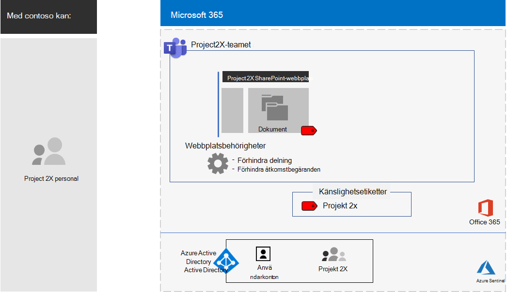
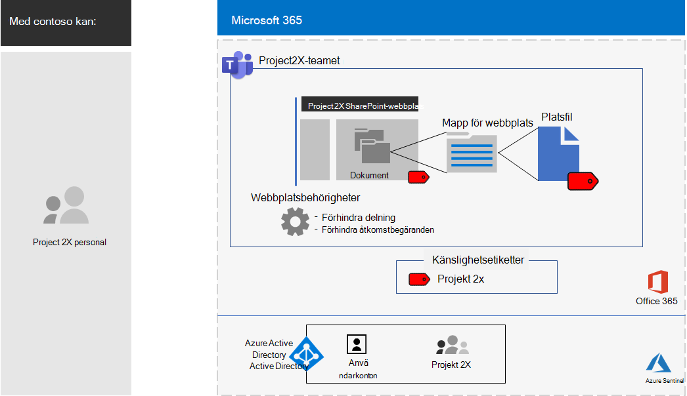

# Isolerat team för ett topphemligt projekt av Contoso CorporationIsolated team for a top-secret project of the Contoso Corporation

Efter en verkställande offsite, Contoso VD beställde utvecklingen av en ny svit av produkter och tjänster som kan fördubbla Contoso vinst under de kommande fem åren.After an executive offsite, Contoso’s CEO ordered the development of a new suite of products and services that could double Contoso’s profits in the next five years. Det topphemliga projektet för att utveckla affärs-, ingenjörs- och marknadsplanen fick namnet **Project 2X** och nyckelpersonal i hela företaget rekryterades.The top-secret project to develop the business, engineering, and market plan was named **Project 2X** and key staff across the company were recruited. 

Tidslinjerna för forskning och utveckling var snäva, vilket innebar att samarbetet måste vara effektivt och ge säkra möten, pågående samtal och fillagring.The timelines for research and development were tight, which meant that collaboration had to be efficient and provide for secure meetings, ongoing conversations, and file storage.

De resulterande slutprodukterna för Project 2X var affärsplaner, produkt- och teknikspecifikationer samt marknadsföringsmaterial och scheman i form av Word-, Excel- och PowerPoint-filer.The resulting deliverables for Project 2X were business plans, product and engineering specifications, and marketing materials and schedules in the form of Word, Excel, and PowerPoint files. 

På grund av deras känsliga karaktär, tillgång till dessa filer var:Due to their sensitive nature, access to these files were:

- Begränsad till Project 2X-gruppmedlemmar.Restricted to Project 2X team members.
- Krypterad och skyddad med behörighet att endast tillåta åtkomst till Project 2X-gruppmedlemmar, även om filerna distribuerades utanför sina säkra mappar.Encrypted and protected with permissions to allow access only to Project 2X team members, even if the files were distributed outside of their secured folders.

Contoso IT-personal använde ett [team med säkerhetsisolering](secure-teams-security-isolation.md) för Project 2X och dessa steg.Contoso IT staff used a [team with security isolation](secure-teams-security-isolation.md) for Project 2X and these steps.

## Steg 1: Skapade ett privat teamStep 1: Created a private team

För att skydda åtkomsten till den underliggande SharePoint-webbplatsen för teamet konfigurerade Contoso IT-administratörer de [rekommenderade SharePoint-åtkomstprinciperna](../enterprise/sharepoint-file-access-policies.md).First, to protect access to the underlying SharePoint site for the team, Contoso IT administrators configured the [recommended SharePoint access policies](../enterprise/sharepoint-file-access-policies.md).

Därefter skapade en Contoso IT-administratör ett nytt privat team med namnet Project 2X och lade till användarkontona för Project 2X-personal som medlemmar.Next, a Contoso IT administrator created a new private team named Project 2X and added the user accounts of Project 2X staff as members.

Konfigurationsinformation finns i [Skapa ett privat team](secure-teams-security-isolation.md#create-a-private-team).For the configuration details, see [Create a private team](secure-teams-security-isolation.md#create-a-private-team).

## Steg 2: Skapade en känslighetsetikett för Project 2X-teametStep 2: Created a sensitivity label for the Project 2X team

Contoso-administratörer skapade en ny känslighetsetikett med namnet **Project 2X** som:Contoso admins created a new sensitivity label named **Project 2X** that:

- Kräver kryptering.Requires encryption.
- Tillåter samtidiga redigeringsbehörigheter för gruppen Project 2X Microsoft 365.Allows Co-Author permissions for the Project 2X Microsoft 365 group.

Filerna i avsnittet **Dokument** på den underliggande Project 2X SharePoint-webbplatsen skyddades av:Files in the **Documents** section of the underlying Project 2X SharePoint site were protected by:

- Webbplatsbehörigheterna, som endast ger åtkomst till medlemmar i Gruppen Project 2X Microsoft 365.The site permissions, which only allow access to members of the Project 2X Microsoft 365 group.
- Känslighetsetiketten För Project 2X, med kryptering och behörigheter som färdas med filen om den flyttas eller kopieras från webbplatsen.The Project 2X sensitivity label, with encryption and permissions that travel with the file if it is moved or copied from the site.

Konfigurationsinformation finns i [Skapa en känslighetsetikett](secure-teams-security-isolation.md#create-a-sensitivity-label).For the configuration details, see [Create a sensitivity label](secure-teams-security-isolation.md#create-a-sensitivity-label).

## Steg 3: Konfigurerade den underliggande SharePoint-webbplatsenStep 3: Configured the underlying SharePoint site

För att skydda åtkomsten till den underliggande SharePoint-webbplatsen för teamet konfigurerade Contoso IT-administratörer de [rekommenderade SharePoint-åtkomstprinciperna](../enterprise/sharepoint-file-access-policies.md).First, to protect access to the underlying SharePoint site for the team, Contoso IT administrators configured the [recommended SharePoint access policies](../enterprise/sharepoint-file-access-policies.md).

Därefter konfigurerade de ytterligare behörighetsinställningar för webbplatsen för att förhindra att Project 2X delar åtkomst till webbplatsen.Next, they configured additional permission settings for the site to prevent Project 2X from sharing access to the site. Konfigurationsinformation finns i [SharePoint-inställningar för ett team med säkerhetsisolering](secure-teams-security-isolation.md#sharepoint-settings).For the configuration details, see [SharePoint settings for a team with security isolation](secure-teams-security-isolation.md#sharepoint-settings).

Här är den resulterande konfigurationen av Project 2X-teamet.Here is the resulting configuration of the Project 2X team.

 ## Steg 4: Utbildade Project 2X-gruppmedlemmarStep 4: Trained Project 2X team members

Contoso säkerhetspersonal utbildade Project 2X-teammedlemmarna i en obligatorisk kurs som klev igenom dem:Contoso security staff trained the Project 2X team members in a mandatory course that stepped them through:

- Så här kommer du åt det nya Project 2X-teamet, använder möten och chattar och hur du samarbetar i gruppfiler.How to access the new Project 2X team, use meetings and chats, and how to collaborate on team files.
- Så här skapar du nya filer i teamet och laddar upp nya filer som skapats lokalt.How to create new files in the team and upload new files created locally.
- En demonstration av hur DLP-principen blockerar filer från att delas externt.A demonstration of how the DLP policy blocks files from being shared externally.
- Så här märker du filer med känslighetsetiketten För Project 2X.How to label files with the Project 2X sensitivity label.
- En demonstration av hur Project 2X-etiketten skyddar en fil även när den lämnar teamet.A demonstration of how the Project 2X  label protects a file even when it leaves the team.

Slutresultatet blev en säker miljö där Project 2X-gruppmedlemmar samarbetade i en säker miljö för chattar, möten och filer.The end result was a secure environment in which Project 2X team members collaborated in a secure environment for chats, meetings, and files.

Här är ett exempel på en fil som lagras i den underliggande Project 2X-platsen med känslighetsetiketten Project 2X tilldelad.Here is an example of a file stored in the underlying Project 2X site with the Project 2X sensitivity label assigned.

I ett par fall hämtade Project 2X-gruppmedlemmar filer som skyddas av Project 2X-etiketten till en lokal enhet för offlinearbete.In a couple of instances, Project 2X team members downloaded files protected by the Project 2X label to a local drive for offline work. Men efter att ha uppmanats om autentiseringsuppgifter när de öppnades, insåg de sitt misstag och tog bort dem.However, after being prompted for credentials when opening them, they realized their mistake and deleted them.

På grund av teamens samarbetsmiljö och säkerhetsfunktionerna i Microsoft 365 hölls detaljerna i Project 2X hemliga under hela projektet.Because of the collaboration environment of Teams and the security features of Microsoft 365, the details of Project 2X were kept secret for the duration of the project. Contoso tillkännagav sina planer och håller på att rulla ut de nya produkterna och tjänsterna till glädje för sina kunder och investerare och förtret för sina konkurrenter.Contoso announced its plans and is in the process of rolling out the new products and services to the delight of its customers and investors and the chagrin of its competitors.

## Nästa stegNext step

[Distribuera ett team med säkerhetsisolering](secure-teams-security-isolation.md) i organisationen.[Deploy a team with security isolation](secure-teams-security-isolation.md) in your organization.

