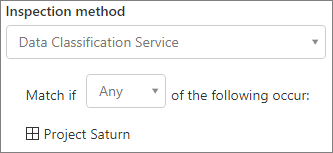

# Skapa en säker miljö för gästdelningCreate a secure guest sharing environment

I den här artikeln går vi igenom en mängd olika alternativ för att skapa en säker gästdelningsmiljö i Microsoft 365.In this article, we'll walk through a variety of options for creating a secure guest sharing environment in Microsoft 365. Det här är ett exempel som ger dig en uppfattning om vilka alternativ som är tillgängliga.This is an example scenario to give you an idea of the options available. Du kan använda de här procedurerna i olika kombinationer för att uppfylla organisationens säkerhets- och efterlevnadsbehov.You can use these procedures in different combinations to meet the security and compliance needs of your organization. I slutet av artikeln går vi igenom ett testfall för att se hur vissa av dessa alternativ fungerar tillsammans.At the end of the article, we'll walk through a test case to see how some of these options work together.

I det här scenariot:This scenario includes:

- Konfigurera multifaktorautentisering för gäster.Setting up multi-factor authentication for guests.
- Konfigurera användarvillkor för gäster.Setting up a terms of use for guests.
- Konfigurera kvartalsgranskning av gäståtkomst för att regelbundet verifiera om gästerna fortfarande behöver behörighet till grupper och webbplatser.Setting up quarterly guest access reviews to periodically validate whether guests continue to need permissions to teams and sites.
- Begränsa gästernas åtkomst till endast på webben för ohanterade enheter.Restricting guests to web-only access for unmanaged devices.
- Konfigurera en princip för sessionstidsgräns för att säkerställa att gästerna autentiserar sig dagligen.Configuring a session timeout policy to ensure guests authenticate daily.
- Skapa och publicera känslighetsetiketter för att klassificera innehåll.Creating and publishing sensitivity labels to classify content.
- Skapa en typ av känslig information för ett strikt känsligt projekt.Creating a sensitive information type for a highly sensitive project.
- Tilldela automatiskt etiketten *strikt känsligt* till dokument som innehåller den typen av känslig information.Automatically assigning a *highly sensitive* label to documents that contain the sensitive information type.
- Ta automatiskt bort gäståtkomst från filer med beteckningen *strikt känsligt*.Automatically removing guest access from files labeled as *highly sensitive*.

Vissa av alternativen som beskrivs i den här artikeln kräver att gästerna har ett konto i Azure Active Directory.Some of the options discussed in this article require guests to have an account in Azure Active Directory. Om du vill vara säker på att gästerna ingår i katalogen när du delar filer och mappar med dem, ska du använda [SharePoint- och OneDrive-integrering med förhandsversionen av Azure AD B2B](https://docs.microsoft.com/sharepoint/sharepoint-azureb2b-integration-preview).To ensure that guests are included in the directory when you share files and folders with them, use the [SharePoint and OneDrive integration with Azure AD B2B Preview](https://docs.microsoft.com/sharepoint/sharepoint-azureb2b-integration-preview).

Observera att vi inte tar upp inställningarna för gästdelning i den här artikeln.Note that we won't discuss enabling guest sharing settings in this article. Mer information om hur du aktiverar gästdelning i olika scenarier finns i [Samarbeta med personer utanför organisationen](collaborate-with-people-outside-your-organization.md).See [Collaborating with people outside your organization](collaborate-with-people-outside-your-organization.md) for details about enabling guest sharing for different scenarios.

## Konfigurera multifaktorautentisering för gästerSet up multi-factor authentication for guests

Multifaktorautentisering minskar kraftigt risken för att ett konto komprometteras.Multi-factor authentication greatly reduces the chances of an account being compromised. Eftersom gästanvändare kanske använder personliga e-postkonton som inte följer några principer för kontroll eller bästa praxis är det särskilt viktigt att kräva multifaktorautentisering för gäster.Since guest users may be using personal email accounts that don't adhere to any governance policies or best practices, it's especially important to require multi-factor authentication for guests. Om en gästanvändares användarnamn och lösenord blir stulna, minskar en andra autentiseringsfaktor avsevärt risken för att okända personer ska få åtkomst till webbplatserna och filerna.If a guest user's username and password is stolen, requiring a second factor of authentication greatly reduces the chances of unknown parties gaining access to your sites and files.

I det här exemplet konfigurerar vi multifaktorautentisering för gäster genom att använda en princip för villkorsstyrd åtkomst i Azure Active Directory.In this example, we'll set up multi-factor authentication for guests by using a conditional access policy in Azure Active Directory.

Konfigurera multifaktorautentisering för gästerTo set up multi-factor authentication for guests
1. Sök efter *Villkorsstyrd åtkomst* i Microsoft Azure.In Microsoft Azure, search for *Conditional access*.
2. På bladet för **Villkorsstyrd åtkomst – Principer** klickar du på **Ny princip**.On the **Conditional Access - Policies** blade, click **New policy**.
3. I fältet **Namn** skriver du *Multifaktorautentisering för gäst*.In the **Name** field, type *Guest MFA*.
4. Under **Tilldelningar** klickar du på **Användare och grupper**.Under **Assignments**, click **Users and groups**.
5. I bladet **Användare och grupper** markerar du **Välj användare och grupper**, markerar kryssrutan **Alla gäster och externa användare**.On the **Users and groups** blade, select **Select users and groups**, select the **All guests and external users** check box.
6. Under **Tilldelningar** klickar du på **Molnappar eller åtgärder**.Under **Assignments**, click **Cloud apps or actions**.
7. Välj **alla program i molnet** på fliken **inkluderar** fliken **moln program eller-åtgärder** blad.On the **Cloud apps or actions** blade, select **All cloud apps** on the **Include** tab.
8. Under **Åtkomstkontroller** klickar du på **Bevilja**.Under **Access controls**, click **Grant**.
9. På bladet **Bevilja** markerar du kryssrutan **Kräv multifaktorautentisering** och klickar sedan på **Välj**.On the **Grant** blade, select the **Require multi-factor authentication** check box, and then click **Select**.
10. På bladet **Nytt**, under **Aktivera princip**, klickar du på **På** och sedan på **Skapa**.On the **New** blade, under **Enable policy**, click **On**, and then click **Create**.

Gästen måste då registrera sig för multifaktorautentisering för att de ska kunna komma åt delat innehåll, webbplatser eller team.Now, guest will be required to enroll in multi-factor authentication before they can access shared content, sites, or teams.

### Mer informationMore information

[Planera en molnbaserad distribution av Azure Multi-Factor AuthenticationPlanning a cloud-based Azure Multi-Factor Authentication deployment](https://docs.microsoft.com/azure/active-directory/authentication/howto-mfa-getstarted)

## Konfigurera användarvillkor för gästerSet up a terms of use for guests

Vanligtvis kanske gästanvändare inte har undertecknat avtal eller andra juridiska avtal med din organisation.Often times guest users may not have signed non-disclosure agreements or other legal agreements with your organization. Du kan kräva att gästerna godkänner användningsvillkor innan de kan komma åt filer som delas med dem.You can require guests to agree to a terms of use before accessing files that are shared with them. Användningsvillkoren kan visas första gången de försöker få åtkomst till en delad fil eller webbplats.The terms of use can be displayed the first time they attempt to access a shared file or site.

Om du vill skapa användningsvillkor måste du först skapa dokumentet i Word eller något annat redigeringsprogram och sedan spara det som en PDF-fil.To create a terms of use, you first need to create the document in Word or another authoring program, and then save it as a .pdf file. Filen kan sedan laddas upp till Azure AD.This file can then be uploaded to Azure AD.

Skapa användningsvillkor för Azure ADTo create an Azure AD terms of use
1. Logga in på Azure som global administratör, säkerhetsadministratör eller administratör för villkorsstyrd åtkomst.Sign in to Azure as a Global Administrator, Security Administrator, or Conditional Access Administrator.
2. Gå till [Användningsvillkor](https://aka.ms/catou).Navigate to [Terms of use](https://aka.ms/catou).
3. Klicka på **Nya villkor**.Click **New terms**. 
   
4. I rutorna **Namn** och **Visningsnamn** skriver du *Användningsvillkor för gäster*.In the **Name** and **Display name** boxes, type *Guest terms of use*.
6. För **Dokument med användningsvillkor** bläddrar du till den PDF-fil som du har skapat och väljer den.For **Terms of use document**, browse to the pdf file that you created and select it.
7. Välj språk för dokumentet med användningsvillkor.Select the language for your terms of use document.
8. Ange **Kräv att användarna expanderar användningsvillkoren** som **På**.Set **Require users to expand the terms of use** to **On**.
9. Under **Villkorsstyrd åtkomst**, i listan **Tvinga med mallar för princip för villkorsstyrd åtkomst**, väljer du **Skapa princip för villkorsstyrd åtkomst senare**.Under **Conditional Access**, in the **Enforce with Conditional Access policy template** list choose **Create conditional access policy later**.
10. Klicka på **Skapa**.Click **Create**.

När du har skapat användningsvillkoren är nästa steg att skapa en princip för villkorsstyrd åtkomst som visar användningsvillkoren för gästanvändare.Once you've created the terms of use, the next step is to create a conditional access policy that displays the terms of use to guest users.

Skapa princip för villkorsstyrd åtkomstTo create a conditional access policy
1. Sök efter *Villkorsstyrd åtkomst* i Microsoft Azure.In Microsoft Azure, search for *Conditional access*.
2. På bladet för **Villkorsstyrd åtkomst – Principer** klickar du på **Ny princip**.On the **Conditional Access - Policies** blade, click **New policy**.
3. I rutan **Namn** skriver du *Princip för användningsvillkor för gästanvändare*.In the **Name** box, type *Guest user terms of use policy*.
4. Under **Tilldelningar** klickar du på **Användare och grupper**.Under **Assignments**, click **Users and groups**.
5. På bladet **Användare och grupper** väljer du **Välj användare och grupper**, markerar kryssrutan **Alla gäster och externa användare** och klickar sedan på **Klar**.On the **Users and groups** blade, select **Select users and groups**, select the **All guests and external users** check box, and then click **Done**.
6. Under **Tilldelningar** klickar du på **Molnappar eller åtgärder**.Under **Assignments**, click **Cloud apps or actions**.
7. På fliken **Inkludera** väljer du **Välj appar** och klickar sedan på **Välj**.On the **Include** tab, select **Select apps**, and then click **Select**.
8. På bladet **Välj** väljer du **Microsoft Teams**, **Office 365 SharePoint Online** och **Outlook Groups** och klickar sedan på **Välj**.On the **Select** blade, select **Microsoft Teams**, **Office 365 SharePoint Online**, and **Outlook Groups**, and then click **Select**.
9. På bladet **Molnappar och åtgärder** klickar du på **Klar**.On the **Cloud apps or actions** blade, click **Done**.
10. Under **Åtkomstkontroller** klickar du på **Bevilja**.Under **Access controls**, click **Grant**.
11. På bladet **Bevilja** väljer du **Användningsvillkor för gäster**och klickar sedan på **Välj**.On the **Grant** blade, select **Guest terms of use**, and then click **Select**.
12. På bladet **Nytt**, under **Aktivera princip**, klickar du på **På** och sedan på **Skapa**.On the **New** blade, under **Enable policy**, click **On**, and then click **Create**.

Första gången en gästanvändare försöker komma åt innehåll, ett team eller en webbplats i organisationen måste de acceptera villkoren för användning.Now, the first time a guest user attempts to access content or a team or site in your organization, they will be required to accept the terms of use.

> [!NOTE]
> Användningen av villkorstyrd åtkomst kräver en Azure Active Directory Premium P1-licens.Using Conditional Access requires an Azure AD Premium P1 license. Mer information finns i [Vad är villkorsstyrd åtkomst](https://docs.microsoft.com/azure/active-directory/conditional-access/overview).For more information, see [What is Conditional Access](https://docs.microsoft.com/azure/active-directory/conditional-access/overview).

### Mer informationMore information
[Användningsvillkor för Azure Active DirectoryAzure Active Directory terms of use](https://docs.microsoft.com/azure/active-directory/conditional-access/terms-of-use)

## Konfigurera granskning av gäståtkomstSet up guest access reviews

Med åtkomstgranskningar i Azure AD kan du automatisera en återkommande granskning av användaråtkomst till olika team och grupper.With access reviews in Azure AD, you can automate a periodic review of user access to various teams and groups. Genom att begära åtkomstgranskning specifikt för gäster kan du bidra till att gästanvändare inte behåller åtkomsten till organisationens känsliga information under längre tid än nödvändigt.By requiring an access review for guests specifically, you can help ensure guest users do not retain access to your organization's sensitive information for longer than is necessary.

Åtkomstgranskningar kan organiseras i program.Access reviews can be organized into programs. Ett program är en gruppering av liknande åtkomstgranskningar som kan användas för att organisera åtkomstgranskningar för rapporter och granskningsändamål.A program is a grouping of similar access reviews that can be used to organize access reviews for reporting and auditing purposes.

I det här exemplet skapar vi ett program för granskning av gäståtkomst.In this example, we'll create a program for guest access reviews.

Skapa ett programTo create a program
1. Logga in på Azure-portalen och öppna sidan [Identitetsstyrning](https://portal.azure.com/#blade/Microsoft_AAD_ERM/DashboardBlade).Sign in to the Azure portal and open the [Identity Governance page](https://portal.azure.com/#blade/Microsoft_AAD_ERM/DashboardBlade).
2. I den vänstra menyn klickar du på **Program**In the left menu, click **Programs**
3. Klicka på **Nytt program**.Click **New program**.
4. I rutan **Namn** skriver du *Program för granskning av gäståtkomst*.In the **Name** box, type *Guest access review program*.
5. I rutan **Beskrivning** skriver du *Program för granskning av gäståtkomst*.In the **Description** box, type *Program for guest access reviews*.
6. Klicka på **Skapa**.Click **Create**.

När programmet har skapats kan vi skapa en granskning av gäståtkomsten och koppla den till programmet.Once the program has been created, we can create a guest access review and associate it with the program.

Konfigurera åtkomstgranskning av gästanvändareTo set up a guest user access review
1. På sidan [Identitetsstyrning](https://portal.azure.com/#blade/Microsoft_AAD_ERM/DashboardBlade) klickar du på **Åtkomstgranskningar** i den vänstra menyn.On the [Identity Governance page](https://portal.azure.com/#blade/Microsoft_AAD_ERM/DashboardBlade), in the left menu, click **Access reviews**.
2. Klicka på **Ny åtkomstgranskning**.Click **New access review**. 
   
3. I rutan **Namn** skriver du *Kvartalsgranskning av gäståtkomst*.In the **Name** box, type *Quarterly guest access review*.
4. För **Frekvens** väljer du **Varje kvartal**.For **Frequency**, choose **Quarterly**.
5. För **Slut**väljer du **Aldrig**.For **End**, choose **Never**.
6. För **Omfång** väljer du **Enbart gästanvändare**.For **Scope**, choose **Guest users only**.
7. Klicka på **Grupp**, markera de grupper som du vill ska ingå i åtkomstgranskningen och klicka sedan på **Välj**.Click **Group**, select the groups that you want to include in the access review, and then click **Select**.
8. Under **Program** klickar du på **Länka till program**.Under **Programs**, click **Link to program**.
9. På bladet **Välj ett program** väljer du **Program för granskning av gäståtkomst**On the **Select a program** blade, choose **Guest access review program**
10. Klicka på **Start**.Click **Start**.

En separat åtkomstgranskning skapas för varje grupp som du anger.A separate access review is created for each group that you specify. Gruppägare för varje grupp kommer att få ett e-postmeddelande varje kvartal för att godkänna eller neka gäståtkomst till sina grupper.Group owners of each groups will be emailed quarterly to approve or deny guest access to their groups.

Det är viktigt att du noterar att gäster kan beviljas åtkomst till team eller grupper, eller till enskilda filer och mappar.It's important to note that guests can be given access to teams or groups, or to individual files and folders. När de får åtkomst till filer och mappar kanske gästerna inte läggs till i någon särskild grupp.When given access to files and folders, guests may not be added to any particular group. Om du vill göra åtkomstgranskningar för gästanvändare som inte tillhör ett team eller en grupp kan du skapa en dynamisk grupp i Azure AD för alla gäster och sedan skapa en åtkomstgranskning för den gruppen.If you want to do access reviews on guest users who don't belong to a team or group, you can create a dynamic group in Azure AD to contain all guests and then create an access review for that group.

### Mer informationMore information
[Hantera gäståtkomst med åtkomstgranskningar i Azure ADManage guest access with Azure AD access reviews](https://docs.microsoft.com/azure/active-directory/governance/manage-guest-access-with-access-reviews)

[Skapa en åtkomstgranskning av grupper eller program i åtkomstgranskningar i Azure ADCreate an access review of groups or applications in Azure AD access reviews](https://docs.microsoft.com/azure/active-directory/governance/create-access-review)

## Konfigurera endast webbåtkomst för gästanvändareSet up web-only access for guest users

Du kan minska din attackyta och underlätta administrationen genom att kräva att gästanvändarna bara får åtkomst till dina team, webbplatser och filer med hjälp av en webbläsare.You can reduce your attack surface and ease administration by requiring guest users to access your teams, sites, and files by using a web browser only. Det gör du med en princip för villkorsstyrd åtkomst i Azure AD.This is done with an Azure AD conditional access policy.

Begränsa gäståtkomsten till endast webbenTo restrict guests to web-ony access
1. Sök efter *Villkorsstyrd åtkomst* i Microsoft Azure.In Microsoft Azure, search for *Conditional access*.
2. På bladet för **Villkorsstyrd åtkomst – Principer** klickar du på **Ny princip**.On the **Conditional Access - Policies** blade, click **New policy**.
3. I rutan **Namn** skriver du *Webbläsaråtkomst för gästanvändare*.In the **Name** box, type *Guest user browser access*.
4. Under **Tilldelningar** klickar du på **Användare och grupper**.Under **Assignments**, click **Users and groups**.
5. På bladet **Användare och grupper** väljer du **Välj användare och grupper**, markerar kryssrutan **Alla gäster och externa användare** och klickar sedan på **Klar**.On the **Users and groups** blade, select **Select users and groups**, select the **All guests and external users** check box, and then click **Done**.
6. Under **Tilldelningar** klickar du på **Molnappar eller åtgärder**.Under **Assignments**, click **Cloud apps or actions**.
7. På fliken **Inkludera** väljer du **Välj appar** och klickar sedan på **Välj**.On the **Include** tab, select **Select apps**, and then click **Select**.
8. På bladet **Välj** väljer du **Microsoft Teams**, **Office 365 SharePoint Online** och **Outlook Groups** och klickar sedan på **Välj**.On the **Select** blade, select **Microsoft Teams**, **Office 365 SharePoint Online**, and **Outlook Groups**, and then click **Select**.
9. På bladet **Molnappar och åtgärder** klickar du på **Klar**.On the **Cloud apps or actions** blade, click **Done**.
10. Under **Tilldelningar** klickar du på **Villkor**.Under **Assignments**, click **Conditions**.
11. På bladet **Villkor** klickar du på **Klientappar**.On the **Conditions** blade, click **Client apps**.
12. På bladet **Klientappar** klickar du på **Ja** för **Konfigurera** och väljer sedan inställningarna **Mobila appar och skrivbordsklienter** och **Moderna autentiseringsklienter**.On the **Client apps** blade, click **Yes** for **Configure**, and then select the **Mobile apps and desktop clients** and **Modern authentication clients** settings. 
    
13. Klicka på **Klar**, och därefter på bladet **Villkor** klickar du på **Klar** igen.Click **Done**, and then on the **Conditions** blade, click **Done** again.
14. Under **Åtkomstkontroller** klickar du på **Bevilja**.Under **Access controls**, click **Grant**.
15. På bladet **Bevilja** väljer du **Kräv att enheten är markerad som kompatibel** och **Kräv Hybrid Azure AD-kopplad enhet**.On the **Grant** blade, select **Require device to be marked as compliant** and **Require Hybrid Azure AD joined device**.
16. Under **För flera kontroller** väljer du **Begär en av de valda kontrollerna** och klickar sedan på **Välj**.Under **For multiple controls**, select **Require one of the selected controls**, and then click **Select**.
17. På bladet **Nytt**, under **Aktivera princip**, klickar du på **På** och sedan på **Skapa**.On the **New** blade, under **Enable policy**, click **On**, and then click **Create**.

## Konfigurera en tidsgräns för sessioner för gästanvändareConfigure a session timeout for guest users

Genom att kräva att gästanvändare ska autentiseras med jämna mellanrum kan du minska risken för att okända användare får åtkomst till organisationens innehåll om en gästanvändares enhet inte är skyddad.Requiring guests to authenticate on a regular basis can reduce the possibility of unknown users accessing your organization's content if a guest user's device isn't kept secure. Du kan konfigurera en princip för villkorsstyrd åtkomst med sessionstidsgräns för gästanvändare i Azure AD.You can configure a session timeout conditional access policy for guest users in Azure AD.

Konfigurera en princip för sessionstidsgräns för gästerTo configure a guest session timeout policy
1. Sök efter *Villkorsstyrd åtkomst* i Microsoft Azure.In Microsoft Azure, search for *Conditional access*.
2. På bladet för **Villkorsstyrd åtkomst – Principer** klickar du på **Ny princip**.On the **Conditional Access - Policies** blade, click **New policy**.
3. I rutan **Namn** skriver du *Sessionstidsgräns för gäst*.In the **Name** box, type *Guest session timeout*.
4. Under **Tilldelningar** klickar du på **Användare och grupper**.Under **Assignments**, click **Users and groups**.
5. På bladet **Användare och grupper** väljer du **Välj användare och grupper**, markerar kryssrutan **Alla gäster och externa användare** och klickar sedan på **Klar**.On the **Users and groups** blade, select **Select users and groups**, select the **All guests and external users** check box, and then click **Done**.
6. Under **Tilldelningar** klickar du på **Molnappar eller åtgärder**.Under **Assignments**, click **Cloud apps or actions**.
7. På fliken **Inkludera** väljer du **Välj appar** och klickar sedan på **Välj**.On the **Include** tab, select **Select apps**, and then click **Select**.
8. På bladet **Välj** väljer du **Microsoft Teams**, **Office 365 SharePoint Online** och **Outlook Groups** och klickar sedan på **Välj**.On the **Select** blade, select **Microsoft Teams**, **Office 365 SharePoint Online**, and **Outlook Groups**, and then click **Select**.
9. På bladet **Molnappar och åtgärder** klickar du på **Klar**.On the **Cloud apps or actions** blade, click **Done**.
10. Under **Åtkomstkontroller** klickar du på **Session**.Under **Access controls**, click **Session**.
11. På bladet **Session** väljer du **Inloggningsfrekvens**.On the **Session** blade, select **Sign-in frequency**.
12. Välj **1** och **dagar** för tidsperiod och klicka sedan på **Välj**.Select **1** and **Days** for the time period, and then click **Select**.
13. På bladet **Nytt**, under **Aktivera princip**, klickar du på **På** och sedan på **Skapa**.On the **New** blade, under **Enable policy**, click **On**, and then click **Create**.

## Skapa känslighetsetiketterCreate sensitivity labels

Du kan använda känslighetsetiketter på flera olika sätt för att klassificera och skydda organisationens information.Sensitivity labels can be used in a variety of ways to classify and protect your organization's information. I det här exemplet ska vi titta närmare på hur etiketter kan användas för att hantera gäståtkomst till delade filer och mappar.In this example, we'll look at how labels can be used to help you manage guest access to shared files and folders.

Först skapar vi tre känslighetsetiketter i Microsoft 365 Efterlevnadscenter:First, we'll create three sensitivity labels in the Microsoft 365 Compliance Center:

- AllmäntGeneral
- känsligtsensitive
- Strikt känsligtHighly sensitive

Använd följande procedur för att skapa etiketterna *Allmänt* och *känsligt*.Use the following procedure to create the *General* and *sensitive* labels.

Skapa en klassificeringsetikett (allmänt och känsligt)To create a classification label (General and sensitive)
1. I [Microsoft 365 Efterlevnadscenter](https://compliance.microsoft.com) går du till vänster navigeringsfält och expanderar **Klassificering** och klickar sedan på **Känslighetsetiketter**.In the [Microsoft 365 Compliance Center](https://compliance.microsoft.com), in the left navigation, expand **Classification**, and then click **Sensitivity labels**.
2. Klicka på **Skapa en etikett**.Click **Create a label**.
3. I **Etikettnamn** skriver du *Allmänt* eller *känsligt*.In **Label name**, type *General* or *sensitive*.
4. I **Knappbeskrivning** skriver du *Allmän information som kan delas med medarbetare, gäster och partner* eller *känslig information. Dela endast med medarbetare och auktoriserade gäster* och klicka sedan på **Nästa**.In **Tooltip**, type *General information that can be shared with employees, guests, and partners* or *sensitive information. Share only with employees and authorized guests*, and then click **Next**.
5. Lämna kryptering på **Av** och klicka på **Nästa**.Leave encryption **Off** and click **Next**.
6. Lämna märkning av innehåll på **Av** och klicka på **Nästa**.Leave content marking **Off** and click **Next**.
7. Lämna dataförlustskydd för slutpunkt på **Av** och klicka på **Nästa**.Leave endpoint data loss prevention **Off** and click **Next**.
8. Lämna automatiska etiketter på **Av** och klicka på **Nästa**.Leave auto labeling **Off** and click **Next**.
9. Klicka på **Skapa**.Click **Create**.

Med etiketten *Strikt känsligt* kan vi lägga till automatisk vattenstämpel av dokument med etiketten.With the *Highly sensitive* label, we'll add automatic watermarking of documents with the label.

Skapa en klassificeringsetikett (strikt känsligt)To create a classification label (Highly sensitive)
1. Klicka på **Skapa en etikett**.Click **Create a label**.
2. I **Etikettnamn** skriver du *Strikt känsligt*.In **Label name**, type *Highly sensitive*.
3. I **Knappbeskrivning** skriver du *Strikt känslig information. Dela inte med gäster* och klickar sedan på **Nästa**.In **Tooltip**, type *Highly sensitive information. Do not share with guests*, and then click **Next**.
4. Lämna kryptering på **Av** och klicka på **Nästa**.Leave encryption **Off** and click **Next**.
5. Aktivera märkning av innehåll med **På**, markera kryssrutan **Lägg till en rubrik** och klicka sedan på **Anpassa text**.Turn content marking **On**, select the **Add a header** check box, and then click **Customize text**.
6. Skriv *Strikt känsligt* som rubriktext och klicka på **Spara**.Type *Highly sensitive* for the header text and click **Save**.
7. På sidan **Märkning av innehåll** aktiverar du detta med **På**.On the **Content marking** page, turn content marking **On**.
8. Markera kryssrutan **Lägg till en vattenstämpel** och klicka sedan på **Anpassa text**.Select the **Add a watermark** check box, and then click **Customize text**.
9. För **Text för vattenstämpel** skriver du *Strikt känsligt*.For **Watermark text**, type *Highly sensitive*.
10. Skriv *24* som **Teckenstorlek** och klicka sedan på **Spara**.Type *24* for **Font size**, and then click **Save**.
11. På sidan **Märkning av innehåll** klickar du på **Nästa**.On the **Content marking** page, click **Next**.
12. Lämna dataförlustskydd för slutpunkt på **Av** och klicka på **Nästa**.Leave endpoint data loss prevention **Off** and click **Next**.
13. Lämna automatiska etiketter på **Av** och klicka på **Nästa**.Leave auto labeling **Off** and click **Next**.
14. Klicka på **Skapa**.Click **Create**.

När du har skapat etiketterna är nästa steg att publicera dem.Once you've created the labels, the next step is to publish them. 

Publicera etiketterTo publish labels
1. På sidan **Känslighetsetiketter** klickar du på **Publicera etiketter**.On the **Sensitivity labels** page, click **Publish labels**.
2. Klicka på **Välj etiketter att publicera**.Click **Choose labels to publish**.
3. Klicka på **Lägg till**, markera de etiketter som du har skapat och klicka sedan på **Lägg till**.Click **Add**, select the labels that you created, and then click **Add**.
4. Klicka på **Klar**.Click **Done**.
5. Klicka på **Nästa**.Click **Next**.
6. Lämna de användare och grupper som angetts till **Alla** och klicka på **Nästa**.Leave the users and groups set to **All** and click **Next**.
7. I listan **Använd den här etiketten som standard för dokument och e-post** väljer du **Allmänt** och sedan **Nästa**.In the **Apply this label by default to documents and email** list, choose **General**, and then click **Next**.
8. På sidan **Principinställningar** skriver du *Dokumentkänslighet* som namn och klickar sedan på **Nästa**.On the **Policy settings** page, type *Document sensitivity* for the name, and then click **Next**.
9. Klicka på **Publicera**.Click **Publish**.

När etiketterna är publicerade är de tillgängliga för användare av Office-datorprogram.With the labels published, they're available to users of Office desktop apps. När användarna använder etiketten **Strikt känsligt** läggs en vattenstämpel automatiskt till i dokumentet.When users apply the **Highly sensitive** label, a watermark is automatically added to the document.

### Mer informationMore information
[Översikt över känslighetsetiketterOverview of sensitivity labels](https://docs.microsoft.com/Office365/SecurityCompliance/sensitivity-labels)

## Skapa en typ av känslig information för ett strikt känsligt projekt.Create a sensitive information type for a highly sensitive project

Olika typer av känsliga uppgifter är fördefinierade strängar som kan användas i policyarbetsflöden för att upprätthålla efterlevnadskraven.Sensitive information types are predefined strings that can be used in policy workflows to enforce compliance requirements. Microsoft 365 Efterlevnadscenter levereras med över 100 känsliga informationstyper, inklusive körkortsnummer, kreditkortsnummer, bankkontonummer osv.The Microsoft 365 Compliance Center comes with over one hundred sensitive information types, including driver's license numbers, credit card numbers, bank account numbers, etc.

Du kan skapa anpassade typer av känslig information som hjälper dig att hantera innehåll som är specifikt för din organisation.You can create custom sensitive information types to help manage content specific to your organization. I det här exemplet skapar vi en anpassad typ av känslig information för ett strikt känsligt projekt.In this example, we'll create a custom sensitive information type for a highly sensitive project. Vi kan sedan använda den här typen av känslig information för att automatiskt tillämpa en klassificeringsetikett.We can then use this sensitive information type to automatically apply a classification label.

Skapa en typ av känslig informationTo create a sensitive information type
1. I [Microsoft 365 Efterlevnadscenter](https://compliance.microsoft.com) går du till vänster navigeringsfält och expanderar **Klassificering** och klickar sedan på **Typer av känslig information**.In the [Microsoft 365 Compliance Center](https://compliance.microsoft.com), in the left navigation, expand **Classification**, and then click **Sensitive info types**.
2. Klicka på **Skapa**.Click **Create**.
3. För **Namn** och **Beskrivning** skriver du **Projekt Saturnus** och klickar sedan på **Nästa**.For **Name** and **Description**, type **Project Saturn**, and then click **Next**.
4. Klicka på **Lägg till ett element**.Click **Add an element**.
5. I listan **Identifiera innehåll som innehåller** väljer du **Nyckelord** och skriver *Projekt Saturnus* i rutan sökordsrutan.On the **Detect content containing** list, select **Keywords**, and then type *Project Saturn* in the keyword box.
6. Klicka på **Nästa** och sedan på **Slutför**.Click **Next**, and then click **Finish**.
7. Om du tillfrågas om du vill testa typen av känslig information klickar du på **Nej**.If asked if you would like to test the sensitive information type, click **No**.

### Mer informationMore information
[Vanliga typer av känslig informationCustom sensitive information types](https://docs.microsoft.com/Office365/SecurityCompliance/custom-sensitive-info-types)

## Skapa en princip för att tilldela en etikett baserat på en typ av känslig informationCreate a policy to assign a label based on a sensitive information type

När typen av känslig information har skapats kan vi skapa en filprincip i Microsoft Cloud App Security för att tillämpa etiketten *Strikt känsligt* på dokument som innehåller strängen *Projekt Saturnus* automatiskt.Once the sensitive information type is created, we can create a file policy in Microsoft Cloud App Security to apply the *Highly sensitive* label to documents that contain the *Project Saturn* string automatically.

> [!NOTE]
> Det finns en replikeringsprocess som gör känslighetsetiketter tillgängliga i Cloud App Security.There is a replication process that makes sensitivity labels available in Cloud App Security. Du kanske inte ser etiketten som är tillgänglig för en princip direkt.You may not see the label available for a policy right away.

Skapa en filprincip baserad på typen av känslig informationTo create a sensitive information type-based file policy
1. Öppna [Microsoft Cloud App Security](https://portal.cloudappsecurity.com).Open [Microsoft Cloud App Security](https://portal.cloudappsecurity.com).
2. I det vänstra navigeringsfältet expanderar du **Kontroll** och klickar sedan på **Principer**.In the left navigation, expand **Control**, and then click **Policies**.
3. Klicka på **Skapa princip** och välj sedan **Filprincip**.Click **Create policy**, and then choose **File policy**.
4. Som **Principnamn** skriver du *Etikettering för Projekt Saturnus*.For **Policy name**, type *Project Saturn labeling*.
5. Under **Skapa ett filter för de filer som den här principen ska riktas in på** klickar du på X två gånger för att ta bort standardfiltren.Under **Create a filter for the files this policy will act on**, click X twice to delete the default filters.
7. I listan **Välj ett filter** väljer du **App** och sedan **Microsoft SharePoint Online** i listan **Välj appar...**.In the **Select a filter** list, choose **App**, and then select **Microsoft SharePoint Online** from the **Select apps...** list.
8. Under **Inspektionsmetod** väljer du **Dataklassificeringstjänst**.Under **Inspection method**, choose **Data classification service**.
9. I listan **Välj inspektionstyp** väljer du **Typ av känslig information**.On the **Choose inspection type** list, choose **Sensitive information type**.
10. Sök efter och välj känslighetsetiketten *Projekt Saturnus* och klicka sedan på **Klar**.Search for and select the *Project Saturn* sensitivity label, and then click **Done**. 
   
11. Under **Styrning** expanderar du **Microsoft SharePoint Online**.Under **Governance**, expand **Microsoft SharePoint Online**.
12. Markera kryssrutan **Tillämpa klassificeringsetikett** och välj etiketten **Strikt känsligt**.Select the **Apply classification label** check box and select the **Highly sensitive** label.
13. Klicka på **Skapa**.Click **Create**.

När principen har skapats och en användare skriver ”Projekt Saturnus” i ett dokument, kommer Cloud App Security att automatiskt tillämpa etiketten *Strikt känsligt* när filen söks igenom.With the policy in place, when a user types "Project Saturn" into a document, Cloud App Security will automatically apply the *Highly sensitive* label when it scans the file.

### Mer informationMore information
[FilprinciperFile policies](https://docs.microsoft.com/cloud-app-security/data-protection-policies)

## Skapa en princip för att ta bort gäståtkomst till strikt känsliga filerCreate a policy to remove guest access to highly sensitive files

I exemplet i den här artikeln ska filer med etiketten *Strikt känsligt* inte delas med gäster.In the example in this article, files with the *Highly sensitive* label shouldn't be shared with guests. Vi kan skapa en filprincip i Cloud App Security som automatiskt tar bort gäståtkomst från filer med den etiketten.We can create a file policy in Cloud App Security that automatically removes guest access from files with that label.

Observera att det inte hindrar användarna från att dela eller dela vidare dessa filer.Note that this doesn't prevent users from sharing or re-sharing these files. Du är fortfarande beroende av att användarna följer dina styrprinciper för filer som lagras på webbplatser som tillåter gästdelning.You're still reliant on your users to follow your governance policies for files that are stored in sites that allow guest sharing. Men det kan vara ett användbart verktyg för att ta bort gäståtkomst från filer där känslig information läggs till efter det att de har delats med gäster.However, this can be a useful tool for removing guest access from files that had sensitive information added to them after they were shared with guests.

Skapa en etikettbaserad filprincipTo create a label-based file policy
1. Öppna [Microsoft Cloud App Security](https://portal.cloudappsecurity.com).Open [Microsoft Cloud App Security](https://portal.cloudappsecurity.com).
2. I det vänstra navigeringsfältet expanderar du **Kontroll** och klickar sedan på **Principer**.In the left navigation, expand **Control**, and then click **Policies**.
3. Klicka på **Skapa princip** och välj sedan **Filprincip**.Click **Create policy**, and then choose **File policy**.
4. Som **Principnamn** skriver du *Projekt Saturnus – ta bort gäståtkomst*.For **Policy name**, type *Project Saturn - remove guest access*.
5. Under **Skapa ett filter för de filer som den här principen ska riktas in på** klickar du på X två gånger för att ta bort standardfiltren.Under **Create a filter for the files this policy will act on**, click X twice to delete the default filters.
6. I listan **Välj ett filter** väljer du **App** och sedan **Microsoft SharePoint Online** i listan **Välj appar...**.In the **Select a filter** list, choose **App**, and then select **Microsoft SharePoint Online** from the **Select apps...** list.
7. Klicka på **Lägg till ett filter**.Click **Add a filter**.
8. I listan **Välj ett filter** väljer du **Klassificeringsetikett** och sedan **Azure Information Protection** i listan **Välj filter...**.In the **Select a filter** list, choose **Classification label**, and then select **Azure Information Protection** from the **Select filter...** list.
9. I listan **Välj klassificeringsetikett** väljer du **Strikt känsligt**.In the **Select classification label** list, select **Highly sensitive**. 
   
10. Under **Styrning** expanderar du **Microsoft SharePoint Online**.Under **Governance**, expand **Microsoft SharePoint Online**.
11. Markera kryssrutorna **Skicka principmatchningssammandrag till filens ägare** och **Ta bort externa användare**.Select the **Send policy-match digest to file owner** and **Remove external users** check boxes.
12. Skriv *Den här filen är strikt känslig. Företagets policy tillåter inte att den delas med gäster* i det anpassade meddelandet.For the custom notification message, type *This file is highly sensitive. Company policy prohibits sharing it with guests*.
13. Klicka på **Skapa**.Click **Create**.

Det är viktigt att tänka på att principen tar bort åtkomst för filer som delas med hjälp av länken *Specifika personer*.It's important to note, that this policy removes access for files shared using a *Specific people* link. Den tar inte bort åtkomst från oautentiserade länkar (*Alla*).It doesn't remove access from unauthenticated (*Anyone*) links. Den tar inte heller bort åtkomst om gästen är medlem på webbplatsen eller i teamet som helhet.It also doesn't remove access if the guest is a member of the site or team as a whole. Om du planerar att ha strikt känsliga dokument på en webbplats eller i ett team med gästmedlemmar, kan du överväga att använda [privata kanaler i Teams](https://support.office.com/article/60ef929a-4d68-418b-bf4f-5784db184ec9) och bara tillåta medlemmarna i din organisation i de privata kanalerna.If you plan to have highly sensitive documents in a site or team with guest members, consider using [private channels in Teams](https://support.office.com/article/60ef929a-4d68-418b-bf4f-5784db184ec9) and only allowing members of your organization in the private channels.

## Testa lösningenTest the solution

Om du vill testa lösningen som beskrivs i den här artikeln kan du skapa ett Word-dokument och spara det i ett dokumentbibliotek.To test the solution described in this article, create a Word document and save it to a document library. Dela filen med en gästanvändare.Share the file with a guest user. När gästen försöker nå dokumentet ska de behöva registrera sig för multifaktorautentisering och sedan acceptera användningsvillkoren.When the guest attempts to access the document, they should be required to enroll in multi-factor authentication, and then accept the terms of use.

När gästen har åtkomst till dokumentet skriver du *Projekt Saturnus* i dokumentet och sparar det.Once the guest has access to the document, type *Project Saturn* in the document and save it. När Cloud App Security läser av dokumentet bör etiketten *Strikt känsligt* tillämpas och gästanvändaren bör inte längre ha åtkomst till det.Once Cloud App Security scans the document, the *Highly sensitive* label should be applied and the guest user should no longer have access to it.

Du kan använda verktygen som beskrivs i den här artikeln i olika kombinationer för att skapa en produktiv men säker gästdelningsmiljö för din organisation.You can use the tools described in this article in various combinations to help create a productive but safe guest sharing environment for your organization.

## Fler alternativAdditional options

Det finns några fler alternativ i Microsoft 365 och Azure Active Directory som kan hjälpa till att skydda gästdelningsmiljön.There are some additional options in Microsoft 365 and Azure Active Directory that can help secure your guest sharing environment.

- Du kan skapa en lista över tillåtna eller nekade delningsdomäner för att begränsa vilka användarna kan dela med.You can create a list of allowed or denied sharing domains to limit who users can share with. Mer information finns i [Begränsa delning av SharePoint- och OneDrive-innehåll efter domän](https://docs.microsoft.com/sharepoint/restricted-domains-sharing) och [Tillåta eller blockera inbjudningar för B2B-användare från specifika organisationer](https://docs.microsoft.com/azure/active-directory/b2b/allow-deny-list).See [Restrict sharing of SharePoint and OneDrive content by domain](https://docs.microsoft.com/sharepoint/restricted-domains-sharing) and [Allow or block invitations to B2B users from specific organizations](https://docs.microsoft.com/azure/active-directory/b2b/allow-deny-list) for more information.
- Du kan begränsa vilka andra Azure Active Directory-klientorganisationer som användarna kan ansluta till.You can limit which other Azure Active Directory tenants your users can connect to. Mer information finns i [Använda klientorganisationsbegränsningar för att hantera åtkomst till SaaS-molnprogram](https://docs.microsoft.com/azure/active-directory/manage-apps/tenant-restrictions).See [Use tenant restrictions to manage access to SaaS cloud applications](https://docs.microsoft.com/azure/active-directory/manage-apps/tenant-restrictions) for information.
- Du kan skapa en hanterad miljö där partner kan hjälpa dig att hantera gästkonton.You can create a managed environment where partners can help manage guest accounts. Mer information finns i [Skapa ett B2B-extranät med hanterade gäster](https://docs.microsoft.com/Office365/Enterprise/b2b-extranet).See [Create a B2B extranet with managed guests](https://docs.microsoft.com/Office365/Enterprise/b2b-extranet) for information.

## Se ävenSee Also

[Begränsa oavsiktlig exponering för filer när de delas med gästerLimit accidental exposure to files when sharing with guests](share-limit-accidental-exposure.md)

[Metodtips för att dela filer och mappar med oautentiserade användareBest practices for sharing files and folders with unauthenticated users](best-practices-anonymous-sharing.md)

[Skapa ett B2B-extranät med hanterade gästerCreate a B2B extranet with managed guests](b2b-extranet.md)
