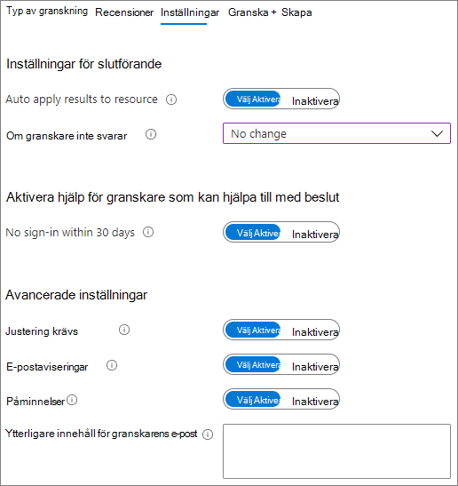

# Skapa en säker miljö för gästdelningCreate a secure guest sharing environment

I den här artikeln går vi igenom en mängd olika alternativ för att skapa en säker gästdelningsmiljö i Microsoft 365.In this article, we'll walk through a variety of options for creating a secure guest sharing environment in Microsoft 365. De här är exempel som ger dig en uppfattning om vilka alternativ som är tillgängliga.These are examples to give you an idea of the options available. Du kan använda de här procedurerna i olika kombinationer för att uppfylla organisationens säkerhets- och efterlevnadsbehov.You can use these procedures in different combinations to meet the security and compliance needs of your organization.

Den här artikeln innehåller:This article includes:

- Konfigurera multifaktorautentisering för gäster.Setting up multi-factor authentication for guests.
- Konfigurera användarvillkor för gäster.Setting up a terms of use for guests.
- Konfigurera kvartalsgranskning av gäståtkomst för att regelbundet verifiera om gästerna fortfarande behöver behörighet till grupper och webbplatser.Setting up quarterly guest access reviews to periodically validate whether guests continue to need permissions to teams and sites.
- Begränsa gästernas åtkomst till endast på webben för ohanterade enheter.Restricting guests to web-only access for unmanaged devices.
- Konfigurera en princip för sessionstidsgräns för att säkerställa att gästerna autentiserar sig dagligen.Configuring a session timeout policy to ensure guests authenticate daily.
- Skapa en typ av känslig information för ett strikt känsligt projekt.Creating a sensitive information type for a highly sensitive project.
- Tilldela automatiskt en känslighetsetikett till dokument som innehåller den typen av känslig information.Automatically assigning a sensitivity label to documents that contain a sensitive information type.
- Ta automatiskt bort gäståtkomst från filer med beteckningen med en känslighetsetikett.Automatically removing guest access from files with a sensitivity label.

Vissa av alternativen som beskrivs i den här artikeln kräver att gästerna har ett konto i Azure Active Directory.Some of the options discussed in this article require guests to have an account in Azure Active Directory. Om du vill vara säker på att gästerna ingår i katalogen när du delar filer och mappar med dem, ska du använda [SharePoint- och OneDrive-integrering med förhandsversionen av Azure AD B2B](/sharepoint/sharepoint-azureb2b-integration-preview).To ensure that guests are included in the directory when you share files and folders with them, use the [SharePoint and OneDrive integration with Azure AD B2B Preview](/sharepoint/sharepoint-azureb2b-integration-preview).

Observera att vi inte tar upp inställningarna för gästdelning i den här artikeln.Note that we won't discuss enabling guest sharing settings in this article. Mer information om hur du aktiverar gästdelning i olika scenarier finns i [Samarbeta med personer utanför organisationen](collaborate-with-people-outside-your-organization.md).See [Collaborating with people outside your organization](collaborate-with-people-outside-your-organization.md) for details about enabling guest sharing for different scenarios.

## Konfigurera multifaktorautentisering för gästerSet up multi-factor authentication for guests

Multifaktorautentisering minskar kraftigt risken för att ett konto komprometteras.Multi-factor authentication greatly reduces the chances of an account being compromised. Eftersom gästanvändare kanske använder personliga e-postkonton som inte följer några styrningsprinciper eller bästa praxis är det särskilt viktigt att kräva multifaktorautentisering för gäster.Since guests may be using personal email accounts that don't adhere to any governance policies or best practices, it's especially important to require multi-factor authentication for guests. Om en gästanvändares användarnamn och lösenord blir stulna, en andra autentiseringsfaktor minimera avsevärt risken för att okända personer ska få åtkomst till webbplatserna och filerna.If a guest's username and password is stolen, requiring a second factor of authentication greatly reduces the chances of unknown parties gaining access to your sites and files.

I det här exemplet konfigurerar vi multifaktorautentisering för gäster genom att använda en princip för villkorsstyrd åtkomst i Azure Active Directory.In this example, we'll set up multi-factor authentication for guests by using a conditional access policy in Azure Active Directory.

Konfigurera multifaktorautentisering för gästerTo set up multi-factor authentication for guests

1. Gå till [Principer för villkorstyrd åtkomst i Azure](https://portal.azure.com/#blade/Microsoft_AAD_IAM/ConditionalAccessBlade).Go to [Azure conditional access policies](https://portal.azure.com/#blade/Microsoft_AAD_IAM/ConditionalAccessBlade).
2. På bladet för **Villkorsstyrd åtkomst | Principer** klickar du på **Ny princip**.On the **Conditional Access | Policies** blade, click **New policy**.
3. I fältet **Namn** skriver du ett namn.In the **Name** field, type a name.
4. Under **Tilldelningar** klickar du på **Användare och grupper**.Under **Assignments**, click **Users and groups**.
5. I bladet **Användare och grupper** markerar du **Välj användare och grupper**, markerar kryssrutan **Alla gäster och externa användare**.On the **Users and groups** blade, select **Select users and groups**, select the **All guests and external users** check box.
6. Under **Tilldelningar** klickar du på **Molnappar eller åtgärder**.Under **Assignments**, click **Cloud apps or actions**.
7. Välj **alla program i molnet** på fliken **inkluderar** fliken **moln program eller-åtgärder** blad.On the **Cloud apps or actions** blade, select **All cloud apps** on the **Include** tab.
8. Under **Åtkomstkontroller** klickar du på **Bevilja**.Under **Access controls**, click **Grant**.
9. På bladet **Bevilja** markerar du kryssrutan **Kräv multifaktorautentisering** och klickar sedan på **Välj**.On the **Grant** blade, select the **Require multi-factor authentication** check box, and then click **Select**.
10. På bladet **Nytt**, under **Aktivera princip**, klickar du på **På** och sedan på **Skapa**.On the **New** blade, under **Enable policy**, click **On**, and then click **Create**.

Gästen måste då registrera sig för multifaktorautentisering för att de ska kunna komma åt delat innehåll, webbplatser eller team.Now, guest will be required to enroll in multi-factor authentication before they can access shared content, sites, or teams.

### Mer informationMore information

[Planerar en Azure AD Multi-Factor Authentication-distributionPlanning an Azure AD Multi-Factor Authentication deployment](/azure/active-directory/authentication/howto-mfa-getstarted)

## Konfigurera användarvillkor för gästerSet up a terms of use for guests

I vissa fall kanske gästanvändare inte har undertecknat sekretessavtal eller andra juridiska avtal med din organisation.In some situations guests may not have signed non-disclosure agreements or other legal agreements with your organization. Du kan kräva att gästerna godkänner användningsvillkor innan de kan komma åt filer som delas med dem.You can require guests to agree to a terms of use before accessing files that are shared with them. Användningsvillkoren kan visas första gången de försöker få åtkomst till en delad fil eller webbplats.The terms of use can be displayed the first time they attempt to access a shared file or site.

Om du vill skapa användningsvillkor måste du först skapa dokumentet i Word eller något annat redigeringsprogram och sedan spara det som en PDF-fil. Filen kan sedan laddas upp till Azure AD.To create a terms of use, you first need to create the document in Word or another authoring program, and then save it as a .pdf file. This file can then be uploaded to Azure AD.

Skapa användningsvillkor för Azure ADTo create an Azure AD terms of use

1. Logga in på Azure som global administratör, säkerhetsadministratör eller administratör för villkorsstyrd åtkomst.Sign in to Azure as a Global Administrator, Security Administrator, or Conditional Access Administrator.
2. Gå till [Användningsvillkor](https://aka.ms/catou).Navigate to [Terms of use](https://aka.ms/catou).
3. Klicka på **Nya villkor**.Click **New terms**.

   

4. Skriv ett **namn** och **visningsnamn**.Type a **Name** and **Display name**.
6. För **Dokument med användningsvillkor** bläddrar du till den PDF-fil som du har skapat och väljer den.For **Terms of use document**, browse to the pdf file that you created and select it.
7. Välj språk för dokumentet med användningsvillkor.Select the language for your terms of use document.
8. Ange **Kräv att användarna expanderar användningsvillkoren** som **På**.Set **Require users to expand the terms of use** to **On**.
9. Under **Villkorsstyrd åtkomst**, i listan **Tvinga med mallar för princip för villkorsstyrd åtkomst**, väljer du **Skapa princip för villkorsstyrd åtkomst senare**.Under **Conditional Access**, in the **Enforce with Conditional Access policy template** list choose **Create conditional access policy later**.
10. Klicka på **Skapa**.Click **Create**.

När du har skapat användningsvillkoren är nästa steg att skapa en princip för villkorsstyrd åtkomst som visar användningsvillkoren för gästanvändare.Once you've created the terms of use, the next step is to create a conditional access policy that displays the terms of use to guests.

Skapa princip för villkorsstyrd åtkomstTo create a conditional access policy

1. Gå till [Principer för villkorstyrd åtkomst i Azure](https://portal.azure.com/#blade/Microsoft_AAD_IAM/ConditionalAccessBlade).Go to [Azure conditional access policies](https://portal.azure.com/#blade/Microsoft_AAD_IAM/ConditionalAccessBlade).
2. På bladet för **Villkorsstyrd åtkomst | Principer** klickar du på **Ny princip**.On the **Conditional Access | Policies** blade, click **New policy**.
3. Skriv ett namn i rutan **Namn**.In the **Name** box, type a name.
4. Under **Tilldelningar** klickar du på **Användare och grupper**.Under **Assignments**, click **Users and groups**.
5. I bladet **Användare och grupper** markerar du **Välj användare och grupper**, markerar kryssrutan **Alla gäster och externa användare**.On the **Users and groups** blade, select **Select users and groups**, select the **All guests and external users** check box.
6. Under **Tilldelningar** klickar du på **Molnappar eller åtgärder**.Under **Assignments**, click **Cloud apps or actions**.
7. På fliken **Inkludera** väljer du **Välj appar** och klickar sedan på **Välj**.On the **Include** tab, select **Select apps**, and then click **Select**.
8. På bladet **Välj** väljer du **Microsoft Teams**, **Office 365 SharePoint Online** och **Outlook Groups** och klickar sedan på **Välj**.On the **Select** blade, select **Microsoft Teams**, **Office 365 SharePoint Online**, and **Outlook Groups**, and then click **Select**.
9. Under **Åtkomstkontroller** klickar du på **Bevilja**.Under **Access controls**, click **Grant**.
10. På bladet **Bevilja** väljer du **Användningsvillkor för gäster** och klickar sedan på **Välj**.On the **Grant** blade, select **Guest terms of use**, and then click **Select**.
11. På bladet **Nytt**, under **Aktivera princip**, klickar du på **På** och sedan på **Skapa**.On the **New** blade, under **Enable policy**, click **On**, and then click **Create**.

Första gången en gästanvändare försöker komma åt innehåll, ett team eller en webbplats i din organisation måste de acceptera användningsvillkoren.Now, the first time a guest attempts to access content or a team or site in your organization, they will be required to accept the terms of use.

> [!NOTE]
> Användningen av villkorstyrd åtkomst kräver en Azure Active Directory Premium P1-licens.Using Conditional Access requires an Azure AD Premium P1 license. Mer information finns i [Vad är villkorsstyrd åtkomst](/azure/active-directory/conditional-access/overview).For more information, see [What is Conditional Access](/azure/active-directory/conditional-access/overview).

### Mer informationMore information

[Användningsvillkor för Azure Active DirectoryAzure Active Directory terms of use](/azure/active-directory/conditional-access/terms-of-use)

## Konfigurera granskning av gäståtkomstSet up guest access reviews

Med åtkomstgranskningar i Azure AD kan du automatisera en återkommande granskning av användaråtkomst till olika team och grupper.With access reviews in Azure AD, you can automate a periodic review of user access to various teams and groups. Genom att begära åtkomstgranskning specifikt för gäster kan du bidra till att säkerställa att gästanvändare inte behåller åtkomsten till organisationens känsliga information under längre tid än nödvändigt.By requiring an access review for guests specifically, you can help ensure guests do not retain access to your organization's sensitive information for longer than is necessary.

Så här konfigurerar du en granskning av gäståtkomstTo set up a guest access review

1. På sidan [Identitetsstyrning](https://portal.azure.com/#blade/Microsoft_AAD_ERM/DashboardBlade) klickar du på **Åtkomstgranskningar** i den vänstra menyn.On the [Identity Governance page](https://portal.azure.com/#blade/Microsoft_AAD_ERM/DashboardBlade), in the left menu, click **Access reviews**.
2. Klicka på **Ny åtkomstgranskning**.Click **New access review**.
3. Välj alternativet **Team + Grupper**.Choose the **Teams + Groups** option.
4. Välj alternativet **Alla Microsoft 365-grupper med gästanvändare**.Choose the **All Microsoft 365 groups with guest users** option. Klicka på **Välj grupp(er) att utesluta** om du vill utesluta några grupper.Click **Select group(s) to exclude** if you want to exclude any groups.
5. Välj alternativet **endast gästanvändare** och klicka sedan på **Nästa: Granskningar**.Choose the **Guest users only** option, and then click **Next: Reviews**.
6. Under **Välj granskare** välj **Gruppägare**.Under **Select reviewers**, choose **Group Owner(s)**.
7. Klicka på **Välj reservgranskare**, välj vem som ska vara reservgranskare och klicka sedan på **Välj**.Click **Select fallback reviewers**, choose who should be the fallback reviewers, and then click **Select**.
8. Under **Ange upprepning av granskning** välj **Kvartals**.Under **Specify recurrence of review**, choose **Quarterly**.
9. Välj ett startdatum och varaktighet.Select a start date and duration.
10. För **Avsluta** väljer du **Aldrig** och klickar sedan på **Nästa: Inställningar**.For **End**, choose **Never**, and then click **Next: Settings**.

    

11. På fliken **Inställningar** granska inställningarna för efterlevnad av dina affärsregler.On the **Settings** tab, review the settings for compliance with your business rules.

    

12. Klicka **Nästa: Granska + Skapa**.Click **Next: Review + Create**.
13. Skriv ett **Granskningsnamn** granska inställningarna.Type a **Review name** and review the settings.
14. Klicka på **Skapa**.Click **Create**.

Det är viktigt att du noterar att gäster kan beviljas åtkomst till team eller grupper, eller till enskilda filer och mappar.It's important to note that guests can be given access to teams or groups, or to individual files and folders. När de får åtkomst till filer och mappar kanske gästerna inte läggs till i någon särskild grupp.When given access to files and folders, guests may not be added to any particular group. Om du vill göra åtkomstgranskningar för gästanvändare som inte tillhör ett team eller en grupp kan du skapa en dynamisk grupp i Azure AD för alla gäster och sedan skapa en åtkomstgranskning för den gruppen.If you want to do access reviews on guests who don't belong to a team or group, you can create a dynamic group in Azure AD to contain all guests and then create an access review for that group. Webbplatsägaren kan även hantera [förfallodatum för gäster för webbplatsen](https://support.microsoft.com/office/25bee24f-42ad-4ee8-8402-4186eed74dea)Site owners can also manage [guest expiration for the site](https://support.microsoft.com/office/25bee24f-42ad-4ee8-8402-4186eed74dea)

### Mer informationMore information

[Hantera gäståtkomst med åtkomstgranskningar i Azure ADManage guest access with Azure AD access reviews](/azure/active-directory/governance/manage-guest-access-with-access-reviews)

[Skapa en åtkomstgranskning av grupper eller program i åtkomstgranskningar i Azure ADCreate an access review of groups or applications in Azure AD access reviews](/azure/active-directory/governance/create-access-review)

## Konfigurera endast webbåtkomst för gästanvändareSet up web-only access for guests

Du kan minska din attackyta och underlätta administrationen genom att kräva att gästanvändarna får åtkomst till dina team, webbplatser och filer bara med hjälp av en webbläsare.You can reduce your attack surface and ease administration by requiring guests to access your teams, sites, and files by using a web browser only.

För Microsoft 365 Grupper och Team gör du det med en princip för villkorsstyrd åtkomst i Azure AD.For Microsoft 365 Groups and Teams, this is done with an Azure AD conditional access policy. För SharePoint är detta konfigurerat i administrationscentret för SharePoint.For SharePoint, this is configured in the SharePoint admin center. (Du kan också [använda känslighetsetiketter för att tillåta begränsad endast webb-åtkomst för gäster](../compliance/sensitivity-labels-teams-groups-sites.md).)(You can also [use sensitivity labels to restrict guests to web-only access](../compliance/sensitivity-labels-teams-groups-sites.md).)

Begränsa gäster till endast webbåtkomst för Grupper och Teams:To restrict guests to web-only access for Groups and Teams:

1. Gå till [Principer för villkorstyrd åtkomst i Azure](https://portal.azure.com/#blade/Microsoft_AAD_IAM/ConditionalAccessBlade).Go to [Azure conditional access policies](https://portal.azure.com/#blade/Microsoft_AAD_IAM/ConditionalAccessBlade).
2. På bladet för **Villkorsstyrd åtkomst – Principer** klickar du på **Ny princip**.On the **Conditional Access - Policies** blade, click **New policy**.
3. Skriv ett namn i rutan **Namn**.In the **Name** box, type a name.
4. Under **Tilldelningar** klickar du på **Användare och grupper**.Under **Assignments**, click **Users and groups**.
5. I bladet **Användare och grupper** markerar du **Välj användare och grupper**, markerar kryssrutan **Alla gäster och externa användare**.On the **Users and groups** blade, select **Select users and groups**, select the **All guests and external users** check box.
6. Under **Tilldelningar** klickar du på **Molnappar eller åtgärder**.Under **Assignments**, click **Cloud apps or actions**.
7. På fliken **Inkludera** väljer du **Välj appar** och klickar sedan på **Välj**.On the **Include** tab, select **Select apps**, and then click **Select**.
8. På bladet **Välj** väljer du **Microsoft Teams** och **Outlook Groups** och klickar sedan på **Välj**.On the **Select** blade, select **Microsoft Teams** and **Outlook Groups**, and then click **Select**.
9. Under **Tilldelningar** klickar du på **Villkor**.Under **Assignments**, click **Conditions**.
10. På bladet **Villkor** klickar du på **Klientappar**.On the **Conditions** blade, click **Client apps**.
11. På bladet **Klientappar** klickar du på **Ja** för **Konfigurera** och väljer sedan inställningarna **Mobila appar och skrivbordsklienter**.**Exchange ActiveSync-klienter** och **Andra klienter**.On the **Client apps** blade, click **Yes** for **Configure**, and then select the **Mobile apps and desktop clients**, **Exchange ActiveSync clients**, and **Other clients** settings. Avmarkera kryssrutan **Webbläsare**.Clear the **Browser** check box.

    

12. Klicka på **Klar**.Click **Done**.
13. Under **Åtkomstkontroller** klickar du på **Bevilja**.Under **Access controls**, click **Grant**.
14. På bladet **Bevilja** väljer du **Kräv att enheten är markerad som kompatibel** och **Kräv Hybrid Azure AD-kopplad enhet**.On the **Grant** blade, select **Require device to be marked as compliant** and **Require Hybrid Azure AD joined device**.
15. Under **För flera kontroller** väljer du **Begär en av de valda kontrollerna** och klickar sedan på **Välj**.Under **For multiple controls**, select **Require one of the selected controls**, and then click **Select**.
16. På bladet **Nytt**, under **Aktivera princip**, klickar du på **På** och sedan på **Skapa**.On the **New** blade, under **Enable policy**, click **On**, and then click **Create**.

Begränsa gäståtkomsten till endast SharePointTo restrict guests to web-ony access for SharePoint

1. I [Administrationscenter för SharePoint](https://admin.microsoft.com/sharepoint) visar du **Principer** och klickar på **Behörighets kontroll**.In the [SharePoint admin center](https://admin.microsoft.com/sharepoint), expand **Policies** and click **Access control**.
2. Klicka på **Ohanterade enheter**.Click **Unmanaged devices**.
3. Markera kryssrutan **Tillåt begränsad åtkomst** bara för webbplatser, och klicka sedan på **Spara**.Select the **Allow limited, web-only access** option, and then click **Save**.

Observera att den här inställningen i administrationscentret för SharePoint skapar en princip med stöd för villkorstyrd åtkomst i Azure AD.Note that this setting in the SharePoint admin center creates a supporting conditional access policy in Azure AD.

## Konfigurera en sessionstidsgräns för gästanvändareConfigure a session timeout for guests

Genom att kräva att gästanvändare ska autentiseras med jämna mellanrum kan du minska risken för att okända användare får åtkomst till din organisations innehåll om en gästanvändares enhet inte är skyddad.Requiring guests to authenticate on a regular basis can reduce the possibility of unknown users accessing your organization's content if a guest's device isn't kept secure. Du kan konfigurera en princip för villkorsstyrd åtkomst med sessionstidsgräns för gästanvändare i Azure AD.You can configure a session timeout conditional access policy for guests in Azure AD.

Konfigurera en princip för sessionstidsgräns för gästerTo configure a guest session timeout policy

1. Gå till [Principer för villkorstyrd åtkomst i Azure](https://portal.azure.com/#blade/Microsoft_AAD_IAM/ConditionalAccessBlade).Go to [Azure conditional access policies](https://portal.azure.com/#blade/Microsoft_AAD_IAM/ConditionalAccessBlade).
2. På bladet för **Villkorsstyrd åtkomst – Principer** klickar du på **Ny princip**.On the **Conditional Access - Policies** blade, click **New policy**.
3. I rutan **Namn** skriver du *Sessionstidsgräns för gäst*.In the **Name** box, type *Guest session timeout*.
4. Under **Tilldelningar** klickar du på **Användare och grupper**.Under **Assignments**, click **Users and groups**.
5. I bladet **Användare och grupper** markerar du **Välj användare och grupper**, markerar kryssrutan **Alla gäster och externa användare**.On the **Users and groups** blade, select **Select users and groups**, select the **All guests and external users** check box.
6. Under **Tilldelningar** klickar du på **Molnappar eller åtgärder**.Under **Assignments**, click **Cloud apps or actions**.
7. På fliken **Inkludera** väljer du **Välj appar** och klickar sedan på **Välj**.On the **Include** tab, select **Select apps**, and then click **Select**.
8. På bladet **Välj** väljer du **Microsoft Teams**, **Office 365 SharePoint Online** och **Outlook Groups** och klickar sedan på **Välj**.On the **Select** blade, select **Microsoft Teams**, **Office 365 SharePoint Online**, and **Outlook Groups**, and then click **Select**.
9. Under **Åtkomstkontroller** klickar du på **Session**.Under **Access controls**, click **Session**.
10. På bladet **Session** väljer du **Inloggningsfrekvens**.On the **Session** blade, select **Sign-in frequency**.
11. Välj **1** och **dagar** för tidsperiod och klicka sedan på **Välj**.Select **1** and **Days** for the time period, and then click **Select**.
12. På bladet **Nytt**, under **Aktivera princip**, klickar du på **På** och sedan på **Skapa**.On the **New** blade, under **Enable policy**, click **On**, and then click **Create**.

## Skapa en typ av känslig information för ett strikt känsligt projekt.Create a sensitive information type for a highly sensitive project

Olika typer av känsliga uppgifter är fördefinierade strängar som kan användas i policyarbetsflöden för att upprätthålla efterlevnadskraven.Sensitive information types are predefined strings that can be used in policy workflows to enforce compliance requirements. Microsoft 365 Efterlevnadscenter levereras med över 100 känsliga informationstyper, inklusive körkortsnummer, kreditkortsnummer, bankkontonummer osv.The Microsoft 365 Compliance Center comes with over one hundred sensitive information types, including driver's license numbers, credit card numbers, bank account numbers, etc.

Du kan skapa anpassade typer av känslig information som hjälper dig att hantera innehåll som är specifikt för din organisation.You can create custom sensitive information types to help manage content specific to your organization. I det här exemplet skapar vi en anpassad typ av känslig information för ett strikt känsligt projekt.In this example, we'll create a custom sensitive information type for a highly sensitive project. Vi kan sedan använda den här typen av känslig information för att automatiskt tillämpa en kanslighetsetikett.We can then use this sensitive information type to automatically apply a sensitivity label.

Skapa en typ av känslig informationTo create a sensitive information type

1. I [Microsoft 365 Efterlevnadscenter](https://compliance.microsoft.com) går du till vänster navigeringsfält och expanderar **Klassificering** och klickar sedan på **Typer av känslig information**.In the [Microsoft 365 Compliance Center](https://compliance.microsoft.com), in the left navigation, expand **Classification**, and then click **Sensitive info types**.
2. Klicka på **Skapa**.Click **Create**.
3. För **Namn** och **Beskrivning** skriver du **Projekt Saturnus** och klickar sedan på **Nästa**.For **Name** and **Description**, type **Project Saturn**, and then click **Next**.
4. Klicka på **Lägg till ett element**.Click **Add an element**.
5. I listan **Identifiera innehåll som innehåller** väljer du **Nyckelord** och skriver *Projekt Saturnus* i rutan sökordsrutan.On the **Detect content containing** list, select **Keywords**, and then type *Project Saturn* in the keyword box.
6. Klicka på **Nästa** och sedan på **Slutför**.Click **Next**, and then click **Finish**.
7. Om du tillfrågas om du vill testa typen av känslig information klickar du på **Nej**.If asked if you would like to test the sensitive information type, click **No**.

### Mer informationMore information

[Vanliga typer av känslig informationCustom sensitive information types](/Office365/SecurityCompliance/custom-sensitive-info-types)

## Skapa en princip för automatisk etikettmärkning för att tilldela en känslighetsetikett baserat på en typ av känslig informationCreate an auto-labeling policy to assign a sensitivity label based on a sensitive information type

Om du använder känslighetsetiketter i din organisation kan du automatiskt använda en etikett på filer som innehåller definierade typer av känsliga uppgifter.If you are using sensitivity labels in your organization, you can automatically apply a label to files that contain defined sensitive information types. 

Skapa en princip för automatisk etikettmärkningTo create an auto-labeling policy

1. Öppna [administrationscentret för Microsoft 365 Efterlevnad](https://compliance.microsoft.com).Open the [Microsoft 365 compliance admin center](https://compliance.microsoft.com).
2. I det vänstra navigeringsfältet klickar du på **Informationsskydd**.In the left navigation, click **Information protection**.
3. I fliken **Automatisk etikettmärkning** klickar du på **Skapa princip för automatisk etikettmärkning**.On the **Auto-labeling** tab, click **Create auto-labeling policy**.
4. På sidan **väljer du den information som du vill att etiketten ska tillämpas på** väljer du **Anpassad** och klickar på **Nästa**.On the **Choose info you want this label applied to** page, choose **Custom** and click **Next**.
5. Skriv ett namn och en beskrivning för principen och klicka på **Nästa**.Type a name and description for the policy and click **Next**.
6. På sidan **Välj platser där du vill använda etikett** aktiverar du **SharePoint-webbplatser** och klickar på **Välj webbplatser**.On the **Choose locations where you want to apply the label** page, turn on **SharePoint sites** and click **Choose sites**.
7. Lägg till URL: erna för de webbplatser där du vill aktivera Automatisk etikettmärkning och klickar på **Klar**.Add the URLs for the sites where you want to turn on auto-labeling and click **Done**.
8. Klicka på **Nästa**.Click **Next**.
9. Välj **Vanliga regler** på sidan **Konfigurera vanliga eller avancerade regler** och klicka på **Nästa**.On the **Set up common or advanced rules** page, choose **Common rules** and click **Next**.
10. På sidan **Definiera regler för innehåll på alla platser** klickar du på **Ny regel**.On the **Define rules for content in all locations** page, click **New rule**.
11. Ge regeln ett namn på sidan **Ny regel** klicka på **Lägg till villkor** och klicka sedan på **Innehållet har typer av känslig information**.On the **New rule** page, give the rule a name, click **Add condition**, and then click **Content contains sensitive info types**.
12. Klicka på **Lägg till**, klicka på **Typer av känslig information**, välj vilka typer av känslig information du vill använda, klicka på **Lägg till** och klicka sedan på **Spara**.Click **Add**, click **Sensitive info types**, choose the sensitive info types that you want to use, click **Add**, and then click **Save**.
13. Klicka på **Nästa**.Click **Next**.
14. Klicka på **Välj en etikett**, välj etiketten som du vill använda och klicka sedan **Lägg till**.Click **Choose a label**, select the label you want to use, and then click **Add**.
15. Klicka på **Nästa**.Click **Next**.
16. Lämna principen i simuleringsläge och klicka på **Nästa**.Leave the policy in simulation mode and click **Next**.
17. Klicka på **Skapa princip** och välj sedan **Klar**.Click **Create policy**, and then click **Done**.

När principen har skapats och en användare skriver ”Projekt Saturnus” i ett dokument, kommer principen för automatisk etikettmärkning att automatiskt tillämpa den specificerade etiketten när filen söks igenom.With the policy in place, when a user types "Project Saturn" into a document, the auto-labeling policy will automatically apply the specified label when it scans the file.

### Mer informationMore information

[Använda en känslighetsetikett för innehåll automatisktApply a sensitivity label to content automatically](../compliance/apply-sensitivity-label-automatically.md)

## Skapa en DLP-princip för att ta bort gäståtkomst till strikt känsliga filerCreate a DLP policy to remove guest access to highly sensitive files

Du kan använda [Dataförlustskydd (DLP](../compliance/dlp-learn-about-dlp.md)) för att förhindra att oönskade gäster delar känsligt innehåll.You can use [data loss prevention (DLP)](../compliance/dlp-learn-about-dlp.md) to prevent unwanted guest sharing of sensitive content. Dataförlustskydd kan utföra åtgärder baserat på en fils känslighetsetikett och ta bort gäståtkomst.Data loss prevention can take action based on a file's sensitivity label and remove guest access.

Skapa en DLP-regelTo create a DLP rule

1. I Microsoft 365 Efterlevnadscenter, gå till sidan [Dataförlustskydd](https://compliance.microsoft.com/datalossprevention).In the Microsoft 365 compliance admin center, go to the [Data loss prevention page](https://compliance.microsoft.com/datalossprevention).
2. Klicka på **Skapa princip**.Click **Create policy**.
3. Välj **Anpassad** och klicka på **Nästa**.Choose **Custom** and click **Next**.
4. Skriv ett namn för principen och klicka på **Nästa**.Type a name for the policy and click **Next**.
5. På **Platser för att tillämpa principen** Stäng av alla inställningar utom **SharePoint-webbplatser** och **OneDrive-konton** och klicka sedan på **Nästa**.On the **Locations to apply the policy** page turn off all settings except **SharePoint sites** and **OneDrive accounts**, and then click **Next**.
6. På sidan **Definiera principinställningar** klickar du på **Nästa**.On the **Define policy settings** page, click **Next**.
7. På sidan **Anpassa avancerade DLP-regler** klickar du på **Skapa regel** och anger ett namn på regeln.On the **Customize advanced DLP rules** page, click **Create rule** and type a name for the rule.
8. Under **Villkor** klickar du på **Lägg till villkor** och väljer **Innehållet har**.Under **Conditions**, click **Add condition**, and choose **Content contains**.
9. Om du klickar på **Lägg till** väljer du **Känslighetsetiketter** väljer de etiketter du vill använda och klickar på **Lägg till**.Click **Add**, choose **Sensitivity labels**, choose the labels you want to use, and click **Add**.

   

10. Under **Åtgärder** klickar du på **Lägg till en åtgärd** och väljer **Begränsa åtkomst eller kryptera innehållet i Microsoft 365 platser**.Under **Actions** click **Add an action** and choose **Restrict access or encrypt the content in Microsoft 365 locations**.
11. Välj kryssrutan **Begränsa åtkomst eller kryptera innehållet på Microsoft 365 platser** och välj sedan alternativet **Bara personer utanför din organisation**.Select the **Restrict access or encrypt the content in Microsoft 365 locations** check box and then choose the **Only people outside your organization** option.

      

12. Klicka på **Spara** och sedan på **Nästa**.Click **Save** and then click **Next**.
13. Välj testalternativ och klicka på **Nästa**.Choose your test options and click **Next**.
14. Klicka på **Skicka** och klicka sedan på **Klart**.Click **Submit**, and then click **Done**.

Det är viktigt att tänka på att principen inte tar bort åtkomst om gästen är medlem på webbplatsen eller i teamet som helhet.It's important to note that this policy doesn't remove access if the guest is a member of the site or team as a whole. Om du planerar att ha strikt känsliga dokument på en webbplats eller i ett team med gästmedlemmar, kan du överväga att använda [privata kanaler i Teams](https://support.microsoft.com/office/de3e20b0-7494-439c-b7e5-75899ebe6a0e) och bara tillåta medlemmarna i din organisation i de privata kanalerna.If you plan to have highly sensitive documents in a site or team with guest members, consider using [private channels in Teams](https://support.microsoft.com/office/de3e20b0-7494-439c-b7e5-75899ebe6a0e) and only allowing members of your organization in the private channels.

## Fler alternativAdditional options

Det finns några fler alternativ i Microsoft 365 och Azure Active Directory som kan hjälpa till att skydda gästdelningsmiljön.There are some additional options in Microsoft 365 and Azure Active Directory that can help secure your guest sharing environment.

- Du kan skapa en lista över tillåtna eller nekade delningsdomäner för att begränsa vilka användarna kan dela med.You can create a list of allowed or denied sharing domains to limit who users can share with. Mer information finns i [Begränsa delning av SharePoint- och OneDrive-innehåll efter domän](/sharepoint/restricted-domains-sharing) och [Tillåta eller blockera inbjudningar för B2B-användare från specifika organisationer](/azure/active-directory/b2b/allow-deny-list).See [Restrict sharing of SharePoint and OneDrive content by domain](/sharepoint/restricted-domains-sharing) and [Allow or block invitations to B2B users from specific organizations](/azure/active-directory/b2b/allow-deny-list) for more information.
- Du kan begränsa vilka andra Azure Active Directory-klientorganisationer som användarna kan ansluta till.You can limit which other Azure Active Directory tenants your users can connect to. Mer information finns i [Använda klientorganisationsbegränsningar för att hantera åtkomst till SaaS-molnprogram](/azure/active-directory/manage-apps/tenant-restrictions).See [Use tenant restrictions to manage access to SaaS cloud applications](/azure/active-directory/manage-apps/tenant-restrictions) for information.
- Du kan skapa en hanterad miljö där partner kan hjälpa dig att hantera gästkonton.You can create a managed environment where partners can help manage guest accounts. Mer information finns i [Skapa ett B2B-extranät med hanterade gäster](/Office365/Enterprise/b2b-extranet).See [Create a B2B extranet with managed guests](/Office365/Enterprise/b2b-extranet) for information.

## Se ävenSee Also

[Begränsa oavsiktlig exponering för filer när de delas med gästerLimit accidental exposure to files when sharing with guests](share-limit-accidental-exposure.md)

[Metodtips för att dela filer och mappar med oautentiserade användareBest practices for sharing files and folders with unauthenticated users](best-practices-anonymous-sharing.md)

[Skapa ett B2B-extranät med hanterade gästerCreate a B2B extranet with managed guests](b2b-extranet.md)