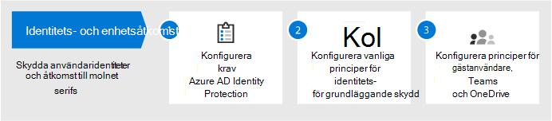
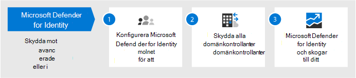
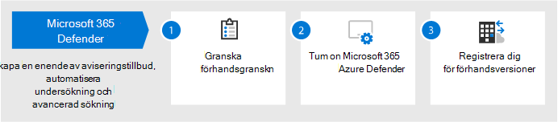
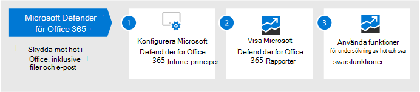
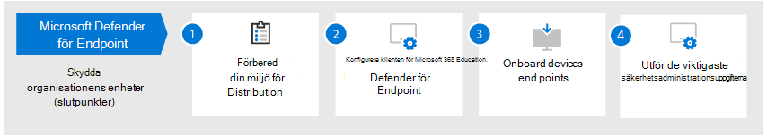
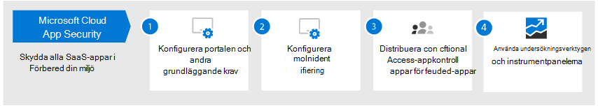
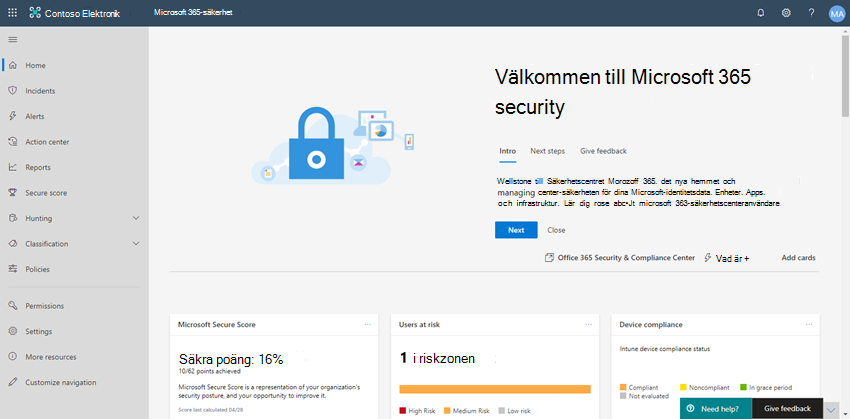

# Konfigurera skyddsfunktioner för hot i Microsoft 365

Följ de här anvisningarna för att konfigurera skydd mot hot i Microsoft 365.

## Steg 1: Konfigurera multifaktorautentisering och villkorsstyrd åtkomst

[Multifaktorautentisering](/azure/active-directory/authentication/concept-mfa-howitworks) (MFA) kräver att användare verifierar sin identitet med ett telefonsamtal eller en autentiseringsapp. [Villkorsstyrda åtkomstprinciper](/azure/active-directory/conditional-access/overview) definierar vissa krav som måste uppfyllas för att användare ska få åtkomst till appar och data i Microsoft 365. MFA- och Villkorsstyrd åtkomstpolicy fungerar tillsammans för att skydda organisationen. Om någon till exempel försöker logga in från en mobil enhet med ett konto som inte är aktiverat för MFA, och en princip för villkorsstyrd åtkomst kräver att MFA är aktivt, förhindras användaren från att logga in.  

Microsoft har testat och rekommenderar en särskild uppsättning villkorsstyrda åtkomst och relaterade principer för att skydda åtkomsten till alla dina SaaS-program, särskilt Microsoft 365. Principer rekommenderas för grundläggande, känslig och starkt reglerad säkerhet. Börja med att implementera principer för grundläggande skydd. 

 
 [en större version av den här bilden](https://github.com/MicrosoftDocs/microsoft-365-docs/raw/public/microsoft-365/media/microsoft-365-policies-configurations/Identity_device_access_policies_byplan.png)

### Implementera baslinjeskydd för Microsoft 365

 

1. [Konfigurera krav, inklusive Azure AD Identity Protection.](../security/office-365-security/identity-access-prerequisites.md)
2. [Konfigurera vanliga principer för identitets- och enhetsåtkomst](../security/office-365-security/identity-access-policies.md) för grundläggande skydd.
3. Konfigurera principer för [gästanvändare](../security/office-365-security/identity-access-policies-guest-access.md), [Microsoft Teams,](../security/office-365-security/teams-access-policies.md) [Exchange Online](../security/office-365-security/secure-email-recommended-policies.md)och [SharePoint Online och OneDrive.](../security/office-365-security/sharepoint-file-access-policies.md)

### Mer information om hur du skyddar identiteter

- [Konfigurationer för identitets- och enhetsåtkomst](../security/office-365-security/microsoft-365-policies-configurations.md)
- [Säkerhetsvägledning för Azure MFA](/azure/active-directory/authentication/multi-factor-authentication-security-best-practices)

## Steg 2: Konfigurera Microsoft Defender för identitet

[Microsoft Defender för identitet](/defender-for-identity/what-is) är en molnbaserad säkerhetslösning som fungerar med dina lokala AD DS-signaler (Active Directory Domain Services) för att identifiera, identifiera och undersöka avancerade hot, komprometterade identiteter och skadliga Insider-åtgärder i organisationen.

Microsoft Defender för identitet aktiverar säkerhetsåtgärder (SecOps) analytiker och säkerhetsexperter som har svårt att identifiera avancerade attacker i hybridmiljöer för att:
- Övervaka användare, entitetsbeteende och aktiviteter med utbildningsbaserade analyser.
- Skydda användaridentiteter och inloggningsuppgifter som lagras i Active Directory.
- Identifiera och undersök misstänkta användaraktiviteter och avancerade attacker under alla attackfaserna.
- Ge tydlig information om incidenten på en enkel tidslinje för snabb prioritering.

### Konfigurera Microsoft Defender för identitet

 

1. [Konfigurera Microsoft Defender för identitet för](/azure-advanced-threat-protection/install-atp-step1) att skydda dina primära miljöer.
2. Skydda alla [domänkontrollanter och](/azure-advanced-threat-protection/atp-sensor-monitoring) [skogar.](/azure-advanced-threat-protection/atp-multi-forest)
3. Integrera [Microsoft Defender för identitetsaviseringar](/azure-advanced-threat-protection/suspicious-activity-guide?tabs=external) i ditt säkerhetsarbetsflöde (SecOps).

### Mer information om Microsoft Defender för identitet

- [Vad är Microsoft Defender for Identity?](/azure-advanced-threat-protection/what-is-atp)
- [Video: Introduktion till Microsoft Defender för identitet](https://www.youtube.com/watch?reload=9&v=EGY2m8yU_KE)
- [Distribution av Microsoft Defender för identitet](/azure-advanced-threat-protection/what-is-atp#whats-next)

## Steg 3: Aktivera Microsoft 365 Defender

[Microsoft 365 Defender](../security/defender/microsoft-365-defender.md) kombinerar signaler och licenskapacitet till en enda lösning. Med den integrerade Microsoft 365 Defender-lösningen kan säkerhetsexperter hantera hoten som utgör en signal att var och en av dessa produkter får och fastställa hotens fullständiga omfattning och påverkan. hur det angavs i miljön, vad det påverkades och hur det för närvarande påverkar organisationen. Microsoft 365 Defender vidtar automatisk åtgärd för att förhindra eller stoppa attacken och självutmanade postlådor, slutpunkter och användaridentiteter.

I Microsoft 365 Defender kan du samla aviseringar, incidenter, automatisk undersökning och svar och avancerad sökning i olika arbetsbelastningar (Microsoft Defender för identitet, Microsoft Defender för Office 365, Microsoft Defender för slutpunkt och Microsoft Cloud App Security) i ett enda fönster med glas. Nya funktioner läggs till kontinuerligt i Microsoft 365 Defender. Överväg att registrera dig för att få förhandsgranskningsfunktioner.

### Konfigurera Microsoft 365 Defender

 

1. [Granska förutsättningarna](../security/defender/prerequisites.md).
2. [Aktivera Microsoft 365 Defender](../security/defender/m365d-enable.md).
3. [Registrera dig för förhandsgranskningsfunktioner.](../security/defender/preview.md)

### Mer information om Microsoft 365 Defender

- [Vad är Microsoft 365 Defender?](../security/defender/microsoft-365-defender.md)
- [Nyheter i Microsoft 365 Defender](../security/defender/whats-new.md)

## Steg 4: Konfigurera Microsoft Defender för Office 365

[Microsoft Defender för Office 365](../security/office-365-security/defender-for-office-365.md) skyddar organisationen mot skadliga hot i e-postmeddelanden (bifogade filer och URL-adresser), Office-dokument och samarbetsverktyg. I följande tabell visas funktioner och funktioner för Microsoft Defender för Office 365 som ingår i Microsoft 365 E5:

|Funktioner för konfiguration, skydd och identifiering|Funktioner för automatisering, undersökning, åtgärder och utbildning|
|---|---|
|[Säkra bifogade filer](../security/office-365-security/safe-attachments.md) [Säkra länkar](../security/office-365-security/safe-links.md) [Säkra dokument](../security/office-365-security/safe-docs.md) [ATP för SharePoint, OneDrive och Microsoft Teams](../security/office-365-security/mdo-for-spo-odb-and-teams.md) [Skydd mot nätfiske i Defender för Office 365](../security/office-365-security/set-up-anti-phishing-policies.md#Exclusive-settings-in-anti-phishing-policies-in Microsoft-Defender-for-Office-365)|[Hotspårare](../security/office-365-security/threat-trackers.md) [Hotutforskaren](../security/office-365-security/threat-explorer.md) [Automatiska undersökningar och svar](../security/office-365-security/office-365-air.md) [Attacksimulator](../security/office-365-security/attack-simulator.md)|
|

Med Microsoft Defender för Office 365 kan personer i organisationen kommunicera och samarbeta säkrare, med hotskydd för deras e-postinnehåll och Office-dokument.

### Konfigurera Microsoft Defender för Office 365

 

1. [Konfigurera och konfigurera Microsoft Defender för Office 365-principer.](../security/office-365-security/protect-against-threats.md)
2. [Visa och använda Microsoft Defender för Office 365-rapporter](../security/office-365-security/view-reports-for-mdo.md).
3. [Använd funktioner för undersökning av hot och svar.](../security/office-365-security/office-365-ti.md)

### Mer information om Microsoft Defender för Office 365

- [Översikt över Microsoft Defender för Office 365](../security/office-365-security/defender-for-office-365.md)
- [Vad är nytt i Microsoft Defender för Office 365](../security/office-365-security/whats-new-in-defender-for-office-365.md)

## Steg 5: Konfigurera Microsoft Defender för Slutpunkt

[Microsoft Defender för Slutpunkt](/windows/security/threat-protection) skyddar organisationers enheter (kallas även slutpunkter) från cyberhot, avancerade attacker och databrott. Säkerhetsteam kan bli effektivare i hanteringen av säkerheten hos slutpunkterna. Robusta verktyg hjälper organisationer att hålla koll på program som inte fungerar genom sårbarhetsidentifiering [med hantering av hot och sårbarhet.](/windows/security/threat-protection/microsoft-defender-atp/next-gen-threat-and-vuln-mgt) Automatiska identifierings- och åtgärdsfunktioner, till exempel minskning av [attackytor,](/windows/security/threat-protection/microsoft-defender-atp/overview-attack-surface-reduction)nästa  [generations](/windows/security/threat-protection/windows-defender-antivirus/windows-defender-antivirus-in-windows-10) [skydd,](/windows/security/threat-protection/microsoft-defender-atp/overview-endpoint-detection-response)identifiering och svar av slutpunkter samt automatiserad undersökning och åtgärd hjälper till att skydda dina enheter mot skadlig programvara. Utöver dessa funktioner kan kunder få proaktiva aviseringar och rådgöra med Microsoft Threat Experts på begäran, som en del av den hanterade servicen för avanmälan. 

### Konfigurera Microsoft Defender för Slutpunkt

 

1. [Förbereda miljön för Microsoft Defender för slutpunktsdistribution](/windows/security/threat-protection/microsoft-defender-atp/deployment-phases).
2. [Konfigurera Microsoft Defender för slutpunktsdistribution](/windows/security/threat-protection/micros.oft-defender-atp/production-deployment).
3. [Onboard to the Microsoft Defender for Endpoint service](/windows/security/threat-protection/microsoft-defender-atp/onboarding).
4. [Utför dina viktigaste administrativa uppgifter för säkerhet.](/windows/security/threat-protection/microsoft-defender-atp/tvm-security-recommendation)

### Mer information om Microsoft Defender för Slutpunkt

- [Läs mer om Microsoft Defender för Slutpunkt](/windows/security/threat-protection).
- [Prova Microsoft Defender för utvärderingslabb för slutpunkt.](/windows/security/threat-protection/microsoft-defender-atp/evaluation-lab)

## Steg 6: Konfigurera Microsoft Cloud App Security

[Microsoft Cloud App Security är](/cloud-app-security) en cloud Access Security Broker som har stöd för logginsamling, API-anslutningsprogram och omvänd proxy. Microsoft Cloud App Security ger full insyn, kontroll över data färdas och avancerad analys för att identifiera och bekämpa cyberhot i alla dina molntjänster. Med Microsoft Cloud App Security kan dina säkerhetsåtgärder skydda organisationens känsliga information, skydda mot cyberhot och såser, upptäcka och övervaka appar som har åtkomst till organisationens data och se till att organisationens molnappar uppfyller efterlevnadskraven.

### Konfigurera Microsoft Cloud App-säkerhet

 

1. [Konfigurera portalen och andra grundläggande krav.](/cloud-app-security/general-setup)
2. [Konfigurera molnidentifiering och](/cloud-app-security/set-up-cloud-discovery) [anslut appar.](/cloud-app-security/enable-instant-visibility-protection-and-governance-actions-for-your-apps)
3. [Distribuera programkontroll för villkorsstyrd åtkomst för aktuella program](/cloud-app-security/proxy-deployment-aad).
4. [Använd undersökningsverktygen och instrumentpanelerna](/cloud-app-security/investigate).

### Mer information om Microsoft Cloud App Security

- [Granska nya funktioner.](/cloud-app-security/release-notes)
- [Läs mer om Microsoft Cloud App Security](/cloud-app-security/what-is-cloud-app-security).

## Steg 7: Övervaka status och vidta åtgärder

När du har konfigurerat och distribuerat dina skyddstjänster för hot och funktioner är nästa steg att övervaka identifiering av hot och vidta lämpliga åtgärder. Den bästa utgångspunkten är Microsoft 365 säkerhetscenter ( ), där du kan övervaka och hantera säkerheten i [https://security.microsoft.com](https://security.microsoft.com) din Microsoft-identitet, data, enheter, appar och infrastruktur. 

Microsoft 365 Säkerhetscenter är avsett för säkerhetsadministratörer och säkerhetsoperationsgrupper. I Säkerhetscenter för Microsoft 365 kan du:
- Visa organisationens övergripande säkerhetshälsa med [Secure Score](https://docs.microsoft.com/microsoft-365/security/defender/microsoft-secure-score).
- [Övervaka och visa rapporter](https://docs.microsoft.com/microsoft-365/security/defender/monitoring-and-reporting) om status för identiteter, data, enheter, appar och infrastruktur.
- Koppla samman punkter för aviseringar via [incidenter](https://docs.microsoft.com/microsoft-365/security/defender/incident-queue).
- Använd [automatisk undersökning och åtgärd för](https://docs.microsoft.com/microsoft-365/security/defender/mtp-autoir) att hantera hot.
- [Proaktivt leta efter hot, till exempel intrångsförsök](https://docs.microsoft.com/microsoft-365/security/defender/advanced-hunting-overview)eller intrångsaktivitet som påverkar e-post, data, enheter och identiteter.
- [Förstå de senaste attackkampanjerna](https://docs.microsoft.com/microsoft-365/security/defender/latest-attack-campaigns) och teknikerna med hotanalyser.
- ... och mycket mer!

### Mer information om Säkerhetscenter för Microsoft 365

- [Kom igång med Säkerhetscenter för Microsoft 365.](../security/defender/overview-security-center.md)
- [Övervaka och visa rapporter](../security/defender/overview-security-center.md).
- [Se säkerhetsportalerna i Microsoft 365](../security/defender/portals.md).

## Steg 8: Utbilda användare

Utbildningsanvändare kan spara dina användare och säkerhetsåtgärder på mycket tid och bli frustrerade. Smarta användare har mindre chans att öppna bifogade filer eller klicka på länkar i tveksamma e-postmeddelanden, och risken är större att de undviker misstänkta webbplatser. 

Nu finns en handbok om [cybersäkerhet från](https://go.microsoft.com/fwlink/?linkid=2015598&amp;clcid=0x409) Harvard School som ger utmärkt vägledning om att etablera en stark säkerhetskultur inom organisationen, bland annat utbildningsanvändare för att identifiera nätfiskeattacker. 

Med Microsoft 365 får du följande resurser för att informera användarna i organisationen:

|Begrepp  |Resurser  |
|---------|---------|
|Microsoft 365     |[Anpassningsbara utbildningsvägar](/office365/customlearning/) 
De här resurserna kan hjälpa dig att sätta ihop utbildning för slutanvändarna i organisationen        |
|Microsoft 365-säkerhet |[Utbildningsmodul: Skydda organisationen med inbyggd och intelligent säkerhet från Microsoft 365](/learn/modules/security-with-microsoft-365) 
I den här modulen kan du beskriva hur Microsoft 365-säkerhetsfunktioner fungerar tillsammans och att uttrycka fördelarna med dessa säkerhetsfunktioner. |
|Multifaktorautentisering     | [Tvåstegsverifiering: Vad är den ytterligare verifieringssidan?](/azure/active-directory/user-help/multi-factor-authentication-end-user-first-time) 
Den här artikeln hjälper slutanvändarna att förstå vad multifaktorautentisering är och varför det används i organisationen.    |

Förutom den här vägledningen rekommenderar Microsoft att dina användare gör som beskrivs i den här artikeln: Skydda ditt konto och dina enheter [från hackare och skadlig programvara.](https://support.office.com/article/066d6216-a56b-4f90-9af3-b3a1e9a327d6.aspx) Dessa åtgärder omfattar:
- Använda starka lösenord
- Skydda enheter 
- Aktivera säkerhetsfunktioner på PC-datorer med Windows 10 och Mac (för ohanterade enheter)
    
Microsoft rekommenderar även att användare skyddar sina personliga e-postkonton genom att vidta de åtgärder som rekommenderas i följande artiklar:
- [Skydda ditt e Outlook.com konto](https://support.microsoft.com/office/help-protect-your-outlook-com-email-account-a4f20fc5-4307-4ece-8231-6d4d4bd8a9ba)
- [Skydda ditt Gmail-konto med tvåstegsverifiering](https://go.microsoft.com/fwlink/?linkid=2015688&amp;clcid=0x409)
