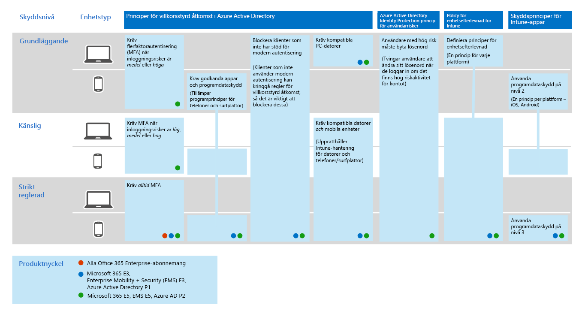
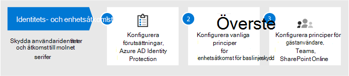
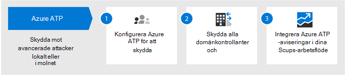
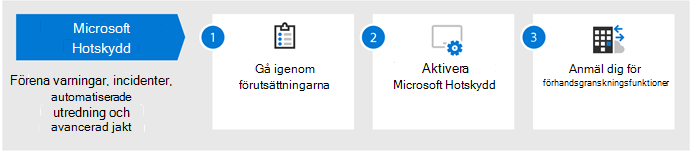
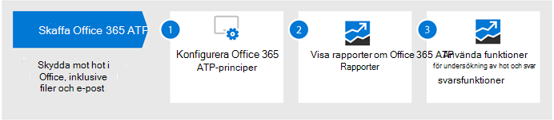
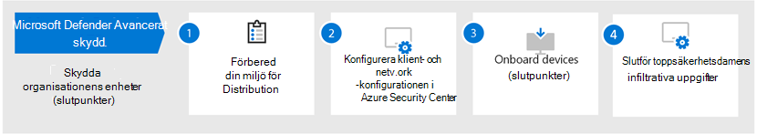

# Konfigurera hotskyddsfunktioner i Microsoft 365

Följ dessa steg för att konfigurera skydd mot hot i Microsoft 365.

## Steg 1: Konfigurera principer för multifaktorautentisering och villkorlig åtkomst

[MFA (Multifaktor authentication)](https://docs.microsoft.com/azure/active-directory/authentication/concept-mfa-howitworks) kräver att användarna verifierar sin identitet med en app för telefonsamtal eller autentiserare. [Principer för villkorlig åtkomst](https://docs.microsoft.com/azure/active-directory/conditional-access/overview) definierar vissa krav som måste uppfyllas för att användare ska komma åt appar och data i Microsoft 365. MFA och principer för villkorlig åtkomst fungerar tillsammans för att skydda din organisation. Om någon till exempel försöker logga in från en mobil enhet med ett konto som inte är aktiverat för MFA och en princip för villkorlig åtkomst kräver att MFA gäller, hindras användaren från att logga in.  

Microsoft har testat och rekommenderar en specifik uppsättning principer för villkorlig åtkomst och relaterade principer för att skydda åtkomsten till alla Dina SaaS-program, särskilt Microsoft 365. Principer rekommenderas för baslinje, känsligt och starkt reglerat skydd. Börja med att implementera principerna för baslinjeskydd. 

 
 [Se en större version av den här avbildningen](https://github.com/MicrosoftDocs/microsoft-365-docs/raw/public/microsoft-365/media/Identity_device_access_policies_byplan.png)

### Så här implementerar du baslinjeskydd för Microsoft 365

 

1. [Konfigurera förutsättningar, inklusive Azure Identity Protection](../enterprise/identity-access-prerequisites.md).
2. Konfigurera vanliga principer för [identitets- och enhetsåtkomst](../enterprise/identity-access-policies.md) för baslinjeskydd.
3. Konfigurera principer för [gästanvändare](../enterprise/identity-access-policies-guest-access.md), [Microsoft Teams,](../enterprise/teams-access-policies.md) [Exchange Online](../enterprise/secure-email-recommended-policies.md)och [SharePoint Online och OneDrive](../enterprise/sharepoint-file-access-policies.md).

### Mer information om hur du skyddar identiteter

- [Konfigurationer av identiteter och enhetsåtkomst](../enterprise/microsoft-365-policies-configurations.md)
- [Säkerhetsvägledning för Azure MFA](https://docs.microsoft.com/azure/active-directory/authentication/multi-factor-authentication-security-best-practices)

## Steg 2: Konfigurera Avancerat hotskydd i Azure

[Azure Advanced Threat Protection](https://docs.microsoft.com/azure-advanced-threat-protection/what-is-atp) (Azure ATP) är en molnbaserad säkerhetslösning som fungerar med dina lokala [Azure Active Directory-signaler](https://docs.microsoft.com/azure/active-directory/fundamentals/active-directory-whatis) för att identifiera, identifiera och undersöka avancerade hot, komprometterade identiteter och skadliga insideråtgärder som riktas mot din organisation.

Azure ATP möjliggör säkerhetsåtgärder (SecOps) analytiker och säkerhetspersonal som kämpar för att upptäcka avancerade attacker i hybridmiljöer för att:
- Övervaka användare, entitetsbeteende och aktiviteter med utbildningsbaserad analys.
- Skydda användaridentiteter och inloggningsuppgifter som lagras i Active Directory.
- Identifiera och undersök misstänkta användaraktiviteter och avancerade attacker under alla attackfaserna.
- Ge tydlig information om incidenten på en enkel tidslinje för snabb prioritering.

### Så här konfigurerar du Azure ATP

 

1. [Konfigurera Azure ATP](https://docs.microsoft.com/azure-advanced-threat-protection/install-atp-step1) för att skydda dina primära miljöer.
2. Skydda alla [domänkontrollanter](https://docs.microsoft.com/azure-advanced-threat-protection/atp-sensor-monitoring) och [skogar.](https://docs.microsoft.com/azure-advanced-threat-protection/atp-multi-forest)
3. Integrera [Azure ATP-aviseringar](https://docs.microsoft.com/azure-advanced-threat-protection/suspicious-activity-guide?tabs=external) i ditt arbetsflöde för säkerhetsåtgärder (SecOps).

### Mer information om Azure ATP

- [Vad är Azure ATP?](https://docs.microsoft.com/azure-advanced-threat-protection/what-is-atp)
- [Video: Introduktion till Azure ATP](https://www.youtube.com/watch?reload=9&v=EGY2m8yU_KE)
- [Azure ATP-distribution](https://docs.microsoft.com/azure-advanced-threat-protection/what-is-atp#whats-next)

## Steg 3: Aktivera Microsoft Threat Protection

[Microsoft Threat Protection](https://docs.microsoft.com/microsoft-365/security/mtp/microsoft-threat-protection) kombinerar signaler och orkestrerar funktioner till en enda lösning. Med den integrerade Microsoft Threat Protection-lösningen kan säkerhetspersonal sy ihop de hotsignaler som var och en av dessa produkter tar emot och avgöra hotets fulla omfattning och inverkan. hur den kom in i miljön, vad den påverkas och hur den för närvarande påverkar organisationen. Microsoft Threat Protection vidtar automatiska åtgärder för att förhindra eller stoppa angrepp och självläker affected postlådor, slutpunkter och användaridentiteter.

Microsoft Threat Protection förenar aviseringar, incidenter, automatisk undersökning och svar och avancerad jakt över arbetsbelastningar (Azure ATP, Office 365 ATP, Microsoft Defender ATP och Microsoft Cloud App Security) till en enda glasruta. När du har konfigurerat en eller flera av dina avancerade hotskyddstjänster aktiverar du Microsoft Threat Protection. Nya funktioner läggs till kontinuerligt i Microsoft Threat Protection. överväga att anmäla sig för att ta emot förhandsgranskningsfunktioner.

### Så här konfigurerar du Microsoft Threat Protection

 

1. [Gå igenom förutsättningarna](https://docs.microsoft.com/microsoft-365/security/mtp/prerequisites).
2. [Aktivera Microsoft Threat Protection](https://docs.microsoft.com/microsoft-365/security/mtp/mtp-enable).
3. [Anmäl dig för förhandsgranskningsfunktioner](https://docs.microsoft.com/microsoft-365/security/mtp/preview).

### Mer information om Microsofts hotskydd

- [Vad är Microsoft Hotskydd?](https://docs.microsoft.com/microsoft-365/security/mtp/microsoft-threat-protection)
- [Nyheter i Microsoft Hotskydd](https://docs.microsoft.com/microsoft-365/security/mtp/whats-new)

## Steg 4: Konfigurera avancerat hotskydd för Office 365

[Office 365 Advanced Threat Protection](https://docs.microsoft.com/microsoft-365/security/office-365-security/office-365-atp) (Office 365 ATP) skyddar din organisation mot skadliga hot i e-postmeddelanden (bifogade filer och webbadresser), Office-dokument och samarbetsverktyg. I följande tabell visas funktioner och funktioner för Office 365 ATP som ingår i Microsoft 365 E5:

|||
|---|---|
|Konfigurations-, skydds- och identifieringsfunktioner|Automatisering, utredning, sanering och utbildningskapacitet|
|[Säkra bifogade filer](https://docs.microsoft.com/microsoft-365/security/office-365-security/atp-safe-attachments) [Säkra länkar](https://docs.microsoft.com/microsoft-365/security/office-365-security/atp-safe-links) [Säkra dokument](https://docs.microsoft.com/microsoft-365/security/office-365-security/safe-docs) [ATP för SharePoint, OneDrive och Microsoft Teams](https://docs.microsoft.com/microsoft-365/security/office-365-security/atp-for-spo-odb-and-teams) [ATP-skydd mot nätfiske](https://docs.microsoft.com/microsoft-365/security/office-365-security/set-up-anti-phishing-policies#exclusive-settings-in-atp-anti-phishing-policies)|[Hotspårare](https://docs.microsoft.com/microsoft-365/security/office-365-security/threat-trackers) [Hotutforskaren](https://docs.microsoft.com/microsoft-365/security/office-365-security/threat-explorer) [Automatiska undersökningar och svar](https://docs.microsoft.com/microsoft-365/security/office-365-security/office-365-air) [Attacksimulator](https://docs.microsoft.com/microsoft-365/security/office-365-security/attack-simulator)|
|

Med Office 365 ATP kan personer i hela organisationen kommunicera och samarbeta säkrare, med hotskydd för sitt e-postinnehåll och Office-dokument.

### Så här konfigurerar du Office 365 ATP

 

1. [Konfigurera office 365 ATP-principer](https://docs.microsoft.com/microsoft-365/security/office-365-security/protect-against-threats).
2. [Visa och använda office 365 ATP-rapporter](https://docs.microsoft.com/microsoft-365/security/office-365-security/view-reports-for-atp).
3. [Använd hotutrednings- och svarsfunktioner](https://docs.microsoft.com/microsoft-365/security/office-365-security/office-365-ti).

### Mer information om OFFICE 365 ATP

- [Översikt över Office 365 ATP](https://docs.microsoft.com/microsoft-365/security/office-365-security/office-365-atp)
- [Nyheter i Office 365 ATP](https://docs.microsoft.com/microsoft-365/security/office-365-security/whats-new-in-office-365-atp)

## Steg 5: Konfigurera avancerat hotskydd för Microsoft Defender

[Microsoft Defender Advanced Threat Protection](https://docs.microsoft.com/windows/security/threat-protection) (Microsoft Defender ATP) skyddar dina organisationers enheter (även kallade slutpunkter) från cyberhot, avancerade attacker och dataintrång. Säkerhetsteam kan vara mer effektiva när det gäller att hantera säkerheten för sina slutpunkter. Robusta verktyg hjälper organisationer att hålla jämna steg med opatrullerade system med hjälp av sårbarhetsidentifiering med [hot- och sårbarhetshantering](https://docs.microsoft.com/windows/security/threat-protection/microsoft-defender-atp/next-gen-threat-and-vuln-mgt). Automatiserade identifierings- och reparationsfunktioner, till exempel [minskning av angreppsyta,](https://docs.microsoft.com/windows/security/threat-protection/microsoft-defender-atp/overview-attack-surface-reduction) [nästa generations skydd,](https://docs.microsoft.com/windows/security/threat-protection/windows-defender-antivirus/windows-defender-antivirus-in-windows-10)identifiering och svar för [slutpunkter](https://docs.microsoft.com/windows/security/threat-protection/microsoft-defender-atp/overview-endpoint-detection-response)och [automatisk undersökning och reparation](https://docs.microsoft.com/windows/security/threat-protection/microsoft-defender-atp/automated-investigations) hjälper till att skydda dina enheter från skadlig kod. Utöver dessa funktioner kan kunder få proaktiva meddelanden och rådgöra med Microsoft Threat Experts on demand, som en del av opt-in-hanterade jakttjänsten. 

### Konfigurera Microsoft Defender ATP

 

1. [Förbered din Microsoft Defender ATP-distribution](https://docs.microsoft.com/windows/security/threat-protection/microsoft-defender-atp/deployment-phases).
2. [Konfigurera microsoft defender ATP-distributionen](https://docs.microsoft.com/windows/security/threat-protection/micros.oft-defender-atp/production-deployment)
3. [Ombord på Microsoft Defender ATP-tjänsten](https://docs.microsoft.com/windows/security/threat-protection/microsoft-defender-atp/onboarding).
4. [Slutför de högsta administrativa säkerhetsuppgifterna](https://docs.microsoft.com/windows/security/threat-protection/microsoft-defender-atp/tvm-security-recommendation).

### Mer information om Microsoft Defender ATP

- [Läs mer om Microsoft Defender ATP](https://docs.microsoft.com/windows/security/threat-protection).
- [Prova Microsoft Defender ATP-utvärderingslabbet](https://docs.microsoft.com/windows/security/threat-protection/microsoft-defender-atp/evaluation-lab).

## Steg 6: Konfigurera Microsoft Cloud App Security

[Microsoft Cloud App Security](https://docs.microsoft.com/cloud-app-security) är en Cloud Access Security Broker som stöder logginsamling, API-kopplingar och omvänd proxy. Microsoft Cloud App Security ger omfattande synlighet, kontroll över dataresor och sofistikerade analyser för att identifiera och bekämpa cyberhot i alla dina molntjänster. Med Microsoft Cloud App Security kan din säkerhetsoperation skydda organisationens känsliga information, skydda mot cyberhot och avvikelser, upptäcka och övervaka appar som kommer åt organisationens data och se till att organisationens molnappar uppfyller efterlevnadskraven.

### Konfigurera Microsoft Cloud App Security

 

1. [Ställ in portalen och andra grundläggande krav](https://docs.microsoft.com/cloud-app-security/general-setup).
2. [Konfigurera molnidentifiering](https://docs.microsoft.com/cloud-app-security/set-up-cloud-discovery) och [ansluta appar](https://docs.microsoft.com/cloud-app-security/enable-instant-visibility-protection-and-governance-actions-for-your-apps).
3. [Distribuera appkontroll för villkorlig åtkomst för utvalda appar](https://docs.microsoft.com/cloud-app-security/proxy-deployment-aad).
4. [Använd undersökningsverktygen och instrumentpanelerna](https://docs.microsoft.com/cloud-app-security/investigate).

### Mer information om Microsoft Cloud App Security

- [Granska nya funktioner och funktioner](https://docs.microsoft.com/cloud-app-security/release-notes).
- [Läs mer om Microsoft Cloud App Security](https://docs.microsoft.com/cloud-app-security/what-is-cloud-app-security).

## Steg 7: Övervaka status och vidta åtgärder

När du har konfigurerat och distribuerat dina tjänster och funktioner för hotskydd är nästa steg att övervaka hotidentifieringar och vidta lämpliga åtgärder. Den bästa utgångspunkten är Microsoft 365-säkerhetscentret ( [https://security.microsoft.com](https://security.microsoft.com) ), där du kan övervaka och hantera säkerhet över dina Microsoft-identiteter, data, enheter, appar och infrastruktur. 

:::image type="content" source="../media/solutions-architecture-center/m365-security-center.png" alt-text="Microsoft 365 Säkerhetscenter":::

Microsoft 365-säkerhetscentret är särskilt avsett för säkerhetsadministratörer och säkerhetsoperationsteam. I säkerhetscentret Microsoft 365 kan du:
- Visa organisationens övergripande säkerhetshälsa med [Secure Score](https://docs.microsoft.com/microsoft-365/security/mtp/microsoft-secure-score).
- [Övervaka och visa rapporter](https://docs.microsoft.com/microsoft-365/security/mtp/monitoring-and-reporting) om status för dina identiteter, data, enheter, appar och infrastruktur.
- Anslut punkterna på aviseringar via [incidenter](https://docs.microsoft.com/microsoft-365/security/mtp/incident-queue).
- Använd [automatisk undersökning och reparation för](https://docs.microsoft.com/microsoft-365/security/mtp/mtp-autoir) att hantera hot.
- [Proaktivt jakt efter hot](https://docs.microsoft.com/microsoft-365/security/mtp/advanced-hunting-overview), till exempel intrångsförsök eller intrångsaktivitet som påverkar din e-post, data, enheter och identiteter.
- [Förstå de senaste attackkampanjerna](https://docs.microsoft.com/microsoft-365/security/mtp/latest-attack-campaigns) och teknikerna med hotanalys.
- ... och mycket mer!

### Mer information om säkerhetscentret microsoft 365

- [Kom igång med säkerhetscentret microsoft 365](https://docs.microsoft.com/microsoft-365/security/mtp/overview-security-center).
- [Övervaka och visa rapporter](https://docs.microsoft.com/microsoft-365/security/mtp/monitoring-and-reporting).
- [Se säkerhetsportalerna i Microsoft 365](https://docs.microsoft.com/microsoft-365/security/mtp/portals).

## Steg 8: Utbilda användare

Utbildningsanvändare kan spara användarna och säkerhetsoperationsteamet mycket tid och frustration. Kunniga användare är mindre benägna att öppna bilagor eller klicka på länkar i tvivelaktiga e-postmeddelanden, och de är mer benägna att undvika misstänkta webbplatser. 

Harvard Kennedy School [Cybersecurity Campaign Handbook](https://go.microsoft.com/fwlink/?linkid=2015598&amp;clcid=0x409) ger utmärkt vägledning om hur du skapar en stark kultur av säkerhetsmedvetenhet inom din organisation, inklusive utbildning användare att identifiera phishing-attacker. 

Microsoft 365 innehåller följande resurser för att informera användare i organisationen:

|Koncept  |Resurser  |
|---------|---------|
|Microsoft 365     |[Anpassningsbara utbildningsvägar](https://docs.microsoft.com/office365/customlearning/) 
Dessa resurser kan hjälpa dig att sätta ihop utbildning för slutanvändare i din organisation        |
|Microsoft 365 Säkerhetscenter |[Utbildningsmodul: Skydda din organisation med inbyggd, intelligent säkerhet från Microsoft 365](https://docs.microsoft.com/learn/modules/security-with-microsoft-365) 
Med den här modulen kan du beskriva hur Microsoft 365-säkerhetsfunktioner fungerar tillsammans och formulera fördelarna med dessa säkerhetsfunktioner. |
|Multifaktorautentisering     | [Tvåstegsverifiering: Vad är den ytterligare verifieringssidan?](https://docs.microsoft.com/azure/active-directory/user-help/multi-factor-authentication-end-user-first-time) 
Den här artikeln hjälper slutanvändarna att förstå vad multifaktorautentisering är och varför den används i din organisation.    |

Utöver den här vägledningen rekommenderar Microsoft att användarna vidtar de åtgärder som beskrivs i den här artikeln: [Skydda ditt konto och dina enheter från hackare och skadlig kod](https://support.office.com/article/066d6216-a56b-4f90-9af3-b3a1e9a327d6.aspx). Dessa åtgärder omfattar:
- Använda starka lösenord
- Skydda enheter 
- Aktivera säkerhetsfunktioner på Windows 10- och Mac-datorer (för ohanterade enheter)
    
Microsoft rekommenderar också att användarna skyddar sina personliga e-postkonton genom att vidta de åtgärder som rekommenderas i följande artiklar:
- [Skydda ditt Outlook.com e-postkonto](https://support.microsoft.com/en-us/office/help-protect-your-outlook-com-email-account-a4f20fc5-4307-4ece-8231-6d4d4bd8a9ba)
- [Skydda ditt Gmail-konto med tvåstegsverifiering](https://go.microsoft.com/fwlink/?linkid=2015688&amp;clcid=0x409)
