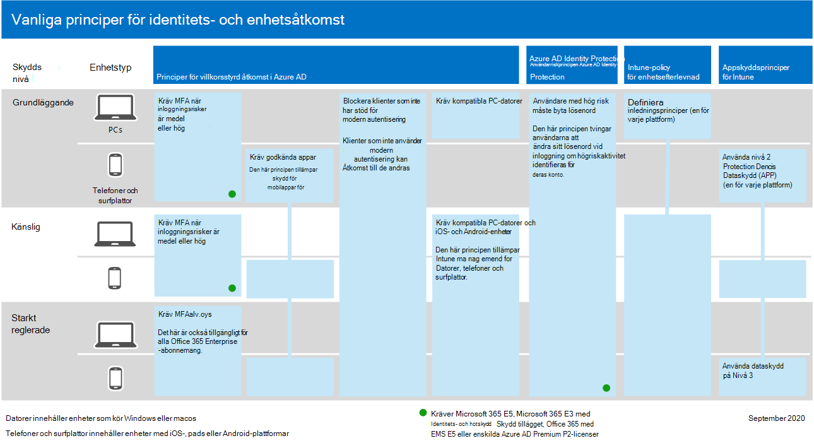

# Konfigurera skyddsfunktioner för hot i Microsoft 365Configure threat protection capabilities across Microsoft 365

Följ dessa steg för att konfigurera skydd mot hot i Microsoft 365.Follow these steps to configure threat protection across Microsoft 365.

## Steg 1: Konfigurera multifaktorautentisering och villkorsstyrd åtkomstStep 1: Set up multi-factor authentication and Conditional Access policies

[Multifaktorautentisering](/azure/active-directory/authentication/concept-mfa-howitworks) (MFA) kräver att användare verifierar sin identitet med ett telefonsamtal eller en autentiseringsapp.[Multi-factor authentication](/azure/active-directory/authentication/concept-mfa-howitworks) (MFA) requires users to verify their identity with a phone call or an authenticator app. [Villkorsstyrda åtkomstprinciper](/azure/active-directory/conditional-access/overview) definierar vissa krav som måste uppfyllas för att användare ska få åtkomst till appar och data i Microsoft 365.[Conditional access policies](/azure/active-directory/conditional-access/overview) define certain requirements that must be met in order for users to access apps and data in Microsoft 365. MFA- och Villkorsstyrd åtkomstpolicy fungerar tillsammans för att skydda organisationen.MFA and Conditional Access policies work together to protect your organization. Om någon till exempel försöker logga in från en mobil enhet med ett konto som inte är aktiverat för MFA, och en princip för villkorsstyrd åtkomst kräver att MFA är aktivt, förhindras användaren från att logga in.For example, if someone attempts to sign in from a mobile device using an account that is not enabled for MFA, and a Conditional Access policy requires MFA to be in effect, that user is prevented from signing in.  

Microsoft har testat och rekommenderar en särskild uppsättning villkorsstyrda åtkomst och relaterade principer för att skydda åtkomsten till alla dina SaaS-program, särskilt Microsoft 365.Microsoft has tested and recommends a specific set of Conditional Access and related policies for protecting access to all of your SaaS applications, especially Microsoft 365. Principer rekommenderas för grundläggande, känslig och starkt reglerad säkerhet.Policies are recommended for baseline, sensitive, and highly regulated protection. Börja med att implementera principer för grundläggande skydd.Begin by implementing the policies for baseline protection. 

 
 [en större version av den här bilden](https://github.com/MicrosoftDocs/microsoft-365-docs/raw/public/microsoft-365/media/microsoft-365-policies-configurations/identity-device-access-policies-byplan.png)
[See a larger version of this image](https://github.com/MicrosoftDocs/microsoft-365-docs/raw/public/microsoft-365/media/microsoft-365-policies-configurations/identity-device-access-policies-byplan.png)

### Så här implementerar du baslinjeskydd för Microsoft 365To implement baseline protection for Microsoft 365

 

1. [Konfigurera krav, inklusive Azure AD Identity Protection.](../security/office-365-security/identity-access-prerequisites.md)[Configure prerequisites, including Azure AD Identity Protection](../security/office-365-security/identity-access-prerequisites.md).
2. [Konfigurera vanliga principer för identitets- och enhetsåtkomst](../security/office-365-security/identity-access-policies.md) för grundläggande skydd.[Configure common identity and device access policies](../security/office-365-security/identity-access-policies.md) for baseline protection.
3. Konfigurera principer för [gästanvändare,](../security/office-365-security/identity-access-policies-guest-access.md) [Microsoft Teams,](../security/office-365-security/teams-access-policies.md) [Exchange Online](../security/office-365-security/secure-email-recommended-policies.md)och [SharePoint Online och OneDrive.](../security/office-365-security/sharepoint-file-access-policies.md)Configure policies for [guest users](../security/office-365-security/identity-access-policies-guest-access.md), [Microsoft Teams](../security/office-365-security/teams-access-policies.md), [Exchange Online](../security/office-365-security/secure-email-recommended-policies.md), and [SharePoint Online and OneDrive](../security/office-365-security/sharepoint-file-access-policies.md).

### Mer information om hur du skyddar identiteterMore information about protecting identities

- [Konfigurationer för identitets- och enhetsåtkomstIdentity and device access configurations](../security/office-365-security/microsoft-365-policies-configurations.md)
- [Säkerhetsvägledning för Azure MFASecurity guidance for Azure MFA](/azure/active-directory/authentication/multi-factor-authentication-security-best-practices)

## Steg 2: Konfigurera Microsoft Defender för identitetStep 2: Configure Microsoft Defender for Identity

[Microsoft Defender för identitet](/defender-for-identity/what-is) är en molnbaserad säkerhetslösning som fungerar med dina lokala AD DS-signaler (Active Directory Domain Services) för att identifiera, identifiera och undersöka avancerade hot, komprometterade identiteter och skadliga Insider-åtgärder i organisationen.[Microsoft Defender for Identity](/defender-for-identity/what-is) is a cloud-based security solution that works with your on-premises Active Directory Domain Services (AD DS) signals to identify, detect, and investigate advanced threats, compromised identities, and malicious insider actions directed at your organization.

Microsoft Defender för identitet aktiverar säkerhetsåtgärder (SecOps) analytiker och säkerhetsexperter som har svårt att identifiera avancerade attacker i hybridmiljöer för att:Microsoft Defender for Identity enables security operations (SecOps) analysts and security professionals struggling to detect advanced attacks in hybrid environments to:
- Övervaka användare, entitetsbeteende och aktiviteter med utbildningsbaserade analyser.Monitor users, entity behavior, and activities with learning-based analytics.
- Skydda användaridentiteter och inloggningsuppgifter som lagras i Active Directory.Protect user identities and credentials stored in Active Directory.
- Identifiera och undersök misstänkta användaraktiviteter och avancerade attacker under alla attackfaserna.Identify and investigate suspicious user activities and advanced attacks throughout the kill chain.
- Ge tydlig information om incidenten på en enkel tidslinje för snabb prioritering.Provide clear incident information on a simple timeline for fast triage.

### Konfigurera Microsoft Defender för identitetTo set up Microsoft Defender for Identity

 

1. [Konfigurera Microsoft Defender för identitet för](/azure-advanced-threat-protection/install-atp-step1) att skydda dina primära miljöer.[Set up Microsoft Defender for Identity](/azure-advanced-threat-protection/install-atp-step1) to protect your primary environments.
2. Skydda alla [domänkontrollanter och](/azure-advanced-threat-protection/atp-sensor-monitoring) [skogar.](/azure-advanced-threat-protection/atp-multi-forest)Protect all your [domain controllers](/azure-advanced-threat-protection/atp-sensor-monitoring) and [forests](/azure-advanced-threat-protection/atp-multi-forest).
3. Integrera [Microsoft Defender för identitetsaviseringar](/azure-advanced-threat-protection/suspicious-activity-guide?tabs=external) i ditt säkerhetsarbetsflöde (SecOps).Integrate [Microsoft Defender for Identity alerts](/azure-advanced-threat-protection/suspicious-activity-guide?tabs=external) into your security operations (SecOps) workflow.

### Mer information om Microsoft Defender för identitetMore information about Microsoft Defender for Identity

- [Vad är Microsoft Defender for Identity?What is Microsoft Defender for Identity?](/azure-advanced-threat-protection/what-is-atp)
- [Video: Introduktion till Microsoft Defender för identitetVideo: Introduction to Microsoft Defender for Identity](https://www.youtube.com/watch?reload=9&v=EGY2m8yU_KE)
- [Distribution av Microsoft Defender för identitetMicrosoft Defender for Identity deployment](/azure-advanced-threat-protection/what-is-atp#whats-next)

## Steg 3: Aktivera Microsoft 365 DefenderStep 3: Turn on Microsoft 365 Defender

[Microsoft 365 Defender](../security/defender/microsoft-365-defender.md) kombinerar signaler och kompetenser funktioner till en enda lösning.[Microsoft 365 Defender](../security/defender/microsoft-365-defender.md) combines signals and orchestrates capabilities into a single solution. Med den integrerade Microsoft 365 Defender-lösningen kan säkerhetsexperter samarbeta om hoten som signalerar att var och en av dessa produkter får och fastställa hotens fullständiga omfattning och påverkan. hur det angavs i miljön, vad det påverkades och hur det för närvarande påverkar organisationen.With the integrated Microsoft 365 Defender solution, security professionals can stitch together the threat signals that each of these products receive and determine the full scope and impact of the threat; how it entered the environment, what it's affected, and how it's currently impacting the organization. Microsoft 365 Defender vidtar automatisk åtgärd för att förhindra eller stoppa attacken och själv berörda postlådor, slutpunkter och användaridentiteter.Microsoft 365 Defender takes automatic action to prevent or stop the attack and self-heal affected mailboxes, endpoints, and user identities.

Microsoft 365 Med Defender kan du skapa enhetliga aviseringar, incidenter, automatisk undersökning och svar och avancerad sökning i olika arbetsbelastningar (Microsoft Defender för identitet, Microsoft Defender för Office 365, Microsoft Defender för slutpunkt och Microsoft Cloud App Security) i ett enda fönster med fönster.Microsoft 365 Defender unifies alerts, incidents, automated investigation and response, and advanced hunting across workloads (Microsoft Defender for Identity, Microsoft Defender for Office 365, Microsoft Defender for Endpoint, and Microsoft Cloud App Security) into a single pane of glass experience. Nya funktioner läggs kontinuerligt till i Microsoft 365 Defender. Överväg att registrera dig för att få förhandsgranskningsfunktioner.New features are added continually to Microsoft 365 Defender; consider opting in to receive preview features.

### Konfigurera Microsoft 365 DefenderTo set up Microsoft 365 Defender

 

1. [Granska förutsättningarna](../security/defender/prerequisites.md).[Review the prerequisites](../security/defender/prerequisites.md).
2. [Aktivera Microsoft 365 Defender](../security/defender/m365d-enable.md).[Turn on Microsoft 365 Defender](../security/defender/m365d-enable.md).
3. [Registrera dig för förhandsgranskningsfunktioner.](../security/defender/preview.md)[Opt in for preview features](../security/defender/preview.md).

### Mer information om Microsoft 365 DefenderMore information about Microsoft 365 Defender

- [Vad är Microsoft 365 Defender?What is Microsoft 365 Defender?](../security/defender/microsoft-365-defender.md)
- [Nyheter i Microsoft 365 DefenderWhat's new in Microsoft 365 Defender](../security/defender/whats-new.md)

## Steg 4: Konfigurera Microsoft Defender för Office 365Step 4: Configure Microsoft Defender for Office 365

[Microsoft Defender för Office 365](../security/office-365-security/defender-for-office-365.md) skyddar organisationen mot skadliga hot i e-postmeddelanden (bifogade filer och URL-adresser), Office dokument och samarbetsverktyg.[Microsoft Defender for Office 365](../security/office-365-security/defender-for-office-365.md) safeguards your organization against malicious threats in email messages (attachments and URLs), Office documents, and collaboration tools. I följande tabell visas Microsoft Defender Office 365 funktioner som ingår i Microsoft 365 E5:The following table lists Microsoft Defender for Office 365 features and capabilities that are included in Microsoft 365 E5:

|Funktioner för konfiguration, skydd och identifieringConfiguration, protection, and detection capabilities|Funktioner för automatisering, undersökning, åtgärder och utbildningAutomation, investigation, remediation, and education capabilities|
|:---|:---|
|[Säkra bifogade filerSafe Attachments](../security/office-365-security/safe-attachments.md) [Säkra länkarSafe Links](../security/office-365-security/safe-links.md) [Säkra dokumentSafe Documents](../security/office-365-security/safe-docs.md) [ATP för SharePoint, OneDrive och Microsoft TeamsATP for SharePoint, OneDrive, and Microsoft Teams](../security/office-365-security/mdo-for-spo-odb-and-teams.md)  [Skydd mot nätfiske i Microsoft 365Anti-phishing protection in Microsoft 365](../security/office-365-security/anti-phishing-protection.md)|[HotspårareThreat Trackers](../security/office-365-security/threat-trackers.md) [HotutforskarenThreat Explorer](../security/office-365-security/threat-explorer.md) [Automatiska undersökningar och svarAutomated investigation and response](../security/office-365-security/office-365-air.md) [AttacksimulatorAttack Simulator](../security/office-365-security/attack-simulator.md)|
|

Med Microsoft Defender för Office 365 kan personer i organisationen kommunicera och samarbeta säkrare, med hotskydd för deras e-postinnehåll och Office dokument.With Microsoft Defender for Office 365, people across your organization can communicate and collaborate more securely, with threat protection for their email content and Office documents.

### Konfigurera Microsoft Defender för Office 365To set up Microsoft Defender for Office 365

 

1. [Konfigurera och konfigurera Microsoft Defender för Office 365 principer.](../security/office-365-security/protect-against-threats.md)[Set up and configure your Microsoft Defender for Office 365 policies](../security/office-365-security/protect-against-threats.md).
2. [Visa och använda Microsoft Defender för Office 365 .](../security/office-365-security/view-reports-for-mdo.md)[View and use your Microsoft Defender for Office 365 reports](../security/office-365-security/view-reports-for-mdo.md).
3. [Använd funktioner för undersökning av hot och svar.](../security/office-365-security/office-365-ti.md)[Use threat investigation and response capabilities](../security/office-365-security/office-365-ti.md).

### Mer information om Microsoft Defender för Office 365More information about Microsoft Defender for Office 365

- [Översikt över Microsoft Defender Office 365 Microsoft DefenderMicrosoft Defender for Office 365 overview](../security/office-365-security/defender-for-office-365.md)
- [Vad är nytt i Microsoft Defender för Office 365What's new in Microsoft Defender for Office 365](../security/office-365-security/whats-new-in-defender-for-office-365.md)

## Steg 5: Konfigurera Microsoft Defender för SlutpunktStep 5: Configure Microsoft Defender for Endpoint

[Microsoft Defender för Slutpunkt](/windows/security/threat-protection) skyddar organisationers enheter (kallas även slutpunkter) från cyberhot, avancerade attacker och databrott.[Microsoft Defender for Endpoint](/windows/security/threat-protection) protects your organizations devices (also referred to as endpoints) from cyberthreats, advanced attacks, and data breaches. Säkerhetsteam kan bli effektivare i hanteringen av säkerheten hos slutpunkterna.Security teams can be more efficient in managing the security of their endpoints. Robusta verktyg hjälper organisationer att hålla koll på program som inte fungerar genom sårbarhetsidentifiering [med hantering av hot och sårbarhet.](/windows/security/threat-protection/microsoft-defender-atp/next-gen-threat-and-vuln-mgt)Robust tools help organizations keep up with unpatched systems using  vulnerability detection with [Threat and Vulnerability management](/windows/security/threat-protection/microsoft-defender-atp/next-gen-threat-and-vuln-mgt). Automatisk identifiering och åtgärder, till exempel minskning av [attackytan,](/windows/security/threat-protection/microsoft-defender-atp/overview-attack-surface-reduction)nästa [generations](/windows/security/threat-protection/windows-defender-antivirus/windows-defender-antivirus-in-windows-10)skydd, [identifiering och åtgärd på slutpunkt](/windows/security/threat-protection/microsoft-defender-atp/overview-endpoint-detection-response)och automatiserad [undersökning](/windows/security/threat-protection/microsoft-defender-atp/automated-investigations) och åtgärd för att skydda dina enheter mot skadlig programvara.Automated detection and remediation capabilities, such as [attack surface reduction](/windows/security/threat-protection/microsoft-defender-atp/overview-attack-surface-reduction), [next-generation protection](/windows/security/threat-protection/windows-defender-antivirus/windows-defender-antivirus-in-windows-10), [endpoint detection and response](/windows/security/threat-protection/microsoft-defender-atp/overview-endpoint-detection-response), and [automated investigation and remediation](/windows/security/threat-protection/microsoft-defender-atp/automated-investigations) help keep your devices safe from malware. Utöver dessa funktioner kan kunder få proaktiva meddelanden och rådgör med Microsoft Hotexperter på begäran, som en del av den avanmälan hanterade servicen.On top of these capabilities, customers can get proactive notifications and consult with Microsoft Threat Experts on demand, as part of the opt-in managed hunting service. 

### Konfigurera Microsoft Defender för SlutpunktSet up Microsoft Defender for Endpoint

 

1. [Förbereda miljön för Microsoft Defender för Slutpunkt](../security/defender-endpoint/deployment-phases.md).[Prepare your environment for Microsoft Defender for Endpoint](../security/defender-endpoint/deployment-phases.md).
2. [Distribuera Microsoft Defender för Slutpunkt](../security/defender-endpoint/production-deployment.md).[Deploy Microsoft Defender for Endpoint](../security/defender-endpoint/production-deployment.md).
3. [Onboard to the Microsoft Defender for Endpoint service](../security/defender-endpoint/onboarding.md).[Onboard to the Microsoft Defender for Endpoint service](../security/defender-endpoint/onboarding.md).
4. [Utför dina viktigaste administrativa uppgifter för säkerhet.](../security/defender-endpoint/tvm-security-recommendation.md)[Complete your top security administrative tasks](../security/defender-endpoint/tvm-security-recommendation.md).

### Mer information om Microsoft Defender för SlutpunktMore information about Microsoft Defender for Endpoint

- [Läs mer om Microsoft Defender för Slutpunkt](../security/defender-endpoint/microsoft-defender-endpoint.md).[Learn more about Microsoft Defender for Endpoint](../security/defender-endpoint/microsoft-defender-endpoint.md).
- [Prova Microsoft Defender för utvärderingslabb för slutpunkt.](../security/defender-endpoint/evaluation-lab.md)[Try the Microsoft Defender for Endpoint evaluation lab](../security/defender-endpoint/evaluation-lab.md).

## Steg 6: Konfigurera Microsoft Cloud App SecurityStep 6: Configure Microsoft Cloud App Security

[Microsoft Cloud App Security](/cloud-app-security) är en cloud Access Security Broker som har stöd för logginsamling, API-anslutningar och omvänd proxy.[Microsoft Cloud App Security](/cloud-app-security) is a Cloud Access Security Broker that supports log collection, API connectors, and reverse proxy. Microsoft Cloud App Security får bra synlighet, kontroll över data färdas och avancerad analys för att identifiera och bekämpa cyberhot i alla dina molntjänster.Microsoft Cloud App Security provides rich visibility, control over data travel, and sophisticated analytics to identify and combat cyberthreats across all your cloud services. Med Microsoft Cloud App Security kan dina säkerhetsåtgärder skydda organisationens känsliga information, skydda mot cyberhot och såser, upptäcka och övervaka appar som har åtkomst till organisationens data och se till att organisationens molnappar uppfyller efterlevnadskraven.With Microsoft Cloud App Security, your security operations can protect your organization's sensitive information, protect against cyberthreats and anomalies, discover and monitor apps that access your organization's data, and help make sure your organization's cloud apps meet compliance requirements.

### Konfigurera Microsoft Cloud App SecuritySet up Microsoft Cloud App Security

 

1. [Konfigurera portalen och andra grundläggande krav.](/cloud-app-security/general-setup)[Set up the portal and other basic requirements](/cloud-app-security/general-setup).
2. [Konfigurera molnidentifiering och](/cloud-app-security/set-up-cloud-discovery) [anslut appar.](/cloud-app-security/enable-instant-visibility-protection-and-governance-actions-for-your-apps)[Set up cloud discovery](/cloud-app-security/set-up-cloud-discovery) and [connect apps](/cloud-app-security/enable-instant-visibility-protection-and-governance-actions-for-your-apps).
3. [Distribuera programkontroll för villkorsstyrd åtkomst för aktuella program](/cloud-app-security/proxy-deployment-aad).[Deploy Conditional Access App Control for featured apps](/cloud-app-security/proxy-deployment-aad).
4. [Använd undersökningsverktygen och instrumentpanelerna](/cloud-app-security/investigate).[Use the investigation tools and dashboards](/cloud-app-security/investigate).

### Mer information om Microsoft Cloud App SecurityMore information about Microsoft Cloud App Security

- [Granska nya funktioner.](/cloud-app-security/release-notes)[Review new features and capabilities](/cloud-app-security/release-notes).
- [Läs mer om Microsoft Cloud App Security](/cloud-app-security/what-is-cloud-app-security).[Learn more about Microsoft Cloud App Security](/cloud-app-security/what-is-cloud-app-security).

## Steg 7: Övervaka status och vidta åtgärderStep 7: Monitor status and take actions

När du har konfigurerat och distribuerat dina skyddstjänster för hot och funktioner är nästa steg att övervaka identifiering av hot och vidta lämpliga åtgärder.After you have set up and deployed your threat protection services and capabilities, your next step is to monitor threat detections, and take appropriate actions. Den bästa utgångspunkten är det Microsoft 365 säkerhetscenter ( ), där du kan övervaka och hantera säkerheten i din [https://security.microsoft.com](https://security.microsoft.com) Microsoft-identitet, data, enheter, appar och infrastruktur.Your best starting point is the Microsoft 365 security center ([https://security.microsoft.com](https://security.microsoft.com)), where you can monitor and managing security across your Microsoft identities, data, devices, apps, and infrastructure. 

Säkerhetscentret Microsoft 365 avsedd för säkerhetsadministratörer och säkerhetsoperationsgrupper.The Microsoft 365 security center is intended for security admins and security operations teams. I Microsoft 365 säkerhetscenter kan du:In the Microsoft 365 security center, you can:
- Visa organisationens övergripande säkerhetshälsa med [Secure Score](/microsoft-365/security/defender/microsoft-secure-score).View the overall security health of your organization with [Secure Score](/microsoft-365/security/defender/microsoft-secure-score).
- [Övervaka och visa rapporter](../security/defender-endpoint/threat-protection-reports.md) om status för identiteter, data, enheter, appar och infrastruktur.[Monitor and view reports](../security/defender-endpoint/threat-protection-reports.md) on the status of your identities, data, devices, apps, and infrastructure.
- Anslut på aviseringar via [incidenter](/microsoft-365/security/defender/incident-queue).Connect the dots on alerts through [incidents](/microsoft-365/security/defender/incident-queue).
- Använd [automatisk undersökning och åtgärd för](../security/defender/m365d-autoir.md) att hantera hot.Use [automated investigation and remediation](../security/defender/m365d-autoir.md) to address threats.
- [Proaktivt leta efter hot, till exempel intrångsförsök](/microsoft-365/security/defender/advanced-hunting-overview)eller intrångsaktivitet som påverkar e-post, data, enheter och identiteter.[Proactively hunt for threats](/microsoft-365/security/defender/advanced-hunting-overview), such as intrusion attempts or breach activity affecting your email, data, devices, and identities.
- [Förstå de senaste attackkampanjerna](/microsoft-365/security/defender/latest-attack-campaigns) och teknikerna med hotanalyser.[Understand the latest attack campaigns](/microsoft-365/security/defender/latest-attack-campaigns) and techniques with threat analytics.
- ... och mycket mer!... and more!

### Mer information om säkerhetscentret Microsoft 365 säkerhetscentretMore information about the Microsoft 365 security center

- [Kom igång med Microsoft 365 Säkerhetscenter.](../security/defender/overview-security-center.md)[Get started with the Microsoft 365 security center](../security/defender/overview-security-center.md).
- [Övervaka och visa rapporter](../security/defender/overview-security-center.md).[Monitor and view reports](../security/defender/overview-security-center.md).
- [Se säkerhetsportalerna i Microsoft 365](../security/defender/portals.md).[See the security portals in Microsoft 365](../security/defender/portals.md).

## Steg 8: Utbilda användareStep 8: Train users

Utbildningsanvändare kan spara dina användare och säkerhetsåtgärder på mycket tid och bli frustrerade.Training users can save your users and security operations team much time and frustration. Smarta användare har mindre chans att öppna bifogade filer eller klicka på länkar i tveksamma e-postmeddelanden, och risken är större att de undviker misstänkta webbplatser.Savvy users are less likely to open attachments or click links in questionable email messages, and they are more likely to avoid suspicious websites. 

Nu finns en handbok om [cybersäkerhet från](https://go.microsoft.com/fwlink/?linkid=2015598&amp;clcid=0x409) Harvard School som ger utmärkt vägledning om att etablera en stark säkerhetskultur inom organisationen, bland annat utbildningsanvändare för att identifiera nätfiskeattacker.The Harvard Kennedy School [Cybersecurity Campaign Handbook](https://go.microsoft.com/fwlink/?linkid=2015598&amp;clcid=0x409) provides excellent guidance on establishing a strong culture of security awareness within your organization, including training users to identify phishing attacks. 

Microsoft 365 följande resurser för att informera användarna i organisationen:Microsoft 365 provides the following resources to help inform users in your organization:

|BegreppConcept  |ResurserResources  |
|---------|---------|
|Microsoft 365Microsoft 365     |[Anpassningsbara utbildningsvägarCustomizable learning pathways](/office365/customlearning/) 
De här resurserna kan hjälpa dig att sätta ihop utbildning för slutanvändarna i organisationenThese resources can help you put together training for end users in your organization        |
|Microsoft 365-säkerhetMicrosoft 365 security |[Utbildningsmodul: Skydda organisationen med inbyggd och intelligent säkerhet från Microsoft 365Learning module: Secure your organization with built-in, intelligent security from Microsoft 365](/learn/modules/security-with-microsoft-365) 
I den här modulen kan du beskriva hur Microsoft 365 fungerar tillsammans och att formulera fördelarna med dessa säkerhetsfunktioner.This module enables you to describe how Microsoft 365 security features work together and to articulate the benefits of these security features. |
|MultifaktorautentiseringMulti-factor authentication     | [Tvåstegsverifiering: Vad är den ytterligare verifieringssidan?Two-step verification: What is the additional verification page?](/azure/active-directory/user-help/multi-factor-authentication-end-user-first-time) 
Den här artikeln hjälper slutanvändarna att förstå vad multifaktorautentisering är och varför det används i organisationen.This article helps end users understand what multi-factor authentication is and why it's being used at your organization.    |

Förutom den här vägledningen rekommenderar Microsoft att dina användare gör som beskrivs i den här artikeln: Skydda ditt konto och dina enheter [från hackare och skadlig programvara.](https://support.office.com/article/066d6216-a56b-4f90-9af3-b3a1e9a327d6.aspx)In addition to this guidance, Microsoft recommends that your users take the actions described in this article: [Protect your account and devices from hackers and malware](https://support.office.com/article/066d6216-a56b-4f90-9af3-b3a1e9a327d6.aspx). Dessa åtgärder omfattar:These actions include:
- Använda starka lösenordUsing strong passwords
- Skydda enheterProtecting devices 
- Aktivera säkerhetsfunktioner på Windows 10 och Mac-datorer (för ohanterade enheter)Enabling security features on Windows 10 and Mac PCs (for unmanaged devices)
    
Microsoft rekommenderar även att användare skyddar sina personliga e-postkonton genom att vidta de åtgärder som rekommenderas i följande artiklar:Microsoft also recommends that users protect their personal email accounts by taking the actions recommended in the following articles:
- [Skydda ditt Outlook.com-kontoHelp protect your Outlook.com email account](https://support.microsoft.com/office/help-protect-your-outlook-com-email-account-a4f20fc5-4307-4ece-8231-6d4d4bd8a9ba)
- [Skydda ditt Gmail-konto med tvåstegsverifieringProtect your Gmail account with 2-step verification](https://go.microsoft.com/fwlink/?linkid=2015688&amp;clcid=0x409)
