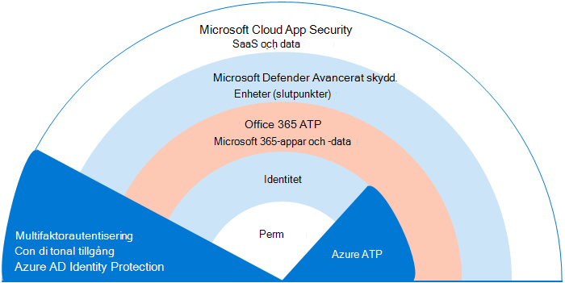
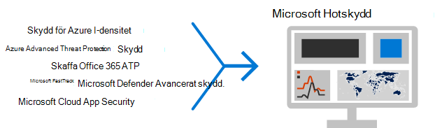
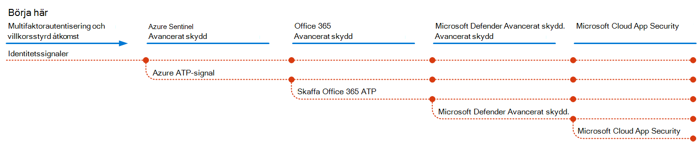
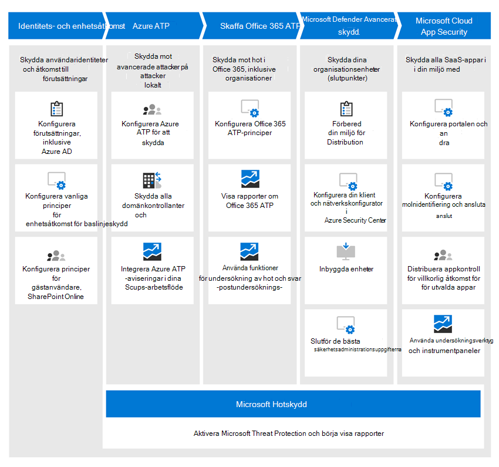

# Distribuera hotskyddsfunktioner i Microsoft 365

[Malware](https://docs.microsoft.com/windows/security/threat-protection/intelligence/understanding-malware), och sofistikerade cyberattacker, såsom [fillösa hot](https://docs.microsoft.com/windows/security/threat-protection/intelligence/fileless-threats), är en vanlig företeelse. Företagen måste skydda sig själva och sina kunder. Sådana attacker kan orsaka stora problem för din organisation, allt från en förlust av förtroende till ekonomiska elände, affärshotande driftstopp och mycket mer. Det är viktigt att skydda mot hot, men det kan vara svårt att avgöra var organisationen ska fokusera tid, ansträngning och resurser. 

Microsofts säkerhetslösningar är inbyggda i våra produkter och tjänster. Automatiserings- och maskininlärningsfunktioner minskar belastningen på dina säkerhetsteam för att se till att rätt objekt åtgärdas. Och styrkan i Microsofts säkerhetslösningar bygger på biljoner signaler som vi bearbetar varje dag i vårt [intelligenta säkerhetsdiagram](https://cloud-platform-assets.azurewebsites.net/intelligent-security-graph). Microsoft 365 säkerhetslösningar inkluderar [Microsoft Threat Protection](https://docs.microsoft.com/microsoft-365/security/mtp/microsoft-threat-protection), en lösning som samlar signaler över din e-post, data, enheter och identiteter för att måla en bild av avancerade hot mot din organisation.

Titta på det här videoklippet om du vill ha en översikt över distributionsprocessen.

> [!VIDEO https://www.microsoft.com/videoplayer/embed/RE4vsI7]

Använd den här artikeln som en guide för att implementera din hotskyddslösning.

## Hotskydd i Microsoft 365 E5

[Med Microsoft 365 E5](https://www.microsoft.com/microsoft-365/enterprise-e5-business-software?activetab=pivot%3aoverviewtab) kan du skydda din organisation med anpassad och inbyggd intelligens. Med hotskyddsfunktionerna i Microsoft 365 E5 kan du identifiera och undersöka avancerade hot, komprometterade identiteter och skadliga åtgärder i dina lokala miljöer och molnmiljöer.

I Microsoft 365 E5 är hotskyddsfunktionerna integrerade som standard. Signaler från varje förmåga ger styrka till den övergripande förmågan att upptäcka och reagera på hot. Den kombinerade uppsättningen funktioner ger det bästa skyddet för organisationer, särskilt multinationella organisationer, jämfört med att köra produkter som inte kommer från Microsoft. Följande bild visar de tjänster och funktioner för hotskydd i Microsoft 365 E5 som beskrivs i den här artikeln.

Så fort du distribuerar någon av de avancerade hotskyddsfunktionerna kan du aktivera Microsoft Threat Protection, som samlar signalerna och data på ett ställe. 

Följande bild visar en rekommenderad sökväg för distribution av dessa enskilda funktioner. 

|Lösning/funktioner  |Beskrivning  |
|---------|---------|
|Multifaktorautentisering och villkorsstyrd åtkomst     |Skydda mot komprometterade identiteter och enheter. Börja med detta skydd eftersom det är grundläggande. Konfigurationen som rekommenderas i den här vägledningen innehåller Azure AD Identity Protection som en förutsättning.     |
|Azure Advanced Threat Protection     |  En molnbaserad säkerhetslösning som utnyttjar dina lokala Active Directory-signaler för att identifiera, identifiera och undersöka avancerade hot, komprometterade identiteter och skadliga insideråtgärder som riktas mot din organisation. Fokusera på detta nästa eftersom det skyddar din on-prem och din molninfrastruktur, har inga beroenden eller förutsättningar och kan ge omedelbar nytta.       | 
|Office 365 Avancerat skydd     | Skyddar din organisation mot skadliga hot från e-postmeddelanden, länkar (webbadresser) och samarbetsverktyg. Skydd för skadlig kod, nätfiske, förfalskning och andra angreppstyper. Detta rekommenderas härnäst eftersom ändringskontroll, migrerande inställningar från det etablerade systemet och andra överväganden kan ta längre tid att distribuera.   Se till att du även konfigurerar hotskyddsfunktionerna som ingår i alla Office 365-prenumerationer (Exchange Online Protection).       |
|Microsoft Defender Avancerat skydd    | En slutpunktsskyddsplattform som hjälper till att förebygga, upptäcka, undersöka och svara på avancerade hot. Detta tar längre tid att distribuera, men kan göras parallellt med de andra funktionerna om andra administratörer är ansvariga.   |
|Microsoft Cloud App Security     |   En molnåtkomstsäkerhetsmäklare för identifiering, undersökning och styrning. Du kan aktivera detta tidigt för att börja samla in data och insikter. Att implementera information och annat riktat skydd i dina SaaS-appar innebär planering och kan ta längre tid.       | 

> [!TIP]
> Organisationer med flera säkerhetsteam kan implementera dessa funktioner parallellt.

## Distribuera din hotskyddslösning

Om du vill vara säker på att din organisation har bästa möjliga skydd konfigurerar och distribuerar du säkerhetslösningen så att den innehåller följande steg:

1. [Ställ in principer för multifaktorautentisering och villkorlig åtkomst](deploy-threat-protection-configure.md#step-1-set-up-multi-factor-authentication-and-conditional-access-policies)
2. [Konfigurera Avancerat hotskydd för Azure](deploy-threat-protection-configure.md#step-2-configure-azure-advanced-threat-protection)
3. [Aktivera Microsoft Hotskydd](deploy-threat-protection-configure.md#step-3-turn-on-microsoft-threat-protection)
4. [Konfigurera avancerat hotskydd för Office 365](deploy-threat-protection-configure.md#step-4-configure-office-365-advanced-threat-protection)
5. [Konfigurera avancerat hotskydd för Microsoft Defender](deploy-threat-protection-configure.md#step-5-configure-microsoft-defender-advanced-threat-protection)
6. [Konfigurera Säkerhet för Microsoft Cloud-appar](deploy-threat-protection-configure.md#step-6-configure-microsoft-cloud-app-security)
7. [Övervaka status och vidta åtgärder](deploy-threat-protection-configure.md#step-7-monitor-status-and-take-actions)
8. [Utbilda användare](deploy-threat-protection-configure.md#step-8-train-users)

Dina hotskyddsfunktioner kan konfigureras parallellt, så om du har flera säkerhetsteam som ansvarar för olika tjänster kan de konfigurera organisationens skyddsfunktioner samtidigt. Följande diagram illustrerar högnivåprocessen för distribution av hotskyddsfunktioner. 

 

