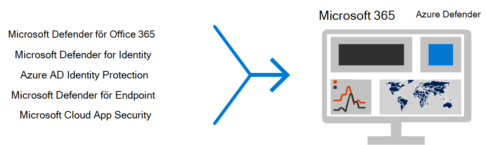
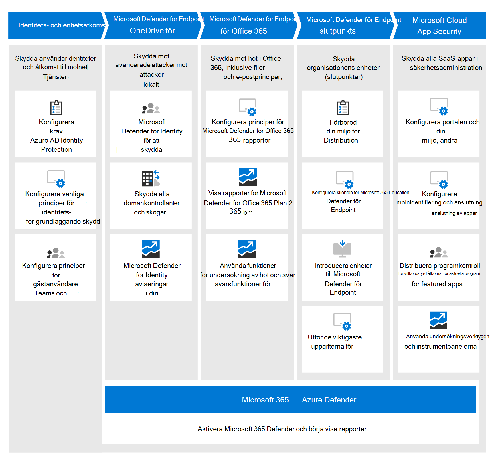

# Distribuera skyddsfunktioner för hot i hela Microsoft 365 E5Deploy threat protection capabilities across Microsoft 365 E5

Den här lösningen beskriver kraftfulla skyddsfunktioner i hela Microsoft 365 E5 förklarar varför skydd mot hot är viktigt.This solution describes powerful threat protection capabilities across Microsoft 365 E5 and explains why threat protection is important. Läs den här artikeln för att få en översikt över skydd mot hot i Microsoft 365 E5 hur du närmar dig konfiguration och konfiguration för din organisation.Read this article to get an overview of threat protection in Microsoft 365 E5 and how to approach setup and configuration for your organization.

## Varför skydd mot hot är viktigtWhy threat protection is important 

[Skadlig](/windows/security/threat-protection/intelligence/understanding-malware)programvara och avancerade cyberattacker, till exempel [fillösa hot,](/windows/security/threat-protection/intelligence/fileless-threats)är vanligt förekommande.[Malware](/windows/security/threat-protection/intelligence/understanding-malware), and sophisticated cyberattacks, such as [fileless threats](/windows/security/threat-protection/intelligence/fileless-threats), are a common occurrence. Företag måste skydda sig själva och sina kunder med effektiva IT-säkerhetsfunktioner.Businesses need to protect themselves and their customers with effective IT security capabilities. Cyberattacker kan orsaka stora problem för organisationen, allt från förlust av förtroende till ekonomiska problem, verksamhetsproblem och mycket mer.Cyberattacks can cause major problems for your organization, ranging from a loss of trust to financial woes, business-threatening downtime, and more. Det är viktigt att skydda mot hot, men det kan vara svårt att avgöra var du ska fokusera organisationens tid, arbete och resurser.Protecting against threats is important, but it can be challenging to determine where to focus your organization's time, effort, and resources. Microsoft 365 E5 kan hjälpa dig.Microsoft 365 E5 can help. 

Microsofts säkerhetslösningar är inbyggda i våra produkter och tjänster.Microsoft security solutions are built into our products and services. Automatiserings- och maskininlärningsfunktionerna minskar belastningen på dina säkerhetsteam för att se till att rätt objekt hanteras.Automation and machine learning capabilities reduce the load on your security teams to make sure the right items are addressed. Och styrkan hos Microsoft-säkerhetslösningar bygger på en lösning av signaler som vi bearbetar varje dag i vårt [intelligenta Graph.](/graph/security-concept-overview)And the strength of Microsoft security solutions is built on trillions of signals we process every day in our [Intelligent Security Graph](/graph/security-concept-overview). Microsoft 365-säkerhetslösningarna ingår [Microsoft 365 Defender](../security/defender/microsoft-365-defender.md), en lösning som sammanför signaler via e-post, data, enheter och identiteter för att måla en bild av avancerade hot mot din organisation.Microsoft 365 security solutions include [Microsoft 365 Defender](../security/defender/microsoft-365-defender.md), a solution that brings together signals across your email, data, devices, and identities to paint a picture of advanced threats against your organization.

Titta på den här videon för att få en översikt över distributionsprocessen.Watch this video for an overview of the deployment process.
  
> [!VIDEO https://www.microsoft.com/videoplayer/embed/RE4vsI7]

## Skydd mot hot i Microsoft 365 E5Threat protection in Microsoft 365 E5

[Microsoft 365 E5](https://www.microsoft.com/microsoft-365/enterprise-e5-business-software?activetab=pivot%3aoverviewtab) hjälper dig att skydda organisationen med anpassningsbar, inbyggd intelligens.[Microsoft 365 E5](https://www.microsoft.com/microsoft-365/enterprise-e5-business-software?activetab=pivot%3aoverviewtab) enables you to protect your organization with adaptive, built-in intelligence. Med funktionerna för skydd mot hot i Microsoft 365 E5 kan du identifiera och undersöka avancerade hot, komprometterade identiteter och skadliga åtgärder i din lokala och molnbaserade miljö.With the threat protection features in Microsoft 365 E5, you can detect and investigate advanced threats, compromised identities, and malicious actions across your on-premises and cloud environment.

I Microsoft 365 E5 är skyddsfunktioner för hot integrerade som standard.In Microsoft 365 E5, threat protection capabilities are integrated by default. Signaler från varje funktion ger en hållfasthet för den övergripande möjligheten att upptäcka och reagera på hot.Signals from each capability add strength to the overall ability to detect and respond to threats. Den kombinerade uppsättningen funktioner ger det bästa skyddet för organisationer, särskilt multinationella organisationer, jämfört med att köra produkter som inte är från Microsoft.The combined set of capabilities offers the best protection for organizations, especially multi-national organizations, compared to running non-Microsoft products. Följande bild visar skyddstjänster för hot och hotfunktioner i Microsoft 365 E5 beskrivs i den här artikeln.The following image depicts the threat protection services and capabilities in Microsoft 365 E5 that are described in this article.

Microsoft 365 Defender samlar signalerna och data till ett [enhetligt Microsoft 365 säkerhetscenter](/microsoft-365/security/defender/overview-security-center).Microsoft 365 Defender brings the signals and data together into a [unified Microsoft 365 security center](/microsoft-365/security/defender/overview-security-center). 

> [!div class="mx-imgBorder"]
> 

I följande bild visas en rekommenderad väg för att distribuera de här enskilda funktionerna.The following illustration depicts a recommended path for deploying these individual capabilities. 

> [!div class="mx-imgBorder"]
> 

|Lösning/funktionerSolution/capabilities  |BeskrivningDescription  |
|---------|---------|
|Multifaktorautentisering och Villkorsstyrd åtkomstMulti-factor authentication and Conditional Access     |Skydda mot komprometterade identiteter och enheter.Protect against compromised identities and devices. Börja med det här skyddet eftersom det är grundligt.Begin with this protection because it's foundational. Den konfiguration som rekommenderas i den här vägledningen inkluderar Azure AD Identity Protection som en förutsättning.The configuration recommended in this guidance includes Azure AD Identity Protection as a prerequisite.     |
|Microsoft Defender for IdentityMicrosoft Defender for Identity     |  En molnbaserad säkerhetslösning som använder dina lokala AD DS-signaler (Active Directory Domain Services) för att identifiera, identifiera och undersöka avancerade hot, komprometterade identiteter och skadliga Insider-åtgärder riktad mot organisationen.A cloud-based security solution that uses your on-premises Active Directory Domain Services (AD DS) signals to identify, detect, and investigate advanced threats, compromised identities, and malicious insider actions directed at your organization. Fokusera sedan på Microsoft Defender för identitet eftersom det skyddar din lokala infrastruktur och molninfrastruktur, har inga beroenden eller krav och kan ge omedelbar säkerhetsfördelar.Focus on Microsoft Defender for Identity next because it protects your on-premises and cloud infrastructure, has no dependencies or prerequisites, and can provide immediate security benefits. | 
|Microsoft Defender för Office 365Microsoft Defender for Office 365     | Skyddar organisationen mot skadliga hot som kan orsakas av e-postmeddelanden, länkar (URL:er) och samarbetsverktyg.Safeguards your organization against malicious threats posed by email messages, links (URLs), and collaboration tools. Skydd mot skadlig programvara, nätfiske, förfalskning och andra attacktyper.Protections for malware, phishing, spoofing, and other attack types. Vi rekommenderar sedan att du Office 365 Microsoft Defender för företag eftersom det kan ta längre tid att distribuera om du ändrar kontrollen, migrerar inställningar från klientsystemet och andra överväganden.Configuring Microsoft Defender for Office 365 is recommended next because change control, migrating settings from incumbent system, and other considerations can take longer to deploy. 
**OBS!** Se till att konfigurera funktionerna för skydd mot hot som ingår i alla Office 365 prenumerationer (Exchange Online Protection).**NOTE**: Make sure to configure the threat protection capabilities that are included in all Office 365 subscriptions (Exchange Online Protection).       |
|Microsoft Defender för EndpointMicrosoft Defender for Endpoint    | En plattform för slutpunktsskydd som hjälper till att förhindra, upptäcka, undersöka och hantera avancerade hot.An endpoint protection platform that helps prevent, detect, investigate, and respond to advanced threats.  Defender för Endpoint kan ta lite tid att distribuera, men konfigurationen kan göras parallellt med andra funktioner.Defender for Endpoint can take some time to deploy, but configuration can be done in parallel with other capabilities.   |
|Microsoft Cloud App SecurityMicrosoft Cloud App Security     |   En säkerhetsförmedlare för molnåtkomst för identifiering, undersökning och styrning.A cloud access security broker for discovery, investigation, and governance. Du kan aktivera Microsoft Cloud App Security tidigt för att börja samla in data och insikter.You can enable Microsoft Cloud App Security early to begin collecting data and insights. Att implementera information och annat riktat skydd i SaaS-apparna innebär planering och kan ta längre tid.Implementing information and other targeted protection across your SaaS apps involves planning and can take more time.       | 

> [!TIP]
> Organisationer som har flera säkerhetsteam kan implementera dessa funktioner parallellt.Organizations who have multiple security teams can implement these capabilities in parallel. 

## Planera att distribuera din lösning för hotskyddPlan to deploy your threat protection solution

I följande diagram visas en översiktsprocess för distribution av skyddsfunktioner mot hot.The following diagram illustrates the high-level process for deploying threat protection capabilities. 

Se till att din organisation har bästa möjliga skydd genom att konfigurera och distribuera din säkerhetslösning med en process som innehåller följande steg:To make sure your organization has the best protection possible, set up and deploy your security solution with a process that includes the following steps:

1. [Konfigurera principer för multifaktorautentisering och Villkorsstyrd åtkomst.](deploy-threat-protection-configure.md#step-1-set-up-multi-factor-authentication-and-conditional-access-policies)[Set up multi-factor authentication and Conditional Access policies](deploy-threat-protection-configure.md#step-1-set-up-multi-factor-authentication-and-conditional-access-policies).
2. [Konfigurera Microsoft Defender för identitet](deploy-threat-protection-configure.md#step-2-configure-microsoft-defender-for-identity).[Configure Microsoft Defender for Identity](deploy-threat-protection-configure.md#step-2-configure-microsoft-defender-for-identity).
3. [Aktivera Microsoft 365 Defender](deploy-threat-protection-configure.md#step-3-turn-on-microsoft-365-defender).[Turn on Microsoft 365 Defender](deploy-threat-protection-configure.md#step-3-turn-on-microsoft-365-defender).
4. [Konfigurera Defender för Office 365](deploy-threat-protection-configure.md#step-4-configure-microsoft-defender-for-office-365).[Configure Defender for Office 365](deploy-threat-protection-configure.md#step-4-configure-microsoft-defender-for-office-365).
5. [Konfigurera Microsoft Defender för Slutpunkt](deploy-threat-protection-configure.md#step-5-configure-microsoft-defender-for-endpoint).[Configure Microsoft Defender for Endpoint](deploy-threat-protection-configure.md#step-5-configure-microsoft-defender-for-endpoint).
6. [Konfigurera Microsoft Cloud App Security](deploy-threat-protection-configure.md#step-6-configure-microsoft-cloud-app-security).[Configure Microsoft Cloud App Security](deploy-threat-protection-configure.md#step-6-configure-microsoft-cloud-app-security).
7. [Övervaka status och vidta åtgärder](deploy-threat-protection-configure.md#step-7-monitor-status-and-take-actions).[Monitor status and take actions](deploy-threat-protection-configure.md#step-7-monitor-status-and-take-actions).
8. [Utbilda användare](deploy-threat-protection-configure.md#step-8-train-users).[Train users](deploy-threat-protection-configure.md#step-8-train-users).

Dina skyddsfunktioner för hot kan konfigureras parallellt, så om du har flera nätverkssäkerhetsgrupper som ansvarar för olika tjänster kan de konfigurera din organisations skyddsfunktioner samtidigt.Your threat protection features can be configured in parallel, so if you have multiple network security teams responsible for different services, they can configure your organization’s protection features at the same time.

## Nästa stegNext step

Fortsätt till [Konfigurera skyddsfunktioner för hot i hela Microsoft 365.](deploy-threat-protection-configure.md)Continue to [Configure threat protection capabilities across Microsoft 365](deploy-threat-protection-configure.md).

