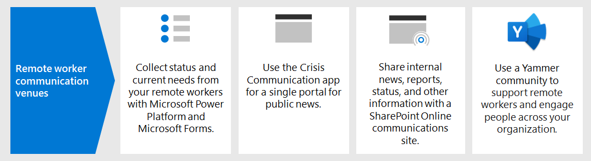

# Steg 5: skapa COVID-19 kriskommunikationsplatserStep 5: Create COVID-19 crisis communication venues

Det finns många sätt du kan tillhandahålla fler kommunikationsplatser för att uppfylla de unika kraven för COVID-19-krisen, inklusive:There are many ways you can provide additional communication venues to serve the unique requirements of the COVID-19 crisis, including:

- Undersökningar för anställdaEmployee surveys
- Förstärkt offentlig sjukvård och nyheter i en enda portalConsolidated public health and news into a single portal
- Skapa en kommunikationswebbplats i SharePoint OnlineA communications site in SharePoint Online
- En Yammer-communityA Yammer community

## Undersökningar för anställdaEmployee surveys

[Microsoft Power Platform](https://powerplatform.microsoft.com/), t. ex. Power Automate och Power Apps kan användas för att kommunicera med distansarbetare på flera olika sätt.The [Microsoft Power Platform](https://powerplatform.microsoft.com/), including Power Automate and Power Apps, can be used to communicate with remote workers in a number of ways. Exempelvis kan [Microsoft Forms](https://forms.microsoft.com/) användas för undersökning av dina distansarbetare och fastställa följande:For example, [Microsoft Forms](https://forms.microsoft.com/) can be used to survey your remote workers and determine:

- Vilka enheter som användare har hemma och deras typ och plattform.What devices users have at home and their type and platform.
- Om användarna har kapabel internettillgång hemma.If users have capable Internet capability at home.
- Om tunna klienter eller Skrivbords- och programvirtualisering kan användas för distansarbetare.If thin clients or desktop and app virtualization can be leveraged for remote workers.
- Om ytterligare användarutbildning kan behövas för scenarier för distansarbetare.If additional user training is needed for remote work scenarios.
- Om det finns blockerare för att aktivera distansarbete.If there are any blockers to enabling remote work.

## Intern portal för förstärkt offentlig sjukvård och nyheterInternal portal for consolidated public health and news

Det kostnadsfria [Kriskommunikationsprogrammet](https://techcommunity.microsoft.com/t5/microsoft-teams-blog/coordinate-crisis-communications-using-microsoft-teams-power/ba-p/1216715) kan användas för att ge användarna en enda portal för att se till att de är utrustade med rekommendationer från globala hälsomyndigheter, ämnesspecifika världsnyheter, den senaste informationen från myndighetstjänstemän och experter och företagsspecifikt innehåll, inklusive relevanta kontakter, företagsnyheter och länkar till supportkanaler.The free [Crisis Communication app](https://techcommunity.microsoft.com/t5/microsoft-teams-blog/coordinate-crisis-communications-using-microsoft-teams-power/ba-p/1216715) can be used to provide your users with a single portal to help ensure they are equipped with recommendations from global health authorities, topical world news, the latest information from government officials and experts, and company-specific content including relevant contacts, company news, and links to support channels. 

Användare kan också dela sin status (till exempel att arbeta hemifrån eller utanför kontoret) med sina medarbetare och automatiskt skicka hjälpförfrågningar till en särskild kanal i Teams.Users can also share their status (such as working from home or out of the office) with their teammates, and automatically send help requests to a dedicated channel in Teams.

## SharePoint Online – kommunikationswebbplatsSharePoint Online communications site

Ett annat alternativ för kommunikation mellan hela organisationen är en webbplats för krishantering i SharePoint.Another option for organization-wide communication is a crisis management site in SharePoint. Det här är en SharePoint-kommunikationswebbplats som du kan använda för att dela nyheter, rapporter, status och annan information i ett visuellt tilltalande format.This is effectively a SharePoint communication site that you can use to share news, reports, status, and other information in a visually compelling format. 

Kommunikationswebbplatser är tillgängliga och kan visas var som helst på valfri enhet.Communication sites are responsive and can be viewed from anywhere on any device. Du kan konfigurera en förkonfigurerad webbplats för krishantering med [den här boken för utformning i SharePoint](https://lookbook.microsoft.com/details/8f8337d2-b1f6-4a84-91a4-9081f841f0f6) eller så kan du följa [de här stegen](https://techcommunity.microsoft.com/t5/microsoft-sharepoint-blog/build-a-crisis-management-site-to-connect-people-and-information/ba-p/1216791) för att ha en Live-webbplats igång inom 2 timmar.You can provision a pre-configured crisis management site using [this SharePoint look book design](https://lookbook.microsoft.com/details/8f8337d2-b1f6-4a84-91a4-9081f841f0f6), or you can follow [these steps](https://techcommunity.microsoft.com/t5/microsoft-sharepoint-blog/build-a-crisis-management-site-to-connect-people-and-information/ba-p/1216791) to have a live site up and running within 2 hours.

## Yammer-communityYammer community

[Yammer](https://docs.microsoft.com/yammer/yammer-landing-page)-communitys kan också användas för att stödja distansarbete och engagera personer i hela organisationen.[Yammer](https://docs.microsoft.com/yammer/yammer-landing-page) communities can also be used to support remote work and engage people across the organization. Communitys kan ansluta personer mellan organisations- och geografiska silor.Communities connect people across organizational and geographic silos. Det är viktigt att ge folk en gemensam plats för att samla in och dela erfarenheter i en community som gör det enklare för personer att lösa en utmaning.It’s important to give people a common place to gather and to share experience in a community that brings people together to address a challenge. Ledare och medlemmar kan:Leaders and members can:

- **Dela meddelanden med skala.****Share announcements at scale.** En community tillhandahåller en förstärk kanal för kommunikation.A community provides a consolidated channel for communication. Ett meddelande når medlemmar med webbaviseringar, på mobila enheter och e-post.An announcement reaches members with notifications web, on mobile and in email. Gemenskapen främjar snabb delning av information som kan kringgå flaskhalsar i företaget, även när de kommer från officiella kanaler.The community promotes quick sharing of information that can bypass corporate bottlenecks even when coming from official channels.
- **Dela kunskaper.****Share knowledge.** I en community får personer ett enda och snabbt sätt att ställa frågor och få svar.A community provides a one-stop-shop for people to ask questions and get answers. Delade kunskaper är sökbara och kan upptäckas, så att andra kan hitta viktig information.Knowledge shared is searchable and discoverable, enabling others to find important information.
- **Förstå personernas behov.****Understand people’s needs.** Organisationer kan använda omröstningar och för att få djupare insikter om anställda och deras behov, som i sin tur accelererar utvecklingen och leveransen av kommunikation och lösningar som löser dessa behov.Organizations can use polls and can monitor the conversation to gain deeper insights about employees and their needs, which in turn accelerates the development and delivery of communications and solutions that address those needs.
- **Nå och engagera distansarbetare var de än är.****Reach and engage remote workers wherever they are.** Ledare kan även utföra händelser live eller på begäran, leverera viktiga meddelanden och få svar på frågor i communityn.Leaders can even conduct live and on-demand events, to broadcast important messages and to answer questions of the community.
- **Berömma och erkänna bidrag.****Empower and recognize contribution.** Community-medlemmar kan vara aktiva deltagare, bidra idéer, färdigheter och erfarenhet som kan bli en del av lösningen.Community members can be active participants, contributing ideas, skills, and experience to be part of the solution. Beröm kan användas för att identifiera utmärkelser och bidrag när communityn arbetar sig igenom utmaningarna de stöter på.Praise can be used to recognize achievements and contribution as the community works through the challenges it faces.

## Tekniska administrationsresurser för COVID-19 kriskommunikationerAdmin technical resources for COVID-19 crisis communications

- [Konfigurera och lär dig mer om exempelmallen för kriskommunikation i Power AppsSet up and learn about the Crisis Communication sample template in Power Apps](https://docs.microsoft.com/powerapps/maker/canvas-apps/sample-crisis-communication-app)
- [Hålla anställda informerade och engagerade under svåra tiderKeeping employees informed and engaged during difficult times](https://techcommunity.microsoft.com/t5/yammer-blog/keeping-employees-informed-and-engaged-during-difficult-times/ba-p/1216032)
- [Skapa en webbplats för krishantering för att koppla personer och informationBuild a crisis management site to connect people and information](https://techcommunity.microsoft.com/t5/microsoft-sharepoint-blog/build-a-crisis-management-site-to-connect-people-and-information/ba-p/1216791)
- [sju tips för att köra en fungerande Yammer-community7 Tips to Run a Successful Yammer Community](https://techcommunity.microsoft.com/t5/yammer-blog/7-tips-to-run-a-successful-yammer-community-formerly-group/ba-p/444720)

## Resultat av steg 5Results of Step 5

Om du vill hålla personalen informerad om organisationens fortlöpande svar på COVID-19 krisen och ge dem möjlighet att kommunicera och dela med sig av ärenden och feedback, använder du efter behov:To keep your employees informed of your organization's ongoing response to the COVID-19 crisis and to allow them to communicate and share their issues and feedback, you are using as needed:

- Undersökningar för anställdaEmployee surveys
- Förstärkt offentlig sjukvård och nyheter på en enda portalConsolidated public health and news in a single portal
- Skapa en kommunikationswebbplats i SharePoint OnlineA communications site in SharePoint Online
- En Yammer-communityA Yammer community

## Nästa stegNext step

Fortsätt med [Steg 6](empower-people-to-work-remotely-train-monitor-usage.md) om du vill ha anvisningar om hur du tränar användarna och övervakar deras feedback.Continue with [Step 6](empower-people-to-work-remotely-train-monitor-usage.md) for advice on how to train your users and monitor their feedback.
