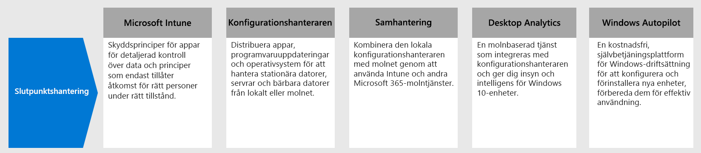

# Steg 4.Step 4. Distribuera slutpunktshantering för enheter, datorer och andra slutpunkterDeploy endpoint management for your devices, PCs, and other endpoints

Med distansarbetare måste du ha stöd för ett ökande antal personliga enheter.With remote workers, you need to support a growing number of personal devices. Slutpunktshantering är en principbaserad metod för säkerhet som kräver att enheter följer specifika villkor innan de beviljas åtkomst till resurser.Endpoint management is a policy-based approach to security that requires devices to comply with specific criteria before they are granted access to resources. Microsoft Endpoint Manager tillhandahåller moderna hanteringsfunktioner för att skydda dina data i molnet och lokalt.Microsoft Endpoint Manager delivers modern management capabilities to keep your data secure in the cloud and on-premises. 

Microsoft Endpoint Manager tillhandhåller tjänster och verktyg för hantering av mobila enheter, stationära datorer, virtuella datorer, inbäddade enheter och servrar genom att kombinera följande tjänster som du kanske redan känner till och använder.Endpoint Manager provides services and tools for managing mobile devices, desktop computers, virtual machines, embedded devices, and servers by combining the following services you may already know and be using.

## Microsoft IntuneMicrosoft Intune

Microsoft Intune är en molnbaserad tjänst som fokuserar på hantering av mobila enheter (MDM) och hantering av mobila program (MAM) som ingår i Microsoft 365.Microsoft Intune is a cloud-based service that focuses on mobile device management (MDM) and mobile application management (MAM) that is included with Microsoft 365. 

- **MDM:** för enheter som ägs av organisationen kan du utnyttja fullständig kontroll, t. ex. inställningar, funktioner och säkerhet.**MDM:** For organization-owned devices, you can exercise full control including settings, features, and security. Enheter "registreras" i Intune där de får Intune-principer med regler och inställningar.Devices are "enrolled" in Intune where they receive Intune policies with rules and settings. Du kan till exempel ange krav på lösenord och PIN-kod, skapa en VPN-anslutning, konfigurera skydd med hot och mycket mer.For example, you can set password and PIN requirements, create a VPN connection, set up threat protection, and more.

- **MAM:** distansmedarbetare kanske inte vill att du ska ha fullständig kontroll över deras personliga enheter, även kallat bring-your-own device (BYOD).**MAM:** Remote workers might not want you to have full control on their personal devices, also known as bring-your-own device (BYOD) devices. Du kan erbjuda dina distansmedarbetare alternativ och fortfarande skydda din organisation.You can give your remote workers options and still protect your organization. Distansmedarbetare kan till exempel registrera sina enheter om de vill ha full tillgång till organisationens resurser.For example, remote workers can enroll their devices if they want full access to your organization resources. Om de här användarna bara vill ha tillgång till e-post eller Microsoft Teams kan du använda skyddsprinciper för appar som kräver multifaktorautentisering (MFA) för att använda de här apparna.Or, if these users only want access to email or Microsoft Teams, then use app protection policies that require multi-factor authentication (MFA) to use these apps.

Mer information finns i det här [översikt över Microsoft Intune](https://docs.microsoft.com/intune/fundamentals/what-is-intune).For more information, see this [overview of Microsoft Intune](https://docs.microsoft.com/intune/fundamentals/what-is-intune).

## Configuration ManagerConfiguration Manager

Configuration Manager är en lokal hanteringslösning för hantering av stationära datorer, servrar och bärbara datorer som finns på nätverket eller är internet-baserade.Configuration Manager is an on-premises management solution to manage desktops, servers, and laptops that are on your network or internet-based. Använd Configuration Manager för att distribuera appar, programvaruuppdateringar och operativ system.Use Configuration Manager to deploy apps, software updates, and operating systems. Du kan också övervaka efterlevnad, läsa och åtgärda klienter i realtid och mycket mer.You can also monitor compliance, query and act on clients in real time, and much more. Du kan moln-aktivera den för att integrera med Intune, Azure Active Directory, Microsoft Defender Avancerat skydd och andra molntjänster.You can cloud-enable it to integrate with Intune, Azure AD, Microsoft Defender ATP, and other cloud services. 

Mer information finns i den här [översikt över Configuration Manager](https://docs.microsoft.com/mem/configmgr/core/understand/introduction).For more information, see this [overview of Configuration Manager](https://docs.microsoft.com/mem/configmgr/core/understand/introduction).

## SamhanteringCo-management

Med hjälp av samhantering slås din befintliga lokala investeringar i Configuration Manager med molnet med hjälp av Intune och andra Microsoft 365-molntjänster.Co-management combines your existing on-premises Configuration Manager investment with the cloud using Intune and other Microsoft 365 cloud services. Du kan välja om Configuration Manager eller Intune ska vara hanteringsauktoritet för olika arbetsbelastning.You choose whether Configuration Manager or Intune is the management authority for different workload. 

I Co-Management används Intune-baserade molnfunktioner, t. ex. villkorlig åtkomst och framtvingande av enhetskompatibilitet.Co-management uses Intune-based cloud features, including Conditional Access and enforcing device compliance. Du har kvar några uppgifter lokalt medan du kör andra uppgifter i molnet.You keep some tasks on-premises, while running other tasks in the cloud.

Mer information finns i den här [översikt över samhantering](https://docs.microsoft.com/mem/configmgr/comanage/overview).For more information, see this [overview of co-management](https://docs.microsoft.com/mem/configmgr/comanage/overview).

## Desktop AnalyticsDesktop Analytics

Desktop Analytics är en molnbaserad tjänst som integreras med Configuration Manager och ger dig insyn och intelligens så att du kan fatta välgrundade beslut om dina Windows-klienter.Desktop Analytics is a cloud-based service that integrates with Configuration Manager and provides you with insight and intelligence so you can make informed decisions about your Windows clients. Den kombinerar data från din organisation med data aggregerade från miljontals enheter som är anslutna till Microsofts molntjänster.It combines data from your organization with data aggregated from millions of devices connected to Microsoft cloud services. 

Med Desktop Analytics kan du:With Desktop Analytics, you can:

- Skapa en inventering av appar som körs i din organisation.Create an inventory of apps running in your organization.
- Utvärdera apparnas kompatibilitet med de senaste funktionsuppdateringarna för Windows 10.Assess app compatibility with the latest Windows 10 feature updates.
- Identifiera kompatibilitetsproblem och få förslag på problem med hjälp av molnbaserade datainsikter.Identify compatibility issues, and receive mitigation suggestions based on cloud-enabled data insights.
- Skapa pilotgrupper som representerar hela programmet och fastigheten i en minimal uppsättning enheter.Create pilot groups that represent the entire application and driver estate across a minimal set of devices.
- Distribuera Windows 10 till pilotprojekt och Production Managed-enheter.Deploy Windows 10 to pilot and production-managed devices.

Mer information finns i den här [översikt över Desktop Analytics](https://docs.microsoft.com/mem/configmgr/desktop-analytics/overview)For more information, see this [overview of Desktop Analytics](https://docs.microsoft.com/mem/configmgr/desktop-analytics/overview)

## Windows AutopilotWindows Autopilot

Windows Autopilot är en plattform för Windows-driftsättning med låg vikt.Windows Autopilot is a zero-touch, self-service Windows deployment platform. Den innehåller en samling tekniker som används för att konfigurera och förinstallera nya enheter och för att förbereda för effektiv användning.It includes a collection of technologies used to set up and pre-configure new devices, getting them ready for productive use. Du kan också använda Windows Autopilot för att återställa, återanvända enheter.You can also use Windows Autopilot to reset, repurpose and recover devices. 

Windows Autopilot låter IT-avdelningen förkonfigurera enheter med liten till ingen infrastruktur för hantering, med en process som är enkel och lätt.Windows Autopilot enables an IT department to pre-configure devices with little to no infrastructure to manage, with a process that's easy and simple. 

- Från användarens perspektiv är det bara några få enkla åtgärder för att göra deras enhet redo för användning.From the user's perspective, it only takes a few simple operations to make their device ready to use. 
- Från IT-proffsens perspektiv är den enda interaktion som krävs för slutanvändarna att ansluta till ett nätverk och för att verifiera deras autentiseringsuppgifter.From the IT pro's perspective, the only interaction required from the end user is to connect to a network and to verify their credentials.

Mer information finns i den här [översikt över Windows Autopilot](https://docs.microsoft.com/windows/deployment/windows-autopilot/windows-autopilot).For more information, see this [overview of Windows Autopilot](https://docs.microsoft.com/windows/deployment/windows-autopilot/windows-autopilot).

## Tekniska IT-resurser för slutpunktshanteringAdmin technical resources for endpoint management

- [Del 3-video om hur man hanterar Windows 10-enheter vid distansarbeteThe Part 3 video on managing Windows 10 devices for remote workers](https://resources.techcommunity.microsoft.com/enabling-remote-work/#security)
- [Del 5-video om hur man hanterar användares skrivbord och webbläsare vid distansarbeteThe Part 5 video on managing user desktops and browsers for remote workers](https://resources.techcommunity.microsoft.com/enabling-remote-work/#security)
- [Distribuera en infrastruktur för rörlighet med Microsoft 365Deploy a mobility infrastructure for Microsoft 365](https://docs.microsoft.com/microsoft-365/enterprise/mobility-infrastructure)
- [Registrera olika typer av enheter för hantering av mobila enheterHow to enroll different types of devices for mobile device management](https://docs.microsoft.com/mem/intune/enrollment/device-enrollment)
- [Hur du utbildar dina slutanvändare om Microsoft IntuneHow to educate your end users about Microsoft Intune](https://docs.microsoft.com/mem/intune/fundamentals/end-user-educate)
 
## Resultat i steg 3Results of Step 3

Du använder paketet med Endpoint Manager-funktioner och -förmågor för att hantera mobila enheter, stationära datorer, virtuella datorer, inbäddade enheter och servrar.You are using the suite of Endpoint Manager features and capabilities to manage mobile devices, desktop computers, virtual machines, embedded devices, and servers.

## Nästa stegNext step

Fortsätt med [Steg 5](empower-people-to-work-remotely-teams-productivity-apps.md) för att få dina distansmedarbetare att använda Microsoft 365 produktivitetsappar som Microsoft Teams.Continue with [Step 5](empower-people-to-work-remotely-teams-productivity-apps.md) to get your remote workers using Microsoft 365 productivity apps such as Microsoft Teams.
