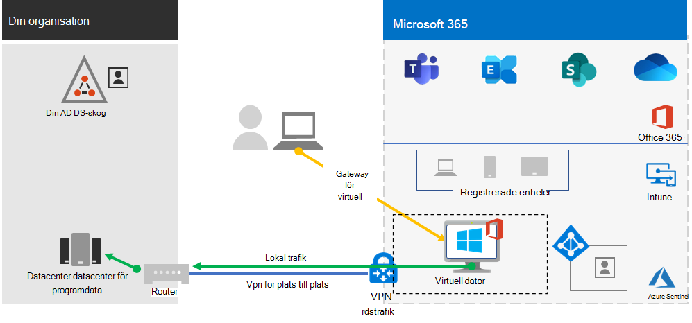
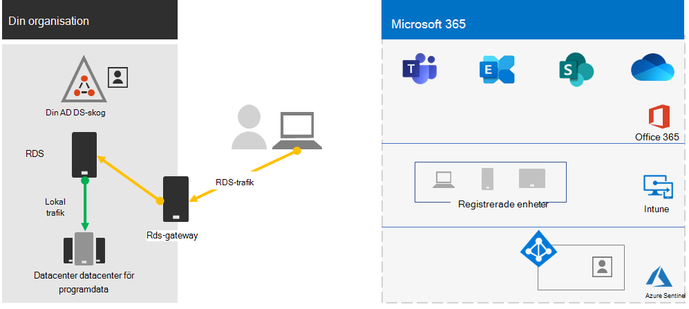
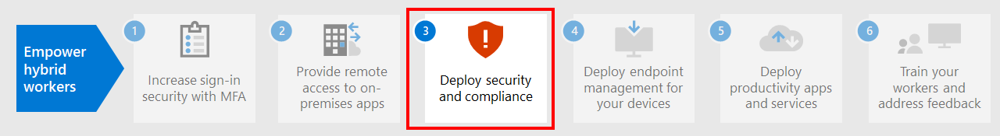

# Steg 2.Step 2. Tillhandahålla fjärråtkomst till lokala appar och tjänsterProvide remote access to on-premises apps and services

Användarna använda VPN-anslutningarna för fjärråtkomst för att komma åt lokala appar och servrar om din organisation använder en VPN-lösning för fjärråtkomst, oftast med VPN-servrar på kanten av ditt nätverk och VPN-klienter som är installerade på användarnas enheter.If your organization uses a remote access VPN solution, typically with VPN servers on the edge of your network and VPN clients installed on your users' devices, your users can use remote access VPN connections to access on-premises apps and servers. Men du kan behöva optimera trafik för molnbaserade Microsoft 365-tjänster.But you may need to optimize traffic to Microsoft 365 cloud-based services.

Om dina användare inte använder en VPN-lösning kan du med hjälp av Azure Active Directory (Azure AD) Application Proxy och Azure Point-to-Site (P2S) VPN för att ge åtkomst, beroende på om alla dina appar är webbaserade.If your users do not use a VPN solution, you can use Azure Active Directory (Azure AD) Application Proxy and Azure Point-to-Site (P2S) VPN to provide access, depending on whether all your apps are web-based.

Här beskrivs de primära konfigurationerna för fjärråtkomst:Here are the primary configurations for remote access:

- Du använder redan en VPN-lösning för fjärråtkomst.You are already using a remote access VPN solution.
- Du använder inte en VPN-lösning för fjärråtkomst och du vill att dina distansarbetare ska använda sina egna datorer.You are not using a remote access VPN solution and you want your remote workers to use their personal computers.
- Du använder inte en VPN-lösning för fjärråtkomst, men du har en hybrididentitet och du behöver endast fjärråtkomst till lokala webbaserade appar.You are not using a remote access VPN solution, you have hybrid identity, and you need remote access only to on-premises web-based apps.
- Du använder inte en VPN-lösning för fjärråtkomst och du behöver åtkomst till lokala appar, varav några inte är webbaserade.You are not using a remote access VPN solution and you need access to on-premises apps, some of which are not web-based.

Se det här flödesschemat för konfigurationsalternativen för fjärråtkomst som beskrivs i den här artikeln.See this flowchart for the remote access configuration options discussed in this article.

Med fjärråtkomstanslutningar kan du även använda [Remote Desktop](https://support.microsoft.com/help/4028379/windows-10-how-to-use-remote-desktop) för att ansluta dina användare till en lokal dator.With remote access connections, you can also use [Remote Desktop](https://support.microsoft.com/help/4028379/windows-10-how-to-use-remote-desktop) to connect your users to an on-premises PC. Distansarbetare kan till exempel använda Remote Desktop för att ansluta till sina datorer på kontoret från sina Windows-, iOS- eller Android-enheter.For example, a remote worker can use Remote Desktop to connect to the PC in their office from their Windows, iOS, or Android device. När de har fjärranslutit kan de använda den som om de satt framför den.Once they are remotely connected, they can use it as if they were sitting in front of it.

## Optimera prestanda för VPN-klienter för fjärråtkomst till Microsoft 365-molntjänsterOptimize performance for remote access VPN clients to Microsoft 365 cloud services

Om din distansarbetare använder en traditionell VPN-klient för att få fjärråtkomst till organisationens nätverk ska du kontrollera att VPN-klienten har stöd för delad tunnel.If your remote workers are using a traditional VPN client to obtain remote access to your organization network, verify that the VPN client has split tunneling support.

Utan delad tunnel skickas all din fjärrtrafik över VPN-anslutningen, där den måste vidarebefordras till organisationens gränsenheter, bli processad och sedan skickas via Internet.Without split tunneling, all of your remote work traffic gets sent across the VPN connection, where it must be forwarded to your organization’s edge devices, get processed, and then sent on the Internet.

Microsoft 365-trafik måste ta en indirekt väg genom din organisation, som kan vidarebefordras till en Microsoft-nätverksingångspunkt långt ifrån VPN-klientens fysiska plats.Microsoft 365 traffic must take an indirect route through your organization, which could be forwarded to a Microsoft network entry point far away from the VPN client’s physical location. Denna indirekta väg lägger till en fördröjning för nätverkstrafiken och minskar prestandan.This indirect path adds latency to the network traffic and decreases overall performance. 

Med delad tunnel kan du konfigurera VPN-klienten så att den exkluderar vissa typer av trafik som inte skickas via VPN-anslutningen till organisationens nätverk.With split tunneling, you can configure your VPN client to exclude specific types of traffic from being sent over the VPN connection to the organization network.

Om du vill optimera åtkomst till Microsoft 365 molnresurser konfigurerar du VPN-klienter för uppdelad tunnel för att undanta trafik till **optimera** kategori Microsoft 365-slutpunkter över VPN-anslutningen.To optimize access to Microsoft 365 cloud resources, configure your split tunneling VPN clients to exclude traffic to the **Optimize** category Microsoft 365 endpoints over the VPN connection. Mer information finns i [Office 365-slutpunktskategorier](../enterprise/microsoft-365-network-connectivity-principles.md#new-office-365-endpoint-categories).For more information, see [Office 365 endpoint categories](../enterprise/microsoft-365-network-connectivity-principles.md#new-office-365-endpoint-categories). Se listan över Optimera kategorislutpunkter [här](../enterprise/urls-and-ip-address-ranges.md).See [this list](../enterprise/urls-and-ip-address-ranges.md) of Optimize category endpoints.

Här är det resulterande trafikflödet, där den mesta trafiken till Microsoft 365-molnappar kringgår VPN-anslutningen.Here is the resulting traffic flow, in which most of the traffic to Microsoft 365 cloud apps bypass the VPN connection.

Detta gör att VPN-klienten kan skicka och ta emot viktig trafik i Microsoft 365 molntjänster direkt via Internet och till närmaste startpunkt i Microsoft-nätverket.This allows the VPN client to send and receive crucial Microsoft 365 cloud service traffic directly over the Internet and to the nearest entry point into the Microsoft network.

Detaljerad information finn i [Optimera Office 365-anslutning för fjärranvändare med delad VPN-tunnel](../enterprise/microsoft-365-vpn-split-tunnel.md).For more information and guidance, see [Optimize Office 365 connectivity for remote users using VPN split tunneling](../enterprise/microsoft-365-vpn-split-tunnel.md).

## Distribuera fjärråtkomst när alla dina appar är webbprogram och du har en hybrididentitetDeploy remote access when all your apps are web apps and you have hybrid identity

Om dina distansarbetare inte använder en traditionell VPN-klient och dina lokala användarkonton och -grupper är synkroniserade med Azure AD, kan du använda Azure AD Application Proxy för att tillhandahålla säker fjärråtkomst för webbaserade program som finns på lokala servrar.If your remote workers are not using a traditional VPN client and your on-premises user accounts and groups are synchronized with Azure AD, you can use Azure AD Application Proxy to provide secure remote access for web-based applications hosted on on-premises servers. Webbaserade program är SharePoint Server-webbplatser, Outlook Web Access-servrar eller andra webbaserade affärsprogram.Web-based applications include SharePoint Server sites, Outlook Web Access servers, or any other web-based line of business applications. 

Här är komponenterna i Azure Active Directory Application Proxy.Here are the components of Azure AD Application Proxy.

Mer information finns i den här [översikt över Azure Active Directory Application Proxy](/azure/active-directory/manage-apps/application-proxy).For more information, see this [overview of Azure AD Application Proxy](/azure/active-directory/manage-apps/application-proxy).

>[!Note]
>Azure Active Directory Application Proxy ingår inte i en Microsoft 365-prenumeration.Azure AD Application Proxy is not included with a Microsoft 365 subscription. Du måste betala för användning med en separat Azure-prenumeration.You must pay for usage with a separate Azure subscription.
>

## Distribuera fjärråtkomst när alla appar inte är webbprogramDeploy remote access when not all your apps are web apps

Om dina distansarbetare inte använder en traditionell VPN-klient och några av dina appar inte är webbaserade kan du använda en Azure Point-to-Site (P2S) VPN.If your remote workers are not using a traditional VPN client and you have apps that are not web-based, you can use an Azure Point-to-Site (P2S) VPN.

En P2S VPN-anslutning skapar en säker anslutning från en distansarbetares enhet till organisationens nätverk via ett virtuellt Azure-nätverk.A P2S VPN connection creates a secure connection from a remote worker’s device to your organization network through an Azure virtual network. 

Mer information finns i denna [översikt över P2S VPN](/azure/vpn-gateway/point-to-site-about).For more information, see this [overview of P2S VPN](/azure/vpn-gateway/point-to-site-about).

>[!Note]
>Azure P2S VPN ingår inte i en Microsoft 365-prenumeration.Azure P2S VPN is not included with a Microsoft 365 subscription. Du måste betala för användning med en separat Azure-prenumeration.You must pay for usage with a separate Azure subscription.
>

## Distribuera Windows Virtual Desktop för att tillhandahålla fjärråtkomst för distansarbetare som använder personliga enheterDeploy Windows Virtual Desktop to provide remote access for remote workers using personal devices 

Om du vill stödja distansarbetare som endast kan använda sina personliga och ohanterade enheter kan du använda Windows Virtual Desktop i Azure och skapa och allokera virtuella skrivbord för användarna att använda hemifrån.To support remote workers who can only use their personal and unmanaged devices, use Windows Virtual Desktop in Azure to create and allocate virtual desktops for your users to use from home. Virtualiserade datorer kan agera precis som datorer som är anslutna till din organisations nätverk.Virtualized PCs can act just like PCs connected to your organization network.

Mer information finns i [den här översikten över Windows Virtual Desktop](/azure/virtual-desktop/overview).For more information, see this [overview of Windows Virtual Desktop](/azure/virtual-desktop/overview). 

>[!Note]
>Windows Virtual Desktop ingår inte i en Microsoft 365-prenumeration.Windows Virtual Desktop is not included with a Microsoft 365 subscription. Du måste betala för användning med en separat Azure-prenumeration.You must pay for usage with a separate Azure subscription.
>

## Skydda dina anslutningar för fjärrskrivbordstjänster med gateway för fjärrskrivbordstjänsterProtect your Remote Desktop Services connections with the Remote Desktop Services Gateway

Om du använder fjärrskrivbordstjänster (RDS) för att låta dina medarbetare ansluta till Windows-datorer i det lokala nätverket bör du använda en Microsoft Fjärrskrivbordtjänster-gateway i Edge-nätverket.If you are using Remote Desktop Services (RDS) to allow employees to connect into Windows-based computers on your on-premises network, you should use a Microsoft Remote Desktop Services gateway in your edge network. Gateway använder TLS (Transport Layer Security) för att kryptera trafik och förhindrar att den lokala datorn som är värd för RDS exponeras direkt för Internet.The gateway uses Transport Layer Security (TLS) to encrypt traffic and prevents the on-premises computer hosting RDS from being directly exposed to the Internet.

Mer information finns i [den här artikeln](https://www.microsoft.com/security/blog/2020/04/16/security-guidance-remote-desktop-adoption/).See [this article](https://www.microsoft.com/security/blog/2020/04/16/security-guidance-remote-desktop-adoption/) for more information.

## Tekniska administrationsresurser för fjärråtkomstAdmin technical resources for remote access

- [Så här kan du snabbt optimera Office 365-trafik för fjärransluten personal och minska belastningen på infrastrukturenHow to quickly optimize Office 365 traffic for remote staff & reduce the load on your infrastructure](https://techcommunity.microsoft.com/t5/office-365-blog/how-to-quickly-optimize-office-365-traffic-for-remote-staff-amp/ba-p/1214571)
- [Optimera Office 365-anslutningen för fjärranvändare med uppdelad VPN-tunnelOptimize Office 365 connectivity for remote users using VPN split tunneling](../enterprise/microsoft-365-vpn-split-tunnel.md)

## Resultat av steg 2Results of Step 2

Efter distribution av en lösning för fjärråtkomst för dina distansarbetare:After deployment of a remote access solution for your remote workers:

| Konfigurationen för fjärråtkomstRemote access configuration | ResultatResults |
|:-------|:-----|
| En VPN-lösning för fjärråtkomst finns på platsA remote access VPN solution is in place | Du har konfigurerat VPN-klienten för fjärråtkomst för uppdelad tunnel och för optimeringskategori för Microsoft 365-slutpunkter.You have configured your remote access VPN client for split tunneling and for the Optimize category of Microsoft 365 endpoints. |
| Ingen VPN-lösning för fjärråtkomst och du behöver endast fjärråtkomst till lokala webbaserade apparNo remote access VPN solution and you need remote access only to on-premises web-based apps | Du har konfigurerat Azure Application Proxy.You have configured Azure Application Proxy. |
| Ingen VPN-lösning för fjärråtkomst och du behöver åtkomst till lokala appar, vissa som inte är webbaseradeNo remote access VPN solution and you need access to on-premises apps, some of which are not web-based | Du har konfigurerat Azure P2S VPN.You have configured Azure P2S VPN. |
| Distansarbetare använder sina personliga enheter från hemmetRemote workers are using their personal devices from home | Du har konfigurerat Windows Virtual Desktop.You have configured Windows Virtual Desktop. |
| Distansmedarbetare använder RDS-anslutningar i lokala systemRemote workers are using RDS connections to on-premises systems | Du har distribuerat en gateway för fjärrskrivbordstjänster i Edge-nätverket.You have deployed a Remote Desktop Services gateway in your edge network. |
|||

## Nästa stegNext step

Fortsätt med [Steg 3](empower-people-to-work-remotely-security-compliance.md) om du vill distribuera Microsoft 365 säkerhets och efterlevnadstjänster för att skydda appar, data och enheter.Continue with [Step 3](empower-people-to-work-remotely-security-compliance.md) to deploy Microsoft 365 security and compliance services to protect your apps, data, and devices.