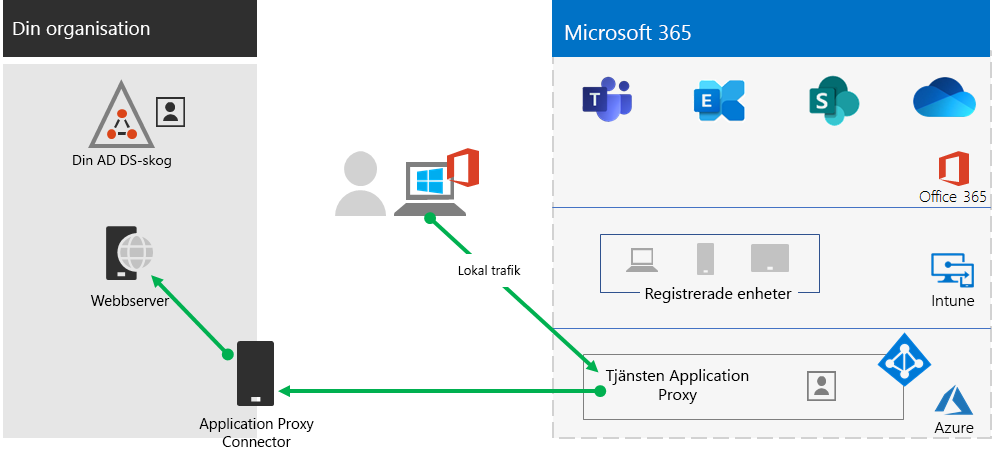
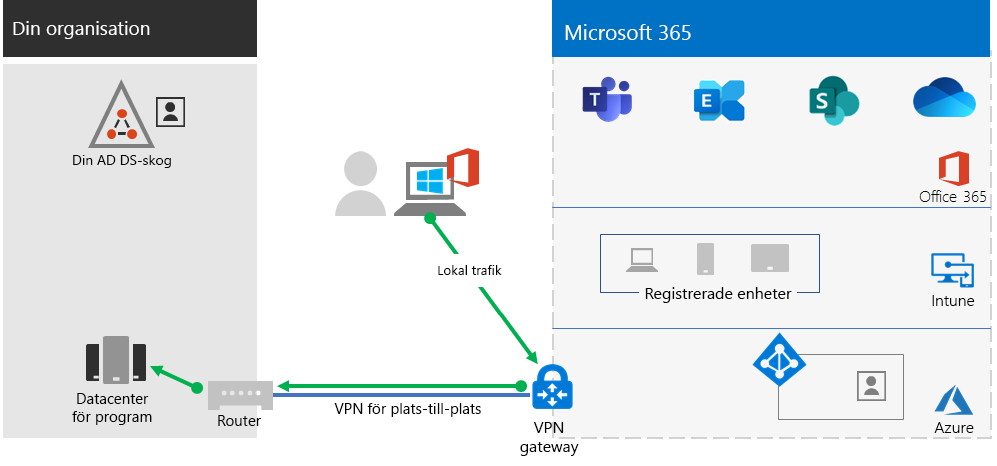

# Steg 2. Tillhandahålla fjärråtkomst till lokala appar och tjänster

Användarna använda VPN-anslutningarna för fjärråtkomst för att komma åt lokala appar och servrar om din organisation använder en VPN-lösning för fjärråtkomst, oftast med VPN-servrar på kanten av ditt nätverk och VPN-klienter som är installerade på användarnas enheter. Men du kan behöva optimera trafik för molnbaserade Microsoft 365-tjänster.

Om dina användare inte använder en VPN-lösning kan du med hjälp av Azure Active Directory (Azure AD) Application Proxy och Azure Point-to-Site (P2S) VPN för att ge åtkomst, beroende på om alla dina appar är webbaserade.

Det finns tre primära konfigurationer:

1. Du använder redan en VPN-lösning för fjärråtkomst.
2. Du använder inte en VPN-lösning för fjärråtkomst, men du har en hybrididentitet och du behöver endast fjärråtkomst till lokala webbaserade appar.
3. Du använder inte en VPN-lösning för fjärråtkomst och du behöver åtkomst till lokala appar, varav några inte är webbaserade.

Se det här flödesschemat för konfigurationsalternativen för fjärråtkomst som beskrivs i den här artikeln.

Med fjärråtkomstanslutningar kan du även använda [Remote Desktop](https://support.microsoft.com/help/4028379/windows-10-how-to-use-remote-desktop) för att ansluta dina användare till en lokal dator. En distansarbetare kan använda Remote Desktop för att ansluta till datorn på deras kontor från deras Windows-, iOS- eller Android-enhet. När de har fjärranslutit kan de använda den som om de satt framför den.

## Optimera prestanda för VPN-klienter för fjärråtkomst till Microsoft 365-molntjänster

Om din distansarbetare använder en traditionell VPN-klient för att få fjärråtkomst till organisationens nätverk ska du kontrollera att VPN-klienten har stöd för delad tunnel.

Utan delad tunnel skickas all din fjärrtrafik över VPN-anslutningen, där den måste vidarebefordras till organisationens gränsenheter, bli processad och sedan skickas via Internet.

Microsoft 365-trafik måste ta en indirekt väg via din organisation, som kan vara vidarebefordrad till en Microsoft Network startpunkt långt bort från VPN-klientens fysiska plats. Denna indirekta väg lägger till en fördröjning för nätverkstrafiken och minskar prestandan. 

Med delad tunnel kan du konfigurera VPN-klienten så att den exkluderar vissa typer av trafik som inte skickas via VPN-anslutningen till organisationens nätverk.

Om du vill optimera åtkomst till Microsoft 365 molnresurser konfigurerar du VPN-klienter för uppdelad tunnel för att undanta trafik till **optimera** kategori Microsoft 365-slutpunkter över VPN-anslutningen. Mer information finns i [Office 365-slutpunktskategorier](https://docs.microsoft.com/office365/enterprise/office-365-network-connectivity-principles#new-office-365-endpoint-categories). Se listan över optimera kategorislutpunkter [här](https://docs.microsoft.com/office365/enterprise/urls-and-ip-address-ranges).

Detta gör att VPN-klienten kan skicka och ta emot viktig trafik i Microsoft 365 molntjänster direkt via Internet och till närmaste startpunkt i Microsoft-nätverket.

Detaljerad information finn i [Optimera Office 365-anslutning för fjärranvändare med delad VPN-tunnel](https://docs.microsoft.com/office365/enterprise/office-365-vpn-split-tunnel).

## Distribuera fjärråtkomst när alla dina appar är webbprogram och du har en hybrididentitet

Om dina distansarbetare inte använder en traditionell VPN-klient och dina lokala användarkonton och -grupper är synkroniserade med Azure Active Directory kan du använda Azure Active Directory Application Proxy för att tillhandahålla säker fjärråtkomst för webbaserade program som finns på intranätservrar. Webbaserade program är SharePoint-webbplatser, Outlook Web Access-servrar eller andra webbaserade affärsprogram. 

Här är komponenterna i Azure Active Directory Application Proxy.

Mer information finns i den här [översikt över Azure Active Directory Application Proxy](https://docs.microsoft.com/azure/active-directory/manage-apps/application-proxy).

## Distribuera fjärråtkomst när alla appar inte är webbprogram

Om din distansarbetare inte använder en traditionell VPN-klient och några av dina appar inte är webbaserade kan du använda en Azure Point-to-Site (P2S) VPN.

En P2S VPN-anslutning skapar en säker anslutning från en distansarbetares enhet till organisationens nätverk via ett virtuellt Azure-nätverk. 

Mer information finns i denna [översikt över P2S VPN](https://docs.microsoft.com/azure/vpn-gateway/point-to-site-about).

## Distribuera Windows Virtual Desktop för att tillhandahålla fjärråtkomst för distansarbetare som använder personliga enheter 

Om du vill stödja distansarbetare som endast kan använda sina personliga och ohanterade enheter kan du använda Windows Virtual Desktop i Azure och skapa och allokera virtuella skrivbord för användarna att använda hemifrån.

Virtualiserade datorer kan agera precis som datorer som är anslutna till din organisations nätverk.

Mer information finns i [den här översikten över Windows Virtual Desktop](https://docs.microsoft.com/azure/virtual-desktop/overview).

## Tekniska administrationsresurser för fjärråtkomst

- [Så här kan du snabbt optimera Office 365-trafik för fjärransluten personal och minska belastningen på infrastrukturen](https://techcommunity.microsoft.com/t5/office-365-blog/how-to-quickly-optimize-office-365-traffic-for-remote-staff-amp/ba-p/1214571)
- [Optimera Office 365-anslutningen för fjärranvändare med uppdelad VPN-tunnel](https://docs.microsoft.com/office365/enterprise/office-365-vpn-split-tunnel)

## Resultat av steg 2

Efter distribution av en lösning för fjärråtkomst för dina distansarbetare:

| Konfigurationen för fjärråtkomst | Resultat |
|:-------|:-----|
| En VPN-lösning för fjärråtkomst finns på plats | Du har konfigurerat VPN-klienten för fjärråtkomst för uppdelad tunnel och för optimeringskategori för Microsoft 365-slutpunkter. |
| Ingen VPN-lösning för fjärråtkomst och du behöver endast fjärråtkomst till lokala webbaserade appar | Du har konfigurerat Azure Application Proxy. |
| Ingen VPN-lösning för fjärråtkomst och du behöver åtkomst till lokala appar, vissa som inte är webbaserade | Du har konfigurerat Azure P2S VPN. |
| Distansarbetare använder sina personliga enheter från hemmet | Du har konfigurerat Windows Virtual Desktop. |
|||

## Nästa steg

Fortsätt med [Steg 3](empower-people-to-work-remotely-manage-endpoints.md) för att hantera enheter, datorer och andra slutpunkter.
