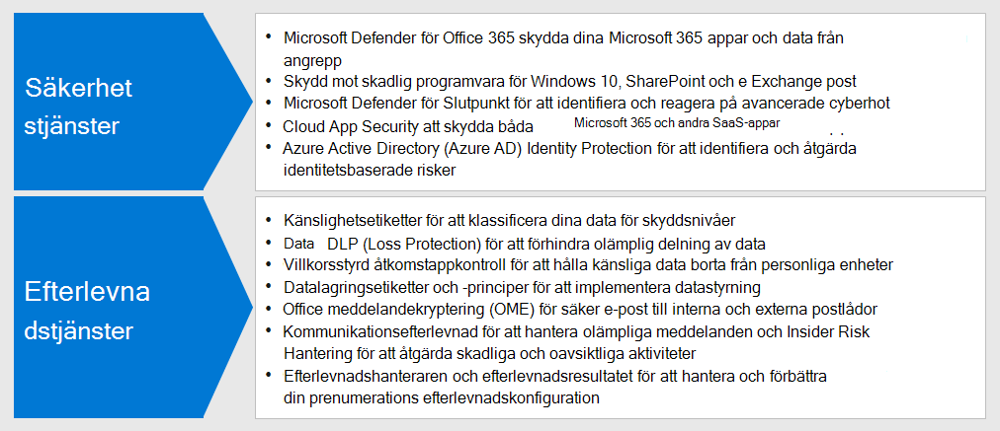
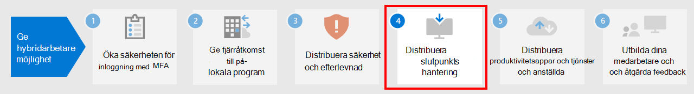

# Steg 3: Använd säkerhet och efterlevnad för hybridarbetareStep 3: Deploy security and compliance for hybrid workers

För hybridarbetare, vilka vissa aldrig eller väldigt sällan är på kontoret, är säkerhet och efterlevnad en viktig del av den övergripande lösningen.For hybrid workers, some of whom never go into the office or who go infrequently, security and compliance are an important part of the overall solution. All deras kommunikation sker via Internet i stället för att begränsas till organisationens intranät.All of their communications occur over the Internet instead of being confined to an organizational intranet.

Det finns saker du och dina medarbetare kan göra för att fortsätta vara produktiva och minska cybersäkerhetsriskerna, och upprätthålla efterlevnaden av interna principer och dataföreskrifter.There are things you and your workers can do to remain productive while decreasing cybersecurity risk and maintaining compliance with your internal policies and data regulations.

För distansarbetare krävs följande säkerhets- och efterlevnadselement:Remote work needs these elements of security and compliance:

- Kontrollerad åtkomst till de produktivitetsapparna som hybridarbetarna använder, t.ex. Microsoft TeamsControlled access to the productivity apps that hybrid workers use, such as Microsoft Teams
- Kontrollerad åtkomst till och skydd för de data som hybridarbetarna skapar och använder, t.ex. chattar eller delade filerControlled access to and protection of the data that hybrid workers create and use, such as chat conversations or shared files
- Skydd för Windows 10-enheter mot skadlig programvara och andra typer av cyberattackerProtection of Windows 10 devices from malware and other types of cyberattacks
- Skydd för e-post, filer och webbplatser med konsekvent etikettering för känslighets- och skyddsnivåerProtection of email, files, and site with consistent labeling for levels of sensitivity and protection
- Förhindrande av dataläckagePrevention of leaked information
- Iakttagande av regionala dataföreskrifterAdherence to regional data regulations

Här är de funktioner i Microsoft 365 som tillhandahåller säkerhets- och efterlevnadstjänster för hybridarbetare.Here are the features of Microsoft 365 that provide security and compliance services for hybrid workers.

## SäkerhetSecurity

Skydda dina program och data med de här säkerhetsfunktionerna i Microsoft 365.Protect your applications and data with these security features of Microsoft 365.

| Resurs eller funktionCapability or feature | Varför jag behöver detWhy I need it | LicensieringLicensing |
|:-------|:-----|:-------|
| Microsoft Defender för Office 365Microsoft Defender for Office 365 | Skydda dina Microsoft 365-appar och data – t.ex. e-postmeddelanden, Office-dokument och samarbetsverktyg – från angrepp.Protect your Microsoft 365 apps and data—such as email messages, Office documents, and collaboration tools—from attack.    Microsoft Defender för Office 365 samlar in och analyserar signaler från dina appar för identifiering, undersökning och åtgärd av säkerhetsrisker och skyddar din organisation mot skadliga hot som uppstår genom e-postmeddelanden, länkar (URL:er) och samarbetsverktyg. Det ger också automatisk utvärdering av klientorganisationens konfiguration och konfigurationsverktyg för standard och strikt säkerhetsstatus.Microsoft Defender for Office 365 collects and analyzes signals from your apps for detection, investigation, and remediation of security risks and safeguards your organization against malicious threats posed by email messages, links (URLs), and collaboration tools. It also provides automated tenant configuration assessment and configuration tooling for standard and strict security postures. | Microsoft 365 E3 eller E5Microsoft 365 E3 or E5 |
| Skydd mot skadlig programvaraMalware protection | ‎Windows Defender Antivirus och Device Guard tillhandahåller enhetsbaserat skydd mot skadlig programvara.‎Microsoft Defender Antivirus and Device Guard provides device-based malware protection.    SharePoint‎ Online skannar automatiskt igenom filuppladdningar efter känd skadlig kod.SharePoint‎ Online automatically scans file uploads for known malware. ‎   Exchange Online Protection‎ (‎EOP‎) skyddar molnpostlådor.Exchange Online Protection‎ (‎EOP‎) secures cloud mailboxes. | Microsoft 365 E3 eller E5Microsoft 365 E3 or E5 |
| Microsoft Defender för EndpointMicrosoft Defender for Endpoint | Skydda din organisationsenheter mot cyberhot och dataintrång och identifiera, undersök och reagera på avancerade hot.Protect your organization’s devices from cyber threats and data breaches and detect, investigate, and respond to advanced threats. | Microsoft 365 E5Microsoft 365 E5 |
| Cloud App SecurityCloud App Security | Skydda dina molnbaserade tjänster – både Microsoft 365 och andra SaaS-appar – från angrepp.Protect your cloud-based services—both Microsoft 365 and other SaaS apps—from attack. | Microsoft 365 E5 eller individuella Cloud App Security-licenserMicrosoft 365 E5 or individual Cloud App Security licenses |
| Azure AD Identity ProtectionAzure AD Identity Protection  | Automatisera identifiering och åtgärder för identitetsbaserade risker.Automate detection and remediation of identity-based risks.   Skapa riskbaserade principer för villkorsstyrd åtkomst för att kräva multifaktorautentisering (MFA) för riskfyllda inloggningar.Create risk-based Conditional Access policies to require multi-factor authentication (MFA) for risky sign-ins. | Microsoft 365 E5 eller E3 med Azure AD Premium P2-licenserMicrosoft 365 E5 or E3 with Azure AD Premium P2 licenses |
||||

Ditt första steg bör vara att lära dig om och använda [Microsoft Secure Score](/microsoft-365/security/defender/microsoft-secure-score).You first step should be to learn about and use [Microsoft Secure Score](/microsoft-365/security/defender/microsoft-secure-score).

Mer information finns i [De 12 viktigaste uppgifterna för säkerhetsteam för att stödja arbete hemifrån](../security/top-security-tasks-for-remote-work.md).See [Top 12 tasks for security teams to support working from home](../security/top-security-tasks-for-remote-work.md) for more information.

Information om säkerhet i Microsoft 365 finns i [dokumentation för Microsoft 365 Säkerhet](/microsoft-365/security).For information about security across Microsoft 365, see [Microsoft 365 security documentation](/microsoft-365/security).

## EfterlevnadCompliance

Uppfyll de interna principerna eller regelkraven med dessa efterlevnadsfunktioner i Microsoft 365.Comply with internal policies or regulatory requirements with these compliance features of Microsoft 365.

| Resurs eller funktionCapability or feature | Varför jag behöver detWhy I need it | LicensieringLicensing |
|:-------|:-----|:-------|
| KänslighetsetiketterSensitivity labels | Med hjälp av etiketter med olika nivåer av skydd för e-post, filer och webbplatser kan du klassificera och skydda din organisations data utan att hindra användarnas produktivitet och möjligheter att samarbeta.Classify and protect your organization's data without hindering the productivity of users and their ability to collaborate by placing labels with various levels of protection on email, files, or sites. | Microsoft 365 E3 eller E5Microsoft 365 E3 or E5 |
| Dataförlustskydd (DLP)Data Loss Protection (DLP) | Identifiera, varna för och blockera riskfylld, oavsiktlig eller olämplig delning, t.ex. av data som innehåller personuppgifter, både internt och externt.Detect, warn, and block risky, inadvertent, or inappropriate sharing, such as sharing of data containing personal information, both internally and externally. | Microsoft 365 E3 eller E5Microsoft 365 E3 or E5 |
| Programkontroll med villkorsstyrd åtkomstConditional Access App Control | Förhindra att känsliga data laddas ned till användarnas personliga enheter.Prevent sensitive data from being downloaded to users' personal devices. | Microsoft 365 E3 eller E5Microsoft 365 E3 or E5 |
| Etiketter och principer för kvarhållning av dataData retention labels and policies | Implementera kontrollerna för informationsstyrning, t.ex. hur länge data ska behållas och kraven för lagring av personuppgifter för kunder, för att uppfylla organisationens principer och dataföreskrifter.Implement information governance controls, such as how long to keep data and requirements on the storage of personal data on customers, to comply with your organization's policies or data regulations. | Microsoft 365 E3 eller E5Microsoft 365 E3 or E5 |
| Meddelandekryptering i Office (OME)Office message encryption (OME) | Skicka och ta emot krypterade e-postmeddelanden som innehåller reglerade data, t.ex. personliga data om kunder, mellan personer i och utanför din organisation.Send and receive encrypted email messages between people inside and outside your organization that contains regulated data, such as personal data on customers. | Microsoft 365 E3 eller E5Microsoft 365 E3 or E5 |
| EfterlevnadshanterarenCompliance Manager | Hantera regelefterlevnad som rör Microsofts molntjänster med detta arbetsflödesbaserade verktyg för riskbedömning i Microsoft Service Trust Portal.Manage regulatory compliance activities related to Microsoft cloud services with this workflow-based risk assessment tool in the Microsoft Service Trust Portal. | Microsoft 365 E3 eller E5Microsoft 365 E3 or E5 |
| EfterlevnadshanterarenCompliance Manager | Se en övergripande poäng för din nuvarande konfiguration och rekommendationer för att förbättra den i Microsoft 365 Efterlevnadscentret.See an overall score of your current compliance configuration and recommendations for improving it in the Microsoft 365 compliance center. | Microsoft 365 E3 eller E5Microsoft 365 E3 or E5 |
| Efterlevnad av kommunikationCommunication Compliance  | Identifiera, fånga och vidta reparationsåtgärder för olämpliga meddelanden i organisationen.Detect, capture, and take remediation actions for inappropriate messages in your organization. | Microsoft 365 E5 eller Microsoft 365 E3 med tilläggen för efterlevnad och Insider-riskhanteringMicrosoft 365 E5 or Microsoft 365 E3 with the Compliance or Insider Risk Management add-ons |
| Hantering av insiderriskInsider Risk Management |  Identifiera, undersöka och åtgärda skadliga och oavsiktliga risker i organisationen.Detect, investigate, and act on malicious and inadvertent risks in your organization. Microsoft 365 kan upptäcka sådana typer av risker även om en arbetstagare använder en ohanterad enhet.Microsoft 365 can detect these kinds of risks even when a worker is using an unmanaged device. | Microsoft 365 E5 eller Microsoft 365 E3 med tilläggen för efterlevnad och Insider-riskhanteringMicrosoft 365 E5 or Microsoft 365 E3 with the Compliance or Insider Risk Management add-ons |
||||

Mer information finns i artikeln om [snabbuppgifter för att komma igång med Microsoft 365-efterlevnad](../compliance/compliance-quick-tasks.md).See [Quick tasks for getting started with Microsoft 365 compliance](../compliance/compliance-quick-tasks.md) for more information.

## Resultat av steg 3Results of Step 3

För dina hybridarbetare har du implementerat:For your hybrid workers, you have implemented:

- SäkerhetSecurity
  - Kontrollerad åtkomst till appar och data som distansarbetarna använder för att kommunicera och samarbetaControlled access to apps and data that hybrid workers use to communicate and collaborate
  - Skydd mot skadlig programvara för molntjänstdata, e-post och Windows 10-enheterMalware protection for cloud service data, email, and Windows 10 devices
- EfterlevnadCompliance
  - Konsekvent etikettering för känslighets- och skyddsnivåerConsistent labeling for levels of sensitivity and protection
  - Principer för att förhindra dataläckagePolicies to prevention information leakage
  - Iakttagande av regionala dataföreskrifterAdherence to regional data regulations

## Nästa stegNext step

Fortsätt med [Steg 4](empower-people-to-work-remotely-manage-endpoints.md) för att hantera enheter, datorer och andra slutpunkter.Continue with [Step 4](empower-people-to-work-remotely-manage-endpoints.md) to manage your devices, PCs, and other endpoints.
