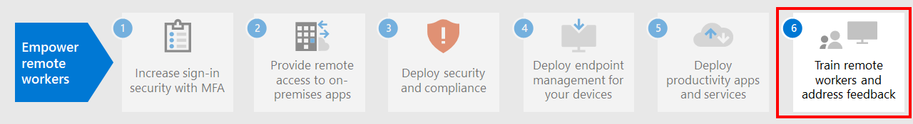

# Steg 5: Distribuera produktivitetsappar och tjänster för distansarbetare

För att kunna vara produktiva måste personer kommunicera och samarbeta med varandra. De måste träffas, chatta med röst och text, skapa nytt innehåll och dela information och filer, utbyta e-post och hantera kalendrar och uppgifter. Microsoft 365 tillhandahåller molnbaserade tjänster för alla de här nyckelfunktionerna:

| IT-funktion | Microsoft 365-komponenter | Beskrivning |
|:-------|:-----|:-------|
| E-posttjänster | Exchange Online | Utbyta e-post och hantera kalendrar, kontakter och uppgifter med Outlook-klienten. |
| Organisatorisk chatt, VOIP (Voice over IP) och teambaserat samarbete | Microsoft Teams | Håll personer uppkopplade medan de arbetar från ett gemensamt nav för kommunikation för möten, chattar och fillagring för organisationen, avdelningarna och för små grupper och individer. |
| Intranätwebbplatser, dokumentsamarbete | SharePoint och OneDrive | Lagra och samarbeta om filer i en webbläsare eller inom Teams. |
| Stationära och mobila enheter Office-applikationer | Microsoft 365-applikationer | Skapa nytt innehåll eller samarbeta med befintligt innehåll med versioner av Word, PowerPoint, Excel och Outlook som är installerade på den lokala dator och får pågående funktioner och säkerhetsuppdateringar. |
||||

## Håll kontakter anslutna med Microsoft Teams

Med Teams kan ni chatta, träffas, ringa och samarbeta på en och samma plats. Miljontals användare får jobbet gjort i Teams varje dag eftersom det sammanställer allt du behöver arbeta med i ett samarbetsnav. 

Detaljerade anvisningar finns i [Ge stöd till distansarbetare med Microsoft Teams](/microsoftteams/support-remote-work-with-teams). 

Titta på [Aktivera hybridarbete med Microsoft Teams-webbsändningar](https://resources.techcommunity.microsoft.com/enabling-hybrid-work/) för vägledning och demonstrationer om hur du använder Teams för distansarbete.

### Chatt och konversationer

Chatt och trådade konversationer finns i mitten av Teams med stöd för individuella 1:1-chattar och gruppchattar och konversationer. Distansarbetare kan dela information, åsikter och personlighet genom att använda GIF-bilder, dekaler och emojier i gruppchattar eller en-till-en-meddelanden.

### Möten och konferenser 

Teams kan hjälpa till att underhålla kommunikation och informationsdelning med distansarbetare, särskilt i möten som har stöd för upp till 250 personer. Teams-möten möjliggör interaktiva, samarbetsmöten med personer inom och utanför organisationen. Distansarbetarna kan använda Teams-möten för dagliga aktiviteter, t. ex. återkommande projektkontroller, höra av sig till kollegor, kreativa möten och underlätta konversationer med kunder. 

### Ringer

Teams har stöd för direkt VoIP-samtal mellan användare och även andra organisationer som använder federation. Det använder samma codecenheter som möten och ger bra ljud från hela världen utan ytterligare PSTN-avgifter. Vissa användare kan dock behöva ett särskilt telefonnummer för att ta externa samtal när de arbetar på distans. Teams kan snabbt tillhandahålla molntelefontjänst så att de här användarna att ringa och ta emot telefonsamtal.

### Appar och arbetsflöden

Teams tillhandahåller en plattform för appar och arbetsflöden som du kommer åt via dator-, webb- och mobilversionerna av Teams. Med Teams får du hundratals program som publiceras av Microsoft och tredje part för att engagera användare, stödja produktivitet och integrera vanliga affärstjänster i Teams. Användare och administratörer kan också skapa egna appar och automatiserade arbetsflöden för Teams med hjälp av utvecklingsverktygen Power Apps och Power Automate.

Med appar och arbetsflöden blir distansarbetarna mer produktiva i Teams, genom att samla in och dela viktig information, automatisera repetitiva uppgifter och så att de kan chatta med interaktiva bot. Att fästa appar i en kanal eller i Teams appfält är ett bra sätt för användare för att göra apparna lättillgängliga på ett lämpligt utrymme, och administratörer kan fästa appar för att öka medvetenheten och använda de appar som alla bör använda.

## Utbyta e-post och hantera kalendrar, kontakter och uppgifter med Exchange Online och Outlook

Med Outlook kan distansarbetare vara anslutna och organiserade med e-post, kalendrar, kontakter, uppgifter med mera, tillsammans på ett och samma ställe. Outlook hjälper dig att hålla reda på din dag baserat på vad som är relevant för dig. Med Outlook kan du dela bifogade filer direkt från OneDrive, planera och delta i Teams-möten, visa och dela kalendrar samt ge behörigheter till andra. Att veta vad som kommer härnäst för både arbete och personliga åtaganden och vad som behöver uppmärksamhet kan hjälpa distansarbetare att fokusera på vad som är viktigt. Outlook ger användbara sätt för hur distansarbetare kan hantera sin tid och enkelt hitta vad de behöver, inklusive filer, personer i organisationen och mer. 

Se [den här artikeln](../security/office-365-security/secure-email-recommended-policies.md) om du vill ha rekommenderad identitets- och enhetsåtkomst för att skydda organisationens e-post och e-postklienter som stöder modern autentisering och villkorlig åtkomst.

## Lagra och samarbeta i filer med SharePoint och OneDrive

För innehållssamarbete kan fjärrarbetare använda mappar från SharePoint och OneDrive som en central plats i molnet för att lagra och dela filer, samredigera, kommunicera och samarbeta. Distansarbetare kan samarbeta säkert från valfri plats från en webbläsare, från Teams och från Office-appar.

Du kan behöva migrera dina dokument till SharePoint eller OneDrive från:

- [SharePoint Server-gruppwebbplatser](/sharepointmigration/sp-teams-sites-migration-guide)
- [MySites](/sharepointmigration/mysites-to-onedrive-migration-guide)
- [Filresurser](/sharepointmigration/fileshare-to-odsp-migration-guide)
- [Ruta](/sharepointmigration/box-to-onedrive-and-sharepoint-migration-guide)

Se [den här artikeln](../security/office-365-security/sharepoint-file-access-policies.md) om du vill ha de rekommenderade principerna för identitets- och enhetsåtkomst för att skydda SharePoint och OneDrive.

## Skapa och samarbeta med innehåll med Microsoft 365-appar

Microsoft 365-applikationer är den mest produktiva och säkraste Office-upplevelsen för företag, som gör att personer kan samarbeta smidigt, var som helst, när som helst. Distansarbetare kan samarbeta på ett dokument med flera personer samtidigt, se redigeringar och förändringar i realtid och samredigera med andra på vilken bärbar dator, dator eller mobil enhet som helst.

Mer information finns i [distributionsguiden för Microsoft 365-applikationer](/deployoffice/deployment-guide-microsoft-365-apps).

## Teknisk administration för produktivitetsprogram och-tjänster

- [Ge stöd till distansarbetare med Microsoft Teams](/microsoftteams/support-remote-work-with-teams)
- [Aktivera hybridarbete med Microsoft Teams-webbsändningar](https://resources.techcommunity.microsoft.com/enabling-hybrid-work/)
- [Nedladdning av Teams Customer Success Kit](https://www.microsoft.com/download/details.aspx?id=54244)
- [Verktyg för att driva på användning av Teams](/microsoftteams/adopt-tools-and-downloads) 
- [Skapa en strategi för ändringshantering för Microsoft Teams](/MicrosoftTeams/change-management-strategy)
- [Teams med tre skyddsnivåer](configure-teams-three-tiers-protection.md)

## Utbildningsresurser för användare för produktivitetsprogram och -tjänster

- [Träna dina användare på Office och Microsoft 365](https://support.microsoft.com/office/train-your-users-on-office-and-microsoft-365-7cba3c97-7f19-46ed-a1c6-763971a26c27)
- [Använda Office för webben](https://support.microsoft.com/office/get-started-with-office-for-the-web-in-microsoft-365-5622c7c9-721d-4b3d-8cb9-a7276c2470e5)

## Nästa steg

Fortsätt med [Steg 6](empower-people-to-work-remotely-train-monitor-usage.md) för hur du tränar användarna och övervakar hur de lyckas.