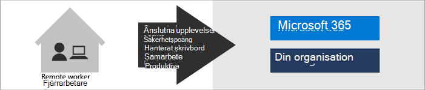
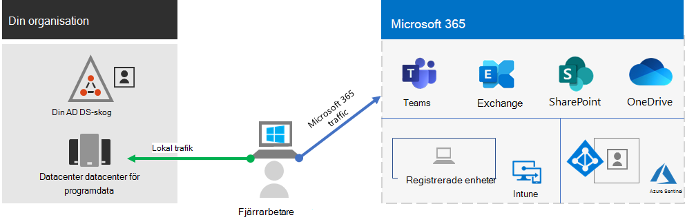
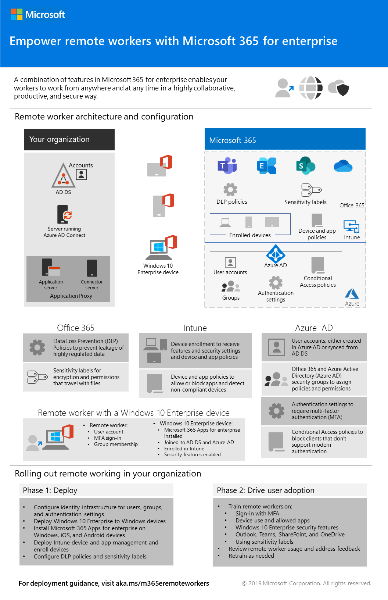

# Underlätta för distansarbetare med Microsoft 365

Ditt företag kan behöva upprätta säker åtkomst till organisationens lokala och molnbaserade information, verktyg och resurser för anställda som arbetar hemifrån. Att låta arbetarna arbeta utanför kontoret är viktigt för många organisationer för att:

- Spara på kontorsutrymme.
- Anställa och behålla arbetare som inte vill omlokalisera.
- Minska pendlingstid för arbetare vilket ger de mer tid att vara produktiva och kunna utföra stressminskande aktiviteter utanför arbetet.

Microsoft 365 har förmågan att låta dina medarbetare att arbeta på distans.

>[!Note]
>Om du är ny på Microsoft 365, se [de här resurserna](https://www.microsoft.com/microsoft-365).
>

Titta på den här videon för att få en översikt över distributionsprocessen.
 
 
> [!VIDEO https://www.microsoft.com/videoplayer/embed/RE4F1af]

För IT-proffs som hanterar plats- och molnbaserad infrastruktur för att möjliggöra arbetsproduktiviteten, erbjuder denna lösning följande viktiga funktioner:

- Ansluten

  Oavsett tid och plats kan distansarbetare komma åt: 

  - Molnbaserade tjänster och data i din Microsoft 365-prenumeration. 

  - Organisationsresurser av samma slag som finns att tillgå med programdatacentraler på plats.

- Säker

  Inloggningarna skyddas med multifaktorautentisering (MFA) och inbyggda säkerhetsfunktioner i Microsoft 365 och Windows 10 skyddar mot skadlig programvara, skadliga attacker och dataförluster.

- Hanteras

  Din distansarbetares enheter kan hanteras från molnet med säkerhetsinställningar, tillåtna appar och för att kräva överensstämmelse med systemsäkerheten.

- Samarbetsvilliga och produktiva

  Dina distansarbetare kan vara lika produktiva som på plats på ett mycket samarbetande sätt med:

  - Onlinemöten och chattsessioner med Teams. 

  - Delade arbetsytor för molnbaserad fillagring med global tillgänglighet och samarbete i realtid med SharePoint och OneDrive.

  - Delade uppgifter och arbetsflöden för att dela upp arbetet och få saker gjorda. 

För smidig inloggning lokalt bör dina användarkonton i Active Directory Domain Services (AD DS) synkroniseras med Azure Active Directory (Azure AD). För att skydda dina Windows 10-enheter bör de registreras i Intune. Här är en övergripande vy över infrastrukturen.

Använd de här Microsoft 365-funktionerna om du vill aktivera funktionerna i Microsoft 365 för dina distansarbetare.

| Resurs eller funktion | Beskrivning | Licensiering |
|:-------|:-----|:-------|
| MFA som förstärks med säkerhetsstandarder   | Skydda er mot identitetsstölder och komprometterade enheter genom att kräva en andra form av autentisering vid inloggning. Säkerhetsstandarderna kräver MFA för alla användarkonton.   | Microsoft 365 E3 eller E5 |
| MFA som förstärks med villkorsstyrd åtkomst| Använd villkorsstyrda åtkomstprinciper för att kräva MFA baserat på egenskaperna för inloggningen.    | Microsoft 365 E3 eller E5 | 
| MFA som förstärks med riskbaserad villkorsstyrd åtkomst   | Använd Microsoft Defender for Identity för att kräva MFA baserat på risken som är kopplad till användarens inloggning. | Microsoft 365 E5 eller E3 med Azure AD Premium P2-licenser | 
| Självbetjäning för återställning av lösenord (SSPR)    | Låt användarna återställa eller låsa upp sina lösenord och konton.  | Microsoft 365 E3 eller E5 |
| Azure Active Directory Application Proxy    | Tillhandahåll säker fjärråtkomst till webbaserade program som finns på intranätsservrar.   | För detta krävs en separat, betald Azure-prenumeration |
| Azure Point-to-Site VPN   | Skapa en säker anslutning från en distansarbetares enhet till ert intranät via ett virtuellt Azure-nätverk.   | För detta krävs en separat, betald Azure-prenumeration |
| Windows Virtual Desktop   | Underlätta för distansarbetare som bara kan använda privata och ohanterade enheter med hjälp av virtuella skrivbord som körs i Azure. | För detta krävs en separat, betald Azure-prenumeration |
| Fjärrskrivbordstjänster (RDS) | Låt medarbetarna ansluta till Windows-baserade datorer på intranätet. | Microsoft 365 E3 eller E5 | 
| Gateway för fjärrskrivbordstjänster   | Kryptera kommunikationen och hindra värddatorerna för fjärrskrivbordstjänsterna från att exponeras direkt på internet. | För detta krävs separata Windows Server-licenser |
| Microsoft Intune | Hantera enheter och program.   | Microsoft 365 E3 eller E5 | 
| Konfigurationshanteraren | Hantera programvaruinstallationer, uppdateringar och inställningar på dina enheter | För detta krävs separata licenser för Konfigurationshanteraren |
| Desktop Analytics | Avgör uppdateringsberedskapen hos dina Windows-klienter.   | För detta krävs separata licenser för Konfigurationshanteraren |
| Windows Autopilot | Förinstallera och konfigurera nya Windows 10-enheter för effektiv användning.   | Microsoft 365 E3 eller E5 |
| Microsoft Teams, Exchange Online, SharePoint Online och OneDrive, Microsoft 365-applikationer, Microsoft Power Platform och Yammer | Skapa, kommunicera och samarbeta. | Microsoft 365 E3 eller E5 |
||||

För kriterier för säkerhet och efterlevnad, se [Distribuera säkerhet och efterlevnad för fjärrarbetare](empower-people-to-work-remotely-security-compliance.md).

För en 2-sidor sammanfattning av denna lösning, se[Stärk affischen för fjärrarbetare](../downloads/empower-remote-workers.pdf).

Du kan också ladda ned den här affischen i [PDF](https://github.com/MicrosoftDocs/microsoft-365-docs/raw/public/microsoft-365/downloads/empower-remote-workers.pdf)- eller [PowerPoint](https://download.microsoft.com/download/5/1/1/511b77a9-a34c-4ea7-af2a-32b07f20b780/empower-remote-workers.pptx)-format och skriva ut den i pappersstorleken letter, legal eller tabloid (11 x 17).

## Tillhandahålla fjärråtkomst för alla dina medarbetare

Du kan göra så alla dina medarbetare kan vara produktiva var de än befinner sig med dessa enheter:

- En modern enhet, till exempel en Surface laptop och Windows 10, som har funktioner, säkerhet och prestanda för att få tillgång till Microsoft 365-molnprogram och -tjänster direkt över webben.

- Alla enheter, inklusive äldre laptops eller stationära datorer, som kan få tillgång till Microsoft 365-molnprogram och -tjänster indirekt via en snabb distribution av [Windows 10-baserade virtuella skrivbord](empower-people-to-work-remotely-remote-access.md#deploy-windows-virtual-desktop-to-provide-remote-access-for-remote-workers-using-personal-devices). Med det här alternativet får du hög prestanda, stark säkerhet och förenklad IT-hantering.

## Nästa steg

Följ dessa steg för att skydda och optimera åtkomsten till organisationens servrar och molntjänster, och maximera produktiviteten för distansarbetarna.

1. [Öka inloggningssäkerheten med MFA](empower-people-to-work-remotely-secure-sign-in.md)
2. [Ge fjärråtkomst till lokala appar och tjänster](empower-people-to-work-remotely-remote-access.md)
3. [Distribuera säkerhets- och efterlevnadstjänster](empower-people-to-work-remotely-security-compliance.md)
4. [Distribuera slutpunktshantering för enheter, datorer och andra slutpunkter](empower-people-to-work-remotely-manage-endpoints.md)
5. [Distribuera produktivitetsappar och tjänster för distansarbetare](empower-people-to-work-remotely-teams-productivity-apps.md)
6. [Träna distansarbetare och få feedback om användningen](empower-people-to-work-remotely-train-monitor-usage.md)

Om du vill ha den senaste informationen från Microsoft om support för distansarbetare går du till [Aktivera hybridarbete med Microsoft Teams-webbplatsen](https://resources.techcommunity.microsoft.com/enabling-hybrid-work/).

Om du vill se hur en fiktiv men representativ multinationell organisation driver distansarbete finns mer information i [Contosos Svar mot COVID-19 och infrastruktur för distans- och på plats-arbete](contoso-remote-onsite-work.md).
