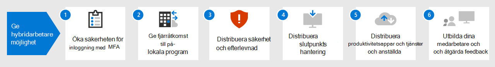

# Underlätta för distansarbetare med Microsoft 365

På grund av COVID-19-krisen kan ditt företag behöva upprätta säker åtkomst till organisationens lokala och molnbaserade information, verktyg och resurser för anställda som arbetar hemifrån. 

Följ dessa steg för att skydda och optimera åtkomsten till organisationens servrar, data och molntjänster och för att maximera produktiviteten för medarbetarna.

1. [Öka inloggningssäkerheten med MFA](empower-people-to-work-remotely-secure-sign-in.md)
2. [Ge fjärråtkomst till lokala appar och tjänster](empower-people-to-work-remotely-remote-access.md)
3. [Distribuera slutpunktshantering för enheter, datorer och andra slutpunkter](empower-people-to-work-remotely-manage-endpoints.md)
4. [Distribuera produktivitetsappar och tjänster för distansarbetare](empower-people-to-work-remotely-teams-productivity-apps.md)
5. [Skapa mötesplatser för information om COVID-19-krisen](empower-people-to-work-remotely-communication-venues.md)
6. [Träna distansarbetare och få feedback om användningen](empower-people-to-work-remotely-train-monitor-usage.md)

