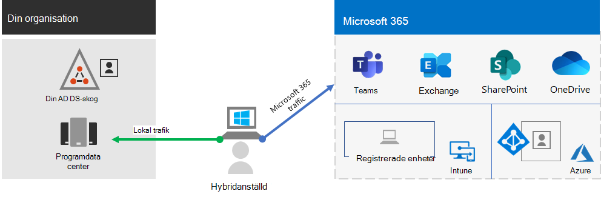
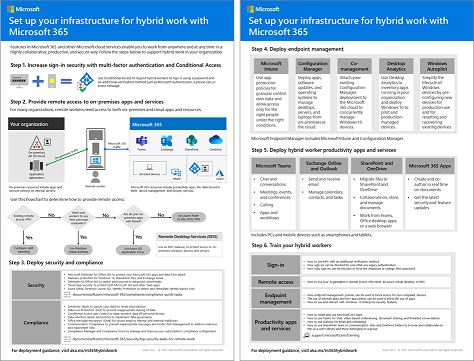

# Underlätta för distansarbetare med Microsoft 365Empower remote workers with Microsoft 365

Ditt företag kan behöva upprätta säker åtkomst till organisationens lokala och molnbaserade information, verktyg och resurser för anställda som arbetar hemifrån.Your business may need to enable your workers to have secure access to your organization's on-premises and cloud-based information, tools, and resources from their homes. Att låta arbetarna arbeta utanför kontoret är viktigt för många organisationer för att:Allowing workers to work away from the office is important for many organizations to:

- Spara på kontorsutrymme.Save on office space.
- Anställa och behålla arbetare som inte vill omlokalisera.Hire and retain workers who are unwilling to relocate.
- Minska pendlingstid för arbetare vilket ger de mer tid att vara produktiva och kunna utföra stressminskande aktiviteter utanför arbetet.Reduce worker commuting, leaving them with more time to be productive and for stress-reducing activities outside of work.

Microsoft 365 har förmågan att låta dina medarbetare att arbeta på distans.Microsoft 365 has the capabilities to empower your workers to work remotely.

Titta på den här videon för att få en översikt över distributionsprocessen.Watch this video for an overview of the deployment process.
 
> [!VIDEO https://www.microsoft.com/videoplayer/embed/RE4F1af]

Den här lösningen har de här nyckelfunktionerna.This solution provides these key capabilities.

- AnslutenConnected

  Oavsett tid och plats kan distansarbetare komma åt:From anywhere in the world and at any time, remote workers are able to access: 

  - Molnbaserade tjänster och data i din Microsoft 365-prenumeration.Cloud-based services and data in your Microsoft 365 subscription. 

  - Organisationsresurser av samma slag som finns att tillgå med programdatacentraler på plats.Organization resources, such those offered by on-premises application datacenters.

- SäkerSecure

  Inloggningarna skyddas med multifaktorautentisering (MFA) och inbyggda säkerhetsfunktioner i Microsoft 365 och Windows 10 skyddar mot skadlig programvara, skadliga attacker och dataförluster.Sign-ins are secured with multi-factor authentication (MFA) and built-in security features of Microsoft 365 and Windows 10 protect against malware, malicious attacks, and data loss.

- HanterasManaged

  Din distansarbetares enheter kan hanteras från molnet med säkerhetsinställningar, tillåtna appar och för att kräva överensstämmelse med systemsäkerheten.Your remote worker's devices can be managed from the cloud with security settings, allowed apps, and to require compliance with system health.

- Samarbetsvilliga och produktivaCollaborative and productive

  Dina distansarbetare kan vara lika produktiva som på plats på ett mycket samarbetande sätt med:Your remote workers can be as productive as on-premises in a highly collaborative way with:

  - Onlinemöten och chattsessioner med Teams.Online meetings and chat sessions with Teams. 

  - Delade arbetsytor för molnbaserad fillagring med global tillgänglighet och samarbete i realtid med SharePoint och OneDrive.Shared workspaces for cloud-based file storage with global accessibility and real-time collaboration with SharePoint and OneDrive.

  - Delade uppgifter och arbetsflöden för att dela upp arbetet och få saker gjorda.Shared tasks and workflows to divide up the work and get things done. 

För smidig inloggning lokalt bör dina användarkonton i Active Directory Domain Services (AD DS) synkroniseras med Azure Active Directory (Azure AD).For a seamless sign-in experience, your on-premises Active Directory Domain Services (AD DS) user accounts should be synchronized with Azure Active Directory (Azure AD). För att skydda dina Windows 10-enheter bör de registreras i Intune.To protect your Windows 10 devices, they should be enrolled in Intune. Här är en övergripande vy över infrastrukturen.Here is a high-level view of the infrastructure.

Använd de här Microsoft 365-funktionerna om du vill aktivera funktionerna i Microsoft 365 för dina distansarbetare.To enable the capabilities of Microsoft 365 for your remote workers, use these Microsoft 365 features.

| Resurs eller funktionCapability or feature | BeskrivningDescription | LicensieringLicensing |
|:-------|:-----|:-------|
| MFA som förstärks med säkerhetsstandarderMFA enforced with security defaults   | Skydda er mot identitetsstölder och komprometterade enheter genom att kräva en andra form av autentisering vid inloggning. Säkerhetsstandarderna kräver MFA för alla användarkonton.Protect against compromised identities and devices by requiring a second form of authentication for sign-ins. Security defaults requires MFA for all user accounts.   | Microsoft 365 E3 eller E5Microsoft 365 E3 or E5 |
| MFA som förstärks med villkorsstyrd åtkomstMFA enforced with Conditional Access| Använd villkorsstyrda åtkomstprinciper för att kräva MFA baserat på egenskaperna för inloggningen.Require MFA based on the properties of the sign-in with Conditional Access policies.    | Microsoft 365 E3 eller E5Microsoft 365 E3 or E5 | 
| MFA som förstärks med riskbaserad villkorsstyrd åtkomstMFA enforced with risk-based Conditional Access   | Använd Microsoft Defender for Identity för att kräva MFA baserat på risken som är kopplad till användarens inloggning.Require MFA based on the risk of the user sign-in with Microsoft Defender for Identity. | Microsoft 365 E5 eller E3 med Azure AD Premium P2-licenserMicrosoft 365 E5 or E3 with Azure AD Premium P2 licenses | 
| Självbetjäning för återställning av lösenord (SSPR)Self-Service Password Reset (SSPR)    | Låt användarna återställa eller låsa upp sina lösenord och konton.Allow your users to reset or unlock their passwords or accounts.  | Microsoft 365 E3 eller E5Microsoft 365 E3 or E5 |
| Azure Active Directory Application ProxyAzure AD Application Proxy    | Tillhandahåll säker fjärråtkomst till webbaserade program som finns på intranätsservrar.Provide secure remote access for web-based applications hosted on intranet servers.   | För detta krävs en separat, betald Azure-prenumerationRequires separate paid Azure subscription |
| Azure Point-to-Site VPNAzure Point-to-Site VPN   | Skapa en säker anslutning från en distansarbetares enhet till ert intranät via ett virtuellt Azure-nätverk.Create a secure connection from a remote worker’s device to your intranet through an Azure virtual network.   | För detta krävs en separat, betald Azure-prenumerationRequires separate paid Azure subscription |
| Windows Virtual DesktopWindows Virtual Desktop   | Underlätta för distansarbetare som bara kan använda privata och ohanterade enheter med hjälp av virtuella skrivbord som körs i Azure.Support remote workers who can only use their personal and unmanaged devices with virtual desktops running in Azure. | För detta krävs en separat, betald Azure-prenumerationRequires separate paid Azure subscription |
| Fjärrskrivbordstjänster (RDS)Remote Desktop Services (RDS) | Låt medarbetarna ansluta till Windows-baserade datorer på intranätet.Allow employees to connect into Windows-based computers on your intranet. | Microsoft 365 E3 eller E5Microsoft 365 E3 or E5 | 
| Gateway för fjärrskrivbordstjänsterRemote Desktop Services Gateway   | Kryptera kommunikationen och hindra värddatorerna för fjärrskrivbordstjänsterna från att exponeras direkt på internet.Encrypt communications and prevent the RDS hosts from being directly exposed to the Internet. | För detta krävs separata Windows Server-licenserRequires separate Windows Server licenses |
| Microsoft IntuneMicrosoft Intune | Hantera enheter och program.Manage devices and applications.   | Microsoft 365 E3 eller E5Microsoft 365 E3 or E5 | 
| KonfigurationshanterarenConfiguration Manager | Hantera programvaruinstallationer, uppdateringar och inställningar på dina enheterManage software installations, updates, and settings on your devices | För detta krävs separata licenser för KonfigurationshanterarenRequires separate Configuration Manager licenses |
| Desktop AnalyticsDesktop Analytics | Avgör uppdateringsberedskapen hos dina Windows-klienter.Determine the update readiness of your Windows clients.   | För detta krävs separata licenser för KonfigurationshanterarenRequires separate Configuration Manager licenses |
| Windows AutopilotWindows Autopilot | Förinstallera och konfigurera nya Windows 10-enheter för effektiv användning.Set up and pre-configure new Windows 10 devices for productive use.   | Microsoft 365 E3 eller E5Microsoft 365 E3 or E5 |
| Microsoft Teams, Exchange Online, SharePoint Online och OneDrive, Microsoft 365-applikationer, Microsoft Power Platform och YammerMicrosoft Teams, Exchange Online, SharePoint Online and OneDrive, Microsoft 365 Apps, Microsoft Power Platform, and Yammer | Skapa, kommunicera och samarbeta.Create, communicate, and collaborate. | Microsoft 365 E3 eller E5Microsoft 365 E3 or E5 |
||||

För kriterier för säkerhet och efterlevnad, se [Distribuera säkerhet och efterlevnad för fjärrarbetare](empower-people-to-work-remotely-security-compliance.md).For security and compliance criteria, see [Deploy security and compliance for remote workers](empower-people-to-work-remotely-security-compliance.md).

För en 2-sidor sammanfattning av denna lösning, se[Stärk affischen för fjärrarbetare](../downloads/empower-remote-workers.pdf).For a 2-page summary of this solution, see the [Empower remote workers poster](../downloads/empower-remote-workers.pdf).

Du kan också ladda ned den här affischen i [PDF](https://github.com/MicrosoftDocs/microsoft-365-docs/raw/public/microsoft-365/downloads/empower-remote-workers.pdf)- eller [PowerPoint](https://download.microsoft.com/download/5/1/1/511b77a9-a34c-4ea7-af2a-32b07f20b780/empower-remote-workers.pptx)-format och skriva ut den i pappersstorleken letter, legal eller tabloid (11 x 17).You can also download this poster in [PDF](https://github.com/MicrosoftDocs/microsoft-365-docs/raw/public/microsoft-365/downloads/empower-remote-workers.pdf) or  [PowerPoint](https://download.microsoft.com/download/5/1/1/511b77a9-a34c-4ea7-af2a-32b07f20b780/empower-remote-workers.pptx) formats and print it on letter, legal, or tabloid (11 x 17) size paper.

## Tillhandahålla fjärråtkomst för alla dina medarbetareProvide remote working for all of your workers

Du kan göra så alla dina medarbetare kan vara produktiva var de än befinner sig med dessa enheter:You can enable all of your workers to stay productive from anywhere with these devices:

- En modern enhet, till exempel en Surface laptop och Windows 10, som har funktioner, säkerhet och prestanda för att få tillgång till Microsoft 365-molnprogram och -tjänster direkt över webben.A modern device, such as a Surface laptop and Windows 10, which has the features, security, and performance to access Microsoft 365 cloud apps and services directly over the web.

- Alla enheter, inklusive äldre laptops eller stationära datorer, som kan få tillgång till Microsoft 365-molnprogram och -tjänster indirekt via en snabb distribution av [Windows 10-baserade virtuella skrivbord](empower-people-to-work-remotely-remote-access.md#deploy-windows-virtual-desktop-to-provide-remote-access-for-remote-workers-using-personal-devices).Any device including older laptops or desktops used from home, which can access Microsoft 365 cloud apps and services indirectly through a quickly deployed [Windows 10-based virtual desktop](empower-people-to-work-remotely-remote-access.md#deploy-windows-virtual-desktop-to-provide-remote-access-for-remote-workers-using-personal-devices). Med det här alternativet får du hög prestanda, stark säkerhet och förenklad IT-hantering.This option provides high performance, strong security, and simplified IT management.

## Nästa stegNext steps

Följ dessa steg för att skydda och optimera åtkomsten till organisationens servrar och molntjänster, och maximera produktiviteten för distansarbetarna.Use these steps to secure and optimize access to your organization's servers and cloud services and maximize your remote worker's productivity.

1. [Öka inloggningssäkerheten med MFAIncrease sign-in security with MFA](empower-people-to-work-remotely-secure-sign-in.md)
2. [Ge fjärråtkomst till lokala appar och tjänsterProvide remote access to on-premises apps and services](empower-people-to-work-remotely-remote-access.md)
3. [Distribuera säkerhets- och efterlevnadstjänsterDeploy security and compliance services](empower-people-to-work-remotely-security-compliance.md)
4. [Distribuera slutpunktshantering för enheter, datorer och andra slutpunkterDeploy endpoint management for your devices, PCs, and other endpoints](empower-people-to-work-remotely-manage-endpoints.md)
5. [Distribuera produktivitetsappar och tjänster för distansarbetareDeploy remote worker productivity apps and services](empower-people-to-work-remotely-teams-productivity-apps.md)
6. [Träna distansarbetare och få feedback om användningenTrain remote workers and address usage feedback](empower-people-to-work-remotely-train-monitor-usage.md)

Om du vill ha den senaste informationen från Microsoft om support för distansarbetare går du till [Aktivera hybridarbete med Microsoft Teams-webbplatsen](https://resources.techcommunity.microsoft.com/enabling-hybrid-work/).For the latest information from Microsoft about supporting remote workers, see the [Enabling hybrid work with Microsoft Teams site](https://resources.techcommunity.microsoft.com/enabling-hybrid-work/).

Om du vill se hur en fiktiv men representativ multinationell organisation driver distansarbete finns mer information i [Contosos Svar mot COVID-19 och infrastruktur för distans- och på plats-arbete](contoso-remote-onsite-work.md).To see how a fictional but representative multi-national organization empowered its remote workers, see [Contoso's COVID-19 response and infrastructure for remote and onsite work](contoso-remote-onsite-work.md).
