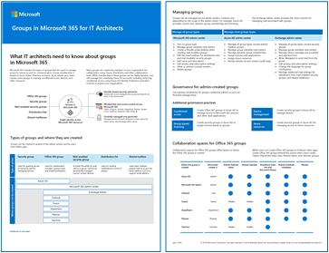

# Interaktion mellan grupptjänsterGroups services interactions

Microsoft 365 Grupper är ett vanligt material för flera tjänster och arbetsbelastningar på Microsoft 365-plattformen för att ge slutanvändarna en uppkopplad upplevelse.Microsoft 365 Groups provides a common fabric for a number of services and workloads within the Microsoft 365 platform to deliver a connected experience for end-users. Det finns en grupp Microsoft 365 tillhandahåller följande:At its core, a Microsoft 365 group exists to provide:

- Ett sätt att hantera medlemskapet (Azure AD)A way to manage the membership (Azure AD)
- En plats där meddelanden och konversationer äger rum (Exchange postlåda, Microsoft Teams, Yammer)A place for messaging and conversations to take place (Exchange mailbox, Microsoft Teams, Yammer)
- En plats där filer ska lagras (SharePoint)A place for files to be stored (SharePoint)
- En kalender för schemaläggning (Exchange)A calendar for scheduling (Exchange)
- En anteckningsbok för att spara anteckningar (OneNote)A notebook for capturing notes (OneNote)

När grupper skapas etableras även ett antal andra resurser, men de visas inte förrän första gången nås från tjänsten:At the point of group creation, a number of other resources are also provisioned, however they are not visible until accessed for the first time from the service:

- En tavla för hantering av gruppuppgifter (Planner)A board for managing group tasks (Planner)
- En arbetsyta för rapportering (Power BI)A workspace for reporting (Power BI)
- Ett område för delade videor (Microsoft Stream)An area for shared videos (Microsoft Stream)
- Ett område för delade formulär (formulär)An area for shared forms (Forms)

I Microsoft 365 funktioner kan andra tjänster interagera med Microsoft 365 grupper för att ge ytterligare funktioner till gruppmedlemmarna.Across Microsoft 365, other services are able to interact with Microsoft 365 groups to deliver additional functionality and capabilities to group members.
Exempel på detta är:Examples of this include:

- Power Apps för apparPower Apps for apps
- Power Automate för arbetsflödenPower Automate for workflows
- Project på webben och Översikt över vattenfallsbaserad projekthanteringProject on the web and Roadmap for waterfall-based project management
- Teams för kanalbaserade konversationerTeams for channel-based conversations
- Yammer för intressegrupperYammer for communities of interest

## Användarinteraktion med grupperUser interactions with groups

Microsoft 365 Grupper kan skapas och hanteras från en mängd olika gränssnitt, både av administratörer och slutanvändare.Microsoft 365 Groups can be created and managed from a variety of interfaces, both by administrators and end-users. 

### Administrativa funktionerAdministrative experiences

Administratörer kan skapa och hantera Microsoft 365 grupper från flera av administrationscentret för arbetsbelastningen, kommandoradsgränssnitt som stöder skript samt egna appar som interagerar med Graph API.Administrators can create and manage Microsoft 365 groups from several of the workload admin centers, command-line interfaces that support scripting, as well as custom-built apps interacting with the Graph API. Det enda undantaget är Yammer grupper – som måste skapas från Yammer webbgränssnittet.The only exception to this is Yammer groups – which must be created from within the Yammer web interface.

**Relaterade inställningar****Related settings**

I de olika administrativa gränssnitten som kan hantera gruppinställningar finns det flera överlappningar som du bör känna till.Across the various administrative interfaces that can manage group settings exists several overlaps which you should be aware of.

**Administrationscentret för Microsoft 365****Microsoft 365 admin center**

I Microsoft 365 är gäståtkomst i grupper aktiverad som standard, vilket är möjligheten att låta ägare lägga till gäster.In the Microsoft 365 admin center, guest access to Groups is enabled by default, as is the ability to allow owners to add guests. Det finns inga ytterligare kontroller på organisationsnivå för grupper i det här administrationscentret.There are no further organization-level controls available for Groups from this admin center.

**Administrationscenter för Azure AD****Azure AD admin center**

I administrationscentret för Azure AD finns kontroller för huruvida användare kan skapa grupper eller tilldela ägare i Azure-portaler, samt inställningar för förfallo- och namnprinciper.The Azure AD admin center offers controls around whether users can create Groups or assign owners in Azure portals, as well as expiration and naming policy settings.

Administrationscentret innehåller också ett antal åtgärder för gästinbjudan som går utöver de som finns i Microsoft 365-administrationscentret, till exempel möjlighet att begränsa huruvida icke-ägare också kan bjuda in gästerThe admin center also provides a number of guest invitation control measures that go beyond that of the Microsoft 365 admin center, such as the ability to limit whether non-owners can also invite guests

**SharePoint****SharePoint**

SharePoint skapas med säkerhetsgrupper som ägare, medlemmar och besökare, med de två första som matchar deras Microsoft 365-gruppmotsvarsvarumer.SharePoint sites are created with Owner, Member and Visitor security groups, with the first two matching up to their Microsoft 365 Group counterparts. Medlemskap för SharePoint onlinewebbplatser hanteras i allmänhet av den associerade Microsoft 365-gruppen, men det är inte en dubbelriktad relation.While membership for SharePoint Online sites is generally managed by the associated Microsoft 365 Group, it is not a bidirectional relationship. Ändringar av medlemskap på Microsoft 365-gruppnivå återspeglas i SharePoint, men om medlemskapet ändras i SharePoint-gruppen återspeglas inte detta i Microsoft 365-gruppen.Any changes to membership at the Microsoft 365 group level are reflected in SharePoint, however if membership is changed in the SharePoint group, this is not reflected in the Microsoft 365 group.

### AnvändarupplevelserUser experiences

Slutanvändarna kan skapa grupper från flera av tjänsterna Microsoft 365 och i andra kan de bara dela med en grupp.End users can create groups from several of the services within Microsoft 365, and in others they can only share with a group.

Följande tjänster gör det möjligt att skapa grupper av slutanvändare:The following services allow creation of groups by end users:
                         
Outlook Planner Project för webben SharePoint Streama Microsoft Teams YammerOutlook Planner Project for the web SharePoint  Stream  Microsoft Teams Yammer

**Begränsning när grupper skapas****Restriction of group creation**

En vanlig metod för att styra utstråningen av team är att begränsa vilka användare som kan skapa dem.A common approach to control sprawl of teams is to limit which users can create them. Det kan bara göras genom att begränsa skapandet av grupper.This can only be done by limiting the creation of groups. Det här påverkar möjligheten att skapa grupper från andra tjänster där det kan vara nödvändigt för slutanvändaren.Doing this impacts the ability to create groups from other services where that may be necessary for end-user. Microsoft 365 Grupper stöder inte möjligheten att begränsa skapandet av grupper från vissa appar eller tjänster samtidigt som det är tillåtet från andra.Microsoft 365 Groups does not support the ability to restrict the creation of groups from some apps or services while allowing it from others.

Upplevelsen av att skapa gruppbegränsningar varierar mellan program och tjänster:The experience of group creation restriction varies between apps and services:

|App eller tjänstApp or service|UpplevelseExperience|
|:-------------|:---------|
|OutlookOutlook|**Alternativet Ny** grupp tas bort från menyn Nytt på sidan Personer**New group** option is removed from New menu in people page|
|PlannerPlanner|**Ny plan** förklarar att skapande av grupper har inaktiverats och ger möjlighet att lägga till planen i en befintlig grupp**New plan** explains that group creation has been turned off and offers to add the plan to an existing group|
|Project för webben och ÖversiktProject for the web and Roadmap|**På menyn Skapa** grupp förklaras att skapandet av grupper är begränsat och föreslår att en befintlig grupp används.**Create group** menu explains that group creation is restricted and suggests using an existing group.|
|SharePointSharePoint|Det går fortfarande att skapa en gruppwebbplats som inte är ansluten till en grupp.Still able to create a team site that is not connected to a group.|
|StreamStream|**Gruppalternativet** visas inte under **menyn Skapa.****Group** option does not appear under the **Create menu**.|
|TeamsTeams|Användaren kan inte skapa ett team med en ny grupp men kan fortfarande skapa ett team som använder en befintlig grupp.User cannot create a team with a new group but can still create a team that utilizes an existing group.  **Knappen Skapa ett team** ersätts med **Skapa team från en grupp.****Create a team** button is replaced with **Create team from a group**.|
|YammerYammer|**Alternativet Skapa en grupp** tas bort från huvudnavigeringen för grupper/communities.**Create a group** option is removed from main Groups/Communities navigation.|

## Interaktion mellan tjänster med grupperServices interactions with groups

I postern Grupper Microsoft 365 du information om olika typer av grupper, hur de skapas och hanteras samt några rekommendationer om styrning.See the Groups in Microsoft 365 poster for information about different types of groups, how these are created and managed, and a few governance recommendations.

[PDF](https://github.com/MicrosoftDocs/microsoft-365-docs/raw/public/microsoft-365/downloads/msft-m365-groups.pdf) \| [Visio](https://github.com/MicrosoftDocs/OfficeDocs-Enterprise/raw/live/Enterprise/downloads/msft-m365-groups.vsdx)[PDF](https://github.com/MicrosoftDocs/microsoft-365-docs/raw/public/microsoft-365/downloads/msft-m365-groups.pdf) \| [Visio](https://github.com/MicrosoftDocs/OfficeDocs-Enterprise/raw/live/Enterprise/downloads/msft-m365-groups.vsdx)

Följande tabell innehåller en översikt över hur Microsoft 365 grupper interagerar med olika tjänster:The following table provides an overview of Microsoft 365 Groups interactions with various services:

|ProduktProduct|FunktionerFeatures|Gör tjänstenDoes the service finns det ingen grupp?exist without a group?|Kan tjänstenCan the service skapa en grupp?create a group?|Tar bortDoes deleting the instans ta bort gruppen?instance delete the group?|
|:---|:---|:---|:---|:---|
|Azure ADAzure AD|Medlemskap, gruppkontroller, gästerMembership, Group controls, Guests|JaYes|JaYes|JaYes|
|ExchangeExchange|Kalender, postlådaCalendar, mailbox|JaYes|JaYes|JaYes|
|FormsForms|FormulärForm|JaYes|NejNo|NejNo|
|OneNoteOneNote|AnteckningsbokNotebook|JaYes|NejNo|NejNo|
|PlannerPlanner|UppgiftstavlaTask board|NejNo|JaYes|JaYes|
|Power Apps appenPower Apps app|ProgramApp|JaYes|NejNo|NejNo|
|Power AutomatePower Automate|ArbetsflödeWorkflow|JaYes|NejNo|NejNo|
|Power BI (klassisk)Power BI (classic)|WorkspaceWorkspace|NejNo|JaYes|JaYes|
|Power BI (nytt)Power BI (new)|WorkspaceWorkspace|JaYes|NejNo|JaYes|
|Project för webbenProject for the web|Project abonnemangProject plan|JaYes|JaYes|NejNo|
|ÖversiktRoadmap|ÖversiktRoadmap|JaYes|JaYes|NejNo|
|SharePointSharePoint|WebbplatsSite|JaYes|JaYes|JaYes|
|StreamStream|Kanal, videoChannel, video|JaYes|JaYes|JaYes|
|TeamsTeams|TeamTeam|NejNo|JaYes|JaYes|
|YammerYammer|GruppGroup|JaYes|JaYes|JaYes|

Även om tabellen ovan ger en översikt över gruppinteraktion med Microsoft 365 tjänster, finns det ett antal nyanser och inveckligheter som du bör förstå.While the table above provides a high-level overview of group interactions with Microsoft 365 services, there are a number of nuances and intricacies that you should understand. I följande avsnitt får du en mer detaljerad bild av de specifika arbetsbelastningara och deras interaktioner med grupper.The following sections take a more in-depth look at the specific workloads and their interactions with groups.

## Azure ADAzure AD

Azure AD tillhandahåller underliggande identitetshanteringsfunktioner i hela Microsoft 365.Azure AD provides the underlying identity management capabilities across Microsoft 365.

**Huvudfunktioner för grupper****Key features provided to Groups**

- GruppmedlemskapGroup membership
- NamnprincipNaming policy
- FörfalloprincipExpiration policy
- GästerGuests
- Begränsning av skapande av gruppRestriction of Group creation

**Kan Azure AD skapa en grupp?****Can Azure AD create a Group?**

Ja, Microsoft 365 grupper kan skapas från Azure AD via administrationswebbportalen, via PowerShell eller via Graph API.Yes, Microsoft 365 Groups can be created from Azure AD either through the administration web portal, through PowerShell, or Graph API.

**Finns Azure AD utan grupp?****Does Azure AD exist without a group?**

Ja, Azure AD utför ett stort antal tjänster som inte har någon relation till Microsoft 365 Groups.Yes, Azure AD performs a great number of services that have no relation to Microsoft 365 Groups. Varje Microsoft 365 representeras som ett objekt i Azure AD.Each Microsoft 365 group is represented as an object in Azure AD.

**Kan det finnas flera instanser av Azure AD per grupp?****Can there be multiple instances of Azure AD per Group?**

Nej, det finns bara en instans av Azure AD.No, there is only one instance of Azure AD.

**Kan Azure AD associeras med flera grupper?****Can Azure AD be associated with multiple Groups?**

Ja, eftersom Azure AD är den underliggande plattform som tillhandahåller tjänsten för gruppmedlemskap.Yes, because Azure AD is the underlying platform that provides the group membership service.

**Kan Azure AD:s koppling till en grupp ändras?****Can Azure AD’s association with a group change?**

Nej, Azure AD är den underliggande plattformen där grupper finns.No, Azure AD is the underlying platform where groups exist.

**Raderas gruppen om instansen tas bort?****Does deleting the instance delete the Group?**

Om du tar bort gruppen i Azure AD tas relevanta grupprelaterade tjänster och relevant innehåll bort.Deleting the group in Azure AD will delete relevant group-associated services and content.

## TeamsTeams

Teams är en chattcentreerad arbetsyta som försöker förbättra samarbetet genom att tillhandahålla ett enda gränssnitt som interagerar med olika Microsoft- och tredjepartstjänster.Teams is a chat-centered workspace aimed at enhancing collaboration by providing a singular interface to interact with a variety of Microsoft and third-party services.

Som standard döljs postlådan och kalendern som är kopplad till Microsoft 365-gruppen från både den globala adresslistan i Exchange och Outlook.By default, when a team is created, the mailbox and calendar associated with the Microsoft 365 group are hidden from both the Global Address List in Exchange, as well as Outlook. Administratören kan manuellt åsidosätta detta om användaren vill använda både Outlook och Teams i samma Microsoft 365 grupp.This can be manually overridden by an administrator if the user would like to use both Outlook and Teams on the same Microsoft 365 Group.

**Huvudfunktioner för grupper****Key features provided to Groups**

- KonversationerConversations
- Kanaler & flikarChannels & tabs
- MötenMeetings

**Kan Teams skapa en grupp?****Can Teams create a group?**

Ja, när du skapar ett nytt team skapas en ny Microsoft 365 grupp.Yes, creating a new team will create a new Microsoft 365 group. Det går även att skapa ett team för en befintlig grupp som inte har någon för närvarande.It is also possible to create a team for an existing group that does not currently have one.

**Finns grupper utan en grupp?****Do teams exist without a group?**

Nej, det går inte att ha ett team utan en grupp.No, it is not possible for a team to exist without a Group.

**Kan det finnas flera team per grupp?****Can there be multiple teams per group?**

Nej, relationen mellan ett team och en grupp är 1:1.No, the relationship between a team and a group is 1:1.

**Kan ett team associeras med flera grupper?****Can a team be associated with multiple groups?**

Nej, själva teamet kan bara associeras med en enda grupp.No, the team itself can only be associated with a single group.

**Kan ett teams koppling till en grupp ändras?****Can a team’s association with a group change?**

Nej, teamet kan aldrig bara associeras med gruppen som det ursprungligen var kopplat till.No, the team can only ever be associated with the group to which it was originally associated.

**Raderas gruppen om du tar bort teamet?****Does deleting the team delete the group?**

Ja, om du tar Microsoft Teams gruppen i gruppen tas gruppen, grupprelaterade tjänster och innehåll bort.Yes, deleting the team in Microsoft Teams will delete the group, group-associated services, and content.

## ExchangeExchange

Exchange Online får meddelandefunktioner, kalenderfunktioner, kontakter och tillhörande funktioner.Exchange Online provides messaging, calendar, contact, and associated functionality. Inom en grupp är endast en enda resurs associerad – i motsats till en hel tjänstinstans.In the context of a Group, only a single resource is associated – as opposed to an entire service instance.

**Huvudfunktioner för grupper****Key features provided to Groups**

- Postlåda och kalenderMailbox and calendar
- Möjlighet att skicka e-post till alla gruppmedlemmarAbility to email all Group members
- Storage av Teams kanalkonversationer i eDiscovery-syfte, Planner-kommentarerStorage of Teams channel conversations for eDiscovery purposes, Planner comments

**Kan Exchange skapa en grupp?****Can Exchange create a group?**

Ja, det går att skapa en grupp Exchange Online administrationscentret och från Outlook.Yes, it is possible to create a group from the Exchange Online admin center, as well as from Outlook. Du kan också konvertera Exchange distributionslistor till Microsoft 365 grupper.You can also convert Exchange distribution lists to Microsoft 365 groups.

**Finns Exchange någon grupp?****Does Exchange exist without a Group?**

Ja, Exchange Online tillhandahåller ett antal tjänster, inklusive delade postlådor och kalendrar, utan någon gruppassociatorganisation.Yes, Exchange Online provides a number of services, including shared mailboxes and calendars, without any group association.

**Kan det finnas flera instanser Exchange postlådor eller kalendrar per grupp?****Can there be multiple instances of Exchange mailboxes or calendars per group?**

Nej, det kan bara finnas Exchange Online postlåda och kalender för en grupp.No, there can only be a single Exchange Online mailbox and calendar for a group.

**Kan Exchange postlådor och kalendrar associeras med flera grupper?****Can Exchange mailboxes and calendars be associated with multiple groups?**

Nej, postlådan och kalendern har en 1:1-relation med gruppen.No, the mailbox and calendar have a 1:1 relationship with the group. Det går att dela postlådan med andra användare eller grupper, men det skapar ingen form av tjänstassociating.It is possible to share the mailbox with other users or groups, however this does not establish any form of service association.

**Kan Exchange postlådans eller kalenderns koppling till en grupp ändras?****Can the Exchange mailbox or calendar’s association with a group change?**

Nej, postlådan och kalendern kan inte ändras till en annan grupp.No, the mailbox and calendar   cannot be changed to a different group. Innehållet kan dock flyttas från en postlåda till en annan inom Outlook eller med hjälp av ett verktyg från tredje part.However, the content can be moved from one mailbox to another within Outlook or by using a third-party tool.

**Tas gruppen bort när du tar bort postlådan?****Does deleting the mailbox delete the group?**

Ja, om du tar Exchange postlådan i ett e-postkonto tas gruppen samt grupprelaterade tjänster och innehåll bort.Yes, deleting the mailbox in Exchange will delete the group as well as group-associated services and content.

## FormsForms

Forms tillhandahåller webbaserade undersökningar och test.Forms provides web-based surveys and quizzes.

**Huvudfunktioner för grupper****Key features provided to groups**

- Äganderätt till formulärOwnership of forms

**Kan formulär skapa en grupp?****Can Forms create a group?**

Nej, Formulär kan inte skapa en grupp.No, Forms cannot create a group.

**Finns formulär utan grupp?****Do forms exist without a group?**

Ja, undersökningar och test kan skapas direkt i en slutanvändares konto.Yes, surveys and quizzes can be created directly in an end-user’s account.

**Kan det finnas flera formulär per grupp?****Can there be multiple forms per group?**

Ja, det kan finnas flera formulär kopplade till en grupp.Yes, there can be multiple forms associated with a group.

**Kan formulär kopplas till flera grupper?****Can forms be associated with multiple groups?**

Nej, ett formulär kan bara associeras med en enda grupp.No, a form can only be associated with a single group.

**Kan ett formulärs koppling till en grupp ändras?****Can a form’s association with a group change?**

Nej, när ett formulär är kopplat till en grupp (skapas direkt i, eller ägarskap som överförs från en enskild person) kan det inte flyttas till en annan grupp.No, once a form is associated with a group (either created directly within, or ownership transferred from an individual) it cannot be moved to another group.

**Tas gruppen bort när du tar bort formuläret?****Does deleting the form delete the group?**

Nej, det går inte att ta bort en grupp från Forms-gränssnittet, bara enskilda formulär.No, it is not possible to delete a group from the Forms interface, only individual forms.

## OneNoteOneNote

OneNote är ett digitalt anteckningsboksprogram.OneNote is a digital notebook application. Den OneNote som skapats med en grupp är en fil på den associerade SharePoint-webbplatsen i stället för en gruppansluten tjänst.The OneNote notebook created with a group is a file in the associated SharePoint site rather than a group-connected service.

**Huvudfunktioner för grupper****Key features provided to groups**

- Delad anteckningsbok (lagrad i det grupprelaterade SharePoint anteckningsboksbiblioteket)Shared notebook (stored in the Group-associated SharePoint library)

**Kan OneNote skapa en grupp?****Can OneNote create a group?**

Nej, OneNote kan inte skapa en grupp.No, the OneNote application cannot create a group.

**Finns OneNote utan grupp?****Do OneNote notebooks exist without a group?**

Ja, anteckningsböcker kan skapas direkt i OneDrive eller på andra delade platser.Yes, notebooks can be created directly in OneDrive or in other shared locations.

**Kan det finnas flera OneNote anteckningsböcker per grupp?****Can there be multiple OneNote notebooks per group?**

Ja, en anteckningsbok skapas som standard och andra kan läggas till, men alla länkar till OneNote från grupprelaterade tjänster går alltid till standardanteckningsboken.Yes, a notebook is created by default and others can be added, however any link to OneNote from group-associated services will always go to the default notebook.

**Kan en OneNote associeras med flera grupper?****Can a OneNote notebook be associated with multiple groups?**

Nej, anteckningsboken lagras i det grupprelaterade SharePoint och länkas från olika gränssnitt.No, the notebook is stored in the group-associated SharePoint site library and linked from various interfaces. Men den kan delas med andra grupper på samma sätt som den kan delas med enskilda personer.It can however be shared with other Groups in the same way it can be shared with individuals.

**Kan anteckningsbokens koppling till en grupp ändras?****Can the notebook’s association with a group change?**

Nej, själva anteckningsboken är kopplad till gruppen och kan kommas åt direkt från andra gruppanslutna tjänster, men innehållet kan flyttas från en anteckningsbok till en annan i OneNote program.No, the notebook itself is associated with the group and can be directly accessed from other group-connected services, however the content can be moved from one notebook to another within the OneNote application.

**Tas gruppen bort när du tar bort anteckningsboken?****Does deleting the notebook delete the group?**

Nej, men om anteckningsboken OneNote bort kan det finnas brutna länkar i vissa grupprelaterade tjänster.No, however if the OneNote notebook is deleted there may be broken links in some of the group-associated services.

## PlannerPlanner

Planner är en enkel tjänst för uppgiftshantering för grupper.Planner is a lightweight  group task management service.

**Huvudfunktioner för grupper****Key features provided to groups**

- Tavla för hantering av gruppuppgifterBoard for managing group tasks

**Kan Planner skapa en grupp?****Can Planner create a group?**

Ja, när du skapar en plan skapas en ny grupp.Yes, creation of a plan will create a new group.

**Finns det en Planner-tavla utan en grupp?****Does a Planner board exist without a group?**

Nej, en plan måste vara kopplad till en grupp.No, a plan must be associated with a group.

**Kan det finnas flera planer per grupp?****Can there be multiple plans per group?**

Ja, det kan finnas flera planer per grupp.Yes, there can be multiple plans per group.

**Kan en plan associeras med flera grupper?****Can a plan be associated with multiple groups?**

Nej, en plan förlitar sig enbart på gruppmedlemskapet för att avgöra åtkomsten.No, a plan relies solely on the group membership to determine access.

**Kan en plans koppling till en grupp ändras?****Can a plan’s association with a group change?**

Nej, men när en plan kopieras skapas en ny grupp.No, however copying a plan creates a new group.

> [!NOTE]
> En grupp som har skapats av ett annat program visas inte automatiskt i Planner för en användare.A Group created by any other application will not show up in Planner automatically for a user. För att komma åt tavlan först måste de öppna den från ett annat gruppbaserat gränssnitt, till exempel från Outlook.To access the board initially they will need to open it from another Group-based interface such as Outlook.

**Tas gruppen bort när planen tas bort?****Does deleting the plan delete the group?**

Ja, om du tar bort planen tas gruppen och grupprelaterade tjänster och innehåll bort.Yes, deleting the plan will delete the group and group-associated services and content.

## Power AppsPower Apps

Power Apps en arbetsyta för apputveckling utan kod.Power Apps provides a canvas for app development without code.

**Huvudfunktioner för grupper****Key features provided to Groups**

- Appar kan delas med en grupp som ska köras och ändrasApps can be shared with a group to be run and modified

**Kan Power Apps skapa en grupp?****Can Power Apps create a group?**

Nej, Power Apps inte skapa en Microsoft 365 grupp.No, Power Apps cannot create a Microsoft 365 group.

**Finns Power Apps utan en grupp?****Do Power Apps exist without a group?**

Ja, appar kan skapas i Power Apps och finnas i creators-kontot tills de delas eller publiceras.Yes, apps can be created within Power Apps and reside within the creators account until shared or published.

**Kan det finnas flera appar per grupp?****Can there be multiple apps per group?**

Ja, det kan finnas flera program som delas med en grupp.Yes, there can be multiple apps shared with a group.

**Kan appar kopplas till flera grupper?****Can apps be associated with multiple groups?**

Ja, en app kan delas med flera grupper.Yes, an app can be shared with multiple groups.

**Kan en apps koppling till en grupp ändras?****Can an app’s association with a group change?**

Ja, eftersom kopplingen mellan Power Apps och en Microsoft 365 bara delas – appen finns fortfarande kvar hos skaparen.Yes, as the association between Power Apps and a Microsoft 365 group is sharing only – the app still resides with the creator.

> [!IMPORTANT]
> [Grupper måste vara säkerhetsaktiverade innan appar kan delas med dem.](/powerapps/maker/canvas-apps/share-app#share-an-app-with-office-365-groups)[Groups must be security enabled before apps can be shared with them](/powerapps/maker/canvas-apps/share-app#share-an-app-with-office-365-groups).

**Raderas gruppen om du tar bort programmet?****Does deleting the app delete the group?**

Nej, apparna är inte kopplade till den andra gruppen än den som delas med dem.No, the apps are not connected to the group other than being shared with them.

## Power AutomatePower Automate

Power Automate (kallades tidigare för Microsoft Flow) innehåller arbetsflöden och automatiseringstjänster.Power Automate (formerly known as Microsoft Flow) provides workflows and automation services.

**Huvudfunktioner för grupper****Key features provided to groups**

- Arbetsflöden kan delas med en grupp som ska köras och ändras.Workflows can be shared with a group to be run and modified.

**Kan Power Automate skapa en grupp?****Can Power Automate create a group?**

Nej, Power Automate kan inte skapa Microsoft 365 grupp i samband med att den kopplas till en.No, Power Automate cannot create a Microsoft 365 group in the context of being associated with one.

Det går dock att skapa ett flöde som utför olika åtgärder, till exempel skapa en Azure AD-säkerhetsgrupp eller uppdatera medlemskap i en Microsoft 365 grupp.It is possible however to create a flow that performs various operations such as creating an Azure AD security group or updating membership of a Microsoft 365 group.

**Finns flöden utan grupp?****Do flows exist without a group?**

Ja, flöden kan skapas inom Power Automate och finnas i creators-kontot tills de delas eller publiceras.Yes, flows can be created within Power Automate and reside within the creators account until shared or published.

**Kan det finnas flera flöden per grupp?****Can there be multiple flows per group?**

Ja, det kan finnas flera flöden som delas med en grupp.Yes, there can be multiple flows shared with a group.

**Kan ett flöde associeras med flera grupper?****Can a flow be associated with multiple groups?**

Ja, ett flöde kan delas med flera grupper.Yes, a flow can be shared with multiple groups.

**Kan ett flödes koppling till en grupp ändras?****Can a flow’s association with a group change?**

Ja, eftersom kopplingen mellan Power Automate och en Microsoft 365 bara delas – finns flödet fortfarande kvar hos skaparen.Yes, as the association between Power Automate and a Microsoft 365 group is sharing only – the flow still resides with the creator.

**Tas gruppen bort när du tar bort ett flöde?****Does deleting a flow delete the group?**

Nej, Power Apps inte direkt till den andra gruppen än den som delas med dem.No, like Power Apps, the flows are not connected to the group other than being shared with them.

## Power BI (klassisk)Power BI (classic)

Power BI interaktiva datadrivna instrumentpaneler och rapporter.Power BI provides interactive data-driven dashboards and reports.

**Huvudfunktioner för grupper****Key features provided to groups**

- DatarapporteringData reporting

**Kan Power BI skapa en grupp?****Can Power BI create a group?**

Ja, när du skapar en klassisk arbetsyta skapas Microsoft 365 grupp.Yes, creating a classic workspace will create a Microsoft 365 group.

**Finns det Power BI klassiska arbetsytan utan en grupp?****Does a Power BI classic workspace exist without a group?**

Nej, [en klassisk arbetsyta i Power BI måste associeras med en grupp](/power-bi/collaborate-share/service-collaborate-power-bi-workspace).No, [a classic workspace in Power BI must be associated with a group](/power-bi/collaborate-share/service-collaborate-power-bi-workspace).

**Kan det finnas Power BI arbetsytor per grupp?****Can there be multiple Power BI workspaces per group?**

Nej, relationen mellan en klassisk arbetsyta och en grupp är 1:1.No, the relationship between a classic workspace and a group is 1:1.

**Kan en arbetsyta kopplas till flera grupper?****Can a workspace be associated with multiple groups?**

Tekniskt sett är det inget, men när den klassiska arbetsytan skapas med gruppen kan innehållet delas utanför gruppen med användare och säkerhetsgrupper.Technically no, while the classic workspace is created with the group, the content can be shared outside of the Group with users and security groups.

**Kan arbetsytans koppling till en grupp ändras?****Can the workspace's association with a group change?**

Nej, den klassiska arbetsytan är kopplad till gruppen, men innehållet kan flyttas från en arbetsyta till en annan i Power BI gränssnittet eller genom att exportera innehåll lokalt.No, the classic workspace itself is associated with the Group, however the content can be moved from one workspace to another within the Power BI interface or by exporting contents locally.

**Tas gruppen bort när du tar bort arbetsytan?****Does deleting the workspace delete the group?**

Ja, om du tar bort arbetsytan Power BI grupp- och grupprelaterade tjänster och innehåll.Yes, deleting the workspace in Power BI will delete group and  group-associated services and content.

## Power BI (nytt)Power BI (new)

Power BI interaktiva datadrivna instrumentpaneler och rapporter.Power BI provides interactive data-driven dashboards and reports.

När du skapar en ny arbetsyta i Power BI skapas inte en Microsoft 365-grupp, och om du skapar en grupp på något annat sätt skapas en ny (inte klassisk) arbetsyta i Power BI.While creating a new workspace in Power BI does not create a Microsoft 365 Group, creating a group by any other means creates a  new (not classic) workspace in Power BI.

**Huvudfunktioner för grupper****Key features provided to groups**

- DatarapporteringData reporting

**Kan Power BI skapa en grupp?****Can Power BI create a group?**

Nej, det går inte att skapa en Microsoft 365 från det nya Power BI gränssnittet.No, it is not possible to create a Microsoft 365 group from the new Power BI interface.

**Finns den nya Power BI arbetsytan utan en grupp?****Does the new Power BI workspace exist without a group?**

Ja, det går att skapa rapporter och arbetsytor i Power BI som inte är kopplade Microsoft 365 grupper.Yes, it is possible to have reports and workspaces created in Power BI that are not associated with Microsoft 365 groups.

**Kan det finnas flera arbetsytor per grupp?****Can there be multiple workspaces per group?**

Ja, [flera arbetsytor som skapas Power BI kan delas med en enda grupp](/power-bi/collaborate-share/service-create-the-new-workspaces#give-access-to-your-workspace).Yes, [multiple workspaces created by Power BI can be shared with a single group](/power-bi/collaborate-share/service-create-the-new-workspaces#give-access-to-your-workspace).

**Kan en arbetsyta kopplas till flera grupper?****Can a workspace be associated with multiple groups?**

Nej, en arbetsyta som skapats Power BI bara kan kopplas till en enda grupp.No, a workspace created by Power BI can only be associated with a single group.

**Kan en arbetsytas koppling till en grupp ändras?****Can a workspace's association with a group change?**

Ja och nej.Yes and no. En arbetsyta som Power BI kan bara associeras med en enskild grupp i taget, men du kan när som helst ändra kopplingen.A workspace created by Power BI can only be associated with a single group at a time but can change the association at any time. En arbetsyta som Power BI av en grupp är permanent kopplad till den gruppen.A workspace created in Power BI by a group is permanently associated to that group.

**Tas gruppen bort när du tar bort arbetsytan?****Does deleting the workspace delete the group?**

Ja, om du tar bort arbetsytan Power BI gruppen och grupprelaterade tjänster och innehåll tas bort.Yes, deleting the workspace in Power BI will delete the group and group-associated services and content.

## Project för webbenProject for the web

Project för webben har möjlighet att skapa projektplaner, Gantt-diagram och översikter.Project for the web offers the ability to create project plans, Gantt charts, and roadmaps.
Huvudfunktioner för grupper.Key features provided to groups.

- Project abonnemangProject plans

**Kan Project för webben skapa en grupp?****Can Project for the web create a group?**

Ja, det går att skapa en ny Microsoft 365 direkt från Project för webben.Yes, it is possible to create a new Microsoft 365 group directly from Project for the web.

**Finns det projekt utan en grupp?****Do projects exist without a group?**

Ja, det kan finnas projekt utan att vara kopplade Microsoft 365 en grupp, men tilldelning av aktiviteter kräver gruppassociat koppling.Yes, projects can exist without being associated with a Microsoft 365 group, however assignment of tasks requires group association.

**Kan det finnas flera projekt per grupp?****Can there be multiple projects per group?**

Ja, det går att ansluta flera projekt i en enda grupp.Yes, it is possible to connect multiple projects in a single group.

**Kan projektet associeras med flera grupper?****Can project be associated with multiple groups?**

Nej, ett projekt kan bara associeras med en enda grupp.No, a project can only be associated with a single group.

**Kan ett projekts koppling till en grupp ändras?****Can a project’s association with a group change?**

Nej, när kopplingen till en grupp har upprättats kan den inte ändras.No, once the association with a group is established, it cannot change.

**Tas gruppen bort när du tar bort projektet?****Does deleting the project delete the group?**

Nej, gruppen tas inte bort om Project för webben tas bort.No, deleting the project in Project for the web will not delete the group.

## ÖversiktRoadmap

Översikt ger möjlighet att skapa projektöversikter med Project för webben och Project Online.Roadmap provides the ability to create project roadmaps with Project for the web and Project Online.

**Huvudfunktioner för grupper****Key features provided to Groups**

- Project översikterProject roadmaps

**Kan Översikt skapa en grupp?****Can Roadmap create a group?**

Ja, det går att skapa en ny Microsoft 365 direkt från översikten.Yes, it is possible to create a new Microsoft 365 group directly from roadmap.

**Finns Översikt utan grupp?****Does Roadmap exist without a group?**

Ja, översikter kan finnas utan att vara kopplade till Microsoft 365 grupp, men för delning av översikten krävs gruppassociat koppling.Yes, roadmaps can exist without being associated with a Microsoft 365 group, however sharing the roadmap requires group association.

**Kan det finnas flera översikter per grupp?****Can there be multiple roadmaps per group?**

Ja, det går att ansluta flera översikter till en enda grupp.Yes, it is possible to connect multiple roadmaps to a single group.

**Kan en översikt associeras med flera grupper?****Can a roadmap be associated with multiple groups?**

Nej, en översikt kan bara associeras med en enda grupp.No, a roadmap can only be associated with a single group.

**Kan en översiktsorganisation med en grupp ändras?****Can a roadmap's association with a group change?**

Nej, när kopplingen till en grupp har upprättats kan den inte ändras.No, once the association with a group is established, it cannot change.

**Tas gruppen bort när du tar bort översikten?****Does deleting the roadmap delete the group?**

Nej, gruppen tas inte bort när du tar bort översikten.No, deleting the roadmap will not delete the group.

## SharePointSharePoint

SharePoint är en webbaserad innehållshanteringsplattform som bland annat tillhandahåller lagringstjänster för ett antal Microsoft 365 tjänster.SharePoint is a web-based content management platform that provides among other things, storage services for a number of Microsoft 365 services.

**Huvudfunktioner för grupper****Key features provided to Groups**

- DokumentbibliotekDocument library
- Bibliotek för lagring av OneNote anteckningsbokLibrary for storage of OneNote notebook
- Storage av Teams wiki-filerStorage of Teams wiki files

**Kan SharePoint skapa en grupp?****Can SharePoint create a group?**

Ja, när du skapar en gruppwebbplats i SharePoint skapas en Microsoft 365 grupp som standard.Yes, creating a team site in SharePoint will create a Microsoft 365 group by default. Det går även att skapa en grupp och, om du vill, ett team för en befintlig webbplats.It is also possible to create a group and, optionally, a team for an existing site.

**Finns SharePoint webbplatser utan en grupp?****Do SharePoint sites exist without a group?**

Ja, SharePoint erbjuder ett antal icke-grupprelaterade tjänster och webbplatser, till exempel kommunikations- och navplatser.Yes, SharePoint offers a number of non-group-associated services and sites such as communication and hub sites. 

**Kan det finnas flera webbplatser per grupp?****Can there be multiple sites per group?**

Nej, det kan bara finnas en webbplats per grupp.No, there can only be a single site per group. Privata kanaler i Teams använder ytterligare webbplatser som inte är kopplade till gruppen.Private channels in Teams use additional sites that are not connected to the group.

**Kan webbplatser kopplas till flera grupper?****Can sites be associated with multiple groups?**

Tekniskt sett är det inget, men när en webbplats skapas med en grupp kan innehållet delas med andra grupper.Technically no, but while a site is created with a group, the content can be shared with other groups.

**Kan en webbplats koppling till en grupp ändras?****Can a site’s association with a group change?**

Nej, själva webbplatsen är kopplad till gruppen, men innehållet kan flyttas från en webbplats till en annan i SharePoint-gränssnittet, genom att exportera innehåll lokalt eller med hjälp av ett tredjepartsverktyg.No, the site itself is associated with the group, however the content can be moved from one site to another within the SharePoint interface, by exporting content locally, or by using a third-party tool.

**Raderas gruppen om du tar bort webbplatsen?****Does deleting the site delete the group?**

Ja, om du tar bort SharePoint gruppwebbplatser tas grupp- och grupprelaterade tjänster och innehåll bort.Yes, deleting the site in SharePoint will delete group and group-associated services and content.

## StreamStream

Microsoft Stream är en videovärd och delningsplattform.Microsoft Stream is a video hosting and sharing platform.

**Huvudfunktioner för grupper****Key features provided to Groups**

- VideolagringVideo storage
- Teams mötesinspelningTeams meeting recording
- VideokanalerVideo channels

**Kan Stream skapa en grupp?****Can Stream create a group?**

Ja, det går att skapa en ny Microsoft 365 direkt från Stream.Yes, it is possible to create a new Microsoft 365 group directly from Stream.

**Finns Stream utan en grupp?****Does Stream exist without a group?**

Ja, videokanaler och videor kan finnas i Stream utan att vara kopplade till en grupp.Yes, video channels and videos can exist in Stream without being associated with a group.

**Kan det finnas flera videor och kanaler per grupp?****Can there be multiple videos and channels per Group?**

Ja, det kan finnas flera videor och kanaler i varje grupp.Yes, there can be multiple videos and channels in each group.

**Kan en video eller kanal associeras med flera grupper?****Can a video or channel be associated with multiple groups?**

Ja, medan en video eller kanal skapas med en grupp kan den delas med andra grupper.Yes, while a video or channel is created with a group, it can be shared with other groups.

**Kan kopplingen till en grupp ändras?****Can its association with a Group change?**

Ja och nej. Videor i Stream ägs av den ursprungliga uppladdaren eller mötesinspelaren och kan därför kopplas till valfri grupp, men videokanaler kan bara kopplas till gruppen de ursprungligen skapades i.Yes and no; videos in Stream are owned by the original uploader or meeting recorder and so can be associated with any group, however video channels can only be associated with the group they were originally created in.

**Tas gruppen bort när du tar bort videor eller kanaler?****Does deleting videos or channels delete the group?**

Nej, gruppen tas inte bort när du tar bort videor eller kanaler.No, deleting videos or channels doesn’t delete the group. Men om du tar bort själva gruppen i Stream tas grupprelaterade tjänster och innehåll bort, förutom själva videoklippen.However, deleting the group itself in Stream will delete group-associated services and content, except for the actual videos.

## YammerYammer

Yammer är en social plattform för företag som utformats för att främja community-engagemang inom och mellan organisationer.Yammer is an enterprise social platform designed to foster community engagement within and between organizations.

När du skapar en community (kallades tidigare "grupp") i Yammer en postlåda, men detta används för närvarande inte.Creating a community (formerly known as “group”) in Yammer creates a mailbox, but at present this is not used.

En Microsoft 365 grupp som är associerad med Yammer kan inte användas med ett team i Microsoft Teams.A Microsoft 365 group that is associated with Yammer cannot be used with a team in Microsoft Teams.

**Huvudfunktioner för grupper****Key features provided to Groups**

- KonversationsområdetConversation area

**Kan Yammer skapa en Microsoft 365 grupp?****Can Yammer create a Microsoft 365 group?**

Ja, om du skapar en ny grupp i Yammer skapas en ny Microsoft 365-grupp, om plattformarna är anslutna och användaren har möjlighet att skapa en grupp.Yes, creating a new group in Yammer will create a new Microsoft 365 group, if the platforms are connected and the user has the ability to create a group.

En Yammer grupp med associerad Microsoft 365 kan inte skapas i något gränssnitt eller någon annan tjänst än Yammer sig.A Yammer group with associated Microsoft 365 group cannot be created in any interface or service other than Yammer itself.

**Finns det Yammer grupp utan en Microsoft 365 grupp?****Does a Yammer group exist without a Microsoft 365 group?**

Ja, det går att skapa en Yammer grupp utan en Microsoft 365 grupp.Yes, it is possible to create a Yammer group without a Microsoft 365 group.

Om Yammer-plattformen inte är ansluten till Microsoft 365-grupper eller om användarna inte kan skapa en Microsoft 365-grupp skapas Yammer-grupper utan någon Microsoft 365-gruppassociatorganisation.If the Yammer platform is not connected to Microsoft 365 groups, or users do not have the ability to create a Microsoft 365 group, Yammer groups are created without a Microsoft 365 group association.

**Kan det finnas flera Yammer per Microsoft 365 grupp?****Can there be multiple Yammer groups per Microsoft 365 group?**

Nej, förhållandet mellan en Yammer och en Microsoft 365 är 1:1.No, the relationship between a Yammer group and a Microsoft 365 group is 1:1.

**Kan en Yammer associeras med flera Microsoft 365 grupper?****Can a Yammer group be associated with multiple Microsoft 365 groups?**

Nej, gruppen Yammer bara associeras med en enda Microsoft 365 grupp.No, the Yammer group can only be associated with a single Microsoft 365 group. Inlägg kan delas med eller flyttas till andra Yammer grupper.It is possible for posts to be shared with or moved to other Yammer groups.

**Kan en Yammer grupps koppling till en grupp Microsoft 365 gruppändring?****Can a Yammer group’s association with a Microsoft 365 group change?**

Nej, gruppen Yammer någonsin bara associeras med den Microsoft 365 gruppen som den ursprungligen var associerad med.No, the Yammer group can only ever be associated with the Microsoft 365 group to which it was originally associated.

**Tas gruppen Yammer bort en Microsoft 365 grupp?****Does deleting the Yammer group delete the Microsoft 365 group?**

Ja, om du tar bort gruppen Yammer microsoft-relaterade grupper och grupprelaterade tjänster och innehåll tas bort.Yes, deleting the group in Yammer will delete related Microsoft group and group-associated services and content.

## Relaterade ämnenRelated topics

[Planering av samarbetsstyrning steg för stegCollaboration governance planning step-by-step](collaboration-governance-overview.md#collaboration-governance-planning-step-by-step)

[Skapa din plan för samarbetesstyrningCreate your collaboration governance plan](collaboration-governance-first.md)