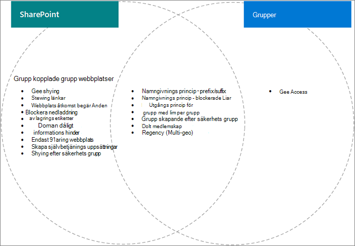

# Inställnings interaktioner mellan Microsoft 365-grupper och SharePoint

Vissa inställningar för Microsoft 365-grupper och SharePoint i Microsoft 365, särskilt när det gäller att dela och gruppera webbplatser, överlappa varandra. Den här artikeln innehåller beskrivningar av dessa interaktioner och metod tips för hur du arbetar med de här inställningarna.

## Effekterna av SharePoint-inställningar i Microsoft 365-grupper

|SharePoint-inställning|Beskrivning|Effekt på Microsoft 365-grupper|Rekommendation|
|:-----------------|:----------|:-----------------------------|:-------------|
|Extern delning för organisation och webbplats|Avgör om webbplatser, filer och mappar kan delas med personer utanför organisationen.|Om inställningarna för SharePoint och grupper inte stämmer överens kan gäster i gruppen blockeras från att komma åt webbplatsen, eller också kan den externa åtkomsten vara tillgänglig på webbplatsen, men inte i gruppen.|När du ändrar delnings inställningar kontrollerar du inställningar för både grupper och SharePoint-webbplats för gruppanslutna grupp webbplatser.  Se [samar beta med gäster på en webbplats](https://docs.microsoft.com/microsoft-365/solutions/collaborate-in-site).|
|Tillåt/blockera domän|Tillåter eller förhindrar att innehåll delas med angivna domäner.|Grupper känner inte igen SharePoint-listor för tillåta eller blockera. Användare från domäner tillåts inte i SharePoint via en grupp.|Hantera listor över tillåtna/blockerade domäner för Azure AD och SharePoint tillsammans. Skapa en organisations styrnings process för att tillåta och blockera domäner.  Se Inställningar för [SharePoint-domän](https://docs.microsoft.com/sharepoint/restricted-domains-sharing) och [Azure AD-domän](https://docs.microsoft.com/azure/active-directory/b2b/allow-deny-list)|
|Tillåt endast användare i specifika säkerhets grupper att dela externt|Anger säkerhets grupper som kan dela webbplatser, mappar och filer externt.|Den här inställningen påverkar inte grupp ägares delning av grupper externt. Gruppgäster har åtkomst till den associerade SharePoint-webbplatsen.||
|Inställningar för delning av SharePoint-webbplats|Avgör vem som kan dela webbplatsen direkt utanför gruppens medlemskap. Det här är konfigurerat av gruppen eller webbplats ägaren.|Den här inställningen påverkar inte gruppen direkt, men den kan tillåta användare att läggas till på en webbplats och inte har åtkomst till andra grupp resurser|Överväg att använda den här inställningen för att begränsa delning av webbplatsen direkt och hantera webbplats åtkomst via gruppen.|
|Låta användare skapa webbplatser från start sidan och OneDrive i SharePoint|Anger om användare kan skapa nya SharePoint-webbplatser.|Om den här inställningen är inaktive rad kan användare fortfarande skapa gruppbaserade grupp webbplatser genom att skapa en grupp.||

## Effekterna av inställningar för Microsoft 365-grupper i SharePoint

|Inställningar för Microsoft 365-grupper|Beskrivning|Effekt på SharePoint|Rekommendation|
|:---------------------------|:----------|:-------------------|:-------------|
|Namngivnings principer|Anger prefix och suffix för grupp namn och blockerade ord för att skapa grupper|Principer tillämpas för användare som skapar gruppbaserade grupp webbplatser, men inte kommunikations webbplatser eller webbplatser med andra mallar.|Skapa separata namn vägledning för kommunikations webbplatser om det behövs.|
|Gruppgäst åtkomst|Anger om personer utanför organisationen kan läggas till i grupper.|Om inställningarna för SharePoint och grupper inte stämmer överens kan gäster i gruppen blockeras från att komma åt webbplatsen, eller också kan den externa åtkomsten vara tillgänglig på webbplatsen, men inte i gruppen.|När du ändrar delnings inställningar kontrollerar du inställningar för både grupper och SharePoint-webbplats för gruppanslutna grupp webbplatser.  Se [samar beta med gäster på en webbplats](https://docs.microsoft.com/microsoft-365/solutions/collaborate-in-site)|
|Grupp skapande efter säkerhets grupp|Grupper kan bara skapas av medlemmar i en viss säkerhets grupp.|Användare som inte är medlemmar i säkerhets gruppen kan inte skapa en gruppansluten grupp webbplats.|Kontrol lera att din process för att begära en grupp innehåller instruktioner för hur du begär en webbplats.|
|Policy för giltighets tid för grupp|Anger en tids period efter vilken grupper som inte aktive ras aktivt tas bort automatiskt.|När gruppen tas bort raderas även den associerade SharePoint-webbplatsen. Innehåll som skyddas av bevarande principer bevaras.|Använd principer för förfallo dag för att undvika sprawl oanvända grupper och webbplatser.|

## Relaterade ämnen

[Samar beta med personer utanför organisationen](https://docs.microsoft.com/microsoft-365/solutions/collaborate-with-people-outside-your-organization)

[Hantera skapande av webbplatser i SharePoint](https://docs.microsoft.com/sharepoint/manage-site-creation)