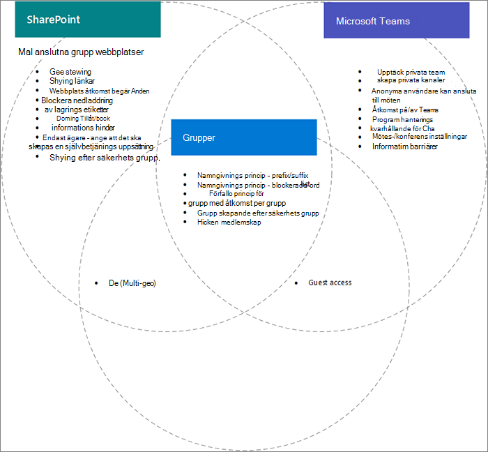

# Inställningar för interaktioner mellan Microsoft 365-grupper, team och SharePoint

Vissa inställningar för Microsoft 365 Groups, Microsoft Teams och SharePoint i Microsoft 365, särskilt relaterade till delning och grupp-och SharePoint-webbplatser, överlappar varandra. Den här artikeln innehåller beskrivningar av dessa interaktioner och metod tips för hur du arbetar med de här inställningarna.

## Effekterna av SharePoint-inställningar på grupper och team

|SharePoint-inställning|Beskrivning|Effekt på Microsoft 365-grupper och-team|Rekommendation|
|:-----------------|:----------|:---------------------------------------|:-------------|
|Extern delning för organisation och webbplats|Avgör om webbplatser, filer och mappar kan delas med personer utanför organisationen.|Om inställningarna för SharePoint-, grupp-och team inställningar inte stämmer överens kan gäster i teamet hindras från att komma åt webbplatsen eller oväntad extern åtkomst.|När du ändrar delnings inställningar kontrollerar du grupp inställningar, team inställningar och SharePoint-webbplats inställningar för grupprelaterade grupp webbplatser.   Se [samar beta med gäster i ett team](https://docs.microsoft.com/microsoft-365/solutions/collaborate-as-team)|
|Tillåt/blockera domän|Tillåter eller förhindrar att innehåll delas med angivna domäner.|Grupper och team känner inte igen SharePoint-listor för tillåta eller blockera. Användare från domäner tillåts inte i SharePoint kan komma åt SharePoint-webbplatser eller-innehåll via ett team.|Hantera listor över tillåtna/blockerade domäner för Azure AD och SharePoint tillsammans. Skapa en organisations styrnings process för att tillåta och blockera domäner.  Se Inställningar för [SharePoint-domän](https://docs.microsoft.com/sharepoint/restricted-domains-sharing) och [Azure AD-domän](https://docs.microsoft.com/azure/active-directory/b2b/allow-deny-list)|
|Tillåt endast användare i specifika säkerhets grupper att dela externt|Anger säkerhets grupper som kan dela SharePoint-webbplatser, mappar och filer externt.|Den här inställningen gör inte att team ägare inte kan dela ut grupper externt. Team gäster har åtkomst till den associerade SharePoint-webbplatsen.||
|Inställningar för delning av SharePoint-webbplats|Avgör vem som kan dela webbplatsen direkt utanför teamets medlemskap. Det här är konfigurerat av team eller webbplats ägare.|Den här inställningen påverkar inte gruppen direkt, men den kan tillåta användare att läggas till på en webbplats och inte har åtkomst till själva teamet eller andra team resurser|Överväg att använda den här inställningen för att begränsa delning av webbplatsen direkt och hantera webbplats åtkomst via teamet.|
|Låta användare skapa webbplatser från start sidan och OneDrive i SharePoint|Anger om användare kan skapa nya SharePoint-webbplatser.|Om den här inställningen är inaktive rad kan användare fortfarande skapa gruppbaserade grupp webbplatser genom att skapa ett team.||

## Effekterna av grupp inställningar i Teams

|Inställningar för Microsoft 365-grupper|Beskrivning|Effekt på Teams|Rekommendation|
|:---------------------------|:----------|:--------------|:-------------|
|Namngivningsprinciper|Anger prefix och suffix för grupp namn och blockerade ord för att skapa grupper|Principer tillämpas för användare som skapar Teams.||
|Gruppgäst åtkomst|Anger om personer utanför organisationen kan läggas till i grupper.|Om inställningarna för gäst delning är inaktiverade kan teamet inte delas med gäster.|När du ändrar inställningar för gäst delning kontrollerar du inställningarna för team, grupper och SharePoint-webbplatsen som är kopplad till teamet.   Se [samar beta med gäster i ett team](https://docs.microsoft.com/microsoft-365/solutions/collaborate-as-team)|
|Grupp skapande efter säkerhets grupp|Grupper kan bara skapas av medlemmar i en viss säkerhets grupp.|Användare som inte är medlemmar i säkerhets gruppen kan inte skapa ett team.|Kontrol lera att din process för att begära en grupp innehåller instruktioner för hur du begär ett team eller en SharePoint-webbplats.|
|Policy för giltighets tid för grupp|Anger en tids period efter vilken grupper som inte aktive ras aktivt tas bort automatiskt.|När gruppen tas bort raderas teamet och tillhör ande SharePoint-webbplats också. Innehåll som skyddas av bevarande principer bevaras.|Använd principer för förfallo dag för att undvika sprawl oanvända team, grupper och webbplatser.|

## Relaterade ämnen

[Planerings steg-för-steg-samarbete för samarbets styrning](collaboration-governance-overview.md#collaboration-governance-planning-step-by-step)

[Skapa en plan för hantering av samarbete](collaboration-governance-first.md)

[Samar beta med personer utanför organisationen](https://docs.microsoft.com/microsoft-365/solutions/collaborate-with-people-outside-your-organization)

[Hantera webbplatsskapande i SharePoint](https://docs.microsoft.com/sharepoint/manage-site-creation)
