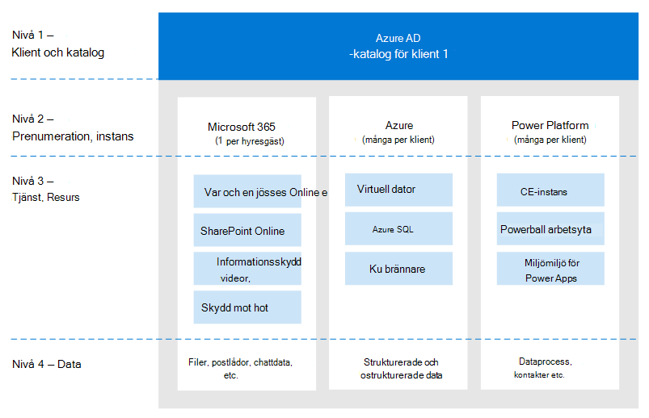
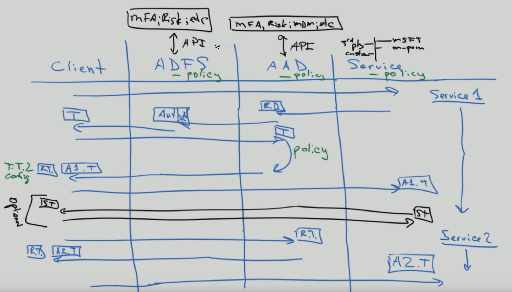
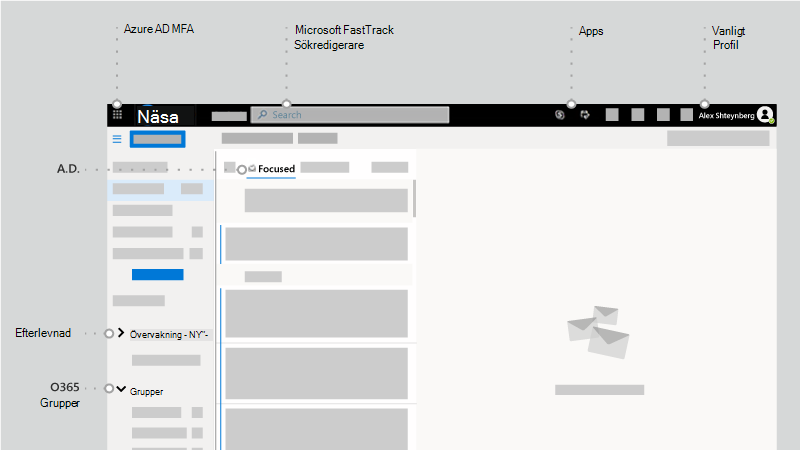
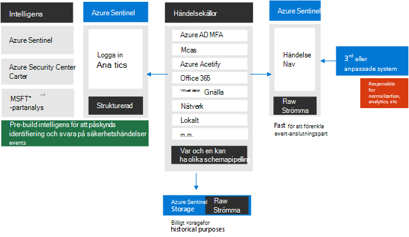
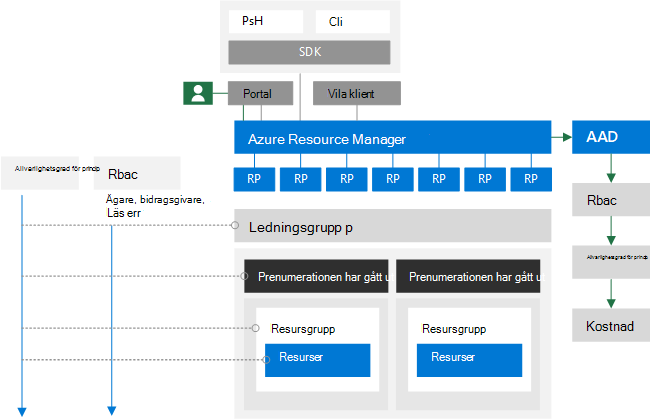

# Till identitet och efter – en arkitekts synvinklarTo identity and beyond — One architect's viewpoint

I den här artikeln, [Alex Shteynberg](https://www.linkedin.com/in/alex-shteynberg/), huvudsaklig tekniska arkitekt hos Microsoft, beskrivs de vanligaste design strategierna för företags organisationer som har Microsoft 365 och andra moln tjänster från Microsoft.In this article, [Alex Shteynberg](https://www.linkedin.com/in/alex-shteynberg/), Principal Technical Architect at Microsoft, discusses top design strategies for enterprise organizations adopting Microsoft 365 and other Microsoft cloud services.

## Om författarenAbout the author

Jag är en huvudsaklig teknisk arkitekt i New York [Microsoft Technology Center](https://www.microsoft.com/mtc?rtc=1).I am a Principal Technical Architect at the New York [Microsoft Technology Center](https://www.microsoft.com/mtc?rtc=1). Jag jobbar oftast med stora kunder och komplicerade behov.I mostly work with large customers and complex requirements. Mina åsikter och åsikter baseras på dessa interaktioner och kanske inte gäller för varje situation.My viewpoint and opinions are based on these interactions and may not apply to every situation. Om vi kan hjälpa kunder med de mest komplicerade utmaningarna kan vi emellertid hjälpa alla kunder.However, in my experience, if we can help customers with the most complex challenges, we can help all customers. 

Jag arbetar vanligt vis med 100 + kunder varje år.I typically work with 100+ customers each year. När alla organisationer har unika egenskaper är det intressant att se trender och commonalities.While every organization has unique characteristics, it's interesting to see trends and commonalities. Till exempel är en trend mellan bransch intresse för många kunder.For example, one trend is cross-industry interest for a lot of customers. Efter allt kan en bank filial också vara en kafé och en community-grupp.After all, a bank branch can also be a coffee shop and a community center. 

I min roll fokuserar jag på att hjälpa kunder att nå den bästa tekniska lösningen för att adressera sin unika uppsättning affärs mål.In my role, I focus on helping customers arrive at the best technical solution to address their unique set of business goals. Officiellt fokuserar jag på identitet, säkerhet, sekretess och efterlevnad.Officially, I focus on Identity, Security, Privacy, and Compliance. Jag älskar att dessa rör sig allt.I love the fact that these touch everything we do. Jag får tillfälle att delta i de flesta projekt.It gives me an opportunity to be involved with most projects. Då håller jag det och gillar den här rollen.This keeps me quite busy and enjoying this role. 

Jag bor i New York-staden (det bästa!) och har stor nytta av dess kultur, mat och andra (inte trafik).I live in New York City (the best!) and really enjoy the diversity of its culture, food, and people (not traffic). Jag älskar att resa när jag kan och hoppas att få ut mesta möjliga av världen i min livs längd.I love to travel when I can and hope to see most of the world in my lifetime. Jag håller på att söka efter en resa i Afrika för att få veta mer om vilda djur.I'm currently researching a trip to Africa to learn about wildlife.

## Väg LED ande principerGuiding principles 

- **Enkel är ofta bättre** – du kan göra (nästan) allt med teknik.**Simple is often better** — You can do (almost) anything with technology. Det betyder inte att du bör.It does not mean you should. I säkerhets rymden är många kunder Överlagrings lösningar.Especially in the security space, many customers overengineer solutions. Jag gillar [den här videon](https://www.youtube.com/watch?v=SOQgABDSYZE) från en plats konferens med Google för att under Visa den här punkten.I like [this video](https://www.youtube.com/watch?v=SOQgABDSYZE) from Google’s Stripe conference to underscore this point.
- **Personer, processer, teknologi** — [design för](https://en.wikipedia.org/wiki/Human-centered_design) att förbättra processen, inte Tech först.**People, process, technology** — [Design for people](https://en.wikipedia.org/wiki/Human-centered_design) to enhance process, not tech first. Det finns inga "perfekta" lösningar.There are no "perfect" solutions. Vi måste balansera olika riskfaktorer och beslut varierar beroende på var och en av företagen.We need to balance various risk factors and decisions will be different for each business. För många kunder utformar ett sätt som användarna vid ett senare tillfälle att undvika.Too many customers design an approach which their users later avoid.
- **Fokusera på "Varför" först och "hur" senare** — vara det irriterande 7-åriga gamla barn med en miljon frågor.**Focus on 'why' first and 'how' later** — Be the annoying 7 yr old kid with a million questions. Det går inte att komma åt rätt svar om vi inte känner till rätt frågor.We can't arrive at the right answer if we don't know the right questions to ask. Många kunder gör antaganden om hur saker ska fungera i stället för att definiera företags problemet.Lots of customers make assumptions on how things need to work instead of defining the business problem. Det finns alltid flera vägar som kan tas med.There are always multiple paths that can be taken.
- Mycket **god praxis** – känner av att metod tipsen ändras till lätt.**Long tail of past best practices** — Recognize that best practices are changing at light speed. Om du har tittat på Azure AD för mer än 3 månader sedan, är du troligt vis inaktuell.If you have looked at Azure AD more than 3 month ago, you are likely out of date. Allt här kan komma att ändras efter publicering.Everything here is subject to change after publication. Alternativet "bäst" kan inte vara samma sex månader från och med nu.“Best” option today may be not be the same 6 months from now.

## Grundläggande begreppBaseline concepts

Hoppa inte över det här avsnittet.Don't skip this section. Jag får ofta veta att jag måste gå tillbaka till dessa ämnen, även för kunder som har använt moln tjänster för åren.I often find that I must step-back to these topics, even for customers who have been using cloud services for years.
Alas, språket är inte ett exakt verktyg.Alas, language is not a precise tool. Vi använder ofta samma ord för att betyda olika koncept eller olika ord för samma koncept.We quite often use the same word to mean different concepts or different words to mean the same concept. Jag använder ofta diagrammet nedan för att skapa en del grundläggande terminologi och "hierarkisk modell".I often use this diagram below to establish some baseline terminology and "hierarchy model."
  

  

 

När du får reda på simbana är det bättre att starta poolen och inte mitt i havet.When you learn to swim it's better to start in the pool and not in the middle of the ocean. Jag försöker inte vara tekniskt korrekt med det här diagrammet.I am not trying to be technically accurate with this diagram. Det är en modell där du kan diskutera grundläggande koncept.It's a model to discuss some basic concepts. 

I diagrammet:In the diagram:
- Klient organisation = en instans av Azure AD.Tenant = an instance of Azure AD. Det är längst upp i en hierarki eller nivå 1 i diagrammet.It is at the "top" of a hierarchy, or Level 1 in the diagram. Det här kan ses som "[gräns](https://docs.microsoft.com/azure/active-directory/users-groups-roles/licensing-directory-independence)" där allt annat inträffar ([Azure AD B2B](https://docs.microsoft.com/azure/active-directory/b2b/what-is-b2b) tar undan).We can consider this to be the "[boundary](https://docs.microsoft.com/azure/active-directory/users-groups-roles/licensing-directory-independence)" where everything else occurs ([Azure AD B2B](https://docs.microsoft.com/azure/active-directory/b2b/what-is-b2b) aside). Alla Microsoft Enterprise Cloud-tjänster ingår i en av dessa klient organisationer.All Microsoft enterprise cloud services are part of one of these tenants. Konsument tjänsterna är separata.Consumer services are separate. "Innehavare" visas i dokumentation som Office 365-klient organisation, Azure-klient, WVD-klient organisation etc. Jag tycker ofta att dessa variationer orsakar förvirring för kunder."Tenant" appears in documentation as Office 365 tenant, Azure tenant, WVD tenant, etc. I often find these variations cause confusion for customers.
- Tjänster/prenumerationer, nivå 2 i diagrammet, tillhör en och bara en innehavare.Services/subscriptions, Level 2 in the diagram, belong to one and only one tenant. De flesta SaaS-tjänsterna är 1:1 och kan inte flyttas utan migrering.Most SaaS services are 1:1 and can't move without migration. Azure är annorlunda, du kan [Flytta fakturering](https://docs.microsoft.com/azure/cost-management-billing/manage/billing-subscription-transfer) och/eller ett [abonnemang](https://docs.microsoft.com/azure/active-directory/fundamentals/active-directory-how-subscriptions-associated-directory) till en annan klient organisation.Azure is different, you can [move billing](https://docs.microsoft.com/azure/cost-management-billing/manage/billing-subscription-transfer) and/or a [subscription](https://docs.microsoft.com/azure/active-directory/fundamentals/active-directory-how-subscriptions-associated-directory) to another tenant. Det finns många kunder som måste flytta Azure-prenumerationer.There are many customers that need to move Azure subscriptions. Det här har olika implication.This has various implication. Objekt som finns utanför prenumerationen (till exempel RBAC-och Azure AD-objekt inklusive grupper, appar, principer osv.) flyttas inte.Objects that exist outside of the subscription (for example, RBAC and Azure AD objects including groups, apps, policies, etc.) do not move. Dessutom flyttas vissa tjänster (Azure Key Vault, data brickor etc.) i ett icke-funktionellt läge.Also, some services (Azure Key Vault, Data Bricks, etc.) move in a non-functional state. Migrera inte tjänster utan ett gott företags behov.Don't migrate services without a good business need. Vissa skript som kan vara till hjälp för migrering [delas på GitHub](https://github.com/lwajswaj/azure-tenant-migration).Some scripts that can be helpful for migration are [shared on GitHub](https://github.com/lwajswaj/azure-tenant-migration). 
- En viss tjänst har vanligt vis en del av "gräns på under nivå" eller nivå 3 (L3).A given service usually has some sort of "sub-level" boundary, or Level 3 (L3). Detta är användbart för att förstå för åtskillnad av säkerhet, principer, styrelse etc. Tyvärr finns det inget enhetligt namn som jag känner till.This is useful to understand for segregation of security, policies, governance, etc. Unfortunately, there is no uniform name that I know of. Här är några exempel namn för L3: Azure Subscription = [resurs](https://docs.microsoft.com/azure/azure-resource-manager/management/manage-resources-portal); Dynamics 365 CE = [instans](https://docs.microsoft.com/dynamics365/admin/new-instance-management); Power BI = [arbets yta](https://docs.microsoft.com/power-bi/service-create-the-new-workspaces); Power Apps = [miljö](https://docs.microsoft.com/power-platform/admin/environments-overview); o.d..Some examples names for L3 are: Azure Subscription = [resource](https://docs.microsoft.com/azure/azure-resource-manager/management/manage-resources-portal); Dynamics 365 CE = [instance](https://docs.microsoft.com/dynamics365/admin/new-instance-management); Power BI = [workspace](https://docs.microsoft.com/power-bi/service-create-the-new-workspaces); Power Apps = [environment](https://docs.microsoft.com/power-platform/admin/environments-overview); etc.
- Nivå 4 är den faktiska informationen.Level 4 is where the actual data lives. Det här är ett komplext ämne.This 'data plane' is a complex topic. För vissa tjänster används Azure AD för RBAC, andra inte.Some services are using Azure AD for RBAC, others are not. Jag diskuterar det lite när vi får delegera ämnen.I'll discuss it a bit when we get to delegation topics.

Vissa ytterligare begrepp som jag hittar många kunder (och Microsoft-anställda) förkortar med eller har frågor om följande:Some additional concepts that I find many customers (and Microsoft employees) are confused about or have questions about include the following:

- Vem som helst kan [skapa](https://docs.microsoft.com/azure/active-directory/fundamentals/active-directory-access-create-new-tenant) många klient organisationer [utan kostnad](https://azure.microsoft.com/pricing/details/active-directory/).Anyone can [create](https://docs.microsoft.com/azure/active-directory/fundamentals/active-directory-access-create-new-tenant) many tenants at [no cost](https://azure.microsoft.com/pricing/details/active-directory/). Du behöver ingen tjänst etablerad i den.You do not need a service provisioned within it. Jag har dussin tals.I have dozens. Varje klient organisations namn är unikt i Microsofts moln tjänster i hela världen (dvs. två innehavare kan ha samma namn).Each Tenant name is unique in Microsoft's worldwide cloud service (i.e. no two tenants can have the same name). Alla är i formatet för TenantName.onmicrosoft.com.They all are in the format of TenantName.onmicrosoft.com. Det finns också processer som skapar klient organisationer automatiskt ([ohanterade klient organisationer](https://docs.microsoft.com/azure/active-directory/users-groups-roles/directory-self-service-signup)).There are also processes that create Tenants automatically ([unmanaged tenants](https://docs.microsoft.com/azure/active-directory/users-groups-roles/directory-self-service-signup)). Detta kan till exempel inträffa när en användare registrerar sig för en företags tjänst med en e-postdomän som inte finns i någon annan klient organisation.For example, this can occur when a user signs-up for an enterprise service with an email domain which does not exist in any other tenant. 
- I en hanterad klient organisation kan många [DNS-domäner](https://docs.microsoft.com/azure/active-directory/fundamentals/add-custom-domain) vara registrerade i den.In a managed tenant, many [DNS domains](https://docs.microsoft.com/azure/active-directory/fundamentals/add-custom-domain) can be registered in it. Detta ändrar inte det ursprungliga klient organisations namnet.This does not change the original tenant name. Det finns för närvarande inget enkelt sätt att byta namn på en klient organisation (annan än migrering).There is currently no easy way to rename a tenant (other than migration). Även om klient organisationens namn inte är avgörande för dessa dagar kanske vissa av dem kan begränsas.Although the tenant name is technically not critical these days, some may find this to be limiting.
- Du bör reservera ett klient organisations namn även om du inte ännu planerar att distribuera några tjänster.You should reserve a tenant name for your organization even if you are not yet planning to deploy any services. I annat fall kan någon ta med dig från dig och det finns ingen enkel process att ta tillbaka (samma problem som DNS-namn).Otherwise somebody can take it from you and there is no simple process to take it back (same problem as DNS names). Jag hör detta för ofta från kunder.I hear this way too often from customers. Vad klient namnet bör vara är ett debatten-ämne.What your tenant name should be is a debate topic as well.
- Om du äger DNS-namnrymd (er) bör du lägga till alla dessa till klient organisationerna.If you own DNS namespace(s), you should add all of these to your tenant(s). Annars kan en [ohanterad klient organisation](https://docs.microsoft.com/azure/active-directory/users-groups-roles/directory-self-service-signup) med det här namnet skapas och det gör att [den hanteras](https://docs.microsoft.com/azure/active-directory/users-groups-roles/domains-admin-takeover).Otherwise one could create an [unmanaged tenant](https://docs.microsoft.com/azure/active-directory/users-groups-roles/directory-self-service-signup) with this name which then causes disruption to [make it managed](https://docs.microsoft.com/azure/active-directory/users-groups-roles/domains-admin-takeover).
- DNS-namnområdet (till exempel contoso.com) kan tillhöra en enda klient organisation.DNS namespace (e.g. contoso.com) can belong to one and only one Tenant. Det här har implication för olika scenarier (till exempel att dela en e-postdomän under en fusion eller ett förvärv osv.) Det finns ett sätt att registrera en DNS-sub (till exempel div.contoso.com) i en annan klient organisation, men det bör undvikas.This has implication for various scenarios (for example, sharing an email domain during a merger or acquisition, etc.) There is a way to register a DNS sub (e.g. div.contoso.com) in a different tenant, but that should be avoided. När du registrerar ett domän namn på den översta nivån antas alla under domäner tillhöra samma klient organisation.By registering a top-level domain name, all subdomains are assumed to belong to the same tenant. I scenarier med flera innehavare (se nedan) rekommenderar jag att använda ett annat domän namn på toppnivå (till exempel contoso.ch eller ch-contoso.com).In multi-tenant scenarios (see below) I would normally recommend using another top-level domain name (e.g. contoso.ch or ch-contoso.com).
- Vem bör "äga" en klient organisation?Who should "own" a tenant? Jag ser ofta kunder som för närvarande äger sin klient organisation.I often see customers that do not know who currently owns their tenant. Det här är en stor röd flagga.This is a big red flag. Ring Microsoft Support ASAP.Call Microsoft support ASAP. Precis som problematiska är en tjänst ägare (ofta en Exchange-administratör) för att hantera en klient organisation.Just as problematic is when a service owner (often an Exchange administrator) is designated to manage a tenant. Klient organisationen kommer att innehålla alla tjänster som du kanske vill ha i framtiden.The tenant will contain all services that you may want in the future. Innehavarens ägare bör vara en grupp som kan fatta beslut om aktivering av alla moln tjänster i en organisation.The tenant owner should be a group which can make decision for enablement of all cloud services in an organization. Ett annat problem är när en klient ägar grupp blir ombedd att hantera alla tjänster.Another problem is when a tenant owner group is asked to manage all services. Detta gäller inte för stora organisationer.This does not scale for large organizations.
- Det finns inget koncept för en sub/Super-klient organisation.There is no concept of a sub/super tenant. Av någon anledning behåller den här Myth upprepa sig.For some reason, this myth keeps repeating itself. Detta gäller även för [Azure AD B2C](https://docs.microsoft.com/azure/active-directory-b2c/) -klient organisationer.This applies to [Azure AD B2C](https://docs.microsoft.com/azure/active-directory-b2c/) tenants as well. Jag hör för många gånger, "min B2C-miljö finns i min XYZ-klient organisation," eller "Hur flyttar jag min Azure-klient till min Office 365-klient organisation?"I hear too many times, "My B2C environment is in my XYZ Tenant," or "How do I move my Azure tenant into my Office 365 tenant?"
- Det här dokumentet fokuserar sig mest på det kommersiella molnet i hela världen, eftersom det är det som de flesta kunder använder.This document mostly focuses on the commercial worldwide cloud as this is what most customers are using. Det är ibland användbart att veta mer om de [suveräna molnen](https://docs.microsoft.com/azure/active-directory/develop/authentication-national-cloud).It sometimes useful to know about [sovereign clouds](https://docs.microsoft.com/azure/active-directory/develop/authentication-national-cloud). Suveräna moln har ytterligare konsekvenser för att diskutera vilka som är utanför räckvidden för denna diskussion.Sovereign clouds have additional implications to discuss which are out of scope for this discussion.

## Rikt linje ämnenBaseline identity topics

Det finns massor av dokumentation om Microsofts identitets plattform – Azure Active Directory (Azure AD).There is a lot of documentation about Microsoft's identity platform – Azure Active Directory (Azure AD). För de som precis har startat känns det ofta bra.For those who are just starting, it often feels overwhelming. Även efter att du har lärt dig kan det vara svårt att hålla kontakten med ständig innovation och förändringar.Even after you learn about it, keeping up with constant innovation and change can be challenging. I mina kund kontakter ser jag ofta att den fungerar som "översättare" mellan företags mål och "bra, bättre och bäst"-tillvägagångs sätt för att adressera dessa (samt de mänskliga "Cliff anteckningarna").In my customer interactions I often find myself serving as "translator" between business goals and "Good, Better, Best" approaches to address these (as well as human "cliff notes" for these topics). Det är sällan ett perfekt svar och "rätt"-beslutet är en avvägning av olika riskfaktorer.There is rarely a perfect answer and the "right" decision is a balance of various risk factors. Nedan följer några vanliga frågor och Förväxlings områden jag brukar diskutera med kunder.Below are some of the common questions and confusion areas I tend to discuss with customers.

### EtableringProvisioning
Azure AD löser inte bristande styrelse former i din identitet.Azure AD does not solve for lack of governance in your identity world! [Identitets styrning](https://docs.microsoft.com/azure/active-directory/governance/identity-governance-overview) bör vara ett kritiskt element oberoende av eventuella moln beslut.[Identity governance](https://docs.microsoft.com/azure/active-directory/governance/identity-governance-overview) should be a critical element independent of any cloud decisions. Styr behoven förändras över tiden som är orsaken till ett program och inte ett verktyg.Governance requirements change over time which is why it is a program and not a tool. 

[Azure AD Connect](https://docs.microsoft.com/azure/active-directory/hybrid/whatis-azure-ad-connect) kontra [Microsoft Identity Manager](https://docs.microsoft.com/microsoft-identity-manager/microsoft-identity-manager-2016) (MIM) kontra något annat (tredje part eller anpassad)?[Azure AD Connect](https://docs.microsoft.com/azure/active-directory/hybrid/whatis-azure-ad-connect) vs. [Microsoft Identity Manager](https://docs.microsoft.com/microsoft-identity-manager/microsoft-identity-manager-2016) (MIM) vs. something else (3rd party or custom)? Spara pengar på dig och gå vidare med Azure AD Connect.Save yourself a lot of headache now and in the future and go with Azure AD Connect. Det finns många smarta sätt att adressera särskilda kundkonfigurationer och fort löp ande innovationer.There are all kinds of smarts in this tool to address peculiar customer configurations and ongoing innovations. 

Vissa fall som kan ha en mer komplex arkitektur:Some edge cases which may drive towards a more complex architecture:
- Jag har flera AD-skogar utan nätverks förbindelse mellan dessa.I have multiple AD forests without network connectivity between these. Det finns ett nytt alternativ som kallas [moln etablering](https://docs.microsoft.com/azure/active-directory/cloud-provisioning/what-is-cloud-provisioning).There is a new option called [Cloud Provisioning](https://docs.microsoft.com/azure/active-directory/cloud-provisioning/what-is-cloud-provisioning).
- Jag har inte Active Directory och kan inte heller installera den.I don't have Active Directory, nor do I want to install it. Azure AD Connect kan konfigureras för att [Synkronisera från LDAP](https://docs.microsoft.com/azure/active-directory/hybrid/plan-hybrid-identity-design-considerations-tools-comparison) (partner kanske krävs).Azure AD Connect can be configures to [sync from LDAP](https://docs.microsoft.com/azure/active-directory/hybrid/plan-hybrid-identity-design-considerations-tools-comparison) (partner may be required).
- Jag måste etablera samma objekt till flera klient organisationer.I need to provision the same objects to multiple tenants. Detta stöds inte tekniskt, men beror på definitionen av "samma".This is not technically supported but depends on definition of "same."

Bör jag anpassa standardinställningarna för synkronisering ([Filtrera objekt](https://docs.microsoft.com/azure/active-directory/hybrid/how-to-connect-sync-configure-filtering), [ändra attribut](https://docs.microsoft.com/azure/active-directory/hybrid/reference-connect-sync-attributes-synchronized), [alternativt inloggnings-ID](https://docs.microsoft.com/azure/active-directory/hybrid/plan-connect-userprincipalname)osv.)?Should I customize default synchronization rules ([filter objects](https://docs.microsoft.com/azure/active-directory/hybrid/how-to-connect-sync-configure-filtering), [change attributes](https://docs.microsoft.com/azure/active-directory/hybrid/reference-connect-sync-attributes-synchronized), [alternate login ID](https://docs.microsoft.com/azure/active-directory/hybrid/plan-connect-userprincipalname), etc.)? Undvik!Avoid it! En identitets plattform är bara värdefull som de tjänster som använder den.An identity platform is only as valuable as the services that use it. Även om du kan göra alla typer av Nutty-konfigurationer för att besvara den här frågan måste du titta på hur programmen påverkas.While you can do all kinds of nutty configurations, to answer this question you need to look at the impact on applications. Om du filtrerar e-postaktiverade objekt kommer GAL för online-tjänsterna att vara ofullständiga; om programmet är beroende av specifika attribut kommer de att få oförutsägbara effekter; o.d.. Det är inte ett identitets Teams beslut.If you filter mail-enabled objects, then the GAL for online services will be incomplete; if the application relies on specific attributes, filtering these will have unpredictable impact; etc. It is not an identity team decision.

XYZ SaaS har stöd för JIT-etablering (just-in-Time), varför behöver jag inte synkronisera?XYZ SaaS supports Just-in-Time (JIT) provisioning, why are you requiring me to synchronize? Se ovan.See above. Många program behöver "profil"-information för funktionaliteten.Many applications need "profile" information for functionality. Du kan inte ha en GAL-lista om alla e-postaktiverade objekt inte är tillgängliga.You can't have a GAL if all mail-enabled objects are not available. Detsamma gäller [användar etableringen](https://docs.microsoft.com/azure/active-directory/app-provisioning/user-provisioning) i program integrerade med Azure AD.Same applies to [user provisioning](https://docs.microsoft.com/azure/active-directory/app-provisioning/user-provisioning) in applications integrated with Azure AD.

### AutentiseringAuthentication

[Lösen ords-hash-synkronisering](https://docs.microsoft.com/azure/active-directory/hybrid/how-to-connect-password-hash-synchronization) (PHS) kontra [vidarekoppling](https://docs.microsoft.com/azure/active-directory/hybrid/how-to-connect-pta-how-it-works) (PTA) kontra [Federation](https://docs.microsoft.com/azure/active-directory/hybrid/how-to-connect-fed-compatibility).[Password hash sync](https://docs.microsoft.com/azure/active-directory/hybrid/how-to-connect-password-hash-synchronization) (PHS) vs. [pass-through authentication](https://docs.microsoft.com/azure/active-directory/hybrid/how-to-connect-pta-how-it-works) (PTA) vs. [federation](https://docs.microsoft.com/azure/active-directory/hybrid/how-to-connect-fed-compatibility).

Vanligt vis finns det en starkt [debatten](https://docs.microsoft.com/azure/active-directory/hybrid/choose-ad-authn) kring federationen.Usually there is a passionate [debate](https://docs.microsoft.com/azure/active-directory/hybrid/choose-ad-authn) around federation. Enklare är ofta bättre och därför bör du använda PHS såvida du inte har en bra anledning.Simpler is usually better and therefore use PHS unless you have a good reason not to. Det går också att konfigurera olika autentiseringsmetoder för olika DNS-domäner i samma klient organisation.It is also possible to configure different authentication methods for different DNS domains in the same tenant. 

Vissa kunder aktiverar Federation + PHS huvudsakligen för:Some customers enable federation + PHS mainly for:
- Ett alternativ för att [återgå](https://docs.microsoft.com/azure/active-directory/hybrid/plan-migrate-adfs-password-hash-sync) till (för katastrof återställning) om Federations tjänsten inte är tillgänglig.An option to [fall back](https://docs.microsoft.com/azure/active-directory/hybrid/plan-migrate-adfs-password-hash-sync) to (for disaster recovery) if the federation service is not available.
- Ytterligare funktioner (ex.: [Azure AD DS](https://docs.microsoft.com/azure/active-directory-domain-services/tutorial-configure-password-hash-sync)) och säkerhets tjänster (ex.: [läckda autentiseringsuppgifter](https://docs.microsoft.com/azure/active-directory/reports-monitoring/concept-risk-events#leaked-credentials))Additional capabilities (ex.: [Azure AD DS](https://docs.microsoft.com/azure/active-directory-domain-services/tutorial-configure-password-hash-sync)) and security services (ex.: [leaked credentials](https://docs.microsoft.com/azure/active-directory/reports-monitoring/concept-risk-events#leaked-credentials))
- Stöd för tjänster i Azure som inte förstår federerad inloggningsautentisering (ex.: [Azure-filer](https://docs.microsoft.com/azure/storage/files/storage-files-active-directory-overview)).Support for services in Azure which do not understand federated authentication (ex.: [Azure Files](https://docs.microsoft.com/azure/storage/files/storage-files-active-directory-overview)).

Jag vägleder ofta kunder via klientens autentiseringspaket för att klargöra vissa problem.I often walk customers through client authentication flow to clarify some misconceptions. Resultatet ser ut som på bilden nedan, som inte är lika bra som den interaktiva processen att komma igång.The result looks like the picture below, which is not as good as the interactive process of getting there.

Den här typen av whiteboard-ritningar illustrerar var säkerhets principer tillämpas i flödet för en autentiseringsbegäran.This type of whiteboard drawing illustrates where security policies are applied within the flow of an authentication request. I det här exemplet tillämpas principer via AD FS (Active Directory Federation Service) för den första tjänst förfrågan, men inte efterföljande tjänst begär Anden.In this example, policies enforced through Active Directory Federation Service (AD FS) are applied to the first service request, but not subsequent service requests. Det här är åtminstone en anledning till att flytta säkerhets kontroller till molnet så mycket som möjligt.This is at least one reason to move security controls to the cloud as much as possible.

Vi har jagar drömn med [enkel inloggning](https://docs.microsoft.com/azure/active-directory/manage-apps/what-is-single-sign-on) (SSO) så länge jag kommer ihåg.We've been chasing the dream of [single sign-on](https://docs.microsoft.com/azure/active-directory/manage-apps/what-is-single-sign-on) (SSO) for as long as I can remember. Vissa kunder tror att de kan nå detta genom att välja "Right" Federation (STS)-leverantören.Some customers believe they can achieve this by choosing the "right" federation (STS) provider. Azure AD kan avsevärt bidra till att [Aktivera SSO](https://docs.microsoft.com/azure/active-directory/manage-apps/plan-sso-deployment) -funktioner, men ingen STS är magiska.Azure AD can help significantly to [enable SSO](https://docs.microsoft.com/azure/active-directory/manage-apps/plan-sso-deployment) capabilities, but no STS is magical. Det finns för många "gamla" autentiseringsmetoder som fortfarande används för kritiska program.There are too many "legacy" authentication methods which are still used for critical applications. Att utöka Azure AD med [partner lösningar](https://docs.microsoft.com/azure/active-directory/saas-apps/tutorial-list) kan adressera många av dessa scenarier.Extending Azure AD with [partner solutions](https://docs.microsoft.com/azure/active-directory/saas-apps/tutorial-list) can address many of these scenarios. SSO är en strategi och en resa.SSO is a strategy and a journey. Det går inte att hitta utan att flytta till [standarder för program](https://docs.microsoft.com/azure/active-directory/develop/v2-app-types).You can't get there without moving towards [standards for applications](https://docs.microsoft.com/azure/active-directory/develop/v2-app-types). Relaterat till det här avsnittet handlar om att svara på [lösen ords](https://docs.microsoft.com/azure/active-directory/authentication/concept-authentication-passwordless) lös problem som också inte har ett magiska-svar.Related to this topic is a journey to [passwordless](https://docs.microsoft.com/azure/active-directory/authentication/concept-authentication-passwordless) authentication which also does not have a magical answer. 

[Multifaktorautentisering](https://docs.microsoft.com/azure/active-directory/authentication/concept-mfa-howitworks) är viktig i dag ([här](https://techcommunity.microsoft.com/t5/azure-active-directory-identity/your-pa-word-doesn-t-matter/ba-p/731984) för mer).[Multi-factor authentication](https://docs.microsoft.com/azure/active-directory/authentication/concept-mfa-howitworks) (MFA) is essential today ([here](https://techcommunity.microsoft.com/t5/azure-active-directory-identity/your-pa-word-doesn-t-matter/ba-p/731984) for more). Lägg till [användar beteende analys](https://docs.microsoft.com/azure/active-directory/authentication/tutorial-risk-based-sspr-mfa) och du har en lösning som förhindrar de flesta vanliga cyberterrorism-attacker.Add to it [user behavior analytics](https://docs.microsoft.com/azure/active-directory/authentication/tutorial-risk-based-sspr-mfa) and you have a solution which prevents the majority of common cyber-attacks. Även konsument tjänster flyttar till Kräv MFA.Even consumer services are moving to require MFA. Men jag träffas ändå med många kunder som inte vill gå vidare med [moderna autentiseringsmetoder](https://docs.microsoft.com/microsoft-365/enterprise/hybrid-modern-auth-overview) .Yet, I still meet with many customers who do not want to move to [modern authentication](https://docs.microsoft.com/microsoft-365/enterprise/hybrid-modern-auth-overview) approaches. Det största argument jag hör är att det påverkar användare och äldre program.The biggest argument I hear is that it will impact users and legacy applications. Ibland kan det vara bra att använda kunderna för att flytta längs Exchange Online- [ändringar](https://techcommunity.microsoft.com/t5/exchange-team-blog/basic-auth-and-exchange-online-february-2020-update/ba-p/1191282).Sometimes a good kick might help customers move along - Exchange Online [announced changes](https://techcommunity.microsoft.com/t5/exchange-team-blog/basic-auth-and-exchange-online-february-2020-update/ba-p/1191282). Massor av Azure AD- [rapporter](https://docs.microsoft.com/azure/active-directory/fundamentals/concept-fundamentals-block-legacy-authentication) är nu tillgängliga för att hjälpa kunder med över gången.Lots of Azure AD [reports](https://docs.microsoft.com/azure/active-directory/fundamentals/concept-fundamentals-block-legacy-authentication) are now available to help customers with this transition.

### BemyndigandeAuthorization

Per [Wikipedia](https://en.wikipedia.org/wiki/Authorization), "att verifiera" är att definiera en åtkomst policy.Per [Wikipedia](https://en.wikipedia.org/wiki/Authorization), "to authorize" is to define an access policy. Många ser att det är möjligt att definiera åtkomst kontroller till ett objekt (fil, tjänst osv.).Many people look at it as the ability to define access controls to an object (file, service, etc.). I den aktuella världen av cyberterrorism hot är det här konceptet snabbt utveckling till en dynamisk princip som kan reagera på olika hot-vektorer och snabbt justera åtkomst kontroller som svar på dessa.In the current world of cyber threats, this concept is rapidly evolving to a dynamic policy which can react to various threat vectors and quickly adjust access controls in response to these. Om jag till exempel har till gång till mitt bank konto från en ovanlig plats får jag ytterligare bekräftelse steg.For example, if I access my bank account from an unusual location, I get additional confirmation steps. För att det ska gå så måste vi ta hänsyn till själva principen utan eko systemen för hot Detection och signal korrelation.To approach this, we need to consider not just the policy itself but the ecosystem of threat detection and signal correlation methodologies.

Principmodulen för Azure AD implementeras med principer för [villkorsstyrd åtkomst](https://docs.microsoft.com/azure/active-directory/conditional-access/overview).The policy engine of Azure AD is implemented using [Conditional Access policies](https://docs.microsoft.com/azure/active-directory/conditional-access/overview). Det här systemet beror på information från en mängd olika system för hot identifiering som gör dynamiska beslut.This system depends on information from a variety of other threat detection systems to make dynamic decisions. En enkel vy ser ut ungefär så här.A simple view would be something like the following illustration.

Genom att kombinera alla dessa signaler kan du göra dynamiska principer så här:Combining all these signals together allows for dynamic policies like these:
- Om det finns ett hot på din enhet kommer din åtkomst till data att minskas till Internet utan att ladda ner.If a threat is detected on your device, your access to data will be reduced to web only without the ability to download.
- Om du laddar ner en ovanligt stor mängd data krypteras och begränsas allt du laddar ner.If you are downloading an unusually high volume of data, anything you download will be encrypted and restricted.
- Om du får till gång till en tjänst från en ohanterad enhet kommer du att blockeras av känslig information, men får åtkomst till icke-begränsande data utan att du kan kopiera den till en annan plats.If you access a service from an unmanaged device, you will be blocked from highly sensitive data but allowed to access non-restricted data without the ability to copy it to another location.

Om du godkänner den här utökade definitionen av godkännande måste du implementera ytterligare lösningar.If you agree with this expanded definition of authorization, then you need to implement additional solutions. Vilka lösningar du kan använda beror på hur dynamiskt du vill att principen ska vara och vilka hot du vill prioritera.Which solutions you implement will depend on how dynamic you want the policy to be and which threats you want to prioritize. Här är några exempel på sådana system:Some examples of such systems are:
- [Azure AD Identity ProtectionAzure AD Identity Protection](https://docs.microsoft.com/azure/active-directory/identity-protection/) 
- [Microsoft Defender för identitetMicrosoft Defender for Identity](https://docs.microsoft.com/azure-advanced-threat-protection/)
- [Microsoft Defender för slut punktMicrosoft Defender for Endpoint](https://docs.microsoft.com/windows/security/threat-protection/microsoft-defender-atp/microsoft-defender-advanced-threat-protection)
- [Microsoft Defender för Office 365Microsoft Defender for Office 365](https://docs.microsoft.com/microsoft-365/security/office-365-security/office-365-atp?view=o365-worldwide)
- [Säkerhet för Microsoft Cloud App](https://docs.microsoft.com/cloud-app-security/) (MCAS)[Microsoft Cloud App Security](https://docs.microsoft.com/cloud-app-security/) (MCAS)
- [Microsoft 365 DefenderMicrosoft 365 Defender](https://docs.microsoft.com/microsoft-365/security/mtp/microsoft-threat-protection?view=o365-worldwide)
- [Microsoft IntuneMicrosoft Intune](https://docs.microsoft.com/mem/intune/)
- [Microsoft informations skydd](https://docs.microsoft.com/microsoft-365/compliance/protect-information?view=o365-worldwide) (MIP)[Microsoft Information Protection](https://docs.microsoft.com/microsoft-365/compliance/protect-information?view=o365-worldwide) (MIP)
- [Azure SentinelAzure Sentinel](https://docs.microsoft.com/azure/sentinel/) 

Utöver Azure AD har olika tjänster och program till gång till sina egna auktoriseringsregler.Of course, in addition to Azure AD, various services and applications have their own specific authorization models. Vissa av dessa diskuteras senare i avsnittet delegering.Some of these are discussed later in the delegation section.

### RevisionsAudit
Azure AD har detaljerade funktioner för [granskning och rapportering](https://docs.microsoft.com/azure/active-directory/reports-monitoring/) .Azure AD has detailed [audit and reporting](https://docs.microsoft.com/azure/active-directory/reports-monitoring/) capabilities. Detta är vanligt vis inte den enda informations källa som behövs för att fatta säkerhets beslut.However, this is usually not the only source of information needed to make security decisions. Mer information finns i avsnittet delegering.See more discussion on this in the delegation section.

## Det finns ingen ExchangeThere is no Exchange

Få panik när!Don't Panic! Detta betyder inte att Exchange är föråldrat (eller SharePoint osv.) Den är fortfarande en kärn tjänst.This does not mean Exchange is being deprecated (or SharePoint, etc.) It is still a core service. Vad jag menar är, under lite tid nu, har teknik leverantörer över gång till användar upplevelser (UX) för att omfatta komponenter i flera tjänster.What I mean is, for quite some time now, technology providers have been transitioning user experiences (UX) to encompass components of multiple services. I Microsoft 365 är ett enkelt exempel "[moderna bilagor](https://support.office.com/article/Attach-files-or-insert-pictures-in-Outlook-email-messages-BDFAFEF5-792A-42B1-9A7B-84512D7DE7FC)" där bilagor till e-post lagras i SharePoint Online eller OneDrive för företag.In Microsoft 365, a simple example is "[modern attachments](https://support.office.com/article/Attach-files-or-insert-pictures-in-Outlook-email-messages-BDFAFEF5-792A-42B1-9A7B-84512D7DE7FC)" where attachments to email are stored in SharePoint Online or OneDrive for Business. 

När du tittar på Outlook-klienten kan du se många tjänster som är "anslutna" som en del av den här versionen, inte bara till Exchange.Looking at the Outlook client you can see many services that are "connected" as part of this experience, not just Exchange. Detta inkluderar Azure AD, Microsoft Search, appar, profil, efterlevnad och Office 365-grupper.This includes Azure AD, Microsoft Search, Apps, Profile, compliance, and Office 365 groups. 

Läs mer om [Microsoft Fluid Framework](https://techcommunity.microsoft.com/t5/microsoft-365-blog/microsoft-ignite-blog-microsoft-fluid-framework-preview/ba-p/978268) för förhands granskning av kommande funktioner.Read about [Microsoft Fluid Framework](https://techcommunity.microsoft.com/t5/microsoft-365-blog/microsoft-ignite-blog-microsoft-fluid-framework-preview/ba-p/978268) for preview of upcoming capabilities. I Förhandsgranska kan jag läsa och svara på konversationer direkt i Outlook.In preview now, I can read and reply to Teams conversations directly in Outlook. [Teams-klienten](https://products.office.com/microsoft-teams/download-app) är faktiskt ett av de mer framträdande exemplen på den här strategin.In fact, the [Teams client](https://products.office.com/microsoft-teams/download-app) is one of the more prominent examples of this strategy. 

Generellt blir det svårare att rita en tom linje mellan Office 365 och andra tjänster i Microsoft moln.Overall, it is becoming harder to draw a clear line between Office 365 and other services in Microsoft clouds. Jag visar det som en fantastisk fördel för kunder eftersom de kan dra nytta av total innovation i allt vi gör även om de använder en komponent.I view it as a great benefit to customers since they can benefit from total innovation across everything we do even if they use one component. Det är ganska coolt och har stor betydelse för många kunder.Pretty cool and has far reaching implications for many customers.

Nu hittar jag många kund IT-grupper strukturerade runt "produkter".Today, I find many customer IT groups are structured around "products." Det är logiskt för en lokal värld eftersom du behöver en expert för varje enskild produkt.It's logical for an on-premises world since you need an expert for each specific product. Men jag är helt glad att jag inte behöver felsöka en Active Directory-eller Exchange-databas någonsin igen eftersom de här tjänsterna har flyttat till molnet.However, I am totally happy that I don't have to debug an Active Directory or Exchange database ever again as these services have moved to the cloud. Automation (den moln typen är) tar bort vissa återkommande manuella jobb (se vad som har hänt med fabrikerna).Automation (which cloud kind of is) removes certain repetitive manual jobs (look what happened to factories). Men dessa ersätts med mer komplexa krav för att förstå interaktioner mellan tjänster, konsekvenser, företags behov etc. Om du är villig att [lära dig](https://docs.microsoft.com/learn/)kan du använda moln omvandling för att få fantastiska möjligheter.However, these are replaced with more complex requirements to understand cross-services interaction, impact, business needs, etc. If you are willing to [learn](https://docs.microsoft.com/learn/), there are great opportunities enabled by cloud transformation. Innan jag kan prata med teknik pratar jag ofta med kunderna om att hantera förändringar i IT-färdigheter och team strukturer.Before jumping into technology, I often talk to customers about managing change in IT skills and team structures.

För alla SharePoint-fläktar-personer och-utvecklare, slutar du att fråga "Hur kan jag göra XYZ i SharePoint Online?"To all SharePoint fan-people and developers, please stop asking "How can I do XYZ in SharePoint online?" Använd [Power automatisering](https://docs.microsoft.com/power-automate/) (aka flöde) för arbets flödet är det en mycket kraftfull plattform.Use [Power Automate](https://docs.microsoft.com/power-automate/) (aka Flow) for workflow, it is a much more powerful platform. Använd [Azure bot-ramverket](https://docs.microsoft.com/azure/bot-service/?view=azure-bot-service-4.0) för att skapa ett bättre gränssnitt för din 500 000.Use [Azure Bot Framework](https://docs.microsoft.com/azure/bot-service/?view=azure-bot-service-4.0) to create a better UX for your 500K item list. Börja använda [Microsoft Graph](https://developer.microsoft.com/graph/) i stället för CSOM.Start using [Microsoft Graph](https://developer.microsoft.com/graph/) instead of CSOM. [Microsoft Teams](https://docs.microsoft.com/MicrosoftTeams/Teams-overview) inkluderar SharePoint men också en värld mer.[Microsoft Teams](https://docs.microsoft.com/MicrosoftTeams/Teams-overview) includes SharePoint but also a world more. Det finns många andra exempel på.There are many other examples I can list. Det finns en omfattande och fantastiska universum.There is a vast and wonderful universe out there. Öppna dörren och [börja utforska](https://docs.microsoft.com).Open the door and [start exploring](https://docs.microsoft.com).

Den andra vanliga effekten är i området efterlevnad.The other common impact is in the compliance area. De här kors tjänste metoderna verkar vara helt förvirrande av många efterlevnadsprinciper.This cross-services approach seems to completely confuse many compliance policies. Jag ser till att organisationer det står "Jag behöver göra all e-postkommunikation till ett eDiscovery-system."I keep seeing organizations that state, "I need to journal all email communications to an eDiscovery system." Vad innebär det verkligen när e-post inte längre är bara e-post, men ett fönster i andra tjänster?What does this really mean when email is no longer just email but a window into other services? Office 365 har ett omfattande tillvägagångs sätt för att hantera [efterlevnad](https://docs.microsoft.com/microsoft-365/compliance/), men förändringar av personer och processer är ofta mycket svårare än teknik.Office 365 has a comprehensive approach for [compliance](https://docs.microsoft.com/microsoft-365/compliance/), but changing people and processes are often much more difficult than technology.

Det finns många andra människor och processer.There are many other people and process implications. Det här är ett kritiskt och underdiskuterat område.In my opinion, this is a critical and under-discussed area. Kanske mer i en annan artikel.Perhaps more in another article.

## Struktur alternativ för innehavareTenant structure options

### En enskild klient organisation eller flera innehavareSingle tenant vs. multi-tenant

Vanligt vis ska de flesta kunder endast ha en klient organisation.In general, most customers should have only one production tenant. Det finns många anledningar till att flera innehavare är utmanande (ge det en [Bing-sökning](https://www.bing.com/search?q=office%20365%20multiple%20tenants)) eller läsa det här [dokumentet](https://aka.ms/multi-tenant-user).There are many reasons why multiple tenants are challenging (give it a [Bing search](https://www.bing.com/search?q=office%20365%20multiple%20tenants)) or read this [whitepaper](https://aka.ms/multi-tenant-user). Samtidigt har många företags kunder jag arbetar med en annan (liten) klient organisation för IT-undervisning, testning och experimentering.At the same time, many enterprise customers I work with have another (small) tenant for IT learning, testing, and experimentation. Azure Access mellan klient organisationer är lättare med [Azure Lighthouse](https://azure.microsoft.com/services/azure-lighthouse/).Cross-tenant Azure access is made easier with [Azure Lighthouse](https://azure.microsoft.com/services/azure-lighthouse/). Office 365 och många andra SaaS-tjänster har begränsningar för scenarier med flera innehavare.Office 365 and many other SaaS services have limits for cross-tenant scenarios. Det finns mycket att tänka på i [Azure AD B2B](https://docs.microsoft.com/azure/active-directory/b2b/what-is-b2b) -scenarier.There is a lot to consider in [Azure AD B2B](https://docs.microsoft.com/azure/active-directory/b2b/what-is-b2b) scenarios.

Många kunder slutar med flera produktionsanläggningar efter en fusion och ett förvärv (M&A) och vill konsolidera.Many customers end-up with multiple production tenants after a merger and acquisition (M&A) and want to consolidate. Idag är den inte enkel och kräver Microsoft Consulting Services (MCS) eller en partner Plus program vara från tredje part.Today that's not simple and would require Microsoft Consulting Services (MCS) or a partner plus 3rd party software. Det finns ett fort löp ande tillverknings arbete för att adressera olika scenarier med kunder med flera innehavare i framtiden.There is an ongoing engineering work to address various scenarios with multi-tenant customers in the future. 

Vissa kunder väljer att arbeta med fler än en klient organisation.Some customers choose to go with more than one tenant. Detta bör vara ett mycket noggrant beslut och nästan alltid företags skäl.This should be a very careful decision and almost always business reason driven! Här är några exempel:Some examples include the following:
- En företags struktur där det är lätt att samar beta mellan olika enheter och att det finns starka administrativa och andra isolerings behov.A holding type company structure where easy collaboration between different entities is not required and there is strong administrative and other isolation needs.
- Efter ett förvärv görs ett företags beslut för att hålla två olika subjekt åtskilda.After an acquisition, a business decision is made to keep two entities separate.
- Simulering av en kunds miljö som inte ändrar kundens produktions miljö.Simulation of a customer's environment which does not change the customer's production environment. 
- Utveckling av program vara för kunder.Development of software for customers.

I dessa scenarier med flera innehavare vill kunderna ofta hålla en del konfiguration likadan mellan hyres gäster, eller rapportera om konfigurations ändringar och drift.In these multi-tenant scenarios, customers often want to keep some configuration the same across tenants, or report on configuration changes and drifts. Detta innebär ofta att du flyttar från manuella ändringar till konfigurationen som kod.This often means moving from manual changes to configuration as code. Microsoft Premiere Support erbjuder en verkstad för dessa typer av behov baserade på denna offentliga IP: [https://Microsoft365dsc.com](https://Microsoft365dsc.com) .Microsoft Premiere support offers a workshop for these types of requirements based on this public IP: [https://Microsoft365dsc.com](https://Microsoft365dsc.com).

### Multi-geoMulti-Geo 

För [multi-geo](https://docs.microsoft.com/microsoft-365/enterprise/microsoft-365-multi-geo) eller inte till multi-geo, det är frågan.To [Multi-Geo](https://docs.microsoft.com/microsoft-365/enterprise/microsoft-365-multi-geo) or not to Multi-Geo, that is the question. Med Office 365 multi-geo kan du tillhandahålla och lagra data på andra geo platser som du har valt att uppfylla [data de](https://docs.microsoft.com/microsoft-365/enterprise/o365-data-locations) kraven.With Office 365 Multi-Geo, you can provision and store data at rest in the geo locations that you've chosen to meet [data residency](https://docs.microsoft.com/microsoft-365/enterprise/o365-data-locations) requirements. Det finns många olika former av den här funktionen.There are many misconceptions about this capability. Tänk på följande:Keep the following in mind: 
- Den ger inte prestanda för delar.It does not to provide performance benefits. Prestanda förbättras om [nätverks designen](https://aka.ms/office365networking) inte stämmer.It could make performance worse if the [network design](https://aka.ms/office365networking) is not correct. Skaffa enheter "Stäng" till Microsoft-nätverket, inte nödvändigt vis för dina data.Get devices "close" to the Microsoft network, not necessarily to your data.
- Det är inte en lösning för [GDPR efterlevnad](https://www.microsoft.com/trust-center/privacy/gdpr-overview).It is not a solution for [GDPR compliance](https://www.microsoft.com/trust-center/privacy/gdpr-overview). GDPR fokuserar inte på data suveränitet eller lagrings platser.GDPR does not focus on data sovereignty or storage locations. Det finns andra ramverk för efterlevnad.There are other compliance frameworks for that.
- Den löser inte delegation av administrationen (se nedan) eller [informations hinder](https://docs.microsoft.com/microsoft-365/compliance/information-barriers).It does not solve delegation of administration (see below) or [information barriers](https://docs.microsoft.com/microsoft-365/compliance/information-barriers).
- Det är inte samma sak som flera klient organisationer och kräver ytterligare [användar konfiguration](https:/docs.microsoft.com/azure/active-directory/hybrid/how-to-connect-sync-feature-preferreddatalocation) för arbets flöden.It is not the same as multi-tenant and requires additional [user provisioning](https:/docs.microsoft.com/azure/active-directory/hybrid/how-to-connect-sync-feature-preferreddatalocation) workflows.
- Den flyttar inte [klient](https://docs.microsoft.com/microsoft-365/enterprise/moving-data-to-new-datacenter-geos) organisationen (din Azure AD) till en annan geografi.It does not [move your tenant](https://docs.microsoft.com/microsoft-365/enterprise/moving-data-to-new-datacenter-geos) (your Azure AD) to another geography. 

## Delegerad administrationDelegation of administration

I de flesta stora organisationer är det en nödvändig verklighet att separera arbets uppgifter och RBAC (rollbaserad åtkomst kontroll).In most large organizations, separation of duties and role-based access control (RBAC) is a necessary reality. Jag ber om ursäkt.I am going to apologize ahead of time. Det är inte så enkelt som vissa kunder vill att det ska vara.This is not as simple as some customers want it to be. Kund, juridik, efterlevnad och andra krav är olika och ibland krockar världen över.Customer, legal, compliance, and other requirements are different and sometimes conflicting around the world. Enkelhet och flexibilitet är ofta på motstående sidor.Simplicity and flexibility are often on opposite sides of each other. Bli inte fel, vi kan göra jobbet bättre.Don't get me wrong, we can do a better job at this. Det är (och kommer att bli) avsevärt.There have been (and will be) significant improvements over time. Gå till ditt lokala [Microsoft Technology Center](https://www.microsoft.com/mtc) för att arbeta ut den modell som passar dina företags behov utan att läsa 379230-dokument!Visit your local [Microsoft Technology Center](https://www.microsoft.com/mtc) to work out the model that fits your business requirements without reading 379230 docs! Här fokuserar jag på vad du bör tänka på och inte varför det är det här.Here, I'll focus on what you should think about and not why it is this way. Nedan följer fem olika områden som du kan planera och några av de vanliga frågorna som jag har stött på.Below are five different areas to plan for and some of the common questions I've encountered.

### Administratörs Center för Azure AD och Microsoft 365Azure AD and Microsoft 365 admin centers

Det finns en lång och växande lista över [inbyggda roller](https://docs.microsoft.com/azure/active-directory/users-groups-roles/directory-assign-admin-roles).There is a long and growing list of [built-in roles](https://docs.microsoft.com/azure/active-directory/users-groups-roles/directory-assign-admin-roles). Varje roll består av en lista med roll behörigheter grupperade för att tillåta att specifika åtgärder utförs.Each role consists of a list of role permissions grouped together to allow specific actions to be performed. Du kan se dessa behörigheter på fliken "Beskrivning" i varje roll.You can see these permissions in the "Description" tab inside each role. Alternativt kan du se en mer lättläst version av dessa i administrations centret för Microsoft 365.Alternatively you can see a more human readable version of these in the Microsoft 365 Admin Center. Definitionerna för inbyggda roller kan inte ändras.The definitions for built-in roles cannot be modified. I allmänhet kan du gruppera dessa i tre kategorier:I generally, group these into three categories:

- **Global administratör** – den här "alla kraftfulla" rollen bör vara [mycket skyddad](https://docs.microsoft.com/microsoft-365/enterprise/protect-your-global-administrator-accounts) precis som i andra system.**Global administrator** — This "all powerful" role should be [highly protected](https://docs.microsoft.com/microsoft-365/enterprise/protect-your-global-administrator-accounts) just like you would in other systems. Vanliga rekommendationer är: ingen permanent tilldelning och användning av Azure AD reserverad Identity Management (PIM); starkt verifierat; o.d.. Den här rollen ger dig inte till gång till allting som standard.Typical recommendations include: no permanent assignment and use Azure AD Privileged Identity Management (PIM); strong authentication; etc. Interestingly, this role does not give you access to everything by default. Vanligt vis ser jag förvirring om åtkomst till efterlevnad och Azure Access som diskuteras senare.Typically, I see confusion about compliance access and Azure access, discussed later. Denna roll kan alltid tilldela åtkomst till andra tjänster i klient organisationen.However, this role can always assign access to other services in the tenant. 
- **Specifika tjänst administratörer** – vissa tjänster (Exchange, SharePoint, Power BI, etc.) använder administrations roller på flera nivåer från Azure AD.**Specific service admins** — Some services (Exchange, SharePoint, Power BI, etc.) consume high-level administration roles from Azure AD. Detta är inte konsekvent med alla tjänster och det finns fler tjänst roller som diskuteras senare.This is not consistent across all services and there are more service specific roles discussed later.
- **Funktionell** – det finns en lång (och mer ökande) lista över roller fokuserat på specifika operationer (gäst Inbjudnings programmet osv.).**Functional** — There is a long (and growing) list of roles focused on specific operations (guest inviter, etc.). Med jämna mellanrum läggs fler av dessa till utifrån kundernas behov.Periodically, more of these are added based on customer needs.

Det går inte att delegera allting (även om mellanrummet minskar), vilket innebär att den globala administratörs rollen måste användas ibland.It is not possible to delegate everything (although the gap is decreasing), which means the Global admin role would need to be used sometimes. Konfiguration – som-kod och automatisering bör övervägas istället för personer som är medlemmar i den här rollen.Configuration-as-code and automation should be considered instead of people membership of this role.

**Obs!** administrations centret för Microsoft 365 har ett mer användarvänligt gränssnitt men har en delmängd funktioner jämfört med Azure AD admin-upplevelsen.**Note** : The Microsoft 365 admin center has a more user-friendly interface but has subset of capabilities compared to the Azure AD admin experience. Båda portarna använder samma Azure AD-roller så ändringar görs på samma plats.Both portals use the same Azure AD roles, so changes are occurring in the same place. Tips: om du vill ha en prioriterad administratörs användar gränssnitt utan all Azure övrig e-post kan du använda den här funktionen [https://aad.portal.azure.com](https://aad.portal.azure.com) .Tip: if you want an identity-management focused admin UI without all the Azure clutter, use [https://aad.portal.azure.com](https://aad.portal.azure.com). 

Vad har du för namn?What's in the name? Gör inga antaganden från namnet på rollen.Don't make assumptions from the name of the role. Språket är inte ett väldigt exakt verktyg.Language is not a very precise tool. Målet bör vara att definiera åtgärder som måste delegeras innan du tittar på vilka roller som behövs.The goal should be to define operations that need to be delegated before looking at what roles are needed. Om du lägger till någon i rollen "säkerhets läsare" blir den inte heller se säkerhets inställningar för allt.Adding somebody to the "Security Reader" role does not make them see security settings across everything. 

Möjligheten att skapa [anpassade roller](https://docs.microsoft.com/azure/active-directory/users-groups-roles/roles-custom-overview) är en vanlig fråga.The ability to create [custom roles](https://docs.microsoft.com/azure/active-directory/users-groups-roles/roles-custom-overview) is a common question. Det här är begränsat till Azure AD i dag (se nedan) men växer med tiden.This is limited in Azure AD today (see below) but will grow in capabilities over time. Jag tänker på dessa funktioner i Azure AD och kan inte spänna "ner" i hierarkin (ovan).I think of these as applicable to functions in Azure AD and may not span "down" the hierarchy model (discussed above). När jag arbetar med "anpassat" brukar jag gå tillbaka till mitt huvud konto hos "enkel är bättre."Whenever I deal with "custom," I tend to go back to my principal of "simple is better."

En annan gemensam fråga är möjligheten att scope-roller till en delmängd av en katalog.Another common question is ability to scope roles to a subset of a directory. Ett exempel är något som "helpdesk-administratör för användare i EU".One example is something like "Helpdesk Administrator for users in EU only." [Administrativa enheter](https://docs.microsoft.com/azure/active-directory/users-groups-roles/directory-administrative-units) (AU) är avsedda att adressera detta.[Administrative Units](https://docs.microsoft.com/azure/active-directory/users-groups-roles/directory-administrative-units) (AU) are intended to address this. Gilla ovan, jag tänker på dessa funktioner i Azure AD och kan inte spänna "ner".Like above, I think of these as applicable to functions in Azure AD and may not span "down." Vissa roller passar naturligtvis inte (globala administratörer, tjänst administratörer o.s.v.)Of course, certain roles do not make sense to scope (global admins, service admins, etc.)

I dag kräver alla de här rollerna direkt medlemskap (eller dynamisk tilldelning om du använder [Azure AD PIM](https://docs.microsoft.com/azure/active-directory/privileged-identity-management/)).Today, all these roles require direct membership (or dynamic assignment if you use [Azure AD PIM](https://docs.microsoft.com/azure/active-directory/privileged-identity-management/)). Detta innebär att kunderna måste hantera dessa direkt i Azure AD och de kan inte baseras på ett medlemskap i en säkerhets grupp.This means customers must manage these directly in Azure AD and these cannot be based on a security group membership. Jag är inte en fläkt till att skapa skript för att hantera dessa eftersom de måste köras med förhöjda rättigheter.I am not a fan of creating scripts to manage these as it would need to run with elevated rights. Jag rekommenderar vanligt vis API-integrering med process system som ServiceNow eller med verktyg för partner styrning som Saviynt.I generally recommend API integration with process systems like ServiceNow or using partner governance tools like Saviynt. Det finns teknik arbete med att adressera detta med tiden.There is engineering work going on to address this over time.

Jag nämnde [Azure AD PIM](https://docs.microsoft.com/azure/active-directory/privileged-identity-management/) några gånger.I mentioned [Azure AD PIM](https://docs.microsoft.com/azure/active-directory/privileged-identity-management/) a few times. Det finns en motsvarande pam-lösning (Microsoft Identity [Manager) för](https://docs.microsoft.com/microsoft-identity-manager/pam/privileged-identity-management-for-active-directory-domain-services) lokala kontroller.There is a corresponding Microsoft Identity Manager (MIM) [Privileged Access Management](https://docs.microsoft.com/microsoft-identity-manager/pam/privileged-identity-management-for-active-directory-domain-services) (PAM) solution for on-premises controls. Du kanske också vill titta på [behöriga åtkomst arbets stationer](https://docs.microsoft.com/windows-server/identity/securing-privileged-access/privileged-access-workstations) (PAWs) och [Azure AD Identity styrelse](https://docs.microsoft.com/azure/active-directory/governance/identity-governance-overview).You might also want to look at [Privileged Access Workstations](https://docs.microsoft.com/windows-server/identity/securing-privileged-access/privileged-access-workstations) (PAWs) and [Azure AD Identity Governance](https://docs.microsoft.com/azure/active-directory/governance/identity-governance-overview). Det finns en mängd olika verktyg från tredje part som du kan använda för att göra det på bara tillräckligt bara nog och dynamiskt förhöjd.There are a variety of 3rd party tools as well which can enable just-in-time, just-enough, and dynamic role elevation. Detta är vanligt vis en del av en större diskussion för att skydda en miljö.This is usually part of a larger discussion for securing an environment. 

Ibland kan du använda scenarier för att lägga till en extern användare i en roll (se avsnittet multi-Tenant ovan).Sometimes scenarios call for adding an external user to a role (see the multi-tenant section, above). Det här fungerar bara.This works just fine. [Azure AD B2B](https://docs.microsoft.com/azure/active-directory/b2b/) är ett annat stort och roligt avsnitt för att vägleda kunderna genom kanske i en annan artikel.[Azure AD B2B](https://docs.microsoft.com/azure/active-directory/b2b/) is another large and fun topic to walk customers through, perhaps in another article.

### Säkerhet och efterlevnad Center (SCC)Security and Compliance Center (SCC)

[Behörigheter i säkerhets & för Office 365](https://docs.microsoft.com/microsoft-365/security/office-365-security/permissions-in-the-security-and-compliance-center) är en samling "roll grupper" som är åtskilda och unika för Azure AD-roller.[Permissions in the Office 365 Security & Compliance Center](https://docs.microsoft.com/microsoft-365/security/office-365-security/permissions-in-the-security-and-compliance-center) are a collection of "role groups" which are separate and distinct from Azure AD roles. Det kan vara förvirrande eftersom vissa av de här roll grupperna har samma namn som Azure AD-rollerna (till exempel säkerhets läsare), men de kan ha olika medlemskap.This can be confusing because some of these role groups have the same name as Azure AD roles (for example, Security Reader), yet they can have different membership. Jag föredrar användning av Azure AD-roller.I prefer the use of Azure AD roles. Varje roll grupp består av en eller flera "roller" (se vad jag menar om att återanvända samma ord?) och låta medlemmar från Azure AD som är e-postaktiverade objekt.Each role group consists of one or more "roles" (see what I mean about reusing the same word?) and have members from Azure AD which are email enabled objects. Du kan också skapa en roll grupp med samma namn som en roll som kan eller inte innehåller den rollen (Undvik förvirring).Also, you can create a role group with the same name as a role which may or may not contain that role (avoid this confusion).

I en mening är detta en utveckling av modellen för Exchange-rolltjänsten.In a sense, these are an evolution of the Exchange role groups model. Exchange Online har ett eget gränssnitt för [roll hantering](https://docs.microsoft.com/exchange/permissions-exo) .However, Exchange Online has its own [role group management](https://docs.microsoft.com/exchange/permissions-exo) interface. Vissa roll grupper i Exchange Online är låsta och hanteras från Azure AD eller till kontroll & efterlevnad, men andra kan ha samma eller liknande namn och hanteras i Exchange Online (som att lägga till i förvirring).Some role groups in Exchange Online are locked and managed from Azure AD or the Security & Compliance Center, but others might have the same or similar names and are managed in Exchange Online (adding to the confusion). Jag rekommenderar att du inte använder Exchange Online-användargränssnittet såvida du inte behöver omfattningar för Exchange Management.I recommend you avoid using the Exchange Online user interface unless you need scopes for Exchange management.

Du kan inte skapa anpassade roller.You cannot create custom roles. Roller definieras av tjänster som skapas av Microsoft och kommer att växa allteftersom nya tjänster introduceras.Roles are defined by services created by Microsoft and will grow as new services are introduced. Det här är en liknande koncept för [roller som definieras av program](https://docs.microsoft.com/azure/active-directory/develop/howto-add-app-roles-in-azure-ad-apps) i Azure AD.This is similar in concept to [roles defined by applications](https://docs.microsoft.com/azure/active-directory/develop/howto-add-app-roles-in-azure-ad-apps) in Azure AD. När nya tjänster är aktiverade måste ofta nya roll grupper skapas för att ge eller Delegera åtkomst till dessa (till exempel [Insider riskhantering](https://docs.microsoft.com/microsoft-365/compliance/insider-risk-management-configure?view=o365-worldwide#step-1-required-enable-permissions-for-insider-risk-management)).When new services are enabled, often new role groups need to be created in order to grant or delegate access to these (for example, [insider risk management](https://docs.microsoft.com/microsoft-365/compliance/insider-risk-management-configure?view=o365-worldwide#step-1-required-enable-permissions-for-insider-risk-management)).

Dessa roll grupper kräver också direkt medlemskap och får inte innehålla Azure AD-grupper.These role groups also require direct membership and cannot contain Azure AD groups. Idag stöds inte dessa roll grupper av Azure AD PIM.Unfortunately, today these role groups are not supported by Azure AD PIM. Som Azure AD-roller tenderar jag att rekommendera hantering av dessa via API: er eller en partner som styr produkten, till exempel Saviynt, eller andra.Like Azure AD roles, I tend to recommend management of these through APIs or a partner governance product like Saviynt, or others.

Säkerhets & roll Center roller omfattar Microsoft 365 och du kan inte omfånget med de här roll grupperna till en del av miljön (till exempel om du har administrativa enheter i Azure AD).Security & Compliance Center roles span Microsoft 365 and you can't scope these role groups to a subset of the environment (like you can with administrative units in Azure AD). Många kunder frågar hur de kan dela ombud.Many customers ask how they can sub-delegate. Till exempel: "skapa en DLP-princip endast för användare av EU."For example, "create a DLP policy only for EU users." Om du har rätt till en viss funktion i säkerhets & Compliance Center har du rätt till allt som täcks av den här funktionen i klient organisationen.Today, if you have rights to a specific function in the Security & Compliance Center, you have rights to everything covered by this function in the tenant. Många principer har emellertid funktioner för att rikta en delmängd av miljön (till exempel "gör de här [etiketterna](https://docs.microsoft.com/microsoft-365/compliance/create-sensitivity-labels#publish-sensitivity-labels-by-creating-a-label-policy) tillgängliga endast för dessa användare").However, many policies have capabilities to target a subset of the environment (for example, "make these [labels](https://docs.microsoft.com/microsoft-365/compliance/create-sensitivity-labels#publish-sensitivity-labels-by-creating-a-label-policy) available only to these users"). Lämpliga styrelse former och kommunikation är en viktig komponent för att undvika konflikter.Proper governance and communication are a key component to avoid conflicts. Vissa kunder väljer att implementera en "konfiguration som kod"-metod för att hantera under delegering i säkerhets &s kontroll Center.Some customers choose to implement a "configuration as code" approach to address sub-delegation in the Security & Compliance Center. Vissa specifika tjänster stöder delegering (se nedan).Some specific services support sub-delegation (see below). 

Det är värt att notera att de kontroller som för närvarande hanteras via säkerhets & Compliance Center (protection.office.com) håller på att migreras till två olika administratörer: security.microsoft.com och compliance.microsoft.com.It's worth noting that controls currently managed through the Security & Compliance Center (protection.office.com) are in the process of being migrated to two separate admin portals: security.microsoft.com and compliance.microsoft.com. Det är den enda konstanten.Change is the only constant!

### Specifik tjänstService Specific

Som tidigare nämnts är många kunder som vill ha en mer detaljerad delegations modell.As stated earlier, many customers are looking to achieve a more granular delegation model. Ett vanligt exempel: "hantera XYZ-tjänsten endast för Division X-användare och platser" (eller någon annan dimension).A common example: “Manage XYZ service only for Division X users and locations” (or some other dimension). Möjligheten att göra detta beror på varje tjänst och inte är konsekvent mellan tjänster och funktioner.The ability to do this depends on each service and is not consistent across services and capabilities. Dessutom kan varje tjänst ha en separat och unik RBAC-modell.In-addition, each service may have a separate and unique RBAC model. I stället för att diskutera alla dessa (det tar för lång tid), jag lägger till relevanta länkar för varje tjänst.Instead of discussing all of these (it will take forever), I am adding relevant links for each service. Det här är inte en fullständig lista, men den kommer att komma igång.This is not a complete list, but it will get you started.

- **Exchange Online** - [https://docs.microsoft.com/exchange/permissions-exo/permissions-exo](https://docs.microsoft.com/exchange/permissions-exo/permissions-exo)**Exchange Online** - [https://docs.microsoft.com/exchange/permissions-exo/permissions-exo](https://docs.microsoft.com/exchange/permissions-exo/permissions-exo) 
- **SharePoint Online** - [https://docs.microsoft.com/sharepoint/manage-site-collection-administrators](https://docs.microsoft.com/sharepoint/manage-site-collection-administrators)**SharePoint Online** - [https://docs.microsoft.com/sharepoint/manage-site-collection-administrators](https://docs.microsoft.com/sharepoint/manage-site-collection-administrators) 
- **Microsoft Teams**  -  [https://docs.microsoft.com/microsoftteams/itadmin-readiness](https://docs.microsoft.com/microsoftteams/itadmin-readiness )**Microsoft Teams** - [https://docs.microsoft.com/microsoftteams/itadmin-readiness ](https://docs.microsoft.com/microsoftteams/itadmin-readiness )
- **eDiscovery** - [https://docs.microsoft.com/microsoft-365/compliance/assign-ediscovery-permissions](https://docs.microsoft.com/microsoft-365/compliance/)**eDiscovery** - [https://docs.microsoft.com/microsoft-365/compliance/assign-ediscovery-permissions](https://docs.microsoft.com/microsoft-365/compliance/) 
  + **Behörighets filtrering**  -  [https://docs.microsoft.com/microsoft-365/compliance/permissions-filtering-for-content-search](https://docs.microsoft.com/microsoft-365/compliance/)**Permission Filtering** - [https://docs.microsoft.com/microsoft-365/compliance/permissions-filtering-for-content-search ](https://docs.microsoft.com/microsoft-365/compliance/)
  + **Efterföljandekrav**  -  [https://docs.microsoft.com/microsoft-365/compliance/set-up-compliance-boundaries](https://docs.microsoft.com/microsoft-365/compliance/set-up-compliance-boundaries )**Compliance Boundaries** - [https://docs.microsoft.com/microsoft-365/compliance/set-up-compliance-boundaries ](https://docs.microsoft.com/microsoft-365/compliance/set-up-compliance-boundaries )
  + **Avancerad eDiscovery**  -  [https://docs.microsoft.com/microsoft-365/compliance/overview-ediscovery-20](https://docs.microsoft.com/microsoft-365/compliance/overview-ediscovery-20 )**Advanced eDiscovery** - [https://docs.microsoft.com/microsoft-365/compliance/overview-ediscovery-20 ](https://docs.microsoft.com/microsoft-365/compliance/overview-ediscovery-20 )
- **Yammer** - [https://docs.microsoft.com/yammer/manage-yammer-users/manage-yammer-admins](https://docs.microsoft.com/yammer/manage-yammer-users/manage-yammer-admins)**Yammer** - [https://docs.microsoft.com/yammer/manage-yammer-users/manage-yammer-admins](https://docs.microsoft.com/yammer/manage-yammer-users/manage-yammer-admins) 
- **Multi-geo** - [https://docs.microsoft.com/microsoft-365/enterprise/add-a-sharepoint-geo-admin](https://docs.microsoft.com/microsoft-365/enterprise/add-a-sharepoint-geo-admin)**Multi-geo** - [https://docs.microsoft.com/microsoft-365/enterprise/add-a-sharepoint-geo-admin](https://docs.microsoft.com/microsoft-365/enterprise/add-a-sharepoint-geo-admin) 
- **Dynamics 365** – [https://docs.microsoft.com/dynamics365/](https://docs.microsoft.com/dynamics365/)**Dynamics 365** – [https://docs.microsoft.com/dynamics365/](https://docs.microsoft.com/dynamics365/)  
  OBS! den här länken är till roten i dokumentationen.Note: this link is to the root of documentation. Det finns flera typer av tjänster med variationer i administratörs-och Delegerings modellen.There are multiple types of services with variations in the admin/delegation model.
- **Power Platform**  -  [https://docs.microsoft.com/power-platform/admin/admin-documentation](https://docs.microsoft.com/power-platform/admin/admin-documentation )**Power Platform** - [https://docs.microsoft.com/power-platform/admin/admin-documentation ](https://docs.microsoft.com/power-platform/admin/admin-documentation )
  + **Power Apps**  -  [https://docs.microsoft.com/power-platform/admin/wp-security](https://docs.microsoft.com/power-platform/admin/wp-security )**Power Apps** - [https://docs.microsoft.com/power-platform/admin/wp-security ](https://docs.microsoft.com/power-platform/admin/wp-security )  
    Obs! det finns flera typer av variationer i administratörs-och Delegerings modellerna.Note: there are multiple types with variations in the admin/delegation models.
  + **Automatisk strömförsörjning**  -  [https://docs.microsoft.com/power-automate/environments-overview-admin](https://docs.microsoft.com/power-automate/environments-overview-admin )**Power Automate** - [https://docs.microsoft.com/power-automate/environments-overview-admin ](https://docs.microsoft.com/power-automate/environments-overview-admin )
  + **PowerBI**  -  [https://docs.microsoft.com/power-bi/service-admin-governance](https://docs.microsoft.com/power-bi/service-admin-governance )**PowerBI** - [https://docs.microsoft.com/power-bi/service-admin-governance ](https://docs.microsoft.com/power-bi/service-admin-governance )  
Obs! data plattforms säkerhet och delegering (som Power BI är en komponent) är ett komplext område.Note: data platform security and delegation (which Power BI is a component) is a complex area.
- **MEM/Intune**  -  [https://docs.microsoft.com/mem/intune/fundamentals/role-based-access-control](https://docs.microsoft.com/mem/intune/fundamentals/role-based-access-control )**MEM/Intune** - [https://docs.microsoft.com/mem/intune/fundamentals/role-based-access-control ](https://docs.microsoft.com/mem/intune/fundamentals/role-based-access-control )
- **Microsoft Defender för slut punkt**  -  [https://docs.microsoft.com/windows/security/threat-protection/microsoft-defender-atp/user-roles](https://docs.microsoft.com/windows/security/threat-protection/microsoft-defender-atp/user-roles )**Microsoft Defender for Endpoint** - [https://docs.microsoft.com/windows/security/threat-protection/microsoft-defender-atp/user-roles ](https://docs.microsoft.com/windows/security/threat-protection/microsoft-defender-atp/user-roles )
- **Microsoft 365 Defender** - [https://docs.microsoft.com/microsoft-365/security/mtp/mtp-permissions](https://docs.microsoft.com/microsoft-365/security/mtp/mtp-permissions)**Microsoft 365 Defender** - [https://docs.microsoft.com/microsoft-365/security/mtp/mtp-permissions](https://docs.microsoft.com/microsoft-365/security/mtp/mtp-permissions)
- **Säkerhet för Microsoft Cloud App** - [https://docs.microsoft.com/cloud-app-security/manage-admins](https://docs.microsoft.com/cloud-app-security/manage-admins)**Microsoft Cloud App Security** - [https://docs.microsoft.com/cloud-app-security/manage-admins](https://docs.microsoft.com/cloud-app-security/manage-admins)
- **Direkt uppspelning**  -  [https://docs.microsoft.com/stream/assign-administrator-user-role](https://docs.microsoft.com/stream/assign-administrator-user-role )**Stream** - [https://docs.microsoft.com/stream/assign-administrator-user-role ](https://docs.microsoft.com/stream/assign-administrator-user-role )
- **Informations hinder**  -  [https://docs.microsoft.com/microsoft-365/compliance/information-barriers](https://docs.microsoft.com/microsoft-365/compliance/information-barriers )**Information barriers** - [https://docs.microsoft.com/microsoft-365/compliance/information-barriers ](https://docs.microsoft.com/microsoft-365/compliance/information-barriers )

För resten är sökning i dokument mycket bra på sistone- [https://docs.microsoft.com/](https://docs.microsoft.com/microsoft-365/compliance/information-barriers) .For the rest, search in Docs has been really good lately - [https://docs.microsoft.com/](https://docs.microsoft.com/microsoft-365/compliance/information-barriers). 

### Aktivitets loggarActivity Logs
Office 365 har en [enhetlig Gransknings logg](https://docs.microsoft.com/microsoft-365/compliance/search-the-audit-log-in-security-and-compliance).Office 365 has a [unified audit log](https://docs.microsoft.com/microsoft-365/compliance/search-the-audit-log-in-security-and-compliance). Det är en mycket [detaljerad logg](https://docs.microsoft.com/office/office-365-management-api/office-365-management-activity-api-schema), men läser inte in för mycket i namnet.It’s a very [detailed log](https://docs.microsoft.com/office/office-365-management-api/office-365-management-activity-api-schema), but don’t read too much into the name. Det kanske inte innehåller allt du vill ha eller behöver för din säkerhet och efterlevnad.It may not contain everything you want or need for your security and compliance needs. Vissa kunder är också intresserade av [Avancerad granskning](https://docs.microsoft.com/microsoft-365/compliance/advanced-audit).Also, some customers are really interested in [Advanced Audit](https://docs.microsoft.com/microsoft-365/compliance/advanced-audit). 

Här är några exempel på Microsoft 365-loggar som nås via andra API: er.Examples of Microsoft 365 logs which are accessed through other API’s include the following:
- [Azure AD](https://docs.microsoft.com/azure/azure-monitor/platform/diagnostic-settings) (aktiviteter som inte är relaterade till Office 365)[Azure AD](https://docs.microsoft.com/azure/azure-monitor/platform/diagnostic-settings) (activities not related to Office 365)
- [Exchange meddelande spårningExchange Message Tracking](https://docs.microsoft.com/powershell/module/exchange/get-messagetrace)
- Hot/UEBA-system som diskuteras ovan (till exempel Azure AD Identity-skydd, Microsoft Cloud App Security, Microsoft Defender för slut punkt osv.)Threat/UEBA Systems discussed above (for example, Azure AD Identity Protection, Microsoft Cloud App Security, Microsoft Defender for Endpoint, etc.)
- [Microsoft informations skyddMicrosoft information protection](https://docs.microsoft.com/microsoft-365/compliance/data-classification-activity-explorer?view=o365-worldwide)
- [Microsoft Defender för slut punktMicrosoft Defender for Endpoint](https://docs.microsoft.com/windows/security/threat-protection/microsoft-defender-atp/api-power-bi)
- [Microsoft GraphMicrosoft Graph](https://graph.microsoft.com)

Det är viktigt att först identifiera alla loggnings källor som behövs för ett säkerhets-och kompatibilitetstillstånd.It is important to first identify all log sources needed for a security and compliance program. Observera också att olika loggar har olika begränsningar för sid lagring.Also note that different logs have different on-line retention limits. 

Från administratören för administratörs delegation har de flesta Microsoft 365-aktivitets loggarna ingen inbyggd RBAC-modell.From the admin delegation perspective, most Microsoft 365 activity logs do not have a built-in RBAC model. Om du har behörighet att visa en logg kan du se allting i den.If you have permission to see a log, then you can see everything in it. Ett vanligt exempel på kund krav är: "Jag vill kunna fråga aktivitet endast för användare av EU (eller någon annan dimension).A common example of a customer requirement is: “I want to be able to query activity only for EU users” (or some other dimension). För att uppfylla detta krav måste vi överföra loggar till en annan tjänst.To achieve this requirement, we need to transfer logs to another service. I Microsofts moln rekommenderas vi att överföra det till antingen [Azure Sentinel](https://docs.microsoft.com/azure/sentinel/overview) eller [logg analys](https://docs.microsoft.com/azure/azure-monitor/learn/quick-create-workspace).In the Microsoft cloud, we recommend transferring it to either [Azure Sentinel](https://docs.microsoft.com/azure/sentinel/overview) or [Log Analytics](https://docs.microsoft.com/azure/azure-monitor/learn/quick-create-workspace). 

Diagram med hög nivå:High level diagram:

  

Diagrammet ovan visar inbyggda funktioner för att skicka loggar till Händelsehubben och/eller Azure-lagring och/eller Azure logg analys.The diagram above represents built-in capabilities to send logs to Event Hub and/or Azure Storage and/or Azure Log Analytics. Alla system inkluderar inte den här rutan.Not all systems include this out-of-the-box yet. Men det finns andra sätt att skicka dessa loggar till samma lagrings plats.But there are other approaches to send these logs to the same repository. Se till exempel [skydda dina team med Azure Sentinel](https://techcommunity.microsoft.com/t5/azure-sentinel/protecting-your-teams-with-azure-sentinel/ba-p/1265761).For example, see [Protecting your Teams with Azure Sentinel](https://techcommunity.microsoft.com/t5/azure-sentinel/protecting-your-teams-with-azure-sentinel/ba-p/1265761).

Om du kombinerar alla loggar till en lagrings plats inkluderar du extra förmån, till exempel kors korrelationer, anpassade lagrings tider, förstärker med data som behövs för att hantera RBAC-modellen etc. När data finns i detta lagrings system kan du skapa en PowerBI-instrumentpanel (eller någon annan typ av visualisering) med en lämplig RBAC-modell.Combining all the logs into one storage location includes added benefit, such as cross-correlations, custom retention times, augmenting with data needed to support RBAC model, etc. Once data is in this storage system, you can create a PowerBI dashboard (or another type of visualization) with an appropriate RBAC model.

Loggar behöver inte dirigeras till endast en enda plats.Logs do not have to be directed to one place only. Det kan också vara bra att integrera [Office 365-loggar med säkerhet för Microsoft Cloud App](https://docs.microsoft.com/cloud-app-security/connect-office-365-to-microsoft-cloud-app-security) eller en anpassad RBAC-modell i [Power BI](https://docs.microsoft.com/microsoft-365/admin/usage-analytics/usage-analytics?view=o365-worldwide).It might also be beneficial to integrate [Office 365 Logs with Microsoft Cloud App Security](https://docs.microsoft.com/cloud-app-security/connect-office-365-to-microsoft-cloud-app-security) or a custom RBAC model in [Power BI](https://docs.microsoft.com/microsoft-365/admin/usage-analytics/usage-analytics?view=o365-worldwide). Olika databaser har olika fördelar och mål grupper.Different repositories have different benefits and audiences.

Det är värt att nämna att det finns ett inbyggt analys system för säkerhet, hot, sårbarheter etc. i en tjänst som heter [Microsoft 365 Defender](https://docs.microsoft.com/microsoft-365/security/mtp/microsoft-threat-protection?view=o365-worldwide).It's worth mentioning that there is a very rich built-in analytics system for security, threats, vulnerabilities, etc. in a service called [Microsoft 365 Defender](https://docs.microsoft.com/microsoft-365/security/mtp/microsoft-threat-protection?view=o365-worldwide).

Många stora kunder vill överföra denna loggnings information till ett tredje parts system (till exempel SIEM).Many large customers want to transfer this log data to a 3rd party system (for example, SIEM). Det finns olika sätt, men i-allmänt Azure- [händelsehubben](https://docs.microsoft.com/azure/azure-monitor/platform/stream-monitoring-data-event-hubs) och- [graf](https://docs.microsoft.com/graph/security-integration) är det bra utgångs punkten.There are different approaches for this, but in-general [Azure Event Hub](https://docs.microsoft.com/azure/azure-monitor/platform/stream-monitoring-data-event-hubs) and [Graph](https://docs.microsoft.com/graph/security-integration) are good starting points.

### AzureAzure 
Jag blir ofta tillfrågad om det finns ett sätt att avgränsa roller med hög behörighet mellan Azure AD, Azure och SaaS (ex.: global administratör för Office 365 men inte Azure).I am often asked if there is a way to separate high-privilege roles between Azure AD, Azure, and SaaS (ex.: Global Administrator for Office 365 but not Azure).  Inte riktigt.Not really.  Arkitektur med flera innehavare behövs om fullständig administrativ separation krävs, men den lägger till avsevärd [komplexitet](https://aka.ms/multi-tenant-user) (se ovan).Multi-tenant architecture is needed if complete administrative separation is required, but that adds significant [complexity](https://aka.ms/multi-tenant-user) (see above). Alla dessa tjänster är en del av samma säkerhets-/identitets gräns (titta på hierarki modellen ovan).All these services are part of the same security/identity boundary (look at the hierarchy model above).  

Det är viktigt att förstå relationer mellan olika tjänster i samma klient organisation.It is important to understand relationships between various services in the same tenant. Jag arbetar med många kunder som bygger affärs lösningar som spänner över Azure, Office 365 och Power Platform (och dessutom även på lokala och tredjeparts moln tjänster).I am working with many customers which are building business solutions which span Azure, Office 365, and Power Platform (and often also on-premises and 3rd party cloud services). Ett vanligt exempel:One common example: 
-   Jag vill samar beta med en uppsättning dokument/bilder/m.m. (Office 365)I want to collaborate on a set of documents/images/etc (Office 365)
-   Skicka in var och en av dem via en godkännande process (Power Platform)send each one of them through an approval process (Power Platform)
-   När alla komponenter har godkänts, sätter du in dessa i en Unified slut produkt (er) (s) [Microsoft Graph API](https://docs.microsoft.com/azure/active-directory/develop/microsoft-graph-intro) är din bästa kompis för dessa.once all components are approved, assemble these into a unified deliverable(s) (Azure) [Microsoft Graph API](https://docs.microsoft.com/azure/active-directory/develop/microsoft-graph-intro) is your best friend for these.  Inte omöjligt, men betydligt mer komplex för att designa en lösning som sträcker sig över [flera klient organisationer](https://docs.microsoft.com/azure/active-directory/develop/single-and-multi-tenant-apps).Not impossible, but significantly more complex to design a solution spanning [multiple tenants](https://docs.microsoft.com/azure/active-directory/develop/single-and-multi-tenant-apps).

Azure Role-Based Access Control (RBAC) möjliggör detaljerad åtkomst hantering för Azure.Azure Role-Based Access Control (RBAC) enables fine-grained access management for Azure. Med RBAC kan du hantera åtkomst till resurser genom att ge användarna minst de behörigheter som krävs för att utföra sina jobb.Using RBAC, you can manage access to resources by granting users the fewest permissions needed to perform their jobs. Informationen är utanför omfattning för det här dokumentet men mer information om RBAC finns i [Vad är rollbaserad åtkomst kontroll (RBAC) i Azure?](https://docs.microsoft.com/azure/role-based-access-control/overview)Details are out of scope for this document, but for more information on RBAC, see [What is role-based access control (RBAC) in Azure?](https://docs.microsoft.com/azure/role-based-access-control/overview) RBAC är viktigt men bara en del av styr aspekterna för Azure.RBAC is important but only part of the governance considerations for Azure. [Ramverket för moln införande](https://docs.microsoft.com/azure/cloud-adoption-framework/govern/) är en bra start punkt för att få mer information.[Cloud Adoption Framework](https://docs.microsoft.com/azure/cloud-adoption-framework/govern/) is a great starting point to learn more. Jag gillar hur min vän, Andres RAVINET hjälper kunderna att välja steg för steg, även om olika komponenter är på gång.I like how my friend, Andres Ravinet walks customers step-by-step though various components to decide on the approach. En högkvalitativ vy för olika element (inte lika bra som processen för att komma till den faktiska kund modellen) ser ut ungefär så här:High-level view for various elements (not as good as the process to get to actual customer model) is something like this:

Som du ser på bilden ovan bör många andra tjänster betraktas som en del av designen (ex.: [Azure-principer](https://docs.microsoft.com/azure/governance/policy/overview), Azure- [ritningar](https://docs.microsoft.com/azure/governance/blueprints/overview), [hanterings grupper](https://docs.microsoft.com/azure/governance/management-groups/), etc.)As you can see from above picture, many other services should be considered as part of the design (ex.: [Azure Policies](https://docs.microsoft.com/azure/governance/policy/overview), [Azure Blueprints](https://docs.microsoft.com/azure/governance/blueprints/overview), [Management Groups](https://docs.microsoft.com/azure/governance/management-groups/), etc.)

## SammanfattningConclusion
Startas som en kort sammanfattning längre tid än förväntat.Started as a short summary, ended-up longer than I expected.  Jag hoppas nu att du är redo att bli av med att skapa en Delegerings modell för din organisation.I hope you are now ready to venture into a deep see of creating delegation model for your organization.  Denna konversation är väldigt vanlig för kunder.This conversation is very common with customers. Det finns ingen modell som fungerar för alla.There is no one model that works for everyone. Väntar på några planerade förbättringar från Microsoft Engineering innan du dokumenterar vanliga mönster som vi ser på alla kunder.Waiting for a few planned improvements from Microsoft engineering before documenting common patterns we see across customers. Under tiden kan du arbeta med ditt Microsoft-konto för att arrangera ett besök till närmaste [Microsoft Technology Center](https://www.microsoft.com/mtc).In the meantime, you can work with your Microsoft account team to arrange a visit to the nearest [Microsoft Technology Center](https://www.microsoft.com/mtc).  Se dig!See you there!

