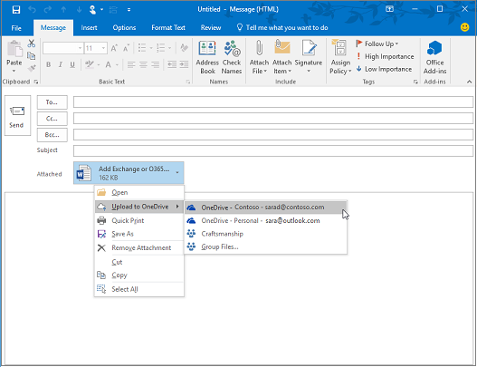

# Till identitet och efter – en arkitekts synvinklar

I den här artikeln, [Alex Shteynberg](https://www.linkedin.com/in/alex-shteynberg/), huvudsaklig tekniska arkitekt hos Microsoft, beskrivs de vanligaste design strategierna för företags organisationer som har Microsoft 365 och andra moln tjänster från Microsoft.

## Om författaren

Jag är en huvudsaklig teknisk arkitekt i New York [Microsoft Technology Center](https://www.microsoft.com/mtc?rtc=1). Jag jobbar oftast med stora kunder och komplicerade behov. Mina åsikter och åsikter baseras på dessa interaktioner och kanske inte gäller för varje situation. Om vi kan hjälpa kunder med de mest komplicerade utmaningarna kan vi emellertid hjälpa alla kunder. 

Jag arbetar vanligt vis med 100 + kunder varje år. När alla organisationer har unika egenskaper är det intressant att se trender och commonalities. Till exempel är en trend mellan bransch intresse för många kunder. Efter allt kan en bank filial också vara en kafé och en community-grupp. 

I min roll fokuserar jag på att hjälpa kunder att nå den bästa tekniska lösningen för att adressera sin unika uppsättning affärs mål. Officiellt fokuserar jag på identitet, säkerhet, sekretess och efterlevnad. Jag älskar att dessa rör sig allt. Jag får tillfälle att delta i de flesta projekt. Då håller jag det och gillar den här rollen. 

Jag bor i New York-staden (det bästa!) och har stor nytta av dess kultur, mat och andra (inte trafik). Jag älskar att resa när jag kan och hoppas att få ut mesta möjliga av världen i min livs längd. Jag håller på att söka efter en resa i Afrika för att få veta mer om vilda djur.

## Väg LED ande principer 

- **Enkel är ofta bättre** – du kan göra (nästan) allt med teknik. Det betyder inte att du bör. I säkerhets rymden är många kunder Överlagrings lösningar. Jag gillar [den här videon](https://www.youtube.com/watch?v=SOQgABDSYZE) från en plats konferens med Google för att under Visa den här punkten.
- **Personer, processer, teknologi** — [design för](https://en.wikipedia.org/wiki/Human-centered_design) att förbättra processen, inte Tech först. Det finns inga "perfekta" lösningar. Vi måste balansera olika riskfaktorer och beslut varierar beroende på var och en av företagen. För många kunder utformar ett sätt som användarna vid ett senare tillfälle att undvika.
- **Fokusera på "Varför" först och "hur" senare** — vara det irriterande 7-åriga gamla barn med en miljon frågor. Det går inte att komma åt rätt svar om vi inte känner till rätt frågor. Många kunder gör antaganden om hur saker ska fungera i stället för att definiera företags problemet. Det finns alltid flera vägar som kan tas med.
- Mycket **god praxis** – känner av att metod tipsen ändras till lätt. Om du har tittat på Azure AD för mer än 3 månader sedan, är du troligt vis inaktuell. Allt här kan komma att ändras efter publicering. Alternativet "bäst" kan inte vara samma sex månader från och med nu.

## Grundläggande begrepp

Hoppa inte över det här avsnittet. Jag får ofta veta att jag måste gå tillbaka till dessa ämnen, även för kunder som har använt moln tjänster för åren.
Alas, språket är inte ett exakt verktyg. Vi använder ofta samma ord för att betyda olika koncept eller olika ord för samma koncept. Jag använder ofta diagrammet nedan för att skapa en del grundläggande terminologi och "hierarkisk modell".
  

  

 

När du får reda på simbana är det bättre att starta poolen och inte mitt i havet. Jag försöker inte vara tekniskt korrekt med det här diagrammet. Det är en modell där du kan diskutera grundläggande koncept. 

I diagrammet:
- Klient organisation = en instans av Azure AD. Det är längst upp i en hierarki eller nivå 1 i diagrammet. Det här kan ses som "[gräns](https://docs.microsoft.com/azure/active-directory/users-groups-roles/licensing-directory-independence)" där allt annat inträffar ([Azure AD B2B](https://docs.microsoft.com/azure/active-directory/b2b/what-is-b2b) tar undan). Alla Microsoft Enterprise Cloud-tjänster ingår i en av dessa klient organisationer. Konsument tjänsterna är separata. "Innehavare" visas i dokumentation som Office 365-klient organisation, Azure-klient, WVD-klient organisation etc. Jag tycker ofta att dessa variationer orsakar förvirring för kunder.
- Tjänster/prenumerationer, nivå 2 i diagrammet, tillhör en och bara en innehavare. De flesta SaaS-tjänsterna är 1:1 och kan inte flyttas utan migrering. Azure är annorlunda, du kan [Flytta fakturering](https://docs.microsoft.com/azure/cost-management-billing/manage/billing-subscription-transfer) och/eller ett [abonnemang](https://docs.microsoft.com/azure/active-directory/fundamentals/active-directory-how-subscriptions-associated-directory) till en annan klient organisation. Det finns många kunder som måste flytta Azure-prenumerationer. Det här har olika implication. Objekt som finns utanför prenumerationen (till exempel RBAC-och Azure AD-objekt inklusive grupper, appar, principer osv.) flyttas inte. Dessutom flyttas vissa tjänster (Azure Key Vault, data brickor etc.) i ett icke-funktionellt läge. Migrera inte tjänster utan ett gott företags behov. Vissa skript som kan vara till hjälp för migrering [delas på GitHub](https://github.com/lwajswaj/azure-tenant-migration). 
- En viss tjänst har vanligt vis en del av "gräns på under nivå" eller nivå 3 (L3). Detta är användbart för att förstå för åtskillnad av säkerhet, principer, styrelse etc. Tyvärr finns det inget enhetligt namn som jag känner till. Här är några exempel namn för L3: Azure Subscription = [resurs](https://docs.microsoft.com/azure/azure-resource-manager/management/manage-resources-portal); Dynamics 365 CE = [instans](https://docs.microsoft.com/dynamics365/admin/new-instance-management); Power BI = [arbets yta](https://docs.microsoft.com/power-bi/service-create-the-new-workspaces); Power Apps = [miljö](https://docs.microsoft.com/power-platform/admin/environments-overview); o.d..
- Nivå 4 är den faktiska informationen. Det här är ett komplext ämne. För vissa tjänster används Azure AD för RBAC, andra inte. Jag diskuterar det lite när vi får delegera ämnen.

Vissa ytterligare begrepp som jag hittar många kunder (och Microsoft-anställda) förkortar med eller har frågor om följande:

- Vem som helst kan [skapa](https://docs.microsoft.com/azure/active-directory/fundamentals/active-directory-access-create-new-tenant) många klient organisationer [utan kostnad](https://azure.microsoft.com/pricing/details/active-directory/). Du behöver ingen tjänst etablerad i den. Jag har dussin tals. Varje klient organisations namn är unikt i Microsofts moln tjänster i hela världen (dvs. två innehavare kan ha samma namn). Alla är i formatet för TenantName.onmicrosoft.com. Det finns också processer som skapar klient organisationer automatiskt ([ohanterade klient organisationer](https://docs.microsoft.com/azure/active-directory/users-groups-roles/directory-self-service-signup)). Detta kan till exempel inträffa när en användare registrerar sig för en företags tjänst med en e-postdomän som inte finns i någon annan klient organisation. 
- I en hanterad klient organisation kan många [DNS-domäner](https://docs.microsoft.com/azure/active-directory/fundamentals/add-custom-domain) vara registrerade i den. Detta ändrar inte det ursprungliga klient organisations namnet. Det finns för närvarande inget enkelt sätt att byta namn på en klient organisation (annan än migrering). Även om klient organisationens namn inte är avgörande för dessa dagar kanske vissa av dem kan begränsas.
- Du bör reservera ett klient organisations namn även om du inte ännu planerar att distribuera några tjänster. I annat fall kan någon ta med dig från dig och det finns ingen enkel process att ta tillbaka (samma problem som DNS-namn). Jag hör detta för ofta från kunder. Vad klient namnet bör vara är ett debatten-ämne.
- Om du äger DNS-namnrymd (er) bör du lägga till alla dessa till klient organisationerna. Annars kan en [ohanterad klient organisation](https://docs.microsoft.com/azure/active-directory/users-groups-roles/directory-self-service-signup) med det här namnet skapas och det gör att [den hanteras](https://docs.microsoft.com/azure/active-directory/users-groups-roles/domains-admin-takeover).
- DNS-namnområdet (till exempel contoso.com) kan tillhöra en enda klient organisation. Det här har implication för olika scenarier (till exempel att dela en e-postdomän under en fusion eller ett förvärv osv.) Det finns ett sätt att registrera en DNS-sub (till exempel div.contoso.com) i en annan klient organisation, men det bör undvikas. När du registrerar ett domän namn på den översta nivån antas alla under domäner tillhöra samma klient organisation. I scenarier med flera innehavare (se nedan) rekommenderar jag att använda ett annat domän namn på toppnivå (till exempel contoso.ch eller ch-contoso.com).
- Vem bör "äga" en klient organisation? Jag ser ofta kunder som för närvarande äger sin klient organisation. Det här är en stor röd flagga. Ring Microsoft Support ASAP. Precis som problematiska är en tjänst ägare (ofta en Exchange-administratör) för att hantera en klient organisation. Klient organisationen kommer att innehålla alla tjänster som du kanske vill ha i framtiden. Innehavarens ägare bör vara en grupp som kan fatta beslut om aktivering av alla moln tjänster i en organisation. Ett annat problem är när en klient ägar grupp blir ombedd att hantera alla tjänster. Detta gäller inte för stora organisationer.
- Det finns inget koncept för en sub/Super-klient organisation. Av någon anledning behåller den här Myth upprepa sig. Detta gäller även för [Azure AD B2C](https://docs.microsoft.com/azure/active-directory-b2c/) -klient organisationer. Jag hör för många gånger, "min B2C-miljö finns i min XYZ-klient organisation," eller "Hur flyttar jag min Azure-klient till min Office 365-klient organisation?"
- Det här dokumentet fokuserar sig mest på det kommersiella molnet i hela världen, eftersom det är det som de flesta kunder använder. Det är ibland användbart att veta mer om de [suveräna molnen](https://docs.microsoft.com/azure/active-directory/develop/authentication-national-cloud). Suveräna moln har ytterligare konsekvenser för att diskutera vilka som är utanför räckvidden för denna diskussion.

## Rikt linje ämnen

Det finns massor av dokumentation om Microsofts identitets plattform – Azure Active Directory (Azure AD). För de som precis har startat känns det ofta bra. Även efter att du har lärt dig kan det vara svårt att hålla kontakten med ständig innovation och förändringar. I mina kund kontakter ser jag ofta att den fungerar som "översättare" mellan företags mål och "bra, bättre och bäst"-tillvägagångs sätt för att adressera dessa (samt de mänskliga "Cliff anteckningarna"). Det är sällan ett perfekt svar och "rätt"-beslutet är en avvägning av olika riskfaktorer. Nedan följer några vanliga frågor och Förväxlings områden jag brukar diskutera med kunder.

### Etablering
Azure AD löser inte bristande styrelse former i din identitet. [Identitets styrning](https://docs.microsoft.com/azure/active-directory/governance/identity-governance-overview) bör vara ett kritiskt element oberoende av eventuella moln beslut. Styr behoven förändras över tiden som är orsaken till ett program och inte ett verktyg. 

[Azure AD Connect](https://docs.microsoft.com/azure/active-directory/hybrid/whatis-azure-ad-connect) kontra [Microsoft Identity Manager](https://docs.microsoft.com/microsoft-identity-manager/microsoft-identity-manager-2016) (MIM) kontra något annat (tredje part eller anpassad)? Spara pengar på dig och gå vidare med Azure AD Connect. Det finns många smarta sätt att adressera särskilda kundkonfigurationer och fort löp ande innovationer. 

Vissa fall som kan ha en mer komplex arkitektur:
- Jag har flera AD-skogar utan nätverks förbindelse mellan dessa. Det finns ett nytt alternativ som kallas [moln etablering](https://docs.microsoft.com/azure/active-directory/cloud-provisioning/what-is-cloud-provisioning).
- Jag har inte Active Directory och kan inte heller installera den. Azure AD Connect kan konfigureras för att [Synkronisera från LDAP](https://docs.microsoft.com/azure/active-directory/hybrid/plan-hybrid-identity-design-considerations-tools-comparison) (partner kanske krävs).
- Jag måste etablera samma objekt till flera klient organisationer. Detta stöds inte tekniskt, men beror på definitionen av "samma".

Bör jag anpassa standardinställningarna för synkronisering ([Filtrera objekt](https://docs.microsoft.com/azure/active-directory/hybrid/how-to-connect-sync-configure-filtering), [ändra attribut](https://docs.microsoft.com/azure/active-directory/hybrid/reference-connect-sync-attributes-synchronized), [alternativt inloggnings-ID](https://docs.microsoft.com/azure/active-directory/hybrid/plan-connect-userprincipalname)osv.)? Undvik! En identitets plattform är bara värdefull som de tjänster som använder den. Även om du kan göra alla typer av Nutty-konfigurationer för att besvara den här frågan måste du titta på hur programmen påverkas. Om du filtrerar e-postaktiverade objekt kommer GAL för online-tjänsterna att vara ofullständiga; om programmet är beroende av specifika attribut kommer de att få oförutsägbara effekter; o.d.. Det är inte ett identitets Teams beslut.

XYZ SaaS har stöd för JIT-etablering (just-in-Time), varför behöver jag inte synkronisera? Se ovan. Många program behöver "profil"-information för funktionaliteten. Du kan inte ha en GAL-lista om alla e-postaktiverade objekt inte är tillgängliga. Detsamma gäller [användar etableringen](https://docs.microsoft.com/azure/active-directory/app-provisioning/user-provisioning) i program integrerade med Azure AD.

### Autentisering

[Lösen ords-hash-synkronisering](https://docs.microsoft.com/azure/active-directory/hybrid/how-to-connect-password-hash-synchronization) (PHS) kontra [vidarekoppling](https://docs.microsoft.com/azure/active-directory/hybrid/how-to-connect-pta-how-it-works) (PTA) kontra [Federation](https://docs.microsoft.com/azure/active-directory/hybrid/how-to-connect-fed-compatibility).

Vanligt vis finns det en starkt [debatten](https://docs.microsoft.com/azure/active-directory/hybrid/choose-ad-authn) kring federationen. Enklare är ofta bättre och därför bör du använda PHS såvida du inte har en bra anledning. Det går också att konfigurera olika autentiseringsmetoder för olika DNS-domäner i samma klient organisation. 

Vissa kunder aktiverar Federation + PHS huvudsakligen för:
- Ett alternativ för att [återgå](https://docs.microsoft.com/azure/active-directory/hybrid/plan-migrate-adfs-password-hash-sync) till (för katastrof återställning) om Federations tjänsten inte är tillgänglig.
- Ytterligare funktioner (ex.: [Azure AD DS](https://docs.microsoft.com/azure/active-directory-domain-services/tutorial-configure-password-hash-sync)) och säkerhets tjänster (ex.: [läckda autentiseringsuppgifter](https://docs.microsoft.com/azure/active-directory/reports-monitoring/concept-risk-events#leaked-credentials))
- Stöd för tjänster i Azure som inte förstår federerad inloggningsautentisering (ex.: [Azure-filer](https://docs.microsoft.com/azure/storage/files/storage-files-active-directory-overview)).

Jag vägleder ofta kunder via klientens autentiseringspaket för att klargöra vissa problem. Resultatet ser ut som på bilden nedan, som inte är lika bra som den interaktiva processen att komma igång.

Den här typen av whiteboard-ritningar illustrerar var säkerhets principer tillämpas i flödet för en autentiseringsbegäran. I det här exemplet tillämpas principer via AD FS (Active Directory Federation Service) för den första tjänst förfrågan, men inte efterföljande tjänst begär Anden. Det här är åtminstone en anledning till att flytta säkerhets kontroller till molnet så mycket som möjligt.

Vi har jagar drömn med [enkel inloggning](https://docs.microsoft.com/azure/active-directory/manage-apps/what-is-single-sign-on) (SSO) så länge jag kommer ihåg. Vissa kunder tror att de kan nå detta genom att välja "Right" Federation (STS)-leverantören. Azure AD kan avsevärt bidra till att [Aktivera SSO](https://docs.microsoft.com/azure/active-directory/manage-apps/plan-sso-deployment) -funktioner, men ingen STS är magiska. Det finns för många "gamla" autentiseringsmetoder som fortfarande används för kritiska program. Att utöka Azure AD med [partner lösningar](https://docs.microsoft.com/azure/active-directory/saas-apps/tutorial-list) kan adressera många av dessa scenarier. SSO är en strategi och en resa. Det går inte att hitta utan att flytta till [standarder för program](https://docs.microsoft.com/azure/active-directory/develop/v2-app-types). Relaterat till det här avsnittet handlar om att svara på [lösen ords](https://docs.microsoft.com/azure/active-directory/authentication/concept-authentication-passwordless) lös problem som också inte har ett magiska-svar. 

[Multifaktorautentisering](https://docs.microsoft.com/azure/active-directory/authentication/concept-mfa-howitworks) är viktig i dag ([här](https://techcommunity.microsoft.com/t5/azure-active-directory-identity/your-pa-word-doesn-t-matter/ba-p/731984) för mer). Lägg till [användar beteende analys](https://docs.microsoft.com/azure/active-directory/authentication/tutorial-risk-based-sspr-mfa) och du har en lösning som förhindrar de flesta vanliga cyberterrorism-attacker. Även konsument tjänster flyttar till Kräv MFA. Men jag träffas ändå med många kunder som inte vill gå vidare med [moderna autentiseringsmetoder](https://docs.microsoft.com/microsoft-365/enterprise/hybrid-modern-auth-overview) . Det största argument jag hör är att det påverkar användare och äldre program. Ibland kan det vara bra att använda kunderna för att flytta längs Exchange Online- [ändringar](https://techcommunity.microsoft.com/t5/exchange-team-blog/basic-auth-and-exchange-online-february-2020-update/ba-p/1191282). Massor av Azure AD- [rapporter](https://docs.microsoft.com/azure/active-directory/fundamentals/concept-fundamentals-block-legacy-authentication) är nu tillgängliga för att hjälpa kunder med över gången.

### Bemyndigande

Per [Wikipedia](https://en.wikipedia.org/wiki/Authorization), "att verifiera" är att definiera en åtkomst policy. Många ser att det är möjligt att definiera åtkomst kontroller till ett objekt (fil, tjänst osv.). I den aktuella världen av cyberterrorism hot är det här konceptet snabbt utveckling till en dynamisk princip som kan reagera på olika hot-vektorer och snabbt justera åtkomst kontroller som svar på dessa. Om jag till exempel har till gång till mitt bank konto från en ovanlig plats får jag ytterligare bekräftelse steg. För att det ska gå så måste vi ta hänsyn till själva principen utan eko systemen för hot Detection och signal korrelation.

Principmodulen för Azure AD implementeras med principer för [villkorsstyrd åtkomst](https://docs.microsoft.com/azure/active-directory/conditional-access/overview). Det här systemet beror på information från en mängd olika system för hot identifiering som gör dynamiska beslut. En enkel vy ser ut ungefär så här.

Genom att kombinera alla dessa signaler kan du göra dynamiska principer så här:
- Om det finns ett hot på din enhet kommer din åtkomst till data att minskas till Internet utan att ladda ner.
- Om du laddar ner en ovanligt stor mängd data krypteras och begränsas allt du laddar ner.
- Om du får till gång till en tjänst från en ohanterad enhet kommer du att blockeras av känslig information, men får åtkomst till icke-begränsande data utan att du kan kopiera den till en annan plats.

Om du godkänner den här utökade definitionen av godkännande måste du implementera ytterligare lösningar. Vilka lösningar du kan använda beror på hur dynamiskt du vill att principen ska vara och vilka hot du vill prioritera. Här är några exempel på sådana system:
- [Azure AD Identity Protection](https://docs.microsoft.com/azure/active-directory/identity-protection/) 
- [Azure-Avancerat skydd](https://docs.microsoft.com/azure-advanced-threat-protection/) (Azure ATP)
- [Microsoft Defender Avancerat skydd](https://docs.microsoft.com/windows/security/threat-protection/microsoft-defender-atp/microsoft-defender-advanced-threat-protection) (Microsoft Defender ATP)
- [Office 365 Avancerat skydd](https://docs.microsoft.com/microsoft-365/security/office-365-security/office-365-atp?view=o365-worldwide) (Office 365 ATP)
- [Säkerhet för Microsoft Cloud App](https://docs.microsoft.com/cloud-app-security/) (MCAS)
- [Microsoft Threat Protection](https://docs.microsoft.com/microsoft-365/security/mtp/microsoft-threat-protection?view=o365-worldwide) (MTP)
- [Microsoft Intune](https://docs.microsoft.com/mem/intune/)
- [Microsoft informations skydd](https://docs.microsoft.com/microsoft-365/compliance/protect-information?view=o365-worldwide) (MIP)
- [Azure Sentinel](https://docs.microsoft.com/azure/sentinel/) 

Utöver Azure AD har olika tjänster och program till gång till sina egna auktoriseringsregler. Vissa av dessa diskuteras senare i avsnittet delegering.

### Revisions
Azure AD har detaljerade funktioner för [granskning och rapportering](https://docs.microsoft.com/azure/active-directory/reports-monitoring/) . Detta är vanligt vis inte den enda informations källa som behövs för att fatta säkerhets beslut. Mer information finns i avsnittet delegering.

## Det finns ingen Exchange

Få panik när! Detta betyder inte att Exchange är föråldrat (eller SharePoint osv.) Den är fortfarande en kärn tjänst. Vad jag menar är, under lite tid nu, har teknik leverantörer över gång till användar upplevelser (UX) för att omfatta komponenter i flera tjänster. I Microsoft 365 är ett enkelt exempel "[moderna bilagor](https://support.office.com/article/Attach-files-or-insert-pictures-in-Outlook-email-messages-BDFAFEF5-792A-42B1-9A7B-84512D7DE7FC)" där bilagor till e-post lagras i SharePoint Online eller OneDrive för företag. 

När du tittar på Outlook-klienten kan du se många tjänster som är "anslutna" som en del av den här versionen, inte bara till Exchange. Detta inkluderar Azure AD, Microsoft Search, appar, profil, efterlevnad och Office 365-grupper. 

Läs mer om [Microsoft Fluid Framework](https://techcommunity.microsoft.com/t5/microsoft-365-blog/microsoft-ignite-blog-microsoft-fluid-framework-preview/ba-p/978268) för förhands granskning av kommande funktioner. I Förhandsgranska kan jag läsa och svara på konversationer direkt i Outlook. [Teams-klienten](https://products.office.com/microsoft-teams/download-app) är faktiskt ett av de mer framträdande exemplen på den här strategin. 

Generellt blir det svårare att rita en tom linje mellan Office 365 och andra tjänster i Microsoft moln. Jag visar det som en fantastisk fördel för kunder eftersom de kan dra nytta av total innovation i allt vi gör även om de använder en komponent. Det är ganska coolt och har stor betydelse för många kunder.

Nu hittar jag många kund IT-grupper strukturerade runt "produkter". Det är logiskt för en lokal värld eftersom du behöver en expert för varje enskild produkt. Men jag är helt glad att jag inte behöver felsöka en Active Directory-eller Exchange-databas någonsin igen eftersom de här tjänsterna har flyttat till molnet. Automation (den moln typen är) tar bort vissa återkommande manuella jobb (se vad som har hänt med fabrikerna). Men dessa ersätts med mer komplexa krav för att förstå interaktioner mellan tjänster, konsekvenser, företags behov etc. Om du är villig att [lära dig](https://docs.microsoft.com/learn/)kan du använda moln omvandling för att få fantastiska möjligheter. Innan jag kan prata med teknik pratar jag ofta med kunderna om att hantera förändringar i IT-färdigheter och team strukturer.

För alla SharePoint-fläktar-personer och-utvecklare, slutar du att fråga "Hur kan jag göra XYZ i SharePoint Online?" Använd [Power automatisering](https://docs.microsoft.com/power-automate/) (aka flöde) för arbets flödet är det en mycket kraftfull plattform. Använd [Azure bot-ramverket](https://docs.microsoft.com/azure/bot-service/?view=azure-bot-service-4.0) för att skapa ett bättre gränssnitt för din 500 000. Börja använda [Microsoft Graph](https://developer.microsoft.com/graph/) i stället för CSOM. [Microsoft Teams](https://docs.microsoft.com/MicrosoftTeams/Teams-overview) inkluderar SharePoint men också en värld mer. Det finns många andra exempel på. Det finns en omfattande och fantastiska universum. Öppna dörren och [börja utforska](https://docs.microsoft.com).

Den andra vanliga effekten är i området efterlevnad. De här kors tjänste metoderna verkar vara helt förvirrande av många efterlevnadsprinciper. Jag ser till att organisationer det står "Jag behöver göra all e-postkommunikation till ett eDiscovery-system." Vad innebär det verkligen när e-post inte längre är bara e-post, men ett fönster i andra tjänster? Office 365 har ett omfattande tillvägagångs sätt för att hantera [efterlevnad](https://docs.microsoft.com/microsoft-365/compliance/), men förändringar av personer och processer är ofta mycket svårare än teknik.

Det finns många andra människor och processer. Det här är ett kritiskt och underdiskuterat område. Kanske mer i en annan artikel.

## Struktur alternativ för innehavare

### En enskild klient organisation eller flera innehavare

Vanligt vis ska de flesta kunder endast ha en klient organisation. Det finns många anledningar till att flera innehavare är utmanande (ge det en [Bing-sökning](https://www.bing.com/search?q=office%20365%20multiple%20tenants)) eller läsa det här [dokumentet](https://aka.ms/multi-tenant-user). Samtidigt har många företags kunder jag arbetar med en annan (liten) klient organisation för IT-undervisning, testning och experimentering. Azure Access mellan klient organisationer är lättare med [Azure Lighthouse](https://azure.microsoft.com/services/azure-lighthouse/). Office 365 och många andra SaaS-tjänster har begränsningar för scenarier med flera innehavare. Det finns mycket att tänka på i [Azure AD B2B](https://docs.microsoft.com/azure/active-directory/b2b/what-is-b2b) -scenarier.

Många kunder slutar med flera produktionsanläggningar efter en fusion och ett förvärv (M&A) och vill konsolidera. Idag är den inte enkel och kräver Microsoft Consulting Services (MCS) eller en partner Plus program vara från tredje part. Det finns ett fort löp ande tillverknings arbete för att adressera olika scenarier med kunder med flera innehavare i framtiden. 

Vissa kunder väljer att arbeta med fler än en klient organisation. Detta bör vara ett mycket noggrant beslut och nästan alltid företags skäl. Här är några exempel:
- En företags struktur där det är lätt att samar beta mellan olika enheter och att det finns starka administrativa och andra isolerings behov.
- Efter ett förvärv görs ett företags beslut för att hålla två olika subjekt åtskilda.
- Simulering av en kunds miljö som inte ändrar kundens produktions miljö. 
- Utveckling av program vara för kunder.

I dessa scenarier med flera innehavare vill kunderna ofta hålla en del konfiguration likadan mellan hyres gäster, eller rapportera om konfigurations ändringar och drift. Detta innebär ofta att du flyttar från manuella ändringar till konfigurationen som kod. Microsoft Premiere Support erbjuder en verkstad för dessa typer av behov baserade på denna offentliga IP: [https://Microsoft365dsc.com](https://Microsoft365dsc.com) .

### Multi-geo 

För [multi-geo](https://docs.microsoft.com/microsoft-365/enterprise/microsoft-365-multi-geo) eller inte till multi-geo, det är frågan. Med Office 365 multi-geo kan du tillhandahålla och lagra data på andra geo platser som du har valt att uppfylla [data de](https://docs.microsoft.com/microsoft-365/enterprise/o365-data-locations) kraven. Det finns många olika former av den här funktionen. Tänk på följande: 
- Den ger inte prestanda för delar. Prestanda förbättras om [nätverks designen](https://aka.ms/office365networking) inte stämmer. Skaffa enheter "Stäng" till Microsoft-nätverket, inte nödvändigt vis för dina data.
- Det är inte en lösning för [GDPR efterlevnad](https://www.microsoft.com/trust-center/privacy/gdpr-overview). GDPR fokuserar inte på data suveränitet eller lagrings platser. Det finns andra ramverk för efterlevnad.
- Den löser inte delegation av administrationen (se nedan) eller [informations hinder](https://docs.microsoft.com/microsoft-365/compliance/information-barriers).
- Det är inte samma sak som flera klient organisationer och kräver ytterligare [användar konfiguration](https:/docs.microsoft.com/azure/active-directory/hybrid/how-to-connect-sync-feature-preferreddatalocation) för arbets flöden.
- Den flyttar inte [klient](https://docs.microsoft.com/microsoft-365/enterprise/moving-data-to-new-datacenter-geos) organisationen (din Azure AD) till en annan geografi. 

## Delegerad administration

I de flesta stora organisationer är det en nödvändig verklighet att separera arbets uppgifter och RBAC (rollbaserad åtkomst kontroll). Jag ber om ursäkt. Det är inte så enkelt som vissa kunder vill att det ska vara. Kund, juridik, efterlevnad och andra krav är olika och ibland krockar världen över. Enkelhet och flexibilitet är ofta på motstående sidor. Bli inte fel, vi kan göra jobbet bättre. Det är (och kommer att bli) avsevärt. Gå till ditt lokala [Microsoft Technology Center](https://www.microsoft.com/mtc) för att arbeta ut den modell som passar dina företags behov utan att läsa 379230-dokument! Här fokuserar jag på vad du bör tänka på och inte varför det är det här. Nedan följer fem olika områden som du kan planera och några av de vanliga frågorna som jag har stött på.

### Administratörs Center för Azure AD och Microsoft 365

Det finns en lång och växande lista över [inbyggda roller](https://docs.microsoft.com/azure/active-directory/users-groups-roles/directory-assign-admin-roles). Varje roll består av en lista med roll behörigheter grupperade för att tillåta att specifika åtgärder utförs. Du kan se dessa behörigheter på fliken "Beskrivning" i varje roll. Alternativt kan du se en mer lättläst version av dessa i administrations centret för Microsoft 365. Definitionerna för inbyggda roller kan inte ändras. I allmänhet kan du gruppera dessa i tre kategorier:

- **Global administratör** – den här "alla kraftfulla" rollen bör vara [mycket skyddad](https://docs.microsoft.com/microsoft-365/enterprise/protect-your-global-administrator-accounts) precis som i andra system. Vanliga rekommendationer är: ingen permanent tilldelning och användning av Azure AD reserverad Identity Management (PIM); starkt verifierat; o.d.. Den här rollen ger dig inte till gång till allting som standard. Vanligt vis ser jag förvirring om åtkomst till efterlevnad och Azure Access som diskuteras senare. Denna roll kan alltid tilldela åtkomst till andra tjänster i klient organisationen. 
- **Specifika tjänst administratörer** – vissa tjänster (Exchange, SharePoint, Power BI, etc.) använder administrations roller på flera nivåer från Azure AD. Detta är inte konsekvent med alla tjänster och det finns fler tjänst roller som diskuteras senare.
- **Funktionell** – det finns en lång (och mer ökande) lista över roller fokuserat på specifika operationer (gäst Inbjudnings programmet osv.). Med jämna mellanrum läggs fler av dessa till utifrån kundernas behov.

Det går inte att delegera allting (även om mellanrummet minskar), vilket innebär att den globala administratörs rollen måste användas ibland. Konfiguration – som-kod och automatisering bör övervägas istället för personer som är medlemmar i den här rollen.

**Obs!** administrations centret för Microsoft 365 har ett mer användarvänligt gränssnitt men har en delmängd funktioner jämfört med Azure AD admin-upplevelsen. Båda portarna använder samma Azure AD-roller så ändringar görs på samma plats. Tips: om du vill ha en prioriterad administratörs användar gränssnitt utan all Azure övrig e-post kan du använda den här funktionen [https://aad.portal.azure.com](https://aad.portal.azure.com) . 

Vad har du för namn? Gör inga antaganden från namnet på rollen. Språket är inte ett väldigt exakt verktyg. Målet bör vara att definiera åtgärder som måste delegeras innan du tittar på vilka roller som behövs. Om du lägger till någon i rollen "säkerhets läsare" blir den inte heller se säkerhets inställningar för allt. 

Möjligheten att skapa [anpassade roller](https://docs.microsoft.com/azure/active-directory/users-groups-roles/roles-custom-overview) är en vanlig fråga. Det här är begränsat till Azure AD i dag (se nedan) men växer med tiden. Jag tänker på dessa funktioner i Azure AD och kan inte spänna "ner" i hierarkin (ovan). När jag arbetar med "anpassat" brukar jag gå tillbaka till mitt huvud konto hos "enkel är bättre."

En annan gemensam fråga är möjligheten att scope-roller till en delmängd av en katalog. Ett exempel är något som "helpdesk-administratör för användare i EU". [Administrativa enheter](https://docs.microsoft.com/azure/active-directory/users-groups-roles/directory-administrative-units) (AU) är avsedda att adressera detta. Gilla ovan, jag tänker på dessa funktioner i Azure AD och kan inte spänna "ner". Vissa roller passar naturligtvis inte (globala administratörer, tjänst administratörer o.s.v.)

I dag kräver alla de här rollerna direkt medlemskap (eller dynamisk tilldelning om du använder [Azure AD PIM](https://docs.microsoft.com/azure/active-directory/privileged-identity-management/)). Detta innebär att kunderna måste hantera dessa direkt i Azure AD och de kan inte baseras på ett medlemskap i en säkerhets grupp. Jag är inte en fläkt till att skapa skript för att hantera dessa eftersom de måste köras med förhöjda rättigheter. Jag rekommenderar vanligt vis API-integrering med process system som ServiceNow eller med verktyg för partner styrning som Saviynt. Det finns teknik arbete med att adressera detta med tiden.

Jag nämnde [Azure AD PIM](https://docs.microsoft.com/azure/active-directory/privileged-identity-management/) några gånger. Det finns en motsvarande pam-lösning (Microsoft Identity [Manager) för](https://docs.microsoft.com/microsoft-identity-manager/pam/privileged-identity-management-for-active-directory-domain-services) lokala kontroller. Du kanske också vill titta på [behöriga åtkomst arbets stationer](https://docs.microsoft.com/windows-server/identity/securing-privileged-access/privileged-access-workstations) (PAWs) och [Azure AD Identity styrelse](https://docs.microsoft.com/azure/active-directory/governance/identity-governance-overview). Det finns en mängd olika verktyg från tredje part som du kan använda för att göra det på bara tillräckligt bara nog och dynamiskt förhöjd. Detta är vanligt vis en del av en större diskussion för att skydda en miljö. 

Ibland kan du använda scenarier för att lägga till en extern användare i en roll (se avsnittet multi-Tenant ovan). Det här fungerar bara. [Azure AD B2B](https://docs.microsoft.com/azure/active-directory/b2b/) är ett annat stort och roligt avsnitt för att vägleda kunderna genom kanske i en annan artikel.

### Säkerhet och efterlevnad Center (SCC)

[Behörigheter i säkerhets & för Office 365](https://docs.microsoft.com/microsoft-365/security/office-365-security/permissions-in-the-security-and-compliance-center) är en samling "roll grupper" som är åtskilda och unika för Azure AD-roller. Det kan vara förvirrande eftersom vissa av de här roll grupperna har samma namn som Azure AD-rollerna (till exempel säkerhets läsare), men de kan ha olika medlemskap. Jag föredrar användning av Azure AD-roller. Varje roll grupp består av en eller flera "roller" (se vad jag menar om att återanvända samma ord?) och låta medlemmar från Azure AD som är e-postaktiverade objekt. Du kan också skapa en roll grupp med samma namn som en roll som kan eller inte innehåller den rollen (Undvik förvirring).

I en mening är detta en utveckling av modellen för Exchange-rolltjänsten. Exchange Online har ett eget gränssnitt för [roll hantering](https://docs.microsoft.com/exchange/permissions-exo) . Vissa roll grupper i Exchange Online är låsta och hanteras från Azure AD eller till kontroll & efterlevnad, men andra kan ha samma eller liknande namn och hanteras i Exchange Online (som att lägga till i förvirring). Jag rekommenderar att du inte använder Exchange Online-användargränssnittet såvida du inte behöver omfattningar för Exchange Management.

Du kan inte skapa anpassade roller. Roller definieras av tjänster som skapas av Microsoft och kommer att växa allteftersom nya tjänster introduceras. Det här är en liknande koncept för [roller som definieras av program](https://docs.microsoft.com/azure/active-directory/develop/howto-add-app-roles-in-azure-ad-apps) i Azure AD. När nya tjänster är aktiverade måste ofta nya roll grupper skapas för att ge eller Delegera åtkomst till dessa (till exempel [Insider riskhantering](https://docs.microsoft.com/microsoft-365/compliance/insider-risk-management-configure?view=o365-worldwide#step-1-required-enable-permissions-for-insider-risk-management)).

Dessa roll grupper kräver också direkt medlemskap och får inte innehålla Azure AD-grupper. Idag stöds inte dessa roll grupper av Azure AD PIM. Som Azure AD-roller tenderar jag att rekommendera hantering av dessa via API: er eller en partner som styr produkten, till exempel Saviynt, eller andra.

Säkerhets & roll Center roller omfattar Microsoft 365 och du kan inte omfånget med de här roll grupperna till en del av miljön (till exempel om du har administrativa enheter i Azure AD). Många kunder frågar hur de kan dela ombud. Till exempel: "skapa en DLP-princip endast för användare av EU." Om du har rätt till en viss funktion i säkerhets & Compliance Center har du rätt till allt som täcks av den här funktionen i klient organisationen. Många principer har emellertid funktioner för att rikta en delmängd av miljön (till exempel "gör de här [etiketterna](https://docs.microsoft.com/microsoft-365/compliance/create-sensitivity-labels#publish-sensitivity-labels-by-creating-a-label-policy) tillgängliga endast för dessa användare"). Lämpliga styrelse former och kommunikation är en viktig komponent för att undvika konflikter. Vissa kunder väljer att implementera en "konfiguration som kod"-metod för att hantera under delegering i säkerhets &s kontroll Center. Vissa specifika tjänster stöder delegering (se nedan). 

Det är värt att notera att de kontroller som för närvarande hanteras via säkerhets & Compliance Center (protection.office.com) håller på att migreras till två olika administratörer: security.microsoft.com och compliance.microsoft.com. Det är den enda konstanten.

### Specifik tjänst

Som tidigare nämnts är många kunder som vill ha en mer detaljerad delegations modell. Ett vanligt exempel: "hantera XYZ-tjänsten endast för Division X-användare och platser" (eller någon annan dimension). Möjligheten att göra detta beror på varje tjänst och inte är konsekvent mellan tjänster och funktioner. Dessutom kan varje tjänst ha en separat och unik RBAC-modell. I stället för att diskutera alla dessa (det tar för lång tid), jag lägger till relevanta länkar för varje tjänst. Det här är inte en fullständig lista, men den kommer att komma igång.

- **Exchange Online** - [https://docs.microsoft.com/exchange/permissions-exo/permissions-exo](https://docs.microsoft.com/exchange/permissions-exo/permissions-exo) 
- **SharePoint Online** - [https://docs.microsoft.com/sharepoint/manage-site-collection-administrators](https://docs.microsoft.com/sharepoint/manage-site-collection-administrators) 
- **Microsoft Teams**  -  [https://docs.microsoft.com/microsoftteams/itadmin-readiness ](https://docs.microsoft.com/microsoftteams/itadmin-readiness )
- **eDiscovery** - [https://docs.microsoft.com/microsoft-365/compliance/assign-ediscovery-permissions](https://docs.microsoft.com/microsoft-365/compliance/) 
  + **Behörighets filtrering**  -  [https://docs.microsoft.com/microsoft-365/compliance/permissions-filtering-for-content-search ](https://docs.microsoft.com/microsoft-365/compliance/)
  + **Efterföljandekrav**  -  [https://docs.microsoft.com/microsoft-365/compliance/set-up-compliance-boundaries ](https://docs.microsoft.com/microsoft-365/compliance/set-up-compliance-boundaries )
  + **Avancerad eDiscovery**  -  [https://docs.microsoft.com/microsoft-365/compliance/overview-ediscovery-20 ](https://docs.microsoft.com/microsoft-365/compliance/overview-ediscovery-20 )
- **Yammer** - [https://docs.microsoft.com/yammer/manage-yammer-users/manage-yammer-admins](https://docs.microsoft.com/yammer/manage-yammer-users/manage-yammer-admins) 
- **Multi-geo** - [https://docs.microsoft.com/microsoft-365/enterprise/add-a-sharepoint-geo-admin](https://docs.microsoft.com/microsoft-365/enterprise/add-a-sharepoint-geo-admin) 
- **Dynamics 365** – [https://docs.microsoft.com/dynamics365/](https://docs.microsoft.com/dynamics365/)  
  OBS! den här länken är till roten i dokumentationen. Det finns flera typer av tjänster med variationer i administratörs-och Delegerings modellen.
- **Power Platform**  -  [https://docs.microsoft.com/power-platform/admin/admin-documentation ](https://docs.microsoft.com/power-platform/admin/admin-documentation )
  + **Power Apps**  -  [https://docs.microsoft.com/power-platform/admin/wp-security ](https://docs.microsoft.com/power-platform/admin/wp-security )  
    Obs! det finns flera typer av variationer i administratörs-och Delegerings modellerna.
  + **Automatisk strömförsörjning**  -  [https://docs.microsoft.com/power-automate/environments-overview-admin ](https://docs.microsoft.com/power-automate/environments-overview-admin )
  + **PowerBI**  -  [https://docs.microsoft.com/power-bi/service-admin-governance ](https://docs.microsoft.com/power-bi/service-admin-governance )  
Obs! data plattforms säkerhet och delegering (som Power BI är en komponent) är ett komplext område.
- **MEM/Intune**  -  [https://docs.microsoft.com/mem/intune/fundamentals/role-based-access-control ](https://docs.microsoft.com/mem/intune/fundamentals/role-based-access-control )
- **Microsoft Defender ATP**  -  [https://docs.microsoft.com/windows/security/threat-protection/microsoft-defender-atp/user-roles ](https://docs.microsoft.com/windows/security/threat-protection/microsoft-defender-atp/user-roles )
- **Skydd mot Microsoft Threat** - [https://docs.microsoft.com/microsoft-365/security/mtp/mtp-permissions](https://docs.microsoft.com/microsoft-365/security/mtp/mtp-permissions)
- **Säkerhet för Microsoft Cloud App** - [https://docs.microsoft.com/cloud-app-security/manage-admins](https://docs.microsoft.com/cloud-app-security/manage-admins)
- **Direkt uppspelning**  -  [https://docs.microsoft.com/stream/assign-administrator-user-role ](https://docs.microsoft.com/stream/assign-administrator-user-role )
- **Informations hinder**  -  [https://docs.microsoft.com/microsoft-365/compliance/information-barriers ](https://docs.microsoft.com/microsoft-365/compliance/information-barriers )

För resten är sökning i dokument mycket bra på sistone- [https://docs.microsoft.com/](https://docs.microsoft.com/microsoft-365/compliance/information-barriers) . 

### Aktivitets loggar
Office 365 har en [enhetlig Gransknings logg](https://docs.microsoft.com/microsoft-365/compliance/search-the-audit-log-in-security-and-compliance). Det är en mycket [detaljerad logg](https://docs.microsoft.com/office/office-365-management-api/office-365-management-activity-api-schema), men läser inte in för mycket i namnet. Det kanske inte innehåller allt du vill ha eller behöver för din säkerhet och efterlevnad. Vissa kunder är också intresserade av [Avancerad granskning](https://docs.microsoft.com/microsoft-365/compliance/advanced-audit). 

Här är några exempel på Microsoft 365-loggar som nås via andra API: er.
- [Azure AD](https://docs.microsoft.com/azure/azure-monitor/platform/diagnostic-settings) (aktiviteter som inte är relaterade till Office 365)
- [Exchange meddelande spårning](https://docs.microsoft.com/powershell/module/exchange/get-messagetrace?view=exchange-ps)
- Hot/UEBA-system som diskuteras ovan (till exempel Azure AD Identity-skydd, Microsoft Cloud App Security, Microsoft Defender ATP etc.)
- [Microsoft informations skydd](https://docs.microsoft.com/microsoft-365/compliance/data-classification-activity-explorer?view=o365-worldwide)
- [Microsoft Defender Avancerat skydd](https://docs.microsoft.com/windows/security/threat-protection/microsoft-defender-atp/api-power-bi)
- [Microsoft Graph](https://graph.microsoft.com)

Det är viktigt att först identifiera alla loggnings källor som behövs för ett säkerhets-och kompatibilitetstillstånd. Observera också att olika loggar har olika begränsningar för sid lagring. 

Från administratören för administratörs delegation har de flesta Microsoft 365-aktivitets loggarna ingen inbyggd RBAC-modell. Om du har behörighet att visa en logg kan du se allting i den. Ett vanligt exempel på kund krav är: "Jag vill kunna fråga aktivitet endast för användare av EU (eller någon annan dimension). För att uppfylla detta krav måste vi överföra loggar till en annan tjänst. I Microsofts moln rekommenderas vi att överföra det till antingen [Azure Sentinel](https://docs.microsoft.com/azure/sentinel/overview) eller [logg analys](https://docs.microsoft.com/azure/azure-monitor/learn/quick-create-workspace). 

Diagram med hög nivå:

  

Diagrammet ovan visar inbyggda funktioner för att skicka loggar till Händelsehubben och/eller Azure-lagring och/eller Azure logg analys. Alla system inkluderar inte den här rutan. Men det finns andra sätt att skicka dessa loggar till samma lagrings plats. Se till exempel [skydda dina team med Azure Sentinel](https://techcommunity.microsoft.com/t5/azure-sentinel/protecting-your-teams-with-azure-sentinel/ba-p/1265761).

Om du kombinerar alla loggar till en lagrings plats inkluderar du extra förmån, till exempel kors korrelationer, anpassade lagrings tider, förstärker med data som behövs för att hantera RBAC-modellen etc. När data finns i detta lagrings system kan du skapa en PowerBI-instrumentpanel (eller någon annan typ av visualisering) med en lämplig RBAC-modell.

Loggar behöver inte dirigeras till endast en enda plats. Det kan också vara bra att integrera [Office 365-loggar med säkerhet för Microsoft Cloud App](https://docs.microsoft.com/cloud-app-security/connect-office-365-to-microsoft-cloud-app-security) eller en anpassad RBAC-modell i [Power BI](https://docs.microsoft.com/microsoft-365/admin/usage-analytics/usage-analytics?view=o365-worldwide). Olika databaser har olika fördelar och mål grupper.

Det är värt att nämna att det finns ett inbyggt analys system för säkerhet, hot, sårbarheter etc. i en tjänst som heter [Microsoft Threat Protection](https://docs.microsoft.com/microsoft-365/security/mtp/microsoft-threat-protection?view=o365-worldwide).

Många stora kunder vill överföra denna loggnings information till ett tredje parts system (till exempel SIEM). Det finns olika sätt, men i-allmänt Azure- [händelsehubben](https://docs.microsoft.com/azure/azure-monitor/platform/stream-monitoring-data-event-hubs) och- [graf](https://docs.microsoft.com/graph/security-integration) är det bra utgångs punkten.

### Azure 
Jag blir ofta tillfrågad om det finns ett sätt att avgränsa roller med hög behörighet mellan Azure AD, Azure och SaaS (ex.: global administratör för Office 365 men inte Azure).  Inte riktigt.  Arkitektur med flera innehavare behövs om fullständig administrativ separation krävs, men den lägger till avsevärd [komplexitet](https://aka.ms/multi-tenant-user) (se ovan). Alla dessa tjänster är en del av samma säkerhets-/identitets gräns (titta på hierarki modellen ovan).  

Det är viktigt att förstå relationer mellan olika tjänster i samma klient organisation. Jag arbetar med många kunder som bygger affärs lösningar som spänner över Azure, Office 365 och Power Platform (och dessutom även på lokala och tredjeparts moln tjänster). Ett vanligt exempel: 
-   Jag vill samar beta med en uppsättning dokument/bilder/m.m. (Office 365)
-   Skicka in var och en av dem via en godkännande process (Power Platform)
-   När alla komponenter har godkänts, sätter du in dessa i en Unified slut produkt (er) (s) [Microsoft Graph API](https://docs.microsoft.com/azure/active-directory/develop/microsoft-graph-intro) är din bästa kompis för dessa.  Inte omöjligt, men betydligt mer komplex för att designa en lösning som sträcker sig över [flera klient organisationer](https://docs.microsoft.com/azure/active-directory/develop/single-and-multi-tenant-apps).

Den Azure rollbaserad åtkomst kontrollen (RBAC) möjliggör detaljerad åtkomst hantering för Azure. Med RBAC kan du hantera åtkomst till resurser genom att ge användarna minst de behörigheter som krävs för att utföra sina jobb. Informationen är utanför omfattning för det här dokumentet men mer information om RBAC finns i [Vad är rollbaserad åtkomst kontroll (RBAC) i Azure?](https://docs.microsoft.com/azure/role-based-access-control/overview) RBAC är viktigt men bara en del av styr aspekterna för Azure. [Ramverket för moln införande](https://docs.microsoft.com/azure/cloud-adoption-framework/govern/) är en bra start punkt för att få mer information. Jag gillar hur min vän, Andres RAVINET hjälper kunderna att välja steg för steg, även om olika komponenter är på gång. En högkvalitativ vy för olika element (inte lika bra som processen för att komma till den faktiska kund modellen) ser ut ungefär så här:

Som du ser på bilden ovan bör många andra tjänster betraktas som en del av designen (ex.: [Azure-principer](https://docs.microsoft.com/azure/governance/policy/overview), Azure- [ritningar](https://docs.microsoft.com/azure/governance/blueprints/overview), [hanterings grupper](https://docs.microsoft.com/azure/governance/management-groups/), etc.)

## Sammanfattning
Startas som en kort sammanfattning längre tid än förväntat.  Jag hoppas nu att du är redo att bli av med att skapa en Delegerings modell för din organisation.  Denna konversation är väldigt vanlig för kunder. Det finns ingen modell som fungerar för alla. Väntar på några planerade förbättringar från Microsoft Engineering innan du dokumenterar vanliga mönster som vi ser på alla kunder. Under tiden kan du arbeta med ditt Microsoft-konto för att arrangera ett besök till närmaste [Microsoft Technology Center](https://www.microsoft.com/mtc).  Se dig!

