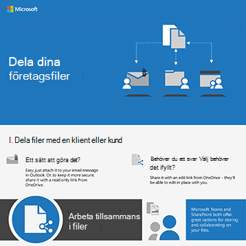
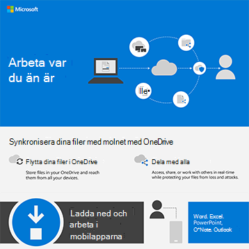
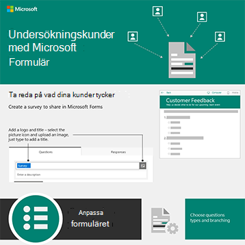

# Infografik för Microsoft 365 för dina användare

Infografiken representerar rekommendationer för arbete och samarbete i Microsoft 365. Dela dem med dina användare för att se till att de utnyttjar säker lagring och delning av filer, håller samarbetsmöten och mycket mer.

Mer nedladdningsbar [Office-infografik finns](https://support.microsoft.com/office/great-ways-to-work-with-office-6fe70269-b9a4-4ef0-a96e-7a5858b3bd5a) på [Microsoft 365-utbildningswebbplatsen.](https://support.microsoft.com/training)

## Säkerhetstips

Ladda ned den här infografiken med säkerhetstips för gruppmedlemmarna – oavsett om teamet är en organisation inom företaget eller ideella föreningar, t.ex. en politiska kampanj:

| Objekt | Beskrivning |
|:-----|:-----|
|   [Ladda ned som PDF](../campaigns/downloads/M365CampaignsWhatCanUsersDoToSecure.pdf)  \  [Ladda ned som PowerPoint](../campaigns/downloads/M365CampaignsWhatCanUsersDoToSecure.pptx)| Dela de här metodtipsen för att skydda organisationens information. Den här infografiken har skapats för att stödja personalen på politiska kampanjer eftersom dessa riktar sig till avancerade hackare. Du är välkommen att använda PowerPoint för att anpassa den här infografiken för din egen organisation. Relaterad artikel: [Hur säkerhetsrekommendationerna för Microsoft 365 påverkar dina användare](../campaigns/m365-campaigns-users.md)|

## Dela dina företagsfiler

Ladda ned en infografik för att få en snabb överblick över olika sätt att dela dina företagsfiler:
  
| Objekt | Beskrivning |
|:-----|:-----|
|   [Ladda ned som PDF](https://go.microsoft.com/fwlink/?linkid=2079435)  \  [Ladda ned som PowerPoint](https://go.microsoft.com/fwlink/?linkid=2079438) | Använd de här metodtipsen när du delar och samarbetar i företagsfiler så att du kan skydda din information. Relaterad artikel: [Översikt över delning av företagsfiler](../business-video/overview-file-sharing.md)|

## Hålla onlinemöten

Ladda ned en infografik för att få en snabb överblick över hur du ansluter till eller är värd för ett onlinemöte med Microsoft Teams:

| Objekt | Beskrivning |
|:-----|:-----|
|   [Ladda ned som PDF](https://go.microsoft.com/fwlink/?linkid=2078712)  \  [Ladda ned som PowerPoint](https://go.microsoft.com/fwlink/?linkid=2079515) | En snabb introduktion till hur du är värd för eller ansluter till ett onlinemöte med Microsoft Teams. Relaterad artikel: [Hålla onlinemöten för ditt företag](../business-video/overview-online-meetings.md)|

## Arbeta var du än är

Ladda ned en infografik för att få tips om hur du kan arbeta var du än är:

| Objekt | Beskrivning |
|:-----|:-----|
|   [Ladda ned som PDF](https://go.microsoft.com/fwlink/?linkid=2079451)  \  [Ladda ned som PowerPoint](https://go.microsoft.com/fwlink/?linkid=2079455) | Här finns tips om hur du ställer in mobila enheter så att du kan arbeta var du än är. Relaterad artikel: Arbeta [var du än är](../business-video/work-from-anywhere.md)|

## Undersökningskunder med Forms

Ladda ned en infografik för att ta reda på hur du undersökningskunder (interna eller externa) med Microsoft Forms:

| Objekt | Beskrivning |
|:-----|:-----|
|   [Ladda ned som PDF](https://go.microsoft.com/fwlink/?linkid=2079526)  \  [Ladda ned som PowerPoint](https://go.microsoft.com/fwlink/?linkid=2079446) | Använd Microsoft Forms för att ta reda på vad dina kunder tycker. Relaterad artikel: [Samla in information med Microsoft Forms](https://support.microsoft.com/topic/collect-information-with-microsoft-forms-a55d6e0d-04f6-45b8-b05f-b141b8ecb4d5)|
