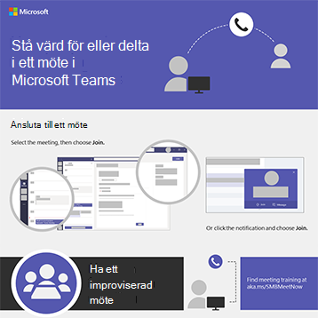

# Infografik för Microsoft 365 för dina användareMicrosoft 365 infographics for your users

Infografiken representerar rekommendationer för arbete och samarbete i Microsoft 365.These infographics represent best practices for working and collaborating in Microsoft 365. Dela dem med dina användare för att se till att de utnyttjar säker lagring och delning av filer, håller samarbetsmöten och mycket mer.Share them with your users to help ensure that they are taking advantage of secure storage and sharing for files, holding collaborative meetings, and more.

Mer nedladdningsbar [Office-infografik finns](https://support.microsoft.com/office/great-ways-to-work-with-office-6fe70269-b9a4-4ef0-a96e-7a5858b3bd5a) på [Microsoft 365-utbildningswebbplatsen.](https://support.microsoft.com/training)Find more [downloadable Office infographics](https://support.microsoft.com/office/great-ways-to-work-with-office-6fe70269-b9a4-4ef0-a96e-7a5858b3bd5a) on the [Microsoft 365 training](https://support.microsoft.com/training) site.

## SäkerhetstipsSecurity tips

Ladda ned den här infografiken med säkerhetstips för gruppmedlemmarna – oavsett om teamet är en organisation inom företaget eller ideella föreningar, t.ex. en politiska kampanj:Download this infographic with security tips for the members of your team - whether your team is a business or nonprofit organization, such as a political campaign:

| ObjektItem | BeskrivningDescription |
|:-----|:-----|
|   [Ladda ned som PDF](../campaigns/downloads/M365CampaignsWhatCanUsersDoToSecure.pdf)  \  [Ladda ned som PowerPoint](../campaigns/downloads/M365CampaignsWhatCanUsersDoToSecure.pptx)[Download as a PDF](../campaigns/downloads/M365CampaignsWhatCanUsersDoToSecure.pdf) \ [Download as a PowerPoint](../campaigns/downloads/M365CampaignsWhatCanUsersDoToSecure.pptx)| Dela de här metodtipsen för att skydda organisationens information.Share these best practices for keeping your organization's information secure. Den här infografiken har skapats för att stödja personalen på politiska kampanjer eftersom dessa riktar sig till avancerade hackare.This infographic was created to support the staff of political campaigns because these are targeted by sophisticated hackers. Du är välkommen att använda PowerPoint för att anpassa den här infografiken för din egen organisation.You are welcome to use the PowerPoint to customize this infographic for your own organization. Relaterad artikel: [Hur säkerhetsrekommendationerna för Microsoft 365 påverkar dina användare](../campaigns/m365-campaigns-users.md)Related article: [How the security recommendations for Microsoft 365 affect your users](../campaigns/m365-campaigns-users.md)|

## Dela dina företagsfilerShare your business files

Ladda ned en infografik för att få en snabb överblick över olika sätt att dela dina företagsfiler:Download an infographic to get a quick overview of ways to share your business files:
  
| ObjektItem | BeskrivningDescription |
|:-----|:-----|
|   [Ladda ned som PDF](https://go.microsoft.com/fwlink/?linkid=2079435)  \  [Ladda ned som PowerPoint](https://go.microsoft.com/fwlink/?linkid=2079438)[Download as a PDF](https://go.microsoft.com/fwlink/?linkid=2079435) \ [Download as a PowerPoint](https://go.microsoft.com/fwlink/?linkid=2079438) | Använd de här metodtipsen när du delar och samarbetar i företagsfiler så att du kan skydda din information.Use these best practices when you share and collaborate on business files so you can keep your information secure and protected. Relaterad artikel: [Översikt över delning av företagsfiler](../business-video/overview-file-sharing.md)Related article: [Overview of sharing business files](../business-video/overview-file-sharing.md)|

## Hålla onlinemötenHost online meetings

Ladda ned en infografik för att få en snabb överblick över hur du ansluter till eller är värd för ett onlinemöte med Microsoft Teams:Download an infographic to get a quick overview of how to join or host an online meeting with Microsoft Teams:

| ObjektItem | BeskrivningDescription |
|:-----|:-----|
|   [Ladda ned som PDF](https://go.microsoft.com/fwlink/?linkid=2078712)  \  [Ladda ned som PowerPoint](https://go.microsoft.com/fwlink/?linkid=2079515)[Download as a PDF](https://go.microsoft.com/fwlink/?linkid=2078712) \ [Download as a PowerPoint](https://go.microsoft.com/fwlink/?linkid=2079515) | En snabb introduktion till hur du är värd för eller ansluter till ett onlinemöte med Microsoft Teams.A quick introduction to how to host or join an online meeting with Microsoft Teams. Relaterad artikel: [Hålla onlinemöten för ditt företag](../business-video/overview-online-meetings.md)Related article: [Host online meetings for your business](../business-video/overview-online-meetings.md)|

## Arbeta var du än ärWork from anywhere

Ladda ned en infografik för att få tips om hur du kan arbeta var du än är:Download an infographic to get tips for working from anywhere:

| ObjektItem | BeskrivningDescription |
|:-----|:-----|
|   [Ladda ned som PDF](https://go.microsoft.com/fwlink/?linkid=2079451)  \  [Ladda ned som PowerPoint](https://go.microsoft.com/fwlink/?linkid=2079455)[Download as a PDF](https://go.microsoft.com/fwlink/?linkid=2079451) \ [Download as a PowerPoint](https://go.microsoft.com/fwlink/?linkid=2079455) | Här finns tips om hur du ställer in mobila enheter så att du kan arbeta var du än är.See tips for how to set up your mobile devices to allow you to work from anywhere. Relaterad artikel: Arbeta [var du än är](../business-video/work-from-anywhere.md)Related article: [Work from anywhere](../business-video/work-from-anywhere.md)|

## Undersökningskunder med FormsSurvey customers with Forms

Ladda ned en infografik för att ta reda på hur du undersökningskunder (interna eller externa) med Microsoft Forms:Download an infographic to find out how to survey customers (internal or external) with Microsoft Forms:

| ObjektItem | BeskrivningDescription |
|:-----|:-----|
|   [Ladda ned som PDF](https://go.microsoft.com/fwlink/?linkid=2079526)  \  [Ladda ned som PowerPoint](https://go.microsoft.com/fwlink/?linkid=2079446)[Download as a PDF](https://go.microsoft.com/fwlink/?linkid=2079526) \ [Download as a PowerPoint](https://go.microsoft.com/fwlink/?linkid=2079446) | Använd Microsoft Forms för att ta reda på vad dina kunder tycker.Use Microsoft Forms to find out what your customers think. Relaterad artikel: [Samla in information med Microsoft Forms](https://support.microsoft.com/topic/collect-information-with-microsoft-forms-a55d6e0d-04f6-45b8-b05f-b141b8ecb4d5)Related article: [Collect information with Microsoft Forms](https://support.microsoft.com/topic/collect-information-with-microsoft-forms-a55d6e0d-04f6-45b8-b05f-b141b8ecb4d5)|
