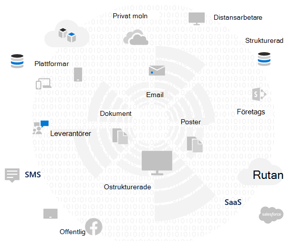
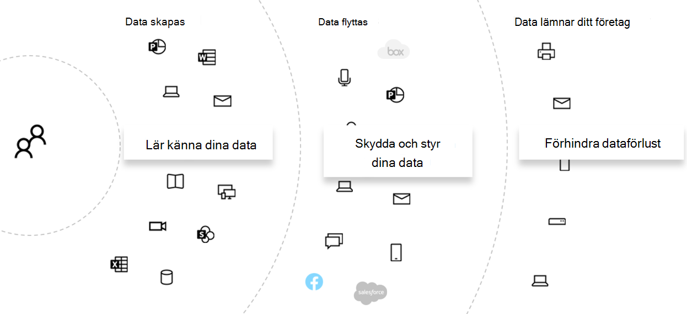
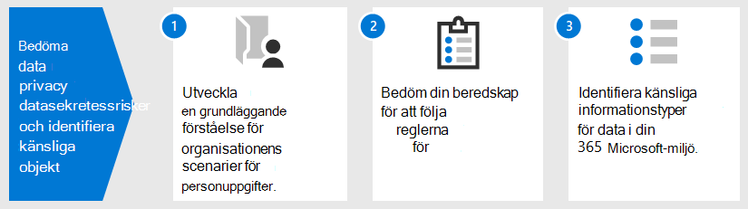
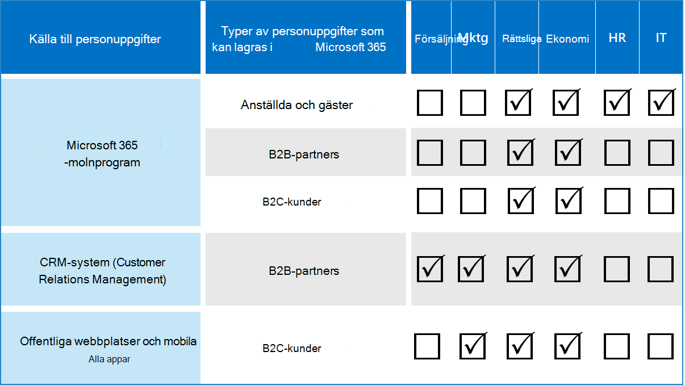

# Utvärdera data integritets risker och identifiera känsliga objekt med Microsoft 365

Utvärdering av de data integritets regler och-risker som din organisation är föremål för är en viktig åtgärd innan du genomför implementering av relaterade förbättrings åtgärder, inklusive funktioner och tjänster i Microsoft 365. 

## Eventuellt tillämpliga data integritets regler

En bra hänvisning till det bredare regelverket för data integritets regler finns i [Microsoft Services-förtroende-portalen](https://servicetrust.microsoft.com/) och [artiklarna i den allmänna förordningen om data skydd (GDPR)](../compliance/gdpr.md), samt annat material som gäller de bestämmelser du kan vara föremål för i din bransch eller region.

### GDPR

GDPR, den mest välkända och registrerade informations integritets reglerna, reglerar insamling, lagring, bearbetning och delning av person uppgifter som gäller för en identifierad eller identifierbar fysisk person som är bosatt i Europeiska unionen (EU). 

Enligt GDPR paragraf 4: 

- person uppgifter: uppgifter rörande en identifierad eller identifierbar fysisk person ("registrerade ämne"); en identifierbar fysisk person är en som kan identifieras, direkt eller indirekt, särskilt med hänvisning till en identifierare, till exempel ett namn, ett identifikations nummer, plats uppgifter, en online-ID eller en eller flera faktorer som är specifika för den fysiska, fysiologiska, genetiska, personliga, ekonomiska, kulturella eller sociala identiteten hos den fysiska personen.

### ISO 27001

Andra standarder som ISO 27001 har också erkänts av flera europeiska tillsynsmyndigheterna som en giltig proxyserver för människor, processer och teknik spektrum. De standarder det anger överlappande och konsekvens för ISO-27001-drivna skydd kan betraktas som en proxy som uppfyller vissa sekretess krav under vissa omständigheter.

### Andra integritets regler för data

Andra framträdande regler för data integritet anger också kraven för att hantera person uppgifter.

I USA ingår bland annat California konsument skydd Act ([CCPA](../compliance/ccpa-faq.md)), HIPAA-HITECH (policy för integritets skydd för USA) och Graham Leach Bliley Act (GLBA). Ytterligare statliga regler är också på plats eller under utveckling. 

Runt om i världen inkluderar fler exempel Tysklands nationella GDPR implementation Act (BDSG), Brasilien (Data Protection Act) och många andra.

## Regel mappning till Microsoft 365 tekniska kontroll kategorier

Många av reglerna för data integritet – relaterade har överlappande krav, så du bör inte förstå vilka förordningar de är föremål för innan tekniska kontroll system utvecklas. 

För att senare kunna referera till artiklarna i den här generella lösningen tillhandahåller den här tabellen utdrag ur ett urval av data integritets regler. 

| Tillämpningsförordning | Artikel/avsnitt | Utdrag | Lämpliga tekniska kontroll kategorier |
|:-------|:-----|:-------|:-------|
| GDPR | Paragraf 5 (1) (f) | Person uppgifter ska behandlas på ett sätt som säkerställer lämplig säkerhet för person uppgifter, inklusive skydd mot obehörig eller olaglig behandling samt mot oavsiktlig förlust, destruktion eller skada, med lämpliga tekniska eller organisatoriska åtgärder ("integritet och konfidentialitet").  |  Alla   Identitet   Enhet   Skydd för hotet   Skydda information   Styra information   Upptäcka och agera |
|  | Artikel (32) (1) (a) | Genom att ta hänsyn till bildens status, kostnaderna för implementeringen och arten, omfattningen, sammanhanget och ändamålen med bearbetning, samt risken att varierande sannolikhet och allvarlighets grad för fysiska personers fri-och rättigheter för dem, den registeransvarige och denna drifts ansvarige vidtar lämpliga tekniska och organisatoriska åtgärder för att säkerställa en säkerhets nivå som är lämplig för risken , inklusive bland annat: (a) pseudonymization och kryptering av person uppgifter. | Skydda information |
|  | Artikel (13) (2) (a) | "... vid den tidpunkt då person uppgifter hämtas ska den här informationen vara underkastad följande uppgifter som behövs för att säkerställa rättvis och öppen bearbetning: (a) den period som person uppgifterna ska lagras i, eller om det inte är möjligt, de kriterier som används för att fastställa denna period. | Styra information |
|  | Artikel (15) (1) (e) | Den registrerade ska ha rätt att från kontroll organet bekräfta om person uppgifter som berör honom eller henne behandlas, och om så är fallet, till gång till person uppgifter och följande uppgifter: (e) förekomsten av rätten att begära från kontroll panelens rättelse eller radering av person uppgifter rörande den registrerades eller för föremålet för sådan behandling | Upptäcka och agera |
| LGPD | Artikel 46 | Bearbetnings ombuden ska vidta säkerhets-, tekniska och administrativa åtgärder för att skydda person uppgifter från obehöriga och oavsiktliga och olagliga situationer med destruktion, förlust, ändring, kommunikation eller annan typ av icke godkänd eller olaglig behandling. | Skydda information   Styra information   Upptäcka och agera|
|  | Artikel 48 | Den registeransvarige måste meddela den nationella myndigheten och uppgifterna om en säkerhets tillbud som kan skapa risk eller relevant skada för dessa. | Upptäcka och agera |
| HIPPA-HITECH | 45 CFR 164.312 (e) (1) | Implementera tekniska säkerhets åtgärder för att skydda obehörig åtkomst till information om elektronisk skyddad hälsa som skickas via ett elektroniskt kommunikations nät verk. | Skydda information |
|  | 45 C.F.R. 164.312 (e) (2) (II) | Implementera en mekanism för att kryptera elektronisk skyddad hälso information när det bedöms lämpligt. | Skydda information |
|  | 45 CFR 164.312 (c) (2) | Implementera elektroniska mekanismer för att bekräfta att elektronisk skyddad hälso information inte har ändrats eller förstörts på ett otillbörligt sätt. | Styra information |
|  | 45 CFR 164.316 (b) (1) (i) | Om en åtgärd, aktivitet eller utvärdering krävs enligt det här kapitel ska dokumenteras, Upprätthåll ett skriftligt (som kan vara elektroniskt) med åtgärd, aktivitet eller utvärdering | Styra information |
|  | 45 CFR 164.316 (b) (1) (II) | Behåll den dokumentation som krävs enligt paragraf b (1) i det här avsnittet under 6 år efter den dag det skapades eller det datum då den senast användes, beroende på vilket som senare. | Styra information |
|  | 45 C.F.R. 164.308 (a) (1) (II) (D) | Implementera procedurer för att regelbundet granska poster med informations system aktivitet, till exempel gransknings loggar, Access-rapporter och rapporter om säkerhets tillbud | Upptäcka och agera |
|  | 45 C.F.R. 164.308 (a) (6) (II) | Identifiera och reagera på misstänkta eller kända säkerhets tillbud; minska risken för olycks händelser som är kända för den enhet eller det företag som är underrättat; och deras resultat för dokument säkerhets tillbud. | Upptäcka och agera |
|  | 45 C.F.R. 164.312 (b) | Implementera maskinvaru-, program-och procedur mässiga mekanismer för att registrera och undersöka aktiviteter i informations system som innehåller eller använder elektronisk skyddad hälso information. | Upptäcka och agera |
| CCPA | 1798.105 (c) | Ett företag som får en verifierbar begäran från en konsument för att ta bort konsumentens personliga uppgifter i enlighet med underavdelning (a) i det här avsnittet ska ta bort konsument personens personliga information från sina poster och dirigera alla tjänste leverantörer så att de kan ta bort sin personliga information från sina poster | Upptäcka och agera |
|  | 1798.105 (d) | (undantag från 1798.105 (c)   Ett företag eller en tjänste leverantör ska inte vara skyldigt att följa en konsument begäran om att ta bort konsumentens person uppgifter om det behövs för att företaget eller tjänste leverantören ska kunna behålla konsument informationen för att: (mer information finns i den aktuella förordningen). | Upptäcka och agera |
|||||

>[!Important]
>Detta är inte avsett att vara en uttömmande lista. Om du [vill ha](../compliance/compliance-manager.md) mer information om hur du använder de avsnitt som nämns nedan kan du läsa mer om hur du ansöker om de citerade avsnitten.
>

## Känna till dina data

Oberoende av vilka förordningar du lyder under, där olika användar data typer i och utanför organisationen interagerar med dina system, är alla viktiga faktorer som kan påverka din samlade strategi för personlig data skydd, med förbehåll för bransch-och myndighets bestämmelser som gäller för organisationen. Detta inkluderar var person uppgifter lagras, vilken typ av text det är och hur mycket det är, och under vilka omständigheter de samlades in.
 

### Data portabilitet 

Data flyttas också med tiden när den behandlas, raffineras och andra versioner härleds från den. En ursprunglig ögonblicks bild är aldrig tillräckligt. Det måste finnas en fort löp ande process för dina data. Detta representerar en av de största utmaningarna för stora organisationer som hanterar stora mängder person uppgifter. Organisationer som inte löser problemet med att "veta dina uppgifter" kan komma att få problem med mycket stor risk och möjligt från reglerings organ.

 
### Där person uppgifter är

För att adressera data integritets regler kan du inte använda allmänna begrepp för var du tror att dina person uppgifter finns, antingen nu eller i framtiden. För data integritets regler krävs att organisationerna försäkrar att de vet var person uppgifterna är fort löp ande. Det är viktigt att ta en första ögonblicks bild av alla dina data källor för eventuell lagring av personlig information, inklusive din Microsoft 365-miljö, och skapa mekanismer för fort löp ande övervakning och identifiering.

Om du inte redan har bedömt den övergripande beredskapen och risken för data integritets regler kan du använda följande 3-stegs ramverk för att komma igång. 

>[!Note]
>Den här artikeln och dess innehåll är inte avsett att ta bort juridisk rådgivning. Det ger bara grundläggande vägledning och länkar till verktyg som kan vara hjälp i de tidiga faserna av din utvärdering.
>
 
## Steg 1: skapa en grundläggande förståelse av organisationens personliga data scenarier 

Du måste mäta exponering för data integritets risk baserat på den typ av personliga data som den för närvarande hanterar, där den lagras, vilka skyddade kontroller som finns på den, hur den är livs cykel hanteras och vem som har åtkomst till den. 

Som utgångs punkt är det viktigt att inventera vilka typer av personliga data som finns i din Microsoft 365-miljö. Använd dessa kategorier:

- Information om anställda som behövs för dagliga affärs funktioner
- Data organisationen har om sina affärs kunder, partners och andra relationer i B2B-scenario (Business-to-Business)
- Data organisationen har om konsumenter som tillhandahåller information till online tjänster som organisationen hanterar i scenariot för Skype-till-kund (B2C)

Här är ett exempel på olika typer av data för typiska avdelningar i en organisation.

Mycket av de person uppgifter som är föremål för data integritets reglering samlas in och lagras normalt utanför Microsoft 365. Alla personliga uppgifter från klientbaserade webb-eller mobil program måste ha exporter ATS från sådana program till Microsoft 365 för att kunna bli föremål för sekretess kontroll i Microsoft 365. 

Din exponering för data integritet i Microsoft 365 kan vara mer begränsad i förhållande till dina webb program och CRM-system, vilka den här lösningen inte hanterar.

Det är också viktigt att tänka på följande vanliga problem med data integritets efterlevnad när du utvärderar din risk profil:

 - **Person uppgifter.** Hur sprids information om ett visst ämne? Är det väl tillräckligt nog för att övertyga myndigheterna att det finns lämpliga kontroller? Kan den undersökas och åtgärdas om det behövs?
- **Skyddar mot exfiltration.** Hur skyddar jag person uppgifter i en viss typ av källa och hur de kan reagera om det var?
- **Skydd kontra risk.** Vilka mekanismer för informations skydd är lämpliga i relation till risken och hur du upprätthåller kontinuitet och produktivitet för verksamheten och minimerar slutanvändaren om slutanvändaren behöver åtgärdas? Ska manuell klassificering eller kryptering användas?
- **Personlig data lagring.** Hur länge ska information som innehåller person uppgifter behöva behållas för giltiga affärs skäl och hur man kan undvika att det är en tidigare lösning med Behåll-för-för-för-för-för-för-för-för--
- **Hantera data subjekt begär Anden.** Vilka mekanismer behövs för att hantera data ämnes förfrågningar (DSRs) och eventuella hjälp åtgärder, till exempel anonymisering, bortredigering och borttagning?
- **Pågående övervakning och rapportering.** Vilken sorts daglig övervakning, undersöknings-och rapporterings teknik är tillgänglig för de olika data typerna och källorna?
- **Begränsningar för data behandling.** Finns det begränsningar för data användning för information som samlas in eller lagras genom de här metoderna att organisationen måste återspegla i integritets kontroller? Exempel: åtaganden som person uppgifter inte kommer att användas av Sälj personal kan kräva att organisationen kan sätta in mekanismer för att förhindra överföring eller lagring av den informationen i system som är kopplade till Sälj organisationen.

### Information om anställda som behövs för dagliga affärs funktioner

Organisationer genom natur behöver samla in uppgifter om anställda för elektronisk identitet och HR, beroende på vad de godkänner till i sina avtalade anställda. Så länge en person arbetar för ett företag är detta vanligt vis inte ett problem. Organisationen kan vilja placera mekanismer för att förhindra att obehöriga aktörer exfiltration eller läcker person uppgifter. 

Om en person lämnar ett företag har organisationer vanligt vis processer, procedurer och bevarande-och borttagnings scheman för att ta bort användar konton, avställa post lådor och personliga enheter samt ändra den anställdes status i sådant som Human Resources-system. När det gäller tvister kan en anställd eller någon annan part i en juridisk undersökning ha giltiga skäl för att få information om de person uppgifter som lagras i organisationens system. I vissa fall kan denna part begära att dessa uppgifter tas bort eller anonymiserad. 

För att du ska kunna adressera sådana behov bör organisationer ha processer och förfaranden för att under lätta för sådana begär Anden och att vidta åtgärder som gör att en del information om en anställd kan tänkas vara avgörande för företags kontinuitet. Till exempel information som en enskild användare har skapat en fil eller utfört en funktion. 

>[!Note]
>En undersöknings teknik för person uppgifter i Microsoft 365 finns på [skärmen övervaka och svara](information-protection-deploy-monitor-respond.md)på. Du kanske också vill använda automatiserade klassificerings-och skydds system för att se till att personliga uppgifter kontrol leras samtidigt inom organisationen samt att de inte lämnar organisationen i situationer med skadlig aktör. Mer information finns i artikeln om att [skydda information](information-protection-deploy-protect-information.md) .
>
 
### Uppgifter som organisationen har till sina affärs kunder i B2B-scenariot

Insamling av B2B-information är också en utmaning eftersom din organisation kan behöva lagra kund namn och transaktioner i sina olika system för företags kontinuitet för att skydda informationen från oavsiktlig eller skadlig exfiltration. På samma sätt som uppgifter för anställda måste organisationer ha principer, procedurer och tekniska kontroller för att skydda sådana data, samt för att under rättas om hur du gör det i enlighet med definierade lagrings-och borttagnings scheman. 

Vanligt vis är avtal med externa kunder, partners och andra enheter som organisationen gör med ett språk som används för att hantera sådana data, inklusive skydd, bevarande och borttagning av både och efter att entiteten har en relation till organisationen. 

### Data organisationen har om konsumenter som tillhandahåller information till online tjänster som organisationen hanterar i B2C-scenariot

Den här kategorin är den allra mest för data integritet, på grund av många offentliga instanser av kundens data läckage. Detta kan vara avsiktligt, till exempel tredje part, under kontrakt till leverantören, eller oavsiktligt, till exempel exfiltration av en illvillig aktör. Skyddet för konsument data är en av de viktigaste orsakerna till att EU och andra har fattat dessa regler. Data integritets regler som GDPR och CCPA kräver att du planerar:

- Check planer och kontroll [listor](../compliance/gdpr-arc-office365.md) för [befattningar](../compliance/gdpr-action-plan.md)
- [Konsekvens bedömning för data skydd](../compliance/gdpr-data-protection-impact-assessments.md)
- [Meddelande om intrång](../compliance/gdpr-breach-office365.md)
- [Begäranden från registrerad person](../compliance/gdpr-dsr-office365.md)

Om din organisation inte gör en mängd direkt från konsument data insamling kan den här kategorin vara mindre än ett problem. Men du kan fortfarande behöva gå igenom de processer som beskrivs i dessa artiklar för att uppnå efterlevnad.

### Sammanfattning av steg 1

Det här är ett viktigt första steg som är baserat på en grundläggande förståelse av organisationens scenarier för person uppgifter.

Om du inte har person uppgifter från konsumenter i din Microsoft 365-miljö eller begränsas till vissa delar av miljön och behovet av en teknisk kontroll är predikat för data exponering, så behöver den tekniska kontrollen bara vara anställd i högrisk delar av miljön, inte överallt.

Även om en extern organisation eller standard kontroll uppsättnings rekommendation, till exempel från Compliance Manager i Microsoft 365, kan hjälpa dig att informera din kontroll strategi, bör du utnyttja data inventerings medvetenheten för att kvantifiera din faktiska risk exponering.

De flesta organisationer har viss exponering för något av ovanstående scenarier. Det är viktigt att göra en helhets lösning.

## Steg 2: Bedöm din beredskap för att uppfylla data integritets regler

Trots att det är specifikt för GDPR är frågorna i det kostnads fria [Microsoft GDPR Assessment-verktyget](https://www.microsoft.com/cyberassessment/en/gdpr/uso365) en bra början för att förstå din totala beredskap för data integritet. 

Organisationer som omfattas av andra integritets regler för data, till exempel CCPA i USA eller Brasilien, kan även dra nytta av detta verktygs lager av beredskaps regler med GDPR.

GDPR-utvärdering består av följande avsnitt:

| Del | Beskrivning |
|:-------|:-----|
| Styrning | <ol><li>Uppger integritets policyn uttryckligen vilken data information som bearbetas? </li><li>Kör du regelbundet integritets konsekvenser (PIAs)? </li><li> Använder du ett verktyg för att hantera personlig information (PI)? </li><li> Har du laglig myndighet att driva affärer med PI-data på en viss person? Spårar du medgivande för data? </li><li> Spårar, implementerar och hanterar du gransknings kontroller? Övervakar du för data läckor? </li></ol>|
| Ta bort och meddela | <ol><li>Ger du uttryckligen instruktioner för hur användares data kan nås? </li><li> Har du dokumenterade processer för att hantera avbeställning? </li><li> Har du en automatiserad borttagnings process för data? </li><li>   Har du en process för att bekräfta identitet när du är med på en kund? </li></ol>|
| Risk minskning och informations säkerhet | <ol><li>Använder du verktyg för att skanna ostrukturerade data? </li><li>Är alla servrar uppdaterade och tar du bort brand väggar för att skydda dem? </li><li>Använder du regelbunden säkerhets kopiering av dina servrar? </li><li>Övervakar du aktivt för data läckor? </li><li>Krypterar du dina data på rest och överförda? </li></ol>|
| Princip hantering | <ol><li>Hur hanterar du dina bindande företags regler (BCRs)? </li><li>Spårar du medgivande för data? </li><li> För att en skala från 1 till 5 täcks helt, ska dina kontrakt omfatta data klassificeringar och hanterings behov? </li><li>Har du regelbundet testat ett svars abonnemang för incidenten? </li><li>Vilken princip använder du för att hantera åtkomst? </li></ol>|
|||
 
## Steg 3: identifiera känsliga informations typer i Microsoft 365-miljön. 

I det här steget ingår identifiering av särskilda känsliga informations typer som är föremål för specifika kontroll kontroller, samt förekomsten av dem i din Microsoft 365-miljö. 

Att söka efter innehåll i din miljö som innehåller personligt kan vara en Formidable-uppgift, tidigare med en kombination av sökning efter efterlevnad, eDiscovery, Avancerad eDiscovery, DLP och granskning. 

Med den nya **data klassificerings** lösningen i Microsoft Compliance Admin Center har det blivit mycket enklare med [innehålls Utforskaren](../compliance/data-classification-content-explorer.md) , som fungerar med inbyggda eller anpassade informations typer, inklusive de som är relaterade till person uppgifter.
 
### Typer av känslig information

Microsoft Compliance Admin Center levereras förinstallerat med över 100 känsliga informations typer, de flesta är relaterade till identifiering och lokalisering av person uppgifter. Dessa inbyggda känsliga informations typer kan hjälpa dig att identifiera och skydda kreditkorts nummer, bankkonto nummer, pass nummer och mer, baserat på mönster som definieras av ett vanligt uttryck (regex) eller en funktion. Om du vill ha mer information kan [du läsa vad den känsliga informations typen letar efter](../compliance/what-the-sensitive-information-types-look-for.md).

Om du behöver identifiera och skydda en organisation eller en regional typ av känsliga objekt, till exempel ett anpassat format för ID: na eller annan personlig information som inte redan täcks av en inbyggd känslig informations typ, kan du skapa en anpassad känslig informations typ med följande metoder: 

- PowerShell
- Anpassade regler med exakt data träff (EDM)
- Genom administratörs gränssnittet för användar gränssnitt, som är markerat i [artikeln Använd Poäng-och efterföljandekrav](information-protection-deploy-compliance.md) för regelefterlevnad

Du kan också anpassa en befintlig, inbyggd känslig informations typ.

Mer information finns i de här artiklarna:

- [Anpassa en inbyggd typ av känslig information](../compliance/customize-a-built-in-sensitive-information-type.md)
- [Vanliga typer av känslig information](../compliance/custom-sensitive-info-types.md)
- [Skapa en anpassad känslig informations typ i avsnittet säkerhets & efterlevnad](../compliance/create-a-custom-sensitive-information-type.md)
- [Skapa en anpassad känslig informations typ i säkerhets & Compliance Center PowerShell](../compliance/create-a-custom-sensitive-information-type-in-scc-powershell.md)
- [Skapa anpassade typer av känslig information med exakt klassificering baserad på data matchning](../compliance/create-custom-sensitive-information-types-with-exact-data-match-based-classification.md)

### Innehålls Utforskaren

Ett viktigt verktyg som används för att kontrol lera förekomsten av känsliga objekt i miljön är den nya [innehålls Utforskaren](../compliance/data-classification-content-explorer.md) i Microsoft 365 Compliance Admin Center. Det är ett automatiserat verktyg för initial och pågående genomsökning av hela Microsoft 365-prenumerationen för förekomsten av känsliga informations typer och visning av resultat.
 
Med det nya innehålls Utforskaren kan du snabbt identifiera platserna för känsliga objekt i miljön med hjälp av inbyggda, känsliga informations typer eller anpassade. Detta kan inbegripa att upprätta en process och tilldelat ansvar för att regelbundet undersöka närvaron och platsen för känsliga objekt.

Tillsammans med de andra stegen i den här artikeln får du en utgångs punkt för att identifiera din totala exponering, beredskap och plats för känsliga objekt för att skydda genom den planerade konfigurationen och övervakningen av Microsoft 365. 

### Andra metoder för att identifiera person uppgifter i din miljö

Utöver innehålls Utforskaren har organisationer till gång till funktioner för innehålls sökning för att skapa anpassade sökningar för att hitta person uppgifter i deras miljö med hjälp av avancerade Sök villkor och anpassade filter.

Detaljerad vägledning om hur du använder innehålls sökning för att hitta person uppgifter finns i [den här artikeln](../compliance/search-for-and-find-personal-data.md). Innehålls sökning och andra identifierings metoder är också utforskade i [DSRs för GDPR och CCPA](../compliance/gdpr-dsr-office365.md#introduction-to-dsrs).

Ytterligare insikter om undersöknings-och reparations tekniker för person uppgifter i Microsoft 365 finns på [skärmen övervaka och svara på artikeln](information-protection-deploy-monitor-respond.md).
