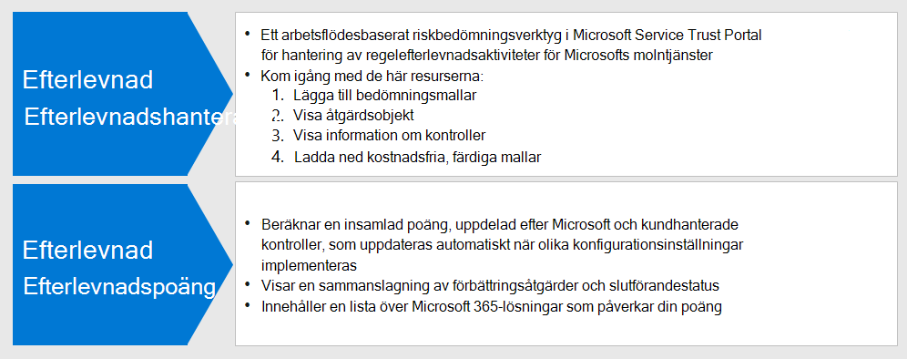
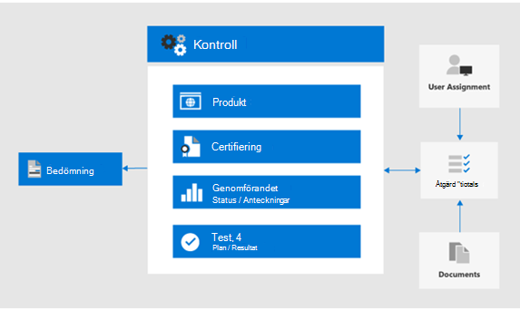

# Använd Efterlevnadspoäng och Efterlevnadshanteraren för att hantera förbättringsåtgärder

Microsoft Compliance Score and Compliance Manager kan användas tillsammans för att hantera förbättringar relaterade till dataskyddsbestämmelser som EU:s [allmänna dataskyddsförordning (GDPR),](../compliance/gdpr.md) [California Consumer Protection Act CCPA),](../compliance/ccpa-faq.md)HIPAA-HITECH (US health care privacy act) och Brazil Data Protection Act (LGPD). 

Den här artikeln innehåller vägledning om hur du använder dessa verktyg för datasekretess.

>[!Note]
>De kundåtgärder som anges i Efterlevnadshanteraren är rekommendationer. Det är upp till dig att utvärdera effektiviteten av dessa rekommendationer i dina regelverk före implementeringen. Compliance Manager-rekommendationer bör inte tolkas som en garanti för efterlevnad.
>

## Planerade uppdateringar för Efterlevnadspoäng och efterlevnadshanterare

[Efterlevnadspoäng](../compliance/compliance-score.md) (för närvarande i förhandsversion) kräver att du lägger till dina målbedömningar för en förordning (till exempel GDPR) från [Compliance Manager](../compliance/compliance-manager-overview.md). I en framtida version kommer mycket av funktionerna i Compliance Manager att slås samman till en enhetlig efterlevnadspoängupplevelse, vilket minskar behovet av flera verktyg.

Här är verktygen för din prenumeration som kräver att du loggar in:

- [Efterlevnadspoäng i administrationscentret för Microsoft-efterlevnad](https://compliance.microsoft.com/compliancescore)
- [Efterlevnadshanteraren i Microsoft Services Trust Portal](https://servicetrust.microsoft.com/ComplianceManager/V3)

## Komma igång med Efterlevnadshanteraren 

[Compliance Manager](../compliance/working-with-compliance-manager.md) (för närvarande i förhandsversion) är ett kostnadsfritt arbetsflödesbaserat riskbedömningsverktyg i Microsoft Service Trust Portal för hantering av efterlevnadsaktiviteter för regelefterlevnad som är relaterade till Microsofts molntjänster. Som en del av din Microsoft 365- eller Azure Active Directory-prenumeration (Azure AD) hjälper Compliance Manager dig att hantera regelefterlevnad inom modellen med delat ansvar för Microsofts molntjänster.

Även om du kan visa din totala efterlevnadspoäng och utföra ett antal andra funktioner på efterlevnadscentrets sida **för efterlevnadsresultat,** måste du använda Compliance Manager via Services Trust Portal för att först konfigurera utvärderingar för dina datasekretessbestämmelser. Data från dessa utvärderingar visas sedan i efterlevnadsresultat för ytterligare visning och filtrering. 

Med gränssnittet för Efterlevnadshanteraren kan du välja en eller flera sekretessrelaterade regelmallar för data och gruppera dem för att bedöma och spåra nödvändiga förbättringsåtgärder i uppsättningen. Du kan också visa information om de kontroller som varje förordning kräver specifika för måltjänsten, avgränsade med Microsoft jämfört med kundhanterade kontroller.

Utvärderingar och förbättringsstatus som valts här visas också i efterlevnadspoäng i Microsoft Compliance Center, som betonar vikten av din första inställning i Efterlevnadshanteraren. Dessa relationer visas i denna figur.
 

Här är de viktigaste stegen som hjälper dig att komma igång.

### 1. Bedömningsmallar

Från Compliance Manager är det första steget att lägga till bedömningar som är specifika för de dataskyddsbestämmelser av intresse och inkludera dem i en definierad "Data Privacy Regulations"-grupp.

[Grupper](../compliance/working-with-compliance-manager.md#groups) är behållare som gör att du kan ordna utvärderingar och dela gemensamma informations- och arbetsflödesuppgifter mellan utvärderingar som har samma eller relaterade kundhanterade kontroller. När två olika utvärderingar i samma grupp delar kundhanterad kontroll synkroniseras implementeringsinformation, testning och status för kontrollen automatiskt till samma kontroll i någon annan utvärdering i gruppen. Detta förenar de tilldelade åtgärdsobjekten för varje kontroll i gruppen och minskar dupliceringsarbetet. 

Du kan också välja att använda grupper för att ordna. Utvärderingar efter år, område, efterlevnadsstandard eller andra grupperingar för att organisera ditt efterlevnadsarbete.

### 2. Åtgärdspunkter

När utvärderingarna har lagts till kan du visa åtgärdsobjekt som är specifika för varje grupp eller individuell reglering:

- **Åtgärdslista för förbättring.** Navigera till listan Åtgärdsobjekt och visa de förbättringsåtgärder som är associerade i de bestämmelser som ingår i gruppen. Många åtgärder spänner över regler så att ett enda listobjekt kan representera flera förordningar. 
 
- **Filtrering av förbättringsåtgärder.** För många datasekretessregler och grupper av förordningar kan listan över förbättringsåtgärder vara ganska stor, så överväg att filtrera listan med hjälp av filterrullgardinsmenyn. Om du till exempel väljer "tekniska kontroller" kommer listan att reduceras till bara de som har en teknisk implementering i organisationen, eftersom många av åtgärderna är relaterade till administrativa åtgärder i olika aspekter av verksamheten som också dokumenteras i Compliance Manager. I den här artikeln kommer vi att fokusera på tekniska kontroller, så den här filtreringsmetoden rekommenderas.
 
- **Ytterligare information och granskning.** För varje åtgärd kan du klicka på länken till **Läs mer**, som berättar mer om den rekommenderade aktiviteten, eller **Granska**, som öppnar ett formulär så att du kan göra följande:
 
   - Tilldela åtgärden till en person i organisationen för att hantera
   - Hantera dokument som är relaterade till att adressera åtgärden
   - Ange status för artikeln
   - Ange implementerings- och testdatum
   - Registrera ytterligare information, implementeringsanteckningar och testplansanteckningar för ämnesåtgärden
  
- **Ej tillämpliga objekt som out-of-scope.** Vissa förbättringsåtgärder som ingår i listan Åtgärdsobjekt kanske inte gäller för den planerade implementeringen. Du kan ange att de inte omfattas av Efterlevnadshanteraren och ta bort åtgärden och dess bevis från beräkningen av poängvärdet för efterlevnad. 

Om din organisation till exempel har valt att använda Microsoft Managed Key", gäller inte en rekommendation om att använda kundnyckel för distributionen. I det här fallet markerar din organisation den som **Inte i omfånget i** **kontrollåtgärderna** för tillämplig regelmall.
 
### 3. Kontroller info

En bedömningsspecifik vy finns i [kontrollinformationen](../compliance/compliance-manager-overview.md#controls) för varje utvärderingsgrupp. Detta ger en bedömningsspecifik vy, vilket är skillnaden än listan Åtgärdsobjekt, som ger en teknisk kontrollspecifik vy.
 

Navigera till listan **Kontrollinformation** och visa listan över inbyggda tjänster för förordningen i fråga. 
 
I regleringsspecifika kontrollgrupper anges de åtgärder som tillhandahålls per kontrollområde för varje tjänsteområde. För varje uppsättning åtgärder ger Efterlevnadshanteraren mer information om åtgärden och kan föreslå eller tillhandahålla granskningsalternativ för att hjälpa organisationen att välja en kontrollmetod.
 
Observera att det här gränssnittet ger möjlighet att visa detaljer som är specifika för den tekniska åtgärden, tillsammans med status för åtgärder som rör kontrollen, och kompletterande sammanhang om de förordningar som åtgärden är relaterad till.

### 4. Mall nedladdning

För dem som är mer bekanta med kalkylbladsbaserad lagstiftningsanalys är en annan metod att hämta mallen för varje bedömning med hjälp av malllistan. De nedladdade mallarna listar både den regulatoriska och tekniska kontrollinformationen för varje mall och kan vara enklare för vissa roller att navigera/filtrera och generera affärsspecifika vyer.
 
Du kan också lägga till en ny mall som är anpassad för din organisation baserat på en befintlig mall med hjälp av **Lägg till mall**. Detta kräver att du laddar ned en valfri mall (till exempel HIPAA/HITECH)), sedan ändrar den för dina syften och laddar upp tillbaka till Verktyget Efterlevnadshanteraren, där den nu kommer att driva utvärderingar och bedömning som liknar andra mallar och bedömningar som en del av den övergripande verktygsuppsättningen Compliance Manager och Compliance Score.
 
>[!Tip]
>Om det handlar om ett stort antal förordningar eller överlappande förbättringsåtgärder bör du överväga att hämta respektive mall och kombinera datauppsättningarna, ta bort förbättringsåtgärder eller kontrolltyper som inte gäller för din organisation och ladda upp den igen. Detta kan vara enklare än att navigera i varje kontrollinformationsavsnitt och markera varje som utom rång.
>

## Efterlevnadspoäng

När bedömningarna och granskningsspecifikationerna har utförts i Compliance Manager kan du nu gå till verktyget [Efterlevnadspoäng](../compliance/compliance-score.md) och granska poängen och segmentet och tärna data ytterligare, inklusive efter kontrollområde.

Verktyget Efterlevnadspoäng i administrationscentret för efterlevnad av Microsoft 365 innehåller flera metoder för att granska och filtrera efterlevnadsdata som erhållits från Compliance Manager och olika Microsoft 365-tjänster. Det här verktyget uppdateras automatiskt när olika konfigurationsinställningar implementeras och delar signaler med Microsoft Secure Score så att många förbättringsåtgärder visas i båda poängen. 
 
Efterlevnadspoängen ger:

- En samlad poäng, uppdelad efter Microsoft och kundhanterade kontroller
- En sammanslagning av förbättringsåtgärder och slutförandestatus
- En lista över Microsoft 365-lösningar som påverkar din poäng

### Så här beräknas efterlevnadspoängen

Kort sagt, poängen beräknas baserat på en kombination av Microsoft och kundhanterade kontrollimplementeringar, vilket förklaras mer i detalj i [beräkningsartikeln för Microsoft Compliance Score](../compliance/compliance-score-methodology.md).

Kontroller tilldelas ett poängvärde baserat på om de är obligatoriska eller diskretionära och om de är förebyggande, detektiv eller korrigerande. Dessa utgör kollektivt risken för att inte genomföra den i förhållande till andra kontroller.

Som presenteras i microsoft compliance score beräkning artikeln, förebyggande kontroller får en högre poäng än detektiv och korrigerande, och obligatoriska kontroller får en högre poäng än diskretionära.
 
Observera att administratörsgränssnittet för efterlevnadspoäng inte listar dessa parametrar, och det ger inte heller möjlighet att filtrera efter dem. Men om du hämtar den associerade mallen från verktyget Efterlevnadshanteraren visas dessa parametrar för de flesta förordningar i den resulterande datauppsättningen.

För tekniska kontroller uppdaterar efterlevnadspoäng automatiskt förbättringsåtgärdspoängen när den relaterade funktionen har aktiverats. Andra, icke-tekniska &mdash; kontrollåtgärder, till exempel de som är operativa eller relaterade till &mdash; dokumentation, måste registreras manuellt i verktyget Efterlevnadshanteraren på serviceförtroendeportalen. 

Du många också genomföra vissa förbättringsåtgärder för andra ändamål &mdash; till exempel använda lagring etiketter av andra skäl än datasekretess regel efterlevnad så att &mdash; du skulle få kredit för att använda en sådan funktion även om den används för andra ändamål, och inte en del av en avsiktlig efterlevnad åtgärder.

Din efterlevnadspoäng bör betraktas som ett relativt mått för att spåra förbättringar i stor skala. Du bör inte fullfölja en perfekt poäng. 

### Ytterligare vägledning

Här är några viktiga tips för hur du kan använda Efterlevnadspoäng och Efterlevnadshanteraren för att du ska kunna uppfylla efterlevnaden av datasekretessregleringen:

- Varje datasekretessreglering har en kombination av tekniska kontroller, dokumentationsspecifikationer och operativa, process- och rapporteringskrav. Alla dessa dyker upp i förbättringsåtgärderna. 

- Den här artikeln fokuserar på en delmängd av de tekniska kontroller som angetts för datasekretess i Compliance Manager och Compliance Score. Mer information om icke-tekniska administrativa kontroller finns i verktyget Hanteraren och [dokumentation.](../compliance/compliance-score.md)

- Om du vill fokusera vyn över förbättringsåtgärder på ditt intresseområde kan du filtrera efter åtgärdstyp på fliken **Lösningar** i administratören För efterlevnadsresultat.

- Den relativa betydelsen och prioriteringen av förbättringsåtgärder som identifieras i efterlevnadspoäng bör betraktas som en del av en bredare riskgranskning tillsammans med den datasekretessrisk som du har fastställt att din organisation behöver hantera. 

- Om du är en global organisation och lägger till flera mallar för datasekretessreglering i Compliance Manager som bedömningar, kombinerar efterlevnadspoängen var och en i en fältlista för varje förbättringsåtgärd.
 
- Även med förbättringsåtgärder aggregering över flera lagstadgade krav, om förordningen bedömning mallar för GDPR, LGPD, CCPA och HIPAA-HITECH väljs, till exempel, nästan 400 förbättringsåtgärder kommer att listas i Efterlevnad Score. För att bättre hantera den här långa listan använder du åtgärdsfiltret för förbättring för att minska resultatuppsättningen till en mer hanterbar lista.

- Filtret Kategorier är ett sätt att filtrera förbättringsåtgärder genom logisk gruppering, som artiklarna Spåra, Förhindra, Skydda, Behåll och Undersök i den här övergripande lösningen som är anpassade till. 

- Några av de kontroller som anges i förbättringsåtgärderna kan anses vara mer direkt knutna till en viss reglerande artikel, medan andra kontroller kan vara mer indirekt förknippade med andan i en förordning och är många gånger bara saker du bör överväga att göra ändå.

