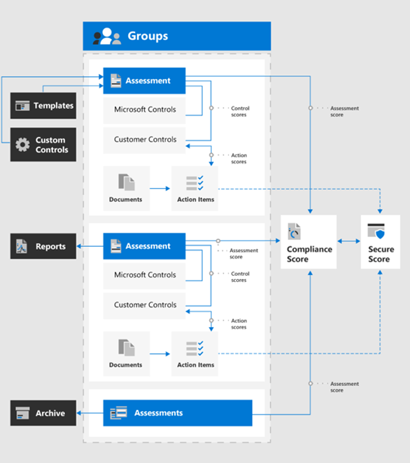

# Använd Efterlevnadspoäng och Efterlevnadshanteraren för att hantera förbättringsåtgärderUse Compliance Score and Compliance Manager to manage improvement actions

Microsoft Compliance Score and Compliance Manager kan användas tillsammans för att hantera förbättringar relaterade till dataskyddsbestämmelser som EU:s [allmänna dataskyddsförordning (GDPR),](../compliance/gdpr.md) [California Consumer Protection Act CCPA),](../compliance/ccpa-faq.md)HIPAA-HITECH (US health care privacy act) och Brazil Data Protection Act (LGPD).Microsoft Compliance Score and Compliance Manager can be used together to manage improvements related to data privacy regulations such as the European Union [General Data Protection Regulation (GDPR)](../compliance/gdpr.md), [California Consumer Protection Act CCPA)](../compliance/ccpa-faq.md), HIPAA-HITECH (US health care privacy act), and the Brazil Data Protection Act (LGPD). 

Den här artikeln innehåller vägledning om hur du använder dessa verktyg för datasekretess.This article provides guidance on the use of these tools for data privacy purposes.

>[!Note]
>De kundåtgärder som anges i Efterlevnadshanteraren är rekommendationer.The customer actions provided in Compliance Manager are recommendations. Det är upp till dig att utvärdera effektiviteten av dessa rekommendationer i dina regelverk före implementeringen.It is up to you to evaluate the effectiveness of these recommendations in your regulatory environments prior to implementation. Compliance Manager-rekommendationer bör inte tolkas som en garanti för efterlevnad.Compliance Manager recommendations should not be interpreted as a guarantee of compliance.
>

## Planerade uppdateringar för Efterlevnadspoäng och efterlevnadshanterarePlanned updates for Compliance Score and Compliance Manager

[Efterlevnadspoäng](../compliance/compliance-score.md) (för närvarande i förhandsversion) kräver att du lägger till dina målbedömningar för en förordning (till exempel GDPR) från [Compliance Manager](../compliance/compliance-manager-overview.md).[Compliance Score](../compliance/compliance-score.md) (currently in preview) requires adding your target assessments for a regulation (such as GDPR) from the [Compliance Manager](../compliance/compliance-manager-overview.md). I en framtida version kommer mycket av funktionerna i Compliance Manager att slås samman till en enhetlig efterlevnadspoängupplevelse, vilket minskar behovet av flera verktyg.In a future release, much of the functionality in Compliance Manager will be merged into a unified Compliance Score experience, reducing the need for multiple tools.

Här är verktygen för din prenumeration som kräver att du loggar in:Here are the tools for your subscription, which require you to sign-in:

- [Efterlevnadspoäng i administrationscentret för Microsoft-efterlevnadCompliance Score in the Microsoft Compliance admin center](https://compliance.microsoft.com/compliancescore)
- [Efterlevnadshanteraren i Microsoft Services Trust PortalCompliance Manager in the Microsoft Services Trust Portal](https://servicetrust.microsoft.com/ComplianceManager/V3)

## Komma igång med EfterlevnadshanterarenGetting started with Compliance Manager 

[Compliance Manager](../compliance/working-with-compliance-manager.md) (för närvarande i förhandsversion) är ett kostnadsfritt arbetsflödesbaserat riskbedömningsverktyg i Microsoft Service Trust Portal för hantering av efterlevnadsaktiviteter för regelefterlevnad som är relaterade till Microsofts molntjänster.[Compliance Manager](../compliance/working-with-compliance-manager.md) (currently in preview) is a free workflow-based risk assessment tool in the Microsoft Service Trust Portal for managing regulatory compliance activities related to Microsoft cloud services. Som en del av din Microsoft 365- eller Azure Active Directory-prenumeration (Azure AD) hjälper Compliance Manager dig att hantera regelefterlevnad inom modellen med delat ansvar för Microsofts molntjänster.As part of your Microsoft 365 or Azure Active Directory (Azure AD) subscription, Compliance Manager helps you manage regulatory compliance within the shared responsibility model for Microsoft cloud services.

Även om du kan visa din totala efterlevnadspoäng och utföra ett antal andra funktioner på efterlevnadscentrets sida **för efterlevnadsresultat,** måste du använda Compliance Manager via Services Trust Portal för att först konfigurera utvärderingar för dina datasekretessbestämmelser.While you can view your overall compliance score and perform a number of other functions in the Compliance center's **Compliance Score** page, you need to use Compliance Manager through the Services Trust Portal to first configure assessments for your data privacy regulations. Data från dessa utvärderingar visas sedan i efterlevnadsresultat för ytterligare visning och filtrering.Data from these assessments will then show up in Compliance Score for further viewing and filtering. 

Med gränssnittet för Efterlevnadshanteraren kan du välja en eller flera sekretessrelaterade regelmallar för data och gruppera dem för att bedöma och spåra nödvändiga förbättringsåtgärder i uppsättningen.Using the Compliance Manager interface, you can select one or more data privacy-related regulation templates and group them to assess and track required improvement actions across the set. Du kan också visa information om de kontroller som varje förordning kräver specifika för måltjänsten, avgränsade med Microsoft jämfört med kundhanterade kontroller.You can also view information about the controls each regulation calls for specific to the target service, separated by Microsoft vs. customer-managed controls.

Utvärderingar och förbättringsstatus som valts här visas också i efterlevnadspoäng i Microsoft Compliance Center, som betonar vikten av din första inställning i Efterlevnadshanteraren.Assessments and improvement status selected here also appear in Compliance Score in the Microsoft Compliance Center, which emphasize the importance of your initial setup in Compliance Manager. Dessa relationer visas i denna figur.These relationships are shown in this figure.
 

Här är de viktigaste stegen som hjälper dig att komma igång.Here are the key steps to help you get started.

### 1. Bedömningsmallar1. Assessment templates

Från Compliance Manager är det första steget att lägga till bedömningar som är specifika för de dataskyddsbestämmelser av intresse och inkludera dem i en definierad "Data Privacy Regulations"-grupp.From the Compliance Manager, the first step is to add assessments specific to the data privacy regulations of interest and include them in a defined "Data Privacy Regulations" group.

[Grupper](../compliance/working-with-compliance-manager.md#groups) är behållare som gör att du kan ordna utvärderingar och dela gemensamma informations- och arbetsflödesuppgifter mellan utvärderingar som har samma eller relaterade kundhanterade kontroller.[Groups](../compliance/working-with-compliance-manager.md#groups) are containers that allow you to organize Assessments and share common information and workflow tasks between Assessments that have the same or related customer-managed controls. När två olika utvärderingar i samma grupp delar kundhanterad kontroll synkroniseras implementeringsinformation, testning och status för kontrollen automatiskt till samma kontroll i någon annan utvärdering i gruppen.When two different Assessments in the same group share customer-managed control, the completion of implementation details, testing, and status for the control automatically synchronize to the same control in any other Assessment in the Group. Detta förenar de tilldelade åtgärdsobjekten för varje kontroll i gruppen och minskar dupliceringsarbetet.This unifies the assigned Action Items for each control across the group and reduces duplicating work. 

Du kan också välja att använda grupper för att ordna.You can also choose to use groups to organize. Utvärderingar efter år, område, efterlevnadsstandard eller andra grupperingar för att organisera ditt efterlevnadsarbete.Assessments by year, area, compliance standard, or other groupings to help organize your compliance work.

### 2. Åtgärdspunkter2. Action items

När utvärderingarna har lagts till kan du visa åtgärdsobjekt som är specifika för varje grupp eller individuell reglering:Once the assessments have been added, you can view Action Items specific to each group or individual regulation:

- **Åtgärdslista för förbättring.****Improvement action list.** Navigera till listan Åtgärdsobjekt och visa de förbättringsåtgärder som är associerade i de bestämmelser som ingår i gruppen.Navigate to the Action Items list and view the improvement actions associated across the regulations included in the group. Många åtgärder spänner över regler så att ett enda listobjekt kan representera flera förordningar.Many actions span regulations so a single list item may represent multiple regulations. 
 
- **Filtrering av förbättringsåtgärder.****Improvement action filtering.** För många datasekretessregler och grupper av förordningar kan listan över förbättringsåtgärder vara ganska stor, så överväg att filtrera listan med hjälp av filterrullgardinsmenyn.For many data privacy regulations and groups of regulations, the list of improvement actions can be quite large, so consider filtering the list using the filter drop down. Om du till exempel väljer "tekniska kontroller" kommer listan att reduceras till bara de som har en teknisk implementering i organisationen, eftersom många av åtgärderna är relaterade till administrativa åtgärder i olika aspekter av verksamheten som också dokumenteras i Compliance Manager.For example, if you select "technical controls", the list will be reduced to just those which have a technical implementation in the organization, as many of the actions are related to administrative operations in various aspects of the business which are also documented in Compliance Manager. I den här artikeln kommer vi att fokusera på tekniska kontroller, så den här filtreringsmetoden rekommenderas.In this article, we will focus on technical controls, so this filtering approach is recommended.
 
- **Ytterligare information och granskning.****Additional information and review.** För varje åtgärd kan du klicka på länken till **Läs mer**, som berättar mer om den rekommenderade aktiviteten, eller **Granska**, som öppnar ett formulär så att du kan göra följande:For each action, you can click on the link to **Read More**, which tells you more about the recommended activity, or **Review**, which opens a form allowing you to do the following:
 
   - Tilldela åtgärden till en person i organisationen för att hanteraAssign the action to a someone in your organization to manage
   - Hantera dokument som är relaterade till att adressera åtgärdenManage documents related to addressing the action
   - Ange status för artikelnSpecify status for the item
   - Ange implementerings- och testdatumSpecify implementation and test dates
   - Registrera ytterligare information, implementeringsanteckningar och testplansanteckningar för ämnesåtgärdenRecord additional information, implementation notes, and test plan notes for the subject action
  
- **Ej tillämpliga objekt som out-of-scope.****Non-applicable items as out-of-scope.** Vissa förbättringsåtgärder som ingår i listan Åtgärdsobjekt kanske inte gäller för den planerade implementeringen.Some improvement actions included in the Action Items list might not apply to your planned implementation. Du kan ange att de inte omfattas av Efterlevnadshanteraren och ta bort åtgärden och dess bevis från beräkningen av poängvärdet för efterlevnad.You can specify that they are out of scope in Compliance Manager and remove the action and its evidence from the calculation of the compliance score value. 

Om din organisation till exempel har valt att använda Microsoft Managed Key", gäller inte en rekommendation om att använda kundnyckel för distributionen.For example, if your organization has elected to use Microsoft Managed Key", a recommendation to Use Customer Key is not applicable to your deployment. I det här fallet markerar din organisation den som **Inte i omfånget i** **kontrollåtgärderna** för tillämplig regelmall.In this case, your organization would mark it as **Not in scope** in the **Control Actions** for the applicable regulatory template.
 
### 3. Kontroller info3. Controls info

En bedömningsspecifik vy finns i [kontrollinformationen](../compliance/compliance-manager-overview.md#controls) för varje utvärderingsgrupp.For an assessment-specific view, view the [Controls Info](../compliance/compliance-manager-overview.md#controls) for each assessment group. Detta ger en bedömningsspecifik vy, vilket är skillnaden än listan Åtgärdsobjekt, som ger en teknisk kontrollspecifik vy.This provides an assessment-specific view, which is difference than the Action Items list, which provides a technical control-specific view.
 

Navigera till listan **Kontrollinformation** och visa listan över inbyggda tjänster för förordningen i fråga.Navigate to the **Controls Info** list and view the list of in-scope services for the regulation in question. 
 
I regleringsspecifika kontrollgrupper anges de åtgärder som tillhandahålls per kontrollområde för varje tjänsteområde.Regulation-specific control groupings list the actions provided by control area for each service area. För varje uppsättning åtgärder ger Efterlevnadshanteraren mer information om åtgärden och kan föreslå eller tillhandahålla granskningsalternativ för att hjälpa organisationen att välja en kontrollmetod.For each set of actions, the Compliance Manager provides more information on the action and may suggest or provide review options to assist the organization in choosing a control approach.
 
Observera att det här gränssnittet ger möjlighet att visa detaljer som är specifika för den tekniska åtgärden, tillsammans med status för åtgärder som rör kontrollen, och kompletterande sammanhang om de förordningar som åtgärden är relaterad till.Note that this interface provides the capability to view details specific to the technical action, together with the status of actions related to the control, and supplemental context about the regulations to which the action is related.

### 4. Mall nedladdning4. Template download

För dem som är mer bekanta med kalkylbladsbaserad lagstiftningsanalys är en annan metod att hämta mallen för varje bedömning med hjälp av malllistan.For those more familiar with spreadsheet-based regulatory analysis, another approach is to download the template for each respective assessment using the Templates listing. De nedladdade mallarna listar både den regulatoriska och tekniska kontrollinformationen för varje mall och kan vara enklare för vissa roller att navigera/filtrera och generera affärsspecifika vyer.The downloaded templates list both the regulatory as well as technical control information for each template and may be easier for certain roles to navigate/filter and to generate business-specific views.
 
Du kan också lägga till en ny mall som är anpassad för din organisation baserat på en befintlig mall med hjälp av **Lägg till mall**.You can also add a new template customized for your organization based on an existing template, using **Add Template**. Detta kräver att du laddar ned en valfri mall (till exempel HIPAA/HITECH)), sedan ändrar den för dina syften och laddar upp tillbaka till Verktyget Efterlevnadshanteraren, där den nu kommer att driva utvärderingar och bedömning som liknar andra mallar och bedömningar som en del av den övergripande verktygsuppsättningen Compliance Manager och Compliance Score.This requires that you download a template of choice (such as HIPAA/HITECH)), then modify it for your purposes and upload back into the Compliance Manager tool, where it will now drive assessments and scoring similar to other templates and assessments as part of the overall Compliance Manager and Compliance Score toolset.
 
>[!Tip]
>Om det handlar om ett stort antal förordningar eller överlappande förbättringsåtgärder bör du överväga att hämta respektive mall och kombinera datauppsättningarna, ta bort förbättringsåtgärder eller kontrolltyper som inte gäller för din organisation och ladda upp den igen.if dealing with a large number of regulations or overlapping improvement actions, consider downloading each respective template and combining the data sets, removing improvement actions or control types that do not apply to your organization, and re-uploading. Detta kan vara enklare än att navigera i varje kontrollinformationsavsnitt och markera varje som utom rång.This may be easier than navigating every control info section and marking each as out of scope.
>

## EfterlevnadspoängCompliance Score

När bedömningarna och granskningsspecifikationerna har utförts i Compliance Manager kan du nu gå till verktyget [Efterlevnadspoäng](../compliance/compliance-score.md) och granska poängen och segmentet och tärna data ytterligare, inklusive efter kontrollområde.Once the assessments and review specifications are performed in Compliance Manager, you can now go to the [Compliance Score](../compliance/compliance-score.md) tool and review the score and slice and dice the data further, including by control area.

Verktyget Efterlevnadspoäng i administrationscentret för efterlevnad av Microsoft 365 innehåller flera metoder för att granska och filtrera efterlevnadsdata som erhållits från Compliance Manager och olika Microsoft 365-tjänster.The Compliance Score tool in the Microsoft 365 Compliance admin center provides several approaches to review and filter compliance data obtained from Compliance Manager and various Microsoft 365 services. Det här verktyget uppdateras automatiskt när olika konfigurationsinställningar implementeras och delar signaler med Microsoft Secure Score så att många förbättringsåtgärder visas i båda poängen.This tool is automatically updated when various configuration settings are implemented and shares signals with the Microsoft Secure Score so that many improvement actions will show up in both scores. 
 
Efterlevnadspoängen ger:The Compliance Score provides:

- En samlad poäng, uppdelad efter Microsoft och kundhanterade kontrollerA collected score, broken down by Microsoft and customer-managed controls
- En sammanslagning av förbättringsåtgärder och slutförandestatusA rollup of improvement actions and completion status
- En lista över Microsoft 365-lösningar som påverkar din poängA listing of Microsoft 365 solutions impacting your score

### Så här beräknas efterlevnadspoängenHow the compliance score gets calculated

Kort sagt, poängen beräknas baserat på en kombination av Microsoft och kundhanterade kontrollimplementeringar, vilket förklaras mer i detalj i [beräkningsartikeln för Microsoft Compliance Score](../compliance/compliance-score-methodology.md).In short, the score is calculated based on a combination of Microsoft and customer-managed control implementations, as explained in more detail in the [Microsoft Compliance Score calculation article](../compliance/compliance-score-methodology.md).

Kontroller tilldelas ett poängvärde baserat på om de är obligatoriska eller diskretionära och om de är förebyggande, detektiv eller korrigerande.Controls are assigned a score value based on whether they're mandatory or discretionary, and whether they're preventative, detective, or corrective. Dessa utgör kollektivt risken för att inte genomföra den i förhållande till andra kontroller.These collectively represent the risk of not implementing it relative to other controls.

Som presenteras i microsoft compliance score beräkning artikeln, förebyggande kontroller får en högre poäng än detektiv och korrigerande, och obligatoriska kontroller får en högre poäng än diskretionära.As presented in the Microsoft Compliance Score calculation article, preventative controls get a higher score than detective and corrective ones, and mandatory controls get a higher score than discretionary ones.
 
Observera att administratörsgränssnittet för efterlevnadspoäng inte listar dessa parametrar, och det ger inte heller möjlighet att filtrera efter dem.Note that the Compliance Score admin UI does not list these parameters, nor does it provide the ability to filter by them. Men om du hämtar den associerade mallen från verktyget Efterlevnadshanteraren visas dessa parametrar för de flesta förordningar i den resulterande datauppsättningen.However, if you download the associated template from the Compliance Manager tool, the resulting data set does list these parameters for most regulations.

För tekniska kontroller uppdaterar efterlevnadspoäng automatiskt förbättringsåtgärdspoängen när den relaterade funktionen har aktiverats.For technical controls, Compliance Score will automatically update the improvement action score once the related feature is activated. Andra, icke-tekniska &mdash; kontrollåtgärder, till exempel de som är operativa eller relaterade till &mdash; dokumentation, måste registreras manuellt i verktyget Efterlevnadshanteraren på serviceförtroendeportalen.Other, non-technical control actions&mdash;such as those that are operational or related to documentation&mdash;need to be recorded manually in the Compliance Manager tool on the Services Trust Portal. 

Du många också genomföra vissa förbättringsåtgärder för andra ändamål &mdash; till exempel använda lagring etiketter av andra skäl än datasekretess regel efterlevnad så att &mdash; du skulle få kredit för att använda en sådan funktion även om den används för andra ändamål, och inte en del av en avsiktlig efterlevnad åtgärder.You many also be implementing certain improvement actions for other purposes&mdash;for example using retention labels for reasons other than data privacy regulation compliance&mdash;so you would get credit for using such a feature even if it is being used for other purposes, and not part of a deliberate compliance action.

Din efterlevnadspoäng bör betraktas som ett relativt mått för att spåra förbättringar i stor skala.Your Compliance Score should be considered a relative measure to track improvement on a broad scale. Du bör inte fullfölja en perfekt poäng.You should not pursue a perfect score. 

### Ytterligare vägledningAdditional guidance

Här är några viktiga tips för hur du kan använda Efterlevnadspoäng och Efterlevnadshanteraren för att du ska kunna uppfylla efterlevnaden av datasekretessregleringen:Here are a few important tips for the use of Compliance Score and Compliance Manager for you to achieve data privacy regulation compliance:

- Varje datasekretessreglering har en kombination av tekniska kontroller, dokumentationsspecifikationer och operativa, process- och rapporteringskrav.Each data privacy regulation has a combination of technical controls, documentation specifications, and operational, process, and reporting requirements. Alla dessa dyker upp i förbättringsåtgärderna.All of these show up in the improvement actions. 

- Den här artikeln fokuserar på en delmängd av de tekniska kontroller som angetts för datasekretess i Compliance Manager och Compliance Score.This article focuses on a subset of the technical controls specified for data privacy in Compliance Manager and Compliance Score. Mer information om icke-tekniska administrativa kontroller finns i verktyget Hanteraren och [dokumentation.](../compliance/compliance-score.md)Refer to the Compliance Manager tool and [documentation](../compliance/compliance-score.md) for more information on non-technical administrative controls.

- Om du vill fokusera vyn över förbättringsåtgärder på ditt intresseområde kan du filtrera efter åtgärdstyp på fliken **Lösningar** i administratören För efterlevnadsresultat.To focus the view of improvement actions to your area of interest, you can filter by action type in the **Solutions** tab in the Compliance Score admin.

- Den relativa betydelsen och prioriteringen av förbättringsåtgärder som identifieras i efterlevnadspoäng bör betraktas som en del av en bredare riskgranskning tillsammans med den datasekretessrisk som du har fastställt att din organisation behöver hantera.The relative importance and priority of improvement actions identified in Compliance Score should be considered as part of a broader risk review along with the data privacy risk you've determined your organization needs to manage. 

- Om du är en global organisation och lägger till flera mallar för datasekretessreglering i Compliance Manager som bedömningar, kombinerar efterlevnadspoängen var och en i en fältlista för varje förbättringsåtgärd.If you are a global organization and you add multiple data privacy regulation templates into Compliance Manager as Assessments, Compliance Score will combine each applicable one in a field listing for each improvement action.
 
- Även med förbättringsåtgärder aggregering över flera lagstadgade krav, om förordningen bedömning mallar för GDPR, LGPD, CCPA och HIPAA-HITECH väljs, till exempel, nästan 400 förbättringsåtgärder kommer att listas i Efterlevnad Score.Even with improvement action aggregation across multiple regulatory requirements, if the regulation assessment templates for GDPR, LGPD, CCPA, and HIPAA-HITECH are selected, for example, almost 400 improvement actions will be listed in Compliance Score. För att bättre hantera den här långa listan använder du åtgärdsfiltret för förbättring för att minska resultatuppsättningen till en mer hanterbar lista.To better tackle this long list, use the improvement action filter to reduce the result set to a more manageable list.

- Filtret Kategorier är ett sätt att filtrera förbättringsåtgärder genom logisk gruppering, som artiklarna Spåra, Förhindra, Skydda, Behåll och Undersök i den här övergripande lösningen som är anpassade till.The Categories filter provides a means to filter improvement actions by logical grouping, which the Track, Prevent, Protect, Retain, and Investigate articles in this overall solution align to. 

- Några av de kontroller som anges i förbättringsåtgärderna kan anses vara mer direkt knutna till en viss reglerande artikel, medan andra kontroller kan vara mer indirekt förknippade med andan i en förordning och är många gånger bara saker du bör överväga att göra ändå.Some of the controls listed in the improvement actions may be considered more directly tied to a specific regulatory article, while other controls may be more indirectly associated with the spirit of a regulation and are many times just things you should consider doing anyway.

