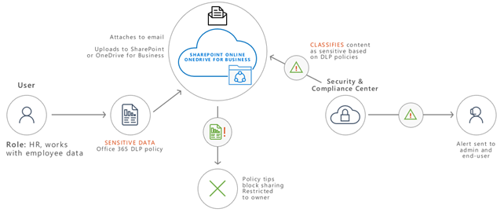

# Skydda information som lyder under data integritets förordning

Ett antal informations skydds kontroller kan användas i ditt-abonnemang för att hjälpa dig att adressera data integritets behov och föreskrifter. Dessa inkluderar allmän data skydds förordning (GDPR), HIPAA-HITECH (Health Policy för hälso vård i USA), California konsument skydd Act (CCPA) och Brasilien Data Protection Act (LGPD).

Dessa kontroller ligger inom lösnings områden:

- Känslighetsetiketter
- Skydd mot dataförlust (DLP)
- Meddelandekryptering i Office (OME)
- Åtkomst kontroller för team och webbplatser

>[!Note]
>Den här lösningen beskriver funktioner för säkerhet och efterlevnad för att skydda information som lyder under data integritets regler. En fullständig lista över säkerhetsfunktioner i Microsoft 365 finns i [microsoft 365 säkerhets dokumentation](https://docs.microsoft.com/microsoft-365/security/). En fullständig lista över kompatibla funktioner i Microsoft 365 finns i [dokumentationen om microsoft 365-efterlevnad](https://docs.microsoft.com/microsoft-365/compliance/).
>

## Data integritets regler som påverkar informations skydds kontroller

Här är en exempel lista över data integritets regler som kan gälla för informations skydds kontroller:

- GDPR paragraf 5.1 (f))
- GDPR-artikel (32) (1) (a)
- LGPD artikel 46
- HIPAA-HITECH (45 CFR 164.312 (e) (1))
- HIPAA-HITECH (45 C.F.R. 164.312 (e) (2) (II))

Se artikeln om att [utvärdera data integritet och identifiera känsliga artiklar](information-protection-deploy-assess.md) om du vill ha mer information om var och en av ovanstående.

Data integritets regler för informations skydd rekommenderar:

- Skydd mot förlust eller obehörig åtkomst, användning och/eller överföring.
- Riskfylld tillämpning av skyddsanordningar.
- Kryptering används där så behövs.

Din organisation kan även skydda Microsoft 365-innehåll i andra syften, till exempel andra behov eller av affärs skäl. Att fastställa ditt informations skydds system för data integritet bör vara en del av den övergripande informations skydds planering,-implementeringen och-hanteringen.

För att hjälpa dig att komma igång med ett informations skydds schema i Microsoft 365 finns följande avsnitt med en kort lista över relaterade funktioner och förbättringar för Microsoft 365. Listan innehåller funktioner för möjligheter och förbättring som är tillämpliga på data integritets regler. Listan innehåller emellertid inte äldre teknologi om det finns en nyare funktion som ersätter den äldre versionen. Information Rights Management (IRM) för SharePoint och OneDrive är exempelvis inte med i listan, men känslighets etiketterna ingår.

## Hantera informations skydd i Microsoft 365

Microsoft [Information Protection Solutions](../compliance/protect-information.md) innehåller ett antal integrerade funktioner i Microsoft 365, Microsoft Azure och Microsoft Windows. I Microsoft 365 inkluderar informations skydds lösningarna:

- [Tjänst kryptering med kund](../compliance/customer-key-overview.md)
- [Känsliga informations typer](../compliance/what-the-sensitive-information-types-look-for.md) (beskrivs i [artikeln utvärdera data integritets risker och identifiering av känsliga artiklar](information-protection-deploy-assess.md))
- [Känslighetsetiketter](../compliance/sensitivity-labels.md) 
  - Tjänst/behållar nivå
  - Klient/innehålls nivå
  - Automatiserat för data – i vila av SharePoint och OneDrive
- Skydd mot dataförlust (DLP)
- [Förhindrande av data förlust i Microsoft 365 Endpoint (för hands version)](https://docs.microsoft.com/microsoft-365/compliance/endpoint-dlp-learn-about?view=o365-worldwide)
- [Office 365 meddelande kryptering nya funktioner (ome)](../compliance/ome.md) och ome [avancerade meddelande kryptering](../compliance/ome-advanced-message-encryption.md)

Dessutom är webbplats-och biblioteks nivå skyddet viktiga för alla skydds system.

Information om andra funktioner för informations skydd utanför Microsoft 365 finns i:

- [Säkerhet för Microsoft Cloud-programmet (MCAS)](https://docs.microsoft.com/cloud-app-security/)
- [Azure Information Protection](https://docs.microsoft.com/azure/information-protection/what-is-information-protection)
- [Microsoft slut punkts hanteraren](https://www.microsoft.com/microsoft-365/microsoft-endpoint-manager)
- [Windows Information Protection](https://docs.microsoft.com/windows/security/information-protection/windows-information-protection/protect-enterprise-data-using-wip)

## Känslighetsetiketter

Med känslighets etiketter från Microsoft Information Protection Framework kan du klassificera och skydda organisationens data utan att hindra användarna från att samar beta.

### Förutsättningar för känslighets etiketter

Utför dessa aktiviteter innan du implementerar någon av de olika känslighets etikettbaserade funktionerna:

1. Förstå följande:
   - **Företags krav.** Fastställ affärs skäl för användning av känslighets etiketter i ditt företag. Till exempel data integritets krav för informations skydd.
   - **Funktioner för kapacitets etikett.** Känslighets etiketter kan vara komplexa, så se till att läsa igenom [känslighets etiketterna](../compliance/sensitivity-labels.md) innan du börjar.
   - **Viktiga saker att komma ihåg** Känslighets etiketter hanteras i Microsoft Compliance Admin Center men alternativen för mål och program skiljer sig avsevärt.
      - Det finns känslighets etiketter för webbplatser, grupper och team på behållar nivån (inställningarna gäller inte för innehåll i behållaren). Dessa publiceras för användare och grupper som använder dem när en webbplats, grupp eller team etableras.
      - Det finns känslighets etiketter för aktivt innehåll. Dessa publiceras också för användare eller grupper, vilka antingen manuellt tillämpar dem, eller de används automatiskt när:
        - Filen öppnas/redige ras, antingen till användarens skriv bord eller på en SharePoint-webbplats.
        - Ett e-postmeddelande skapas och skickas.
      - Det finns känslighets etiketter för automatisk koppling till filer på en plats i SharePoint och OneDrive utöver e-post i transit genom Exchange. Dessa är avsedda för antingen alla webbplatser eller vissa och gäller automatiskt för filerna i övriga miljö.

2. Rationalisera aktuella känslighets etiketter med gamla eller alternativa metoder

   - Azure Information Protection

      Det aktuella energischemat för känslighet kan behöva stämmas av med eventuella befintliga [Azure information Protection](../compliance/sensitivity-labels.md#sensitivity-labels-and-azure-information-protection) etiketting-implementering.
   - OME

      Om du planerar att använda moderna känslighets etiketter för e-postskydd och befintliga krypterings metoder för e-post, till exempel OME, kan de finnas tillsammans, men du bör förstå vilka scenarier som ska användas. Se [Office 365-meddelanden om nya funktioner (ome)](#office-365-message-encryption-ome-new-capabilities), som innehåller en tabell med jämförelse av modern känslighet för att skydda data med ome skydd.

3. Planera för integrering i ett bredare informations skydds system. Med OME kan de aktuella känslighets etiketterna användas på en och samma sätt som Microsoft 365 data förlust skydd (DLP) och Microsoft Cloud App-säkerhet. Se [känslighets etiketter och säkerhet för Microsoft Cloud App](../compliance/sensitivity-labels.md#sensitivity-labels-and-microsoft-cloud-app-security) för att uppnå dina data skydds uppgifter.

4. Utveckla en etikett för klassificering och kontroll av känslighet. Visa [etikett för data klassificering och känslighet](https://aka.ms/dataclassificationwhitepaper).

### Allmän vägledning

1. **Schema definition.** Innan du använder tekniska funktioner för att använda etiketter och skydd kan du arbeta i hela organisationen och definiera ett klassificerings schema. Du kanske redan har ett klassificerings schema som gör det enklare att lägga till personlig information. 
2. **Komma igång.** Börja med att välja numret och namnen på etiketterna som ska implementeras. Gör så här om du inte behöver oroa dig för vilken teknik som ska användas och hur etiketter ska användas. Tillämpa det här schemat i hela organisationen, inklusive data som finns i lokaler och i andra moln tjänster.
3. **Ytterligare rekommendationer** När du utformar och implementerar principer, etiketter och villkor bör du överväga att följa dessa rekommendationer:

   - **Använd befintligt klassificerings schema (om sådant finns).** Många organisationer använder redan data klassificering i vissa formulär. Utvärdera det befintliga etikett schema noggrant och Använd det som det är. Om du använder välbekanta etiketter som är igenkännliga för slutanvändarna kommer du att behöva använda det.
   - **Starta litet.** Det finns praktiskt taget ingen gräns för antalet etiketter som du kan skapa. Ett stort antal etiketter och under etiketter kan dock minskas.
   - **Använda scenarier och användnings fall.** Identifiera vanliga användnings fall inom organisationen och använda scenarier som härrör från de data integritets regler som du är föremål för. Kontrol lera om den namngivna etikett-och klassificerings konfigurationen fungerar i praktiken.
   - **Fråga varje förfrågan efter en ny etikett.** Behöver varje scenario eller ett användnings fall en ny etikett eller så kan du använda det du redan har? Ett minimum av antalet etiketter förbättras.
   - **Använd under rubriker för viktiga avdelningar.** Vissa avdelningar har särskilda behov som kräver specifika etiketter. Definiera de här etiketterna som under rubriker till en befintlig etikett och Överväg att använda begränsade principer som är kopplade till användar grupper istället för globalt.
   - **Överväg begränsade principer.** Principer riktade mot under uppsättningar med användare kommer att förhindra etikett överbelastning. En begränsad princip aktiverar tilldelning av roll-eller avdelnings specifika etiketter eller under etiketter till bara anställda som arbetar för just den avdelningen. 
   - **Använd meningsfulla etikett namn.** Försök att inte använda jargong, standarder eller akronymer som etikett namn. Försök att använda namn som Resonate med slutanvändaren för att förbättra antagandet. I stället för att använda etiketter som PII, PCI, HIPAA, LBI, MBI och HBI, bör du överväga namn som icke-affärer, allmän, allmän, konfidentiell och mycket konfidentiell.

### Skapa och distribuera känslighets etiketter för webbplatser, grupper och team

När du skapar [känslighets etiketter](../compliance/sensitivity-labels-teams-groups-sites.md) i Microsoft 365 Compliance Center kan du nu tillämpa dem på följande behållare:

- Microsoft Teams-webbplatser
- Microsoft 365-grupper (tidigare Office 365-grupper)
- SharePoint-webbplatser

Använd följande etikett inställningar för att skydda innehållet i dessa behållare:

- Sekretess (offentlig eller privat) Microsoft 365 Group-kopplade team webbplatser
- Åtkomst till externa användare
- Åtkomst från ohanterade enheter

För data integritet kan du förhindra extern delning för behållare som ska användas för att lagra innehåll med känslig person information, markera de filer som innehåller data som privata och kräva hanterade enheter.

### Skapa och distribuera känslighets etiketter för innehåll

Känslighets etiketter som används för filer gör att du kan kryptera innehållet, stämpla innehållet och definiera andra kontroller för Office-program, inklusive Outlook och Office på webben.

När du är redo att börja skydda organisationens data med känslighets etiketter:

1. **Skapa etiketterna.** Skapa och namnge känslighets etiketterna enligt organisationens klassificerings taxonomi för olika känslighets nivåer. Mer information om att utveckla en klassificerings taxonomi finns i [taxonomin med data klassificering och känslighets etikett](https://aka.ms/dataclassificationwhitepaper).
2. **Definiera vad varje etikett kan göra.** Konfigurera de skydds inställningar som du vill associera med varje etikett. Du kanske till exempel vill sänka känsligheten för innehållet (till exempel en "allmänt"-etikett) för att bara ha ett sidhuvud eller en sidfot, samtidigt som känsligt innehåll (till exempel en "konfidentiell" etikett) ska ha en vattenstämpel och ha kryptering aktive rad.
3. **Publicera etiketterna.** När du har konfigurerat känslighets etiketterna publicerar du dem med hjälp av en etikett policy. Bestäm vilka användare och grupper som ska ha etiketterna och vilka princip inställningar som ska användas. En enda etikett är åter användning. Du definierar det en gång och sedan kan du ta med den i flera etikett principer som kopplats till olika användare.

När du har publicerat känslighets etiketter från Microsoft 365 Compliance Center kommer de att visas i [Office-program](../compliance/sensitivity-labels-office-apps.md) för användare för att klassificera och skydda innehåll när det skapas eller redige ras.

För data integritet kan du manuellt använda en känslighets etikett med kryptering och andra regler för e-post eller innehåll som innehåller känslig personlig information.

>[!Note]
>Känslighets etiketter med kryptering som används för e-post har vissa överlappande funktioner med OME. Se [skydda e-postscenarier jämförelse med etiketter för ome och känslighet](#secure-email-scenarios-comparison-with-ome-and-sensitivity-labels).

### Automatisk märkning på klient sidan när användare redigerar dokument eller skriver e-post

När du skapar en känslighets etikett kan du [automatiskt tilldela etiketten](../compliance/apply-sensitivity-label-automatically.md) till innehåll, inklusive e-post när de villkor du anger.

Det är viktigt att använda känslighets etiketter i innehållet automatiskt eftersom:

- Du behöver inte träna användarna att använda alla klassificeringar.
- Du behöver inte förlita dig på att användarna ska klassificera allt korrekt.
- Användare behöver inte längre veta mer om dina principer – de kan i stället fokusera på deras arbete.

Automatisk etiketting har stöd för att rekommendera en etikett till användarna, samt automatisk användning av en etikett. I båda fallen bestämmer användaren om etiketten ska accepteras eller nekas för att säkerställa korrekt etikettering av innehållet.

Den här klient etiketten har en minimal fördröjning för dokument eftersom etiketten kan användas även innan dokumentet sparas. Men alla klient program stöder inte automatisk märkning. Den här funktionen stöds av Azure information Protection Unified-märknings klienten och [vissa versioner av Office-program](../compliance/sensitivity-labels-office-apps.md#support-for-sensitivity-label-capabilities-in-apps).

Anvisningar för konfiguration finns i [Konfigurera automatiska etiketter för Office-program](../compliance/sensitivity-labels-office-apps.md#support-for-sensitivity-label-capabilities-in-apps).

För data integritet kan du automatiskt tillämpa känslighets etiketter för innehåll som innehåller känslig personlig information.

### Automatisk märkning när innehållet redan har sparats

Denna metod kallas automatisk klassificering med känslighets etiketter. Du kan också höra att det kallas automärkning för data på rest (för dokument i SharePoint och OneDrive) och data i transit (för e-post som skickas eller tas emot via Exchange). För Exchange inkluderar det inte e-post i post lådor på resten.
 
Eftersom den här märkningen används av själva tjänsten i stället för via användar program behöver du inte oroa dig för vilka program användare som har och vilken version. Därför är den här funktionen omedelbart tillgänglig i hela organisationen och passar för etiketteringen. Principer för automatisk etikett stöder inte rekommenderad märkning eftersom användaren inte interagerar med märkningen. Administratören kör istället principer i simulerings läge för att säkerställa korrekt etikettering av innehållet innan etiketten tillämpas.

Anvisningar för konfiguration finns i [Konfigurera automatiska etikettbaserade principer för SharePoint, OneDrive och Exchange](../compliance/apply-sensitivity-label-automatically.md#how-to-configure-auto-labeling-policies-for-sharepoint-onedrive-and-exchange).

För data integritet i en oberoende webbplats kan du färgkänslighets etiketter för automatisk kryptering av innehåll som innehåller känslig personlig information.

## Förhindra data förlust 

Du kan använda [data förlust skydd (DLP)](../compliance/data-loss-prevention-policies.md) i Microsoft 365 för att upptäcka, Varna och blockera riskfyllda, oavsiktliga och olämpliga delar, till exempel delning av data som innehåller personlig information, både internt och externt.

Med DLP kan du:

- Identifiera och övervaka risk delnings aktiviteter.
- Utbilda användarna med Sammanhangs vägledning för att fatta rätt beslut.
- Använd principer för data användning efter innehåll utan att förhindra produktivitet.
- Integrera med klassificering och etiketter för att upptäcka och skydda data när de delas.

### Arbets belastningar som stöds för DLP

Med en DLP-princip i Microsoft 365 Compliance Center kan du identifiera, övervaka och automatiskt skydda känsliga objekt på många platser i Microsoft 365, till exempel Exchange Online, SharePoint, OneDrive och Microsoft Teams.

Du kan till exempel identifiera alla dokument som innehåller ett kreditkorts nummer som lagras på valfri OneDrive-webbplats, eller så kan du bara övervaka OneDrive-webbplatserna för vissa personer.

Du kan också övervaka och skydda känsliga objekt i de lokalt installerade versionerna av Excel, PowerPoint och Word, som innehåller möjligheten att identifiera känsliga objekt och använda DLP-principer. DLP ger kontinuerlig övervakning när personer delar innehåll från dessa Office-program.

I den här bilden visas ett exempel på DLP som skyddar person uppgifter.

DLP används för att identifiera ett dokument eller e-postmeddelande som innehåller en hälso post och sedan automatiskt blockerar åtkomsten till dokumentet eller blockerar e-postmeddelandet. DLP meddelar sedan mottagaren med ett princip tips och skickar en avisering till slutanvändaren och administratören.

### Planera för DLP

Planera DLP-principer för: 

- Dina företags behov.

- En riskfylld bedömning av organisationen enligt beskrivningen i artikeln om att [utvärdera data integritets riskerna och identifiera känsliga artiklar](information-protection-deploy-assess.md).

- Andra mekanismer för informations skydd och styrning på plats eller för data integritet.

- De känslige informations typer som du har identifierat för person uppgifter baserat på utvärderings arbetet enligt beskrivningen i artikeln om att [utvärdera data integritets risker och identifiera känsliga artiklar](information-protection-deploy-assess.md). Villkor för DLP-principer kan baseras på både känsliga informations typer och bevarande etiketter.

- De lagrings etiketter du behöver för att ange DLP-villkor. Mer information finns i artikeln om regler för informations [integritets reglering i din organisations](information-protection-deploy-govern.md) artikel.

- Pågående DLP-princip hantering, som kräver att någon i organisationen hanterar och finjusterar principer för ändringar i känsliga informations typer, bevarande etiketter, regler och efterlevnadsprinciper.

Även om det inte går att använda känslighets etiketter i villkor för DLP-principer är det möjligt att få till gång till vissa skydds scenarier med bara känslighets etiketter som kan användas automatiskt baserat på känsliga informations typer. Om du har en robust känslighets märkning bör du överväga om DLP ska användas för att utöka skyddet på grund av följande:

  - DLP kan förhindra delning av filer. Känslighets etiketter kan förhindra åtkomst.

  - DLP har fler nivåer av kontroll enligt reglerna, villkoren och åtgärderna.

  - DLP-principer kan tillämpas på chatt-och kanal meddelanden för Teams. Känslighets etiketter kan endast användas i dokument och e-post.

### DLP-principer

DLP-principer konfigureras i Microsoft Compliance Admin Center och anger skydds nivå, den känsliga informations typ som principen letar efter och mål arbets belastningarna. Deras grundläggande komponenter består av att identifiera skyddet och typerna av data.

Här är ett exempel på en DLP-princip för medvetenhet om GDPR.

I [den här artikeln](../compliance/create-test-tune-dlp-policy.md) finns mer information om hur du skapar och använder DLP-principer.

### Skydds nivåer för data integritet

Följande tabell innehåller tre konfigurationer av ökat skydd med DLP.

Den första konfigurationen, medvetenheten, kan användas som utgångs punkt och minsta skydds nivå för att tillgodose behovet av data integritets regler.

>[!Note]
>I och med att skydds nivåerna ökar kan användarna dela och komma åt informationen i vissa fall och det kan påverka deras produktivitet eller möjlighet att slutföra dagliga uppgifter.
>

För att hjälpa dina anställda att fortsätta bli produktiv i en säkrare miljö när du ökar skydds nivåerna kan du ta dig tid att träna och utbilda dem på nya säkerhets principer och procedurer.

### Exempel på användning av känslighets etiketter med DLP

Känslighets etiketter kan samar beta med DLP för att tillhandahålla data integritet i en mycket reglerad miljö. Här är de viktigaste stegen i den integrerade distributionen:

1. Regler och andra företags krav för data integritet är dokumenterade.
2. Mål data källor, typer och ägarskap karakteriseras i förhållande till data integritets frågor.
3. En övergripande strategi för att adressera kraven och skydda och reglera säkerhets-hotspots.
4. En åtgärds plan för steg för att adressera data integritets kontroll strategin är avsatt.

När de här elementen har bestämts kan du använda känsliga informations typer, känslighets etiketter och DLP-principer tillsammans. I den här bilden visas ett exempel.

[Visa en större version av bilden](https://github.com/MicrosoftDocs/microsoft-365-docs/raw/public/microsoft-365/media/information-protection-deploy-protect-information/information-protection-deploy-protect-information-sensitivity-lables-dlp.png)

Här är några data skydds scenarier som använder DLP-och känslighets etiketter tillsammans som på bilden.

| Ovanligt | Allokeringsprocessen |
|:-------|:-----|
| Kallas | <ol><li>Känslighets etiketter för innehållet publiceras av en administratör för användare och grupper för manuell eller automatisk användning av innehåll och e-post. </li><li>Användare A tillämpar etiketterna manuellt eller automatiskt när de interagerar med innehåll, med kryptering eller andra inställningar. </li><li>Användare A skickar en skyddad e-post eller fil till användare B, en gäst användare. </li></ol> |
| H | DLP-princip som publicerats av en administratör för att användare A blockerar användare A från att skicka e-post och/eller filen till användare B. |
| F |  Känslighets etikett med inställningen "ägaren kan inte bjuda in gäster" publiceras till användare A, som etablerar team-eller SharePoint-webbplatsen. En annan användare av webbplatsen försöker att på ett selektivt försök dela en fil med användare B, men DLP blockerar det. |
| D | Känslighets etiketten för automatiskt program till webbplats innehåll publiceras på en eller flera webbplatser, vilket ger ett annat skydd, vilket leder till en skyddad webbplats. |
|||

## Office 365 Message Encryption (OME) nya funktioner

Personer använder ofta e-post för att utbyta känsliga objekt, till exempel information om patient hälsa eller kund-och personalinformation. Kryptering via e-post säkerställer att endast avsedda mottagare kan visa meddelande innehåll.

Med [ome](../compliance/ome.md)kan du skicka och ta emot krypterade meddelanden mellan personer inom och utanför organisationen. OME fungerar med Outlook.com, Yahoo!, Gmail och andra e-posttjänster. OME säkerställer att endast avsedda mottagare kan visa meddelande innehåll.

För data integritet använder du OME för att skydda interna meddelanden som innehåller känsliga objekt. Office 365 meddelande kryptering är en online tjänst som bygger på Microsoft Azure Rights Management (Azure RMS) och som är en del av Azure information Protection. Här ingår kryptering, identitet och Auktoriseringsprinciper för att skydda din e-post. Du kan kryptera meddelanden med hjälp av Rights Management-mallar, alternativet Vidarekoppla inte och alternativet endast kryptera.

Du kan också definiera regler för e-postflöden för att tillämpa detta skydd. Du kan till exempel skapa en regel som kräver kryptering av alla meddelanden som är adresserade till en viss mottagare, eller som innehåller specifika nyckelords ord i ämnes raden, och även ange att mottagarna inte kan kopiera eller skriva ut innehållet i meddelandet.

Dessutom hjälper OME [avancerade kryptering](../compliance/ome-advanced-message-encryption.md) till att möta skyldigheter som kräver mer flexibla kontroller hos externa mottagare och deras åtkomst till krypterade e-postmeddelanden. Med OME-avancerade meddelande kryptering i Microsoft 365 kan du kontrol lera känsliga e-postmeddelanden som delas utanför organisationen med automatiska principer som identifierar känslig information. 

Om du behöver dela e-post med en extern part för data integritet kan du ange ett förfallo datum och återkalla meddelanden. Du kan bara återkalla och ange ett förfallo datum för meddelanden skickade till externa mottagare.

### Jämförelse av säkra e-postscenarier med OME och känslighets etiketter

OME och känslighets etiketter som används för e-post med kryptering har vissa överlappningar, så det är viktigt att förstå vilka scenarier som kan gälla för dem, som du ser i den här tabellen.

| Ovanligt | Känslighets etiketter | OME |
|:-------|:-----|:-------|
| Intern + partners   Kommunicera och samar beta säkert med interna användare och betrodda partners | Rekommendation – etiketter med helt anpassade klassificeringar och skydd | Ja – kryptera bara eller vidarebefordra inte skydd utan klassificering |
| Externa parter   Kommunicera och samar beta säkert med alla externa användare och konsumenter | Ja – fördefiniera mottagare i etikett | Rekommendera – just-in-Time-skydd baserat på mottagarna |
| Intern + partners, med giltighets tid och återkallande   Kontrol lera åtkomst till e-post och innehåll med interna användare och betrodda partners med förfallo datum och återkallande | Rekommenderat-fullständigt anpassat skydd med åtkomst längd kan användaren automatiskt spåra och återkalla filer | Nej – ingen åter kallelse eller upphör Ande för intern e-post |
| Externa parter med utgångs datum/åter kallelse   Kontrol lera åtkomst för e-post och innehåll med externa/konsument användare med utgångs datum och återkallande | Ja – användaren kan spåra filer manuellt | Rekommendera (E5) – administratören kan återkalla e-post från säkerhets & efterlevnad |
| Automatisk etiketting   Organisationen vill automatiskt skydda e-post och bifogade filer med specifikt känsligt innehåll och/eller specifika mottagare | Rekommendera (E5)-automärkning i Exchange-och Outlook-klienter, ökar regler för e-postflöde och DLP-princip | Ja – regel för e-postflöde och DLP-princip med endast kryptering eller vidarebefordra inte |
||||

Det kommer också att finnas skillnader mellan funktionerna för slutanvändare och administratör mellan dessa två metoder.

## Teams med skydd för mycket känslig information

För organisationer som planerar att lagra person uppgifter som är föremål för data integritets regler i Teams kan du läsa [Konfigurera ett team med säkerhets isolering](secure-teams-security-isolation.md)som innehåller detaljerad vägledning och konfigurations steg för:

- Identitets- och enhetsåtkomst
- Skapa ett privat team
- Låsning av underliggande behörigheter för grupp webbplats
- En gruppbaserad känslighets etikett med kryptering
