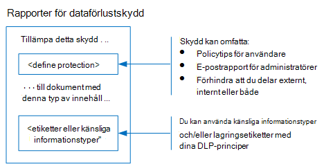

# Skydda information som omfattas av dataskyddsförordningenProtect information subject to data privacy regulation

Ett antal kontroller för informationsskydd kan användas i din prenumeration för att tillgodose behov och bestämmelser om efterlevnad av datasekretess.A number of information protection controls can be employed in your subscription to help address data privacy compliance needs and regulations. Dessa inkluderar General Data Protection Regulation (GDPR), HIPAA-HITECH (United States health care privacy act), California Consumer Protection Act (CCPA) och Brazil Data Protection Act (LGPD).These include General Data Protection Regulation (GDPR), HIPAA-HITECH (the United States health care privacy act), California Consumer Protection Act (CCPA), and the Brazil Data Protection Act (LGPD).

Dessa kontroller finns inom följande lösningsområden:These controls are within following solution areas:

- KänslighetsetiketterSensitivity labels
- Skydd mot dataförlust (DLP)Data loss prevention (DLP)
- Kryptering av Office-meddelanden (OME)Office message encryption (OME)
- Team och webbplatser får åtkomst till kontrollerTeams and sites access controls

>[!Note]
>Den här lösningen beskriver säkerhets- och efterlevnadsfunktioner för att skydda information som omfattas av datasekretessbestämmelser.This solution describes security and compliance features to protect information subject to data privacy regulations. En fullständig lista över säkerhetsfunktioner i Microsoft 365 finns i [Microsoft 365-säkerhetsdokumentationen](https://docs.microsoft.com/microsoft-365/security/).For a complete list of security features in Microsoft 365, see [Microsoft 365 security documentation](https://docs.microsoft.com/microsoft-365/security/). En fullständig lista över efterlevnadsfunktioner i Microsoft 365 finns i [Microsoft 365-dokumentation för efterlevnad](https://docs.microsoft.com/microsoft-365/compliance/).For a complete list of compliance features in Microsoft 365, see [Microsoft 365 compliance documentation](https://docs.microsoft.com/microsoft-365/compliance/).
>

## Regler för datasekretess som påverkar informationsskyddskontrollerData privacy regulations that impact information protection controls

Här är ett exempel på datasekretessregler som kan relatera till informationsskyddskontroller:Here is a sample list of data privacy regulations that may relate to information protection controls:

- GDPR Artikel 5.1 f)GDPR Article 5(1)(f))
- GDPR Artikel 32.1 aGDPR Article (32)(1)(a)
- LGPD Artikel 46LGPD Article 46
- HIPAA-HITECH (45 CFR 164.312(e)(1))HIPAA-HITECH (45 CFR 164.312(e)(1))
- HIPAA-HITECH (45 C.F.R.HIPAA-HITECH (45 C.F.R. 164.312 e.2 ii)164.312(e)(2)(ii))

Se [bedömningen av datasekretessrisker och identifiera artikel om känsliga objekt](information-protection-deploy-assess.md) för mer information om vart och ett av ovanstående.See the [assess data privacy risks and identify sensitive items article](information-protection-deploy-assess.md) for more information on each of the above.

Dataskyddsbestämmelser för informationsskydd rekommenderar:Data privacy regulations for information protection recommend:

- Skydd mot förlust eller obehörig åtkomst, användning och/eller överföring.Protection against loss or unauthorized access, usage and/or transmission.
- Riskbaserad tillämpning av skyddsmekanismer.Risk-based application of protective mechanisms.
- Användning av kryptering där så är lämpligt.Use of encryption where appropriate.

Din organisation kanske också vill skydda Microsoft 365-innehåll för andra ändamål, till exempel andra efterlevnadsbehov eller av affärsskäl.Your organization may also want to protect Microsoft 365 content for other purposes, such as other compliance needs or for business reasons. Upprätta ditt informationsskyddssystem för datasekretess bör göras som en del av övergripande planering, implementering och hantering av informationsskydd.Establishing your information protection scheme for data privacy should be done as part of overall information protection planning, implementation, and management.

För att hjälpa dig att komma igång med ett informationsskyddsschema i Microsoft 365 innehåller följande avsnitt en kort lista över relaterade funktioner och förbättringsåtgärder för Microsoft 365.To help you get started with an information protection scheme in Microsoft 365, the following section includes a short list of related capabilities and improvement actions for Microsoft 365. Listan innehåller funktioner och förbättringsåtgärder som är tillämpliga på datasekretessbestämmelser.The list includes capabilities and improvement actions that are applicable to data privacy regulations. Listan innehåller dock inte äldre tekniker om det finns en nyare kapacitet som till stor del ersätter den äldre.However, the list doesn't include older technologies if there's a newer capability that largely supersedes the older one. IRM (Information Rights Management) för SharePoint och OneDrive ingår till exempel inte i listan, men känslighetsetiketter ingår.For example, Information Rights Management (IRM) for SharePoint and OneDrive is not included in the list but sensitivity labels are included.

## Hantera informationsskydd i Microsoft 365Managing information protection in Microsoft 365

Microsofts [informationsskyddslösningar](../compliance/protect-information.md) innehåller ett antal integrerade funktioner i Microsoft 365, Microsoft Azure och Microsoft Windows.Microsoft [information protection solutions](../compliance/protect-information.md) include a number of integrated capabilities across Microsoft 365, Microsoft Azure, and Microsoft Windows. I Microsoft 365 omfattar informationsskyddslösningar:In Microsoft 365, information protection solutions include:

- [Tjänstkryptering med kundnyckelService encryption with Customer Key](../compliance/customer-key-overview.md)
- [Känsliga informationstyper](../compliance/what-the-sensitive-information-types-look-for.md) (beskrivs i [bedömningen av datasekretessrisker och identifiera artiklar om känsliga objekt)](information-protection-deploy-assess.md)[Sensitive information types](../compliance/what-the-sensitive-information-types-look-for.md) (described in the [assess data privacy risks and identify sensitive items article](information-protection-deploy-assess.md))
- [KänslighetsetiketterSensitivity labels](../compliance/sensitivity-labels.md) 
  - Service-/containernivåService/container-level
  - Nivå på klientsidan/innehållClient-side/content-level
  - Automatiserat för data-at-rest i SharePoint och OneDriveAutomated for data-at-rest in SharePoint and OneDrive
- Skydd mot dataförlust (DLP)Data Loss Prevention (DLP)
- [Office 365 Message Encryption nya funktioner (OME)](../compliance/ome.md) och OME [Advanced Message Encryption](../compliance/ome-advanced-message-encryption.md)[Office 365 Message Encryption new capabilities (OME)](../compliance/ome.md) and OME [Advanced Message Encryption](../compliance/ome-advanced-message-encryption.md)

Dessutom är skydd på plats- och biblioteksnivå viktiga mekanismer för att inkludera i alla skyddssystem.In addition, site and library level protection are important mechanisms to include in any protection scheme.

Information om andra funktioner för informationsskydd utanför Microsoft 365 finns i:For information on other information protection capabilities outside of Microsoft 365, see:

- [Microsoft Cloud Application Security (MCAS)Microsoft Cloud Application Security (MCAS)](https://docs.microsoft.com/cloud-app-security/)
- [Azure Information ProtectionAzure Information Protection](https://docs.microsoft.com/azure/information-protection/what-is-information-protection)
- [Microsoft SlutpunktshanterarenMicrosoft Endpoint Manager](https://www.microsoft.com/microsoft-365/microsoft-endpoint-manager)
- [Windows Information ProtectionWindows Information Protection](https://docs.microsoft.com/windows/security/information-protection/windows-information-protection/protect-enterprise-data-using-wip)

## KänslighetsetiketterSensitivity labels

Med känslighetsetiketter från Microsofts ramverk för informationsskydd kan du klassificera och skydda organisationens data utan att hindra användarnas produktivitet och deras samarbetsförmåga.Sensitivity labels from the Microsoft Information Protection framework let you classify and protect your organization's data without hindering the productivity of users and their ability to collaborate.

### Förutsättningar för känslighetsetiketterPrerequisites for sensitivity labels

Slutför dessa aktiviteter innan du implementerar någon av de känslighetsetikettbaserade funktioner som markeras nedan:Complete these activities prior to implementing any of the sensitivity label-based capabilities highlighted below:

1. Förstå följande:Understand the following:
   - **Affärskrav.****Business requirements.** Fastställa affärsskäl för att tillämpa känslighetsetiketter i företaget.Establish the business reasons for applying sensitivity labels in your enterprise. Till exempel dina krav på datasekretess för informationsskydd.For example, your data privacy requirements for information protection.
   - **Känslighetsetikettfunktioner.****Sensitivity label capabilities.** Känslighetsmärkning kan bli komplex, så se till att läsa dokumentationen för [känslighetsetiketter](../compliance/sensitivity-labels.md) innan du börjar.Sensitivity labelling can get complex, so make sure to read the [sensitivity labels documentation](../compliance/sensitivity-labels.md) before getting started.
   - **Viktiga saker att komma ihåg** Känslighetsetiketter hanteras i administrationscentret för Microsoft Compliance, men inriktnings- och programalternativen varierar avsevärt.**Key things to remember** Sensitivity labels are managed in the Microsoft Compliance admin center but the targeting and application options vary significantly.
      - Det finns känslighetsetiketter för webbplatser, grupper och Teams på behållarnivå (inställningarna gäller inte för innehåll i behållaren).There are sensitivity labels for sites, groups, and Teams at the container level (the settings do not apply to content inside the container). Dessa publiceras för användare och grupper som tillämpar dem när en webbplats, grupp eller ett team etableras.These are published to users and groups who apply them when a site, group or Team is provisioned.
      - Det finns känslighetsetiketter för aktivt innehåll.There are sensitivity labels for active content. Dessa publiceras också för användare eller grupper, som antingen tillämpar dem manuellt eller så tillämpas de automatiskt när:These are also published to user or groups, who either manually apply them, or they get applied automatically when:
        - Filen öppnas/redigeras/sparas, antingen på användarens skrivbord eller på en SharePoint-webbplats.The file is opened/edited/saved, either to the user’s desktop or a SharePoint site.
        - Ett e-postmeddelande utarbetas och skickas.An email is drafted and sent.
      - Det finns känslighetsetiketter för automatiskt program till filer i vila i SharePoint och OneDrive förutom e-postmeddelanden under överföring via Exchange.There are sensitivity labels for automatic application to files at rest in SharePoint and OneDrive in addition to emails in transit through Exchange. Dessa är inriktade på antingen alla webbplatser eller specifika och gäller automatiskt för filerna i vila i dessa miljöer.These are targeted to either all sites or specific ones and automatically apply to the files at rest in these environments.

2. Rationalisera aktuell känslighetsmärkning med tidigare eller alternativa metoderRationalize current sensitivity labelling with past or alternative methods

   - Azure Information ProtectionAzure Information Protection

      Det aktuella känslighetsmärkningssystemet kan behöva stämmas av med alla befintliga [implementeringar](../compliance/sensitivity-labels.md#sensitivity-labels-and-azure-information-protection) av Azure Information Protection-märkning.The current sensitivity labelling scheme may need to be reconciled with any existing [Azure Information Protection](../compliance/sensitivity-labels.md#sensitivity-labels-and-azure-information-protection) labeling implementation.
   - OmeOME

      Om du planerar att använda modern känslighetsmärkning för e-postskydd och befintliga e-postkrypteringsmetoder som OME finns på plats, kan de samexistera, men du bör förstå de scenarier där antingen bör tillämpas.If you are planning to use modern sensitivity labelling for email protection and existing email encryption methods like OME are in place, they can co-exist, but you should understand the scenarios in which either should be applied. Se [nya funktioner för office 365-meddelandekryptering (OME),](#office-365-message-encryption-ome-new-capabilities)som innehåller en tabell som jämför det moderna känslighetsetikettskyddet med OME-baserat skydd.See [Office 365 Message Encryption new capabilities (OME)](#office-365-message-encryption-ome-new-capabilities), which includes a table comparing modern sensitivity label-type protection with OME-based protection.

3. Planera för integrering i ett bredare system för informationsskydd.Plan for integration into a broader information protection scheme. Utöver samexistens med OME kan aktuella känslighetsetiketter användas längs sidan funktioner som Microsoft 365 dataförlustförebyggande (DLP) och Microsoft Cloud App Security.On top of coexistence with OME, current sensitivity labels can be used along-side capabilities like Microsoft 365 data loss prevention (DLP) and Microsoft Cloud App Security. Se [Känslighetsetiketter och Microsoft Cloud App Security](../compliance/sensitivity-labels.md#sensitivity-labels-and-microsoft-cloud-app-security) för att uppnå dina mål för datasekretessrelaterad informationsskydd.See [Sensitivity Labels and Microsoft Cloud App Security](../compliance/sensitivity-labels.md#sensitivity-labels-and-microsoft-cloud-app-security) to achieve your data privacy-related information protection goals.

4. Utveckla ett klassificerings- och kontrollschema för känslighetsetikett.Develop a sensitivity label classification and control scheme. Se [Taxonomi för dataklassificering och känslighetsetikett](https://aka.ms/dataclassificationwhitepaper).See [Data Classification and Sensitivity Label Taxonomy](https://aka.ms/dataclassificationwhitepaper).

### Allmän vägledningGeneral guidance

1. **Schemadefinition.****Schema definition.** Innan du använder tekniska funktioner för att använda etiketter och skydd, arbeta i hela organisationen för att definiera ett klassificeringsschema.Before using technical capabilities to apply labels and protection, work across your organization to define a classification schema. Du kanske redan har ett klassificeringsschema, vilket gör det enklare att lägga till personuppgifter.You might already have a classification schema, which makes it easier to add personal data. 
2. **Jag har börjat.****Getting started.** Börja med att bestämma numret och namnen på etiketterna som ska implementeras.Begin by deciding on the number and names of labels to implement. Gör denna aktivitet utan att oroa dig för vilken teknik som ska användas och hur etiketter kommer att tillämpas.Do this activity without worrying about which technology to use and how labels will be applied. Tillämpa det här schemat universellt i hela organisationen, inklusive data som finns lokalt och i andra molntjänster.Apply this schema universally throughout your organization, including data that resides on premises and in other cloud services.
3. **Ytterligare rekommendationer** När du utformar och implementerar principer, etiketter och villkor bör du överväga att följa dessa rekommendationer:**Additional recommendations** When designing and implementing policies, labels, and conditions, consider following these recommendations:

   - **Använd befintligt klassificeringsschema (om det finns något).****Use existing classification schema (if any).** Många organisationer använder redan dataklassificering i någon form.Many organizations already are using data classification in some form. Utvärdera noggrant det befintliga etikettschemat och använd det om möjligt som det är.Carefully evaluate the existing label schema and if possible, use it as is. Om du använder välbekanta etiketter som känns igen för slutanvändarna skapas det.Using familiar labels that are recognizable to your end-users will drive adoption.
   - **Börja i liten skala.****Start small.** Det finns praktiskt taget ingen gräns för hur många etiketter som du kan skapa.There is virtually no limit to the number of labels that you can create. Ett stort antal etiketter och underetiketter kan dock göra det långsammare att anta dem.However, large numbers of labels and sub-labels can slow adoption.
   - **Använd scenarier och användningsfall.****Use scenarios and use cases.** Identifiera vanliga användningsfall inom organisationen och använda scenarier som härleds från de datasekretessbestämmelser som du omfattas av.Identify common use cases within your organization and use scenarios derived from the data privacy regulations to which you are subject. Kontrollera om den tänkta etikett- och klassificeringskonfigurationen fungerar i praktiken.Verify if the envisioned label and classification configuration will work in practice.
   - **Ifrågasätt varje begäran om en ny etikett.****Question every request for a new label.** Har varje scenario eller användningsfall verkligen behöver en ny etikett eller kan du använda vad du redan har?Does every scenario or use case really need a new label or can you use what you already have? Att hålla antalet etiketter till ett minimum förbättrar antagandet.Keeping the number of labels to a minimum improves adoption.
   - **Använd underetiketter för nyckelavdelningar.****Use sub-labels for key departments.** Vissa avdelningar har särskilda behov som kräver specifika etiketter.Some departments will have specific needs that require specific labels. Definiera dessa etiketter som underetiketter till en befintlig etikett och överväg att använda begränsade principer som har tilldelats användargrupper i stället för globalt.Define these labels as sub-labels to an existing label and consider using scoped policies that are assigned to user groups instead of globally.
   - **Överväg begränsade principer.****Consider scoped policies.** Principer som är inriktade på delmängder av användare förhindrar överbelastning av etiketter.Policies targeted at subsets of users will prevent label overload. En begränsad princip gör det möjligt att tilldela roll- eller avdelningsspecifika etiketter eller underetiketter till bara medarbetare som arbetar för den specifika avdelningen.A scoped policy enables assigning role or department specific labels or sub-labels to just employees that work for that specific department. 
   - **Använd meningsfulla etikettnamn.****Use meaningful label names.** Försök att inte använda jargong, standarder eller förkortningar som etikettnamn.Try not to use jargon, standards, or acronyms as label names. Försök att använda namn som genljuder med slutanvändaren för att förbättra användningen.Try to use names that resonate with the end user to improve adoption. Istället för att använda etiketter som PII, PCI, HIPAA, LBI, MBI och HBI, överväga namn som icke-business, public, general, konfidentiell och mycket konfidentiell.Instead of using labels like PII, PCI, HIPAA, LBI, MBI and HBI, consider names like Non-Business, Public, General, Confidential and Highly Confidential.

### Skapa och distribuera känslighetsetiketter för webbplatser, grupper och teamCreate and deploy sensitivity labels for sites, groups, and teams

När du skapar [känslighetsetiketter](../compliance/sensitivity-labels-teams-groups-sites.md) i Microsoft 365-efterlevnadscentret kan du nu använda dem på följande behållare:When you create [sensitivity labels](../compliance/sensitivity-labels-teams-groups-sites.md) in the Microsoft 365 compliance center, you can now apply them to these containers:

- Microsoft Teams-webbplatserMicrosoft Teams sites
- Microsoft 365-grupper (tidigare Office 365-grupper)Microsoft 365 groups (formerly Office 365 groups)
- SharePoint-webbplatserSharePoint sites

Använd följande etikettinställningar för att skydda innehållet i dessa behållare:Use the following label settings to help protect the content in those containers:

- Sekretess (offentlig eller privat) för Microsoft 365 gruppanslutna Teams-webbplatserPrivacy (public or private) of Microsoft 365 group-connected Teams sites
- Extern användaråtkomstExternal user access
- Åtkomst från ohanterade enheterAccess from unmanaged devices

För datasekretess, för att förhindra extern delning för behållare som kommer att användas för att lagra innehåll med känsliga personuppgifter, markera de filer som innehåller data som privata och kräver hanterade enheter.For data privacy, to prevent external sharing for containers that will be used for storing content with sensitive personal data, mark the files containing the data as private, and require managed devices.

### Skapa och distribuera känslighetsetiketter för innehållCreate and deploy sensitivity labels for content

Med känslighetsetiketter som tillämpas på filer kan du kryptera deras innehåll, vattenstämpel innehållet och definiera andra kontroller för Office-programinnehåll, inklusive Outlook och Office på webben.Sensitivity labels applied to files allow you to encrypt their content, watermark the content, and define other controls for Office applications content, including Outlook and Office on the web.

När du är redo att börja skydda organisationens data med känslighetsetiketter:When you're ready to start protecting your organization's data with sensitivity labels:

1. **Skapa etiketterna.****Create the labels.** Skapa och namnge dina känslighetsetiketter enligt organisationens klassificeringstaxonomi för olika känslighetsnivåer av innehåll.Create and name your sensitivity labels according to your organization's classification taxonomy for different sensitivity levels of content. Mer information om hur du utvecklar en klassificeringstaxonomi finns i [faktabladets taxonomi för dataklassificering och känslighetsetikett](https://aka.ms/dataclassificationwhitepaper).For more information on developing a classification taxonomy, see the [Data Classification and Sensitivity Label Taxonomy white paper](https://aka.ms/dataclassificationwhitepaper).
2. **Definiera vad varje etikett kan göra.****Define what each label can do.** Konfigurera de skyddsinställningar som du vill ska associeras med varje etikett.Configure the protection settings you want associated with each label. Du kanske till exempel vill att innehåll med lägre känslighet (till exempel en "allmän"-etikett) bara ska ha ett sidhuvud eller en sidfot tillämpat, medan högre känslighetsinnehåll (till exempel en "Konfidentiell" etikett) ska ha en vattenstämpel och ha kryptering aktiverad.For example, you might want lower sensitivity content (such as a "General" label) to have just a header or footer applied, while higher sensitivity content (such as a "Confidential" label) should have a watermark and have encryption enabled.
3. **Publicera etiketterna.****Publish the labels.** När känslighetsetiketterna har konfigurerats publicerar du dem med hjälp av en etikettprincip.After your sensitivity labels are configured, publish them by using a label policy. Bestäm vilka användare och grupper som ska ha etiketterna och vilka principinställningar som ska användas.Decide which users and groups should have the labels and what policy settings to use. En enda etikett kan återanvändas.A single label is reusable. Du definierar det en gång och sedan kan du inkludera det i flera etikettprinciper som tilldelats olika användare.You define it once and then you can include it in several label policies assigned to different users.

När du har publicerat känslighetsetiketter från Microsoft 365-efterlevnadscentret börjar de visas i [Office-appar](../compliance/sensitivity-labels-office-apps.md) så att användarna kan klassificera och skydda innehåll när det skapas eller redigeras.Once you publish sensitivity labels from the Microsoft 365 compliance center, they start to appear in [Office apps](../compliance/sensitivity-labels-office-apps.md) for users to classify and protect content as it's created or edited.

För datasekretess tillämpar du manuellt en känslighetsetikett med kryptering och andra regler för e-post eller innehåll som innehåller känslig personlig information.For data privacy, you manually apply a sensitivity label with encryption and other rules to email or content containing sensitive personal information.

>[!Note]
>Känslighetsetiketter med kryptering aktiverad på e-post har vissa överlappande funktioner med OME.Sensitivity labels with encryption enabled applied to email have some overlapping functionality with OME. Se [Jämförelse av säkra e-postscenarier med OME- och känslighetsetiketter](#secure-email-scenarios-comparison-with-ome-and-sensitivity-labels).See [Secure email scenarios comparison with OME and sensitivity labels](#secure-email-scenarios-comparison-with-ome-and-sensitivity-labels).

### Automatisk märkning på klientsidan när användare redigerar dokument eller skriver e-postmeddelandenClient-side auto-labeling when users edit documents or compose emails

När du skapar en känslighetsetikett kan du [automatiskt tilldela den etiketten](../compliance/apply-sensitivity-label-automatically.md) till innehåll, inklusive e-post när den matchar villkor som du anger.When you create a sensitivity label, you can [automatically assign that label](../compliance/apply-sensitivity-label-automatically.md) to content including email when it matches conditions that you specify.

Möjligheten att automatiskt använda känslighetsetiketter på innehåll är viktigt eftersom:The ability to apply sensitivity labels to content automatically is important because:

- Du behöver inte träna användarna när du ska använda var och en av dina klassificeringar.You don't need to train your users when to use each of your classifications.
- Du behöver inte förlita dig på att användarna klassificerar allt innehåll korrekt.You don't need to rely on users to classify all content correctly.
- Användarna behöver inte längre känna till dina policyer – de kan i stället fokusera på sitt arbete.Users no longer need to know about your policies—they can instead focus on their work.

Automatisk märkning stöder att rekommendera en etikett till användarna, samt att automatiskt tillämpa en etikett.Auto-labelling supports recommending a label to users, as well as automatically applying a label. Men i båda fallen bestämmer användaren om han vill acceptera eller avvisa etiketten för att säkerställa korrekt märkning av innehåll.But in both cases, the user decides whether to accept or reject the label, to help ensure the correct labeling of content.

Den här etiketten på klientsidan har minimal fördröjning för dokument eftersom etiketten kan användas redan innan dokumentet sparas.This client-side labeling has minimal delay for documents because the label can be applied even before the document is saved. Alla klientappar stöder dock inte automatisk märkning.However, not all client apps support auto-labeling. Den här funktionen stöds av azure informationsskydd enhetlig märkning klient, och [vissa versioner av Office-program](../compliance/sensitivity-labels-office-apps.md#support-for-sensitivity-label-capabilities-in-apps).This capability is supported by the Azure Information Protection unified labeling client, and [some versions of Office apps](../compliance/sensitivity-labels-office-apps.md#support-for-sensitivity-label-capabilities-in-apps).

Konfigurationsinstruktioner finns i [Konfigurera automatisk märkning för Office-appar](../compliance/sensitivity-labels-office-apps.md#support-for-sensitivity-label-capabilities-in-apps).For configuration instructions, see [How to configure auto-labeling for Office apps](../compliance/sensitivity-labels-office-apps.md#support-for-sensitivity-label-capabilities-in-apps).

För datasekretess använder du känslighetsetiketter automatiskt för innehåll som innehåller känslig personlig information.For data privacy, you auto-apply sensitivity labels for content containing sensitive personal information.

### Automatisk etikett på servicesidan när innehållet redan har sparatsService-side auto-labeling when content is already saved

Den här metoden kallas automatisk klassificering med känslighetsetiketter.This method is referred to as auto classification with sensitivity labels. Du kan också höra det kallas automatisk märkning för data i vila (för dokument i SharePoint och OneDrive) och data under överföring (för e-post som skickas eller tas emot av Exchange).You might also hear it referred to as auto-labeling for data at rest (for documents in SharePoint and OneDrive) and data in transit (for email that is sent or received by Exchange). För Exchange innehåller den inte e-postmeddelanden i postlådor i vila.For Exchange, it doesn't include emails in mailboxes at rest.
 
Eftersom den här märkningen tillämpas av själva tjänsten i stället för av användarprogrammet behöver du inte oroa dig för vilka appar användarna har och vilken version.Because this labeling is applied by the service itself rather than by user application, you don't need to worry about what apps users have and what version. Därför är den här funktionen omedelbart tillgänglig i hela organisationen och lämplig för märkning i stor skala.As a result, this capability is immediately available throughout your organization and suitable for labeling at scale. Principer för automatisk märkning stöder inte rekommenderad märkning eftersom användaren inte interagerar med märkningsprocessen.Auto-labeling policies don't support recommended labeling because the user doesn't interact with the labeling process. I stället kör administratören principerna i simuleringsläge för att säkerställa korrekt märkning av innehåll innan du faktiskt använder etiketten.Instead, the administrator runs the policies in simulation mode to help ensure the correct labeling of content before actually applying the label.

Konfigurationsinstruktioner finns i [Konfigurera principer för automatisk märkning för SharePoint, OneDrive och Exchange](../compliance/apply-sensitivity-label-automatically.md#how-to-configure-auto-labeling-policies-for-sharepoint-onedrive-and-exchange).For configuration instructions, see [How to configure auto-labeling policies for SharePoint, OneDrive, and Exchange](../compliance/apply-sensitivity-label-automatically.md#how-to-configure-auto-labeling-policies-for-sharepoint-onedrive-and-exchange).

För datasekretess på webbplatser som berörs, tryck på känslighetsetiketter för automatisk kryptering av innehåll som innehåller känslig personlig information.For data privacy within sites of concern, push sensitivity labels for automatic encryption of content containing sensitive personal information.

## Förebyggande av dataförlustData loss prevention 

Du kan använda [dataförlustskydd (DLP)](../compliance/data-loss-prevention-policies.md) i Microsoft 365 för att identifiera, varna och blockera riskfylld, oavsiktlig eller olämplig delning, till exempel delning av data som innehåller personlig information, både internt och externt.You can use [data loss prevention (DLP)](../compliance/data-loss-prevention-policies.md) in Microsoft 365 to detect, warn, and block risky, inadvertent, or inappropriate sharing, such as sharing of data containing personal information, both internally and externally.

Med DLP kan du:DLP allows you to:

- Identifiera och övervaka riskfyllda delningsaktiviteter.Identify and monitor risky sharing activities.
- Utbilda användarna med vägledning i kontext för att fatta rätt beslut.Educate users with in-context guidance to make the right decisions.
- Framtvinga dataanvändningsprinciper på innehåll utan att hämma produktiviteten.Enforce data use policies upon content without inhibiting productivity.
- Integrera med klassificering och märkning för att identifiera och skydda data när de delas.Integrate with classification and labeling to detect and protect data when it is shared.

### Arbetsbelastningar som stöds för DLPSupported workloads for DLP

Med en DLP-princip i Microsoft 365-efterlevnadscentret kan du identifiera, övervaka och automatiskt skydda känsliga objekt på många platser i Microsoft 365, till exempel Exchange Online, SharePoint, OneDrive och Microsoft Teams.With a DLP policy in the Microsoft 365 compliance center, you can identify, monitor, and automatically protect sensitive items across many locations in Microsoft 365, such as Exchange Online, SharePoint, OneDrive, and Microsoft Teams.

Du kan till exempel identifiera alla dokument som innehåller ett kreditkortsnummer som lagras på valfri OneDrive-webbplats, eller så kan du bara övervaka OneDrive-webbplatserna för specifika personer.For example, you can identify any document containing a credit card number that's stored in any OneDrive site, or you can monitor just the OneDrive sites of specific people.

Du kan också övervaka och skydda känsliga objekt i de lokalt installerade versionerna av Excel, PowerPoint och Word, som innehåller möjligheten att identifiera känsliga objekt och tillämpa DLP-principer.You can also monitor and protect sensitive items in the locally-installed versions of Excel, PowerPoint, and Word, which include the ability to identify sensitive items and apply DLP policies. DLP ger kontinuerlig övervakning när personer delar innehåll från dessa Office-appar.DLP provides continuous monitoring when people share content from these Office apps.

Den här bilden visar ett exempel på DLP som skyddar personuppgifter.This figure shows an example of DLP protecting personal data.

DLP används för att identifiera ett dokument eller e-postmeddelande som innehåller en hälsojournal och blockerar sedan automatiskt åtkomsten till dokumentet eller blockerar e-postmeddelandet från att skickas.DLP is used to identify a document or email containing a health record and then automatically blocks access to that document or blocks the email from being sent. DLP meddelar sedan mottagaren med ett principtips och skickar en avisering till slutanvändaren och administratören.DLP then notifies the recipient with a policy tip and sends an alert to the end-user and admin.

### Planering för DLPPlanning for DLP

Planera dina DLP-principer för:Plan your DLP policies for: 

- Dina affärskrav.Your business requirements.

- En riskbaserad bedömning av organisationen enligt beskrivningen i [bedömningen av datasekretessrisker och identifiera känsliga objekt artikel](information-protection-deploy-assess.md).A risk-based assessment of the organization as described in the [assess data privacy risks and identify sensitive items article](information-protection-deploy-assess.md).

- Andra mekanismer för informationsskydd och styrning finns eller planerar datasekretess.Other information protection and governance mechanisms in place or in planning for data privacy.

- De känsliga informationstyper som du har identifierat för personuppgifter baserat på ditt bedömningsarbete enligt beskrivningen i [artikeln bedöm datasekretess och identifiera känsliga objekt.](information-protection-deploy-assess.md)The sensitive information types that you’ve identified for personal data based on your assessment work as described in the [assess data privacy risks and identify sensitive items article](information-protection-deploy-assess.md). DLP-principvillkor kan baseras på både känsliga informationstyper och lagringsetiketter.DLP policy conditions can be based on both sensitive information types and retention labels.

- Behållaniketterna måste du ange DLP-villkor.The retention labels you'll need to specify DLP conditions. Mer information [finns i den härskande informationen som omfattas av dataskyddsförordningen i din organisationsartikel.](information-protection-deploy-govern.md)See the [govern information subject to data privacy regulation in your organization](information-protection-deploy-govern.md) article for more information.

- Pågående DLP-principhantering, som kräver att någon i organisationen använder och ställer in principer för ändringar i känsliga informationstyper, lagringsetiketter, föreskrifter och efterlevnadsprinciper.Ongoing DLP policy management, which requires someone in the organization to operate and tune policies for changes in sensitive information types, retention labels, regulations, and compliance policies.

Även om känslighetsetiketter inte kan användas i DLP-principvillkor kan vissa skyddsscenarier för att förhindra åtkomst uppnås med bara känslighetsetiketter som kan tillämpas automatiskt baserat på känsliga informationstyper.Although sensitivity labels can’t be used in DLP policy conditions, certain protection scenarios to prevent access may be achievable with just sensitivity labels that can be auto-applied based on sensitive information types. Om det finns en robust känslighetsmärkning bör du överväga om DLP bör användas för att öka skyddet eftersomIf robust sensitivity labelling is in place, consider whether DLP should be used to augment protection because:

  - DLP kan förhindra delning av filer.DLP can prevent sharing of files. Känslighetsetiketter kan bara förhindra åtkomst.Sensitivity labels can just prevent access.

  - DLP har mer detaljerade kontrollnivåer när det gäller regler, villkor och åtgärder.DLP has more granular levels of control in terms of rules, conditions, and actions.

  - DLP-principer kan tillämpas på Teams chatt- och kanalmeddelanden.DLP policies can be applied to Teams chat and channel messages. Känslighetsetiketter kan bara tillämpas på dokument och e-post.Sensitivity labels can only be applied to documents and email.

### DLP-principerDLP policies

DLP-principer konfigureras i administrationscentret för Microsoft Compliance och anger skyddsnivån, den känsliga informationstyp som principen söker efter och målarbetsbelastningarna.DLP policies are configured in the Microsoft Compliance admin center and specify the level of protection, the sensitive information type the policy is looking for, and the target workloads. Deras grundläggande komponenter består i att identifiera skyddet och typerna av uppgifter.Their basic components consist of identifying the protection and the types of data.

Här är ett exempel DLP politik för medvetenhet om GDPR.Here is an example DLP policy for awareness of GDPR.

Mer information om hur du skapar och tillämpar DLP-principer finns i [den här artikeln.](../compliance/create-test-tune-dlp-policy.md)See [this article](../compliance/create-test-tune-dlp-policy.md) for more information about creating and applying DLP policies.

### Skyddsnivåer för datasekretessProtection levels for data privacy

I följande tabell visas tre konfigurationer för att öka skyddet med DLP.The following table lists three configurations of increasing protection using DLP.

Den första konfigurationen, Medvetenhet, kan användas som utgångspunkt och miniminivå av skydd för att tillgodose efterlevnadsbehov för datasekretessbestämmelser.The first configuration, Awareness, can be used as a starting point and minimum level of protection to address compliance needs for data privacy regulations.

>[!Note]
>I takt med att skyddsnivåerna ökar minskar användarnas förmåga att dela och få tillgång till information i vissa fall och kan potentiellt påverka deras produktivitet eller förmåga att utföra dagliga uppgifter.As the levels of protection increase, the ability of users to share and access information will decrease in some cases and could potentially impact their productivity or ability to complete daily tasks.
>

För att hjälpa dina anställda att fortsätta att vara produktiva i en säkrare miljö när du ökar skyddsnivåerna, ta dig tid att utbilda och utbilda dem om nya säkerhetspolicyer och säkerhetsrutiner.To help your employees continue to be productive in a more secure environment when increasing protection levels, take the time to train and educate them on new security policies and procedures.

### Exempel på hur du använder känslighetsetiketter med DLPExample of using sensitivity labels with DLP

Känslighetsetiketter kan arbeta tillsammans med DLP för att tillhandahålla datasekretess i en starkt reglerad miljö.Sensitivity labels can work together with DLP to provide data privacy in a highly regulated environment. Här är de viktigaste stegen i den integrerade distributionen:Here are the key steps of the integrated deployment:

1. Regulatoriska och i övrigt affärskrav för datasekretess dokumenteras.Regulatory and otherwise business requirements for data privacy are documented.
2. Måldatakällor, typer och ägarskap kännetecknas i förhållande till datasekretessproblem.Target data sources, types, and ownership are characterized relative to data privacy concerns.
3. En övergripande strategi för att ta itu med krav och skydda och styra hotspots för datasekretess upprättas.An overall strategy to address requirements and protect and govern data privacy hotspots is established.
4. En stegvis handlingsplan för att ta itu med strategin för kontroll av datasekretess införs.A phased action plan to address the data privacy control strategy is put into place.

När dessa element har bestämts kan du använda känsliga informationstyper, din känslighetsmärkningstaxonomi och DLP-principer tillsammans.Once these elements are determined, you can use sensitive information types, your sensitivity labelling taxonomy, and DLP policies together. Den här bilden visar ett exempel.This figure shows an example.

[Se en större version av den här bildenSee a larger version of this image](https://github.com/MicrosoftDocs/microsoft-365-docs/raw/public/microsoft-365/media/information-protection-deploy-protect-information/information-protection-deploy-protect-information-sensitivity-lables-dlp.png)

Här är några dataskyddsscenarier som använder DLP och känslighetsetiketter tillsammans som visas i figuren.Here are some data protection scenarios using DLP and sensitivity labels together as shown in the figure.

| ScenarioScenario | ProcessProcess |
|:-------|:-----|
| AA | <ol><li>Känslighetsetiketter för innehåll publiceras av en administratör till användare och grupper för manuell eller automatisk tillämpning till innehåll och e-post.Sensitivity labels for content are published by an administrator to users and groups for manual or automatic application to content and email. </li><li>Användare A använder etiketterna manuellt eller automatiskt när de interagerar med innehåll, med kryptering eller andra inställningar.User A applies the labels manually or automatically when interacting with content, with encryption or other settings applied. </li><li>Användare A skickar ett skyddat e-postmeddelande eller en skyddad fil till användare B, en gästanvändare.User A sends a protected email or file to User B, a guest user. </li></ol> |
| BB | DLP-princip som publicerats av en administratör till Användare A blockerar användare A från att skicka e-postmeddelandet och/eller filen till användare B.DLP policy published by an administrator to User A blocks User A from sending the email and/or file to User B. |
| CC |  Känslighetsetikett med inställningen "Ägare kan inte bjuda in gäster" publiceras för Användare A, som etablerar ett Teams-team eller SharePoint-webbplats.Sensitivity label with “owner can’t invite guests” setting is published to User A, who provisions a Teams team or SharePoint site. En annan användare av webbplatsen försöker selektivt dela en fil med användare B, men DLP blockerar den.Another user of the site selectively tries sharing a file with User B, but DLP blocks it. |
| DD | Känslighetsetikett för automatiskt program till webbplatsinnehåll publiceras på en eller flera platser, vilket ger ett annat skyddslager, vilket resulterar i en skyddad plats.Sensitivity label for auto-application to site content is published to one or more sites, providing another layer of protection, resulting in a protected site. |
|||

## Ome-kryptering (Office 365 Message Encryption) nya funktionerOffice 365 Message Encryption (OME) new capabilities

Människor använder ofta e-post för att utbyta känsliga objekt, till exempel patienthälsoinformation eller kund- och medarbetarinformation.People often use email to exchange sensitive items, such as patient health information or customer and employee information. Kryptering av e-postmeddelanden säkerställer att endast avsedda mottagare kan visa meddelandeinnehåll.Email message encryption helps ensure that only intended recipients can view message content.

Med [OME](../compliance/ome.md)kan du skicka och ta emot krypterade meddelanden mellan personer inom och utanför organisationen.With [OME](../compliance/ome.md), you can send and receive encrypted messages between people inside and outside your organization. OME fungerar med Outlook.com, Yahoo!, Gmail och andra e-posttjänster.OME works with Outlook.com, Yahoo!, Gmail, and other email services. OME hjälper till att säkerställa att endast avsedda mottagare kan visa meddelandeinnehåll.OME helps ensure that only intended recipients can view message content.

För datasekretess använder du OME för att skydda interna meddelanden som innehåller känsliga objekt.For data privacy, you use OME to protect internal messages containing sensitive items. Office 365 Message Encryption är en onlinetjänst som bygger på Microsoft Azure Rights Management (Azure RMS) som är en del av Azure Information Protection.Office 365 Message Encryption is an online service that's built on Microsoft Azure Rights Management (Azure RMS) which is part of Azure Information Protection. Detta inkluderar principer för kryptering, identitet och auktorisering för att skydda din e-post.This includes encryption, identity, and authorization policies to help secure your email. Du kan kryptera meddelanden med hjälp av rättighetshanteringsmallar, alternativet Vidarebefordra inte och alternativet endast kryptera.You can encrypt messages by using rights management templates, the Do Not Forward option, and the encrypt-only option.

Du kan också definiera regler för e-postflöde för att tillämpa det här skyddet.You can also define mail flow rules to apply this protection. Du kan till exempel skapa en regel som kräver kryptering av alla meddelanden som är adresserade till en viss mottagare, eller som innehåller specifika nyckelordsord på ämnesraden, och även ange att mottagarna inte kan kopiera eller skriva ut innehållet i meddelandet.For example, you can create a rule that requires the encryption of all messages addressed to a specific recipient, or that contains specific keywords words in the subject line, and also specify that recipients can't copy or print the contents of the message.

Dessutom hjälper OME [Advanced Message Encryption](../compliance/ome-advanced-message-encryption.md) dig att uppfylla efterlevnadsskyldigheter som kräver mer flexibla kontroller över externa mottagare och deras åtkomst till krypterade e-postmeddelanden.In addition, OME [Advanced Message Encryption](../compliance/ome-advanced-message-encryption.md) helps you meet compliance obligations that require more flexible controls over external recipients and their access to encrypted emails. Med OME Advanced Message Encryption i Microsoft 365 kan du styra känsliga e-postmeddelanden som delas utanför organisationen med automatiska principer som identifierar känsliga informationstyper.With OME Advanced Message Encryption in Microsoft 365, you can control sensitive emails shared outside the organization with automatic policies that detect sensitive information types. 

Om du behöver dela e-post med en extern part kan du ange ett utgångsdatum och återkalla meddelanden om du behöver dela e-post med en extern part.For data privacy, if you need to share email with an external party, you can specify an expiration date and revoke messages. Du kan bara återkalla och ange ett utgångsdatum för meddelanden som skickas till externa mottagare.You can only revoke and set an expiration date for messages sent to external recipients.

### Säker jämförelse av e-postscenarier med OME- och känslighetsetiketterSecure email scenarios comparison with OME and sensitivity labels

OME och känslighetsetiketter som tillämpas på e-post med kryptering har viss överlappning, så det är viktigt att förstå vilka scenarier som antingen kan gälla för, som visas i den här tabellen.OME and sensitivity labels applied to email with encryption have some overlap, so it’s important to understand which scenarios that either might apply to, as shown in this table.

| ScenarioScenario | KänslighetsetiketterSensitivity Labels | OmeOME |
|:-------|:-----|:-------|
| Interna + partnersInternal + partners   Kommunicera och samarbeta säkert mellan interna användare och betrodda partnerSecurely communicate and collaborate between internal users and trusted partners | Rekommendera – etiketter med helt anpassad klassificering och skyddRecommend – labels with fully customized classification and protection | Ja – Kryptera endast eller Vidarebefordra inte skydd utan klassificeringYes – Encrypt only or Do Not Forward protection with no classification |
| Externa parterExternal parties   Kommunicera och samarbeta säkert med externa/konsumentanvändareSecurely communicate and collaborate with any external/consumer users | Ja – fördefiniera mottagare i etikettYes – predefine recipients in label | Rekommendera – just-in-time skydd baserat på mottagareRecommend – just-in-time protection based on recipients |
| Internt + partners, med förfallodatum/återkallandeInternal + partners, with expiration/revocation   Kontrollera åtkomsten för e-post och innehåll med interna användare och betrodda partner med förfallodatum och återkallandeControl access of mail and content with internal users and trusted partners with expiration and revocation | Rekommendera - helt anpassat skydd med åtkomstvaraktighet, kan användaren manuellt spåra och återkalla filerRecommend - fully customized protection with access duration, user can manually track and revoke files | Nej – ingen återkallning eller förfallodatum för intern postNo – no revocation or expiration for internal mail |
| Externa parter med förfallodatum/återkallandeExternal parties with expiration/revocation   Kontrollera åtkomsten till e-post och innehåll med externa/konsumentanvändare med förfallodatum och återkallandeControl access of mail and content with external/consumer users with expiration and revocation | Ja – användaren kan spåra filer manuelltYes – user can manually track files | Rekommendera (E5) – admin kan återkalla e-post från Security & Compliance CenterRecommend (E5) – admin can revoke mail from Security & Compliance Center |
| Automatisk märkningAuto-labelling   Organisationen vill automatiskt skydda e-post/bilagor med specifikt känsligt innehåll och/eller specifika mottagareOrganization wants to automatically protect mail/attachments with specific sensitive content and/or specific recipients | Rekommendera (E5) - Automatisk märkning i Exchange- och Outlook-klienter, utökar reglerna för e-postflöde och DLP-principRecommend (E5) - Auto-labeling in Exchange and Outlook clients, augments mail flow rules and DLP policy | Ja - regler för e-postflöde och DLP-princip med Endast kryptera eller Vidarebefordra inte skyddYes - mail flow rules and DLP policy with Encrypt only or Do Not Forward protection |
||||

Det kommer också att finnas skillnader i slutanvändare och admin erfarenheter mellan dessa två metoder.There will also be differences in end-user and admin experiences between these two methods.

## Team med skydd för mycket känsliga dataTeams with protection for highly sensitive data

För organisationer som planerar att lagra personliga data som omfattas av datasekretessbestämmelser i Teams finns [i Konfigurera ett team med säkerhetsisolering](secure-teams-security-isolation.md), som ger detaljerad vägledning och konfigurationssteg för:For organizations that plan to store personal data subject to data privacy regulations in Teams, see [Configure a team with security isolation](secure-teams-security-isolation.md), which provides detailed guidance and configuration steps for:

- Identitets- och enhetsåtkomstIdentity and device access
- Inrättande av ett privat teamCreation of a private team
- Låsning av underliggande behörigheter för gruppwebbplatserLockdown of underlying team site permissions
- En gruppbaserad känslighetsetikett med krypteringA group-based sensitivity label with encryption
