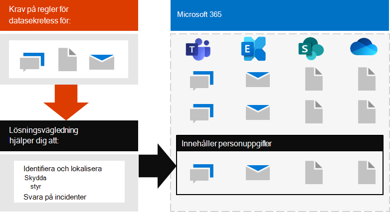
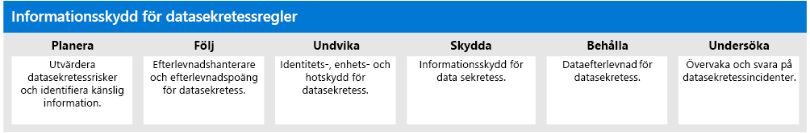

# Distribuera informationsskydd för datasekretessbestämmelser med Microsoft 365

Din organisation kan omfattas av regionala datasekretessbestämmelser som kräver att du skyddar, hanterar och tillhandahåller rättigheter och kontroll över personlig information som lagras i din IT-infrastruktur, inklusive både lokalt och i molnet. Det bästa exemplet på en dataskyddsförordning är EU:s allmänna dataskyddsförordning (GDPR). Underlåtenhet att följa reglerna för datasekretess kan resultera i betydande böter.

Exempel på datatyper i Microsoft 365 är chattsessioner i Microsoft Teams, e-postmeddelanden i Exchange och filer i SharePoint och OneDrive. Den här lösningen ger vägledning om hur du identifierar, lokaliserar, skyddar, styr och svarar på datasekretessincidenter för personuppgifter som lagras i Microsoft 365-tjänster som omfattas av datasekretessbestämmelser.

Ytterligare information finns också om användningen av Microsoft 365-identitets-, enhets- och hotskyddskontroller för dina datasekretessbehov. 

Om du vill uppfylla kriterierna för att skydda information för att uppfylla reglerna för datasekretess använder du dessa funktioner och funktioner för Microsoft 365.

| Resurs eller funktion | Beskrivning | Licensiering |
|:-------|:-----|:-------|
| Efterlevnadshanteraren | Hantera regelefterlevnadsaktiviteter relaterade till Microsofts molntjänster med det här arbetsflödesbaserade riskbedömningsverktyget i Microsoft Service Trust Portal. | Microsoft 365 E3 och E5 |
| Efterlevnadspoäng (förhandsgranskning) | Se en övergripande poäng för din aktuella efterlevnadskonfiguration och rekommendationer för att förbättra den i Microsoft 365 Compliance Center. | Microsoft 365 E3 och E5 |
| Office Advanced Threat Protection (ATP) | Skydda dina Microsoft 365-appar och -data– till exempel e-postmeddelanden, Office-dokument och samarbetsverktyg – från angrepp. | Microsoft 365 E3 och E5 | 
| Känslighetsetiketter | Klassificera och skydda organisationens data utan att hindra användarnas produktivitet och deras förmåga att samarbeta genom att placera etiketter med olika skyddsnivåer på e-post, filer eller webbplatser. | Microsoft 365 E3 och E5 |
| Dataskydd (DLP) | Identifiera, varna och blockera riskfylld, oavsiktlig eller olämplig delning, till exempel delning av data som innehåller personlig information, både internt och externt. | Microsoft 365 E3 och E5 | 
| Etiketter och principer för datalagring | Implementera kontroller för informationsstyrning, till exempel hur länge data och krav på lagring av personuppgifter på kunder ska lagras för att följa organisationens policyer eller dataregler. | Microsoft 365 E3 och E5 |
| E-postkryptering | Skicka och ta emot krypterade e-postmeddelanden mellan personer inom och utanför organisationen som innehåller reglerade data, till exempel personuppgifter om kunder. | Microsoft 365 E3 och E5 |
||||

## Organisation av vägledningen i denna lösning

För att hjälpa dig att förstå de Microsoft 365-verktyg som finns tillgängliga för att identifiera, hantera, kontrollera och övervaka personliga data som omfattas av en eller flera sekretessrelaterade bestämmelser, är den här vägledningen uppdelad i avsnitt.
 

Var och en av dessa avsnitt motsvarar en separat artikel i den här lösningen.

>[!Note]
>Om du redan är bekant med dina datasekretessskyldigheter och utför mot en befintlig plan kanske du vill fokusera på vägledningen Förhindra, Skydda, Behåll och Undersöka.

>[!Important]
>Att följa den här vägledningen kommer inte nödvändigtvis att göra dig kompatibel med någon datasekretessreglering, särskilt med tanke på antalet steg som krävs som ligger utanför ramen för funktionerna. Du är ansvarig för att säkerställa din efterlevnad och att konsultera dina juridiska och efterlevnadsteam eller för att söka vägledning och råd från tredje part som är specialiserade på efterlevnad.
>

## Planera: Bedöma datasekretessrisker och identifiera känsliga objekt 

Att bedöma datasekretessregler och risker som din organisation omfattas av är ett viktigt första steg att ta innan du börjar implementera förbättringar, inklusive de som kan uppnås via Microsoft 365-konfiguration. Detta kan omfatta en övergripande bedömning eller identifiering av särskilda känsliga informationstyper som omfattas av regelkontroller som din organisation måste följa, samt förekomsten av dem i din Microsoft 365-miljö.

Mer information finns i [Bedöma datasekretessrisker och identifiera känsliga objekt](information-protection-deploy-assess.md).

## Spår: Använd efterlevnadspoäng och efterlevnadshanterare 

Compliance Score and Compliance Manager innehåller en integrerad uppsättning verktyg som är tillgängliga i Microsoft 365 Compliance admin center och Services Trust Portal. Tillsammans ger dessa verktyg dig en inbyggd förmåga att spåra och hantera förbättringsåtgärder totalt sett samt de som rör flera datasekretessbestämmelser som du utsätts för.

Med verktygen kan du också utnyttja inbyggda bedömningsmallar som är specifika för varje förordning, där du kan spåra åtgärdsobjekt för varje vald bedömningsmall, samt visa specifika regelkontroller och relatera dem till specifika åtgärder.

Mer information finns i [Använd efterlevnadspoäng och efterlevnadshanteraren för att hantera förbättringsåtgärder](information-protection-deploy-compliance.md).

## Förhindra: Använd identitet, enhet och hotskydd för datasekretessreglering

Microsoft 365 tillhandahåller ett antal funktioner för identitet, enhet och hotskydd som du kan använda för att följa efterlevnaden av datasekretessregleringen. 

Mer information finns i [Använda identitet, enhet och hotskydd för dataskyddsreglering](information-protection-deploy-identity-device-threat.md).

I den här artikeln beskrivs kortfattat vad de dataskyddsbestämmelser som vanligtvis kräver inom dessa områden och innehåller en lista över relaterade Microsoft 365-lösningar, med länkar till mer information som hjälper dig att hantera eventuella implementeringskrav. 

## Skydda information som omfattas av dataskyddsförordningen

Dataskyddsregler dikterar ett antal kontroller för skydd av personuppgifter som kan användas i din miljö, inklusive mer än fyrtio protect information-kontroller över bara de fyra dataskyddsbestämmelserna i vår urval av GDPR, California Consumer Protection Act (CCPA), HIPAA-HITECH (United States health care privacy act) och Brazil Data Protection Act (LGPD).

Mer information finns i [Skydda information som omfattas av datasekretessreglering i din organisation](information-protection-deploy-protect-information.md).

I den här artikeln beskrivs de viktigaste kontrollscheman som kan användas för att tillgodose informationsskyddsbehov för datasekretess i din organisation.

## Behåll: Reglera information som omfattas av dataskyddsförordningen

Datasekretessbestämmelser kräver kontroller för styrning av personuppgifter som kan användas i din miljö, inklusive mer än tjugofyra kontroller i de fyra datasekretessreglerna i vår urvalsuppsättning GDPR, CCPA, HIPAA-HITECH och LGPD.

Mer information finns i [Styr information som omfattas av dataskyddsreglering i din organisation](information-protection-deploy-govern.md).

Även om reglerna för datasekretess kan vara vaga när det gäller informationsstyrning, &mdash; till exempel målmedveten lagring, innehåller radering och arkivering &mdash; av den här artikeln de primära kontrollscheman som du kan använda behov av informationsstyrning för datasekretess i organisationen.

## Undersöka: Övervaka och svara på datasekretessreglering

Det finns Microsoft 365-funktioner som hjälper dig att övervaka, undersöka och svara på datasekretessincidenter i organisationen när du operationaliserar relaterade funktioner. 

Att ha processer, förfaranden och annan dokumentation för var och en av dessa kan vara viktigt för att visa efterlevnad för tillsynsorgan.

Mer information finns i [Övervaka och svara på datasekretessincidenter i din organisation](information-protection-deploy-monitor-respond.md).
