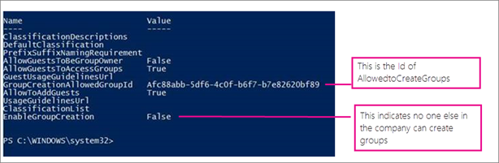

# <a name="manage-who-can-create-microsoft-365-groups"></a><span data-ttu-id="55d43-103">Hantera vilka som kan skapa Microsoft 365 Grupper</span><span class="sxs-lookup"><span data-stu-id="55d43-103">Manage who can create Microsoft 365 Groups</span></span>

<span data-ttu-id="55d43-104">Som standard kan alla användare skapa Microsoft 365-grupper.</span><span class="sxs-lookup"><span data-stu-id="55d43-104">By default, all users can create Microsoft 365 groups.</span></span> <span data-ttu-id="55d43-105">Det här är den rekommenderade metoden eftersom den gör att användarna kan börja samarbeta utan att behöva hjälp från IT-</span><span class="sxs-lookup"><span data-stu-id="55d43-105">This is the recommended approach because it allows users to start collaborating without requiring assistance from IT.</span></span>

<span data-ttu-id="55d43-106">Om ditt företag kräver att du begränsar vem som kan skapa grupper kan du begränsa skapandet av Microsoft 365-grupper till medlemmar i en viss Microsoft 365-grupp eller säkerhetsgrupp.</span><span class="sxs-lookup"><span data-stu-id="55d43-106">If your business requires that you restrict who can create groups, you can restrict Microsoft 365 Group creation to the members of a particular Microsoft 365 group or security group.</span></span>

<span data-ttu-id="55d43-107">Om du är orolig för användare som skapar team eller grupper som inte uppfyller dina affärsstandarder kan du överväga att kräva att användare slutför en kurs och sedan lägger till dem i gruppen med tillåtna användare.</span><span class="sxs-lookup"><span data-stu-id="55d43-107">If you're concerned about users creating teams or groups that don't comply with your business standards, consider requiring users to complete a training course and then adding them to the group of allowed users.</span></span>

<span data-ttu-id="55d43-108">När du begränsar vem som kan skapa en grupp påverkar det alla tjänster som är beroende av grupper för åtkomst, inklusive:</span><span class="sxs-lookup"><span data-stu-id="55d43-108">When you limit who can create a group, it affects all services that rely on groups for access, including:</span></span>

- <span data-ttu-id="55d43-109">Outlook</span><span class="sxs-lookup"><span data-stu-id="55d43-109">Outlook</span></span>
- <span data-ttu-id="55d43-110">SharePoint</span><span class="sxs-lookup"><span data-stu-id="55d43-110">SharePoint</span></span>
- <span data-ttu-id="55d43-111">Yammer</span><span class="sxs-lookup"><span data-stu-id="55d43-111">Yammer</span></span>
- <span data-ttu-id="55d43-112">Microsoft Teams</span><span class="sxs-lookup"><span data-stu-id="55d43-112">Microsoft Teams</span></span>
- <span data-ttu-id="55d43-113">Microsoft Stream</span><span class="sxs-lookup"><span data-stu-id="55d43-113">Microsoft Stream</span></span>
- <span data-ttu-id="55d43-114">Planner</span><span class="sxs-lookup"><span data-stu-id="55d43-114">Planner</span></span>
- <span data-ttu-id="55d43-115">Power BI (klassisk)</span><span class="sxs-lookup"><span data-stu-id="55d43-115">Power BI (classic)</span></span>
- <span data-ttu-id="55d43-116">Project för webben/Översikt</span><span class="sxs-lookup"><span data-stu-id="55d43-116">Project for the web / Roadmap</span></span>

<span data-ttu-id="55d43-117">Stegen i den här artikeln hindrar inte medlemmar i vissa roller från att skapa grupper.</span><span class="sxs-lookup"><span data-stu-id="55d43-117">The steps in this article won't prevent members of certain roles from creating Groups.</span></span> <span data-ttu-id="55d43-118">Globala Office 365-administratörer kan skapa grupper via administrationscentret för Microsoft 365, Planner, Exchange och SharePoint Online.</span><span class="sxs-lookup"><span data-stu-id="55d43-118">Office 365 Global admins can create Groups via the Microsoft 365 admin center, Planner, Exchange, and SharePoint Online.</span></span> <span data-ttu-id="55d43-119">Andra roller kan skapa grupper på ett begränsat sätt, som anges nedan.</span><span class="sxs-lookup"><span data-stu-id="55d43-119">Other roles can create Groups via limited means, listed below.</span></span>

- <span data-ttu-id="55d43-120">Exchange-administratör: Administrationscenter för Exchange, Azure AD</span><span class="sxs-lookup"><span data-stu-id="55d43-120">Exchange Administrator: Exchange Admin center, Azure AD</span></span>
- <span data-ttu-id="55d43-121">Partner Tier1-support: Administrationscenter för Microsoft 365, administrationscentret för Exchange, Azure AD</span><span class="sxs-lookup"><span data-stu-id="55d43-121">Partner Tier 1 Support: Microsoft 365 Admin center, Exchange Admin center, Azure AD</span></span>
- <span data-ttu-id="55d43-122">Partner Tier2-support: Administrationscenter för Microsoft 365, administrationscentret för Exchange, Azure AD</span><span class="sxs-lookup"><span data-stu-id="55d43-122">Partner Tier 2 Support: Microsoft 365 Admin center, Exchange Admin center, Azure AD</span></span>
- <span data-ttu-id="55d43-123">Katalogskrivare: Azure AD</span><span class="sxs-lookup"><span data-stu-id="55d43-123">Directory Writers: Azure AD</span></span>
- <span data-ttu-id="55d43-124">SharePoint-administratör: Administrationscenter för SharePoint, Azure AD</span><span class="sxs-lookup"><span data-stu-id="55d43-124">SharePoint Administrator: SharePoint Admin center, Azure AD</span></span>
- <span data-ttu-id="55d43-125">Tjänstadministratör för Teams: Administrationscenter för Teams, Azure AD</span><span class="sxs-lookup"><span data-stu-id="55d43-125">Teams Service Administrator: Teams Admin center, Azure AD</span></span>
- <span data-ttu-id="55d43-126">Användaradministratör: Administrationscenter för Microsoft 365, Azure AD</span><span class="sxs-lookup"><span data-stu-id="55d43-126">User Administrator: Microsoft 365 Admin center, Azure AD</span></span>

<span data-ttu-id="55d43-127">Om du har en av dessa roller kan du skapa Microsoft 365-grupper för begränsade användare och sedan tilldela användaren som gruppens ägare.</span><span class="sxs-lookup"><span data-stu-id="55d43-127">If you're a member of one of these roles, you can create Microsoft 365 Groups for restricted users, and then assign the user as the owner of the group.</span></span>

## <a name="licensing-requirements"></a><span data-ttu-id="55d43-128">Licenskrav</span><span class="sxs-lookup"><span data-stu-id="55d43-128">Licensing requirements</span></span>

<span data-ttu-id="55d43-129">För att hantera vem som skapar grupper behöver följande personer Azure AD Premium-licenser eller Azure AD Basic EDU-licenser tilldelade till sig:</span><span class="sxs-lookup"><span data-stu-id="55d43-129">To manage who creates groups, the following people need Azure AD Premium licenses or Azure AD Basic EDU licenses assigned to them:</span></span>

- <span data-ttu-id="55d43-130">Administratören som konfigurerar inställningarna för att skapa grupper</span><span class="sxs-lookup"><span data-stu-id="55d43-130">The admin who configures these group creation settings</span></span>
- <span data-ttu-id="55d43-131">Medlemmar i gruppen som har tillåtelse att skapa grupper</span><span class="sxs-lookup"><span data-stu-id="55d43-131">The members of the group who are allowed to create groups</span></span>

> [!NOTE]
> <span data-ttu-id="55d43-132">Mer [information om hur du tilldelar Azure-licenser finns](/azure/active-directory/fundamentals/license-users-groups) i Tilldela eller ta bort licenser i Azure Active Directory-portalen.</span><span class="sxs-lookup"><span data-stu-id="55d43-132">See [Assign or remove licenses in the Azure Active Directory portal](/azure/active-directory/fundamentals/license-users-groups) for more details about how to assign Azure licenses.</span></span>

<span data-ttu-id="55d43-133">Följande personer behöver inte tilldelas Azure AD Premium- eller Azure AD Basic EDU-licenser:</span><span class="sxs-lookup"><span data-stu-id="55d43-133">The following people don't need Azure AD Premium or Azure AD Basic EDU licenses assigned to them:</span></span>

- <span data-ttu-id="55d43-134">Personer som är medlemmar i Microsoft 365-grupper och som inte har möjlighet att skapa andra grupper.</span><span class="sxs-lookup"><span data-stu-id="55d43-134">People who are members of Microsoft 365 groups and who don't have the ability to create other groups.</span></span>

## <a name="step-1-create-a-group-for-users-who-need-to-create-microsoft-365-groups"></a><span data-ttu-id="55d43-135">Steg 1: Skapa en grupp för användare som behöver skapa Microsoft 365-grupper</span><span class="sxs-lookup"><span data-stu-id="55d43-135">Step 1: Create a group for users who need to create Microsoft 365 groups</span></span>

<span data-ttu-id="55d43-136">Endast en grupp i organisationen kan användas för att styra vem som kan skapa grupper.</span><span class="sxs-lookup"><span data-stu-id="55d43-136">Only one group in your organization can be used to control who is able to create Groups.</span></span> <span data-ttu-id="55d43-137">Du kan däremot kapsla in andra grupper som medlemmar i den här gruppen.</span><span class="sxs-lookup"><span data-stu-id="55d43-137">But, you can nest other groups as members of this group.</span></span>

<span data-ttu-id="55d43-138">Administratörer i de roller som anges ovan behöver inte vara medlemmar i den här gruppen: de behåller sin förmåga att skapa grupper.</span><span class="sxs-lookup"><span data-stu-id="55d43-138">Admins in the roles listed above do not need to be members of this group: they retain their ability to create groups.</span></span>

1. <span data-ttu-id="55d43-139">Gå till sidan Grupper i [administrationscentret.](https://admin.microsoft.com/adminportal/home#/groups)</span><span class="sxs-lookup"><span data-stu-id="55d43-139">In the admin center, go to the [Groups page](https://admin.microsoft.com/adminportal/home#/groups).</span></span>

2. <span data-ttu-id="55d43-140">Klicka på Lägg **till en grupp.**</span><span class="sxs-lookup"><span data-stu-id="55d43-140">Click on **Add a Group**.</span></span>

3. <span data-ttu-id="55d43-141">Välj den grupptyp du vill använda.</span><span class="sxs-lookup"><span data-stu-id="55d43-141">Choose the group type you want.</span></span> <span data-ttu-id="55d43-142">Kom ihåg namnet på gruppen!</span><span class="sxs-lookup"><span data-stu-id="55d43-142">Remember the name of the group!</span></span> <span data-ttu-id="55d43-143">Du behöver det senare.</span><span class="sxs-lookup"><span data-stu-id="55d43-143">You'll need it later.</span></span>

4. <span data-ttu-id="55d43-144">Konfigurera gruppen och lägg till personer eller andra grupper som du vill ska kunna skapa grupper i organisationen.</span><span class="sxs-lookup"><span data-stu-id="55d43-144">Finish setting up the group, adding people or other groups who you want to be able to create groups in your org.</span></span>

<span data-ttu-id="55d43-145">Detaljerade instruktioner finns i [Skapa, redigera eller ta bort en säkerhetsgrupp i administrationscentret för Microsoft 365.](../admin/email/create-edit-or-delete-a-security-group.md)</span><span class="sxs-lookup"><span data-stu-id="55d43-145">For detailed instructions, see [Create, edit, or delete a security group in the Microsoft 365 admin center](../admin/email/create-edit-or-delete-a-security-group.md).</span></span>

## <a name="step-2-run-powershell-commands"></a><span data-ttu-id="55d43-146">Steg 2: Kör PowerShell-kommandon</span><span class="sxs-lookup"><span data-stu-id="55d43-146">Step 2: Run PowerShell commands</span></span>

<span data-ttu-id="55d43-147">Du måste använda förhandsversionen av [Azure Active Directory PowerShell för Graph (AzureAD) (modulnamn](/powershell/azure/active-directory/install-adv2) **AzureADPreview**) om du vill ändra inställningen för gäståtkomst på gruppnivå:</span><span class="sxs-lookup"><span data-stu-id="55d43-147">You must use the preview version of [Azure Active Directory PowerShell for Graph (AzureAD)](/powershell/azure/active-directory/install-adv2) (module name **AzureADPreview**) to change the group-level guest access setting:</span></span>

- <span data-ttu-id="55d43-148">Om du inte har installerat någon version av Azure AD PowerShell-modulen tidigare, se Installera [Azure AD-modulen](/powershell/azure/active-directory/install-adv2?preserve-view=true&view=azureadps-2.0-preview) och följ anvisningarna för att installera den offentliga förhandsversionen.</span><span class="sxs-lookup"><span data-stu-id="55d43-148">If you haven't installed any version of the Azure AD PowerShell module before, see [Installing the Azure AD Module](/powershell/azure/active-directory/install-adv2?preserve-view=true&view=azureadps-2.0-preview) and follow the instructions to install the public preview release.</span></span>

- <span data-ttu-id="55d43-149">Om du har den 2.0 allmänt tillgängliga versionen av Azure AD PowerShell-modulen (AzureAD) installerad måste du avinstallera den genom att köra den i PowerShell-sessionen och sedan installera förhandsversionen genom att köra `Uninstall-Module AzureAD` `Install-Module AzureADPreview` .</span><span class="sxs-lookup"><span data-stu-id="55d43-149">If you have the 2.0 general availability version of the Azure AD PowerShell module (AzureAD) installed, you must uninstall it by running `Uninstall-Module AzureAD` in your PowerShell session, and then install the preview version by running `Install-Module AzureADPreview`.</span></span>

- <span data-ttu-id="55d43-150">Om du redan har installerat förhandsgranskningsversionen kör `Install-Module AzureADPreview` du för att kontrollera att det är den senaste versionen av den här modulen.</span><span class="sxs-lookup"><span data-stu-id="55d43-150">If you have already installed the preview version, run `Install-Module AzureADPreview` to make sure it's the latest version of this module.</span></span>

<span data-ttu-id="55d43-151">Kopiera skriptet nedan till en textredigerare som Anteckningar eller [Windows PowerShell ISE](/powershell/scripting/components/ise/introducing-the-windows-powershell-ise).</span><span class="sxs-lookup"><span data-stu-id="55d43-151">Copy the script below into a text editor, such as Notepad, or the [Windows PowerShell ISE](/powershell/scripting/components/ise/introducing-the-windows-powershell-ise).</span></span>

<span data-ttu-id="55d43-152">Ersätt *\<GroupName\>* med namnet på gruppen du skapade.</span><span class="sxs-lookup"><span data-stu-id="55d43-152">Replace *\<GroupName\>* with the name of the group that you created.</span></span> <span data-ttu-id="55d43-153">Till exempel:</span><span class="sxs-lookup"><span data-stu-id="55d43-153">For example:</span></span>

`$GroupName = "Group Creators"`

<span data-ttu-id="55d43-154">Spara filen som GroupCreators.ps1.</span><span class="sxs-lookup"><span data-stu-id="55d43-154">Save the file as GroupCreators.ps1.</span></span>

<span data-ttu-id="55d43-155">I PowerShell-fönstret går du till den plats där du sparade filen (skriv <FileLocation> "CD").</span><span class="sxs-lookup"><span data-stu-id="55d43-155">In the PowerShell window, navigate to the location where you saved the file (type "CD <FileLocation>").</span></span>

<span data-ttu-id="55d43-156">Kör skriptet genom att skriva:</span><span class="sxs-lookup"><span data-stu-id="55d43-156">Run the script by typing:</span></span>

`.\GroupCreators.ps1`

<span data-ttu-id="55d43-157">och [logga in med ditt administratörskonto när](../enterprise/connect-to-microsoft-365-powershell.md#step-2-connect-to-azure-ad-for-your-microsoft-365-subscription) du uppmanas att göra det.</span><span class="sxs-lookup"><span data-stu-id="55d43-157">and [sign in with your administrator account](../enterprise/connect-to-microsoft-365-powershell.md#step-2-connect-to-azure-ad-for-your-microsoft-365-subscription) when prompted.</span></span>

```PowerShell
$GroupName = "<GroupName>"
$AllowGroupCreation = $False

Connect-AzureAD

$settingsObjectID = (Get-AzureADDirectorySetting | Where-object -Property Displayname -Value "Group.Unified" -EQ).id
if(!$settingsObjectID)
{
    $template = Get-AzureADDirectorySettingTemplate | Where-object {$_.displayname -eq "group.unified"}
    $settingsCopy = $template.CreateDirectorySetting()
    New-AzureADDirectorySetting -DirectorySetting $settingsCopy
    $settingsObjectID = (Get-AzureADDirectorySetting | Where-object -Property Displayname -Value "Group.Unified" -EQ).id
}

$settingsCopy = Get-AzureADDirectorySetting -Id $settingsObjectID
$settingsCopy["EnableGroupCreation"] = $AllowGroupCreation

if($GroupName)
{
  $settingsCopy["GroupCreationAllowedGroupId"] = (Get-AzureADGroup -SearchString $GroupName).objectid
}
 else {
$settingsCopy["GroupCreationAllowedGroupId"] = $GroupName
}
Set-AzureADDirectorySetting -Id $settingsObjectID -DirectorySetting $settingsCopy

(Get-AzureADDirectorySetting -Id $settingsObjectID).Values
```

<span data-ttu-id="55d43-158">Den sista raden i skriptet visar de uppdaterade inställningarna:</span><span class="sxs-lookup"><span data-stu-id="55d43-158">The last line of the script will display the updated settings:</span></span>



<span data-ttu-id="55d43-160">Om du senare vill ändra vilken grupp som används kan du köra skriptet igen med namnet på den nya gruppen.</span><span class="sxs-lookup"><span data-stu-id="55d43-160">If in the future you want to change which group is used, you can rerun the script with the name of the new group.</span></span>

<span data-ttu-id="55d43-161">Om du vill inaktivera begränsningen för att skapa grupper och återigen tillåta alla användare att skapa grupper anger du $GroupName till "" och $AllowGroupCreation till "True" och kör skriptet igen.</span><span class="sxs-lookup"><span data-stu-id="55d43-161">If you want to turn off the group creation restriction and again allow all users to create groups, set $GroupName to "" and $AllowGroupCreation to "True" and rerun the script.</span></span>

## <a name="step-3-verify-that-it-works"></a><span data-ttu-id="55d43-162">Steg 3: Kontrollera att det fungerar</span><span class="sxs-lookup"><span data-stu-id="55d43-162">Step 3: Verify that it works</span></span>

<span data-ttu-id="55d43-163">Det kan ta trettio minuter eller mer innan ändringarna har verkställs.</span><span class="sxs-lookup"><span data-stu-id="55d43-163">Changes can take thirty minutes or more to take effect.</span></span> <span data-ttu-id="55d43-164">Du kan kontrollera de nya inställningarna genom att göra följande:</span><span class="sxs-lookup"><span data-stu-id="55d43-164">You can verify the new settings by doing the following:</span></span>

1. <span data-ttu-id="55d43-165">Logga in på Microsoft 365 med ett användarkonto för någon som INTE ska ha möjlighet att skapa grupper.</span><span class="sxs-lookup"><span data-stu-id="55d43-165">Sign in to Microsoft 365 with a user account of someone who should NOT have the ability to create groups.</span></span> <span data-ttu-id="55d43-166">De är då inte medlemmar i gruppen du skapade eller en administratör.</span><span class="sxs-lookup"><span data-stu-id="55d43-166">That is, they are not a member of the group you created or an administrator.</span></span>

2. <span data-ttu-id="55d43-167">Välj **panelen Planner.**</span><span class="sxs-lookup"><span data-stu-id="55d43-167">Select the **Planner** tile.</span></span>

3. <span data-ttu-id="55d43-168">I Planner väljer du **Ny plan i** det vänstra navigeringsfältet för att skapa en plan.</span><span class="sxs-lookup"><span data-stu-id="55d43-168">In Planner, select **New Plan** in the left navigation to create a plan.</span></span>

4. <span data-ttu-id="55d43-169">Du bör få ett meddelande om att plan och skapande av grupper är inaktiverat.</span><span class="sxs-lookup"><span data-stu-id="55d43-169">You should get a message that plan and group creation is disabled.</span></span>

<span data-ttu-id="55d43-170">Prova samma procedur igen när du är medlem i gruppen.</span><span class="sxs-lookup"><span data-stu-id="55d43-170">Try the same procedure again with a member of the group.</span></span>

> [!NOTE]
> <span data-ttu-id="55d43-171">Om medlemmar i gruppen inte kan skapa grupper kontrollerar du att de inte blockeras av sin [OWA-postlådeprincip.](/powershell/module/exchange/set-owamailboxpolicy)</span><span class="sxs-lookup"><span data-stu-id="55d43-171">If members of the group aren't able to create groups, check that they aren't being blocked through their [OWA mailbox policy](/powershell/module/exchange/set-owamailboxpolicy).</span></span>

## <a name="related-topics"></a><span data-ttu-id="55d43-172">Relaterade ämnen</span><span class="sxs-lookup"><span data-stu-id="55d43-172">Related topics</span></span>

[<span data-ttu-id="55d43-173">Planering av samarbetsstyrning steg för steg</span><span class="sxs-lookup"><span data-stu-id="55d43-173">Collaboration governance planning step-by-step</span></span>](collaboration-governance-overview.md#collaboration-governance-planning-step-by-step)

[<span data-ttu-id="55d43-174">Skapa din plan för samarbetesstyrning</span><span class="sxs-lookup"><span data-stu-id="55d43-174">Create your collaboration governance plan</span></span>](collaboration-governance-first.md)

[<span data-ttu-id="55d43-175">Komma igång med Office 365 PowerShell</span><span class="sxs-lookup"><span data-stu-id="55d43-175">Getting started with Office 365 PowerShell</span></span>](../enterprise/getting-started-with-microsoft-365-powershell.md)

[<span data-ttu-id="55d43-176">Konfigurera grupphantering med självbetjäning i Azure Active Directory</span><span class="sxs-lookup"><span data-stu-id="55d43-176">Set up self-service group management in Azure Active Directory</span></span>](/azure/active-directory/users-groups-roles/groups-self-service-management)

[<span data-ttu-id="55d43-177">Set-ExecutionPolicy</span><span class="sxs-lookup"><span data-stu-id="55d43-177">Set-ExecutionPolicy</span></span>](/powershell/module/microsoft.powershell.security/set-executionpolicy)

[<span data-ttu-id="55d43-178">Azure Active Directory-cmdlets för konfiguration av gruppinställningar</span><span class="sxs-lookup"><span data-stu-id="55d43-178">Azure Active Directory cmdlets for configuring group settings</span></span>](/azure/active-directory/users-groups-roles/groups-settings-cmdlets)
