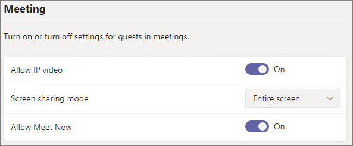
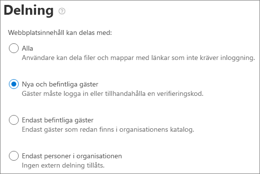

# Inställningar för gästdelning i Microsoft 365Microsoft 365 guest sharing settings reference

I den här artikeln beskrivs de olika inställningarna som kan påverka delning med personer utanför organisationen för Microsoft 365-arbetsbelastningar: Teams, Microsoft-grupper, SharePoint och OneDrive.This article provides a reference for the various settings that can affect sharing with people outside your organization for the Microsoft 365 workloads: Teams, Microsoft 365 Groups, SharePoint, and OneDrive. Dessa inställningar finns i administrationscentret för Azure Active Directory, Microsoft 365, Teams och SharePoint.These settings are located in the Azure Active Directory, Microsoft 365, Teams, and SharePoint admin centers.

## Azure Active DirectoryAzure Active Directory

**Administratörsroll:** Global administratör**Admin role:** Global administrator

Azure Active Directory är den katalogtjänst som används av Microsoft 365.Azure Active Directory is the directory service used by Microsoft 365. Inställningarna för organisationsrelationer i Azure Active Directory påverkar direkt delning i Teams, Microsoft 365-grupper, SharePoint och OneDrive.The Azure Active Directory Organizational relationships settings directly affect sharing in Teams, Microsoft 365 Groups, SharePoint, and OneDrive.

> [!NOTE]
> De här inställningarna påverkar bara SharePoint när [SharePoint- och OneDrive-integrering med Azure AD B2B](/sharepoint/sharepoint-azureb2b-integration-preview) har konfigurerats.These settings only affect SharePoint when [SharePoint and OneDrive integration with Azure AD B2B](/sharepoint/sharepoint-azureb2b-integration-preview) has been configured. I tabellen nedan förutsätts det att den har konfigurerats.The table below assumes that this has been configured.

### Inställningar för externt samarbeteExternal collaboration settings

**Navigering:** [administrationscentret för Azure Active Directory](https://aad.portal.azure.com) > Azure Active Directory > externa identiteter > Inställningar för externt samarbete**Navigation:** [Azure Active Directory admin center](https://aad.portal.azure.com) > Azure Active Directory > External Identities > External collaboration settings

| InställningSetting | StandardDefault | BeskrivningDescription |
|:-----|:-----|:-----|
|GästanvändarbehörighetGuest user access|Gästanvändare har begränsad åtkomst till egenskaper och medlemskap i katalogobjektGuest users have limited access to properties and memberships of directory objects|Avgör vilka [behörigheter som gäster har i Azure Active Directory](/azure/active-directory/fundamentals/users-default-permissions).Determines the [permissions that guests have in Azure Active Directory](/azure/active-directory/fundamentals/users-default-permissions).|
|Inställningar för gästinbjudningGuest invite settings|Alla i organisationen kan bjuda in gästanvändare, inklusive gäster och icke-administratörerAnyone in the organization can invite guest users including guests and non-admins|Avgör om gäster, medlemmar och administratörer kan bjuda in gäster till organisationen.Determines whether guests, members, and admins can invite guests to the organization.   Den här inställningen påverkar Microsoft 365-delningsupplevelser som Team och SharePoint.This setting affects  Microsoft 365 sharing experiences such as Teams and SharePoint.|
|Aktivera självbetjäning för gäster att registrera via användarflödenEnable guest self-service sign up via user flows|NejNo|Fastställer om du kan skapa användarflöden som tillåter att någon registrerar sig för ett program som du har skapat och skapar ett nytt gästkonto.Determines if you can create user flows that allow someone to sign up for an app that you created and create a new guest account.|
|SamarbetsbegränsningarCollaboration restrictions|Tillåt att inbjudningar skickas till alla domänerAllow invitations to be sent to any domain|Med den här inställningen kan du ange en lista över tillåtna eller blockerade domäner för delning.This setting allows you to specify a list of allowed or blocked domains for sharing. När tillåtna domäner anges kan delningsinbjudningar bara skickas till dessa domäner.When allowed domains are specified, then sharing invitations can only be sent to those domains. När blockerade domäner anges kan delningsinbjudningar inte skickas till de domänerna.When denied domains are specified, then sharing invitations cannot be sent to those domains.   Den här inställningen påverkar Microsoft 365-delningsupplevelser som Team och SharePoint.This setting affects  Microsoft 365 sharing experiences such as Teams and SharePoint. Du kan tillåta eller blockera domäner på en mer detaljerad nivå med hjälp av domänfiltrering i SharePoint eller Teams.You can allow or block domains at a more granular level by using domain filtering in SharePoint or Teams.|

Dessa inställningar påverkar hur användare bjuds in till katalogen.These settings affect how users are invited to the directory. De påverkar inte delning med gäster som redan finns i katalogen.They do not affect sharing with guests who are already in the directory.

## Microsoft 365Microsoft 365

**Administratörsroll:** Global administratör**Admin role:** Global administrator

Administrationscenter för Microsoft 365 har inställningar på organisationsnivå för delning och för Microsoft 365-grupper.The Microsoft 365 admin center has organization-level settings for sharing and for Microsoft 365 Groups.

### DelningSharing

**Navigering:** [Administrationscenter för Microsoft 365](https://admin.microsoft.com) > Inställningar > Organisationsinställningar > fliken Säkerhet och sekretess > Delning**Navigation:** [Microsoft 365 admin center](https://admin.microsoft.com) > Settings > Org Settings > Security & privacy tab > Sharing

| InställningSetting | StandardDefault | BeskrivningDescription |
|:-----|:-----|:-----|
|Låt användarna lägga till nya gäster i organisationenLet users add new guests to the organization|PåOn|När du har angett **Ja** kan Azure AD-medlemmar bjuda in gäster via Azure AD. Om du har angett **Nej** kan de inte göra det.When set to **Yes**, Azure AD members can invite guests via Azure AD; when set to **No**, they cannot. När du har angett **Ja** kan Microsoft 365-gruppmedlemmar bjuda in gäster med ägargodkännande. Om du har angett **Nej** kan Microsoft 365-gruppmedlemmar bjuda in gäster med ägargodkännande, men ägarna måste vara globala administratörer för att kunna godkänna.When set to **Yes**, Microsoft 365 Group members can invite guests with owner approval; when set to **No**, Microsoft 365 Group members can invite guests with owner approval but owners must be global administrators to approve.   Observera att **Medlemmar kan bjuda in** gäller medlemmar i Azure AD (inte gäster) och inte webbplats- eller gruppmedlemmar i Microsoft 365.Note that **Members can invite** refers to members in Azure AD (as opposed to guests) and not to site or group members in  Microsoft 365.   Den här motsvarar inställningen **Medlemmar kan bjuda in** i Azure Active Directory för relationer i organisationen.This is identical to the **Members can invite** setting in Azure Active Directory Organizational relationships settings.|

### Microsoft 365-grupperMicrosoft 365 Groups

**Navigering:** [Administrationscenter för Microsoft 365](https://admin.microsoft.com) > Inställningar > Inställningar > Microsoft 365-grupper**Navigation:** [Microsoft 365 admin center](https://admin.microsoft.com) > Settings > Settings > Microsoft 365 Groups

| InställningSetting | StandardDefault | BeskrivningDescription |
|:-----|:-----|:-----|
|Låt gruppmedlemmar utanför organisationen få åtkomst till gruppinnehållLet group members outside your organization access group content|PåOn|När den här inställningen är **På** kan gäster komma åt gruppinnehåll. När den är **Av** kan de inte det.When set to **On**, guests can access groups content; when set to **Off**, they can't. Den här inställningen ska vara **På** i alla situationer där gästanvändare interagerar med Microsoft 365-grupper eller Teams.This setting should be **On** for any scenario where guests are interacting with Microsoft 365 Groups or Teams.|
|Låt gruppägare lägga till personer utanför organisationen i grupperLet group owners add people outside your organization to groups|PåOn|När inställningen är **På** kan ägare av Microsoft 365-grupper eller Teams bjuda in nya gäster till gruppen.When **On**, Owners of Microsoft 365 Groups or Teams can invite new guests to the group. När den är **Av** kan ägare endast bjuda in gäster som redan finns i katalogen.When **Off**, owners can only invite guests who are already in the directory.|

Dessa är inställningar på organisationsnivå.These settings are at the organization level. Mer information om hur du ändrar de här inställningarna på gruppnivå genom att använda PowerShell finns under[Skapa inställningar för en viss grupp](/azure/active-directory/users-groups-roles/groups-settings-cmdlets#create-settings-for-a-specific-group).See [Create settings for a specific group](/azure/active-directory/users-groups-roles/groups-settings-cmdlets#create-settings-for-a-specific-group) for information about how to change these settings at the group level by using PowerShell.

## TeamsTeams

Huvudinställningen för gäståtkomst i Teams **Tillåt gäståtkomst i Teams** måste vara **På** för att övriga gästinställningar ska vara tillgängliga.The Teams master guest access switch, **Allow guest access in Teams**, must be **On** for the other guest settings to be available.

**Administratörsroll:** Teams-tjänstadministratör**Admin role:** Teams service administrator

### GäståtkomstGuest access

**Navigering:** [Administrationscenter för Teams](https://admin.teams.microsoft.com) > Organisationsomfattande inställningar > Gäståtkomst**Navigation:** [Teams admin center](https://admin.teams.microsoft.com) > Org-wide settings > Guest access

| InställningSetting | StandardDefault | BeskrivningDescription |
|:-----|:-----|:-----|
|Tillåt gäståtkomst i TeamsAllow guest access in Teams|AvOff|Övergripande inställning för att aktivera och inaktivera gäståtkomst i Teams.Turns guest access on or off for Teams overall. Det kan ta upp till 24 timmar för den här inställningen att verkställas efter att den har ändrats.This setting can take 24 hours to take effect once changed.|

### GästsamtalGuest calling

**Navigering:** [Administrationscenter för Teams](https://admin.teams.microsoft.com) > Organisationsomfattande inställningar > Gäståtkomst**Navigation:** [Teams admin center](https://admin.teams.microsoft.com) > Org-wide settings > Guest access

| InställningSetting | StandardDefault | BeskrivningDescription |
|:-----|:-----|:-----|
|Ring privata samtalMake private calls|PåOn|När inställningen är **På** kan gäster ringa peer-to-peer-samtal i Teams. När den är **Av** kan de inte göra det.When **On**, guests can make peer-to-peer calls in Teams; when **Off**, they can't.|

### GästmötenGuest meeting

**Navigering:** [Administrationscenter för Teams](https://admin.teams.microsoft.com) > Organisationsomfattande inställningar > Gäståtkomst**Navigation:** [Teams admin center](https://admin.teams.microsoft.com) > Org-wide settings > Guest access

| InställningSetting | StandardDefault | BeskrivningDescription |
|:-----|:-----|:-----|
|Tillåt IP-videoAllow IP video|PåOn|När inställningen är **På** kan gäster använda video i samtal och möten. När den är **Av** kan de inte det.When **On**, guests can use video in their calls and meetings; when **Off**, they can't.|
|SkärmdelningslägeScreen sharing mode|Hela skärmenEntire screen|När inställningen är **Inaktiverad** kan gäster inte dela sina skärmar i Teams.When **Disabled**, guests can't share their screens in Teams. När den är inställd på **Enstaka program** kan gäster bara dela ett program på skärmen.When set to **Single application**, guests can only share a single application on their screen. När den är inställd på **Hela skärmen** kan gäster välja att dela ett program eller hela skärmen.When set to **Entire screen**, guests can choose to share an application or their entire screen.|
|Tillåt möte nuAllow Meet Now|PåOn|När inställningen är **På** kan gäster använda funktionen Möte nu i Teams. När den är **Av** kan de inte det.When **On**, guests can use the Meet Now feature in Teams; when **Off**, they can't.|

### GästmeddelandenGuest messaging

**Navigering:** [Administrationscenter för Teams](https://admin.teams.microsoft.com) > Organisationsomfattande inställningar > Gäståtkomst**Navigation:** [Teams admin center](https://admin.teams.microsoft.com) > Org-wide settings > Guest access

| InställningSetting | StandardDefault | BeskrivningDescription |
|:-----|:-----|:-----|
|Redigera skickade meddelandenEdit sent messages|PåOn|När inställningen är **På** kan gäster redigera meddelanden som de skickat tidigare. När den är **Av** kan de inte göra det.When **On**, guests can edit messages they previously sent; when **Off**, they can't.|
|Ta bort skickade meddelandenDelete sent messages|PåOn|När inställningen är **På** kan gäster ta bort meddelanden som de skickat tidigare. När den är **Av** kan de inte göra det.When **On**, guests can delete messages they previously sent; when **Off**, they can't.|
|ChattChat|PåOn|När inställningen är **På** kan gäster använda chatten i Teams. När den är **Av** kan de inte det.When **On**, guests can use chat in Teams; when **Off**, they can't.|
|Använda Giphys i konversationerUse Giphys in conversations|PåOn|När inställningen är **På** kan gäster använda animerade bilder i konversationer. När den är **Av** kan de inte det.When **On**, guests can use Giphys in conversations; when **Off**, they can't.|
|Klassificering av Giphy-innehållGiphy content rating|MåttligModerate|När inställningen har angetts som **Tillåt allt innehåll** kan gäster infoga alla animerade bilder i chattar, oavsett innehållsklassificering.When set to **Allow all content**, guests will can insert all Giphys in chats, regardless of the content rating. När inställningen har angetts som **Måttlig** kan gäster infoga animerade bilder i chattar, men det finns en måttlig begränsning för innehåll som är olämpligt för barn.When set to **Moderate** guests can insert Giphys in chats, but will be moderately restricted from adult content. När inställningen har angetts som **Strikt** kan gäster infoga animerade bilder i chattar, men de kan inte infoga innehåll som är olämpligt för barn.When set to **Strict** guests can insert Giphys in chats, but will be restricted from inserting adult content.|
|Använda memes i konversationerUse Memes in conversations|PåOn|När inställningen är **På** kan gäster använda memes i konversationer. När den är **Av** kan de inte det.When **On**, guests can use memes in conversations; when **Off**, they can't.|
|Använda dekaler i konversationerUser stickers in conversations|PåOn|När inställningen är **På** kan gäster använda dekaler i konversationer. När den är **Av** kan de inte det.When **On**, guests can use stickers in conversations; when **Off**, they can't.|
|Tillåt avancerade läsare för att visa meddelandenAllow immersive reader for viewing messages|PåOn|När inställningen är **På** kan gäster visa meddelanden i avancerade läsare. När den är **Av** kan de inte det.When **On**, guests can view messages in Immersive Reader; when **Off**, they can't.|

## SharePoint och OneDrive (organisationsnivå)SharePoint and OneDrive (organization-level)

**Administratörsroll:** SharePoint-administrator**Admin role:** SharePoint administrator

De här inställningarna påverkar alla webbplatser i organisationen.These settings affect all of the sites in the organization. De påverkar inte Microsoft 365-grupper eller Teams direkt, men vi rekommenderar att du justerar inställningarna i enlighet med inställningarna för Microsoft 365-grupper och Teams för att undvika användningsproblem.They do not affect Microsoft 365 Groups or Teams directly, however we recommend that you align these settings with the settings for Microsoft 365 Groups and Teams to avoid user experience issues. (Om gästdelning till exempel är tillåtet i Teams men inte i SharePoint, har gästerna i Teams inte åtkomst till fliken Filer eftersom Teams-filer lagras i SharePoint.)(For example, if guest sharing is allowed in Teams but not SharePoint, then guests in Teams will not have access to the Files tab because Teams files are stored in SharePoint.)

### Delningsinställningar för SharePoint och OneDriveSharePoint and OneDrive sharing settings

Eftersom OneDrive är en webbplatshierarki i SharePoint påverkar delningsinställningarna på organisationsnivå OneDrive direkt, precis som för andra SharePoint-webbplatser.Because OneDrive is a hierarchy of sites within SharePoint, the organization-level sharing settings directly affect OneDrive just as they do other SharePoint sites.

**Navigering:** Administrationscenter för SharePoint > Delning**Navigation:** SharePoint admin center > Sharing

| InställningSetting | StandardDefault | BeskrivningDescription |
|:-----|:-----|:-----|
|SharePointSharePoint|AllaAnyone|De mest tillåtande delningsbehörigheterna för SharePoint-webbplatser.Specifies the most permissive sharing permissions allowed for SharePoint sites.|
|OneDriveOneDrive|AllaAnyone|De mest tillåtande delningsbehörigheterna för OneDrive-webbplatser.Specifies the most permissive sharing permissions allowed for OneDrive sites. Den här inställningen kan inte vara mer tillåtande än SharePoint-inställningen.This setting cannot be more permissive than the SharePoint setting.|

### Avancerade delningsinställningar för SharePoint och OneDriveSharePoint and OneDrive advanced sharing settings

**Navigering:** Administrationscenter för SharePoint > Delning**Navigation:** SharePoint admin center > Sharing

| InställningSetting | StandardDefault | BeskrivningDescription |
|:-----|:-----|:-----|
|Begränsa extern delning per domänLimit external sharing by domain|AvOff|Med den här inställningen kan du ange en lista över tillåtna eller blockerade domäner för delning.This setting allows you to specify a list of allowed or blocked domains for sharing. När tillåtna domäner anges kan delningsinbjudningar bara skickas till dessa domäner.When allowed domains are specified, then sharing invitations can only be sent to those domains. När blockerade domäner anges kan delningsinbjudningar inte skickas till de domänerna.When denied domains are specified, then sharing invitations cannot be sent to those domains.   Den här inställningen påverkar alla SharePoint- och OneDrive-webbplatser i organisationen.This setting affects all SharePoint and OneDrive sites in the organization.|
|Gäster måste logga in med det konto som delningsinbjudningar skickas tillGuests must sign in using the same account to which sharing invitations are sent|AvOff|Hindrar gäster från att acceptera inbjudningar till webbplatsdelningar med en annan e-postadress än den som inbjudan skickades till.Prevents guests from redeeming site sharing invitations using a different email address than the invitation was sent to.  [SharePoint- och OneDrive-integrering med Azure AD B2B (förhandsversion)](/sharepoint/sharepoint-azureb2b-integration-preview) använder inte den här inställningen eftersom alla gäster läggs till i katalogen utifrån den e-postadress som inbjudan skickades till.[SharePoint and OneDrive integration with Azure AD B2B (Preview)](/sharepoint/sharepoint-azureb2b-integration-preview) does not use this setting because all guests are added to the directory based on the email address that the invitation was sent to. Det går inte att komma åt webbplatsen med alternativa e-postadresser.Alternate email addresses cannot be used to access the site.|
|Tillåt gäster att dela objekt som de inte ägerAllow guests to share items they don't own|PåOn|När inställningen är **På** kan gäster dela objekt som de inte äger med andra användare eller gäster. När den är **Av** kan de inte det.When **On**, guests can share items that they don't own with other users or guests; when **Off** they cannot. Gäster kan alltid dela objekt som de har fullständig kontroll över.Guests can always share items for which they have full control.|

### Inställningar för fil- och mapplänkar för SharePoint och OneDriveSharePoint and OneDrive file and folder link settings

När filer och mappar delas i SharePoint och OneDrive får delningsmottagare en länk med behörighet till filen eller mappen i stället för att få direktåtkomst till filen eller mappen.When files and folders are shared in SharePoint and OneDrive, sharing recipients are sent a link with permissions to the file or folder rather than being granted direct access to the file or folder themselves. Det finns flera typer av länkar och du kan välja vilken standardtyp för länkar som ska visas för användare när de delar en fil eller mapp.Several types of links are available, and you can choose the default link type presented to users when they share a file or folder. Du kan också ange behörigheter och förfalloalternativ för *Alla*-länkar.You can also set permissions and expiration options for *Anyone* links.

**Navigering:** Administrationscenter för SharePoint > Delning**Navigation:** SharePoint admin center > Sharing

| InställningSetting | StandardDefault | BeskrivningDescription |
|:-----|:-----|:-----|
|Fil- och mapplänkarFile and folder links|Alla som har länkenAnyone with the link|Anger vilken delningslänk som visas som standard när en användare delar en fil eller mapp.Specifies which sharing link is shown by default when a user shares a file or folder. Användare kan ändra alternativet innan de delar.Users can change the option before sharing if they want. Om standardinställningen är **Alla som har länken** och *Alla* är delning inte tillåten för en viss webbplats, och **Endast personer i din organisation** visas som standard för den webbplatsen.If the default is set to **Anyone with the link** and *Anyone* sharing is not allowed for a given site, then **Only people in your organization** will be shown as the default for that site.|
|Länkarna måste upphöra att gälla inom så här många dagarThese links must expire within this many days|Av (upphör inte)Off (no expiration)|*Alla*-länken upphör efter det angivna antalet dagar efter att den har skapats.Specifies the number of days after an *Anyone* link is created that it expires. Länkar som har upphört kan inte förnyas.Expired links cannot be renewed. Skapa en ny länk om du vill fortsätta att dela efter förfallotiden.Create a new link if you need to continue sharing past the expiration.|
|FilbehörigheterFile permissions|Visa och redigeraView and edit|Anger filbehörighetsnivåer som är tillgängliga för användare när de skapar en *Alla*-länk.Specifies the file permission levels available to users when creating an *Anyone* link. Om **Visa** har valts kan användare bara skapa *Alla*-fillänkar med visningsbehörigheter.If **View** is selected, then users can only create *Anyone* file links with view permissions. Om **Visa och redigera** har valts kan användare välja mellan behörigheter för att visa och visa och redigera när de skapar länken.If **View, and edit** is selected, then users can choose between view and view and edit permissions when they create the link.|
|MappbehörigheterFolder permissions|Visa, redigera och ladda uppView, edit, and upload|Anger mappbehörighetsnivåer som är tillgängliga för användare när de skapar en *Alla*-länk.Specifies the folder permission levels available to users when creating an *Anyone* link. Om **Visa** har valts kan användare bara skapa *Alla*-mapplänkar med visningsbehörigheter.If **View** is selected, then users can only create *Anyone* folder links with view permissions. Om **Visa, redigera och ladda upp** har valts kan användare välja mellan behörigheter för att visa och visa, redigera och ladda upp när de skapar länken.If **View, edit, and upload** is selected, then users can choose between view and view, edit, and upload permissions when they creat the link.|

### Inställningar för säkerhetsgrupper i SharePoint och OneDriveSharePoint and OneDrive security group settings

Om du vill begränsa vilka som kan dela med gäster i SharePoint och OneDrive begränsar du delning till personer i särskilda säkerhetsgrupper.If you want to limit who can share with guests in SharePoint and OneDrive, you can do so by limiting sharing to people in specified security groups. De här inställningarna påverkar inte delning via Microsoft 365-grupper eller Teams.These settings do not affect sharing via Microsoft 365 Groups or Teams. Gäster som bjuds in via en grupp eller Teams har också åtkomst till den associerade webbplatsen, men dokument- och mappdelning kan endast göras av personer i de angivna säkerhetsgrupperna.Guests invited via a group or team would also have access to the associated site, though document and folder sharing could only be done by people in the specified security groups.

**Navigering:** Administrationscenter för SharePoint > Delning > Begränsa extern delning till specifika säkerhetsgrupper**Navigation:** SharePoint admin center > Sharing > Limit external sharing to specific security groups

| InställningSetting | StandardDefault | BeskrivningDescription |
|:-----|:-----|:-----|
|Tillåt endast användare i valda säkerhetsgrupper att dela med autentiserade externa användareLet only users in selected security groups share with authenticated external users|AvOff|När **På** kan bara personer i de angivna säkerhetsgrupperna dela med personer utanför organisationen.When **On**, only the people in the specified security groups can share with people outside the organization. Bara länkar för *Vissa personer* är tillgängliga.Only *Specific people* links are available. Delning med *Alla* inaktiveras, såvida inte **Tillåt endast användare i valda säkerhetsgrupper att dela med autentiserade användare och med hjälp av anonyma länkar** också är **På***Anyone* sharing is effectively disabled unless **Let only users in selected security groups share with authenticated external users and using anonymous links** is also **On**|
|Tillåt endast användare i valda säkerhetsgrupper att dela med autentiserade användare och med hjälp av anonyma länkarLet only users in selected security groups share with authenticated external users and using anonymous links|AvOff|När inställningen är **På** kan bara personerna i de angivna säkerhetsgrupperna dela med gäster.When **On**, only the people in the specified security groups can share with guests. Både länkar för *Alla* och *Vissa personer* är tillgängliga.Both *Anyone* and *Specific people* links are available.|

Båda inställningarna kan användas samtidigt.Both of these settings can be used at the same time. Om en användare ingår i säkerhetsgrupper som angetts för båda inställningarna, kommer den högre behörighetsnivån att gälla (*Alla* plus *Vissa användare*).If a user is in security groups specified for both settings, then the greater permission level prevails (*Anyone* plus *Specific user*). Kapslade säkerhetsgrupper stöds.Nested security groups are supported.

## SharePoint (webbplatsnivå)SharePoint (site level)

**Administratörsroll:** SharePoint-administrator**Admin role:** SharePoint administrator

Eftersom de här inställningarna åsidosätts av inställningarna för hela organisationen för SharePoint, kan inställningen för webbplatsdelning ändras om någon inställning på organisationsnivå ändras.Because these settings are subject to the organization-wide settings for SharePoint, the effective sharing setting for the site may change if the organization-level setting changes. Om du väljer en inställning här och inställningen på organisationsnivå ställs in senare på ett mer begränsat värde, kommer den här webbplatsen att fungera enligt det mer begränsade värdet.If you choose a setting here and the organization-level is later set to a more restrictive value, then this site will operate at that more restrictive value. Om du till exempel väljer **Alla** och inställningen på organisationsnivå ställs in senare på **Nya och befintliga gäster** kommer webbplatsen bara att tillåta nya och befintliga gäster.For example, if you choose **Anyone** and the organization-level setting is later set to **New and existing guests**, then this site will only allow new and existing guests. Om inställningen på organisationsnivå ställs in på **Alla** kan webbplatsen återigen tillåta *Alla*-länkar.If the organization-level setting is then set back to **Anyone**, this site would again allow *Anyone* links.

### WebbplatsdelningSite sharing

Du kan ange behörigheter för gästdelning för varje webbplats i SharePoint.You can set guest sharing permissions for each site in SharePoint. Den här inställningen gäller både webbplatsdelning och delning av filer och mappar.This setting applies to both site sharing and file and folder sharing. (*Alla*-delning är inte tillgänglig för webbplatsdelning.(*Anyone* sharing is not available for site sharing. Om du väljer **Alla** kan användarna dela filer och mappar genom att använda *Alla*-länkar och webbplatsen med nya och befintliga gäster.)If you choose **Anyone**, users will be able to share files and folders by using *Anyone* links, and the site itself with new and existing guests.)

Om webbplatsen har en känslighetsetikett kan den etiketten styra de externa delningsinställningarna.If the site has a sensitivity label applied, that label may control the external sharing settings. Mer information finns i [Använd känslighetsetiketter för att skydda innehåll i Microsoft Teams, Microsoft 365-grupper och SharePoint-webbplatser](../compliance/sensitivity-labels-teams-groups-sites.md).For more information, see [Use sensitivity labels to protect content in Microsoft Teams, Microsoft 365 groups, and SharePoint sites](../compliance/sensitivity-labels-teams-groups-sites.md).

**Navigering:** Administrationscenter för SharePoint > Aktiva webbplatser > välj webbplats > fliken Principer > Redigera extern delning**Navigation:** SharePoint admin center > Active sites > select the site > Policies tab > Edit External sharing

| InställningSetting | StandardDefault | BeskrivningDescription |
|:-----|:-----|:-----|
|Webbplatsinnehåll kan delas medSite content can be shared with|Varierar efter webbplatstyp (se tabellen nedan)Varies by site type (see the table below)|Anger vilken typ av extern delning som tillåts för webbplatsen.Indicates the type of external sharing allowed for this site. Alternativ som är tillgängliga här åsidosätts av delningsinställningarna på organisationsnivå för SharePoint.Options available here are subject to the organization-level sharing settings for SharePoint.|

### Webbplatsinställningar för fil- och mapplänkSite file and folder link settings

Du kan ange standardinställningar för länktyp och behörigheter samt förfalloinställningar för *Alla*-länkar för varje webbplats.You can set defaults for link type and permissions, and expiration settings for *Anyone* links for each site. När inställningarna anges på webbplatsnivå kan de åsidosättas av inställningarna på organisationsnivå.When set at the site level, these settings override the organization-level settings. Tänk på att om *Alla*-länkar inaktiveras på organisationsnivå blir inte *Alla* en tillgänglig länktyp på webbplatsnivå.Note that if *Anyone* links are disabled at the organization level, *Anyone* will not be an available link type at the site level.

**Navigering:** Administrationscenter för SharePoint > Aktiva webbplatser > välj webbplats > fliken Principer > Redigera extern delning**Navigation:** SharePoint admin center > Active sites > select the site > Policies tab > Edit External sharing

| InställningSetting | StandardDefault | BeskrivningDescription |
|:-----|:-----|:-----|
|Begränsa delning per domänLimit sharing by domain|AvOff|Med den här inställningen kan du ange en lista över tillåtna eller blockerade domäner för delning.This setting allows you to specify a list of allowed or blocked domains for sharing. När tillåtna domäner anges kan delningsinbjudningar bara skickas till dessa domäner.When allowed domains are specified, then sharing invitations can only be sent to those domains. När blockerade domäner anges kan delningsinbjudningar inte skickas till de domänerna.When denied domains are specified, then sharing invitations cannot be sent to those domains.   Den här inställningen kan inte åsidosätta domänbegränsningar som anges på organisations- eller Azure AD-nivå.This setting cannot be used to override domain restrictions set at the organization or Azure AD level.|
|Standardtyp för delningslänkDefault sharing link type|Samma som inställningarna på organisationsnivåSame as organization-level setting|Med den här inställningen kan du ange standarddelningslänken som visas för användarna på webbplatsen.This setting allows you to specify the default sharing link presented to users in this site. Alternativet *Samma som inställningarna på organisationsnivå* definieras av en kombination av inställningar för delning på organisations- och webbplatsnivå.The *Same as organization-level setting* option is defined by a combination of organization and site sharing settings.|
|Avancerade inställningar för Alla-länkarAdvanced settings for Anyone links|Samma som inställningarna på organisationsnivåSame as organization-level setting|*Alla*-länken upphör efter det angivna antalet dagar efter att den har skapats för en fil på den här webbplatsen.Specifies the number of days after an *Anyone* link is created for a file in this site that it expires. Länkar som har upphört kan inte förnyas.Expired links cannot be renewed. Skapa en ny länk om du vill fortsätta att dela efter förfallotiden.Create a new link if you need to continue sharing past the expiration.|
|Standardbehörighet för länkDefault link permission|Samma som inställningarna på organisationsnivåSame as organization-level setting|Med den här inställningen kan du ange standardbehörighet (Visa eller Redigera) för delning av länkar som skapas för filer på webbplatsen.This setting allows you to specify the default permission (View or Edit) for sharing links created for files in this site.|

### Standardinställningar för webbplatsdelningDefault site sharing settings

I tabellen nedan visas standardinställningen för delning för varje webbplatstyp.The table below shows the default sharing setting for each site type.

| WebbplatstypSite type | Standardinställning för delningDefault sharing setting |
|:-----|:-----|
|KlassiskClassic|**Endast personer i organisationen****Only people in your organization**|
|OneDriveOneDrive|**Alla****Anyone**|
|Gruppanslutna webbplatser (inklusive Teams)Group-connected sites (including Teams)|**Nya och befintliga gäster** om inställningen för Microsoft 365-grupper **Låt gruppägare lägga till personer utanför organisationen i grupper** är **På** – annars **Endast befintliga gäster**.**New and existing guests** if the Microsoft 365 Groups setting **Let group owners add people outside the organization to groups** is **On**; otherwise **Existing guests only**|
|KommunikationCommunication|**Endast personer i organisationen****Only people in your organization**|
|Moderna webbplatser utan grupp (#STS3-gruppwebbplats)Modern sites with no group (#STS3 TeamSite)|**Endast personer i organisationen****Only people in your organization**|

> [!NOTE]
> Rotwebbplatsen för kommunikation (tenant-name.sharepoint.com) har standardinställningen **Alla** för delning.The root communication site (tenant-name.sharepoint.com) has a default sharing setting of **Anyone**.

## Se ävenSee also

[Översikt över extern SharePoint- och OneDrive-delningSharePoint and OneDrive external sharing overview](/sharepoint/external-sharing-overview)

[Gäståtkomst i Microsoft TeamsGuest access in Microsoft Teams](/MicrosoftTeams/guest-access)

[Lägga till gäster i Microsoft 365-grupperAdding guests to Microsoft 365 Groups](https://support.office.com/article/bfc7a840-868f-4fd6-a390-f347bf51aff6)
