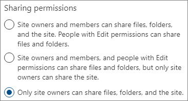

# <a name="limit-sharing-in-microsoft-365"></a><span data-ttu-id="71c2d-103">Begränsa delning i Microsoft 365</span><span class="sxs-lookup"><span data-stu-id="71c2d-103">Limit sharing in Microsoft 365</span></span>

<span data-ttu-id="71c2d-104">Även om du inte kan inaktivera intern delning helt, eller ta bort knappen Dela från webbplatser, finns det flera olika sätt som du kan använda för att begränsa delning i Microsoft 365 för att uppfylla organisationens behov.</span><span class="sxs-lookup"><span data-stu-id="71c2d-104">While you can't disable internal sharing entirely or remove the Share button from sites, there are a variety of ways that you can limit sharing in Microsoft 365 to meet the needs of your organization.</span></span>

<span data-ttu-id="71c2d-105">Olika metoder för att dela filer visas i tabellen nedan.</span><span class="sxs-lookup"><span data-stu-id="71c2d-105">The methods of sharing files are listed in the table below.</span></span> <span data-ttu-id="71c2d-106">Klicka på länken i kolumnen **Delningsmetod** om du vill ha mer information.</span><span class="sxs-lookup"><span data-stu-id="71c2d-106">Click the link in the **Sharing method** column for detailed information.</span></span>

|<span data-ttu-id="71c2d-107">Delningsmetod</span><span class="sxs-lookup"><span data-stu-id="71c2d-107">Sharing method</span></span>|<span data-ttu-id="71c2d-108">Beskrivning</span><span class="sxs-lookup"><span data-stu-id="71c2d-108">Description</span></span>|<span data-ttu-id="71c2d-109">Begränsningsalternativ</span><span class="sxs-lookup"><span data-stu-id="71c2d-109">Limiting options</span></span>|
|:-------------|:----------|:-------------|
|[<span data-ttu-id="71c2d-110">Microsoft 365-grupp eller team</span><span class="sxs-lookup"><span data-stu-id="71c2d-110">Microsoft 365 group or team</span></span>](#microsoft-365-group-or-team)|<span data-ttu-id="71c2d-111">Personer som beviljats åtkomst till ett team i Microsoft Teams eller en grupp i Microsoft 365 har redigeringsbehörighet för filer på den associerade SharePoint-webbplatsen.</span><span class="sxs-lookup"><span data-stu-id="71c2d-111">People granted access to a Microsoft Teams team or Microsoft 365 group have edit access to files in the associated SharePoint site.</span></span>|<span data-ttu-id="71c2d-112">Om gruppen eller teamet är privat skickas delningsinbjudningar för att gå med i gruppen till ägaren för godkännande.</span><span class="sxs-lookup"><span data-stu-id="71c2d-112">If the group or team is private, sharing invitations to join the team go to the owner for approval.</span></span> <span data-ttu-id="71c2d-113">Administratörer kan inaktivera gäståtkomst eller använda känslighetsetikett för att förhindra åtkomst av personer utanför organisationen.</span><span class="sxs-lookup"><span data-stu-id="71c2d-113">Admins can disable guest access or use sensitivity labels to prevent access by people from outside the organization.</span></span>|
|[<span data-ttu-id="71c2d-114">SharePoint-webbplats</span><span class="sxs-lookup"><span data-stu-id="71c2d-114">SharePoint site</span></span>](#sharepoint-site)|<span data-ttu-id="71c2d-115">Personer kan beviljas åtkomst som ägare, medlem eller besökare till en SharePoint-webbplats, och får samma åtkomstnivå till filer på webbplatsen.</span><span class="sxs-lookup"><span data-stu-id="71c2d-115">People can be granted Owner, Member, or Visitor access to a SharePoint site and will have that level of access to files in the site.</span></span>|<span data-ttu-id="71c2d-116">Webbplatsbehörigheter kan begränsas så att bara webbplatsägare kan dela webbplatsen.</span><span class="sxs-lookup"><span data-stu-id="71c2d-116">Site permissions can be restricted so that only site owners can share the site.</span></span> <span data-ttu-id="71c2d-117">Administratörer kan ange att en webbplats ska vara skrivskyddad eller blockera åtkomst helt.</span><span class="sxs-lookup"><span data-stu-id="71c2d-117">Admins can set a site to read-only or block access entirely.</span></span>|
|[<span data-ttu-id="71c2d-118">Dela med vissa personer</span><span class="sxs-lookup"><span data-stu-id="71c2d-118">Sharing with specific people</span></span>](#sharing-with-specific-people)|<span data-ttu-id="71c2d-119">Webbplatsmedlemmar och personer med redigeringsbehörighet kan ge direkt behörighet till filer och mappar eller dela dem med hjälp av länkarna *Vissa personer*.</span><span class="sxs-lookup"><span data-stu-id="71c2d-119">Site members and people with edit permissions can give direct permissions to files and folders or share them by using *Specific people* links.</span></span>|<span data-ttu-id="71c2d-120">Webbplatsbehörigheter kan begränsas så att bara webbplatsägare kan dela filer och mappar.</span><span class="sxs-lookup"><span data-stu-id="71c2d-120">Site permissions can be restricted so that only site owners can share files and folders.</span></span> <span data-ttu-id="71c2d-121">I det här fallet skickas direkt åtkomst och länkdelning för *Vissa personer* från webbplatsmedlemmar till webbplatsägaren för godkännande.</span><span class="sxs-lookup"><span data-stu-id="71c2d-121">In this case, direct access and *Specific people* link sharing by site members goes to site owner for approval.</span></span>|
|[<span data-ttu-id="71c2d-122">SharePoint- och OneDrive-gästdelning</span><span class="sxs-lookup"><span data-stu-id="71c2d-122">SharePoint and OneDrive guest sharing</span></span>](#sharepoint-guest-sharing)|<span data-ttu-id="71c2d-123">SharePoint-webbplatsägare och -medlemmar samt OneDrive-ägare kan dela filer och mappar med personer utanför organisationen.</span><span class="sxs-lookup"><span data-stu-id="71c2d-123">SharePoint site owners and members and OneDrive owners can share files and folders with people outside the organization.</span></span>|<span data-ttu-id="71c2d-124">Gästdelning kan inaktiveras för hela organisationen eller för enskilda webbplatser.</span><span class="sxs-lookup"><span data-stu-id="71c2d-124">Guest sharing can be disabled for the entire organization or for individual sites.</span></span>|
|[<span data-ttu-id="71c2d-125">Delningslänkarna *Personer i din organisation*</span><span class="sxs-lookup"><span data-stu-id="71c2d-125">*People in your organization* sharing links</span></span>](#people-in-your-organization-sharing-links)|<span data-ttu-id="71c2d-126">SharePoint-webbplatsägare och -medlemmar kan dela filer genom att använda länkarna *Personer i din organisation* som fungerar för alla inom organisationen.</span><span class="sxs-lookup"><span data-stu-id="71c2d-126">SharePoint site owners and members can share files using *People in your organization* links, which will work for anyone inside the organization.</span></span>|<span data-ttu-id="71c2d-127">Länkarna *Personer i din organisation* kan inaktiveras på webbplatsnivå.</span><span class="sxs-lookup"><span data-stu-id="71c2d-127">*People in your organization* links can be disabled at the site level.</span></span>|
|[<span data-ttu-id="71c2d-128">Skapa webbplatser, grupper och teams</span><span class="sxs-lookup"><span data-stu-id="71c2d-128">Create sites, groups, and teams</span></span>](#create-sites-groups-and-teams)|<span data-ttu-id="71c2d-129">Som standard kan användare skapa nya webbplatser, grupper och teams som de kan dela innehåll ifrån.</span><span class="sxs-lookup"><span data-stu-id="71c2d-129">By default, users can create new sites, groups, and teams from which they can share content.</span></span>|<span data-ttu-id="71c2d-130">Administratörer kan begränsa vem som kan skapa webbplatser, grupper och teams.</span><span class="sxs-lookup"><span data-stu-id="71c2d-130">Admins can restrict who can create sites, groups, and teams.</span></span>|
|[<span data-ttu-id="71c2d-131">E-post</span><span class="sxs-lookup"><span data-stu-id="71c2d-131">Email</span></span>](#email)|<span data-ttu-id="71c2d-132">Personer som har åtkomst till en fil kan skicka den till andra via e-post.</span><span class="sxs-lookup"><span data-stu-id="71c2d-132">People with access to a file can send it to others via email.</span></span>|<span data-ttu-id="71c2d-133">Administratörer kan kryptera filer med hjälp av känslighetsetiketter för att förhindra att de delas med obehöriga personer.</span><span class="sxs-lookup"><span data-stu-id="71c2d-133">Admins can encrypt files by using sensitivity labels to prevent them being shared with unauthorized people.</span></span>|
|[<span data-ttu-id="71c2d-134">Nedladdning eller filkopia</span><span class="sxs-lookup"><span data-stu-id="71c2d-134">Download or file copy</span></span>](#download-or-file-copy)|<span data-ttu-id="71c2d-135">Personer som har åtkomst till en fil kan ladda ned eller kopiera och dela den med andra som inte omfattas av Microsoft 365.</span><span class="sxs-lookup"><span data-stu-id="71c2d-135">People with access to a file can download or copy it and share it with others outside the scope of Microsoft 365.</span></span>|<span data-ttu-id="71c2d-136">Administratörer kan kryptera filer med hjälp av känslighetsetiketter för att förhindra att de delas med obehöriga personer.</span><span class="sxs-lookup"><span data-stu-id="71c2d-136">Admins can encrypt files by using sensitivity labels to prevent them being shared with unauthorized people.</span></span>|

<span data-ttu-id="71c2d-137">Du kan också begränsa under vilka förhållanden folk kommer åt delat innehåll.</span><span class="sxs-lookup"><span data-stu-id="71c2d-137">You can also restrict the conditions under which people access shared content.</span></span> <span data-ttu-id="71c2d-138">Mer information finns i [villkorlig åtkomst](#conditional-access) senare i den här artikeln.</span><span class="sxs-lookup"><span data-stu-id="71c2d-138">See [conditional access](#conditional-access) later in this article for more information.</span></span>

<span data-ttu-id="71c2d-139">Du kan använda de administratörskontroller som beskrivs i den här artikeln för att begränsa delning i organisationen, men vi rekommenderar att du använder de funktioner för säkerhet och efterlevnad som finns i Microsoft 365 för att skapa en säker delningsmiljö.</span><span class="sxs-lookup"><span data-stu-id="71c2d-139">While you can use the admin controls described in this article to limit sharing in your organization, we highly recommend that you consider using the security and compliance features available in Microsoft 365 to create a secure sharing environment.</span></span> <span data-ttu-id="71c2d-140">Mer information finns i [Filsamarbete i SharePoint med Microsoft 365](/sharepoint/deploy-file-collaboration) och [Konfigurera en team med säkerhetsisolering](secure-teams-security-isolation.md).</span><span class="sxs-lookup"><span data-stu-id="71c2d-140">See [File collaboration in SharePoint with Microsoft 365](/sharepoint/deploy-file-collaboration) and [Configure a team with security isolation](secure-teams-security-isolation.md) for information.</span></span>

<span data-ttu-id="71c2d-141">Om du vill förstå hur delning används i organisationen [kör du en rapport om fil- och mappdelning](/sharepoint/sharing-reports).</span><span class="sxs-lookup"><span data-stu-id="71c2d-141">To understand how sharing is being used in your organization, [run a report on file and folder sharing](/sharepoint/sharing-reports).</span></span>

## <a name="microsoft-365-group-or-team"></a><span data-ttu-id="71c2d-142">Microsoft 365-grupp eller team</span><span class="sxs-lookup"><span data-stu-id="71c2d-142">Microsoft 365 group or team</span></span>

<span data-ttu-id="71c2d-143">Om du vill begränsa delning i en Microsoft 365-grupp eller ett Microsoft Teams-team är det viktigt att du gör gruppen eller teamet privat.</span><span class="sxs-lookup"><span data-stu-id="71c2d-143">If you want to limit sharing in a Microsoft 365 group or Microsoft Teams team, it's important to make the group or team private.</span></span> <span data-ttu-id="71c2d-144">Personer i din organisation kan gå med i en offentlig grupp eller ett team när som helst.</span><span class="sxs-lookup"><span data-stu-id="71c2d-144">People inside your organization can join a public group or team anytime.</span></span> <span data-ttu-id="71c2d-145">Om inte gruppen eller teamet är privat finns det inget sätt att begränsa delningen av gruppen eller dess filer i organisationen.</span><span class="sxs-lookup"><span data-stu-id="71c2d-145">Unless the group or team is private, there's no way to limit sharing of the team or its files within the organization.</span></span>

### <a name="guest-sharing"></a><span data-ttu-id="71c2d-146">Gästdelning</span><span class="sxs-lookup"><span data-stu-id="71c2d-146">Guest sharing</span></span>

<span data-ttu-id="71c2d-147">Om du vill förhindra gäståtkomst i Teams kan du inaktivera gästdelning i administrationscentret för Teams.</span><span class="sxs-lookup"><span data-stu-id="71c2d-147">If you want to prevent guest access in Teams, you can turn off guest sharing in the Teams admin center.</span></span>

<span data-ttu-id="71c2d-148">Inaktivera gästdelning för Teams</span><span class="sxs-lookup"><span data-stu-id="71c2d-148">To turn off guest sharing for Teams</span></span>
1. <span data-ttu-id="71c2d-149">I administrationscentret för Teams expanderar du **Organisationsomfattande inställningar** och klickar sedan på **Gäståtkomst**.</span><span class="sxs-lookup"><span data-stu-id="71c2d-149">In the Teams admin center, expand **Org-wide settings**, and then click **Guest access**.</span></span>
2. <span data-ttu-id="71c2d-150">Inaktivera **Tillåt gäståtkomst i Teams**.</span><span class="sxs-lookup"><span data-stu-id="71c2d-150">Turn off **Allow guest access in Teams**.</span></span>
3. <span data-ttu-id="71c2d-151">Klicka på **Spara**.</span><span class="sxs-lookup"><span data-stu-id="71c2d-151">Click **Save**.</span></span>

<span data-ttu-id="71c2d-152">Om du vill förhindra gäståtkomst i Microsoft 365-grupper kan du inaktivera inställningarna för gäståtkomst för grupper i administrationscentret för Microsoft 365.</span><span class="sxs-lookup"><span data-stu-id="71c2d-152">If you want to prevent guest access in Microsoft 365 Groups, you can turn off the groups guest access settings in the Microsoft 365 admin center.</span></span>

<span data-ttu-id="71c2d-153">Inaktivera gästdelning i Microsoft 365-grupper</span><span class="sxs-lookup"><span data-stu-id="71c2d-153">To turn off guest sharing in Microsoft 365 Groups</span></span>
1. <span data-ttu-id="71c2d-154">I administrationscentret för Microsoft 365 klickar du på **Inställningar** och klickar sedan på **Organisationsinställningar**.</span><span class="sxs-lookup"><span data-stu-id="71c2d-154">In the Microsoft 365 admin center, click **Settings**, and then click **Org Settings**.</span></span>
2. <span data-ttu-id="71c2d-155">På fliken **Tjänster** klickar du på **Microsoft 365-grupper**.</span><span class="sxs-lookup"><span data-stu-id="71c2d-155">On the **Services** tab, click **Microsoft 365 Groups**.</span></span>
3. <span data-ttu-id="71c2d-156">Avmarkera kryssrutorna **Låt gruppmedlemmar utanför organisationen få åtkomst till gruppinnehåll** och **Låt gruppägare lägga till personer utanför organisationen i grupper**.</span><span class="sxs-lookup"><span data-stu-id="71c2d-156">Clear the **Let group members outside your organization access group content** and **Let group owners add people outside your organization to groups** check boxes.</span></span>
4. <span data-ttu-id="71c2d-157">Klicka på **Spara ändringar**.</span><span class="sxs-lookup"><span data-stu-id="71c2d-157">Click **Save changes**.</span></span>

    

> [!NOTE]
> <span data-ttu-id="71c2d-159">Om du vill förhindra gästdelning för en viss grupp eller team kan du göra det med [Microsoft PowerShell](per-group-guest-access.md) eller [känslighetsetiketter](../compliance/sensitivity-labels-teams-groups-sites.md).</span><span class="sxs-lookup"><span data-stu-id="71c2d-159">If you want to prevent guest sharing for a particular group or team, you can do so by using [Microsoft PowerShell](per-group-guest-access.md) or [sensitivity labels](../compliance/sensitivity-labels-teams-groups-sites.md).</span></span>

<span data-ttu-id="71c2d-160">Du kan begränsa gästdelning till användare från vissa domäner genom att tillåta eller blockera domäner i Azure Active Directory.</span><span class="sxs-lookup"><span data-stu-id="71c2d-160">You can limit guest sharing to users from specific domains by allowing or blocking domains in Azure Active Directory.</span></span> <span data-ttu-id="71c2d-161">Detta påverkar även gästdelning i SharePoint om du har aktiverat [SharePoint- och OneDrive-integrering med Azure AD B2B](/sharepoint/sharepoint-azureb2b-integration-preview).</span><span class="sxs-lookup"><span data-stu-id="71c2d-161">This will also affect guest sharing in SharePoint if you have enabled [SharePoint and OneDrive integration with Azure AD B2B](/sharepoint/sharepoint-azureb2b-integration-preview).</span></span>

<span data-ttu-id="71c2d-162">Tillåta delningsinbjudningar endast från angivna domäner</span><span class="sxs-lookup"><span data-stu-id="71c2d-162">To allow sharing invitations only from specified domains</span></span>
1. <span data-ttu-id="71c2d-163">Gå till sidan Översikt i Azure Active Directory och klicka på **Organisationsrelationer**.</span><span class="sxs-lookup"><span data-stu-id="71c2d-163">In Azure Active Directory, on the Overview page, click **Organizational relationships**.</span></span>
2. <span data-ttu-id="71c2d-164">Klicka på **Inställningar**.</span><span class="sxs-lookup"><span data-stu-id="71c2d-164">Click **Settings**.</span></span>
3. <span data-ttu-id="71c2d-165">Under **Samarbetsbegränsningar** väljer du **Neka inbjudningar till de angivna domänerna** eller **Tillåt bara inbjudningar till de angivna domänerna**. Skriv sedan de domäner du vill använda.</span><span class="sxs-lookup"><span data-stu-id="71c2d-165">Under **Collaboration restrictions**, select **Deny invitations to the specified domains** or **Allow invitations only to the specified domains**, and then type the domains that you want to use.</span></span>
4. <span data-ttu-id="71c2d-166">Klicka på **Spara**.</span><span class="sxs-lookup"><span data-stu-id="71c2d-166">Click **Save**.</span></span>

    

## <a name="sharepoint-site"></a><span data-ttu-id="71c2d-168">SharePoint-webbplats</span><span class="sxs-lookup"><span data-stu-id="71c2d-168">SharePoint site</span></span>

<span data-ttu-id="71c2d-169">Du kan begränsa SharePoint-webbplatsdelning till enbart webbplatsägare.</span><span class="sxs-lookup"><span data-stu-id="71c2d-169">You can limit SharePoint site sharing to site owners only.</span></span> <span data-ttu-id="71c2d-170">Det förhindrar att webbplatsmedlemmar delar webbplatsen.</span><span class="sxs-lookup"><span data-stu-id="71c2d-170">This prevents site members from sharing the site.</span></span> <span data-ttu-id="71c2d-171">Kom ihåg att om webbplatsen är ansluten till en Microsoft 365-grupp kan gruppmedlemmar bjuda in andra till gruppen och dessa användare får åtkomst till webbplatsen.</span><span class="sxs-lookup"><span data-stu-id="71c2d-171">Keep in mind that if the site is connected to a Microsoft 365 group, group members can invite others to the group and those users will have site access.</span></span>

<span data-ttu-id="71c2d-172">Begränsa webbplatsdelning till ägare</span><span class="sxs-lookup"><span data-stu-id="71c2d-172">To limit site sharing to owners</span></span>
1. <span data-ttu-id="71c2d-173">Klicka på kugghjulsikonen på webbplatsen och klicka sedan på **Webbplatsbehörigheter**.</span><span class="sxs-lookup"><span data-stu-id="71c2d-173">In the site, click the gear icon, and then click **Site permissions**.</span></span>
2. <span data-ttu-id="71c2d-174">Under **Delningsinställningar** klickar du på **Ändra delningsinställningar**.</span><span class="sxs-lookup"><span data-stu-id="71c2d-174">Under **Sharing settings**, click **Change sharing settings**.</span></span>
3. <span data-ttu-id="71c2d-175">Välj **Webbplatsägare och medlemmar, och personer med redigeringsbehörighet kan dela filer och mappar, men endast webbplatsägare kan dela webbplatsen**.</span><span class="sxs-lookup"><span data-stu-id="71c2d-175">Select **Site owners and members, and people with Edit permissions can share files and folders, but only site owners can share the site**.</span></span>
4. <span data-ttu-id="71c2d-176">Klicka på **Spara**.</span><span class="sxs-lookup"><span data-stu-id="71c2d-176">Click **Save**.</span></span>

    

<span data-ttu-id="71c2d-178">Du kan förhindra användare som inte är medlemmar i webbplatsen från att begära åtkomst genom att inaktivera åtkomstbegäranden.</span><span class="sxs-lookup"><span data-stu-id="71c2d-178">You can prevent users who are not members of the site from requesting access by turning off access requests.</span></span>

<span data-ttu-id="71c2d-179">Inaktivera åtkomstbegäranden</span><span class="sxs-lookup"><span data-stu-id="71c2d-179">To turn off access requests</span></span>
1. <span data-ttu-id="71c2d-180">Klicka på kugghjulsikonen på webbplatsen och klicka sedan på **Webbplatsbehörigheter**.</span><span class="sxs-lookup"><span data-stu-id="71c2d-180">In the site, click the gear icon, and then click **Site permissions**.</span></span>
2. <span data-ttu-id="71c2d-181">Under **Delningsinställningar** klickar du på **Ändra delningsinställningar**.</span><span class="sxs-lookup"><span data-stu-id="71c2d-181">Under **Sharing settings**, click **Change sharing settings**.</span></span>
3. <span data-ttu-id="71c2d-182">Inaktivera **Tillåt åtkomstbegäranden** och klicka sedan på **Spara**.</span><span class="sxs-lookup"><span data-stu-id="71c2d-182">Turn off **Allow access requests**, and then click **Save**.</span></span>

<span data-ttu-id="71c2d-183">Du kan begränsa delning av webbplatser till vissa domäner genom att tillåta eller blockera domäner för den webbplatsen.</span><span class="sxs-lookup"><span data-stu-id="71c2d-183">You can limit site sharing to specific domains by allowing or blocking domains for the site.</span></span>

<span data-ttu-id="71c2d-184">Begränsa webbplatsdelning per domän</span><span class="sxs-lookup"><span data-stu-id="71c2d-184">To limit site sharing by domain</span></span>
1. <span data-ttu-id="71c2d-185">I administrationscentret för SharePoint, under **Webbplatser**, klickar du på **Aktiva webbplatser**.</span><span class="sxs-lookup"><span data-stu-id="71c2d-185">In the SharePoint admin center, under **Sites**, click **Active sites**.</span></span>
2. <span data-ttu-id="71c2d-186">Klicka på den webbplats du vill konfigurera.</span><span class="sxs-lookup"><span data-stu-id="71c2d-186">Click the site that you want to configure.</span></span>
3. <span data-ttu-id="71c2d-187">Klicka på **Redigera** under **Extern delning** på fliken **Principer**.</span><span class="sxs-lookup"><span data-stu-id="71c2d-187">On the **Policies** tab, under **External sharing** click **Edit**.</span></span>
4. <span data-ttu-id="71c2d-188">Under **Avancerade inställningar för extern delning** väljer du **Begränsa delning per domän**.</span><span class="sxs-lookup"><span data-stu-id="71c2d-188">Under **Advanced settings for external sharing**, select the **Limit sharing by domain**.</span></span>
5. <span data-ttu-id="71c2d-189">Lägg till de domäner du vill tillåta eller blockera och klicka sedan på **Spara**.</span><span class="sxs-lookup"><span data-stu-id="71c2d-189">Add the domains that you want to allow or block, and then click **Save**.</span></span>
6. <span data-ttu-id="71c2d-190">Klicka på **Spara**.</span><span class="sxs-lookup"><span data-stu-id="71c2d-190">Click **Save**.</span></span>

    

### <a name="block-access-to-a-site"></a><span data-ttu-id="71c2d-192">Blockera åtkomst till en webbplats</span><span class="sxs-lookup"><span data-stu-id="71c2d-192">Block access to a site</span></span>

<span data-ttu-id="71c2d-193">Du kan blockera åtkomst till en webbplats eller skrivskydda en webbplats genom att ändra webbplatsens låstillstånd.</span><span class="sxs-lookup"><span data-stu-id="71c2d-193">You can block access to a site or make a site read-only by changing the lock state of the site.</span></span> <span data-ttu-id="71c2d-194">Mer information finns i [Låsa och låsa upp webbplatser](/sharepoint/manage-lock-status).</span><span class="sxs-lookup"><span data-stu-id="71c2d-194">For details, see [Lock and unlock sites](/sharepoint/manage-lock-status).</span></span>

### <a name="permissions-inheritance"></a><span data-ttu-id="71c2d-195">Behörighetsarv</span><span class="sxs-lookup"><span data-stu-id="71c2d-195">Permissions inheritance</span></span>

<span data-ttu-id="71c2d-196">Även om det inte rekommenderas, kan du använda [SharePoint behörighetsarv](/sharepoint/what-is-permissions-inheritance) för att anpassa åtkomstnivåer för webbplatser och underwebbplatser.</span><span class="sxs-lookup"><span data-stu-id="71c2d-196">While not recommended, you can use [SharePoint permissions inheritance](/sharepoint/what-is-permissions-inheritance) to customize access levels to sites and subsites.</span></span>

## <a name="sharing-with-specific-people"></a><span data-ttu-id="71c2d-197">Dela med vissa personer</span><span class="sxs-lookup"><span data-stu-id="71c2d-197">Sharing with specific people</span></span>

<span data-ttu-id="71c2d-198">Om du vill begränsa delningen av en webbplats eller dess innehåll, kan du konfigurera webbplatsen så att bara webbplatsägare kan dela filer, mappar och webbplatsen.</span><span class="sxs-lookup"><span data-stu-id="71c2d-198">if you want to limit the sharing of a site or its contents, you can configure the site to only allow site owners to share files, folders, and the site.</span></span> <span data-ttu-id="71c2d-199">När det här är konfigurerat skickas webbplatsmedlemmars försök att dela filer eller mappar med hjälp av länkarna *Vissa personer* till webbplatsägaren för godkännande.</span><span class="sxs-lookup"><span data-stu-id="71c2d-199">When this is configured, site members' attempts to share files or folders by using *Specific people* links will go to the site owner for approval.</span></span>

<span data-ttu-id="71c2d-200">Begränsa delning av webbplatser, filer och mappar till ägare</span><span class="sxs-lookup"><span data-stu-id="71c2d-200">To limit site, file, and folder sharing to owners</span></span>
1. <span data-ttu-id="71c2d-201">Klicka på kugghjulsikonen på webbplatsen och klicka sedan på **Webbplatsbehörigheter**.</span><span class="sxs-lookup"><span data-stu-id="71c2d-201">In the site, click the gear icon, and then click **Site permissions**.</span></span>
2. <span data-ttu-id="71c2d-202">Under **Delningsinställningar** klickar du på **Ändra delningsinställningar**.</span><span class="sxs-lookup"><span data-stu-id="71c2d-202">Under **Sharing settings**, click **Change sharing settings**.</span></span>
3. <span data-ttu-id="71c2d-203">Välj **Endast webbplatsägare kan dela filer, mappar och webbplatsen**.</span><span class="sxs-lookup"><span data-stu-id="71c2d-203">Select **Only site owners can share files, folders, and the site**.</span></span>
4. <span data-ttu-id="71c2d-204">Klicka på **Spara**.</span><span class="sxs-lookup"><span data-stu-id="71c2d-204">Click **Save**.</span></span>

    

## <a name="sharepoint-guest-sharing"></a><span data-ttu-id="71c2d-206">Gästdelning i SharePoint</span><span class="sxs-lookup"><span data-stu-id="71c2d-206">SharePoint guest sharing</span></span>

<span data-ttu-id="71c2d-207">Om du vill förhindra att SharePoint- eller OneDrive-filer och -mappar delas med personer utanför organisationen, kan du inaktivera gästdelning för hela organisationen eller för en enskild webbplats.</span><span class="sxs-lookup"><span data-stu-id="71c2d-207">If you want to prevent sharing SharePoint or OneDrive files and folders with people outside your organization, you can turn off guest sharing for the entire organization or for an individual site.</span></span>

<span data-ttu-id="71c2d-208">Inaktivera gästdelning i SharePoint för organisationen</span><span class="sxs-lookup"><span data-stu-id="71c2d-208">To turn off SharePoint guest sharing for your organization</span></span>
1. <span data-ttu-id="71c2d-209">I administrationscentret för SharePoint, under **Principer**, klickar du på **Delning**.</span><span class="sxs-lookup"><span data-stu-id="71c2d-209">In the SharePoint admin center, under **Policies**, click **Sharing**.</span></span>
2. <span data-ttu-id="71c2d-210">Under **Extern delning** drar du reglaget för SharePoint nedåt till **Endast personer i din organisation**.</span><span class="sxs-lookup"><span data-stu-id="71c2d-210">Under **External sharing**, drag the SharePoint slider down to **Only people in your organization**.</span></span>
3. <span data-ttu-id="71c2d-211">Klicka på **Spara**.</span><span class="sxs-lookup"><span data-stu-id="71c2d-211">Click **Save**.</span></span>

    


<span data-ttu-id="71c2d-213">Inaktivera gästdelning för en webbplats</span><span class="sxs-lookup"><span data-stu-id="71c2d-213">To turn off guest sharing for a site</span></span>
1. <span data-ttu-id="71c2d-214">I administrationscentret för SharePoint, under **Webbplatser**, klickar du på **Aktiva webbplatser**.</span><span class="sxs-lookup"><span data-stu-id="71c2d-214">In the SharePoint admin center, under **Sites**, click **Active sites**.</span></span>
2. <span data-ttu-id="71c2d-215">Klicka på den webbplats du vill konfigurera.</span><span class="sxs-lookup"><span data-stu-id="71c2d-215">Click the site that you want to configure.</span></span>
3. <span data-ttu-id="71c2d-216">Klicka på **Redigera** under **Extern delning** på fliken **Principer**.</span><span class="sxs-lookup"><span data-stu-id="71c2d-216">On the **Policies** tab, under **External sharing** click **Edit**.</span></span>
4. <span data-ttu-id="71c2d-217">Under **Extern delning** väljer du **Endast personer i din organisation** och klickar sedan på **Spara**.</span><span class="sxs-lookup"><span data-stu-id="71c2d-217">Under **External sharing**, choose **Only people in your organization**, and then click **Save**.</span></span>

    

<span data-ttu-id="71c2d-219">Du kan inaktivera gästdelning för en enskild OneDrive genom att klicka på användaren i administrationscentret för Microsoft 365 och välja **Hantera extern delning** på fliken **OneDrive**.</span><span class="sxs-lookup"><span data-stu-id="71c2d-219">You can turn off guest sharing for an individual OneDrive by clicking the user in the Microsoft 365 admin center and selecting **Manage external sharing** on the **OneDrive** tab.</span></span>

<span data-ttu-id="71c2d-220">Om du vill tillåta delning med personer utanför organisationen, men du vill vara säker på att alla autentiseras, kan du inaktivera länkarna *Alla* (anonym delning) för hela organisationen eller för en enskild webbplats.</span><span class="sxs-lookup"><span data-stu-id="71c2d-220">If you would like to allow sharing with people outside your organization but you want to make sure that everyone authenticates, you can disable *Anyone* (anonymous sharing) links for the entire organization or for an individual site.</span></span>

<span data-ttu-id="71c2d-221">Inaktivera länkarna *Alla* på organisationsnivå</span><span class="sxs-lookup"><span data-stu-id="71c2d-221">To turn off *Anyone* links at the organization level</span></span>
1. <span data-ttu-id="71c2d-222">I administrationscentret för SharePoint, under **Principer**, klickar du på **Delning**.</span><span class="sxs-lookup"><span data-stu-id="71c2d-222">In the SharePoint admin center, under **Policies**, click **Sharing**.</span></span>
2. <span data-ttu-id="71c2d-223">Under **Extern delning** drar du reglaget för SharePoint nedåt till **Nya och befintliga gäster**.</span><span class="sxs-lookup"><span data-stu-id="71c2d-223">Under **External sharing**, drag the SharePoint slider down to **New and existing guests**.</span></span>
3. <span data-ttu-id="71c2d-224">Klicka på **Spara**.</span><span class="sxs-lookup"><span data-stu-id="71c2d-224">Click **Save**.</span></span>

    

<span data-ttu-id="71c2d-226">Inaktivera *Alla*-länkar för en webbplats</span><span class="sxs-lookup"><span data-stu-id="71c2d-226">To turn off *Anyone* links for a site</span></span>
1. <span data-ttu-id="71c2d-227">I administrationscentret för SharePoint, under **Webbplatser**, klickar du på **Aktiva webbplatser**.</span><span class="sxs-lookup"><span data-stu-id="71c2d-227">In the SharePoint admin center, under **Sites**, click **Active sites**.</span></span>
2. <span data-ttu-id="71c2d-228">Klicka på den webbplats du vill konfigurera.</span><span class="sxs-lookup"><span data-stu-id="71c2d-228">Click the site that you want to configure.</span></span>
3. <span data-ttu-id="71c2d-229">Klicka på **Redigera** under **Extern delning** på fliken **Principer**.</span><span class="sxs-lookup"><span data-stu-id="71c2d-229">On the **Policies** tab, under **External sharing** click **Edit**.</span></span>
4. <span data-ttu-id="71c2d-230">Under **Extern delning** väljer du **Nya och befintliga gäster** och klickar sedan på **Spara**.</span><span class="sxs-lookup"><span data-stu-id="71c2d-230">Under **External sharing**, choose **New and existing guests**, and then click **Save**.</span></span>

    

## <a name="people-in-your-organization-sharing-links"></a><span data-ttu-id="71c2d-232">Delningslänkarna *Personer i din organisation*</span><span class="sxs-lookup"><span data-stu-id="71c2d-232">*People in your organization* sharing links</span></span>

<span data-ttu-id="71c2d-233">Som standard kan medlemmar på en webbplats dela filer och mappar med andra personer i din organisation genom att använda länken *Personer i din organisation*.</span><span class="sxs-lookup"><span data-stu-id="71c2d-233">By default, members of a site can share files and folders with other people in your organization by using a *People in your organization* link.</span></span> <span data-ttu-id="71c2d-234">Du kan inaktivera länkarna *Personer i din organisation* genom att använda PowerShell:</span><span class="sxs-lookup"><span data-stu-id="71c2d-234">You can disable *People in your organization* links by using PowerShell:</span></span>

```powershell
Set-SPOSite -Identity <site> -DisableCompanyWideSharingLinks
```

<span data-ttu-id="71c2d-235">Till exempel:</span><span class="sxs-lookup"><span data-stu-id="71c2d-235">For example:</span></span>

```powershell
Set-SPOSite -Identity https://contoso.sharepoint.com -DisableCompanyWideSharingLinks
```

## <a name="create-sites-groups-and-teams"></a><span data-ttu-id="71c2d-236">Skapa webbplatser, grupper och teams</span><span class="sxs-lookup"><span data-stu-id="71c2d-236">Create sites, groups, and teams</span></span>

<span data-ttu-id="71c2d-237">Som standard kan användare skapa nya webbplatser, grupper och teams som de kan använda för att dela innehåll (beroende på dina delningsinställningar).</span><span class="sxs-lookup"><span data-stu-id="71c2d-237">By default, users can create new sites, groups, and teams from which they may be able to share content (depending on your sharing settings).</span></span> <span data-ttu-id="71c2d-238">Du kan begränsa vem som kan skapa webbplatser, grupper och teams.</span><span class="sxs-lookup"><span data-stu-id="71c2d-238">You can restrict who can create sites, groups, and teams.</span></span> <span data-ttu-id="71c2d-239">Se följande exempel:</span><span class="sxs-lookup"><span data-stu-id="71c2d-239">See the following references:</span></span>

- [<span data-ttu-id="71c2d-240">Hantera webbplatsskapande i SharePoint</span><span class="sxs-lookup"><span data-stu-id="71c2d-240">Manage site creation in SharePoint</span></span>](/sharepoint/manage-site-creation)
- [<span data-ttu-id="71c2d-241">Hantera vilka som kan skapa Microsoft 365 Grupper</span><span class="sxs-lookup"><span data-stu-id="71c2d-241">Manage who can create Microsoft 365 Groups</span></span>](./manage-creation-of-groups.md)

> [!NOTE]
> <span data-ttu-id="71c2d-242">Begränsning av skapandet av grupper hindrar teamskapande.</span><span class="sxs-lookup"><span data-stu-id="71c2d-242">Restricting group creation restricts team creation.</span></span>

## <a name="email"></a><span data-ttu-id="71c2d-243">E-post</span><span class="sxs-lookup"><span data-stu-id="71c2d-243">Email</span></span>

<span data-ttu-id="71c2d-244">Du kan förhindra oönskad delning av e-postmeddelanden genom att använda kryptering.</span><span class="sxs-lookup"><span data-stu-id="71c2d-244">You can prevent unwanted sharing of emails by using encryption.</span></span> <span data-ttu-id="71c2d-245">Detta förhindrar att e-postmeddelanden vidarebefordras eller på annat sätt delas med obehöriga användare.</span><span class="sxs-lookup"><span data-stu-id="71c2d-245">This prevents emails being forwarded or otherwise shared with unauthorized users.</span></span> <span data-ttu-id="71c2d-246">Du kan aktivera e-postkryptering genom att använda känslighetsetiketter.</span><span class="sxs-lookup"><span data-stu-id="71c2d-246">Email encryption can be enabled by using sensitivity labels.</span></span> <span data-ttu-id="71c2d-247">Mer information finns i [Begränsa åtkomst till innehåll med hjälp av kryptering i känslighetsetiketter](../compliance/encryption-sensitivity-labels.md).</span><span class="sxs-lookup"><span data-stu-id="71c2d-247">See [Restrict access to content by using encryption in sensitivity labels](../compliance/encryption-sensitivity-labels.md) for details.</span></span>

## <a name="download-or-file-copy"></a><span data-ttu-id="71c2d-248">Nedladdning eller filkopia</span><span class="sxs-lookup"><span data-stu-id="71c2d-248">Download or file copy</span></span>

<span data-ttu-id="71c2d-249">Användare som har åtkomst till filer och mappar i Microsoft 365 kan ladda ned filer och kopiera dem till externa medier.</span><span class="sxs-lookup"><span data-stu-id="71c2d-249">Users who have access to files and folders in Microsoft 365 can download files and copy them to external media.</span></span> <span data-ttu-id="71c2d-250">Om du vill minska risken för oönskad fildelning kan du kryptera innehållet med hjälp av känslighetsetiketter.</span><span class="sxs-lookup"><span data-stu-id="71c2d-250">To reduce the risk of unwanted file sharing, you can encrypt the content by using sensitivity labels.</span></span>

## <a name="conditional-access"></a><span data-ttu-id="71c2d-251">Villkorlig åtkomst</span><span class="sxs-lookup"><span data-stu-id="71c2d-251">Conditional access</span></span>

<span data-ttu-id="71c2d-252">Villkorlig åtkomst i Azure Active Directory tillhandahåller alternativ för att begränsa eller förhindra delning med personer baserat på nätverksplats, enhets status, inloggnings risker och andra faktorer.</span><span class="sxs-lookup"><span data-stu-id="71c2d-252">Azure Active Directory conditional access provides options to limit or prevent sharing with people based on network location, device health, sign-in risk, and other factors.</span></span> <span data-ttu-id="71c2d-253">Se [Vad är Villkorlig Åtkomst?](/azure/active-directory/conditional-access/overview)</span><span class="sxs-lookup"><span data-stu-id="71c2d-253">See [What is Conditional Access?](/azure/active-directory/conditional-access/overview).</span></span>

<span data-ttu-id="71c2d-p117">SharePoint tillhandahåller direkt integration med villkorsstyrd åtkomst för Azure Active Directory för både ohanterade enheter och nätverksplats. Se följande referenser för mer information:</span><span class="sxs-lookup"><span data-stu-id="71c2d-p117">SharePoint provides direct integration with Azure AD conditional access for both unmanaged devices and network location. See the following references for details:</span></span>

- [<span data-ttu-id="71c2d-256">Hantera åtkomst från ohanterade enheter</span><span class="sxs-lookup"><span data-stu-id="71c2d-256">Control access from unmanaged devices</span></span>](/sharepoint/control-access-from-unmanaged-devices)
- [<span data-ttu-id="71c2d-257">Hantera åtkomst till SharePoint och OneDrive data baserat på nätverksplats</span><span class="sxs-lookup"><span data-stu-id="71c2d-257">Control access to SharePoint and OneDrive data based on network location</span></span>](/sharepoint/control-access-based-on-network-location)

## <a name="see-also"></a><span data-ttu-id="71c2d-258">Se även</span><span class="sxs-lookup"><span data-stu-id="71c2d-258">See also</span></span>

[<span data-ttu-id="71c2d-259">Inställningar för gästdelning i Microsoft 365</span><span class="sxs-lookup"><span data-stu-id="71c2d-259">Microsoft 365 guest sharing settings reference</span></span>](microsoft-365-guest-settings.md)